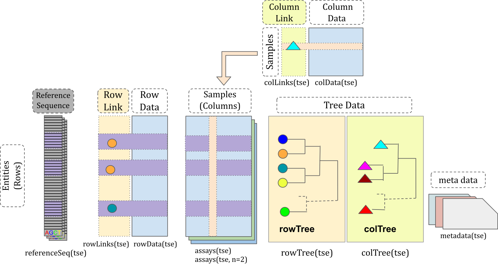
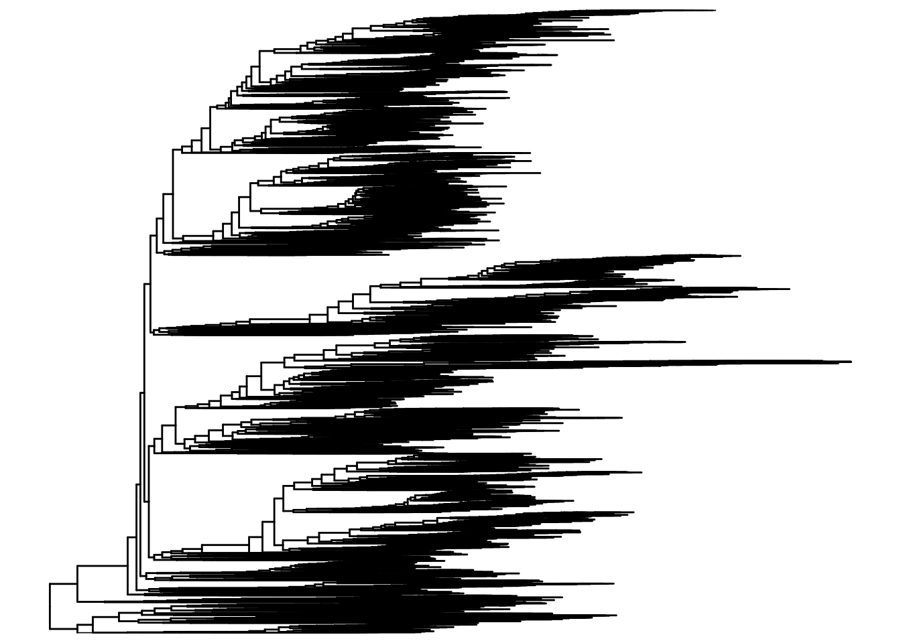
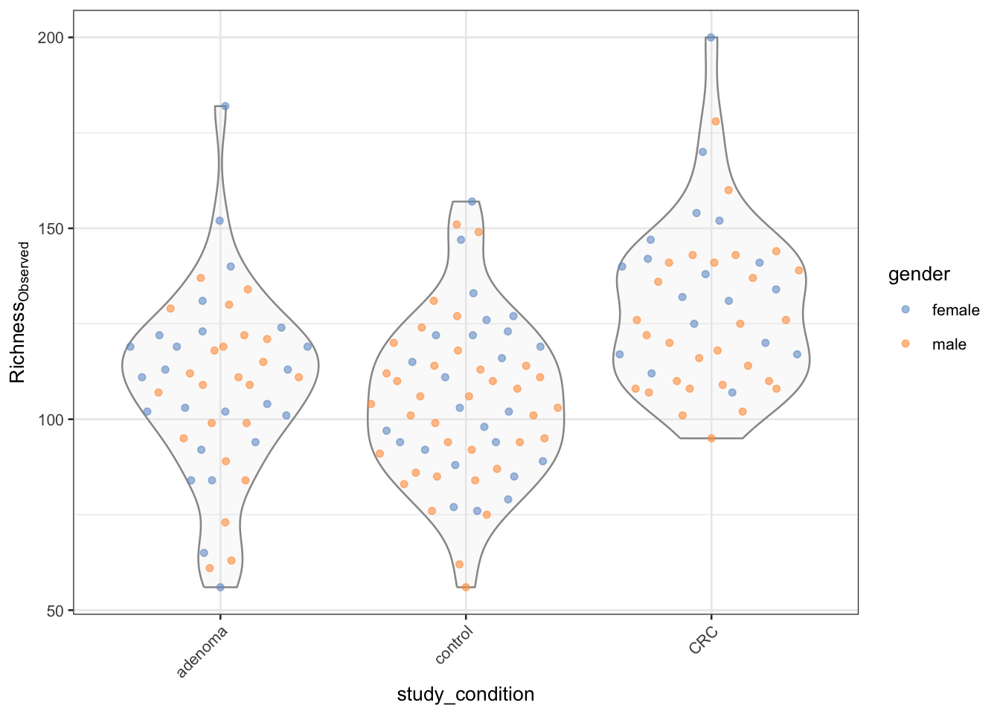
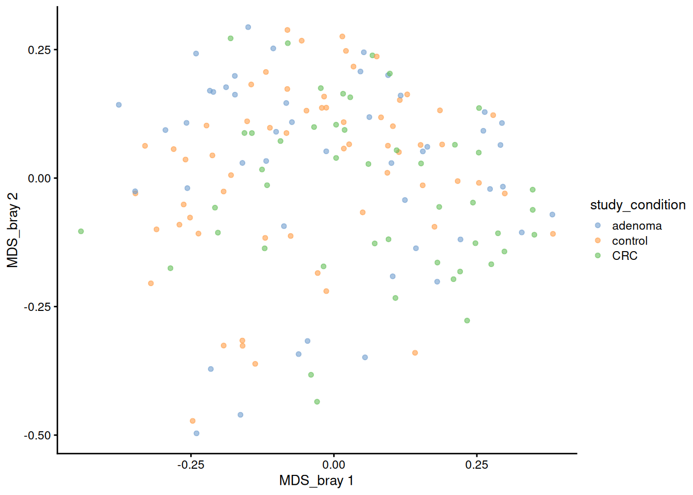
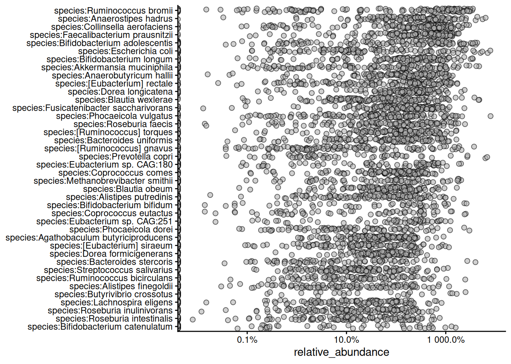
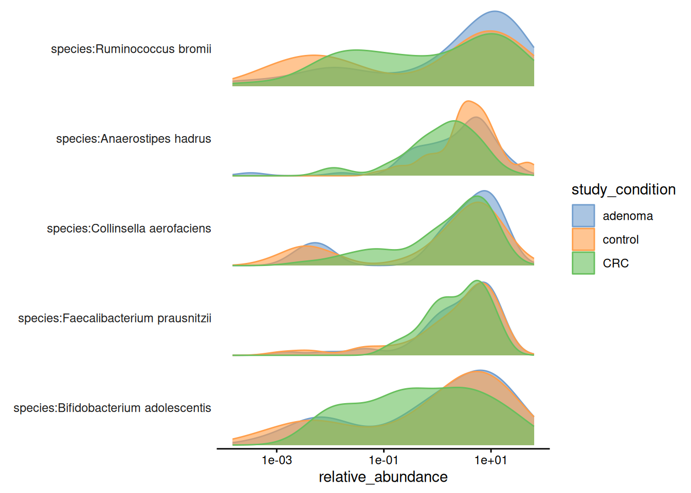
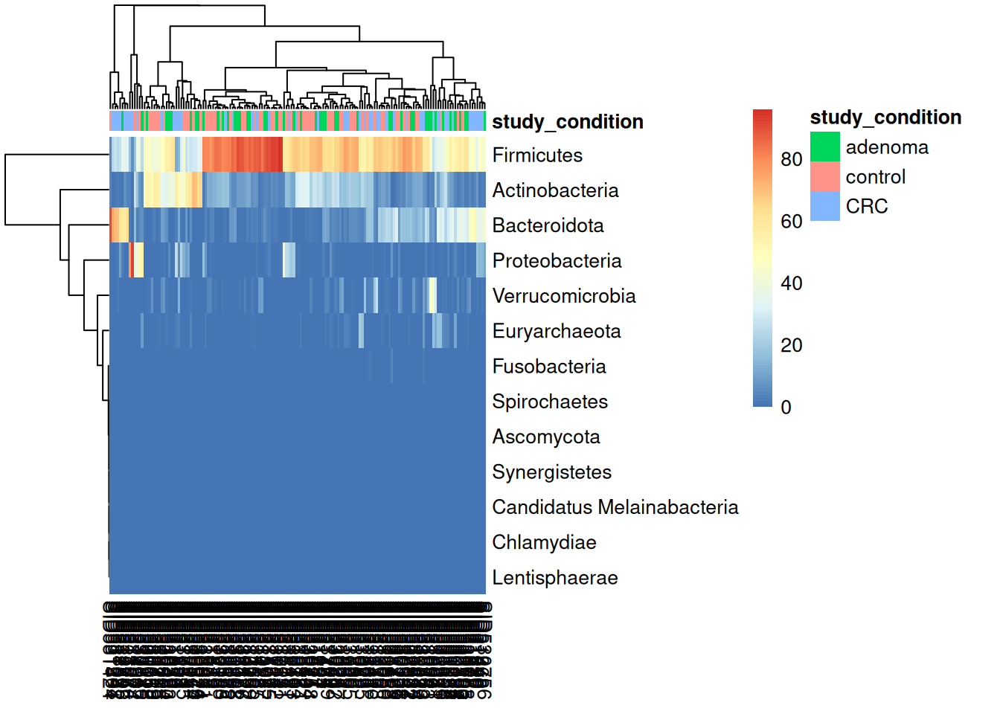
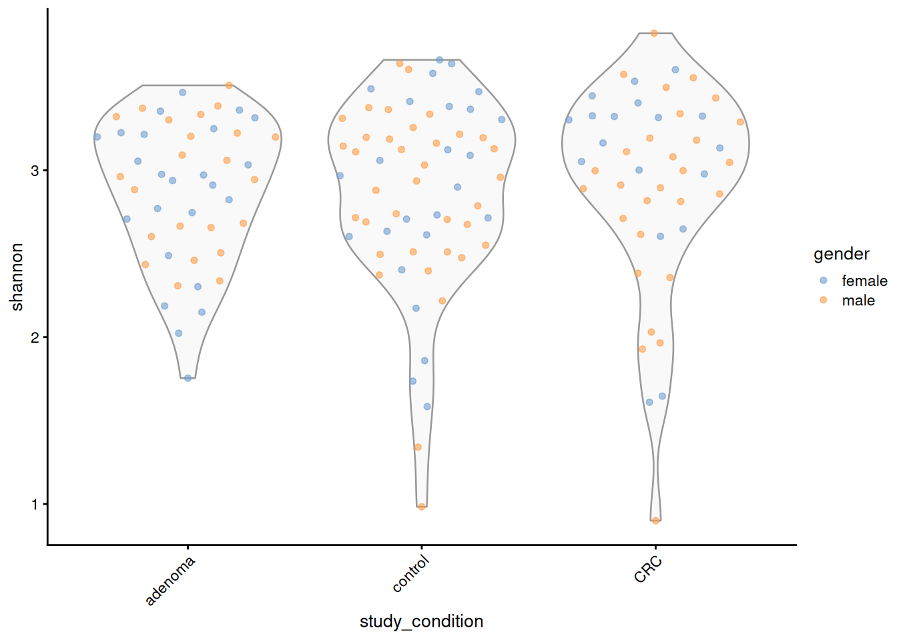

# 33  Analyzing microbiome data

Code

Author

Affiliation

[Sean Davis](https://seandavi.github.io/) [](mailto:seandavi@gmail.com)

[University of Colorado  
Anschutz School of Medicine](https://medschool.cuanschutz.edu/)

Published

June 1, 2024

Modified

September 19, 2026

The human microbiome is a crowded ecosystem of bacteria, viruses, fungi, and other microorganisms living in and on the human body. These microbes shape human health and disease, influencing everything from digestion and metabolism to immune function and mood. Working out *which* microbes are present, in *what* proportions, and how those proportions shift between healthy and sick people is one of the most active areas in biology today.

In this chapter you’ll take a curated gut-microbiome dataset from a colorectal cancer study, load it into R, and ask the kinds of questions a microbiome researcher asks: How diverse is each sample? Do cancer patients and controls separate when you compare whole communities? Which microbes dominate? You’ll do all of this without leaving a single, self-describing data object.

We’ll assume the raw sequencing data has already been processed into a tidy abundance table, so you can focus on the analysis rather than the bioinformatics that came before it.

## 33.1 What you’ll learn

By the end of this chapter you will be able to:

- Load a curated microbiome dataset as a `TreeSummarizedExperiment` object.
- Reach into its parts with [`assays()`](https://rdrr.io/pkg/SummarizedExperiment/man/SummarizedExperiment-class.html), [`colData()`](https://rdrr.io/pkg/SummarizedExperiment/man/SummarizedExperiment-class.html), [`rowData()`](https://rdrr.io/pkg/SummarizedExperiment/man/SummarizedExperiment-class.html), and [`rowTree()`](https://rdrr.io/pkg/TreeSummarizedExperiment/man/TreeSummarizedExperiment-accessor.html).
- Subset samples and agglomerate features to a coarser taxonomic rank.
- Compute alpha diversity (within a sample) and beta diversity (between samples).
- Visualize community composition with abundance plots, an ordination, and a heatmap.

This chapter builds directly on the [SummarizedExperiment chapter](bioc-summarizedexperiment.llms.md). A `TreeSummarizedExperiment` *is* a `SummarizedExperiment` with a couple of extra parts, so if the three-linked-sheets idea (assays, `rowData`, `colData`) isn’t fresh, skim that chapter first.

## 33.2 Getting started

We’ll lean on the `mia` package (short for *microbiome analysis*) throughout this chapter. It provides a suite of tools for loading, transforming, and visualizing microbiome data, all built around the `SummarizedExperiment` and `TreeSummarizedExperiment` classes you’ll meet below.

`mia` is a released Bioconductor package, so you install it the usual way with `BiocManager`. If you don’t already have `BiocManager` itself, install that first (see the Bioconductor installation chapter), then run:

``` downlit
# Install the mia package (a normal Bioconductor install)
BiocManager::install("mia")
```

> **NOTE:**
>
> `mia` is a standard, released Bioconductor package. The `BiocManager::install("mia")` call above pulls the stable version that matches your Bioconductor release — the same way you install every other Bioconductor package in this book.

Once `mia` is installed, load it into your R session:

``` downlit
# Load the mia package
library(mia)
```

Now that the `mia` package is loaded, we can load the microbiome dataset that we will be working with.

## 33.3 Accessing microbiome datasets

There are many publicly available microbiome datasets you can use for analysis. Bioconductor provides several packages that bundle curated microbiome datasets, making it easy to load real data into R without first wrangling raw sequencing files.

[curatedMetagenomicData](https://bioconductor.org/packages/curatedMetagenomicsData) is a large collection of curated human microbiome datasets, provided as TreeSE objects (Pasolli et al. 2017). The resource provides curated human microbiome data including gene families, marker abundance, marker presence, pathway abundance, pathway coverage, and relative abundance for samples from different body sites. See the package homepage for more details on data availability and access.

[The microbiomeDataSets package](https://bioconductor.org/packages/microbiomeDataSets) provides a collection of curated microbiome datasets for teaching and research purposes. The package contains several example datasets that can be used to explore different aspects of microbiome analysis, such as alpha and beta diversity, differential abundance analysis, and visualization.

[The mia package](https://bioconductor.org/packages/mia) and several other packages provide example datasets for learning and testing the functions in the package. These datasets are typically small and easy to work with, making them ideal for learning how to analyze microbiome data in R.

## 33.4 Data containers

Bioconductor provides several specialized data structures for storing and working with microbiome data in R. These data structures are designed to handle the complex and high-dimensional nature of microbiome data and provide a convenient and efficient way to store, manipulate, and analyze microbiome data in R.

[SummarizedExperiment (SE)](https://bioconductor.org/packages/SummarizedExperiment) (Morgan et al. 2020) is a generic, highly optimized container for complex experimental data. It has become a common choice for many kinds of biomedical profiling data, such as RNA-seq, ChIP-seq, microarrays, flow cytometry, proteomics, and single-cell sequencing.

[TreeSummarizedExperiment](https://bioconductor.org/packages/TreeSummarizedExperiment) (Huang 2020) extends that container to carry hierarchical information — phylogenetic trees and sample hierarchies — alongside the usual assays and metadata.

> **NOTE:**
>
> In the [SummarizedExperiment chapter](bioc-summarizedexperiment.llms.md) you met the *three linked sheets* picture: an **assay** sheet of numbers (features × samples), a **row** sheet (`rowData`) describing each feature, and a **column** sheet (`colData`) describing each sample, all locked together so they can never drift out of sync.
>
> A `TreeSummarizedExperiment` is exactly those three sheets with one more piece pinned to the side: a **phylogenetic tree** (`rowTree`) that records how the features — the microbes — are related to one another by evolution. When you drop a microbe from the object, it drops from the tree too. So everything you already know about reaching into a `SummarizedExperiment` carries over here; the tree is the only genuinely new idea.

## 33.5 Loading a microbiome dataset

We will be using the `curatedMetagenomicData` package to load the `FengQ_2015` dataset. This dataset contains microbiome data from a study by [Feng et al. (2015)](https://pubmed.ncbi.nlm.nih.gov/25758642/). The curatedMetagenomicData package provides a convenient interface for accessing microbiome datasets that have been pre-processed and curated for analysis.

> **NOTE:**
>
> Take a moment to read at least the title and abstract of the paper. We won’t reproduce its analysis, but connecting the code in this workflow to the underlying biology and research question will make everything that follows more meaningful.

``` downlit
# Again, before using a package, we must install it
# just once.
BiocManager::install('curatedMetagenomicData')
```

Once installed, we can use the package.

Ignore the details of the next few lines of code for now, but suffice it to say that what the code will do for us is to load a dataset for downstream analysis.

``` downlit
# Load the FengQ_2015 dataset
library(curatedMetagenomicData)
tse <- curatedMetagenomicData("FengQ_2015.relative_abundance", dryrun = FALSE, rownames = "short")[[1]]
```


    $`2021-03-31.FengQ_2015.relative_abundance`
    dropping rows without rowTree matches:
      k__Bacteria|p__Actinobacteria|c__Coriobacteriia|o__Coriobacteriales|f__Atopobiaceae|g__Olsenella|s__Olsenella_profusa
      k__Bacteria|p__Actinobacteria|c__Coriobacteriia|o__Coriobacteriales|f__Coriobacteriaceae|g__Collinsella|s__Collinsella_stercoris
      k__Bacteria|p__Actinobacteria|c__Coriobacteriia|o__Coriobacteriales|f__Coriobacteriaceae|g__Enorma|s__[Collinsella]_massiliensis
      k__Bacteria|p__Firmicutes|c__Bacilli|o__Bacillales|f__Bacillales_unclassified|g__Gemella|s__Gemella_bergeri
      k__Bacteria|p__Firmicutes|c__Bacilli|o__Lactobacillales|f__Carnobacteriaceae|g__Granulicatella|s__Granulicatella_elegans
      k__Bacteria|p__Firmicutes|c__Clostridia|o__Clostridiales|f__Ruminococcaceae|g__Ruminococcus|s__Ruminococcus_champanellensis
      k__Bacteria|p__Firmicutes|c__Erysipelotrichia|o__Erysipelotrichales|f__Erysipelotrichaceae|g__Bulleidia|s__Bulleidia_extructa
      k__Bacteria|p__Proteobacteria|c__Betaproteobacteria|o__Burkholderiales|f__Sutterellaceae|g__Sutterella|s__Sutterella_parvirubra
      k__Bacteria|p__Synergistetes|c__Synergistia|o__Synergistales|f__Synergistaceae|g__Cloacibacillus|s__Cloacibacillus_evryensis

    Duplicated labels were made unique.

This code goes out to the internet and downloads the dataset for you. The `tse` object is a `TreeSummarizedExperiment` object that contains the microbiome data from the Feng et al. (2015) study. The `TreeSummarizedExperiment` class is a specialized data structure for storing microbiome data in R, and it is used by the `mia` package for microbiome analysis.

> **TIP:**
>
> If you are working with your own microbiome data, you will often need to load it into R using functions like [`read.csv()`](https://rdrr.io/r/utils/read.table.html) or [`read.table()`](https://rdrr.io/r/utils/read.table.html) to read tabular data files. Make sure your data is properly formatted and cleaned before loading it into R for analysis.

Once the data is loaded, you can start exploring its structure and contents. The `tse` object is a `TreeSummarizedExperiment`. You can think of it as a richer relative of a `data.frame`: it has many specialized slots for storing the parts of a microbiome experiment, laid out in [Figure fig-tse-anatomy](#fig-tse-anatomy). We’ll use a handful of accessor functions to look inside it. See the [TreeSummarizedExperiment](https://bioconductor.org/packages/TreeSummarizedExperiment) package for the full details.

In microbiome data science, containers like this one link a taxonomic abundance table to rich side information about both the features (the microbes) and the samples. That abundance data can come from 16S rRNA amplicon sequencing, metagenomic sequencing, phylogenetic microarrays, or other methods. A single experiment often holds several versions of the data at once — raw counts plus transformed or agglomerated versions derived from them — and the container keeps them all together.

[](images/treesummarizedexperiment.png "Figure 33.1: Anatomy of a TreeSummarizedExperiment. On top of the assay matrix, rowData, and colData it shares with a SummarizedExperiment, it adds slots that record hierarchy: a rowTree holding a tree over the features (here, the taxonomic/phylogenetic relationships among microbes) with rowLinks tying each assay row to a node on that tree; an optional colTree/colLinks doing the same for the samples; and an optional referenceSeq storing a reference sequence for each feature. The tree slots are what make this container a natural fit for microbiome data, where features are related by a phylogeny.")

Figure 33.1: Anatomy of a TreeSummarizedExperiment. On top of the assay matrix, `rowData`, and `colData` it shares with a SummarizedExperiment, it adds slots that record *hierarchy*: a **`rowTree`** holding a tree over the features (here, the taxonomic/phylogenetic relationships among microbes) with **`rowLinks`** tying each assay row to a node on that tree; an optional **`colTree`**/**`colLinks`** doing the same for the samples; and an optional **`referenceSeq`** storing a reference sequence for each feature. The tree slots are what make this container a natural fit for microbiome data, where features are related by a phylogeny.

To get an overview of the data, we can simply type the name of the object in the R console:

``` downlit
# Print the object
tse
```

    class: TreeSummarizedExperiment 
    dim: 606 154 
    metadata(0):
    assays(1): relative_abundance
    rownames(606): species:Faecalibacterium prausnitzii
      species:Streptococcus salivarius ... species:Lactobacillus
      kullabergensis species:Lactobacillus kimbladii
    rowData names(7): superkingdom phylum ... genus species
    colnames(154): SID31004 SID31009 ... SID532832 SID532915
    colData names(28): study_name subject_id ... triglycerides hba1c
    reducedDimNames(0):
    mainExpName: NULL
    altExpNames(0):
    rowLinks: a LinkDataFrame (606 rows)
    rowTree: 1 phylo tree(s) (10430 leaves)
    colLinks: NULL
    colTree: NULL

Read that printout like the label on a box. The `dim` line tells you how many features (rows) and samples (columns) you have; the `assays`, `colData`, `rowData`, and `rowTree` lines preview the parts described above. Notice that the *numbers* themselves are not printed — the dataset is far too large for that — so R shows you the shape and the index of contents instead.

Next, we’ll look at some of the key components of the `TreeSummarizedExperiment` object and how to access and manipulate them.

### 33.5.1 Experimental measurements: `assays`

When you work with high-throughput biological data, the result of the workflow usually resembles an Excel spreadsheet: samples down the columns, features (genes, microbes, CpG sites, …) down the rows. The numbers in that grid are called *assay* data, because they come from running an assay — a measurement of the presence and abundance of something. For a microbiome study, an assay tells you how much of each microbe is in each sample.

The original measurements are count-based, but those counts are often transformed — into logarithms, Centered Log-Ratio (CLR) values, or relative abundances — for different analyses. A single object can hold all of these versions at once, so the `assays` slot is a *list* of matrices rather than a single one.

``` downlit
assays(tse)
```

    List of length 1
    names(1): relative_abundance

An individual assay is reached with the [`assay()`](https://rdrr.io/pkg/SummarizedExperiment/man/SummarizedExperiment-class.html) function (singular), which returns a single matrix. Recall that to subset a matrix you use `[<rows>, <columns>]`, so here we ask for just the first five rows and columns to keep the output readable:

``` downlit
# just the first 5 rows and columns to make the results easier to see
assay(tse, "relative_abundance")[1:5, 1:5]
```

                                         SID31004 SID31009 SID31021 SID31030
    species:Faecalibacterium prausnitzii 13.58862  5.18307  6.09213  2.79834
    species:Streptococcus salivarius     11.00755  0.13897  0.17498  0.15692
    species:Anaerostipes hadrus           8.26264  7.55176  8.26219  1.07529
    species:Bacteroides stercoris         5.21961  0.00000  0.01189  0.59787
    species:Collinsella aerofaciens       4.58481  3.68522  2.67519  2.19600
                                         SID31071
    species:Faecalibacterium prausnitzii 12.96581
    species:Streptococcus salivarius      0.26242
    species:Anaerostipes hadrus           3.07124
    species:Bacteroides stercoris         0.06529
    species:Collinsella aerofaciens       7.94793

The values are relative abundances — each column sums to 1 across all microbes in that sample. Choose a different number of rows or columns if you like.

### 33.5.2 Sample information: `colData`

The `colData` holds everything you know about the *samples*. For a study like this one, that can include the sample ID, the type of sample (fecal, soil, mock, …), the subject’s age and sex, the disease status, and any experimental details you care to track (prep kit lot number, sequencing run, and so on).

``` downlit
colData(tse)
```

    DataFrame with 154 rows and 28 columns
               study_name  subject_id   body_site antibiotics_current_use
              <character> <character> <character>             <character>
    SID31004   FengQ_2015    SID31004       stool                      no
    SID31009   FengQ_2015    SID31009       stool                      no
    SID31021   FengQ_2015    SID31021       stool                      no
    SID31030   FengQ_2015    SID31030       stool                      no
    SID31071   FengQ_2015    SID31071       stool                      no
    ...               ...         ...         ...                     ...
    SID532796  FengQ_2015   SID532796       stool                      no
    SID532802  FengQ_2015   SID532802       stool                      no
    SID532826  FengQ_2015   SID532826       stool                      no
    SID532832  FengQ_2015   SID532832       stool                      no
    SID532915  FengQ_2015   SID532915       stool                      no
              study_condition                disease       age age_category
                  <character>            <character> <integer>  <character>
    SID31004              CRC CRC;fatty_liver;hype..        64        adult
    SID31009          control fatty_liver;hyperten..        68       senior
    SID31021          control                healthy        60        adult
    SID31030          adenoma adenoma;fatty_liver;..        70       senior
    SID31071          control            fatty_liver        68       senior
    ...                   ...                    ...       ...          ...
    SID532796         control fatty_liver;hyperten..        73       senior
    SID532802         control                healthy        68       senior
    SID532826         control T2D;fatty_liver;hype..        78       senior
    SID532832         adenoma adenoma;fatty_liver;..        68       senior
    SID532915         control                healthy        43        adult
                   gender     country non_westernized sequencing_platform
              <character> <character>     <character>         <character>
    SID31004         male         AUT              no       IlluminaHiSeq
    SID31009         male         AUT              no       IlluminaHiSeq
    SID31021       female         AUT              no       IlluminaHiSeq
    SID31030         male         AUT              no       IlluminaHiSeq
    SID31071         male         AUT              no       IlluminaHiSeq
    ...               ...         ...             ...                 ...
    SID532796      female         AUT              no       IlluminaHiSeq
    SID532802        male         AUT              no       IlluminaHiSeq
    SID532826        male         AUT              no       IlluminaHiSeq
    SID532832      female         AUT              no       IlluminaHiSeq
    SID532915      female         AUT              no       IlluminaHiSeq
              DNA_extraction_kit        PMID number_reads number_bases
                     <character> <character>    <integer>    <numeric>
    SID31004               MoBio    25758642     40898340   3649611221
    SID31009               MoBio    25758642     66107961   6196998053
    SID31021               MoBio    25758642     60789126   5708593447
    SID31030               MoBio    25758642     50300253   4741158330
    SID31071               MoBio    25758642     51945426   4913627034
    ...                      ...         ...          ...          ...
    SID532796              MoBio    25758642     50845712   4754848864
    SID532802              MoBio    25758642     41480415   3868696049
    SID532826              MoBio    25758642     35346002   3348368467
    SID532832              MoBio    25758642     42184599   3951224696
    SID532915              MoBio    25758642     51594677   4886998833
              minimum_read_length median_read_length      NCBI_accession
                        <integer>          <integer>         <character>
    SID31004                   30                 93 ERR688505;ERR688358
    SID31009                   30                 96 ERR688506;ERR688359
    SID31021                   30                 96 ERR688507;ERR688360
    SID31030                   30                 96 ERR688508;ERR688361
    SID31071                   30                 97 ERR688509;ERR688362
    ...                       ...                ...                 ...
    SID532796                  30                 95 ERR710428;ERR710419
    SID532802                  30                 96 ERR710429;ERR710420
    SID532826                  30                 97 ERR710430;ERR710421
    SID532832                  30                 96 ERR710431;ERR710422
    SID532915                  30                 96 ERR710432;ERR710423
                             curator       BMI disease_subtype        diet
                         <character> <numeric>     <character> <character>
    SID31004  Paolo_Manghi;Marisa_..     29.35       carcinoma  vegetarian
    SID31009  Paolo_Manghi;Marisa_..     32.00              NA    omnivore
    SID31021  Paolo_Manghi;Marisa_..     22.10              NA    omnivore
    SID31030  Paolo_Manghi;Marisa_..     34.11 advancedadenoma    omnivore
    SID31071  Paolo_Manghi;Marisa_..     23.45              NA    omnivore
    ...                          ...       ...             ...         ...
    SID532796 Paolo_Manghi;Marisa_..     26.56              NA    omnivore
    SID532802 Paolo_Manghi;Marisa_..     23.53              NA    omnivore
    SID532826 Paolo_Manghi;Marisa_..     31.22              NA    omnivore
    SID532832 Paolo_Manghi;Marisa_..     27.55 advancedadenoma    omnivore
    SID532915 Paolo_Manghi;Marisa_..     22.65              NA    omnivore
                    hdl       ldl         tnm triglycerides     hba1c
              <numeric> <numeric> <character>     <numeric> <numeric>
    SID31004         28        92      t1n0m0           172       5.2
    SID31009         50       157          NA           101        NA
    SID31021         60       122          NA            53        NA
    SID31030         74       146          NA            89        NA
    SID31071         40       231          NA           258        NA
    ...             ...       ...         ...           ...       ...
    SID532796        61       114          NA           100       5.4
    SID532802        67       158          NA            80       5.8
    SID532826        32        90          NA           212       6.9
    SID532832        51       184          NA           141       5.6
    SID532915        80       132          NA            51       5.1

There is a lot here. Scan the column names: alongside identifiers you’ll find biologically interesting variables such as `study_condition` (whether the subject had colorectal cancer or was a control), `age`, and `gender`. These are exactly the variables you’ll group and color by when you compare diversity and composition later in the chapter.

> **TIP:**
>
> By keeping a reasonably complete `colData`, you can answer questions about your findings without flipping back to an external Excel spreadsheet or a lab notebook. The metadata travels with the data.

### 33.5.3 Measured feature information: `rowData`

The `rowData` describes the *features* — here, the microbes. In microbiome work this is where taxonomic information lives: the kingdom, phylum, class, order, family, genus, and species of each detected organism. That taxonomy is what lets you identify which microbes are present and connect community composition to environmental or health factors.

``` downlit
head(rowData(tse))
```

    DataFrame with 6 rows and 7 columns
                                         superkingdom         phylum          class
                                          <character>    <character>    <character>
    species:Faecalibacterium prausnitzii     Bacteria     Firmicutes     Clostridia
    species:Streptococcus salivarius         Bacteria     Firmicutes        Bacilli
    species:Anaerostipes hadrus              Bacteria     Firmicutes     Clostridia
    species:Bacteroides stercoris            Bacteria   Bacteroidota    Bacteroidia
    species:Collinsella aerofaciens          Bacteria Actinobacteria Coriobacteriia
    species:Bifidobacterium longum           Bacteria Actinobacteria  Actinomycetia
                                                     order             family
                                               <character>        <character>
    species:Faecalibacterium prausnitzii     Eubacteriales   Oscillospiraceae
    species:Streptococcus salivarius       Lactobacillales   Streptococcaceae
    species:Anaerostipes hadrus              Eubacteriales    Lachnospiraceae
    species:Bacteroides stercoris            Bacteroidales     Bacteroidaceae
    species:Collinsella aerofaciens       Coriobacteriales  Coriobacteriaceae
    species:Bifidobacterium longum       Bifidobacteriales Bifidobacteriaceae
                                                    genus                species
                                              <character>            <character>
    species:Faecalibacterium prausnitzii Faecalibacterium Faecalibacterium pra..
    species:Streptococcus salivarius        Streptococcus Streptococcus saliva..
    species:Anaerostipes hadrus              Anaerostipes    Anaerostipes hadrus
    species:Bacteroides stercoris             Bacteroides  Bacteroides stercoris
    species:Collinsella aerofaciens           Collinsella Collinsella aerofaci..
    species:Bifidobacterium longum        Bifidobacterium Bifidobacterium longum

Each row is one microbe, and the columns walk down the taxonomic hierarchy from broad (phylum) to specific (species).

### 33.5.4 rowTree

A phylogenetic tree records evolutionary relationships, and microbiome analysis leans on it heavily. A `TreeSummarizedExperiment` tracks features and their positions in the tree through two accessors, [`rowTree()`](https://rdrr.io/pkg/TreeSummarizedExperiment/man/TreeSummarizedExperiment-accessor.html) and [`rowLinks()`](https://rdrr.io/pkg/TreeSummarizedExperiment/man/TreeSummarizedExperiment-accessor.html).

The tree itself is reached with [`rowTree()`](https://rdrr.io/pkg/TreeSummarizedExperiment/man/TreeSummarizedExperiment-accessor.html), which returns a `phylo` object — R’s standard representation of a tree.

> **NOTE:**
>
> The “tree” in a `TreeSummarizedExperiment` is a phylogenetic tree: it describes the inferred evolutionary relationships among species (or other entities) based on similarities and differences in their genetic or physical characteristics. The famous “tree of life” is one such tree, showing how all living organisms on Earth are related.
>
> In microbiome analysis, phylogenetic trees represent how the different microbial taxa in a sample are related by descent. This matters because it lets you ask not just *which* microbes are present, but how closely related they are — two samples can share no exact species yet still host very similar branches of the tree.
>
> The `phylo` class is R’s standard structure for holding such trees, and the `ggtree` package is the popular tool for drawing them.

``` downlit
rowTree(tse)
```


    Phylogenetic tree with 10430 tips and 10429 internal nodes.

    Tip labels:
      k__Archaea|p__Candidatus_Micrarchaeota|c__Candidatus_Micrarchaeota_unclassified|o__Candidatus_Micrarchaeota_unclassified|f__Candidatus_Micrarchaeota_unclassified|g__Candidatus_Micrarchaeota_unclassified|s__Candidatus_Micrarchaeota_archaeon_CG1_02_55_22, k__Archaea|p__Archaea_unclassified|c__Archaea_unclassified|o__Archaea_unclassified|f__Archaea_unclassified|g__Archaea_unclassified|s__archaeon_GW2011_AR15, k__Archaea|p__Candidatus_Diapherotrites|c__Candidatus_Diapherotrites_unclassified|o__Candidatus_Diapherotrites_unclassified|f__Candidatus_Diapherotrites_unclassified|g__Candidatus_Diapherotrites_unclassified|s__Candidatus_Diapherotrites_archaeon_CG08_land_8_20_14_0_20_34_12, k__Archaea|p__Archaea_unclassified|c__Archaea_unclassified|o__Archaea_unclassified|f__Archaea_unclassified|g__Archaea_unclassified|s__archaeon_GW2011_AR10, k__Archaea|p__Candidatus_Diapherotrites|c__Candidatus_Diapherotrites_unclassified|o__Candidatus_Diapherotrites_unclassified|f__Candidatus_Diapherotrites_unclassified|g__Candidatus_Diapherotrites_unclassified|s__Candidatus_Diapherotrites_archaeon_CG11_big_fil_rev_8_21_14_0_20_37_9, k__Archaea|p__Euryarchaeota|c__Euryarchaeota_unclassified|o__Euryarchaeota_unclassified|f__Euryarchaeota_unclassified|g__Euryarchaeota_unclassified|s__Euryarchaeota_archaeon_TMED173, ...

    Rooted; includes branch length(s).

The printed `phylo` object summarizes the tree: how many tips (one per microbe) and internal nodes it has. We can draw it with the `ggtree` package, which renders trees in several layouts (rectangular, circular, radial). Here’s the default rectangular view of this study’s tree:

``` downlit
library(ggtree)
ggtree(rowTree(tse))
```

[](310_microbiome_files/figure-html/unnamed-chunk-11-1.png)

Don’t try to read individual tips — at this scale the value is the overall shape, which shows how the detected microbes fan out across the branches of life. See the [ggtree](https://bioconductor.org/packages/ggtree) package and the [ggtree book](https://yulab-smu.top/treedata-book/) for much more on tree visualization.

The companion accessor [`rowLinks()`](https://rdrr.io/pkg/TreeSummarizedExperiment/man/TreeSummarizedExperiment-accessor.html) records *which* tip of the tree each feature corresponds to — the bookkeeping that keeps the assay rows and the tree in step:

``` downlit
rowLinks(tse)
```

    LinkDataFrame with 606 rows and 5 columns
                                                        nodeLab nodeLab_alias
                                                    <character>   <character>
    species:Faecalibacterium prausnitzii k__Bacteria|p__Firmi..    alias_3547
    species:Streptococcus salivarius     k__Bacteria|p__Firmi..    alias_4750
    species:Anaerostipes hadrus          k__Bacteria|p__Firmi..    alias_3579
    species:Bacteroides stercoris        k__Bacteria|p__Bacte..    alias_5690
    species:Collinsella aerofaciens      k__Bacteria|p__Actin..    alias_3019
    ...                                                     ...           ...
    species:Streptococcus gallolyticus   k__Bacteria|p__Firmi..    alias_4745
    species:Lactobacillus apis           k__Bacteria|p__Firmi..    alias_4851
    species:Anaerostipes sp. 494a        k__Bacteria|p__Firmi..    alias_3580
    species:Lactobacillus kullabergensis k__Bacteria|p__Firmi..    alias_4855
    species:Lactobacillus kimbladii      k__Bacteria|p__Firmi..    alias_4854
                                           nodeNum    isLeaf   whichTree
                                         <integer> <logical> <character>
    species:Faecalibacterium prausnitzii      3547      TRUE       phylo
    species:Streptococcus salivarius          4750      TRUE       phylo
    species:Anaerostipes hadrus               3579      TRUE       phylo
    species:Bacteroides stercoris             5690      TRUE       phylo
    species:Collinsella aerofaciens           3019      TRUE       phylo
    ...                                        ...       ...         ...
    species:Streptococcus gallolyticus        4745      TRUE       phylo
    species:Lactobacillus apis                4851      TRUE       phylo
    species:Anaerostipes sp. 494a             3580      TRUE       phylo
    species:Lactobacillus kullabergensis      4855      TRUE       phylo
    species:Lactobacillus kimbladii           4854      TRUE       phylo

Both `rowTree` and `rowLinks` are optional parts of a `TreeSummarizedExperiment`, but when present they carry the evolutionary structure that distinguishes this class from a plain `SummarizedExperiment`.

## 33.6 Wrangling and subsetting

A major advantage of the `SummarizedExperiment` family is that a single object encapsulates everything needed to describe the samples (`colData`), the measured features (`rowData`, `rowTree`), and the measurements themselves (`assays`). When you subset or manipulate the object, every one of those parts is subset to match — automatically, in lockstep.

The `mia` package adds functions for filtering, transforming, and reshaping microbiome data on top of that foundation.

### 33.6.1 Subsetting samples

You subset the samples in a `TreeSummarizedExperiment` much as you would the columns of a `data.frame`. Say you want to focus on older subjects. First, look at the `age` column in `colData`:

``` downlit
head(colData(tse)$age)
```

    [1] 64 68 60 70 68 66

Because reaching into `colData` is such a common operation, you can also grab a column directly with `$`, as if the object were a data frame:

``` downlit
head(tse$age)
```

    [1] 64 68 60 70 68 66

``` downlit
# and get a summary of all patient ages
summary(tse$age)
```

       Min. 1st Qu.  Median    Mean 3rd Qu.    Max. 
      43.00   63.00   68.00   66.85   72.00   86.00 

Age is a numeric variable. Let’s focus on older patients.

``` downlit
# Include all rows, but only columns (samples) who are older than 50
tse_subset_by_age <- tse[, tse$age > 50]
tse_subset_by_age
```

    class: TreeSummarizedExperiment 
    dim: 606 146 
    metadata(0):
    assays(1): relative_abundance
    rownames(606): species:Faecalibacterium prausnitzii
      species:Streptococcus salivarius ... species:Lactobacillus
      kullabergensis species:Lactobacillus kimbladii
    rowData names(7): superkingdom phylum ... genus species
    colnames(146): SID31004 SID31009 ... SID532826 SID532832
    colData names(28): study_name subject_id ... triglycerides hba1c
    reducedDimNames(0):
    mainExpName: NULL
    altExpNames(0):
    rowLinks: a LinkDataFrame (606 rows)
    rowTree: 1 phylo tree(s) (10430 leaves)
    colLinks: NULL
    colTree: NULL

`tse_subset_by_age` is a copy of the original `tse` holding only the 50-and-older subjects. To double-check, look at the ages in the new object — the minimum should now be above 50:

``` downlit
summary(tse_subset_by_age$age)
```

       Min. 1st Qu.  Median    Mean 3rd Qu.    Max. 
      52.00   63.25   68.00   68.02   72.00   86.00 

### 33.6.2 Agglomerating data

The microbiome features (organisms) that are measured may be measured at different taxonomic levels. For example, the data may be available at the species, genus, family, or phylum level. Agglomerating data is the process of summarizing the data at a higher taxonomic level by combining the abundances of the lower-level taxa. This can be useful for simplifying the data and reducing the dimensionality of the data.

The `agglomerateByRank` function in the `mia` package can be used to agglomerate the data at a specified taxonomic rank. For example, to agglomerate the data at the phylum level, you can use the following code:

``` downlit
new_tse <- agglomerateByRank(tse, rank = "phylum")
# observe the new object, particularly the number of features (rows)
new_tse
```

    class: TreeSummarizedExperiment 
    dim: 13 154 
    metadata(1): agglomerated_by_rank
    assays(1): relative_abundance
    rownames(13): Actinobacteria Ascomycota ... Synergistetes
      Verrucomicrobia
    rowData names(7): superkingdom phylum ... genus species
    colnames(154): SID31004 SID31009 ... SID532832 SID532915
    colData names(28): study_name subject_id ... triglycerides hba1c
    reducedDimNames(0):
    mainExpName: NULL
    altExpNames(0):
    rowLinks: a LinkDataFrame (13 rows)
    rowTree: 1 phylo tree(s) (13 leaves)
    colLinks: NULL
    colTree: NULL

Compare the number of features (rows) in `new_tse` to the original `tse`: collapsing hundreds of species into a few dozen phyla shrinks the data dramatically. That makes the data easier to plot and interpret, at the cost of fine-grained detail — a trade-off you’ll make often.

## 33.7 Community indices

Microbiome ecology offers many indices that summarize a sample, or compare a community of samples. Here we give just a brief introduction to two broad flavors: *alpha* diversity (diversity within a single sample) and *beta* diversity (how different two samples are from each other).

### 33.7.1 Alpha diversity

Diversity within a sample is captured by several related indices:

- **species richness** — the total number of species present;
- **equitability** — how evenly the species are distributed;
- **diversity** — a combination of the two.

`mia` provides functions for all of these. The [`addAlpha()`](https://microbiome.github.io/mia/reference/addAlpha.html) function calculates one or more indices and stores the results automatically in `colData`, right alongside your sample metadata.

> **NOTE:**
>
> Alpha diversity is a single number that captures how complex or “diverse” one microbiome sample is. Plenty of things can shift it — antibiotic use, chemotherapy, autoimmune conditions, dietary changes, and more.
>
> When you compare two groups (say, antibiotic users versus non-users), a significant difference in alpha diversity between them can point you toward real biology, or even toward a useful biomarker.

In the code below we calculate the Shannon and observed diversity indices.

``` downlit
tse <- addAlpha(tse, index = "shannon", assay.type = "relative_abundance")
tse <- addAlpha(tse, index = "observed", assay.type = "relative_abundance")
colnames(colData(tse))
```

     [1] "study_name"              "subject_id"             
     [3] "body_site"               "antibiotics_current_use"
     [5] "study_condition"         "disease"                
     [7] "age"                     "age_category"           
     [9] "gender"                  "country"                
    [11] "non_westernized"         "sequencing_platform"    
    [13] "DNA_extraction_kit"      "PMID"                   
    [15] "number_reads"            "number_bases"           
    [17] "minimum_read_length"     "median_read_length"     
    [19] "NCBI_accession"          "curator"                
    [21] "BMI"                     "disease_subtype"        
    [23] "diet"                    "hdl"                    
    [25] "ldl"                     "tnm"                    
    [27] "triglycerides"           "hba1c"                  
    [29] "shannon"                 "observed"               

The `observed` index simply counts the species present in a sample, while the `shannon` index also accounts for how evenly abundant those species are. Notice from the printed column names that both new indices now live in `colData`, ready to plot or model.

Look at the full [`colData()`](https://rdrr.io/pkg/SummarizedExperiment/man/SummarizedExperiment-class.html) and you’ll see the new diversity columns sitting beside the original sample metadata:

``` downlit
colData(tse)
```

    DataFrame with 154 rows and 30 columns
               study_name  subject_id   body_site antibiotics_current_use
              <character> <character> <character>             <character>
    SID31004   FengQ_2015    SID31004       stool                      no
    SID31009   FengQ_2015    SID31009       stool                      no
    SID31021   FengQ_2015    SID31021       stool                      no
    SID31030   FengQ_2015    SID31030       stool                      no
    SID31071   FengQ_2015    SID31071       stool                      no
    ...               ...         ...         ...                     ...
    SID532796  FengQ_2015   SID532796       stool                      no
    SID532802  FengQ_2015   SID532802       stool                      no
    SID532826  FengQ_2015   SID532826       stool                      no
    SID532832  FengQ_2015   SID532832       stool                      no
    SID532915  FengQ_2015   SID532915       stool                      no
              study_condition                disease       age age_category
                  <character>            <character> <integer>  <character>
    SID31004              CRC CRC;fatty_liver;hype..        64        adult
    SID31009          control fatty_liver;hyperten..        68       senior
    SID31021          control                healthy        60        adult
    SID31030          adenoma adenoma;fatty_liver;..        70       senior
    SID31071          control            fatty_liver        68       senior
    ...                   ...                    ...       ...          ...
    SID532796         control fatty_liver;hyperten..        73       senior
    SID532802         control                healthy        68       senior
    SID532826         control T2D;fatty_liver;hype..        78       senior
    SID532832         adenoma adenoma;fatty_liver;..        68       senior
    SID532915         control                healthy        43        adult
                   gender     country non_westernized sequencing_platform
              <character> <character>     <character>         <character>
    SID31004         male         AUT              no       IlluminaHiSeq
    SID31009         male         AUT              no       IlluminaHiSeq
    SID31021       female         AUT              no       IlluminaHiSeq
    SID31030         male         AUT              no       IlluminaHiSeq
    SID31071         male         AUT              no       IlluminaHiSeq
    ...               ...         ...             ...                 ...
    SID532796      female         AUT              no       IlluminaHiSeq
    SID532802        male         AUT              no       IlluminaHiSeq
    SID532826        male         AUT              no       IlluminaHiSeq
    SID532832      female         AUT              no       IlluminaHiSeq
    SID532915      female         AUT              no       IlluminaHiSeq
              DNA_extraction_kit        PMID number_reads number_bases
                     <character> <character>    <integer>    <numeric>
    SID31004               MoBio    25758642     40898340   3649611221
    SID31009               MoBio    25758642     66107961   6196998053
    SID31021               MoBio    25758642     60789126   5708593447
    SID31030               MoBio    25758642     50300253   4741158330
    SID31071               MoBio    25758642     51945426   4913627034
    ...                      ...         ...          ...          ...
    SID532796              MoBio    25758642     50845712   4754848864
    SID532802              MoBio    25758642     41480415   3868696049
    SID532826              MoBio    25758642     35346002   3348368467
    SID532832              MoBio    25758642     42184599   3951224696
    SID532915              MoBio    25758642     51594677   4886998833
              minimum_read_length median_read_length      NCBI_accession
                        <integer>          <integer>         <character>
    SID31004                   30                 93 ERR688505;ERR688358
    SID31009                   30                 96 ERR688506;ERR688359
    SID31021                   30                 96 ERR688507;ERR688360
    SID31030                   30                 96 ERR688508;ERR688361
    SID31071                   30                 97 ERR688509;ERR688362
    ...                       ...                ...                 ...
    SID532796                  30                 95 ERR710428;ERR710419
    SID532802                  30                 96 ERR710429;ERR710420
    SID532826                  30                 97 ERR710430;ERR710421
    SID532832                  30                 96 ERR710431;ERR710422
    SID532915                  30                 96 ERR710432;ERR710423
                             curator       BMI disease_subtype        diet
                         <character> <numeric>     <character> <character>
    SID31004  Paolo_Manghi;Marisa_..     29.35       carcinoma  vegetarian
    SID31009  Paolo_Manghi;Marisa_..     32.00              NA    omnivore
    SID31021  Paolo_Manghi;Marisa_..     22.10              NA    omnivore
    SID31030  Paolo_Manghi;Marisa_..     34.11 advancedadenoma    omnivore
    SID31071  Paolo_Manghi;Marisa_..     23.45              NA    omnivore
    ...                          ...       ...             ...         ...
    SID532796 Paolo_Manghi;Marisa_..     26.56              NA    omnivore
    SID532802 Paolo_Manghi;Marisa_..     23.53              NA    omnivore
    SID532826 Paolo_Manghi;Marisa_..     31.22              NA    omnivore
    SID532832 Paolo_Manghi;Marisa_..     27.55 advancedadenoma    omnivore
    SID532915 Paolo_Manghi;Marisa_..     22.65              NA    omnivore
                    hdl       ldl         tnm triglycerides     hba1c   shannon
              <numeric> <numeric> <character>     <numeric> <numeric> <numeric>
    SID31004         28        92      t1n0m0           172       5.2   3.28935
    SID31009         50       157          NA           101        NA   3.11014
    SID31021         60       122          NA            53        NA   3.38207
    SID31030         74       146          NA            89        NA   2.60265
    SID31071         40       231          NA           258        NA   3.14500
    ...             ...       ...         ...           ...       ...       ...
    SID532796        61       114          NA           100       5.4   3.66184
    SID532802        67       158          NA            80       5.8   3.19522
    SID532826        32        90          NA           212       6.9   3.16254
    SID532832        51       184          NA           141       5.6   3.21467
    SID532915        80       132          NA            51       5.1   3.48822
               observed
              <numeric>
    SID31004        101
    SID31009        106
    SID31021        116
    SID31030        107
    SID31071        113
    ...             ...
    SID532796       133
    SID532802       111
    SID532826       103
    SID532832        94
    SID532915       127

The `scater` package provides convenient plotting functions designed to work directly with the `SummarizedExperiment` family, so they can read straight from `colData`.

``` downlit
library(scater)
plotColData(tse,
    "observed",             # the y-axis value that we just calculated
    "study_condition",      # The x-axis
    colour_by = "gender"    # Color the points by gender
) +
    theme(axis.text.x = element_text(angle = 45, hjust = 1)) +
    labs(y = expression(Richness[Observed]))  # and give a meaningful label
```

[](310_microbiome_files/figure-html/plotAlphaDiversity-1.png)

Each point is one sample, grouped along the x-axis by study condition. Look at where the clouds of points sit: a noticeable shift in observed richness between the cancer and control groups would be the first hint that disease status is associated with how many species live in the gut.

### 33.7.2 Beta diversity

Where alpha diversity looks *within* a single sample, beta diversity compares two samples and asks how *different* their communities are. In microbiome analysis the most common measure is the Bray-Curtis dissimilarity between two samples A and B, defined as:

\\ BC\_{ij} = \frac{\sum\_{k} \|A\_{k} - B\_{k}\|}{\sum\_{k} (A\_{k} + B\_{k})} \\

where \\A\_{k}\\ and \\B\_{k}\\ are the abundances of taxon \\k\\ in samples A and B, respectively. The Bray-Curtis dissimilarity ranges from 0 (identical communities) to 1 (completely different communities).

The `mia` package provides functions for calculating beta diversity indices, such as the Bray-Curtis dissimilarity, Jaccard similarity, and UniFrac distance. These indices can be used to compare the microbial communities between different samples and to identify patterns and relationships between samples based on their microbial composition.

``` downlit
# Run PCoA on relabundance assay with Bray-Curtis distances
library(vegan)

tse <- runMDS(tse,
    FUN = vegdist,
    method = "bray",
    assay.type = "relative_abundance",
    name = "MDS_bray"
)
```

This code is a bit to unpack. It calculates the Bray-Curtis dissimilarity between every pair of samples in the `tse` object using the `vegdist` function from the `vegan` package. The resulting dissimilarity matrix is then used to perform a Principal Coordinate Analysis (PCoA) using the `runMDS` function from the `scater` package. The PCoA is a dimensionality reduction technique that projects the high-dimensional Bray-Curtis dissimilarity matrix onto a lower-dimensional space while preserving the pairwise distances between samples.

The resulting `TreeSummarizedExperiment` object now contains the Bray-Curtis dissimilarity matrix in the `MDS_bray` slot, which can be used to visualize the relationships between samples based on their microbial composition.

We can visualize the result with [`plotReducedDim()`](https://rdrr.io/pkg/scater/man/plotReducedDim.html) from the `scater` package, coloring each sample by its study condition:

``` downlit
# Create ggplot object
p <- plotReducedDim(tse, "MDS_bray", colour_by = "study_condition")

print(p)
```

[](310_microbiome_files/figure-html/showPCoA-1.png)

Each point is now a whole microbial community, and points that sit close together have similar compositions. The question to ask of this plot is whether the colors *separate*: if cancer and control samples fell into distinct regions, that would suggest disease status leaves a fingerprint on the community as a whole, not just on a handful of species. Try coloring by other `colData` variables to explore what else structures the data.

## 33.8 Microbial composition

Let’s now look at the microbial composition of the samples in the `tse` object. The microbial composition refers to the relative abundances of different microbial taxa in each sample. This information can provide insights into the diversity and structure of the microbial community in each sample and help identify patterns and relationships between samples based on their microbial composition.

The `mia` package provides functions for visualizing the microbial composition of samples, such as bar plots, heatmaps, and stacked bar plots. These plots can help you explore the relative abundances of different microbial taxa in each sample and identify patterns and relationships between samples based on their microbial composition.

### 33.8.1 Abundance

We can start with the 40 most abundant taxa. This plot shows, for each of those taxa, the spread of its relative abundance across all samples (one jittered point per sample), sorted by abundance.

``` downlit
library(miaViz)
```

    Loading required package: ggraph


    Attaching package: 'miaViz'

    The following object is masked from 'package:mia':

        plotNMDS

``` downlit
plotAbundanceDensity(tse,
    layout = "jitter",
    assay.type = "relative_abundance",
    n = 40
) +
    scale_x_log10(label = scales::percent)
```

    Warning in scale_x_log10(label = scales::percent): log-10 transformation
    introduced infinite values.

[](310_microbiome_files/figure-html/plotTopTaxa-1.png)

A density layout is handy for zooming in on a few taxa and splitting them by group. Here we take the top five and color by study condition — separated curves would suggest that taxon’s abundance differs between cancer and control samples.

``` downlit
plotAbundanceDensity(tse,
    layout = "density",
    assay.type = "relative_abundance",
    n = 5, colour_by = "study_condition"
) +
    scale_x_log10()
```

    Warning in scale_x_log10(): log-10 transformation introduced infinite values.

    Warning: Removed 53 rows containing non-finite outside the scale range
    (`stat_density()`).

[](310_microbiome_files/figure-html/unnamed-chunk-20-1.png)

### 33.8.2 Prevalence

*Abundance* asks how *much* of a taxon is present; *prevalence* asks in how *many* samples it appears at all. A microbe can be abundant in a few people yet rare across the cohort, or modestly abundant but present in nearly everyone — prevalence tells these apart.

Let’s agglomerate to the genus level and list the most prevalent genera, counting a genus as “present” wherever its relative abundance exceeds 1%:

``` downlit
tse_genus <- agglomerateByRank(tse, rank = "genus")
```

``` downlit
head(getPrevalence(tse_genus,
    detection = 1 / 100,
    sort = TRUE, assay.type = "relative_abundance",
    as.relative = TRUE
))
```

       Bifidobacterium              Dorea   Faecalibacterium Mediterraneibacter 
             0.7857143          0.7662338          0.7337662          0.7272727 
          Anaerostipes            Blautia 
             0.7272727          0.7077922 

Each value is the fraction of samples in which that genus clears the 1% threshold. A value near 1 marks a near-universal member of the gut community; a small value marks a genus that is only occasionally abundant.

## 33.9 Heatmaps

A heatmap lets you see abundance across every taxon and every sample at once. To keep it readable, we’ll agglomerate to the phylum level first — a handful of phyla, rather than hundreds of species — and then draw the grid, annotating each sample column with its study condition.

``` downlit
library(pheatmap)
tse_phylum <- agglomerateByRank(tse, rank = "phylum")
pheatmap(
    assay(tse_phylum, "relative_abundance"),
    annotation_col = as.data.frame(colData(tse_phylum)[, "study_condition", drop = FALSE])
)
```

[](310_microbiome_files/figure-html/unnamed-chunk-23-1.png)

Read the heatmap as a grid: each row is a phylum, each column a sample, and the color is that phylum’s relative abundance. The colored bar across the top marks each sample’s study condition. The clustering reorders rows and columns so that similar profiles sit together — if columns of the same condition tend to cluster, you’re seeing the same community-level signal the PCoA hinted at, now broken down phylum by phylum.

## 33.10 Summary

In this chapter you took a real curated dataset and ran a complete first-pass microbiome analysis without ever splitting your data across loose variables. You loaded the `FengQ_2015` study as a `TreeSummarizedExperiment` — a `SummarizedExperiment` with a phylogenetic tree attached — and reached into its parts with [`assays()`](https://rdrr.io/pkg/SummarizedExperiment/man/SummarizedExperiment-class.html), [`colData()`](https://rdrr.io/pkg/SummarizedExperiment/man/SummarizedExperiment-class.html), [`rowData()`](https://rdrr.io/pkg/SummarizedExperiment/man/SummarizedExperiment-class.html), and [`rowTree()`](https://rdrr.io/pkg/TreeSummarizedExperiment/man/TreeSummarizedExperiment-accessor.html). You subset samples by age and agglomerated features up to coarser taxonomic ranks, trusting the object to keep every part aligned. Then you summarized the communities: alpha diversity within each sample, beta diversity (Bray-Curtis) between samples visualized as a PCoA, and composition shown as abundance plots and a heatmap. Each of these is a doorway to a real research question about how the gut community differs between health and disease.

## 33.11 Exercises

These exercises reuse the `tse` object built earlier in the chapter. If you’ve started a fresh session, re-run the loading chunk first.

1.  How many samples in the dataset come from subjects older than 60? (Hint: subset on `tse$age` as you did for the 50+ subjects, then check the dimensions.)
2.  Agglomerate `tse` to the `family` rank and report how many features remain. How does that compare to the phylum-level count?
3.  Add the `shannon` alpha-diversity index to `tse` and make a [`plotColData()`](https://rdrr.io/pkg/scater/man/plotColData.html) plot of it against `study_condition`. Does the picture match what you saw for observed richness?

> **NOTE:**
>
> ``` downlit
> # 1. subset the samples (columns) and read off the new dimensions
> tse_over60 <- tse[, tse$age > 60]
> ncol(tse_over60)
> ```
>
>     [1] 128
>
> ``` downlit
> # 2. agglomerate to family level and count features (rows)
> tse_family <- agglomerateByRank(tse, rank = "family")
> nrow(tse_family)   # fewer than at species level, more than at phylum level
> ```
>
>     [1] 66
>
> ``` downlit
> # 3. add Shannon diversity, then plot it
> tse <- addAlpha(tse, index = "shannon", assay.type = "relative_abundance")
> ```
>
>     Warning: The following values are already present in `colData` and will be
>     overwritten: 'shannon'. Consider using the 'name' argument to specify
>     alternative names.
>
> ``` downlit
> plotColData(tse, "shannon", "study_condition", colour_by = "gender") +
>     theme(axis.text.x = element_text(angle = 45, hjust = 1))
> ```
>
> [](310_microbiome_files/figure-html/unnamed-chunk-24-1.png)
>
> The key idea in exercises 1 and 2: you subset or agglomerate the *whole object*, and every linked part — assays, `colData`, `rowData`, the tree — follows along automatically. You never have to remember to update them separately.

## 33.12 Resources

The `mia` developers maintain [Orchestrating Microbiome Analysis with Bioconductor (OMA)](https://microbiome.github.io/OMA/docs/devel/), an online book that goes well beyond this introduction — data loading, preprocessing, differential abundance, and a wide range of visualizations, all worked through with detailed examples. It’s the natural next step once you’re comfortable with the basics here.

For the phylogenetic-tree side of things, the [ggtree](https://bioconductor.org/packages/ggtree) package and its companion [ggtree book](https://yulab-smu.top/treedata-book/) cover tree visualization in depth.
