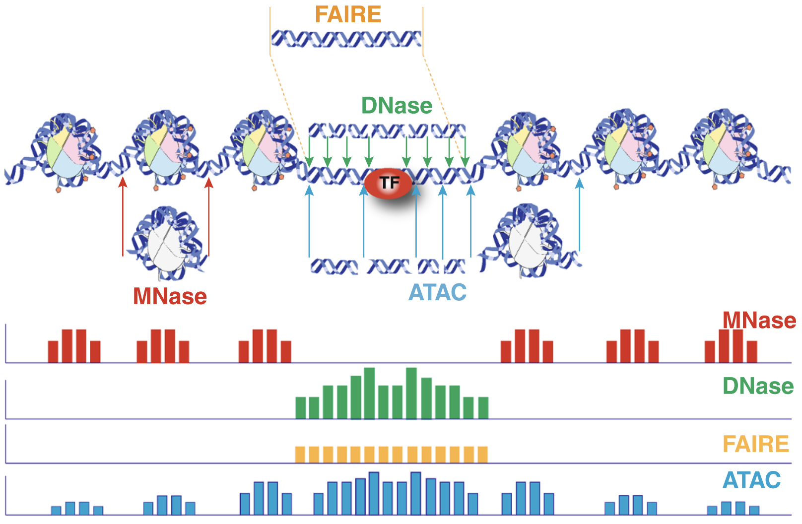
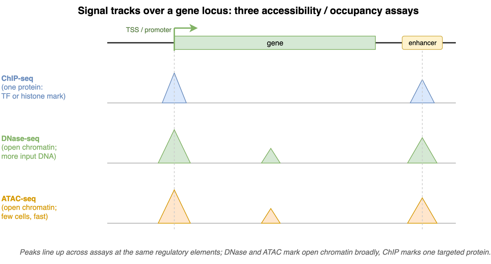
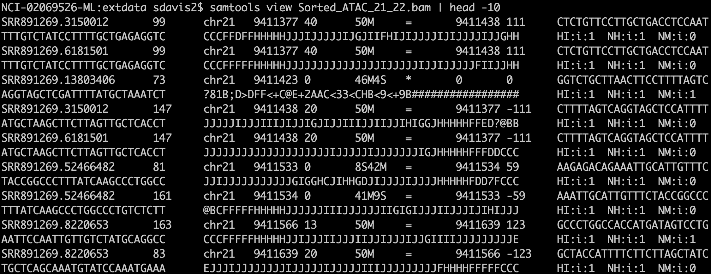
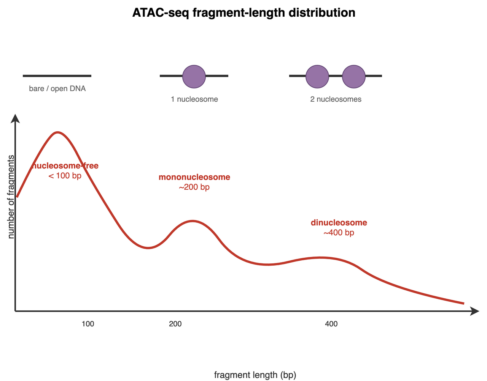

```{r include=FALSE}
library(knitr)
library(BiocStyle)
opts_chunk$set(cache = TRUE, message = FALSE, warning = FALSE)
```

Where is the DNA in a cell actually *open* for business? Most of the genome is
wound tightly around nucleosomes and is functionally silent at any given moment.
The stretches a cell is actively using — promoters of active genes, enhancers,
transcription-factor binding sites — are comparatively *accessible*. In this
chapter you'll take real sequencing data from an experiment that measures exactly
that accessibility, read it into Bioconductor, and walk it through the steps that
turn a pile of aligned reads into a biological picture: where reads pile up, how
long the sequenced fragments are, and how that fragment length reveals the
positions of nucleosomes around the start of every gene.

This chapter builds on the genomic-ranges ideas from
[the ranges chapter](../genomic_ranges.qmd) — `GRanges`, coverage, and the
run-length encoding that makes genome-wide signals compact. We'll lean on those
fundamentals rather than re-teach them, and put them to work on a complete
ATAC-seq mini-analysis.

## _R_ / _Bioconductor_ packages used {.unnumbered}

- `r Biocpkg('Rsamtools')`
- `r Biocpkg('GenomicRanges')`
- `r Biocpkg('GenomicFeatures')`
- `r Biocpkg('GenomicAlignments')`
- `r Biocpkg('rtracklayer')`
- `r Biocpkg('heatmaps')`
- `r Biocpkg('TxDb.Hsapiens.UCSC.hg19.knownGene')` (a large annotation download; install once with `BiocManager::install()`)

## What you'll learn

After working through this chapter, you'll be able to:

- Read a paired-end ATAC-seq BAM file into Bioconductor with
  `readGAlignmentPairs()`, filtering reads as you read.
- Summarize reads per chromosome and compute genome-wide **coverage** as a
  run-length-encoded signal.
- Examine the **fragment-length** distribution and explain what nucleosome-free
  and mononucleosome fragments tell you about chromatin.
- Split reads by fragment length and build **TSS heatmaps** showing that
  nucleosome-free reads enrich at transcription start sites.
- Export a coverage track as a BigWig file for viewing in IGV.

## Background

Chromatin accessibility assays measure the extent to which DNA is open and accessible.
Such assays now use high throughput sequencing as a quantitative readout. DNase assays — first using microarrays [@Crawford2006-nt] and then DNase-seq [@Crawford2006-bk] — require more input DNA and are labor-intensive, and have been largely supplanted by ATAC-seq [@Buenrostro2013-dz].

The Assay for Transposase Accessible Chromatin with high-throughput sequencing (ATAC-seq) method maps chromatin accessibility genome-wide. This method quantifies DNA accessibility with a hyperactive Tn5 transposase that cuts and inserts sequencing adapters into regions of chromatin that are accessible. High-throughput sequencing of the fragments produced maps these to regions of increased accessibility, transcription-factor binding sites, and nucleosome positioning. The method is both fast and sensitive and can be used as a replacement for DNase _and_ MNase.


An early review of chromatin accessibility assays [@Tsompana2014-yh] compares the use cases, pros and cons, and expected signals from each of the most common approaches (@fig-chromatin-assays).

```{r}
#| label: fig-chromatin-assays
#| echo: false
#| fig-cap: "Chromatin accessibility methods, compared. Representative DNA fragments generated by each assay are shown, with end locations within chromatin defined by colored arrows. Bar diagrams represent data signal obtained from each assay across the entire region. The footprint created by a transcription factor (TF) is shown for ATAC-seq and DNase-seq experiments. From @Tsompana2014-yh (*Epigenetics & Chromatin*, open access, CC BY 4.0)."

```

The first manuscript describing the ATAC-seq protocol showed how ATAC-seq data "line up" with other data types such as ChIP-seq and DNase-seq (@fig-greenleaf-multimodal). It also highlighted how fragment length correlates with specific genomic regions and characteristics [@Buenrostro2013-dz, Figure 2].

```{r}
#| label: fig-greenleaf-multimodal
#| echo: false
#| fig-cap: 'Different assays, concordant signal. Conceptual comparison of the signal tracks produced by ChIP-seq, DNase-seq, and ATAC-seq over the same gene locus. ChIP-seq maps one targeted protein (a transcription factor or histone mark), so it produces sharp peaks only where that protein binds. DNase-seq and ATAC-seq both report *open* chromatin and so light up the same accessible regulatory elements — the promoter at the transcription start site (TSS) and a distal enhancer. The peaks line up across assays even though the methods differ in what they measure and in how much input material they require (ATAC-seq needs far fewer cells and is faster). Conceptual schematic.'

```

Buenrostro et al. provide a detailed protocol for performing ATAC-Seq and quality control of results [@Buenrostro2015-dz]. Updated and modified protocols that improve on signal-to-noise and reduce input DNA requirements have been described.

## Informatics overview

ATAC-seq protocols typically use paired-end sequencing. The reads are aligned to the relevant _genome_ with `bowtie2`, `BWA`, or another short-read aligner. After appropriate manipulation — often with `samtools` — the result is a BAM file (@fig-bam-shot). Among other details, the BAM format records, for each read:

```{r}
#| label: fig-bam-shot
#| fig-cap: "A BAM file in text form. The output of `samtools view` is the text representation of a BAM file (called SAM format). Bioconductor and many other tools use BAM files for input. BAM files also often have a companion index `.bai` file that enables random access into the file, so you can read just one genomic region without reading the whole thing."

```

- sequence name (`chr1`)
- start position (integer)
- a _CIGAR_ string that describes the alignment in a compact form
- the sequence to which the pair aligns
- the position to which the pair aligns
- a bit flag field that describes multiple characteristics of the alignment
- the sequence and quality string of the read
- additional tags that tend to be aligner-specific


Duplicate fragments (those with the *same* start and end position of other reads) are marked and likely discarded. Reads that fail to align "properly" are also often excluded from analysis. It is worth noting that most software packages allow simple "marking" of such reads and that there is usually no need to create a special BAM file before proceeding with downstream work. 

After alignment and BAM processing, the workflow can switch to _Bioconductor_. 

## Working with sequencing data in Bioconductor

The _Bioconductor_ project includes several infrastructure packages for dealing with ranges (sequence name, start, end, +/- strand) on sequences [@Lawrence2013-he] as well as capabilities with working with Fastq files directly [@morgan2016rsamtools].

| Package  | Use cases |
|---|---|
| `r Biocpkg('Rsamtools')`  | low level access to FASTQ, VCF, SAM, BAM, BCF formats   |
| `r Biocpkg('GenomicRanges')`  | Container and methods for handling genomic regions   |
| `r Biocpkg('GenomicFeatures')`  | Work with transcript databases, gff, gtf and BED formats  |
| `r Biocpkg('GenomicAlignments')` | Reader for BAM format |
| `r Biocpkg('rtracklayer')` | import and export multiple UCSC file formats including BigWig and Bed |

Table: Commonly used Bioconductor packages and their high-level use cases.

As noted above, the output of an ATAC-seq experiment is a BAM file. Because paired-end sequencing is the standard for ATAC-seq, `readGAlignmentPairs()` is the right function to read it.

## Data import and quality control

```{r message=FALSE}
library(GenomicAlignments)
```

Reading a paired-end BAM file looks a little involved, but the following code will:

1. Read the included BAM file.
2. Include read pairs only (`isPaired = TRUE`)
3. Include properly paired reads (`isProperPair = TRUE`)
4. Include reads with mapping quality >= 1
5. Add a couple of additional fields, `mapq` (mapping quality) and `isize` (insert size) to the default fields. 


```{r readGreenleaf}
greenleaf <- readGAlignmentPairs(
    "https://github.com/seandavi/RBiocBook/raw/main/atac-seq/extdata/Sorted_ATAC_21_22.bam",
    param = ScanBamParam(
        mapqFilter = 1,
        flag = scanBamFlag(
            isPaired = TRUE,
            isProperPair = TRUE
        ),
        what = c("mapq", "isize")
    )
)
```

The object we just created, `greenleaf`, holds every read pair that passed our filters, with the start and end of each fragment and the two extra columns we asked for. (The [Exercises](#exercises) at the end of the chapter ask you to inspect it more closely.)

Now let's get a first sense of the data. A simple, useful quality-control check is the number of reads mapping to each chromosome.

```{r}
library(ggplot2)
library(dplyr)
chromCounts <- table(seqnames(greenleaf)) %>%
    data.frame() %>%
    dplyr::rename(chromosome = Var1, count = Freq)
```

To keep the example small, this BAM file includes only chromosomes 21 and 22, so @fig-chrom-counts shows just those two bars. With a full genome you'd see one bar per chromosome, and a chromosome with far fewer (or far more) reads than its neighbors can be an early sign of a problem.

```{r}
#| label: fig-chrom-counts
#| fig-cap: "Reads per chromosome. In our example data, only chromosomes 21 and 22 are present."
ggplot(chromCounts, aes(x = chromosome, y = count)) +
    geom_bar(stat = "identity") +
    theme(axis.text.x = element_text(angle = 45, hjust = 1))
```

Raw counts are hard to compare across chromosomes because longer chromosomes naturally collect more reads. Normalizing by chromosome length gives reads per megabase, which should be roughly similar across chromosomes if coverage is even.

```{r chromReadProps}
chromCounts <- chromCounts %>%
    dplyr::mutate(readsPerMb = (count / (seqlengths(greenleaf) / 1e6)))
```

With only two chromosomes the normalized plot (@fig-reads-per-mb) is a little underwhelming, but the same idea scales to a whole genome.

```{r}
#| label: fig-reads-per-mb
#| fig-cap: "Read counts normalized by chromosome length. Not a critical plot here, but with a full genome it shows each chromosome's relative contribution given its size."
ggplot(chromCounts, aes(x = chromosome, y = readsPerMb)) +
    geom_bar(stat = "identity") +
    theme(axis.text.x = element_text(angle = 45, hjust = 1)) +
    theme_bw()
```

## Coverage

The `coverage()` method for genomic ranges counts, at each base, how many features overlap that position. For our ATAC-seq read pairs, the coverage tells us how reads pile up — and tall piles are the peaks that mark accessible chromatin.

```{r}
cvg <- coverage(greenleaf)
class(cvg)
```

Coverage comes back as a `SimpleRleList`. The `names()` function gives us the names of its elements.

```{r}
names(cvg)
```

There is one element per chromosome. Let's look at the `chr21` entry:

```{r}
cvg$chr21
```

::: {.callout-note}
## What is an `Rle`?

Each chromosome's coverage is stored as an `Rle`, short for **run-length encoding**. Along a chromosome the coverage value stays the same for long stretches — millions of bases in a row might all be `0`. Instead of storing each base separately, an `Rle` records *(run length : value)* pairs. If the first 9,410,000 bases all have coverage `0`, that's stored as a single pair (9,410,000 : 0) rather than nine-million-plus zeros. Across a whole genome this saves an enormous amount of memory, which is why genome-wide signals in Bioconductor are almost always run-length encoded.
:::

The little function `plotCvgHistByChrom()` below plots a histogram of the coverage values seen on a chromosome — how many bases have coverage 0, coverage 1, coverage 2, and so on.

```{r}
library(ggplot2)
plotCvgHistByChrom <- function(cvg, chromosome) {
    cvgcounts <- as.data.frame(table(cvg[[chromosome]]))
    cvgcounts[, 1] <- as.numeric(as.character(cvgcounts[, 1]))
    colnames(cvgcounts) <- c("Coverage", "Count")
    ggplot(cvgcounts, aes(x = Coverage, y = Count)) +
        ggtitle(paste("Chromosome", chromosome)) +
        geom_point(alpha = 0.5) +
        geom_smooth(span = 0.2) +
        scale_y_log10() +
        theme_bw()
}
```

Drawing it for both chromosomes (@fig-coverage-hist):

```{r}
#| label: fig-coverage-hist
#| fig-cap: "Distribution of per-base coverage on chromosomes 21 and 22 (log-scaled y axis). Most bases have low coverage; the long tail of high-coverage bases corresponds to the peaks where reads pile up."
#| fig-subcap:
#|   - "Chromosome 21"
#|   - "Chromosome 22"
#| layout-ncol: 2
plotCvgHistByChrom(cvg, "chr21")
plotCvgHistByChrom(cvg, "chr22")
```

In @fig-coverage-hist (note the log-scaled y axis) the vast majority of bases have very low coverage, and the count drops sharply as coverage rises. That long right-hand tail of high-coverage bases is exactly what we care about — those are the accessible regions where reads accumulate into peaks.

## Fragment lengths

The first ATAC-seq manuscript [@Buenrostro2013-dz] highlighted a beautiful relationship between fragment length and nucleosomes (@fig-fraglength-nucleosome).

```{r}
#| label: fig-fraglength-nucleosome
#| fig-cap: "Schematic of the ATAC-seq fragment-length distribution. The Tn5 transposase cuts only where it can reach the DNA — between nucleosomes — so a fragment's length records how much chromatin sat between two cut sites. Short fragments (<100 bp) come from nucleosome-free DNA; fragments spanning one nucleosome pile up around ~200 bp and those spanning two around ~400 bp, giving the characteristic ladder of peaks roughly one nucleosome (~147 bp) apart. Conceptual schematic."

```

::: {.callout-important}
## Fragment length is a readout of nucleosome structure

The Tn5 transposase can only cut DNA where it can physically reach it — between nucleosomes, not through them. So the distance between two cut sites (the **fragment length**, also called insert size) tells you how much chromatin sat between them:

- **Nucleosome-free** fragments are short, **shorter than ~147 bp** (one nucleosome's worth of DNA). These come from open regions — promoters, enhancers, accessible regulatory DNA.
- **Mononucleosome** fragments are roughly **147–294 bp**: long enough to have wrapped one nucleosome.
- Longer fragments span two or more nucleosomes, giving the periodic ~147 bp ladder you see in @fig-fraglength-nucleosome.

Because active promoters are nucleosome-free right at the transcription start site (TSS), the short, nucleosome-free reads should pile up *at* the TSS, while mononucleosome reads should flank it. We'll confirm exactly that with a heatmap at the end of the chapter.
:::

We loaded the BAM file with insert sizes (`isize`), so we can read fragment lengths straight off that column. The insert size is the same (in absolute value) for the `first` and `second` read of a pair, so we'll just use `first`.

```{r}
# Pull the insert size (fragment length) off the first read of each pair.
fraglengths <- abs(mcols(GenomicAlignments::first(greenleaf))$isize)
```

Now we can look at the distribution of fragment lengths. The `density()` function gives a smoothed version (@fig-fraglength-density).

```{r}
#| label: fig-fraglength-density
#| fig-cap: "Fragment-length (insert-size) density for our ATAC-seq reads."
plot(density(fraglengths), xlim = c(0, 1000))
```

A `ggplot2` version of the same distribution (@fig-fraglength-ggplot) makes the periodic structure easier to read:

```{r}
#| label: fig-fraglength-ggplot
#| fig-cap: "Fragment-length distribution drawn with ggplot2, zoomed to fragments under 500 bp. The large peak of short fragments is the nucleosome-free signal; the bump near ~200 bp is mononucleosome fragments."
library(dplyr)
library(ggplot2)
fragLenPlot <- table(fraglengths) %>%
    data.frame() |>
    rename(
        InsertSize = fraglengths,
        Count = Freq
    ) |>
    mutate(
        InsertSize = as.numeric(as.vector(InsertSize)),
        Count = as.numeric(as.vector(Count))
    ) |>
    ggplot(aes(x = InsertSize, y = Count)) +
    geom_line()
print(fragLenPlot + theme_bw() + lims(x = c(-1, 500)))
```

Look at the shape: a tall peak at short fragment lengths, then a smaller hump around 200 bp. That first peak is the nucleosome-free DNA, and the hump is the mononucleosome fragments described in the callout above. This bimodal shape is one of the standard quality checks for an ATAC-seq library — a healthy library shows it clearly.

Because we can read each fragment's length, we can *split* the reads by their biology. First, the nucleosome-free reads, with insert size shorter than one nucleosome:

```{r}
gl_nf <- greenleaf[mcols(GenomicAlignments::first(greenleaf))$isize < 147]
```

And the mononucleosome reads, with insert size between 147 and 294 bp:

```{r}
gl_mn <- greenleaf[mcols(GenomicAlignments::first(greenleaf))$isize > 147 &
    mcols(GenomicAlignments::first(greenleaf))$isize < 294]
```

Now for the payoff. If the biology in the callout holds, the nucleosome-free reads should be enriched right at the TSS, while the mononucleosome reads should not be. We'll use the `r Biocpkg('heatmaps')` package to compare these two sets of reads against the transcription start sites of the human genome.

```{r}
library(TxDb.Hsapiens.UCSC.hg19.knownGene)
proms <- promoters(TxDb.Hsapiens.UCSC.hg19.knownGene, 250, 250)
seqs <- c("chr21", "chr22")
seqlevels(proms, pruning.mode = "coarse") <- seqs # only chromosome 21 and 22
```

Here `proms` is a set of windows reaching 250 bp on each side of every annotated TSS on chromosomes 21 and 22 — one row per promoter for the heatmaps to come. The `r Biocpkg('heatmaps')` package vignette describes the package's full capabilities if you'd like to go further.

We build one heatmap per read set, lining up the coverage over those promoter windows and scaling both to the same range so they're directly comparable.

```{r}
library(heatmaps)
gl_nf_hm <- CoverageHeatmap(proms, coverage(gl_nf), coords = c(-250, 250))
label(gl_nf_hm) <- "NucFree"
scale(gl_nf_hm) <- c(0, 10)
```

The "meta" plot in @fig-tss-meta averages the signal across all promoters, giving one summary curve per read set.

```{r}
#| label: fig-tss-meta
#| fig-cap: "Average signal around the TSS. Nucleosome-free reads peak sharply at position 0 (the TSS); mononucleosome reads stay comparatively flat."
gl_mn_hm <- CoverageHeatmap(proms, coverage(gl_mn), coords = c(-250, 250))
label(gl_mn_hm) <- "MonoNuc"
scale(gl_mn_hm) <- c(0, 10)
plotHeatmapMeta(list(gl_nf_hm, gl_mn_hm))
```

This is the result the callout predicted: the nucleosome-free curve spikes right at the TSS (position 0), while the mononucleosome curve barely moves. The full heatmaps in @fig-tss-heatmaps show the same thing promoter-by-promoter — each row is one TSS, and the bright vertical band in the nucleosome-free panel is the accessible signal stacking up at the start of gene after gene.

```{r}
#| label: fig-tss-heatmaps
#| fig-cap: "Per-promoter signal at the TSS. Mononucleosome reads on the left, nucleosome-free on the right; both scaled to the same range. Each row is one promoter."
plotHeatmapList(list(gl_mn_hm, gl_nf_hm))
```

## Viewing data in IGV

A heatmap summarizes thousands of regions at once, but sometimes you want to scroll along the genome and *look* at the pileups. The Integrative Genomics Viewer (IGV) is the standard tool for that. Install it from [the Broad Institute](https://software.broadinstitute.org/software/igv/download).

To load our data into IGV, we export the coverage as a BigWig file — a compact, indexed format IGV reads quickly.

```{r exportBW}
library(rtracklayer)
export.bw(coverage(greenleaf), "greenleaf.bw")
```

The [Exercises](#exercises) below ask you to open this track in IGV and explore it.

## Exercises

These exercises build on the `greenleaf` object you read in above. The first three are short coding tasks with solutions; the last two are hands-on exploration in IGV.

1. **What kind of object is `greenleaf`?** Find its class.

   ::: {.callout-note collapse="true"}
   ## Solution
   ```{r}
   class(greenleaf)
   ```
   `readGAlignmentPairs()` returns a `GAlignmentPairs` object — a container that keeps the two mates of each read pair together.
   :::

2. **Get the first read of each pair.** Use the `GenomicAlignments::first()` accessor to pull the first read of every pair as a `GAlignments` object, save it as `gl_first_read`, then use `mcols()` to look at its metadata columns.

   ::: {.callout-note collapse="true"}
   ## Solution
   ```{r}
   gl_first_read <- GenomicAlignments::first(greenleaf)
   gl_first_read
   mcols(gl_first_read)
   ```
   The metadata columns hold the extra fields we requested when reading the BAM — `mapq` (mapping quality) and `isize` (insert size, i.e. fragment length).
   :::

3. **How many read pairs map to each chromosome?** Summarize the counts per chromosome.

   ::: {.callout-note collapse="true"}
   ## Solution
   ```{r}
   table(seqnames(greenleaf))
   ```
   This is the same count we plotted in @fig-chrom-counts. Only chromosomes 21 and 22 are present in this trimmed example file.
   :::

4. **Explore the full track in IGV.** Open IGV, choose the `hg19` genome, then load the `greenleaf.bw` file you exported. Navigate to chromosomes 21 and 22 and look for the peaks. Do the tallest pileups fall near gene starts?

5. **Compare the nucleosome-free track in IGV.** Export the nucleosome-free reads (`gl_nf`) as their own BigWig file with `export.bw()`, load it alongside the full track, and compare. Where do you expect the strongest signals — and does what you see in IGV match the TSS heatmaps from @fig-tss-heatmaps?

## Summary

You took a paired-end ATAC-seq BAM file all the way from raw alignments to a biological result. You read and filtered the reads with `readGAlignmentPairs()`, checked reads per chromosome, and computed genome-wide coverage stored compactly as run-length-encoded `Rle` signals. You then used the fragment-length distribution to separate nucleosome-free from mononucleosome reads, and built TSS heatmaps showing that the nucleosome-free reads enrich sharply at transcription start sites — exactly what the biology of open chromatin predicts. Finally, you exported a coverage track for browsing in IGV. The same workflow scales from these two chromosomes to a whole genome.

## Additional work

If you work extensively with ATAC-seq, Thomas Carroll's workshop is an excellent next step:

- <https://rockefelleruniversity.github.io/RU_ATAC_Workshop.html>

Feel free to work through it. The `r Biocpkg('ATACseqQC')` package vignette also offers a great deal beyond quality control, and several more ATAC-seq packages are available in _Bioconductor_.

Calling peaks on the coverage itself — finding the significant pileups rather than
just plotting them — is most often done outside R with
[MACS](https://github.com/macs3-project/MACS) (`pip install macs2`).

