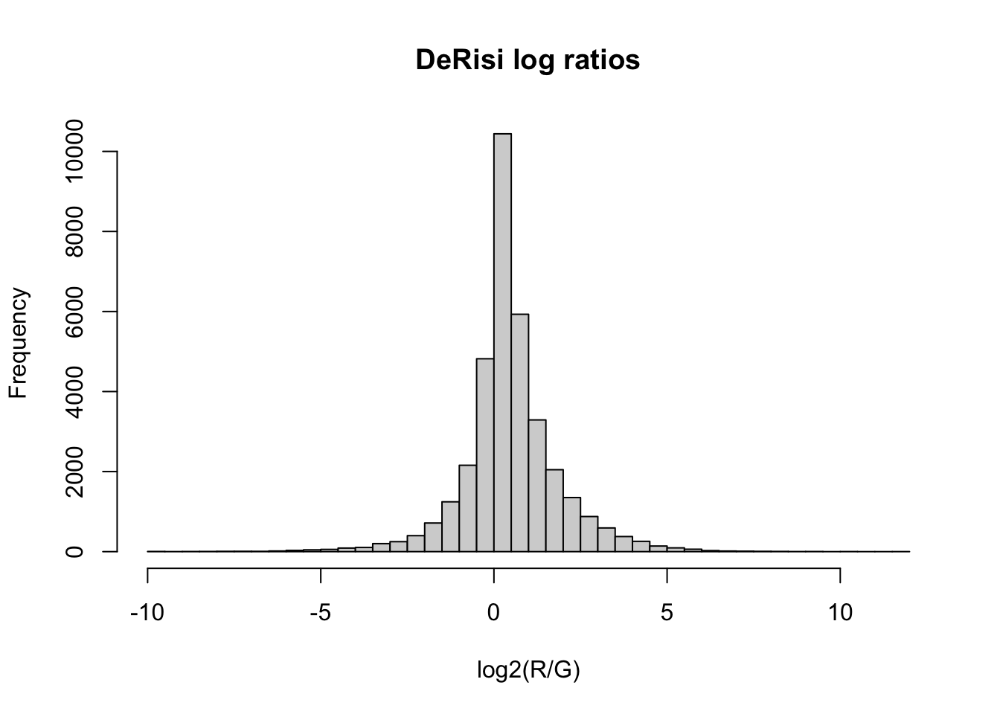
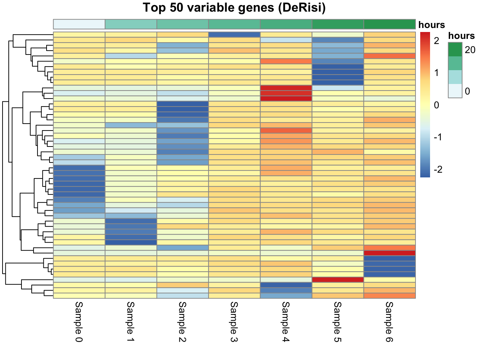

# 32  Building and sharing a SummarizedExperiment

Code

Author

Affiliation

[Sean Davis](https://seandavi.github.io/) [](mailto:seandavi@gmail.com)

[University of Colorado  
Anschutz School of Medicine](https://medschool.cuanschutz.edu/)

Published

June 1, 2024

Modified

September 19, 2026

In the [previous chapter](bioc-summarizedexperiment.llms.md) you worked with a `SummarizedExperiment` someone else had assembled — the `airway` dataset, ready to subset and plot. But a great deal of real data does *not* arrive that way. It arrives as a spreadsheet: a few columns describing the genes, a wall of numeric columns holding the measurements, and the sample information living only in your head or a separate file. Turning that loose table into a proper `SummarizedExperiment` is one of the most useful things you can do, because from that point on the object keeps itself consistent — and it speaks the same language as every Bioconductor analysis package you’ll reach for next.

In this chapter you’ll build a `SummarizedExperiment` from raw parts, add a derived assay, draw a clustered heatmap, and then save and share the result so a collaborator gets everything in a single file.

## 32.1 What you’ll learn

By the end of this chapter you will be able to:

- Assemble a `SummarizedExperiment` from a matrix (or several), a feature table, and a sample table — and explain the alignment rules the constructor enforces.
- Add a **derived assay** (e.g. a normalized or log-ratio matrix) that stays aligned to the originals.
- Select informative (variable) features and draw an unsupervised clustering heatmap.
- **Save** an experiment to one file and **share** it, provenance and all, with [`saveRDS()`](https://rdrr.io/r/base/readRDS.html)/[`readRDS()`](https://rdrr.io/r/base/readRDS.html).
- Explain why this one object plugs into the wider Bioconductor ecosystem.

> **TIP:**
>
> ``` downlit
> BiocManager::install(c("SummarizedExperiment", "pheatmap"))
> ```

## 32.2 The ingredients

To construct a `SummarizedExperiment` you supply:

- `assays`: one or more matrices (or matrix-like objects) of data — the numbers;
- `rowData`: a `DataFrame` describing the features (rows);
- `colData`: a `DataFrame` describing the samples (columns);
- optionally `metadata`: a list of anything else about the experiment.

We’ll build one from the **DeRisi** dataset — a classic yeast microarray time course measuring gene expression as cells exhaust their glucose and switch metabolic gears (the *diauxic shift*). It begins life as a plain `data.frame`: the first two columns identify each gene, and the rest are measurements.

``` downlit
library(SummarizedExperiment)
deRisi <- read.csv("https://raw.githubusercontent.com/seandavi/RBiocBook/main/data/derisi.csv")
head(deRisi)
```

          ORF  Name    R1    R2    R3    R4   R5   R6    R7 R1.Bkg R2.Bkg R3.Bkg
    1 YHR007C ERG11  7896  7484 14679 14617 9853 7599  6490   1155   1984   1323
    2 YBR218C  PYC2 12144 11177 10241  4820 4950 7047 17035   1074   1694   1243
    3 YAL051W FUN43  4478  6435  6230  6848 5111 7180  4497   1140   1950   1649
    4 YAL053W        6343  8243  6743  3304 3556 4694  3849   1020   1897   1196
    5 YAL054C  ACS1  1542  3044  2076  1695 1753 4806 10802   1082   1940   1504
    6 YAL055W        1769  3243  2094  1367 1853 3580  1956    975   1821   1185
      R4.Bkg R5.Bkg R6.Bkg R7.Bkg    G1    G2    G3    G4    G5    G6    G7 G1.Bkg
    1   1171    914   2445    981  8432  7173 11736 16798 12315 16111 13931   2404
    2    876   1211   2444    742 11509 10226 13372  6500  6255  9024  6904   2148
    3   1183    898   2637    927  5865  5895  5345  6302  5400  7933  5026   2422
    4    881   1045   2518    697  6762  7454  6323  3595  4689  5660  4145   2107
    5   1108    902   2610    980  3138  3785  2419  2114  2763  3561  1897   2405
    6    851   1047   2536    698  2844  4069  2583  1651  2530  3484  1550   1674
      G2.Bkg G3.Bkg G4.Bkg G5.Bkg G6.Bkg G7.Bkg
    1   2561   1598   1506   1696   2667   1244
    2   2527   1641   1196   1553   2569    848
    3   2496   1902   1501   1644   2808   1154
    4   2663   1607   1162   1577   2544    857
    5   2528   1847   1445   1713   2767   1142
    6   2648   1591   1114   1528   2668    870

We’ll pull the three pieces out of this table one at a time.

### 32.2.1 rowData — feature information

The first two columns describe each gene, so they become the `rowData`:

``` downlit
rdata <- deRisi[, 1:2]
head(rdata)
```

          ORF  Name
    1 YHR007C ERG11
    2 YBR218C  PYC2
    3 YAL051W FUN43
    4 YAL053W      
    5 YAL054C  ACS1
    6 YAL055W      

### 32.2.2 colData — sample information

The sample information isn’t in the file, so we supply it ourselves. Each of the seven columns of measurements is a timepoint in the experiment:

``` downlit
cdata <- DataFrame(sample = paste("Sample", 0:6), timepoint = 0:6,
                   hours = c(0, 9.5, 11.5, 13.5, 15.5, 18.5, 20.5))
cdata
```

    DataFrame with 7 rows and 3 columns
           sample timepoint     hours
      <character> <integer> <numeric>
    1    Sample 0         0       0.0
    2    Sample 1         1       9.5
    3    Sample 2         2      11.5
    4    Sample 3         3      13.5
    5    Sample 4         4      15.5
    6    Sample 5         5      18.5
    7    Sample 6         6      20.5

### 32.2.3 assays — the data

The DeRisi experiment recorded four *different* measurements for every gene at every timepoint:

| assay | description                   |
|-------|-------------------------------|
| `R`   | Red foreground fluorescence   |
| `G`   | Green foreground fluorescence |
| `Rb`  | Red background fluorescence   |
| `Gb`  | Green background fluorescence |

Each becomes its own matrix, sliced out of the numeric columns:

``` downlit
R  <- as.matrix(deRisi[, 3:9])
G  <- as.matrix(deRisi[, 10:16])
Rb <- as.matrix(deRisi[, 17:23])
Gb <- as.matrix(deRisi[, 24:30])
```

### 32.2.4 Aligning the names

Here is the rule that makes the whole container trustworthy. The constructor **checks that the pieces line up**: the row names of every assay matrix must match the row names of `rowData`, and the column names of every assay matrix must match the row names of `colData`. If they don’t, you get an error rather than a silent mismatch — the constructor refuses to build something inconsistent.

So we set those names explicitly. First the two annotation tables, keyed by gene (ORF) and by sample name:

``` downlit
rownames(rdata) <- rdata$ORF
rownames(cdata) <- cdata$sample
```

The four assay matrices all need the *same* gene names on their rows and the same sample names on their columns. Rather than repeat the same two lines four times, we gather the matrices into a **named list** and use [`lapply()`](https://rdrr.io/r/base/lapply.html) — which runs a function on every element of a list and returns a new list — to label them all at once:

``` downlit
assay_list <- list(R = R, G = G, Rb = Rb, Gb = Gb)
assay_list <- lapply(assay_list, function(mat) {
    rownames(mat) <- rdata$ORF
    colnames(mat) <- cdata$sample
    mat
})
```

The little function takes one matrix, sets its row and column names, and returns it; [`lapply()`](https://rdrr.io/r/base/lapply.html) applies it to `R`, `G`, `Rb`, and `Gb` in turn. We’re left with `assay_list`, a named list of four correctly-labeled matrices, ready to become the object’s assays.

### 32.2.5 Putting it together

``` downlit
se <- SummarizedExperiment(assays = assay_list,
                           rowData = rdata, colData = cdata)
se
```

    class: SummarizedExperiment 
    dim: 6102 7 
    metadata(0):
    assays(4): R G Rb Gb
    rownames(6102): YHR007C YBR218C ... YPR203W YPR204W
    rowData names(2): ORF Name
    colnames(7): Sample 0 Sample 1 ... Sample 5 Sample 6
    colData names(3): sample timepoint hours

One object now holds four aligned assays, the gene table, and the sample table. The constructor accepted it, which means everything lines up.

> **WARNING:**
>
> If you ever see an error about non-matching dimensions or names when building a `SummarizedExperiment`, that is the container doing its job. Check that each matrix is genes × samples (not transposed), and that its `rownames`/`colnames` match `rowData`/`colData`. The error is annoying once; the silent mismatch it prevents is annoying for the life of the paper.

## 32.3 Adding a derived assay

Real analysis rarely stops at the raw numbers. A natural quantity here is the background-corrected **log ratio** of red to green — a standard summary of two-color microarray signal. Because we compute it from assays that are already aligned, the result drops straight back into the object as a fifth assay, aligned forever:

``` downlit
logRatios <- log2((assay(se, "R") - assay(se, "Rb")) /
                  (assay(se, "G") - assay(se, "Gb")))
```

    Warning: NaNs produced

``` downlit
assays(se)$logRatios <- logRatios
assayNames(se)
```

    [1] "R"         "G"         "Rb"        "Gb"        "logRatios"

Reading the calculation from the inside out: subtract each channel’s background (`R - Rb` and `G - Gb`), divide red by green to get the ratio, and take `log2` so the scale is symmetric — equal red and green gives 0, twice as much red gives +1, half as much gives −1. The `assays(se)$logRatios <- ...` line then tucks the new matrix into the object beside the originals.

That is a real benefit worth pausing on: you can keep raw and processed measurements *in the same object*, each guaranteed to refer to the same genes and samples. Reach for any of them by name:

``` downlit
head(assay(se, "logRatios"))
```

              Sample 0     Sample 1  Sample 2   Sample 3   Sample 4 Sample 5
    YHR007C -1.2204686          NaN       NaN 2.70275677  1.6545902 5.260867
    YBR218C        NaN          NaN 2.9757832 2.39231742  1.9319816 3.983313
    YAL051W  0.1135715          NaN       NaN        NaN -1.3681061 2.138654
    YAL053W -1.3753298          NaN       NaN 0.05044902  1.0906497 5.215440
    YAL054C  0.2706476  0.333657387 0.0000000 0.31420165  0.3165815      NaN
    YAL055W  0.6209723 -0.001745548 0.2683547 0.11082813  0.4931189      NaN
             Sample 6
    YHR007C 4.8223618
    YBR218C       NaN
    YAL051W 1.2205754
    YAL053W 0.8875253
    YAL054C       NaN
    YAL055W       NaN

``` downlit
hist(assay(se, "logRatios"), breaks = 50,
     main = "DeRisi log ratios", xlab = "log2(R/G)")
```

[](bioc-se-building_files/figure-html/fig-derisi-hist-1.png "Figure 32.1: Distribution of background-corrected log ratios across the DeRisi time course.")

Figure 32.1: Distribution of background-corrected log ratios across the DeRisi time course.

## 32.4 A clustering heatmap of informative genes

With 6,400 genes, no heatmap can show them all — nor would you want it to. As in the previous chapter, we keep the **variable** genes, because a gene whose log ratio barely moves across the time course carries no information about the diauxic shift; the genes that rise and fall are the informative ones. We rank by standard deviation and keep the top 50.

The log-ratio calculation produces some non-finite values (a background-corrected signal can go negative, and `log2` of a negative number is `NaN`), so we first keep only genes measured cleanly at every timepoint:

``` downlit
lr <- assay(se, "logRatios")
lr <- lr[rowSums(!is.finite(lr)) == 0, ]    # genes finite at all 7 timepoints
top <- head(order(apply(lr, 1, sd), decreasing = TRUE), 50)
lr_top <- lr[top, ]
dim(lr_top)
```

    [1] 50  7

That filter line reads inside-out: `is.finite(lr)` is a `TRUE`/`FALSE` matrix marking the good values; `!is.finite(lr)` flips it to mark the *bad* ones; `rowSums(...)` counts the bad values in each gene’s row; and `== 0` keeps only the genes with **none** — a clean log ratio at all seven timepoints. Then `apply(lr, 1, sd)` gives each surviving gene’s standard deviation across the timepoints, and `head(order(..., decreasing = TRUE), 50)` keeps the 50 most variable.

Now the heatmap. Two deliberate choices: we **don’t** cluster the columns (`cluster_cols = FALSE`) so the samples stay in time order and we can read each gene’s trajectory left to right; and we **do** cluster the rows, which groups genes that move together. The column annotation — the time in hours — comes straight from `colData`.

``` downlit
library(pheatmap)
ann <- as.data.frame(colData(se)[, "hours", drop = FALSE])
pheatmap(lr_top,
         cluster_cols = FALSE,          # keep samples in time order
         cluster_rows = TRUE,           # group co-regulated genes
         annotation_col = ann,
         show_rownames = FALSE,
         scale = "row",
         main = "Top 50 variable genes (DeRisi)")
```

[](bioc-se-building_files/figure-html/fig-derisi-heatmap-1.png "Figure 32.2: The 50 most variable genes across the DeRisi diauxic-shift time course. Columns are held in time order; rows (genes) are clustered, grouping co-regulated genes. The annotation bar (hours) comes directly from colData.")

Figure 32.2: The 50 most variable genes across the DeRisi diauxic-shift time course. Columns are held in time order; rows (genes) are clustered, grouping co-regulated genes. The annotation bar (hours) comes directly from colData.

> **NOTE:**
>
> Clustering the **rows** here groups genes purely by how similarly their expression moves over time, with no labels supplied — the same *unsupervised* idea you met in the [previous chapter](bioc-summarizedexperiment.llms.md), now pointed at features instead of samples. Blocks of genes that rise together (or fall together) across the diauxic shift show up as bands. That is exactly the structure the [k-means chapter](kmeans.llms.md) sets out to find formally on this very dataset; the heatmap is the quick, visual version of the same question.

## 32.5 Saving and sharing

Here is the part that makes a collaborator’s day. Your experiment — four raw assays, a derived one, the gene table, the sample table, and any notes — is a single R object. Save it to a single file:

``` downlit
# In practice you'd give it a real name, e.g. "derisi_experiment.rds".
path <- tempfile(fileext = ".rds")
saveRDS(se, path)
```

Anyone who receives that file reads it back and has *everything*, already aligned, with nothing to re-link:

``` downlit
se2 <- readRDS(path)
se2
```

    class: SummarizedExperiment 
    dim: 6102 7 
    metadata(0):
    assays(5): R G Rb Gb logRatios
    rownames(6102): YHR007C YBR218C ... YPR203W YPR204W
    rowData names(2): ORF Name
    colnames(7): Sample 0 Sample 1 ... Sample 5 Sample 6
    colData names(3): sample timepoint hours

No “which spreadsheet had the sample labels?”, no “are the columns in the same order?”. The object is self-describing. Stash provenance in `metadata()` and it rides along too:

``` downlit
metadata(se)$processing <- "background-corrected log2 ratios; built in the RBioc Book"
metadata(se)$date <- "2026-06-06"
saveRDS(se, path)
metadata(readRDS(path))            # the notes survive the round trip
```

    $processing
    [1] "background-corrected log2 ratios; built in the RBioc Book"

    $date
    [1] "2026-06-06"

This is also how published datasets are distributed: many arrive as ready-made `SummarizedExperiment` objects through Bioconductor’s `ExperimentHub` and data packages (the `airway` package from the last chapter is exactly this). You load one line and get an analysis-ready object — because the author saved it in this shape.

## 32.6 Why this is worth it: the ecosystem payoff

Step back and ask what you actually *gained* by building this object instead of keeping a few matrices around.

- **It can’t silently desync.** Every subset, every new assay, stays aligned.
- **It carries its own context.** Feature annotation, sample annotation, and experiment notes travel with the numbers, in one file.
- **It is the common currency of Bioconductor.** This is the big one. Hundreds of analysis packages — `DESeq2` and `edgeR` and `limma` for differential expression, `scran` and `scater` for single cell, and many more — *take a `SummarizedExperiment` and hand one back*. You don’t reshape your data for each tool; you build the object once and plug it into all of them.
- **It is the root of a family.** The `SingleCellExperiment` you’ll meet in the [single-cell chapter](single_cell/setup.llms.md) and the `TreeSummarizedExperiment` in the [microbiome chapter](310_microbiome.llms.md) are both `SummarizedExperiment`s with extra parts bolted on. Learn this shape once and those feel familiar immediately. The [GEOquery chapter](geoquery.llms.md) and the [k-means chapter](kmeans.llms.md) both hand you data in exactly this form.

Build it once; everything downstream speaks the same language.

## 32.7 Summary

You took a flat spreadsheet and assembled it into a `SummarizedExperiment` — extracting `rowData`, supplying `colData`, building four assay matrices, and letting the constructor enforce that they all line up. You added a derived log-ratio assay that stays aligned, drew an unsupervised clustering heatmap of the most informative genes, and saved the whole thing to one self-describing file that carries its provenance. Most importantly, you now hold an object that the rest of the Bioconductor ecosystem accepts directly.

## 32.8 Exercises

1.  **Build a tiny one.** Create a `SummarizedExperiment` from a 4 × 3 matrix of your choosing, a `rowData` with a `gene` column, and a `colData` with a `group` column. Confirm its [`dim()`](https://rdrr.io/r/base/dim.html).
2.  **Break it on purpose.** Try to build a `SummarizedExperiment` where the assay has 3 columns but `colData` has 4 rows. What happens, and why is that a good thing?
3.  **Add a derived assay.** To the DeRisi `se`, add an assay called `Rcorr` equal to `R - Rb` (red minus red background). Confirm it appears in `assayNames(se)`.
4.  **Save and reload.** Save the DeRisi `se` to a temporary file, read it back, and confirm the assay names and `metadata()` survived.

> **NOTE:**
>
> ``` downlit
> # 1. a minimal SummarizedExperiment
> m <- matrix(1:12, nrow = 4,
>             dimnames = list(paste0("g", 1:4), paste0("s", 1:3)))
> rd <- DataFrame(gene = paste0("g", 1:4), row.names = paste0("g", 1:4))
> cd <- DataFrame(group = c("a", "a", "b"), row.names = paste0("s", 1:3))
> tiny <- SummarizedExperiment(assays = list(counts = m), rowData = rd, colData = cd)
> dim(tiny)
> ```
>
>     [1] 4 3
>
> ``` downlit
> # 2. mismatched dimensions -> the constructor errors (a feature, not a bug):
> #    it refuses to build an object whose pieces don't line up, so you can never
> #    end up with sample labels pointing at the wrong columns.
> try(SummarizedExperiment(assays = list(x = m[, 1:3]),
>                          colData = DataFrame(group = letters[1:4])))
> ```
>
>     Error in `rownames<-`(`*tmp*`, value = .get_colnames_from_first_assay(assays)) : 
>       invalid rownames length
>
> ``` downlit
> # 3. a derived assay, aligned automatically
> assays(se)$Rcorr <- assay(se, "R") - assay(se, "Rb")
> assayNames(se)
> ```
>
>     [1] "R"         "G"         "Rb"        "Gb"        "logRatios" "Rcorr"    
>
> ``` downlit
> # 4. round-trip through a file
> f <- tempfile(fileext = ".rds")
> saveRDS(se, f)
> back <- readRDS(f)
> assayNames(back)
> ```
>
>     [1] "R"         "G"         "Rb"        "Gb"        "logRatios" "Rcorr"    
>
> ``` downlit
> metadata(back)
> ```
>
>     $processing
>     [1] "background-corrected log2 ratios; built in the RBioc Book"
>
>     $date
>     [1] "2026-06-06"
