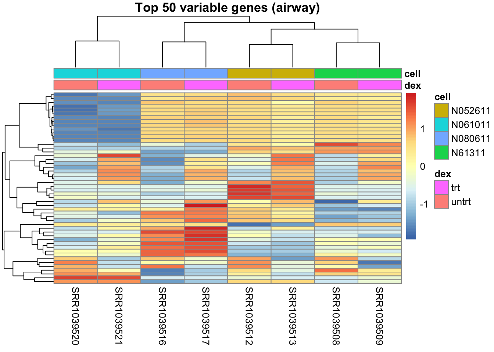
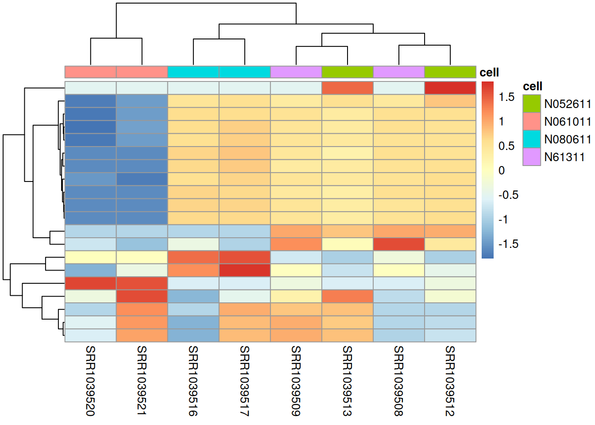

# 30  Working with a SummarizedExperiment

Code

Author

Affiliation

[Sean Davis](https://seandavi.github.io/) [](mailto:seandavi@gmail.com)

[University of Colorado  
Anschutz School of Medicine](https://medschool.cuanschutz.edu/)

Published

June 1, 2024

Modified

September 19, 2026

An RNA-seq or microarray experiment hands you several things at once: a matrix of numbers (counts or intensities), a description of every feature down the side (which gene is in each row), and a description of every sample across the top (which condition, which patient). Keep these in three separate variables and they *will* drift out of sync — you drop a bad sample from the count matrix, forget to drop it from the sample table, and now your “treated vs. control” labels point at the wrong columns. Mismatches exactly like this have produced retracted papers.

`SummarizedExperiment` is Bioconductor’s answer: one object that holds the assay matrix, the feature data, and the sample data together, and keeps them aligned for you whenever you subset. Almost every Bioconductor analysis package expects data in this shape, so learning to *work with* one — inspect it, reach into its parts, subset it, and plot from it — is the single most transferable skill in the Bioconductor half of this book.

This chapter is about using a `SummarizedExperiment` someone has handed you. The [next chapter](bioc-se-building.llms.md) shows you how to *build* one from raw parts and share it.

## 30.1 What you’ll learn

By the end of this chapter you will be able to:

- Explain why a `SummarizedExperiment` beats juggling a matrix and two separate tables — and show the bug it prevents.
- Map the `data.frame` operations you already know onto their `SummarizedExperiment` equivalents.
- Describe the three coordinated parts: [`assays()`](https://rdrr.io/pkg/SummarizedExperiment/man/SummarizedExperiment-class.html), [`rowData()`](https://rdrr.io/pkg/SummarizedExperiment/man/SummarizedExperiment-class.html), and [`colData()`](https://rdrr.io/pkg/SummarizedExperiment/man/SummarizedExperiment-class.html), plus experiment-wide `metadata()`.
- Subset an experiment several different ways — by position, by sample phenotype, by a feature property, by feature annotation, and by name — and trust that the metadata follows.
- Select the most variable genes and draw an annotated heatmap whose sample labels come straight from `colData`.

> **TIP:**
>
> The examples below use the `SummarizedExperiment` class, the `airway` example dataset, and a couple of plotting helpers. Install them once with `BiocManager`:
>
> ``` downlit
> BiocManager::install(c("SummarizedExperiment", "airway", "pheatmap"))
> ```

## 30.2 Why not just a data frame?

You already know data frames. Why learn a new container at all? Because a single data frame can hold *features down the side* or *sample information across the top*, but not both at once. To keep a real experiment you’d end up with two or three loose objects and a promise to yourself to keep them lined up. That promise is exactly what breaks.

Watch it break. Here is a tiny experiment as loose pieces — a counts matrix and a separate sample table:

``` downlit
counts <- matrix(c(10, 20, 30, 40, 50, 60), nrow = 2,
                 dimnames = list(c("GeneA", "GeneB"),
                                 c("S1", "S2", "S3")))
samples <- data.frame(id = c("S1", "S2", "S3"),
                      group = c("control", "control", "treated"))
counts
```

          S1 S2 S3
    GeneA 10 30 50
    GeneB 20 40 60

``` downlit
samples
```

      id   group
    1 S1 control
    2 S2 control
    3 S3 treated

Sample `S2` turns out to be bad, so you drop it from the counts matrix — but, in the rush, forget the sample table:

``` downlit
counts <- counts[, c("S1", "S3")]   # S2 removed here...
# ...but `samples` still has all three rows
counts
```

          S1 S3
    GeneA 10 50
    GeneB 20 60

``` downlit
samples
```

      id   group
    1 S1 control
    2 S2 control
    3 S3 treated

Nothing errors. R has no idea these two objects are supposed to correspond. But now column 2 of `counts` is `S3` (*treated*), while row 2 of `samples` still says `S2` (*control*). Any analysis that reads “group” from `samples` and “numbers” from `counts` is now silently wrong. *This* is the class of mistake that retracts papers, and it is invisible — no warning, no red text.

A `SummarizedExperiment` removes the promise. The three pieces live in one object, and a single subsetting operation updates all of them together. There is no second table to forget.

> **IMPORTANT:**
>
> You stop subsetting the matrix. You subset the **object**. Everything else — sample labels, feature annotation, every extra assay — follows automatically.

### 30.2.1 A `data.frame` → `SummarizedExperiment` Rosetta table

Most of what you know transfers directly; only the vocabulary changes.

| What you want | `data.frame` | `SummarizedExperiment` (`se`) |
|----|----|----|
| Dimensions | `dim(df)` | `dim(se)` (features × samples) |
| Row / column count | `nrow(df)`, `ncol(df)` | `nrow(se)`, `ncol(se)` |
| Names | `rownames(df)`, `colnames(df)` | `rownames(se)`, `colnames(se)` |
| A rectangular slice | `df[rows, cols]` | `se[features, samples]` |
| The numbers | the columns themselves | `assay(se)` / `assays(se)` |
| A piece of *sample* info | `df$group` | `se$group` (reaches `colData`) |
| A piece of *feature* info | — | `rowData(se)$symbol` |
| Filter by a sample property | `df[df$group == "treated", ]` | `se[, se$group == "treated"]` |

> **WARNING:**
>
> On a data frame, `df$x` pulls out a **column of data**. On a `SummarizedExperiment`, `se$x` pulls out a column of **sample metadata** (`colData`) — *not* a column of the assay. It is the single most common point of confusion. The numbers live in `assay(se)`; `$` is for sample annotation.

## 30.3 Anatomy of a `SummarizedExperiment`

A `SummarizedExperiment` is a matrix-like container where rows represent features of interest (e.g. genes, transcripts, exons) and columns represent samples. The object holds one or more assays, each a matrix-like object of numeric (or other) values. Information about the features is stored in a `DataFrame` accessible with [`rowData()`](https://rdrr.io/pkg/SummarizedExperiment/man/SummarizedExperiment-class.html); each of its rows describes the feature in the corresponding row of the object, and its columns are feature attributes (gene IDs, symbols, biotypes, and so on). Sample information lives in a parallel `DataFrame` reached with [`colData()`](https://rdrr.io/pkg/SummarizedExperiment/man/SummarizedExperiment-class.html).

[Figure fig-se-diagram](#fig-se-diagram) shows the class geometry and the vertical (column) and horizontal (row) relationships.

[](images/se.png "Figure 30.1: A SummarizedExperiment has three main components: the colData(), the rowData(), and the assays(). The accessors for each part share its name. Figure from the Bioconductor SummarizedExperiment vignette (Morgan, Obenchain, Hester & Pagès; Artistic-2.0).")

Figure 30.1: A `SummarizedExperiment` has three main components: the [`colData()`](https://rdrr.io/pkg/SummarizedExperiment/man/SummarizedExperiment-class.html), the [`rowData()`](https://rdrr.io/pkg/SummarizedExperiment/man/SummarizedExperiment-class.html), and the [`assays()`](https://rdrr.io/pkg/SummarizedExperiment/man/SummarizedExperiment-class.html). The accessors for each part share its name. Figure from the Bioconductor *SummarizedExperiment* vignette (Morgan, Obenchain, Hester & Pagès; Artistic-2.0).

> **NOTE:**
>
> Picture a spreadsheet workbook with three sheets that are *locked together*:
>
> - the **assay** sheet — the matrix of numbers, features (genes) × samples;
> - the **row** sheet (`rowData`) — one row of annotation per feature, lined up with the assay’s rows;
> - the **column** sheet (`colData`) — one row of annotation per sample, lined up with the assay’s columns.
>
> The magic is the lock: when you delete a sample, all three sheets update together, so the numbers and their labels can never disagree. Every accessor below is just a way of looking at one of these sheets.

    Loading required package: airway

We’ll use the `airway` dataset: an RNA-seq experiment of read counts per gene for airway smooth muscle cells, across 8 samples. It actually ships as a `RangedSummarizedExperiment` — its rows carry genomic coordinates — but we’ll set that aside and coerce it to a plain `SummarizedExperiment`, so the row information is a simple annotation table:

``` downlit
library(SummarizedExperiment)
data(airway, package="airway")
se <- as(airway, "SummarizedExperiment")
se
```

    class: SummarizedExperiment 
    dim: 63677 8 
    metadata(1): ''
    assays(1): counts
    rownames(63677): ENSG00000000003 ENSG00000000005 ... ENSG00000273492
      ENSG00000273493
    rowData names(10): gene_id gene_name ... seq_coord_system symbol
    colnames(8): SRR1039508 SRR1039509 ... SRR1039520 SRR1039521
    colData names(9): SampleName cell ... Sample BioSample

Read that printout like a label on the box: `dim` tells you it’s 63,677 features across 8 samples, and the `assays`, `rowData`, and `colData` lines preview the three linked sheets. The next sections open each one in turn.

> **NOTE:**
>
> When features are genes, exons, or peaks, they sit at *positions* on the genome. A sibling class, `RangedSummarizedExperiment`, stores those positions as a `GRanges`/`GRangesList` reachable with `rowRanges()` (in place of [`rowData()`](https://rdrr.io/pkg/SummarizedExperiment/man/SummarizedExperiment-class.html)), which unlocks genomic operations like `subsetByOverlaps()`. The `airway` data is really one of these — we coerced it to a plain `SummarizedExperiment` above to keep the focus on the core idea. Once you’ve met `GRanges` in the genomic-ranges chapters, come back: `airway`’s ranges will be waiting, and everything you learn here still applies.

### 30.3.1 Assays — the numbers

Retrieve the experiment data with the [`assays()`](https://rdrr.io/pkg/SummarizedExperiment/man/SummarizedExperiment-class.html) accessor. An object can hold multiple assays, each reachable by name with `$`. The `airway` dataset has a single assay, `counts`, where each row is a gene and each column a sample.

``` downlit
assays(se)$counts
```

|  | SRR1039508 | SRR1039509 | SRR1039512 | SRR1039513 | SRR1039516 | SRR1039517 | SRR1039520 | SRR1039521 |
|:---|---:|---:|---:|---:|---:|---:|---:|---:|
| ENSG00000000003 | 679 | 448 | 873 | 408 | 1138 | 1047 | 770 | 572 |
| ENSG00000000005 | 0 | 0 | 0 | 0 | 0 | 0 | 0 | 0 |
| ENSG00000000419 | 467 | 515 | 621 | 365 | 587 | 799 | 417 | 508 |
| ENSG00000000457 | 260 | 211 | 263 | 164 | 245 | 331 | 233 | 229 |
| ENSG00000000460 | 60 | 55 | 40 | 35 | 78 | 63 | 76 | 60 |
| ENSG00000000938 | 0 | 0 | 2 | 0 | 1 | 0 | 0 | 0 |
| ENSG00000000971 | 3251 | 3679 | 6177 | 4252 | 6721 | 11027 | 5176 | 7995 |
| ENSG00000001036 | 1433 | 1062 | 1733 | 881 | 1424 | 1439 | 1359 | 1109 |
| ENSG00000001084 | 519 | 380 | 595 | 493 | 820 | 714 | 696 | 704 |
| ENSG00000001167 | 394 | 236 | 464 | 175 | 658 | 584 | 360 | 269 |

### 30.3.2 Row data — what each feature is

[`rowData()`](https://rdrr.io/pkg/SummarizedExperiment/man/SummarizedExperiment-class.html) returns a `DataFrame` with one row per feature, lined up with the assay’s rows. For `airway`, each gene arrives annotated with its Ensembl ID, gene symbol, biotype, and more — a table you can read and filter like any other:

``` downlit
rowData(se)
```

    DataFrame with 63677 rows and 10 columns
                            gene_id     gene_name  entrezid   gene_biotype
                        <character>   <character> <integer>    <character>
    ENSG00000000003 ENSG00000000003        TSPAN6        NA protein_coding
    ENSG00000000005 ENSG00000000005          TNMD        NA protein_coding
    ENSG00000000419 ENSG00000000419          DPM1        NA protein_coding
    ENSG00000000457 ENSG00000000457         SCYL3        NA protein_coding
    ENSG00000000460 ENSG00000000460      C1orf112        NA protein_coding
    ...                         ...           ...       ...            ...
    ENSG00000273489 ENSG00000273489 RP11-180C16.1        NA      antisense
    ENSG00000273490 ENSG00000273490        TSEN34        NA protein_coding
    ENSG00000273491 ENSG00000273491  RP11-138A9.2        NA        lincRNA
    ENSG00000273492 ENSG00000273492    AP000230.1        NA        lincRNA
    ENSG00000273493 ENSG00000273493  RP11-80H18.4        NA        lincRNA
                    gene_seq_start gene_seq_end              seq_name seq_strand
                         <integer>    <integer>           <character>  <integer>
    ENSG00000000003       99883667     99894988                     X         -1
    ENSG00000000005       99839799     99854882                     X          1
    ENSG00000000419       49551404     49575092                    20         -1
    ENSG00000000457      169818772    169863408                     1         -1
    ENSG00000000460      169631245    169823221                     1          1
    ...                        ...          ...                   ...        ...
    ENSG00000273489      131178723    131182453                     7         -1
    ENSG00000273490       54693789     54697585 HSCHR19LRC_LRC_J_CTG1          1
    ENSG00000273491      130600118    130603315          HG1308_PATCH          1
    ENSG00000273492       27543189     27589700                    21          1
    ENSG00000273493       58315692     58315845                     3          1
                    seq_coord_system        symbol
                           <integer>   <character>
    ENSG00000000003               NA        TSPAN6
    ENSG00000000005               NA          TNMD
    ENSG00000000419               NA          DPM1
    ENSG00000000457               NA         SCYL3
    ENSG00000000460               NA      C1orf112
    ...                          ...           ...
    ENSG00000273489               NA RP11-180C16.1
    ENSG00000273490               NA        TSEN34
    ENSG00000273491               NA  RP11-138A9.2
    ENSG00000273492               NA    AP000230.1
    ENSG00000273493               NA  RP11-80H18.4

### 30.3.3 Column data — what each sample is

Sample metadata lives in [`colData()`](https://rdrr.io/pkg/SummarizedExperiment/man/SummarizedExperiment-class.html), a `DataFrame` with one row per sample and as many descriptive columns as you like.

``` downlit
colData(se)
```

    DataFrame with 8 rows and 9 columns
               SampleName     cell      dex    albut        Run avgLength
                 <factor> <factor> <factor> <factor>   <factor> <integer>
    SRR1039508 GSM1275862  N61311     untrt    untrt SRR1039508       126
    SRR1039509 GSM1275863  N61311     trt      untrt SRR1039509       126
    SRR1039512 GSM1275866  N052611    untrt    untrt SRR1039512       126
    SRR1039513 GSM1275867  N052611    trt      untrt SRR1039513        87
    SRR1039516 GSM1275870  N080611    untrt    untrt SRR1039516       120
    SRR1039517 GSM1275871  N080611    trt      untrt SRR1039517       126
    SRR1039520 GSM1275874  N061011    untrt    untrt SRR1039520       101
    SRR1039521 GSM1275875  N061011    trt      untrt SRR1039521        98
               Experiment    Sample    BioSample
                 <factor>  <factor>     <factor>
    SRR1039508  SRX384345 SRS508568 SAMN02422669
    SRR1039509  SRX384346 SRS508567 SAMN02422675
    SRR1039512  SRX384349 SRS508571 SAMN02422678
    SRR1039513  SRX384350 SRS508572 SAMN02422670
    SRR1039516  SRX384353 SRS508575 SAMN02422682
    SRR1039517  SRX384354 SRS508576 SAMN02422673
    SRR1039520  SRX384357 SRS508579 SAMN02422683
    SRR1039521  SRX384358 SRS508580 SAMN02422677

Each row is one sample; each column is something we know about it — including `dex`, whether the cells were treated with dexamethasone. That `dex` column is what makes phenotype-based subsetting possible, and it is what we’ll annotate the heatmap with later.

### 30.3.4 Experiment-wide metadata

Information about the experiment as a whole — methods, references, anything you like — lives in `metadata()`, which is just a plain list.

``` downlit
metadata(se)
```

    [[1]]
    Experiment data
      Experimenter name: Himes BE 
      Laboratory: NA 
      Contact information:  
      Title: RNA-Seq transcriptome profiling identifies CRISPLD2 as a glucocorticoid responsive gene that modulates cytokine function in airway smooth muscle cells. 
      URL: http://www.ncbi.nlm.nih.gov/pubmed/24926665 
      PMIDs: 24926665 

      Abstract: A 226 word abstract is available. Use 'abstract' method.

Because it’s an ordinary list, you can stash anything in it, such as the model formula you intend to use downstream:

``` downlit
metadata(se)$formula <- counts ~ cell + dex
metadata(se)
```

    [[1]]
    Experiment data
      Experimenter name: Himes BE 
      Laboratory: NA 
      Contact information:  
      Title: RNA-Seq transcriptome profiling identifies CRISPLD2 as a glucocorticoid responsive gene that modulates cytokine function in airway smooth muscle cells. 
      URL: http://www.ncbi.nlm.nih.gov/pubmed/24926665 
      PMIDs: 24926665 

      Abstract: A 226 word abstract is available. Use 'abstract' method.

    $formula
    counts ~ cell + dex

> **NOTE:**
>
> `counts ~ cell + dex` is an R **formula** — a compact way to say “the thing on the left is modeled by the things on the right.” The `~` reads as “is explained by” (or simply “by”), and `+` adds terms. So this one says “model the counts using both the cell line *and* the treatment.” Formulas are how you specify models all over R: [`t.test()`](https://rdrr.io/r/stats/t.test.html), [`lm()`](https://rdrr.io/r/stats/lm.html), `ggplot2`’s `facet_*()`, and differential-expression tools like `DESeq2` all take one. Here we are only *storing* the formula as a note — nothing is fitted yet. We wrote `~ cell + dex` (rather than `~ dex` alone) for a concrete reason you’ll see in the heatmap below: the donor (`cell`) is a big source of variation, so a sensible model accounts for it alongside the treatment.

## 30.4 A subsetting cookbook

Every example below subsets the **object** and lets the metadata follow. That is the whole point — you never maintain a second table by hand.

**By position**, exactly like a matrix (`[features, samples]`):

``` downlit
se[1:5, 1:3]          # first five genes, first three samples
```

    class: SummarizedExperiment 
    dim: 5 3 
    metadata(2): '' formula
    assays(1): counts
    rownames(5): ENSG00000000003 ENSG00000000005 ENSG00000000419
      ENSG00000000457 ENSG00000000460
    rowData names(10): gene_id gene_name ... seq_coord_system symbol
    colnames(3): SRR1039508 SRR1039509 SRR1039512
    colData names(9): SampleName cell ... Sample BioSample

**By sample phenotype**, using `$` on `colData`:

``` downlit
se[, se$dex == "trt"]            # only dexamethasone-treated samples
```

    class: SummarizedExperiment 
    dim: 63677 4 
    metadata(2): '' formula
    assays(1): counts
    rownames(63677): ENSG00000000003 ENSG00000000005 ... ENSG00000273492
      ENSG00000273493
    rowData names(10): gene_id gene_name ... seq_coord_system symbol
    colnames(4): SRR1039509 SRR1039513 SRR1039517 SRR1039521
    colData names(9): SampleName cell ... Sample BioSample

**By a different phenotype** — note `colData` has several columns to filter on:

``` downlit
se[, se$cell == "N61311"]        # only this cell line
```

    class: SummarizedExperiment 
    dim: 63677 2 
    metadata(2): '' formula
    assays(1): counts
    rownames(63677): ENSG00000000003 ENSG00000000005 ... ENSG00000273492
      ENSG00000273493
    rowData names(10): gene_id gene_name ... seq_coord_system symbol
    colnames(2): SRR1039508 SRR1039509
    colData names(9): SampleName cell ... Sample BioSample

**By a feature property** — for example, keep only genes that are actually expressed (a positive total count across the samples):

``` downlit
expressed <- se[rowSums(assay(se)) > 0, ]
nrow(expressed)
```

    [1] 33469

**By feature annotation**, using a `rowData` column — for example, keep only the protein-coding genes:

``` downlit
pc <- se[rowData(se)$gene_biotype == "protein_coding", ]
nrow(pc)
```

    [1] 22810

**By name**, when you have specific identifiers in hand:

``` downlit
genes <- head(rownames(se), 3)
se[genes, ]
```

    class: SummarizedExperiment 
    dim: 3 8 
    metadata(2): '' formula
    assays(1): counts
    rownames(3): ENSG00000000003 ENSG00000000005 ENSG00000000419
    rowData names(10): gene_id gene_name ... seq_coord_system symbol
    colnames(8): SRR1039508 SRR1039509 ... SRR1039520 SRR1039521
    colData names(9): SampleName cell ... Sample BioSample

In every case the assay matrix and *both* annotation sheets shrank together. You can confirm the alignment never breaks:

``` downlit
trt <- se[, se$dex == "trt"]
ncol(trt) == nrow(colData(trt))   # samples and their metadata always match
```

    [1] TRUE

> **NOTE:**
>
> `assays(x)` returns the whole *list* of assays; `assay(x, i)` returns a single one (and `assay(x)` defaults to the first). So `assay(se)` and `assays(se)$counts` reach the same matrix here.

## 30.5 Visualizing: variable genes and a heatmap

A favorite first look at an expression experiment is a heatmap of the most *variable* genes. Why the variable ones? A gene whose expression barely changes from sample to sample tells you nothing about how the samples *differ* — it can’t separate treated from untreated, or one cell line from another. The genes that **vary** are where the structure is, so ranking by standard deviation and keeping the top few dozen is a simple, assumption-free way to hold on to the **informative** genes and drop the flat, uninformative majority. It also makes the picture legible: tens of thousands of genes won’t fit on a heatmap, but the fifty most variable will, and they’re the fifty most worth looking at.

This is also where the container earns its keep: the sample annotation for the heatmap comes straight out of `colData`, already aligned to the columns.

First, put the counts on a log scale (counts are very skewed) and keep only genes that are expressed at all:

``` downlit
logc <- log2(assay(se, "counts") + 1)
logc <- logc[rowSums(assay(se, "counts")) > 0, ]   # drop all-zero genes
dim(logc)
```

    [1] 33469     8

Now rank genes by their standard deviation across samples ([`apply()`](https://rdrr.io/r/base/apply.html) runs [`sd()`](https://rdrr.io/r/stats/sd.html) down each row) and keep the top 50:

``` downlit
gene_sd <- apply(logc, 1, sd)
top <- head(order(gene_sd, decreasing = TRUE), 50)
logc_top <- logc[top, ]
```

Finally, draw the heatmap. The crucial line is `annotation_col`: we hand `pheatmap` a small data frame built *directly from `colData(se)`*, so the colored annotation bar over each column is guaranteed to match the right sample.

``` downlit
library(pheatmap)
ann <- as.data.frame(colData(se)[, c("dex", "cell")])
pheatmap(logc_top,
         annotation_col = ann,
         show_rownames = FALSE,
         scale = "row",                 # compare each gene's pattern across samples
         main = "Top 50 variable genes (airway)")
```

[](bioc-summarizedexperiment_files/figure-html/fig-se-heatmap-1.png "Figure 30.2: The 50 most variable genes in the airway dataset. The annotation bars (treatment and cell line) come directly from colData, automatically aligned to the columns. The samples cluster by cell line (donor), not by treatment — see the callout below.")

Figure 30.2: The 50 most variable genes in the airway dataset. The annotation bars (treatment and cell line) come directly from colData, automatically aligned to the columns. The samples cluster by cell line (donor), not by treatment — see the callout below.

That annotation bar is the payoff in one picture: you asked for “the treatment of each sample” and got it, correctly positioned, with no bookkeeping — because the labels never left the object.

> **NOTE:**
>
> `pheatmap` doesn’t just color the cells — it **clusters** the rows and columns, reordering them so that similar genes (and similar samples) sit next to each other. It does this using only the numbers, with no knowledge of the sample labels. That is what *unsupervised* means: you let the data group itself, then check whether the groups line up with something you already know.
>
> Look at how the columns group: they cluster by **cell line**, not by treatment — and the `cell` annotation bar makes it obvious. That’s the rule, not the exception. In RNA-seq the largest source of variation is often the *donor* (or a batch), not the effect you care about. Far from a failure, it’s exactly why analyses **model** the nuisance factor — fitting `~ cell + dex` so the dexamethasone effect is estimated *after* accounting for which donor each sample came from. The annotation bars let you spot this kind of confounding at a glance, before you fit anything. The [k-means chapter](kmeans.llms.md) pushes the same unsupervised idea further, grouping genes by their expression patterns.

> **TIP:**
>
> The same object you just subset and plotted is the object DESeq2, edgeR, limma, and dozens of other packages accept directly. A `SummarizedExperiment` is the *lingua franca* of Bioconductor — learn its shape once and every tool downstream speaks it. The [next chapter](bioc-se-building.llms.md) builds one from scratch and shows how to save and share it.

## 30.6 Summary

A `SummarizedExperiment` bundles an assay matrix with aligned feature data (`rowData`) and sample data (`colData`) into one object that stays internally consistent when you subset — eliminating the silent desync bug that plagues loose matrices and tables. You can drive it with the same instincts you use for a data frame (`dim`, `[`, names), as long as you remember that `$` reaches *sample* metadata and the numbers live in [`assay()`](https://rdrr.io/pkg/SummarizedExperiment/man/SummarizedExperiment-class.html). You toured the accessors, subset an experiment several different ways, and drew a heatmap whose annotations came for free from `colData`. Next you’ll build one of these objects yourself.

## 30.7 Exercises

The `airway` dataset is a good sandbox. Load a fresh copy so you’re not relying on any object created earlier:

``` downlit
data(airway, package = "airway")
air <- airway
```

1.  How many genes (rows) and samples (columns) does `air` have? Which accessor tells you each sample’s treatment status?
2.  Subset `air` to just the untreated samples (`dex == "untrt"`) and confirm that both the assay matrix and the `colData` shrank to match.
3.  Pull the `counts` assay for the first 5 genes and first 3 samples into a plain matrix.
4.  Keep only genes with a total count above 100 across all samples. How many genes remain?
5.  Using the steps from the heatmap section, draw a heatmap of the top 20 variable genes in `air`, annotated by `cell` line.

> **NOTE:**
>
> ``` downlit
> # 1. shape and the treatment column
> dim(air)              # genes x samples
> ```
>
>     [1] 63677     8
>
> ``` downlit
> air$dex               # treatment per sample (colData)
> ```
>
>     [1] untrt trt   untrt trt   untrt trt   untrt trt  
>     Levels: trt untrt
>
> ``` downlit
> # 2. subsetting carries the metadata along
> untrt <- air[, air$dex == "untrt"]
> dim(untrt)            # fewer columns; same number of rows
> ```
>
>     [1] 63677     4
>
> ``` downlit
> ncol(untrt) == nrow(colData(untrt))   # still aligned
> ```
>
>     [1] TRUE
>
> ``` downlit
> # 3. reach into one assay and slice it
> assay(air, "counts")[1:5, 1:3]
> ```
>
>                     SRR1039508 SRR1039509 SRR1039512
>     ENSG00000000003        679        448        873
>     ENSG00000000005          0          0          0
>     ENSG00000000419        467        515        621
>     ENSG00000000457        260        211        263
>     ENSG00000000460         60         55         40
>
> ``` downlit
> # 4. filter features by a computed property
> expressed <- air[rowSums(assay(air, "counts")) > 100, ]
> nrow(expressed)
> ```
>
>     [1] 15542
>
> ``` downlit
> # 5. top-20 heatmap, annotated by cell line
> library(pheatmap)
> lc  <- log2(assay(air, "counts") + 1)
> lc  <- lc[rowSums(assay(air, "counts")) > 0, ]
> top <- head(order(apply(lc, 1, sd), decreasing = TRUE), 20)
> pheatmap(lc[top, ],
>          annotation_col = as.data.frame(colData(air)[, "cell", drop = FALSE]),
>          show_rownames = FALSE, scale = "row")
> ```
>
> [](bioc-summarizedexperiment_files/figure-html/unnamed-chunk-5-1.png)
>
> The thread through all five: you operate on the *object*, and the metadata stays locked to the data — exactly the guarantee a pair of loose tables can’t give you.

## 30.8 Reflection

- Can you state, in one sentence, the bug a `SummarizedExperiment` is designed to prevent?
- Given an object `se`, how do you get its dimensions, a single assay, one column of sample metadata, and the treated-only samples?
- Why did the heatmap’s annotation bar line up with the right samples without any extra work on your part?
