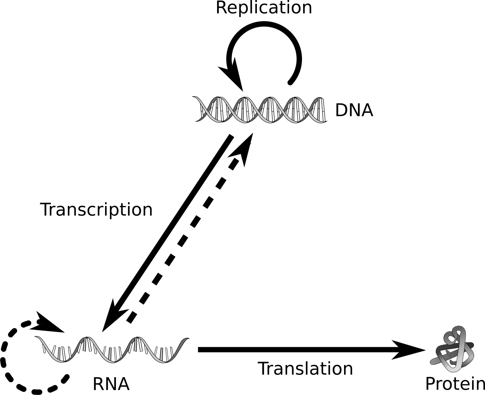
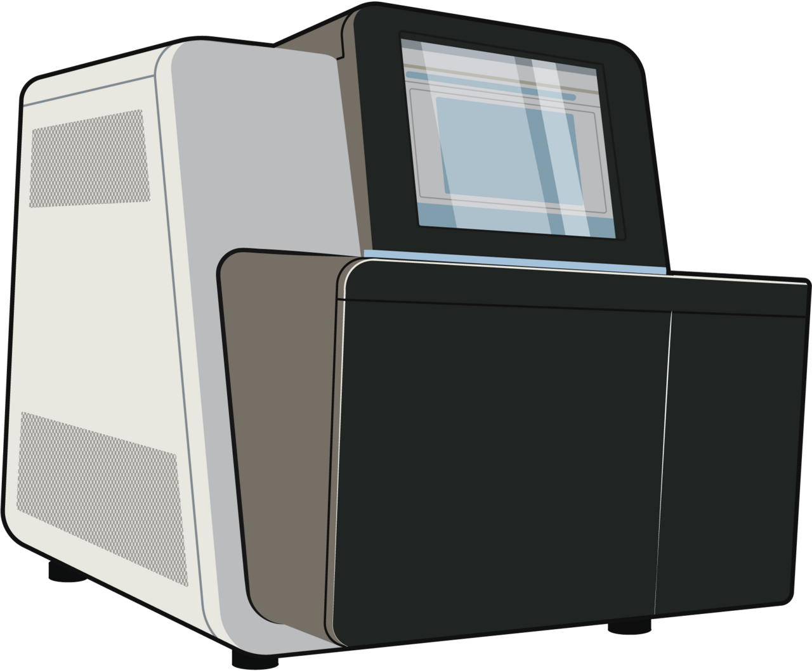
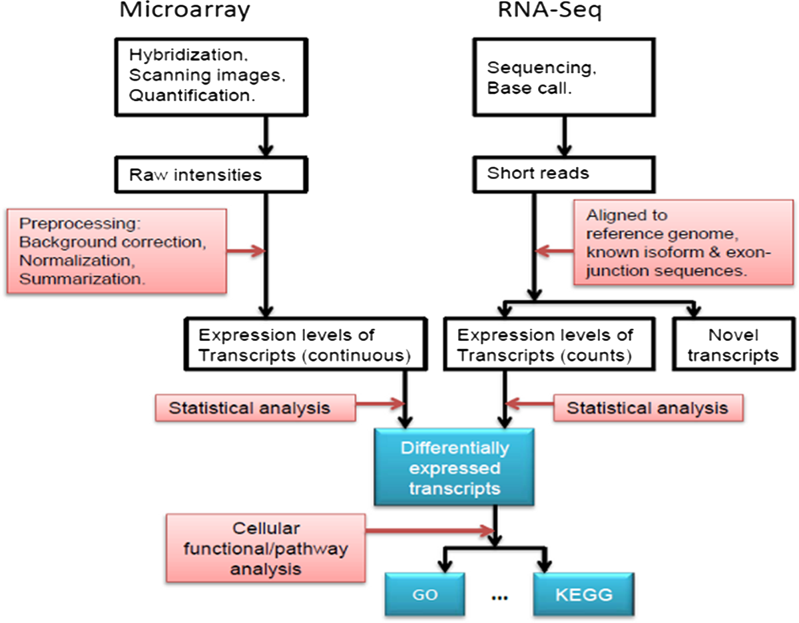
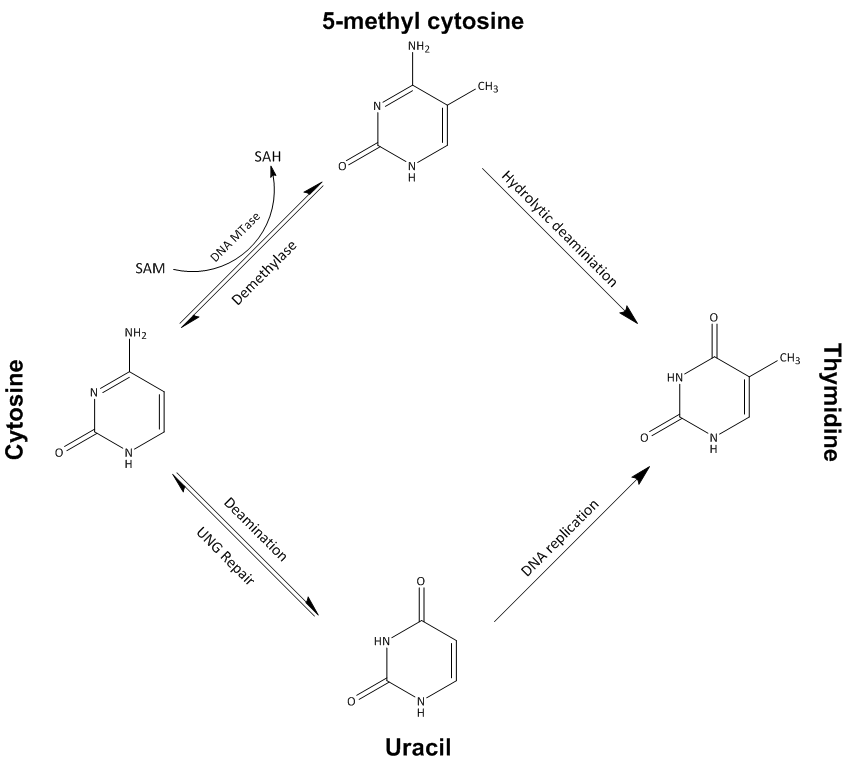
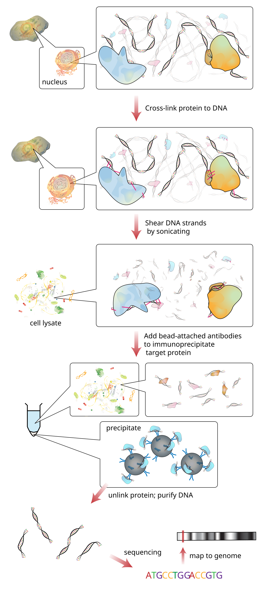
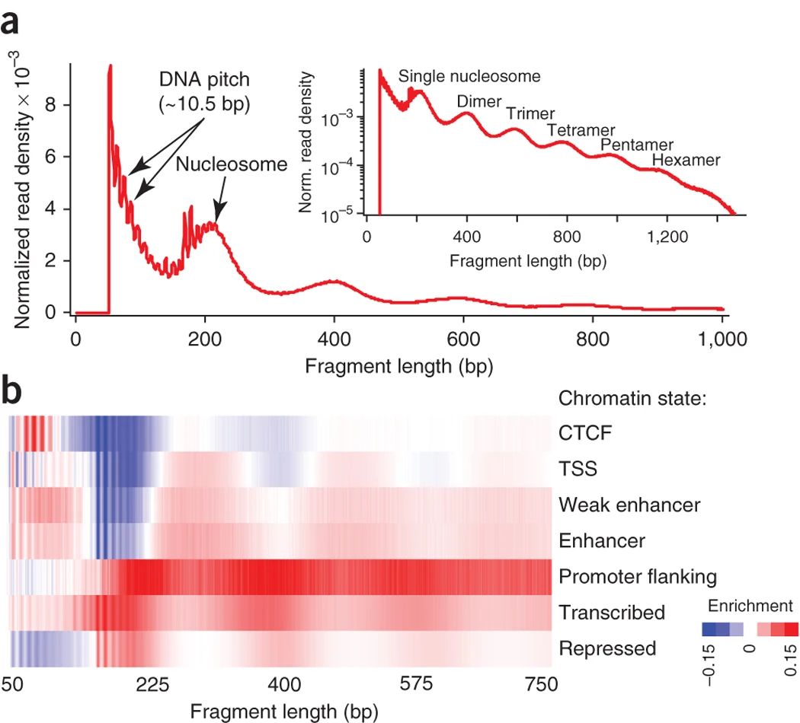
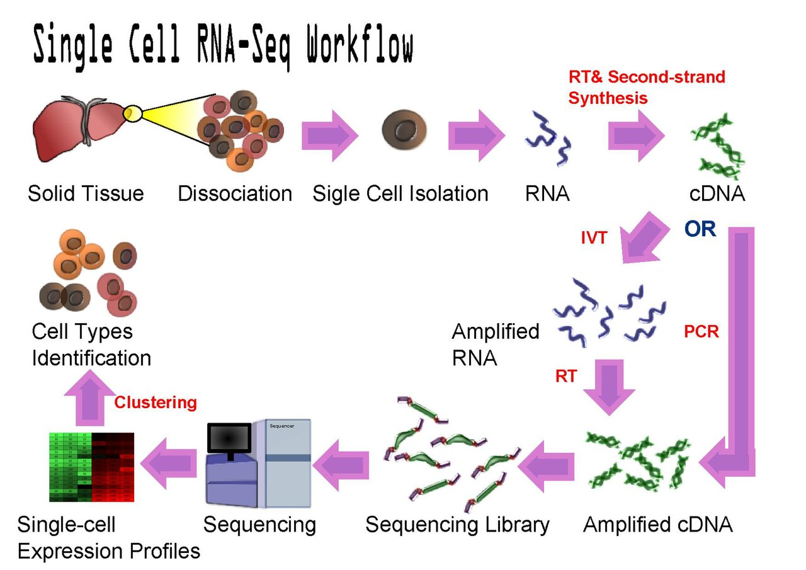
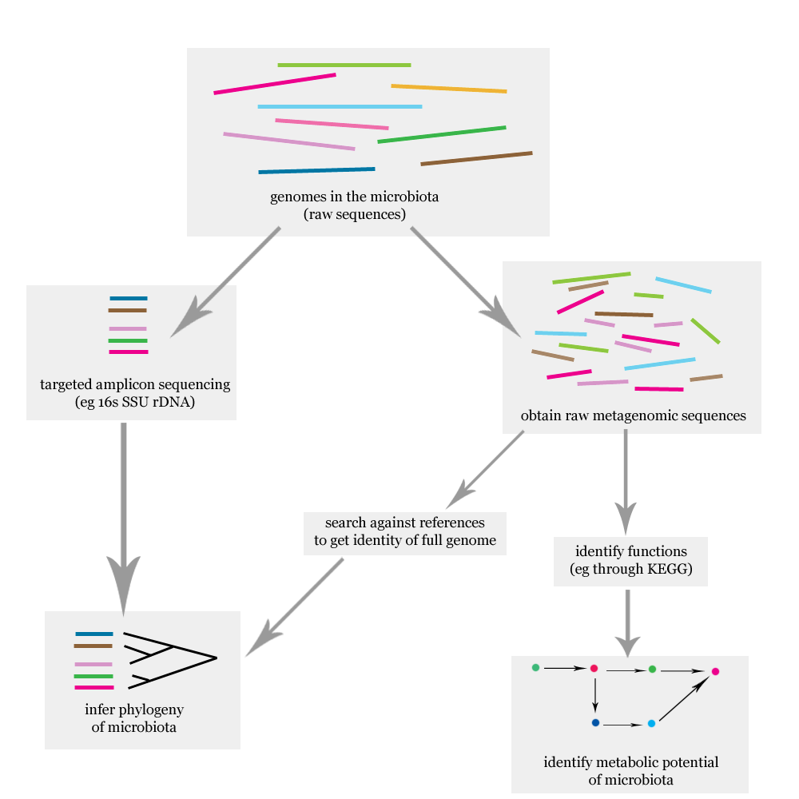

# 9  A primer on biological assays

Code

Author

Affiliation

[Sean Davis](https://seandavi.github.io/) 

[University of Colorado  
Anschutz School of Medicine](https://medschool.cuanschutz.edu/)

Published

June 1, 2024

Modified

September 19, 2026

Somewhere in this book you will be handed a spreadsheet with 20,000 rows and 100 columns and told to find the rows that matter. You will run the statistics, draw the figure, and reach a conclusion — all without ever touching a test tube. But to *trust* that conclusion you need to know what the numbers in that spreadsheet actually are. Where did a row come from? What does a single number in the table physically represent? Why is one experiment a tidy matrix of counts and another a ragged list of positions on a chromosome?

This chapter answers those questions. It is the one chapter in the book with no R code at all — it is here to give readers from a non-biological background the mental picture that the rest of the book quietly assumes. We will start with the smallest amount of cell biology you need (just enough to make the data make sense), then walk through the six experimental techniques — the **assays** — that produce nearly every dataset you will meet later. For each one, the goal is the same: *what biological question does it answer, and what shape does its data take?*

If you already know a promoter from an enhancer, skim this and move on. If you don’t, read it once and the later chapters will stop feeling like they’re written in code.

## 9.1 What you’ll learn

By the end of this chapter you will be able to:

- Explain, in plain language, what a gene is and what the **central dogma** describes.
- Describe the single idea — *counting molecules* — that unites most modern assays.
- For each of the six assays used in this book, state the biological question it answers and the **shape of data** it produces.
- Recognize which chapter later in the book works with each kind of data, so you know where each assay reappears.
- Read a figure or a methods section and place the experiment into one of these six families.

> **NOTE:**
>
> This is a *primer*. Every section here is a deliberate simplification of a field that people spend careers on. The aim is a working mental model, not completeness. Where a detail matters for the analysis you’ll do later, the relevant chapter fills it in.

## 9.2 The cell, the genome, and the central dogma

Every cell in your body carries the same instruction manual: a long molecule of **DNA**, packaged into **chromosomes** and collectively called the **genome**. The human genome is about three billion letters long, written in a four-letter alphabet (A, C, G, T). A **gene** is a stretch of that sequence that spells out a specific product — most often a **protein**, the molecular machines and building blocks that actually do the work of a cell.

The flow of information from DNA to a working product is so central that it has a name: the **central dogma of molecular biology** ([Figure fig-central-dogma](#fig-central-dogma)). DNA is **transcribed** into a temporary working copy called **RNA**; a particular kind of RNA, *messenger RNA* (mRNA), is then **translated** into protein. A useful analogy: the genome is a reference library that never leaves the building; RNA is the photocopy a worker carries to the bench; protein is the thing they build from it.

, transcribed into RNA, and translated into protein. The arrows are the verbs you will see throughout biology: replication, transcription, translation. Most assays in this book are, at bottom, ways of measuring one of these steps — how much RNA a gene makes, or where a regulatory protein sits on the DNA. Source: Philippe Hupé via Wikimedia Commons, CC BY-SA 3.0.")

Figure 9.1: The central dogma of molecular biology. Information stored in DNA is copied (replication), transcribed into RNA, and translated into protein. The arrows are the verbs you will see throughout biology: *replication*, *transcription*, *translation*. Most assays in this book are, at bottom, ways of measuring one of these steps — how much RNA a gene makes, or where a regulatory protein sits on the DNA. *Source: Philippe Hupé via Wikimedia Commons, CC BY-SA 3.0.*

Here is the fact that makes the whole book possible: **every cell has the same genome, but not every gene is switched on in every cell.** A neuron and a liver cell carry identical DNA, yet they look and behave completely differently because they *express* different genes — they transcribe different stretches of DNA into RNA, in different amounts. A gene that is “on” is being transcribed into many RNA copies; a gene that is “off” makes few or none. The amount of RNA a gene produces is its **expression level**, and measuring expression is the single most common thing biologists do with the assays below.

What decides which genes are on? **Gene regulation** — and it is mostly a story about access and switches:

- A **promoter** is the stretch of DNA just upstream of a gene where the transcription machinery docks to begin copying. Think of it as the gene’s on-ramp.
- An **enhancer** is a separate regulatory stretch, sometimes far away, that boosts a gene’s transcription when the right proteins bind it.
- **Transcription factors** are proteins that bind specific DNA sequences (at promoters and enhancers) to turn genes up or down.
- The genome is not naked. It is wound around spool-like proteins into **chromatin**, with the basic spool unit called a **nucleosome**. Tightly wound DNA is hidden and silent; loosely wound, **accessible** DNA is open for business.

Hold on to those four ideas. Four of the six assays below are, in effect, clever ways of asking *where on the genome* a regulatory event is happening — which proteins are bound, which DNA is accessible, which letters are chemically marked.

## 9.3 Sequencing in one idea: counting

Five of the six assays in this book rely on **DNA sequencing**, so it pays to understand the one idea underneath all of them. A modern sequencer does not read a genome end to end like a book. Instead it takes a tube containing millions of short DNA fragments and reads a few hundred letters from each one, in massive parallel, producing millions of short text snippets called **reads**.

That single capability — *read millions of short fragments at once* — turns an astonishing range of biological questions into the same computational task: **count where the reads come from.** The trick each assay plays is in *what it puts in the tube*. Choose the fragments cleverly and the counts answer your question ([Figure fig-sequencing](#fig-sequencing)):

- Put in copies of all the mRNA in a cell → counting reads per gene measures **gene expression** (RNA-seq).
- Put in only the DNA that a particular protein was bound to → counting reads along the genome shows **where that protein binds** (ChIP-seq).
- Put in only the DNA that was physically accessible → the counts map **open chromatin** (ATAC-seq).
- Put in one cell’s RNA at a time → the counts profile **single cells** (scRNA-seq).
- Put in a marker gene amplified from a stool or soil sample → the counts tally **which microbes are present** (microbiome 16S sequencing).

, public domain.")

Figure 9.2: A sequencing-based assay in outline: biological material is converted into a *library* of short DNA fragments, the sequencer reads millions of them in parallel as short *reads*, and the reads are aligned back to a reference genome. Almost every analysis downstream reduces to **counting** reads — per gene, per genomic window, per cell, or per microbe. The assays differ only in what goes into the library. *Source: NIH NIAID / Ryan Kissinger (NIH BioArt), public domain.*

> **TIP:**
>
> Because counting is the common operation, the natural output is a table: one row per *thing you counted* (a gene, a genomic region, a microbe) and one column per *sample*. That **features × samples matrix** is exactly the structure the [`SummarizedExperiment`](bioc-summarizedexperiment.llms.md) container is built to hold, which is why it shows up again and again in the Bioconductor chapters.

With those two foundations — the central dogma, and sequencing-as-counting — each assay below takes only a few paragraphs.

## 9.4 The assays

### 9.4.1 Gene expression: microarrays and RNA-seq

**The question.** Which genes are switched on in this sample, and how strongly? Comparing expression between conditions — tumor versus normal, treated versus untreated, one time point versus another — is the workhorse experiment of molecular biology.

**What’s measured.** The abundance of each gene’s mRNA. A highly expressed gene has many mRNA copies; a silent gene has almost none. Two technologies measure this ([Figure fig-expression](#fig-expression)). The older, the **microarray**, is a glass chip dotted with short DNA probes, one set per gene; labelled mRNA from the sample sticks to its matching probe and the spot glows, brightly for abundant genes. The newer, **RNA-seq**, skips the chip: it sequences the mRNA directly and counts reads per gene. RNA-seq has largely replaced microarrays because it doesn’t need a probe designed in advance and measures a wider range of abundances, but enormous archives of microarray data remain valuable and reusable.

Figure 9.3: Two ways to measure gene expression. *Left:* a microarray reads out expression as the brightness of probe spots on a chip — an *intensity* for each gene. *Right:* RNA-seq sequences the mRNA and reads out expression as a *count* of reads per gene. Both end up as a genes-by-samples matrix; the numbers are intensities in one case and counts in the other. *Source: Fang, Martin & Wang, Cell Biosci. 2012;2:26, via Wikimedia Commons, CC BY-SA 4.0.*

**What the data look like.** A matrix with **one row per gene and one column per sample**. Each entry is that gene’s expression in that sample — a fluorescence intensity (microarray) or a read count (RNA-seq). This is the single most common data shape in the book.

**→ In this book.** The [`SummarizedExperiment`](bioc-summarizedexperiment.llms.md) chapter builds the container that holds this matrix together with its gene and sample annotations. [GEOquery](geoquery.llms.md) downloads a real published expression dataset and runs a PCA on it. The [k-means](kmeans.llms.md) chapter clusters genes from a classic yeast microarray time course. Several [machine-learning](machine_learning/intro.llms.md) worked examples predict a label or a number from an expression matrix.

### 9.4.2 DNA methylation

**The question.** The DNA sequence is fixed, but cells can write reversible chemical annotations *on top* of it that change how genes behave. Where are those marks, and how do they shift with age, tissue, or disease?

**What’s measured.** **DNA methylation** is the most studied such mark: a methyl group added to a cytosine (the “C” of the alphabet), almost always where a C sits next to a G — a so-called **CpG site** ([Figure fig-methylation](#fig-methylation)). Methylation in a gene’s promoter tends to switch the gene off, so the methylation pattern is part of how a cell remembers what type of cell it is. Specialized arrays (or sequencing) report, for each of hundreds of thousands of CpG sites, the **fraction** of DNA molecules that are methylated there — a number between 0 (never methylated) and 1 (always).

Figure 9.4: DNA methylation adds a methyl group to a cytosine base, typically at a CpG site, without changing the underlying A/C/G/T sequence. These reversible marks help control whether nearby genes are expressed, and their pattern drifts in predictable ways with age — the basis of the “epigenetic clock” you’ll build later. *Source: Stimpakk via Wikimedia Commons, CC BY-SA 4.0.*

**What the data look like.** A matrix with **one row per CpG site and one column per sample**, each entry a methylation fraction between 0 and 1. Same features-by-samples shape as expression, just a different feature and a different unit.

**→ In this book.** The machine-learning worked example [predicting age from DNA methylation](machine_learning/ml_methylation_age.llms.md) trains an *epigenetic clock*: a model that reads a person’s age off the methylation values at age-sensitive CpG sites.

### 9.4.3 ChIP-seq: where proteins bind the genome

**The question.** Regulation is carried out by proteins that physically sit on the DNA — transcription factors at their target sites, and the modified histone proteins that mark active or silent regions. *Where* on the genome does a given protein bind?

**What’s measured.** **ChIP-seq** (chromatin immunoprecipitation followed by sequencing) uses an antibody to fish out just the DNA fragments that a chosen protein was attached to, then sequences them ([Figure fig-chipseq](#fig-chipseq)). Align those reads back to the genome and they pile up into **peaks** at the protein’s binding sites — and stay flat everywhere else. A peak says “the protein was here.”

Figure 9.5: ChIP-seq in outline. An antibody pulls down a specific protein along with the DNA it was bound to; that DNA is sequenced; the reads pile up into *peaks* at the genomic locations where the protein was sitting. The same recipe maps transcription-factor binding sites and the histone marks that label active or silent chromatin. *Source: Jkwchui via Wikimedia Commons, CC BY-SA 3.0.*

**What the data look like.** Not a dense matrix but a **list of genomic intervals** — each peak is a chromosome, a start, and an end, often with a score. This is a fundamentally *positional* kind of data, and handling it well is what Bioconductor’s genomic-ranges tools exist for.

**→ In this book.** The [genomic ranges and features](genomic_ranges.llms.md) chapter teaches the interval operations (overlaps, nearest-feature, flanking) that turn peaks into biology, and the [ChIP-seq peaks chapter](genomic_ranges_chipseq.llms.md) loads a real set of CTCF ChIP-seq peaks from the ENCODE project and explores them. A machine-learning example even [predicts gene expression from histone-mark ChIP-seq](machine_learning/ml_expression.llms.md).

### 9.4.4 ATAC-seq: where the genome is open

**The question.** Before a gene can be switched on, the regulatory DNA around it has to be physically *accessible* — unwound from its nucleosome spools so that proteins can reach it. Which stretches of the genome are open in this cell type?

**What’s measured.** **ATAC-seq** uses an enzyme that can only cut DNA where it is exposed; it slices the accessible regions and tags them for sequencing in one step ([Figure fig-atac](#fig-atac)). Reads accumulate over open regions — active promoters, enhancers, transcription-factor sites — and are absent over the tightly packed, silent majority of the genome. As a bonus, the *lengths* of the sequenced fragments reveal where individual nucleosomes sit.

, leaving tightly wrapped DNA untouched. Sequencing those fragments shows where the genome is “open for business” — the promoters and enhancers of active genes. Source: figure reused from the ATAC-seq chapter of this book.")

Figure 9.6: ATAC-seq maps open chromatin. An enzyme cuts and tags DNA only where it is accessible (open regions, top), leaving tightly wrapped DNA untouched. Sequencing those fragments shows where the genome is “open for business” — the promoters and enhancers of active genes. *Source: figure reused from the ATAC-seq chapter of this book.*

**What the data look like.** Like ChIP-seq, **genomic intervals plus a coverage signal** along the genome: peaks of accessibility, and a per-base pileup you can plot as a track. The same `GRanges` machinery handles both.

**→ In this book.** The [ATAC-seq chapter](atac-seq/atac-seq.llms.md) takes real sequencing data and walks it from aligned reads to a biological picture: where reads pile up, how fragment length reveals nucleosome positions, and how accessibility lines up with the starts of genes.

### 9.4.5 Single-cell RNA-seq

**The question.** Bulk RNA-seq mashes a whole tissue into one tube and reports the *average* expression over every cell in it — blurring neurons, glia, and blood vessels into one indistinct smear. But a tissue is a mixture of cell types. *Which* cell types are present, in what proportions, and what makes each one distinct?

**What’s measured.** **Single-cell RNA-seq (scRNA-seq)** measures gene expression **one cell at a time** ([Figure fig-scrnaseq](#fig-scrnaseq)). Clever microfluidics isolate tens of thousands of individual cells, tag each cell’s RNA with a unique molecular barcode, and sequence them all together; the barcode lets you sort the reads back to the cell they came from. Instead of one average profile you get a catalog of thousands of individual profiles.

Figure 9.7: Single-cell RNA-seq. Individual cells are separated and their RNA is barcoded per cell before sequencing, so expression can be measured cell by cell rather than averaged over a whole sample. The result is a genes-by-*cells* matrix, the starting point for finding cell types. *Source: Yijyechern via Wikimedia Commons, CC BY-SA 3.0.*

**What the data look like.** A matrix with **one row per gene and one column per cell** — the same shape as bulk expression, but now with tens of thousands of columns and mostly zeros (any one cell expresses only a fraction of all genes). That scale and sparsity drive the whole analysis: normalize, reduce to a 2-D map, cluster the cells, and label the clusters by their marker genes.

**→ In this book.** The [single-cell RNA-seq chapter](single_cell/setup.llms.md) takes a published mouse-brain dataset from raw counts to a labelled map of cell types, using the standard load → normalize → reduce → cluster → annotate workflow.

### 9.4.6 The microbiome: 16S and metagenomic sequencing

**The question.** Your gut, skin, and mouth host vast communities of bacteria and other microbes that influence digestion, immunity, and disease. *Which* microbes are present in a sample, and in what proportions — and how do those proportions differ between healthy and sick people?

**What’s measured.** Rather than sequence every microbe’s whole genome, the most common approach amplifies and sequences a single marker gene — the **16S ribosomal RNA gene** — that every bacterium carries but whose sequence varies just enough between species to act as a barcode ([Figure fig-microbiome](#fig-microbiome)). Counting how many reads match each barcode tells you how abundant each microbe is. (The more exhaustive alternative, *shotgun metagenomics*, sequences all the DNA in the sample at once.)

, a marker gene such as 16S rRNA is amplified and sequenced, and reads are matched to a reference to tally which microbes are present and in what abundance. The output is a taxa-by-samples abundance table. Source: Axtian via Wikimedia Commons, CC BY-SA 3.0.")

Figure 9.8: Microbiome profiling. DNA is extracted from a sample (e.g. stool), a marker gene such as 16S rRNA is amplified and sequenced, and reads are matched to a reference to tally which microbes are present and in what abundance. The output is a taxa-by-samples abundance table. *Source: Axtian via Wikimedia Commons, CC BY-SA 3.0.*

**What the data look like.** A table with **one row per microbe (taxon) and one column per sample**, each entry an abundance — again the features-by-samples shape, often paired with a *tree* describing how the taxa are evolutionarily related.

**→ In this book.** The [microbiome chapter](310_microbiome.llms.md) loads a curated gut-microbiome dataset from a colorectal-cancer study and asks how diverse each sample is, whether patients and controls separate, and which microbes dominate — all from a `TreeSummarizedExperiment` that bundles the abundance table with that evolutionary tree.

## 9.5 How the assays connect

Step back and the pattern is clear: a handful of biological questions, the same counting trick under most of them, and just two data shapes — a dense *features-by-samples matrix*, or a *list of genomic intervals* ([Table tbl-assay-summary](#tbl-assay-summary)).

| Assay | Biological question | What’s measured | Data shape | Chapter |
|----|----|----|----|----|
| Gene expression | Which genes are on, how strongly? | mRNA abundance per gene | genes × samples matrix | [SummarizedExperiment](bioc-summarizedexperiment.llms.md), [GEOquery](geoquery.llms.md), [k-means](kmeans.llms.md) |
| DNA methylation | Where is DNA chemically marked? | methylation fraction per CpG | CpG sites × samples matrix | [Methylation age](machine_learning/ml_methylation_age.llms.md) |
| ChIP-seq | Where does a protein bind? | read pileup at binding sites | list of genomic intervals (peaks) | [Genomic ranges](genomic_ranges_chipseq.llms.md), [Histone marks](machine_learning/ml_expression.llms.md) |
| ATAC-seq | Where is the genome open? | accessibility signal | intervals + coverage | [ATAC-seq](atac-seq/atac-seq.llms.md) |
| scRNA-seq | Expression per cell; which cell types? | mRNA per gene, per cell | genes × cells matrix | [Single-cell](single_cell/setup.llms.md) |
| Microbiome (16S) | Which microbes, in what proportions? | abundance per taxon | taxa × samples table (+ tree) | [Microbiome](310_microbiome.llms.md) |

Table 9.1: The six assays, the questions they answer, and where each reappears in the book.

Once you can place an unfamiliar experiment into this table — *what was put in the tube, what got counted, what shape is the result* — the analysis chapters become much easier to follow, because they are all variations on handling one of these two data shapes.

## 9.6 Exercises

These are reading-comprehension questions; no R required. Try to answer before opening the solution.

1.  **Same shape, different meaning.** A microbiome abundance table and a bulk RNA-seq dataset both arrive as a *features-by-samples matrix*. What does a single row represent in each case, and what does a single number mean?

    > **NOTE:**
    > In RNA-seq, a row is a **gene** and a number is that gene’s **expression** (a read count or intensity) in one sample. In the microbiome table, a row is a **microbe (taxon)** and a number is that taxon’s **abundance** in one sample. The container is identical — which is exactly why both use `SummarizedExperiment`-style objects — but the biological meaning of rows and values is completely different.

2.  **Matrix or intervals?** For each experiment, say whether the natural output is a dense *features-by-samples matrix* or a *list of genomic intervals*:

    1.  measuring how strongly 20,000 genes are expressed across 50 tumors;
    2.  finding every place the CTCF protein binds the genome;
    3.  mapping which regions of DNA are accessible in a cell type.

    > **NOTE:**
    > 1.  is a **matrix** (genes × samples). (b) and (c) are **lists of genomic intervals** — ChIP-seq peaks and ATAC-seq accessible regions are both positional, which is why both are handled with `GRanges`.

3.  **What went in the tube?** RNA-seq, ChIP-seq, ATAC-seq, and 16S microbiome sequencing all run on the same kind of sequencer and all end in *counting reads*. In one sentence each, what makes them different experiments?

    > **NOTE:**
    > They differ in **what is put into the sequencing library**: all the mRNA in the sample (RNA-seq), only the DNA a chosen protein was bound to (ChIP-seq), only the accessible DNA (ATAC-seq), or an amplified marker gene such as 16S (microbiome). Same machine and same counting step; different molecules going in, so different questions answered.

4.  **Why bother with single cells?** A colleague has bulk RNA-seq from a brain sample and asks why anyone would pay more to do single-cell RNA-seq on the same tissue. Give the one-sentence reason.

    > **NOTE:**
    > Bulk RNA-seq reports the **average** expression over all cells, blurring together the distinct cell types in the tissue; single-cell RNA-seq measures each cell separately, so it can reveal *which* cell types are present and how they differ — including rare populations the average would hide.

## 9.7 Summary

You now have the mental model the rest of the book assumes. You can explain the **central dogma** (DNA → RNA → protein) and why measuring RNA tells you which genes are *on*. You know the unifying trick behind most modern assays — **sequence millions of fragments and count where they come from** — and that the assays differ mainly in *what goes into the tube*. And for each of the six assays in this book you can name the biological question it answers and the **shape of data** it produces: a features-by-samples matrix for expression, methylation, single-cell, and microbiome data; a list of genomic intervals for ChIP-seq and ATAC-seq. When a later chapter opens with “a matrix of counts” or “a set of peaks,” you’ll know exactly what it means and where it came from.

## 9.8 Resources

- [Central dogma](https://www.genome.gov/genetics-glossary/Central-Dogma) — NHGRI genetics glossary, with a short narrated explainer.
- [The Gene Expression Omnibus (GEO)](https://www.ncbi.nlm.nih.gov/geo/) — the public archive the book draws several datasets from; browsing a few entries is a good way to see these assays “in the wild.”
- [EMBL-EBI training](https://www.ebi.ac.uk/training/) — free, accessible introductions to RNA-seq, ChIP-seq, single-cell, and more, if you want a deeper but still gentle treatment of any assay above.
