# 19  Base R versus the tidyverse

Code

Authors

Martin Morgan

Lori Kern

Published

June 1, 2024

Modified

September 19, 2026

There is almost never just one way to do something in R. The same task — count a variable, summarize a column, draw a boxplot — can be written in plain **base R** or with the **[tidyverse](https://www.tidyverse.org/)**, a family of packages (`dplyr`, `readr`, `ggplot2`, and friends) built around a shared, readable style. Neither is “right.” They are two dialects, and good R users read and write both.

The best way to feel the difference is to watch the *same* analysis done both ways, side by side. So in this chapter we revisit the BRFSS dataset from the exploratory-data-analysis chapter and redo it twice: once with base R’s data frames and graphics, and once with tidyverse tibbles and `ggplot2`. Read across each pair of columns and you’ll start to recognize which dialect you reach for, and when.

## 19.1 What you’ll learn

- Read the same CSV into a base R `data.frame` and a tidyverse `tibble`, and describe how they differ.
- Tabulate and summarize a variable with base R ([`table()`](https://rdrr.io/r/base/table.html), [`aggregate()`](https://rdrr.io/r/stats/aggregate.html)) and with `dplyr` ([`count()`](https://dplyr.tidyverse.org/reference/count.html), [`summarize()`](https://dplyr.tidyverse.org/reference/summarise.html), [`group_by()`](https://dplyr.tidyverse.org/reference/group_by.html)).
- Reshape a count table with [`tidyr::pivot_wider()`](https://tidyr.tidyverse.org/reference/pivot_wider.html).
- Recreate the same plots — boxplot, density, scatter, regression line, histogram — in base graphics and in `ggplot2`.
- Read both dialects fluently, and choose the one that fits the task in front of you.

## 19.2 Loading the dataset

First we load the dataset two ways. Base R reads a CSV into a classic `data.frame` with [`read.csv()`](https://rdrr.io/r/utils/read.table.html); the tidyverse’s `readr` package reads the same file into a **tibble** with [`read_csv()`](https://readr.tidyverse.org/reference/read_delim.html). As in the EDA chapter, point R at the `BRFSS-subset.csv` file in your working directory — interactively, [`file.choose()`](https://rdrr.io/r/base/file.choose.html) opens a dialog so you don’t have to type the path:

``` downlit
path <- file.choose()    # opens a dialog; navigate to BRFSS-subset.csv

# We'll use dplyr throughout, so load it now
library(dplyr)
```

``` downlit
# loading using base R
stopifnot(file.exists(path))
brfss_DF <- read.csv(path)
```

``` downlit
# loading using readr
library(readr)
brfss_tbl <- readr::read_csv(path)
```

Let’s examine our objects:

``` downlit
# Classic data frame
head(brfss_DF)
```

      Age   Weight    Sex Height Year
    1  31 48.98798 Female 157.48 1990
    2  57 81.64663 Female 157.48 1990
    3  43 80.28585   Male 177.80 1990
    4  72 70.30682   Male 170.18 1990
    5  31 49.89516 Female 154.94 1990
    6  58 54.43108 Female 154.94 1990

``` downlit
# Tidyverse tibble
head(brfss_tbl)
```

    # A tibble: 6 × 5
        Age Weight Sex    Height  Year
      <dbl>  <dbl> <chr>   <dbl> <dbl>
    1    31   49.0 Female   157.  1990
    2    57   81.6 Female   157.  1990
    3    43   80.3 Male     178.  1990
    4    72   70.3 Male     170.  1990
    5    31   49.9 Female   155.  1990
    6    58   54.4 Female   155.  1990

``` downlit
# Classic data frame
class(brfss_DF)
```

    [1] "data.frame"

``` downlit
# Tidyverse tibble
class(brfss_tbl)
```

    [1] "spec_tbl_df" "tbl_df"      "tbl"         "data.frame" 

> **NOTE:**
>
> **Note:** A tidyverse tibble object inherits a data.frame class. This means that most data.frame operations like [`dim()`](https://rdrr.io/r/base/dim.html), [`colnames()`](https://rdrr.io/r/base/colnames.html), `$`, `[`, etc. will work on the tibble object as well.

## 19.3 Clean data

Both ‘Sex’ and ‘Year’ are really `factor` values (each can only take on specific levels, ‘Female’ and ‘Male’ for ‘Sex’, and ‘1990’ and ‘2010’ for ‘Year’).

``` downlit
# base R / data.frame
brfss_DF$Year <- factor(brfss_DF$Year)
brfss_DF$Sex <- factor(brfss_DF$Sex)
```

``` downlit
# dplyr / tibble 
brfss_tbl <-
brfss_tbl |>
    mutate(
        Sex = factor(Sex,
          levels = c("Female", "Male")),
        Year = factor(Year,
          levels = c("1990", "2010"))
    )
```

## 19.4 Data Exploration

Let’s do some basic exploration. [`summary()`](https://rdrr.io/r/base/summary.html) works the same on both objects, but let’s look at some summary tables and counts instead. The two dialects produce the same results in slightly different formats.

We’ll start with basic table of a single variable:

``` downlit
# base R / data.frame
table(brfss_DF$Year)
```

``` downlit
# dplyr / tibble
brfss_tbl |> count(Year)
```


     1990  2010 
    10000 10000 

    # A tibble: 2 × 2
      Year      n
      <fct> <int>
    1 1990  10000
    2 2010  10000

``` downlit
# base R / data.frame
table(brfss_DF$Sex)
```

``` downlit
# dplyr / tibble
brfss_tbl |> count(Sex)
```


    Female   Male 
     12039   7961 

    # A tibble: 2 × 2
      Sex        n
      <fct>  <int>
    1 Female 12039
    2 Male    7961

Now let’s look at contingency table

``` downlit
# base R / data.frame
table(brfss_DF$Sex, brfss_DF$Year)
```

            
             1990 2010
      Female 5718 6321
      Male   4282 3679

``` downlit
# dplyr / tibble
brfss_tbl |> count(Sex, Year)
```

    # A tibble: 4 × 3
      Sex    Year      n
      <fct>  <fct> <int>
    1 Female 1990   5718
    2 Female 2010   6321
    3 Male   1990   4282
    4 Male   2010   3679

We can get the tidy table to look even more similar to the base R table with the help of the tidyr package’s function `pivot_wider`

``` downlit
# base R / data.frame
table(brfss_DF$Sex, brfss_DF$Year)
```

            
             1990 2010
      Female 5718 6321
      Male   4282 3679

``` downlit
# dplyr / tibble
library(tidyr)
brfss_tbl |> count(Sex, Year) |>
    tidyr::pivot_wider(names_from = "Year", values_from = "n")
```

    # A tibble: 2 × 3
      Sex    `1990` `2010`
      <fct>   <int>  <int>
    1 Female   5718   6321
    2 Male     4282   3679

What about some summary statistics on the columns of data? [`summarize()`](https://dplyr.tidyverse.org/reference/summarise.html) will create the new data.frame automatically; base R you have to create your own.

``` downlit
# base R / data.frame
data.frame(
  avg_age = mean(brfss_DF$Age, na.rm = TRUE),
  ave_wt  = mean(brfss_DF$Weight, na.rm = TRUE),
  ave_ht  = mean(brfss_DF$Height, na.rm = TRUE)
)
```

``` downlit
# dplyr / tibble
brfss_tbl |>
    summarize(
        avg_age = mean(Age, na.rm = TRUE),
        ave_wt = mean(Weight, na.rm = TRUE),
        ave_ht = mean(Height, na.rm = TRUE)
    )
```

       avg_age   ave_wt   ave_ht
    1 50.99164 75.42455 169.2131

    # A tibble: 1 × 3
      avg_age ave_wt ave_ht
        <dbl>  <dbl>  <dbl>
    1    51.0   75.4   169.

If we want to get more complex with groupings by Year and Sex, `dplyr` uses [`group_by()`](https://dplyr.tidyverse.org/reference/group_by.html) where base R would use [`aggregate()`](https://rdrr.io/r/stats/aggregate.html).

``` downlit
# base R / data.frame
aggregate(
  cbind(Age, Weight, Height) ~ Sex + Year,
  data = brfss_DF,
  FUN = function(x) mean(x, na.rm = TRUE)
)
```

``` downlit
# dplyr / tibble
brfss_tbl |>
    group_by(Sex, Year) |>
    summarize(
        avg_age = mean(Age, na.rm = TRUE),
        ave_wt = mean(Weight, na.rm = TRUE),
        ave_ht = mean(Height, na.rm = TRUE)
    )
```

         Sex Year      Age   Weight   Height
    1 Female 1990 46.09153 64.84333 163.2914
    2   Male 1990 43.87574 81.19496 178.2242
    3 Female 2010 57.07807 73.03178 163.2469
    4   Male 2010 56.25465 88.91136 178.0139

    # A tibble: 4 × 5
    # Groups:   Sex [2]
      Sex    Year  avg_age ave_wt ave_ht
      <fct>  <fct>   <dbl>  <dbl>  <dbl>
    1 Female 1990     46.2   64.8   163.
    2 Female 2010     57.1   73.0   163.
    3 Male   1990     43.9   81.2   178.
    4 Male   2010     56.2   88.8   178.

## 19.5 Visualization

Before we start visualizing, lets create a few different subsets of data.

``` downlit
# base R / data.frame
brfss_female_DF <-
    brfss_DF[brfss_DF$Sex == "Female",]
brfss_male_DF <-
    brfss_DF[brfss_DF$Sex == "Male",]
brfss_2010_DF <-
    brfss_DF[brfss_DF$Year == "2010",]
```

``` downlit
# dplyr / tibble
brfss_male_tbl <-
    brfss_tbl |> filter(Sex == "Male")
brfss_female_tbl <-
    brfss_tbl |> filter(Sex == "Female")
brfss_2010_tbl <-
    brfss_tbl |> filter(Year == "2010")
```

We should also load the ggplot2 package so we can compare base R graphics vs ggplot2

``` downlit
library(ggplot2)
```

Let’s start with a boxplot that compares the Weights of Males vs Females for the 2010 dataset.

``` downlit
# base R
plot(Weight ~ Sex, brfss_2010_DF)
```

``` downlit
# ggplot2
ggplot(brfss_2010_tbl) +
    aes(x = Sex, y = Weight) +
    geom_boxplot()
```

[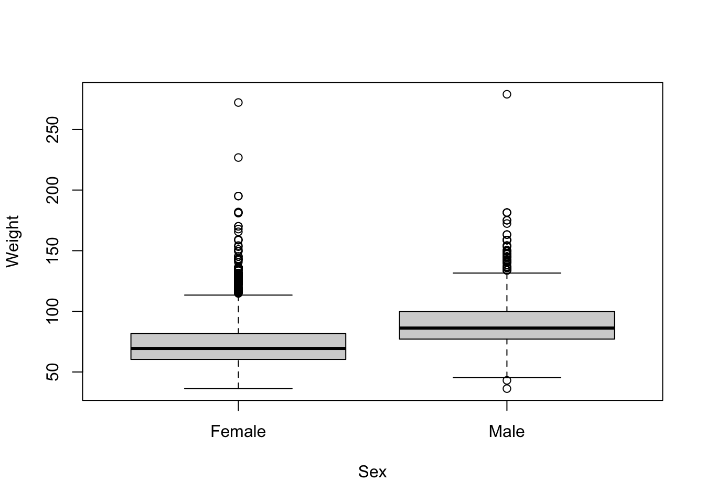](comparison_options_files/figure-html/unnamed-chunk-34-1.png)

[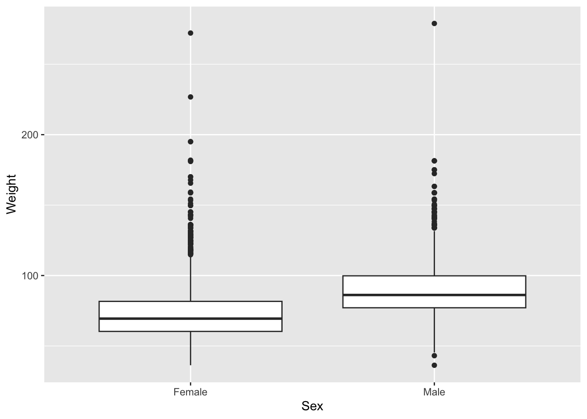](comparison_options_files/figure-html/unnamed-chunk-35-1.png)

Let’s look at some density and scatterplots.

``` downlit
# base R
den_male <- density(brfss_2010_DF$Weight[brfss_2010_DF$Sex == "Male"], na.rm = TRUE)
den_female <- density(brfss_2010_DF$Weight[brfss_2010_DF$Sex == "Female"], na.rm = TRUE)
plot(den_male, 
     col = "skyblue", lwd = 2,
     main = "Density of Weight by Sex",
     xlab = "Weight")

lines(den_female, 
      col = "lightsalmon", lwd = 2)

legend("topright",
    legend = c("Male", "Female"),
    col = c("skyblue", "lightsalmon"), lwd = 2)
```

``` downlit
# ggplot2
brfss_2010_tbl |>
    ggplot() +
    aes(x = Weight, color= Sex) +
    geom_density()
```

[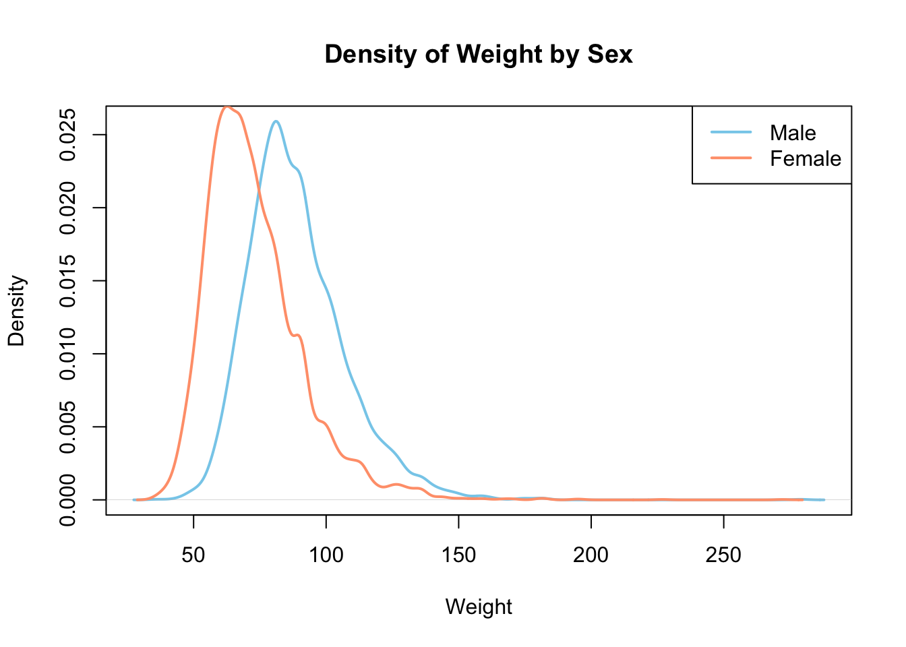](comparison_options_files/figure-html/unnamed-chunk-38-1.png)

[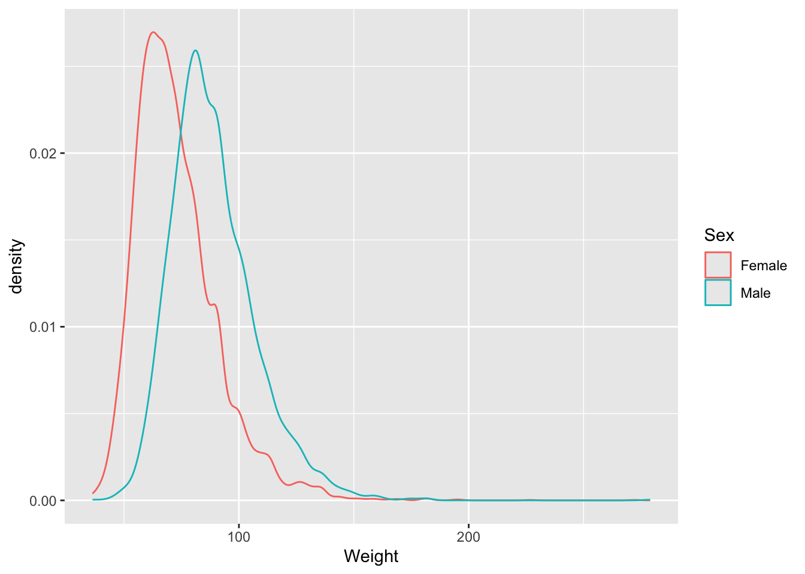](comparison_options_files/figure-html/unnamed-chunk-39-1.png)

Presumably taller people are heavier than shorter people. Let’s examine this relationship.

``` downlit
# base R
plot(Weight ~ Height, brfss_2010_DF)
```

``` downlit
# ggplot2
brfss_2010_tbl |>
    ggplot() +
    aes(x = Height, y = Weight) +
    geom_point()
```

[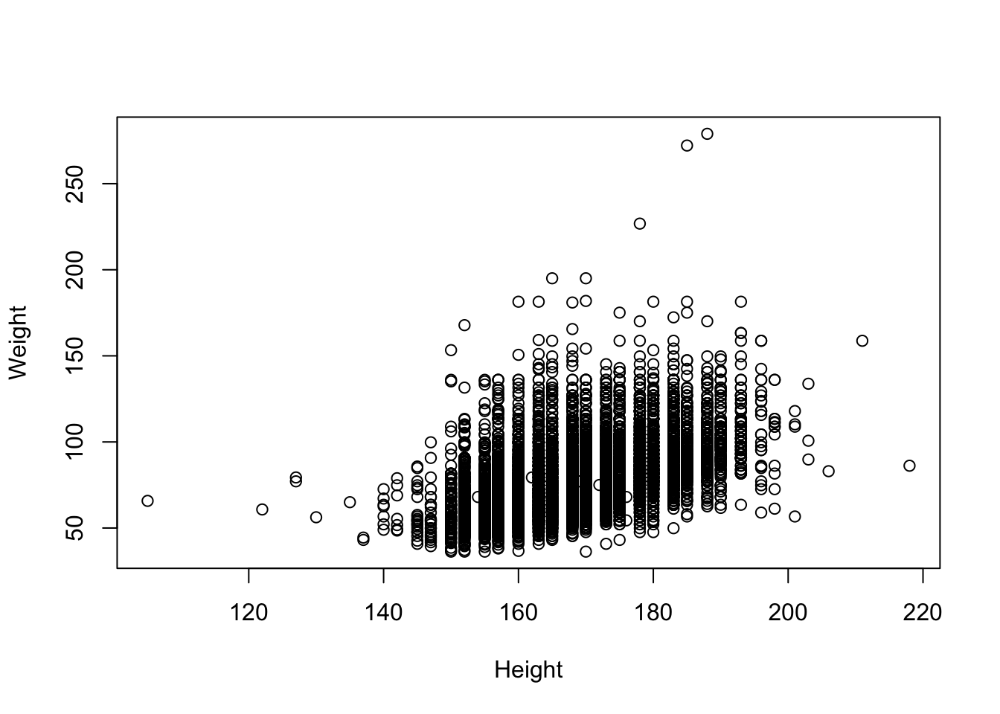](comparison_options_files/figure-html/unnamed-chunk-42-1.png)

[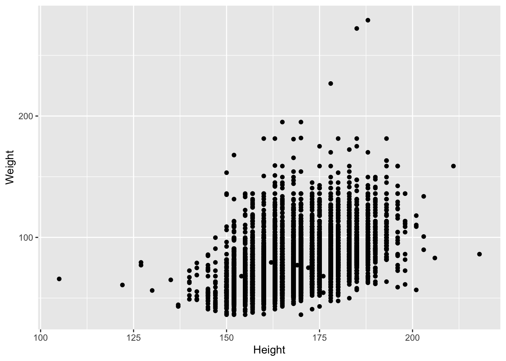](comparison_options_files/figure-html/unnamed-chunk-43-1.png)

Let’s fit the linear regression

``` downlit
# base R
plot(Weight ~ Height, brfss_2010_DF)
fit <- lm(Weight ~ Height, brfss_2010_DF)
abline(fit, col="blue", lwd=2)
```

``` downlit
# ggplot2
brfss_2010_tbl |>
    ggplot() +
    aes(x = Height, y = Weight) +
    geom_point() +
    geom_smooth(method = "lm")
```

[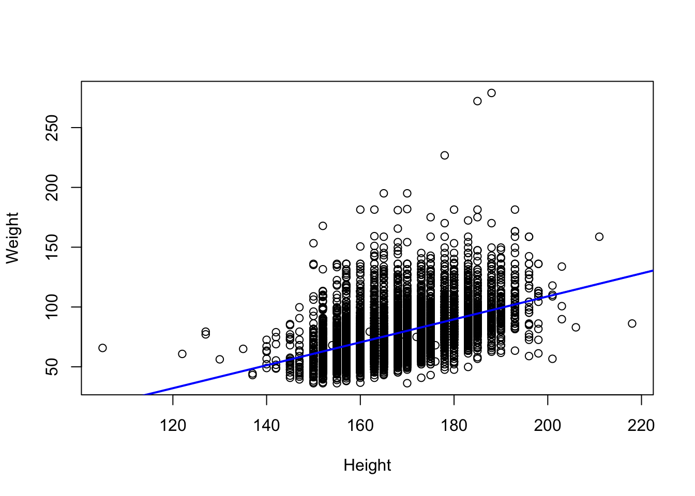](comparison_options_files/figure-html/unnamed-chunk-46-1.png)

[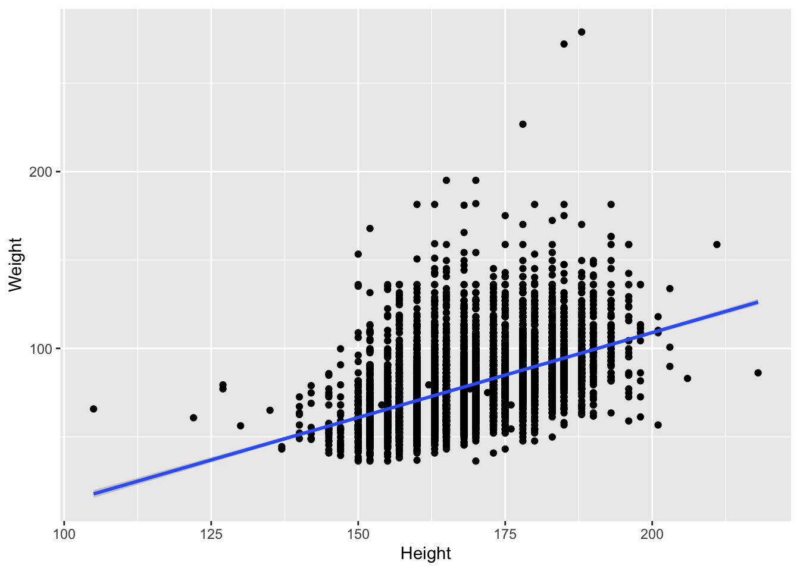](comparison_options_files/figure-html/unnamed-chunk-47-1.png)

We saw that there could be a difference based on Sex. Let’s add color to the points

``` downlit
# base R
colors <- c("Female" = "lightsalmon", "Male" = "skyblue")
plot(Weight ~ Height, brfss_2010_DF,
  col = colors[Sex], pch = 16)
for (sex in levels(brfss_2010_DF$Sex)) {
  subset_data <- subset(brfss_2010_DF, Sex == sex)
  fit <- lm(Weight ~ Height, data = subset_data)
  abline(fit, col = colors[sex], lwd = 2)
}
legend("topleft", legend = levels(brfss_2010_DF$Sex), 
       col = colors, pch = 16, bty = "n")
```

``` downlit
# ggplot2
brfss_2010_tbl |>
    ggplot() +
    aes(x = Height, y = Weight, color = Sex) +
    geom_point() +
    geom_smooth(method = "lm")
```

[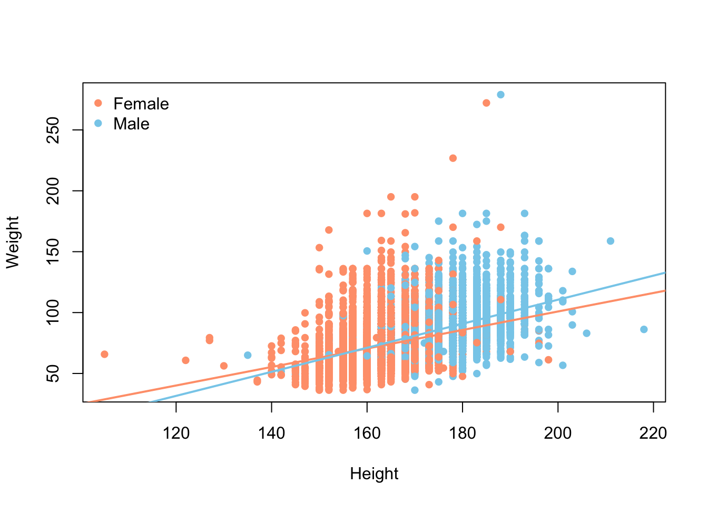](comparison_options_files/figure-html/unnamed-chunk-50-1.png)

[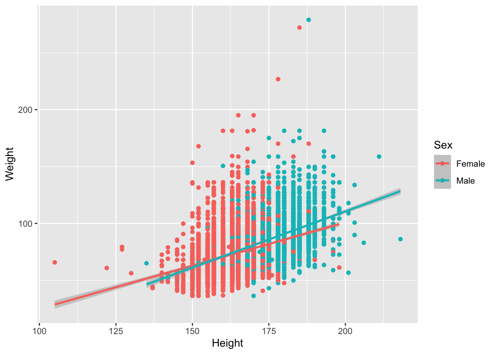](comparison_options_files/figure-html/unnamed-chunk-51-1.png)

Let’s look at a histogram of `Weight` for the 2010 males. We didn’t make that subset earlier, so each dialect carves it out on the fly — base R with [`subset()`](https://rdrr.io/r/base/subset.html), the tidyverse with [`filter()`](https://dplyr.tidyverse.org/reference/filter.html).

``` downlit
# base R
brfss_2010_Male <- subset(brfss_DF,
    Year == 2010 & Sex == "Male")
hist(brfss_2010_Male$Weight)
```

``` downlit
# ggplot2
brfss_2010_tbl |> filter(Sex == "Male") |>
    ggplot() +
    aes(x = Weight) +
    geom_histogram(col = "white")
```

[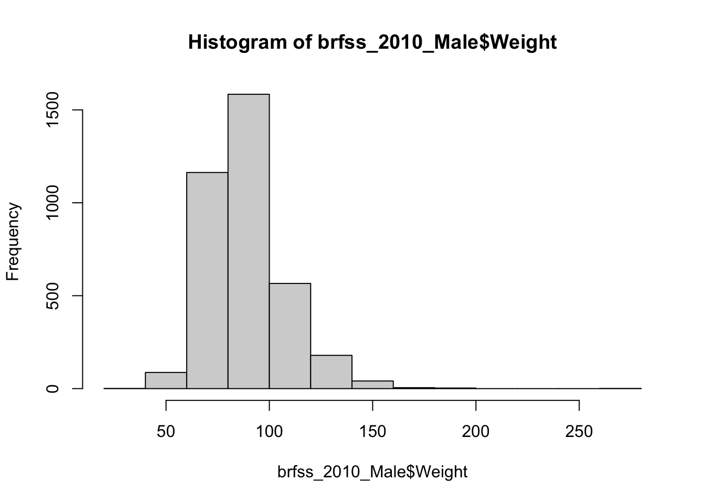](comparison_options_files/figure-html/unnamed-chunk-54-1.png)

[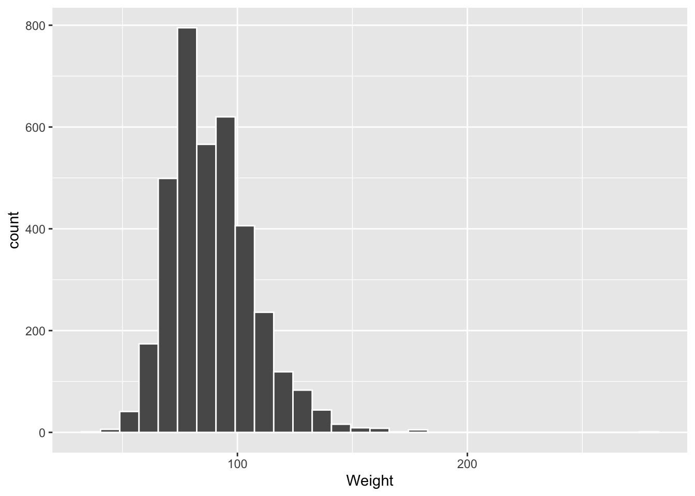](comparison_options_files/figure-html/unnamed-chunk-55-1.png)

What if we took all the Males and looked to see if the relationship of Height and Weight changed between 1990 and 2010.

``` downlit
# base R
colors <- c("1990" = "lightsalmon","2010" = "skyblue")
plot(log10(Weight) ~ Height, brfss_male_DF,
  col = colors[Year], pch = 16, ylab = "log10(Weight)")
for (yr in levels(brfss_male_DF$Year)) {
  subset_data <- subset(brfss_male_DF, Year == yr)
  fit <- lm(log10(Weight) ~ Height, data = subset_data)
  abline(fit, col = colors[yr], lwd = 2)
}
legend("topleft", legend = levels(brfss_male_DF$Year), 
       col = colors, pch = 16, bty = "n")
```

``` downlit
# ggplot2
ggplot(brfss_male_tbl) +
    aes(x = Height, y = log10(Weight), color = Year) +
    geom_point() +
    geom_smooth(method = "lm") +
    labs(title = "BRFSS Male Subset")
```

[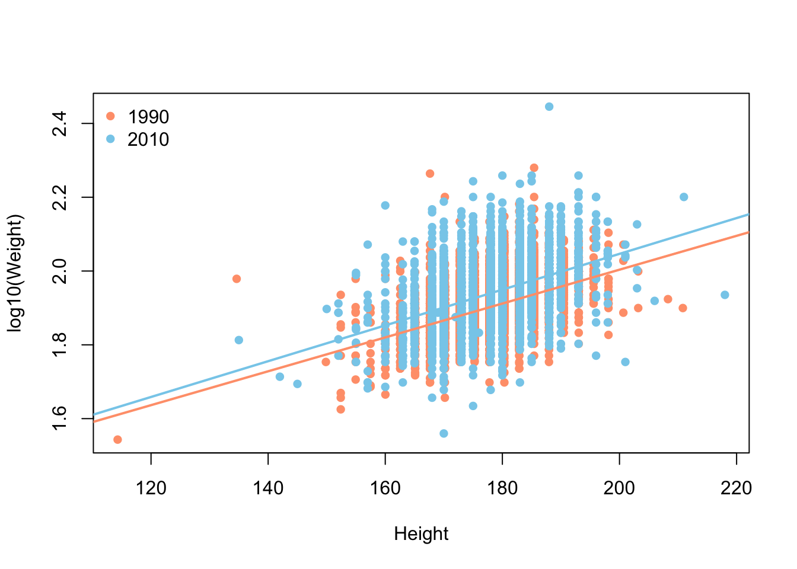](comparison_options_files/figure-html/unnamed-chunk-58-1.png)

[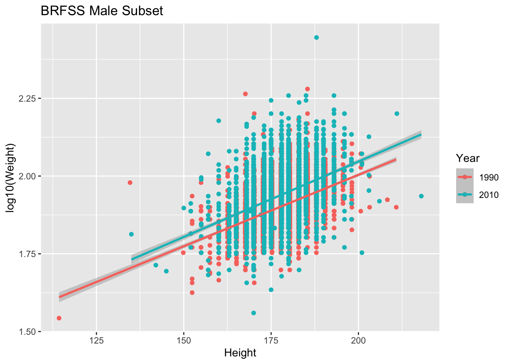](comparison_options_files/figure-html/unnamed-chunk-59-1.png)

## 19.6 Exercises

1.  **Count the other way.** We tabulated `Year` with base R’s [`table()`](https://rdrr.io/r/base/table.html) and with `dplyr`’s [`count()`](https://dplyr.tidyverse.org/reference/count.html). Do the same for the `Sex` column using *both* dialects, and confirm they report the same group sizes in different formats.

    > **NOTE:**
    > ``` downlit
    > # base R
    > table(brfss_DF$Sex)
    > ```
    >
    >
    >     Female   Male 
    >      12039   7961 
    >
    > ``` downlit
    > # dplyr
    > brfss_tbl |> count(Sex)
    > ```
    >
    >     # A tibble: 2 × 2
    >       Sex        n
    >       <fct>  <int>
    >     1 Female 12039
    >     2 Male    7961
    >
    > [`table()`](https://rdrr.io/r/base/table.html) returns a named vector with the counts under each level, while [`count()`](https://dplyr.tidyverse.org/reference/count.html) returns a tidy two-column tibble (`Sex` and `n`). Same numbers, two shapes.

2.  **A boxplot, both ways.** Earlier we drew a boxplot of `Weight` by `Sex` for the 2010 data. Draw the equivalent for `Height` by `Sex`, once with base R’s [`plot()`](https://rdrr.io/r/graphics/plot.default.html) and once with `ggplot2`.

    > **NOTE:**
    > ``` downlit
    > # base R
    > plot(Height ~ Sex, brfss_2010_DF)
    > ```
    >
    > [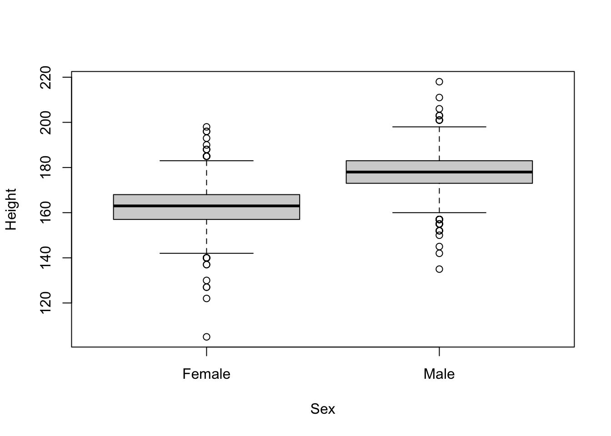](comparison_options_files/figure-html/unnamed-chunk-61-1.png)
    >
    > ``` downlit
    > # ggplot2
    > ggplot(brfss_2010_tbl) +
    >     aes(x = Sex, y = Height) +
    >     geom_boxplot()
    > ```
    >
    >     Warning: Removed 127 rows containing non-finite outside the scale range
    >     (`stat_boxplot()`).
    >
    > [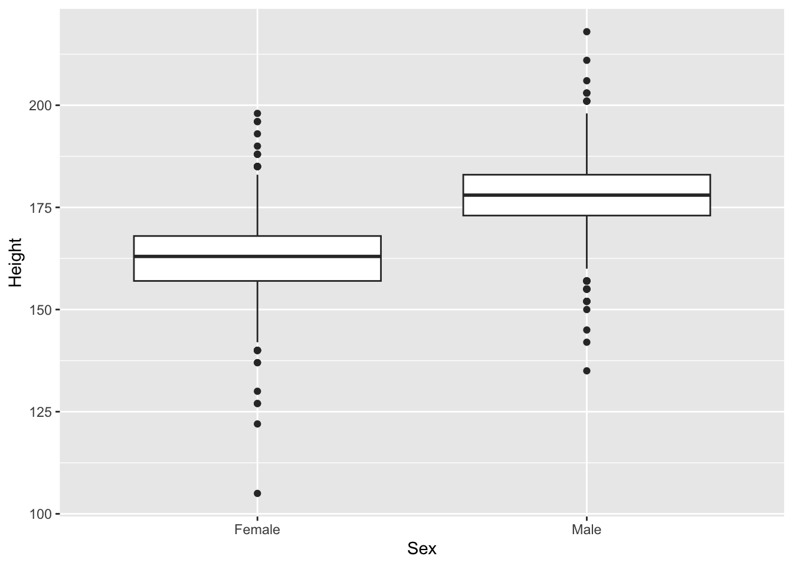](comparison_options_files/figure-html/unnamed-chunk-62-1.png)
    >
    > The base R formula `Height ~ Sex` reads “Height as a function of Sex”; in `ggplot2` the same mapping is spelled out in [`aes()`](https://ggplot2.tidyverse.org/reference/aes.html).

## 19.7 Summary

You’ve now seen the same analysis — loading, tabulating, summarizing, and plotting — written twice, in two of R’s most common dialects:

- **Reading data**: [`read.csv()`](https://rdrr.io/r/utils/read.table.html) gives a base `data.frame`; [`readr::read_csv()`](https://readr.tidyverse.org/reference/read_delim.html) gives a tibble, which is a data frame with friendlier printing and type guessing.
- **Summarizing**: base R reaches for [`table()`](https://rdrr.io/r/base/table.html) and [`aggregate()`](https://rdrr.io/r/stats/aggregate.html); `dplyr` uses [`count()`](https://dplyr.tidyverse.org/reference/count.html), [`summarize()`](https://dplyr.tidyverse.org/reference/summarise.html), and [`group_by()`](https://dplyr.tidyverse.org/reference/group_by.html), often reshaped with [`tidyr::pivot_wider()`](https://tidyr.tidyverse.org/reference/pivot_wider.html).
- **Plotting**: base graphics build a plot with [`plot()`](https://rdrr.io/r/graphics/plot.default.html) plus helpers like [`lines()`](https://rdrr.io/r/graphics/lines.html) and [`legend()`](https://rdrr.io/r/graphics/legend.html); `ggplot2` builds it up in layers from an [`aes()`](https://ggplot2.tidyverse.org/reference/aes.html) mapping and `geom_*()` functions.

Neither dialect is the winner. Base R is always available and concise for quick checks; the tidyverse shines when a pipeline of steps needs to stay readable. Knowing both means you can read anyone’s code and pick the clearer tool for the job in front of you.
