# 17  Case Study: Behavioral Risk Factor Surveillance System

Code

- [Show All Code](javascript:void(0))

- [Hide All Code](javascript:void(0))

- 

  ------------------------------------------------------------------------

- [View Source](javascript:void(0))

Authors

Affiliations

[Sean Davis](https://seandavi.github.io/) [](mailto:seandavi@gmail.com)

[University of Colorado  
Anschutz School of Medicine](https://medschool.cuanschutz.edu/)

Martin Morgan

[Roswell Park Comprehensive Cancer Center  
Bioconductor Core Team](https://www.roswellpark.org/)

Published

June 1, 2024

Modified

September 19, 2026

> **NOTE:**
>
> Much of the material in this chapter is adapted from teaching material by Martin Morgan.

The Behavioral Risk Factor Surveillance System (BRFSS) is a large health survey run every year by the U.S. Centers for Disease Control and Prevention (CDC). Each year it phones hundreds of thousands of adults and asks about their health behaviors, chronic conditions, and use of preventive care. Public-health researchers lean on it to track risk factors, shape policy, and judge whether prevention programs are working.

In this chapter you take on the role of one of those researchers. You’ll work with a small slice of the BRFSS data and walk it through a full **exploratory data analysis (EDA)**: load it, look at it, summarize it, plot it, and ask whether the variables relate to one another. EDA is the first thing you do with any new dataset — before any fancy modeling — because it’s how you learn the shape of your data and catch problems early. By the end you’ll go one step further and fit a simple statistical model to a question the data can actually answer.

Everything here uses **base R** — no extra packages — so you can follow along on a fresh R install.

## 17.1 What you’ll learn

- Download a dataset and load a CSV into R with [`download.file()`](https://rdrr.io/r/utils/download.file.html) and [`read.csv()`](https://rdrr.io/r/utils/read.table.html).
- Inspect a data frame’s size and structure with [`head()`](https://rdrr.io/r/utils/head.html), [`dim()`](https://rdrr.io/r/base/dim.html), and [`summary()`](https://rdrr.io/r/base/summary.html).
- Visualize single variables with [`hist()`](https://rdrr.io/r/graphics/hist.html) and [`boxplot()`](https://rdrr.io/r/graphics/boxplot.html), and pairs of variables with [`plot()`](https://rdrr.io/r/graphics/plot.default.html).
- Measure the strength of a linear relationship with [`cor()`](https://rdrr.io/r/stats/cor.html), and handle the missing-value trap that makes it return `NA`.
- Compare a measurement between two groups with a [`t.test()`](https://rdrr.io/r/stats/t.test.html), and fit and read a simple linear regression with [`lm()`](https://rdrr.io/r/stats/lm.html).

## 17.2 Loading the dataset

First you need the data. You can download it from [this link](data/BRFSS-subset.csv) by hand, or — better — let R fetch it for you straight from the command line. The [`download.file()`](https://rdrr.io/r/utils/download.file.html) function takes a URL and a local filename to save it under:

``` downlit
download.file('https://raw.githubusercontent.com/seandavi/ITR/master/BRFSS-subset.csv',
              destfile = 'BRFSS-subset.csv')
```

That writes a file called `BRFSS-subset.csv` into your working directory. Now you point R at that file and read it in with [`read.csv()`](https://rdrr.io/r/utils/read.table.html), storing the result in a data frame called `brfss`:

``` downlit
path <- "BRFSS-subset.csv"
stopifnot(file.exists(path))
brfss <- read.csv(path)
```

The `stopifnot(file.exists(path))` line is a small safety check: if the file isn’t where you said it is, R stops immediately with a clear message instead of failing in some confusing way two steps later.

> **TIP:**
>
> If you downloaded the file by hand and aren’t sure of its exact path, you can let R open a file-chooser dialog instead of typing the path:
>
> ``` downlit
> path <- file.choose()    # opens a dialog; navigate to BRFSS-subset.csv
> brfss <- read.csv(path)
> ```
>
> That’s handy when you’re poking around interactively, but for a script or a reproducible document you want a fixed path like the one above so it runs the same way every time.

## 17.3 Inspecting the data

Whenever you load a dataset, your very first move should be to *look at it*. Start with [`head()`](https://rdrr.io/r/utils/head.html), which prints the first six rows:

``` downlit
head(brfss)
```

      Age   Weight    Sex Height Year
    1  31 48.98798 Female 157.48 1990
    2  57 81.64663 Female 157.48 1990
    3  43 80.28585   Male 177.80 1990
    4  72 70.30682   Male 170.18 1990
    5  31 49.89516 Female 154.94 1990
    6  58 54.43108 Female 154.94 1990

That gives you a feel for what each column holds and what type of value it is. Here you can see an `Age`, a `Weight`, a `Height`, a `Sex`, and a `Year`.

Next, check how big the dataset is with [`dim()`](https://rdrr.io/r/base/dim.html), which reports the number of rows and columns:

``` downlit
dim(brfss)
```

    [1] 20000     5

Knowing the size matters: it tells you whether you have a handful of records or many thousands, which shapes what analyses make sense.

## 17.4 Summary statistics

Now that you know the structure, get a quick numeric overview of every column at once with [`summary()`](https://rdrr.io/r/base/summary.html):

``` downlit
summary(brfss)
```

          Age            Weight              Sex            Height     
     Min.   :18.00   Min.   : 34.93   Length   :20000   Min.   :105.0  
     1st Qu.:36.00   1st Qu.: 61.69   N.unique :    2   1st Qu.:162.6  
     Median :51.00   Median : 72.57   N.blank  :    0   Median :168.0  
     Mean   :50.99   Mean   : 75.42   Min.nchar:    4   Mean   :169.2  
     3rd Qu.:65.00   3rd Qu.: 86.18   Max.nchar:    6   3rd Qu.:177.8  
     Max.   :99.00   Max.   :278.96                     Max.   :218.0  
     NAs    :139     NAs    :649                        NAs    :184    
          Year     
     Min.   :1990  
     1st Qu.:1990  
     Median :2000  
     Mean   :2000  
     3rd Qu.:2010  
     Max.   :2010  
                   

For each **numeric** column (`Age`, `Weight`, `Height`) this prints the minimum, first quartile, median, mean, third quartile, and maximum. For text/categorical columns you get a simpler count. Two things to notice right away: the `Weight` and `Height` columns list a number of `NA`’s (missing values), and the spread between the median and the maximum hints at the *shape* of each distribution. Both of those observations will matter shortly.

## 17.5 Visualizing single variables

Numbers in a summary table only take you so far. A picture of a single variable — its **distribution** — tells you far more about its shape, center, and spread. Start with a histogram of `Age` using [`hist()`](https://rdrr.io/r/graphics/hist.html):

``` downlit
hist(brfss$Age, main = "Age Distribution",
     xlab = "Age", col = "lightblue")
```

[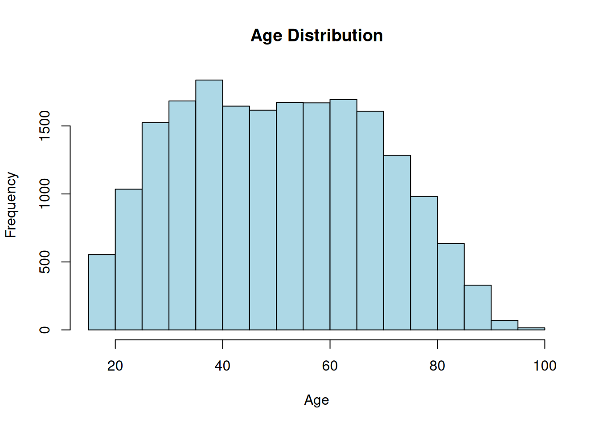](eda_and_univariate_brfss_files/figure-html/fig-age-hist-1.png "Figure 17.1: Distribution of respondent ages in the BRFSS subset.")

Figure 17.1: Distribution of respondent ages in the BRFSS subset.

Each bar counts how many respondents fall in that age range. You can read the center, the spread, and whether the distribution is roughly symmetric or lopsided straight off the picture.

> **TIP:**
>
> [`hist()`](https://rdrr.io/r/graphics/hist.html) has many options: the number of bins, the bar color, the title, the axis labels, and more. You can pull up the full list any time by typing [`?hist`](https://rdrr.io/r/graphics/hist.html) in the R console.
>
> This is a habit worth building for *every* function you use. The documentation for any function `f` is one keystroke away with `?f` or `help("f")`, and it’s the fastest way to learn what a function can do.

Next, compare a variable *across groups*. A boxplot is perfect for this. Here you compare the `Weight` distribution between the two sexes. The formula `Weight ~ Sex` reads as “weight broken down by sex”:

``` downlit
boxplot(brfss$Weight ~ brfss$Sex, main = "Weight Distribution by Sex",
        xlab = "Sex", ylab = "Weight", col = c("pink", "lightblue"))
```

[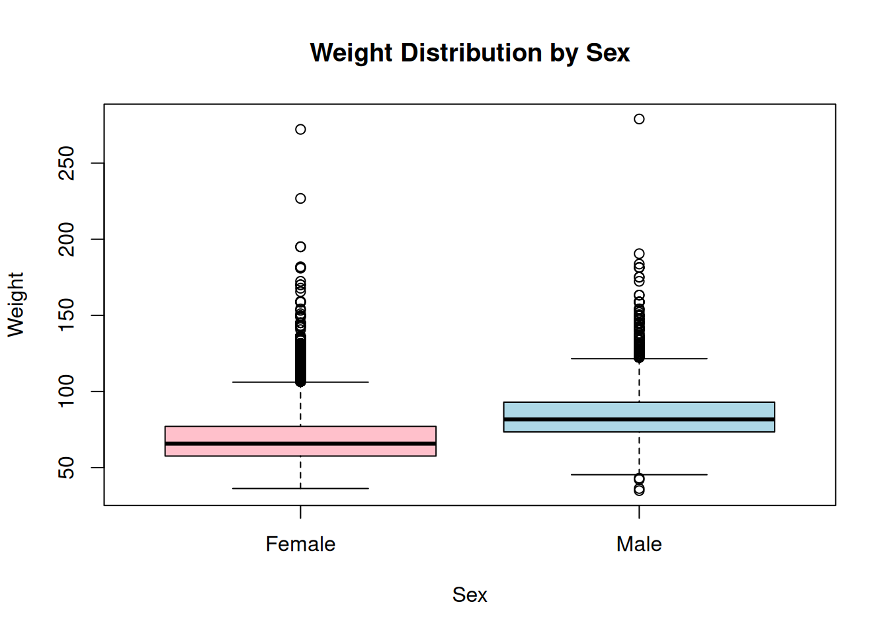](eda_and_univariate_brfss_files/figure-html/fig-weight-by-sex-1.png "Figure 17.2: Weight distribution compared between the sexes.")

Figure 17.2: Weight distribution compared between the sexes.

Each box spans the middle 50% of weights, the thick line is the median, and the whiskers reach out toward the extremes. At a glance you can see whether one group tends to weigh more than the other and whether the spreads differ.

## 17.6 Analyzing relationships between variables

So far you’ve looked at variables one at a time. EDA gets really interesting when you ask whether *two* variables move together. Start with a scatterplot of age against weight using [`plot()`](https://rdrr.io/r/graphics/plot.default.html):

``` downlit
plot(brfss$Age, brfss$Weight, main = "Scatterplot of Age and Weight",
     xlab = "Age", ylab = "Weight", col = "darkblue")
```

[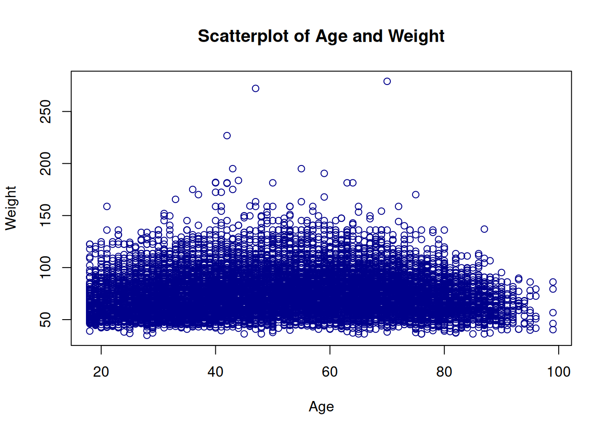](eda_and_univariate_brfss_files/figure-html/fig-age-weight-scatter-1.png "Figure 17.3: Scatterplot of age versus weight.")

Figure 17.3: Scatterplot of age versus weight.

Each point is one respondent. A cloud with no obvious slope means little relationship; a tilted, tightening band means the two variables tend to rise or fall together.

To put a single number on that, compute the **correlation coefficient** with [`cor()`](https://rdrr.io/r/stats/cor.html). It runs from −1 (perfect negative relationship) through 0 (none) to +1 (perfect positive relationship):

``` downlit
cor(brfss$Age, brfss$Weight)
```

    [1] NA

That’s not a number — it’s `NA`. This is one of the most common surprises in R, so it’s worth pausing on.

> **WARNING:**
>
> Remember those `NA`’s the [`summary()`](https://rdrr.io/r/base/summary.html) flagged in the `Weight` column? By default [`cor()`](https://rdrr.io/r/stats/cor.html) refuses to guess what a missing value should be, so if *any* pair has a missing value the whole result comes back `NA`. A quick look at [`help("cor")`](https://rdrr.io/r/stats/cor.html) points to the fix: the `use` argument. Setting `use = "complete.obs"` tells [`cor()`](https://rdrr.io/r/stats/cor.html) to drop the rows with missing values and compute the correlation on the rest.

``` downlit
cor(brfss$Age, brfss$Weight, use = "complete.obs")
```

    [1] 0.02699989

Now you get a real number. It’s small and positive, telling you age and weight are only weakly related in this dataset.

## 17.7 Comparing two groups: a t-test

EDA naturally raises questions that a picture alone can’t settle. Here’s one: the BRFSS subset spans two survey years, 1990 and 2010. **Did the average weight of female respondents change between those years?**

R read the `Year` column as a plain integer, but for grouping it’s really a **category** with two levels. Convert it to a factor so R treats it that way:

``` downlit
brfss$Year <- factor(brfss$Year)
```

Now pull out just the female respondents into their own data frame so you can compare them across years:

``` downlit
brfssFemale <- brfss[brfss$Sex == "Female", ]
summary(brfssFemale)
```

          Age            Weight              Sex            Height        Year     
     Min.   :18.00   Min.   : 36.29   Length   :12039   Min.   :105.0   1990:5718  
     1st Qu.:37.00   1st Qu.: 57.61   N.unique :    1   1st Qu.:157.5   2010:6321  
     Median :52.00   Median : 65.77   N.blank  :    0   Median :163.0              
     Mean   :51.92   Mean   : 69.05   Min.nchar:    6   Mean   :163.3              
     3rd Qu.:67.00   3rd Qu.: 77.11   Max.nchar:    6   3rd Qu.:168.0              
     Max.   :99.00   Max.   :272.16                     Max.   :200.7              
     NAs    :103     NAs    :560                        NAs    :140                

A boxplot of weight by year shows the comparison at a glance. The formula `Weight ~ Year` again reads “weight broken down by year”:

``` downlit
plot(Weight ~ Year, brfssFemale)
```

[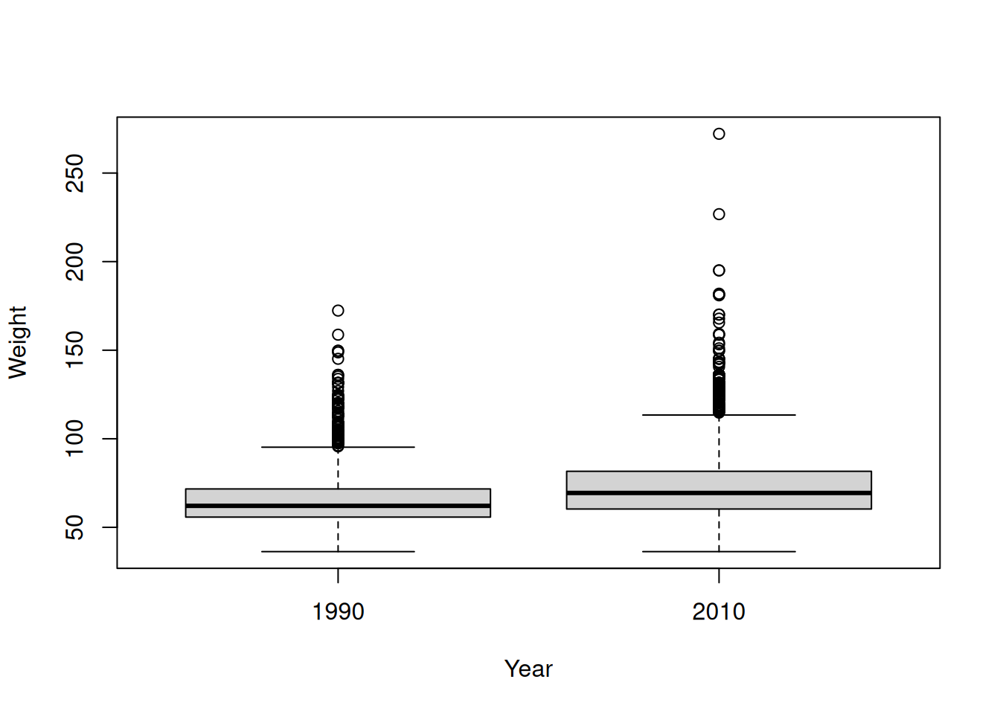](eda_and_univariate_brfss_files/figure-html/fig-female-weight-year-1.png "Figure 17.4: Female respondent weight in 1990 versus 2010.")

Figure 17.4: Female respondent weight in 1990 versus 2010.

The 2010 box looks shifted up from the 1990 box — average weight appears higher in the later year. But “appears higher” isn’t an answer. To decide whether that gap is larger than you’d expect from chance alone, use a **two-sample t-test**. (We cover the t-test in depth in [sec-ttest](#sec-ttest); here we just put it to work.)

``` downlit
t.test(Weight ~ Year, brfssFemale)
```


        Welch Two Sample t-test

    data:  Weight by Year
    t = -27.133, df = 11079, p-value < 2.2e-16
    alternative hypothesis: true difference in means between group 1990 and group 2010 is not equal to 0
    95 percent confidence interval:
     -8.723607 -7.548102
    sample estimates:
    mean in group 1990 mean in group 2010 
              64.81838           72.95424 

Read the output from the bottom up. The two group means show 2010 females weigh more on average than 1990 females. The **p-value** is tiny — far below the usual 0.05 threshold — so the difference is *statistically significant*: a gap this large is very unlikely to be a fluke of sampling. The **confidence interval** for the difference doesn’t include zero, telling the same story. You can now say, with evidence, that average female weight was higher in 2010 than in 1990.

## 17.8 Fitting a model: weight and height

A t-test compares groups. A different kind of question asks how one *continuous* variable depends on another: **for 2010 males, how does weight change with height?** That’s a job for **linear regression**.

First, subset to 2010 males with [`subset()`](https://rdrr.io/r/base/subset.html), then look at the pieces:

``` downlit
brfss2010Male <- subset(brfss, Year == 2010 & Sex == "Male")
summary(brfss2010Male)
```

          Age            Weight              Sex           Height      Year     
     Min.   :18.00   Min.   : 36.29   Length   :3679   Min.   :135   1990:   0  
     1st Qu.:45.00   1st Qu.: 77.11   N.unique :   1   1st Qu.:173   2010:3679  
     Median :57.00   Median : 86.18   N.blank  :   0   Median :178              
     Mean   :56.25   Mean   : 88.85   Min.nchar:   4   Mean   :178              
     3rd Qu.:68.00   3rd Qu.: 99.79   Max.nchar:   4   3rd Qu.:183              
     Max.   :99.00   Max.   :278.96                    Max.   :218              
     NAs    :30      NAs    :49                        NAs    :31               

Look at each variable on its own first, then look at the relationship:

``` downlit
hist(brfss2010Male$Weight)
```

[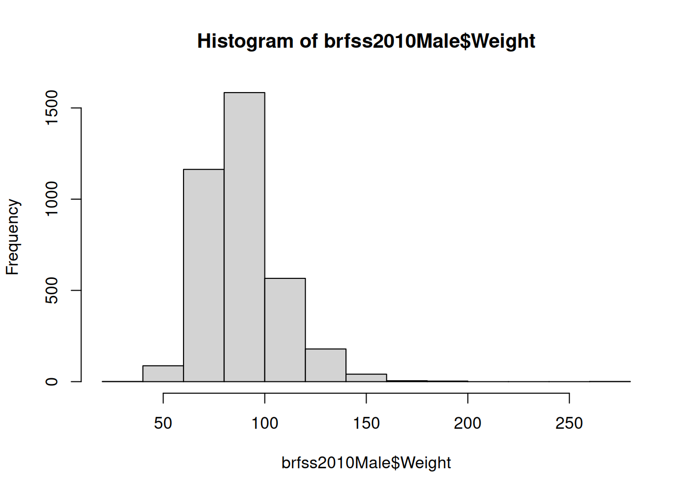](eda_and_univariate_brfss_files/figure-html/fig-male-weight-hist-1.png "Figure 17.5: Weight distribution for 2010 male respondents.")

Figure 17.5: Weight distribution for 2010 male respondents.

``` downlit
hist(brfss2010Male$Height)
```

[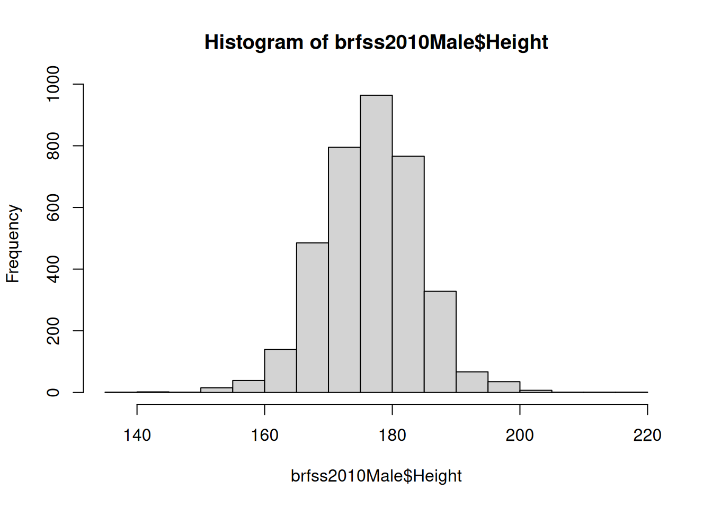](eda_and_univariate_brfss_files/figure-html/fig-male-height-hist-1.png "Figure 17.6: Height distribution for 2010 male respondents.")

Figure 17.6: Height distribution for 2010 male respondents.

``` downlit
plot(Weight ~ Height, brfss2010Male)
```

[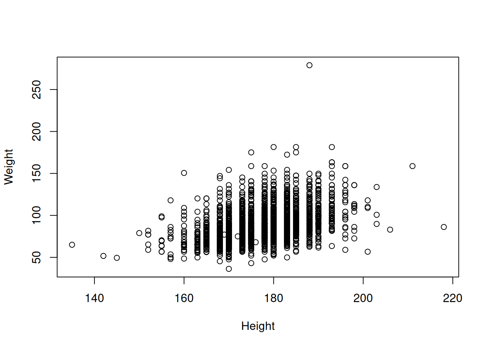](eda_and_univariate_brfss_files/figure-html/fig-male-weight-height-1.png "Figure 17.7: Weight versus height for 2010 male respondents.")

Figure 17.7: Weight versus height for 2010 male respondents.

The scatterplot shows the expected upward trend: taller men tend to weigh more. Now quantify that trend by fitting a straight line through the cloud with [`lm()`](https://rdrr.io/r/stats/lm.html) (“linear model”). The formula `Weight ~ Height` reads “model weight as a function of height”:

``` downlit
fit <- lm(Weight ~ Height, brfss2010Male)
fit
```


    Call:
    lm(formula = Weight ~ Height, data = brfss2010Male)

    Coefficients:
    (Intercept)       Height  
       -86.8747       0.9873  

The printout gives two **coefficients**. The `(Intercept)` is where the line crosses zero height (not physically meaningful here, just where the math anchors the line). The `Height` coefficient is the **slope**: for each additional centimeter of height, predicted weight goes up by that many kilograms. That single number is the relationship, summarized.

You can lay out the same fit as an **ANOVA table**, which partitions the variability in weight and tests whether height explains a significant share of it:

``` downlit
anova(fit)
```

    Analysis of Variance Table

    Response: Weight
                Df  Sum Sq Mean Sq F value    Pr(>F)    
    Height       1  197664  197664   693.8 < 2.2e-16 ***
    Residuals 3617 1030484     285                      
    ---
    Signif. codes:  0 '***' 0.001 '**' 0.01 '*' 0.05 '.' 0.1 ' ' 1

The small p-value on the `Height` row confirms what the scatterplot suggested: height explains a statistically significant amount of the variation in weight.

To *see* the fitted model, redraw the scatterplot and superimpose the regression line with [`abline()`](https://rdrr.io/r/graphics/abline.html), which knows how to read the line straight out of a fitted model object:

``` downlit
plot(Weight ~ Height, brfss2010Male)
abline(fit, col = "blue", lwd = 2)
# Substitute your own weight and height to see where you land...
points(73 * 2.54, 178 / 2.2, col = "red", cex = 4, pch = 20)
```

[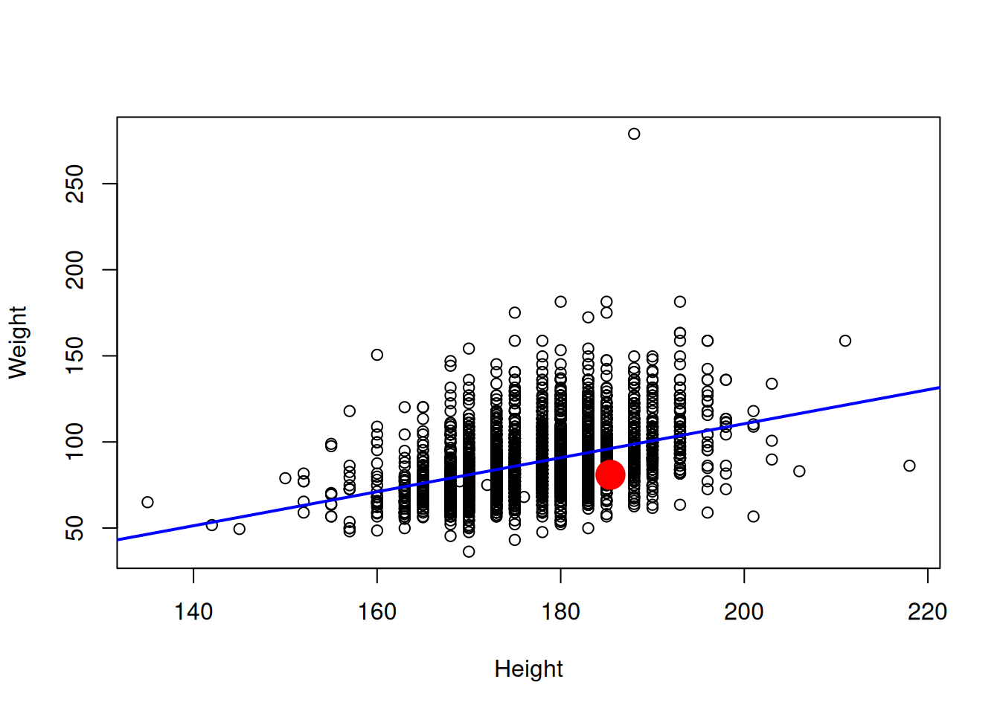](eda_and_univariate_brfss_files/figure-html/fig-male-fit-line-1.png "Figure 17.8: The fitted regression line through the weight-versus-height data, with one point marked in red.")

Figure 17.8: The fitted regression line through the weight-versus-height data, with one point marked in red.

The blue line is the model’s best guess at average weight for any given height. The red dot is one person’s height and weight (converted to centimeters and kilograms); swap in your own numbers to see where you’d fall relative to the trend.

> **NOTE:**
>
> A fitted model is a *noun*; the things you can do to it are *verbs* (R calls them **methods**). When you call [`plot()`](https://rdrr.io/r/graphics/plot.default.html) on a linear model, R quietly routes it to a special version, `plot.lm()`, that draws diagnostic plots instead of a scatterplot. The first one, **Residuals vs Fitted**, is the most useful: it plots the model’s errors against its predictions. You want a shapeless cloud centered on zero — any strong pattern (a curve, a funnel) is a sign the straight-line model is missing something.
>
> ``` downlit
> plot(fit, which = 1)
> ```
>
> [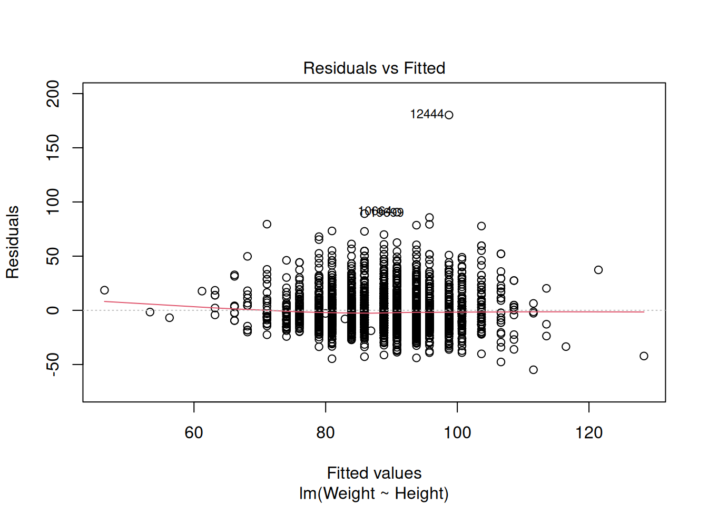](eda_and_univariate_brfss_files/figure-html/fig-male-diagnostics-1.png "Figure 17.9: Residuals-versus-fitted diagnostic plot for the weight-versus-height model.")
>
> Figure 17.9: Residuals-versus-fitted diagnostic plot for the weight-versus-height model.
>
> You can see the full set of diagnostics with `plot(fit)` (it draws four), and read about them with [`?plot.lm`](https://rdrr.io/r/stats/plot.lm.html).

## 17.9 Exercises

1.  What is the mean weight in this dataset? How about the median? What is the difference between the two, and what does that tell you about the shape of the weight distribution?

    Show answer
    ``` downlit
    mean(brfss$Weight, na.rm = TRUE)
    ```

        [1] 75.42455

    Show answer
    ``` downlit
    median(brfss$Weight, na.rm = TRUE)
    ```

        [1] 72.57478

    Show answer
    ``` downlit
    mean(brfss$Weight, na.rm = TRUE) - median(brfss$Weight, na.rm = TRUE)
    ```

        [1] 2.849774

    The mean sits above the median, which is the signature of a distribution with a long right tail — a few very heavy individuals pull the mean up. (Note the `na.rm = TRUE`: just like [`cor()`](https://rdrr.io/r/stats/cor.html), these functions need to be told to ignore the missing values.)

2.  Using what you just found about the mean and median, draw a histogram of the weight distribution with [`hist()`](https://rdrr.io/r/graphics/hist.html). How would you describe its shape?

    Show answer
    ``` downlit
    hist(brfss$Weight, xlab = "Weight (kg)", breaks = 30)
    ```

    [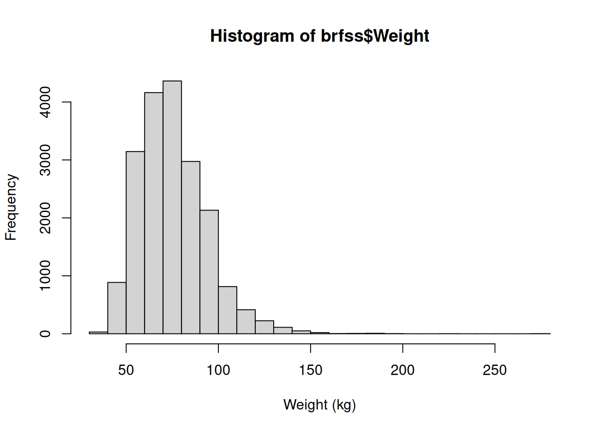](eda_and_univariate_brfss_files/figure-html/unnamed-chunk-16-1.png)

    The histogram is **right-skewed**: most respondents cluster at lower weights with a tail stretching toward the high end — exactly what the mean-above-median result predicted.

3.  Use [`plot()`](https://rdrr.io/r/graphics/plot.default.html) to examine the relationship between height and weight.

    Show answer
    ``` downlit
    plot(brfss$Height, brfss$Weight)
    ```

    [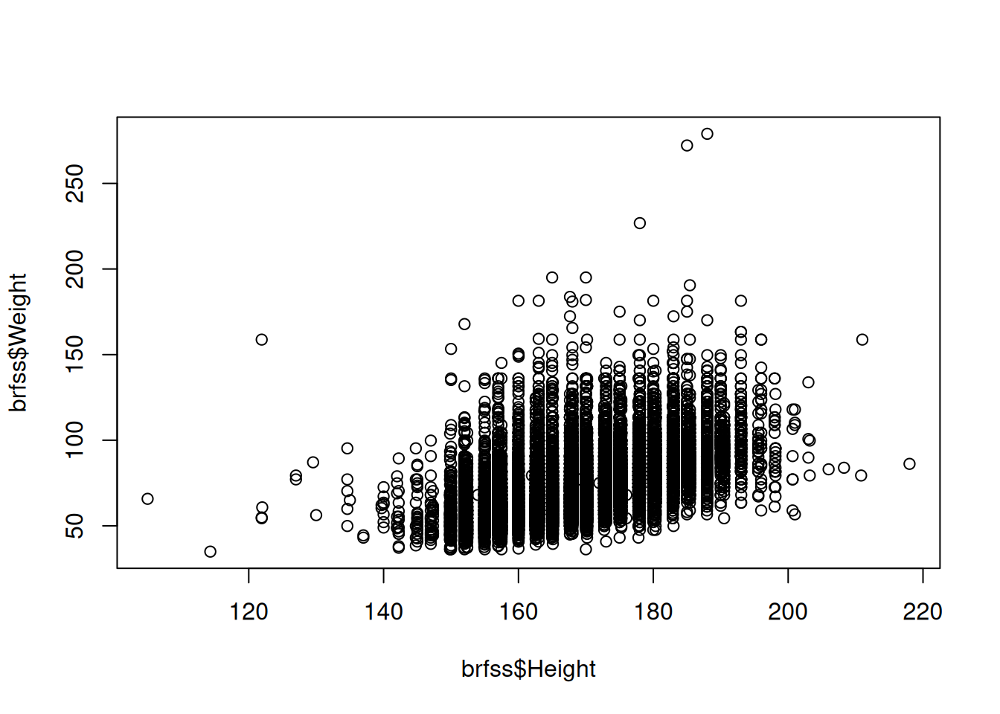](eda_and_univariate_brfss_files/figure-html/unnamed-chunk-17-1.png)

    Taller people tend to be heavier, so the points drift upward to the right.

4.  What is the correlation between height and weight? What does it tell you about their relationship?

    Show answer
    ``` downlit
    cor(brfss$Height, brfss$Weight, use = "complete.obs")
    ```

        [1] 0.5140928

    A moderate-to-strong positive correlation, confirming numerically what the scatterplot showed. (Don’t forget `use = "complete.obs"` to skip the missing values.)

5.  Draw a histogram of the height distribution. How would you describe its shape compared to weight?

    Show answer
    ``` downlit
    hist(brfss$Height, xlab = "Height (cm)", breaks = 30)
    ```

    [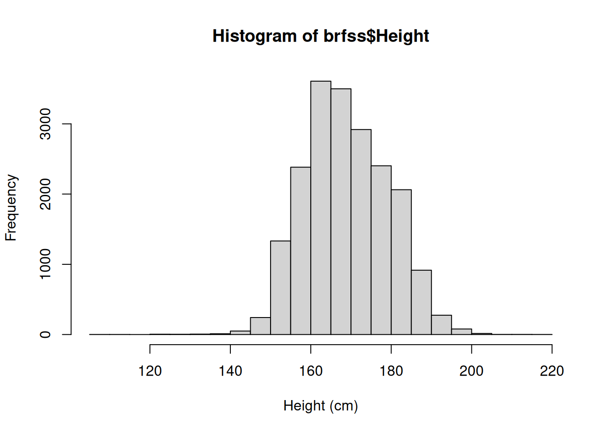](eda_and_univariate_brfss_files/figure-html/unnamed-chunk-19-1.png)

    Height is far more symmetric than weight — closer to the bell-shaped normal curve, with no strong tail to either side.

## 17.10 Summary

You’ve now run a complete exploratory data analysis on a real public-health dataset, end to end:

- You **loaded** the data with [`download.file()`](https://rdrr.io/r/utils/download.file.html) and [`read.csv()`](https://rdrr.io/r/utils/read.table.html), and guarded the load with `stopifnot(file.exists(path))`.
- You **inspected** it with [`head()`](https://rdrr.io/r/utils/head.html), [`dim()`](https://rdrr.io/r/base/dim.html), and [`summary()`](https://rdrr.io/r/base/summary.html), which flagged the missing values that mattered later.
- You **visualized** single variables with [`hist()`](https://rdrr.io/r/graphics/hist.html) and [`boxplot()`](https://rdrr.io/r/graphics/boxplot.html), and pairs of variables with [`plot()`](https://rdrr.io/r/graphics/plot.default.html).
- You **measured** a relationship with [`cor()`](https://rdrr.io/r/stats/cor.html) — and learned that missing values force you to add `use = "complete.obs"`.
- You went **beyond description** to answer real questions: a [`t.test()`](https://rdrr.io/r/stats/t.test.html) showed female weight rose between 1990 and 2010, and an [`lm()`](https://rdrr.io/r/stats/lm.html) quantified how male weight rises with height.

EDA is the beginning of the data-analysis process, not the end — but it’s the part that keeps every later step honest. Knowing the shape of your data, its missing values, and its obvious relationships is what lets you choose the right model and trust the answer it gives. For more on the t-test you used here, see [sec-ttest](#sec-ttest).
