# 34  Genomic ranges and features

Code

- [Show All Code](javascript:void(0))

- [Hide All Code](javascript:void(0))

- 

  ------------------------------------------------------------------------

- [View Source](javascript:void(0))

Author

Affiliation

[Sean Davis](https://seandavi.github.io/) [](mailto:seandavi@gmail.com)

[University of Colorado  
Anschutz School of Medicine](https://medschool.cuanschutz.edu/)

Published

June 1, 2024

Modified

September 19, 2026

Almost everything you study in genomics lives at a *place* on the genome. A gene sits between two coordinates on a chromosome. An exon is a stretch within that gene. A ChIP-seq peak marks where a protein bound. A SNP is a single position. As soon as you have two such sets of places, the most interesting biological questions become questions about *location*: Which peaks fall inside a promoter? What is the nearest gene to this variant? Where do these two experiments agree?

In this chapter you’ll learn to represent those places as **genomic ranges** and to ask how they relate to one another. The workhorse is Bioconductor’s [`GenomicRanges`](http://bioconductor.org/packages/GenomicRanges.html) package ([Lawrence et al. 2013](#ref-lawrence_software_2013)), which gives you a compact object to hold ranges plus any data attached to them, and a vocabulary of fast operations — overlap, nearest-neighbor, flank, reduce — that scale to millions of regions. We’ll build small example objects by hand so you can see exactly what each operation does, then finish with real gene models pulled from a genome annotation.

> **NOTE:**
>
> This chapter’s explanations are adapted, in part, from the Bioconductor *GenomicRanges* vignette by P. Aboyoun, H. Pagès, and M. Lawrence (Artistic-2.0 license), rewritten here for a beginning audience. The package itself is described in Lawrence et al. ([2013](#ref-lawrence_software_2013)).

> **NOTE:**
>
> Different tools count positions differently. The UCSC Genome Browser uses 0-based, half-open coordinates internally, while Ensembl and Bioconductor use 1-based, inclusive coordinates (position 1 is the first base, and both endpoints are included). `GRanges` objects are always 1-based and inclusive, which is one fewer thing to track once you stay inside Bioconductor.

## 34.1 What you’ll learn

- Build a `GRanges` object and read its two-part display (coordinates on the left, metadata on the right).
- Subset and extract parts of a `GRanges` object with accessors like [`seqnames()`](https://rdrr.io/pkg/Seqinfo/man/seqinfo.html), [`ranges()`](https://rdrr.io/pkg/IRanges/man/range-squeezers.html), [`strand()`](https://rdrr.io/pkg/BiocGenerics/man/strand.html), and [`mcols()`](https://rdrr.io/pkg/S4Vectors/man/Vector-class.html).
- Apply intra-range operations ([`flank()`](https://rdrr.io/pkg/IRanges/man/intra-range-methods.html), [`shift()`](https://rdrr.io/pkg/IRanges/man/intra-range-methods.html), [`resize()`](https://rdrr.io/pkg/IRanges/man/intra-range-methods.html)) and inter-range operations ([`reduce()`](https://rdrr.io/pkg/IRanges/man/inter-range-methods.html), [`disjoin()`](https://rdrr.io/pkg/IRanges/man/inter-range-methods.html), [`gaps()`](https://rdrr.io/pkg/IRanges/man/inter-range-methods.html), [`coverage()`](https://rdrr.io/pkg/IRanges/man/coverage-methods.html)).
- Find relationships between two sets of ranges with [`findOverlaps()`](https://rdrr.io/pkg/IRanges/man/findOverlaps-methods.html), [`subsetByOverlaps()`](https://rdrr.io/pkg/IRanges/man/findOverlaps-methods.html), [`nearest()`](https://rdrr.io/pkg/IRanges/man/nearest-methods.html), and [`distanceToNearest()`](https://rdrr.io/pkg/IRanges/man/nearest-methods.html).
- Group ranges into a `GRangesList` (for example, the exons of a transcript).
- Pull gene, transcript, and exon models out of a `TxDb` annotation package.

## 34.2 Bioconductor and GenomicRanges

``` downlit
library(GenomicRanges)
```

The Bioconductor [`GenomicRanges`](http://bioconductor.org/packages/GenomicRanges.html) package ([Lawrence et al. 2013](#ref-lawrence_software_2013)) gives you the `GRanges` container for genomic intervals together with a vocabulary of fast operations on them — subsetting, resizing, overlap, nearest-neighbor, and genome arithmetic. The rest of this chapter introduces both by example, building small objects by hand so you can see exactly what each operation does.

`GRanges` is built on R’s **S4** class system, so each object carries dedicated slots — `seqnames`, `ranges`, `strand`, and metadata — with methods that operate on them. Three related containers show up throughout the chapter:

| Class | What it holds | Typical use |
|----|----|----|
| `GRanges` | a set of genomic ranges plus metadata | ChIP-seq peaks, CpG islands, genes |
| `GRangesList` | a list of `GRanges` objects | exons grouped by transcript |
| `IRanges` | plain integer ranges | the building block inside a `GRanges` |

Table 34.1: The containers used in this chapter.

A compact cheat-sheet of the accessor and operation methods is collected under [Quick reference](#sec-granges-methods) at the end of the chapter; we meet each one in context first.

To get going, we can construct a `GRanges` object by hand as an example.

A `GRanges` holds a set of intervals, each pinned to a chromosome by a single start and a single end. That is exactly the shape of most genomic features — a binding site, a transcript, an exon all amount to “this stretch, on this chromosome” — so a `GRanges` is where you put them. You build one with the [`GRanges()`](https://rdrr.io/pkg/GenomicRanges/man/GRanges-class.html) constructor; the code below does so from scratch. (The [`Rle()`](https://rdrr.io/pkg/S4Vectors/man/Rle-class.html) calls in it simply repeat each value a given number of times — a compact “run-length” shorthand we return to under *coverage* later.)

``` downlit
gr <- GRanges(
    seqnames = Rle(c("chr1", "chr2", "chr1", "chr3"), c(1, 3, 2, 4)),
    ranges = IRanges(101:110, end = 111:120, names = head(letters, 10)),
    strand = Rle(strand(c("-", "+", "*", "+", "-")), c(1, 2, 2, 3, 2)),
    score = 1:10,
    GC = seq(1, 0, length=10))
gr
```

    GRanges object with 10 ranges and 2 metadata columns:
        seqnames    ranges strand |     score        GC
           <Rle> <IRanges>  <Rle> | <integer> <numeric>
      a     chr1   101-111      - |         1  1.000000
      b     chr2   102-112      + |         2  0.888889
      c     chr2   103-113      + |         3  0.777778
      d     chr2   104-114      * |         4  0.666667
      e     chr1   105-115      * |         5  0.555556
      f     chr1   106-116      + |         6  0.444444
      g     chr3   107-117      + |         7  0.333333
      h     chr3   108-118      + |         8  0.222222
      i     chr3   109-119      - |         9  0.111111
      j     chr3   110-120      - |        10  0.000000
      -------
      seqinfo: 3 sequences from an unspecified genome; no seqlengths

We now have a `GRanges` with 10 ranges. When you print one, the display splits into two regions divided by `|` symbols (see [Figure fig-granges-structure](#fig-granges-structure)). To the left sit the genomic coordinates — `seqnames`, `ranges`, and `strand`; to the right sit the metadata columns. Here the metadata is just the `score` and `GC` columns we supplied, but the right-hand side will happily carry anything else you care to attach to a range.

> **NOTE:**
>
> Think of a `GRanges` as a spreadsheet with a heavy vertical rule drawn down the middle. **Everything to the left of the `|` answers “where?”** — the chromosome (`seqnames`), the start and end (`ranges`), and the `strand`. These columns are mandatory and have their own special accessors. **Everything to the right of the `|` answers “what do we know about it?”** — the metadata: scores, GC content, gene names, p-values, whatever you attach. These are optional and you reach them all at once with [`mcols()`](https://rdrr.io/pkg/S4Vectors/man/Vector-class.html). Keeping that line in mind makes every later operation easier: range operations rearrange the *left* side; your annotations ride along on the *right*.

[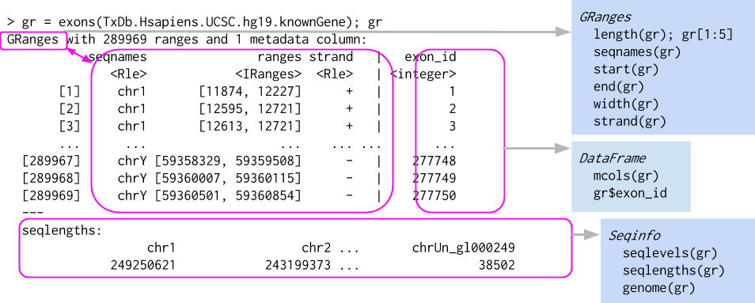](images/granges_structure.png "Figure 34.1: The structure of a GRanges object, which behaves a bit like a vector of ranges, although the analogy is not perfect. A GRanges object is composed of the “Ranges” part the lefthand box, the “metadata” columns (the righthand box), and a “seqinfo” part that describes the names and lengths of associated sequences. Only the “Ranges” part is required. The figure also shows a few of the “accessors” and approaches to subsetting a GRanges object.")

Figure 34.1: The structure of a `GRanges` object, which behaves a bit like a vector of ranges, although the analogy is not perfect. A `GRanges` object is composed of the “Ranges” part the lefthand box, the “metadata” columns (the righthand box), and a “seqinfo” part that describes the names and lengths of associated sequences. Only the “Ranges” part is required. The figure also shows a few of the “accessors” and approaches to subsetting a `GRanges` object.

The components of the genomic coordinates within a GRanges object can be extracted using the seqnames, ranges, and strand accessor functions.

``` downlit
seqnames(gr)
```

    factor-Rle of length 10 with 4 runs
      Lengths:    1    3    2    4
      Values : chr1 chr2 chr1 chr3
    Levels(3): chr1 chr2 chr3

``` downlit
ranges(gr)
```

    IRanges object with 10 ranges and 0 metadata columns:
            start       end     width
        <integer> <integer> <integer>
      a       101       111        11
      b       102       112        11
      c       103       113        11
      d       104       114        11
      e       105       115        11
      f       106       116        11
      g       107       117        11
      h       108       118        11
      i       109       119        11
      j       110       120        11

``` downlit
strand(gr)
```

    factor-Rle of length 10 with 5 runs
      Lengths: 1 2 2 3 2
      Values : - + * + -
    Levels(3): + - *

Note that the `GRanges` object has information to the “left” side of the `|` that has special accessors. The information to the right side of the `|`, when it is present, is the metadata and is accessed using [`mcols()`](https://rdrr.io/pkg/S4Vectors/man/Vector-class.html), for “metadata columns”.

``` downlit
class(mcols(gr))
```

    [1] "DFrame"
    attr(,"package")
    [1] "S4Vectors"

``` downlit
mcols(gr)
```

    DataFrame with 10 rows and 2 columns
          score        GC
      <integer> <numeric>
    a         1  1.000000
    b         2  0.888889
    c         3  0.777778
    d         4  0.666667
    e         5  0.555556
    f         6  0.444444
    g         7  0.333333
    h         8  0.222222
    i         9  0.111111
    j        10  0.000000

Since the `class` of `mcols(gr)` is DFrame, we can use the `DataFrame` (Bioconductor’s data-frame-like table) approaches to work with the data.

``` downlit
mcols(gr)$score
```

     [1]  1  2  3  4  5  6  7  8  9 10

We can even assign a new column. Here we add an `AT` column derived from `GC` (since the fractions sum to 1). Notice that the new column appears on the right of the `|`, alongside `score` and `GC`.

``` downlit
mcols(gr)$AT <- 1 - mcols(gr)$GC
gr
```

    GRanges object with 10 ranges and 3 metadata columns:
        seqnames    ranges strand |     score        GC        AT
           <Rle> <IRanges>  <Rle> | <integer> <numeric> <numeric>
      a     chr1   101-111      - |         1  1.000000  0.000000
      b     chr2   102-112      + |         2  0.888889  0.111111
      c     chr2   103-113      + |         3  0.777778  0.222222
      d     chr2   104-114      * |         4  0.666667  0.333333
      e     chr1   105-115      * |         5  0.555556  0.444444
      f     chr1   106-116      + |         6  0.444444  0.555556
      g     chr3   107-117      + |         7  0.333333  0.666667
      h     chr3   108-118      + |         8  0.222222  0.777778
      i     chr3   109-119      - |         9  0.111111  0.888889
      j     chr3   110-120      - |        10  0.000000  1.000000
      -------
      seqinfo: 3 sequences from an unspecified genome; no seqlengths

Another common way to create a `GRanges` object is to start with a `data.frame`, perhaps created by hand like below or read in using `read.csv` or `read.table`. We can convert from a `data.frame`, when columns are named appropriately, to a `GRanges` object.

``` downlit
df_regions <- data.frame(chromosome = rep("chr1", 10),
                         start = seq(1000, 10000, 1000),
                         end = seq(1100, 10100, 1000))
as(df_regions, 'GRanges') # note that names have to match with GRanges slots
```

    GRanges object with 10 ranges and 0 metadata columns:
           seqnames      ranges strand
              <Rle>   <IRanges>  <Rle>
       [1]     chr1   1000-1100      *
       [2]     chr1   2000-2100      *
       [3]     chr1   3000-3100      *
       [4]     chr1   4000-4100      *
       [5]     chr1   5000-5100      *
       [6]     chr1   6000-6100      *
       [7]     chr1   7000-7100      *
       [8]     chr1   8000-8100      *
       [9]     chr1   9000-9100      *
      [10]     chr1 10000-10100      *
      -------
      seqinfo: 1 sequence from an unspecified genome; no seqlengths

``` downlit
## fix column name
colnames(df_regions)[1] <- 'seqnames'
gr2 <- as(df_regions, 'GRanges')
gr2
```

    GRanges object with 10 ranges and 0 metadata columns:
           seqnames      ranges strand
              <Rle>   <IRanges>  <Rle>
       [1]     chr1   1000-1100      *
       [2]     chr1   2000-2100      *
       [3]     chr1   3000-3100      *
       [4]     chr1   4000-4100      *
       [5]     chr1   5000-5100      *
       [6]     chr1   6000-6100      *
       [7]     chr1   7000-7100      *
       [8]     chr1   8000-8100      *
       [9]     chr1   9000-9100      *
      [10]     chr1 10000-10100      *
      -------
      seqinfo: 1 sequence from an unspecified genome; no seqlengths

The first [`as()`](https://rdrr.io/r/methods/as.html) call worked even though the chromosome column was named `chromosome` — [`as()`](https://rdrr.io/r/methods/as.html) recognized `start` and `end` and treated the rest as metadata. After we rename that column to `seqnames`, the conversion places it correctly on the *left* of the `|` as the sequence name.

`GRanges` have one-dimensional-like behavior. For instance, we can check the `length` and even give `GRanges` names.

``` downlit
names(gr)
```

     [1] "a" "b" "c" "d" "e" "f" "g" "h" "i" "j"

``` downlit
length(gr)
```

    [1] 10

### 34.2.1 Subsetting GRanges objects

While `GRanges` objects look a bit like a `data.frame`, they can be thought of as vectors with associated ranges. Subsetting, then, works very similarly to vectors. To subset a `GRanges` object to include only second and third regions:

``` downlit
gr[2:3]
```

    GRanges object with 2 ranges and 3 metadata columns:
        seqnames    ranges strand |     score        GC        AT
           <Rle> <IRanges>  <Rle> | <integer> <numeric> <numeric>
      b     chr2   102-112      + |         2  0.888889  0.111111
      c     chr2   103-113      + |         3  0.777778  0.222222
      -------
      seqinfo: 3 sequences from an unspecified genome; no seqlengths

That said, if the `GRanges` object has metadata columns, we can also treat it like a two-dimensional object kind of like a data.frame. Note that the information to the left of the `|` is not like a `data.frame`, so we *cannot* do something like `gr$seqnames`. Here is an example of subsetting with the subset of one metadata column.

``` downlit
gr[2:3, "GC"]
```

    GRanges object with 2 ranges and 1 metadata column:
        seqnames    ranges strand |        GC
           <Rle> <IRanges>  <Rle> | <numeric>
      b     chr2   102-112      + |  0.888889
      c     chr2   103-113      + |  0.777778
      -------
      seqinfo: 3 sequences from an unspecified genome; no seqlengths

The usual [`head()`](https://rdrr.io/r/utils/head.html) and [`tail()`](https://rdrr.io/r/utils/head.html) also work just fine.

``` downlit
head(gr,n=2)
```

    GRanges object with 2 ranges and 3 metadata columns:
        seqnames    ranges strand |     score        GC        AT
           <Rle> <IRanges>  <Rle> | <integer> <numeric> <numeric>
      a     chr1   101-111      - |         1  1.000000  0.000000
      b     chr2   102-112      + |         2  0.888889  0.111111
      -------
      seqinfo: 3 sequences from an unspecified genome; no seqlengths

``` downlit
tail(gr,n=2)
```

    GRanges object with 2 ranges and 3 metadata columns:
        seqnames    ranges strand |     score        GC        AT
           <Rle> <IRanges>  <Rle> | <integer> <numeric> <numeric>
      i     chr3   109-119      - |         9  0.111111  0.888889
      j     chr3   110-120      - |        10  0.000000  1.000000
      -------
      seqinfo: 3 sequences from an unspecified genome; no seqlengths

### 34.2.2 Interval operations on one GRanges object

#### 34.2.2.1 Intra-range methods

The operations in this section reshape each range *on its own*, never looking at its neighbours — which is why they are called “intra-range” methods. The ones that do look across the whole set come next, in the [Inter-range methods](#inter-range-methods) section.

To make the operations in this section easy to *see*, we’ll work with a small set of ranges on a single chromosome and draw a picture of each operation as we go. Here is the toy `GRanges`, `g`:

``` downlit
g <- GRanges("chr1",
             IRanges(start = c(5, 15, 30, 33, 50),
                     end   = c(22, 27, 42, 55, 58)),
             score = c(5, 8, 3, 9, 6))
names(g) <- letters[1:5]
g
```

    GRanges object with 5 ranges and 1 metadata column:
        seqnames    ranges strand |     score
           <Rle> <IRanges>  <Rle> | <numeric>
      a     chr1      5-22      * |         5
      b     chr1     15-27      * |         8
      c     chr1     30-42      * |         3
      d     chr1     33-55      * |         9
      e     chr1     50-58      * |         6
      -------
      seqinfo: 1 sequence from an unspecified genome; no seqlengths

All five ranges are left **unstranded** (`*`) on purpose: the operations below act purely on position, which is the cleaner first mental model. We bring strand back in deliberately when it changes the answer — for [`flank()`](https://rdrr.io/pkg/IRanges/man/intra-range-methods.html) and [`resize()`](https://rdrr.io/pkg/IRanges/man/intra-range-methods.html).

The figures are all drawn with one small helper built on `ggplot2`. You don’t need to study it to follow the chapter — it just lays each range out as a labelled bar on a coordinate axis, stacking ranges into rows so overlapping ones stay visible — but it’s here if you’d like to reuse it.

Show the range-plotting helper

``` downlit
library(ggplot2)
library(patchwork)

# Lay a GRanges out as labelled bars on a shared coordinate axis. Overlapping
# ranges are stacked into separate rows with IRanges::disjointBins(); strand, when
# present, is shown by colour and unstranded (*) ranges are drawn grey.
plot_ranges <- function(gr, title = NULL, xlim = NULL) {
  bins <- as.integer(IRanges::disjointBins(ranges(gr)))
  df <- data.frame(
    xmin = start(gr) - 0.5, xmax = end(gr) + 0.5, lane = bins,
    strand = factor(as.character(strand(gr)), levels = c("+", "-", "*")),
    label = if (!is.null(names(gr))) names(gr) else as.character(seq_along(gr)))
  if (is.null(xlim)) xlim <- c(min(df$xmin), max(df$xmax))
  has_strand <- any(as.character(strand(gr)) %in% c("+", "-"))
  ggplot(df) +
    geom_rect(aes(xmin = xmin, xmax = xmax, ymin = lane - 0.35, ymax = lane + 0.35,
                  fill = strand), colour = "grey20", linewidth = 0.3) +
    geom_text(aes(x = (xmin + xmax) / 2, y = lane, label = label), size = 3.2) +
    scale_fill_manual(values = c("+" = "#4C72B0", "-" = "#C44E52", "*" = "grey80"),
                      drop = FALSE, name = "strand") +
    scale_y_reverse() +
    coord_cartesian(xlim = xlim) +
    labs(title = title, x = NULL, y = NULL) +
    theme_minimal(base_size = 11) +
    theme(axis.text.y = element_blank(), panel.grid.major.y = element_blank(),
          panel.grid.minor = element_blank(),
          legend.position = if (has_strand) "right" else "none")
}

# Stack a "before" and an "after" GRanges on a shared x-axis for comparison.
before_after <- function(before, after, after_label, before_label = "g") {
  xl <- range(c(start(before), end(before), start(after), end(after))) + c(-2, 2)
  (plot_ranges(before, before_label, xl) / plot_ranges(after, after_label, xl)) +
    plot_layout(guides = "collect")
}

# Draw the per-base coverage of a GRanges as a step plot.
plot_coverage <- function(gr, xlim = NULL) {
  cv <- as.numeric(coverage(gr)[[1]])
  df <- data.frame(pos = seq_along(cv), depth = cv)
  if (is.null(xlim)) xlim <- c(min(start(gr)) - 2, max(end(gr)) + 2)
  ggplot(df, aes(pos, depth)) +
    geom_step(direction = "hv", colour = "#4C72B0") +
    coord_cartesian(xlim = xlim, ylim = c(0, max(df$depth) + 0.5)) +
    labs(x = NULL, y = "depth") +
    theme_minimal(base_size = 11) +
    theme(panel.grid.minor = element_blank())
}
```

``` downlit
plot_ranges(g, "g")
```

[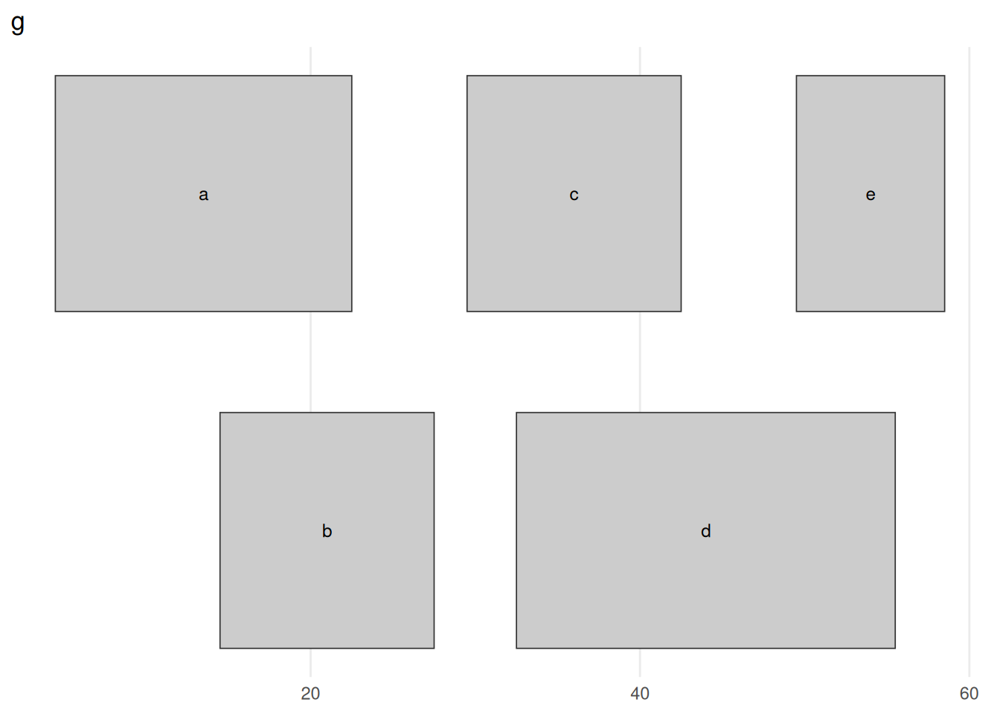](genomic_ranges_files/figure-html/fig-g-toy-1.png "Figure 34.2: Our toy GRanges g: five ranges on chr1, drawn as bars along the coordinate axis. Ranges that would overlap are stacked onto separate rows (a, c, e on top; b, d below) so each stays visible — the rows carry no meaning beyond avoiding collisions. The ranges form two clusters, a/b around 5–27 and c/d/e around 30–58, with a clean gap between them at 28–29. Keep this picture in mind: every figure that follows shows what one operation does to it.")

Figure 34.2: Our toy `GRanges` `g`: five ranges on `chr1`, drawn as bars along the coordinate axis. Ranges that would overlap are stacked onto separate rows (`a`, `c`, `e` on top; `b`, `d` below) so each stays visible — the rows carry no meaning beyond avoiding collisions. The ranges form two clusters, `a`/`b` around 5–27 and `c`/`d`/`e` around 30–58, with a clean gap between them at 28–29. Keep this picture in mind: every figure that follows shows what one operation does to it.

The `GRanges` class has accessors for the “ranges” part of the data. For example:

``` downlit
start(g) # to get start locations
```

    [1]  5 15 30 33 50

``` downlit
end(g)   # to get end locations
```

    [1] 22 27 42 55 58

``` downlit
width(g) # to get the "widths" of each range
```

    [1] 18 13 13 23  9

``` downlit
range(g) # to get the "range" for each sequence (min(start) through max(end))
```

    GRanges object with 1 range and 0 metadata columns:
          seqnames    ranges strand
             <Rle> <IRanges>  <Rle>
      [1]     chr1      5-58      *
      -------
      seqinfo: 1 sequence from an unspecified genome; no seqlengths

The `GRanges` class has many methods for manipulating ranges, classed as intra-range, inter-range, and between-range methods. Intra-range methods operate on each range independently. The [`flank()`](https://rdrr.io/pkg/IRanges/man/intra-range-methods.html) method returns the region *flanking* each range — the bases immediately upstream (or downstream) of it. This is how you turn a gene into its **promoter** (the window just upstream of its start), or grab the sequence beside a transcription-factor binding site to scan for a partner’s motif. Which side is “upstream” depends on **strand**, so to see [`flank()`](https://rdrr.io/pkg/IRanges/man/intra-range-methods.html) clearly we switch to a tiny stranded example: one gene `p` on the `+` strand and one gene `m` on the `-` strand.

``` downlit
gs <- GRanges("chr1",
              IRanges(start = c(10, 40), end = c(25, 55)),
              strand = c("+", "-"))
names(gs) <- c("p", "m")
flank(gs, 8)                # 8 bases upstream of each range
```

    GRanges object with 2 ranges and 0 metadata columns:
        seqnames    ranges strand
           <Rle> <IRanges>  <Rle>
      p     chr1       2-9      +
      m     chr1     56-63      -
      -------
      seqinfo: 1 sequence from an unspecified genome; no seqlengths

``` downlit
flank(gs, 8, start = FALSE) # 8 bases downstream of each range
```

    GRanges object with 2 ranges and 0 metadata columns:
        seqnames    ranges strand
           <Rle> <IRanges>  <Rle>
      p     chr1     26-33      +
      m     chr1     32-39      -
      -------
      seqinfo: 1 sequence from an unspecified genome; no seqlengths

``` downlit
( plot_ranges(gs, "gs", c(0, 68)) /
  plot_ranges(flank(gs, 8), "flank(gs, 8) — upstream", c(0, 68)) /
  plot_ranges(flank(gs, 8, start = FALSE),
              "flank(gs, 8, start = FALSE) — downstream", c(0, 68)) ) +
  plot_layout(guides = "collect")
```

[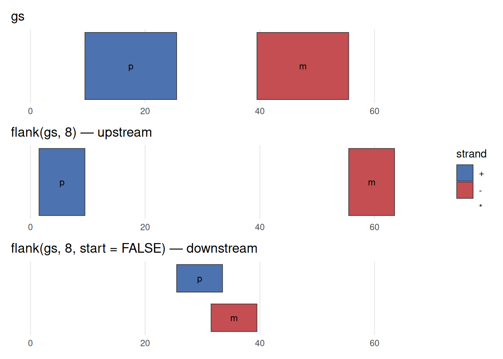](genomic_ranges_files/figure-html/fig-flank-1.png "Figure 34.3: flank() is strand-aware. Top: the two genes, p on the + strand (blue) and m on the - strand (red). Middle: flank(gs, 8) returns the 8 bases upstream of each. For the + gene, upstream is to the left (lower coordinates); but the - gene runs the other way, so its upstream flank sits to the right (higher coordinates). Bottom: flank(gs, 8, start = FALSE) takes the downstream side, flipping each flank to the opposite end. The width (8) is the same in every case — only which side, and that side is decided by strand. Forgetting this is a classic source of off-by-a-region bugs.")

Figure 34.3: [`flank()`](https://rdrr.io/pkg/IRanges/man/intra-range-methods.html) is strand-aware. **Top:** the two genes, `p` on the `+` strand (blue) and `m` on the `-` strand (red). **Middle:** `flank(gs, 8)` returns the 8 bases *upstream* of each. For the `+` gene, upstream is to the *left* (lower coordinates); but the `-` gene runs the other way, so its upstream flank sits to the *right* (higher coordinates). **Bottom:** `flank(gs, 8, start = FALSE)` takes the *downstream* side, flipping each flank to the opposite end. The width (8) is the same in every case — only which side, and that side is decided by strand. Forgetting this is a classic source of off-by-a-region bugs.

> **WARNING:**
>
> For [`flank()`](https://rdrr.io/pkg/IRanges/man/intra-range-methods.html), [`resize()`](https://rdrr.io/pkg/IRanges/man/intra-range-methods.html), [`precede()`](https://rdrr.io/pkg/IRanges/man/nearest-methods.html), and [`follow()`](https://rdrr.io/pkg/IRanges/man/nearest-methods.html), “upstream” and “downstream” are interpreted *relative to the strand*. On the `+` strand, upstream is toward lower coordinates; on the `-` strand it is toward higher coordinates. A `*` (unstranded) range is treated as `+`. If your ranges have the wrong strand — or you forgot to set it — these operations will silently flank the wrong side. When a result looks backwards, check [`strand()`](https://rdrr.io/pkg/BiocGenerics/man/strand.html) first.

Two more intra-range methods are `shift` and `resize`. [`shift()`](https://rdrr.io/pkg/IRanges/man/intra-range-methods.html) slides every range by a fixed number of bases; [`resize()`](https://rdrr.io/pkg/IRanges/man/intra-range-methods.html) sets every range to a chosen width. You reach for [`shift()`](https://rdrr.io/pkg/IRanges/man/intra-range-methods.html) to apply small systematic coordinate corrections — such as nudging an ATAC-seq fragment end to the Tn5 cut site — and for [`resize()`](https://rdrr.io/pkg/IRanges/man/intra-range-methods.html) whenever you need *comparable* regions: fixed-width windows centred on peak summits for motif discovery, or uniform windows around transcription start sites for a metagene heatmap (exactly what the ATAC-seq chapter builds).

``` downlit
shift(g, 5)
```

    GRanges object with 5 ranges and 1 metadata column:
        seqnames    ranges strand |     score
           <Rle> <IRanges>  <Rle> | <numeric>
      a     chr1     10-27      * |         5
      b     chr1     20-32      * |         8
      c     chr1     35-47      * |         3
      d     chr1     38-60      * |         9
      e     chr1     55-63      * |         6
      -------
      seqinfo: 1 sequence from an unspecified genome; no seqlengths

``` downlit
resize(g, width = 12, fix = "center")
```

    GRanges object with 5 ranges and 1 metadata column:
        seqnames    ranges strand |     score
           <Rle> <IRanges>  <Rle> | <numeric>
      a     chr1      8-19      * |         5
      b     chr1     15-26      * |         8
      c     chr1     30-41      * |         3
      d     chr1     38-49      * |         9
      e     chr1     48-59      * |         6
      -------
      seqinfo: 1 sequence from an unspecified genome; no seqlengths

``` downlit
before_after(g, shift(g, 5), "shift(g, 5)")
```

[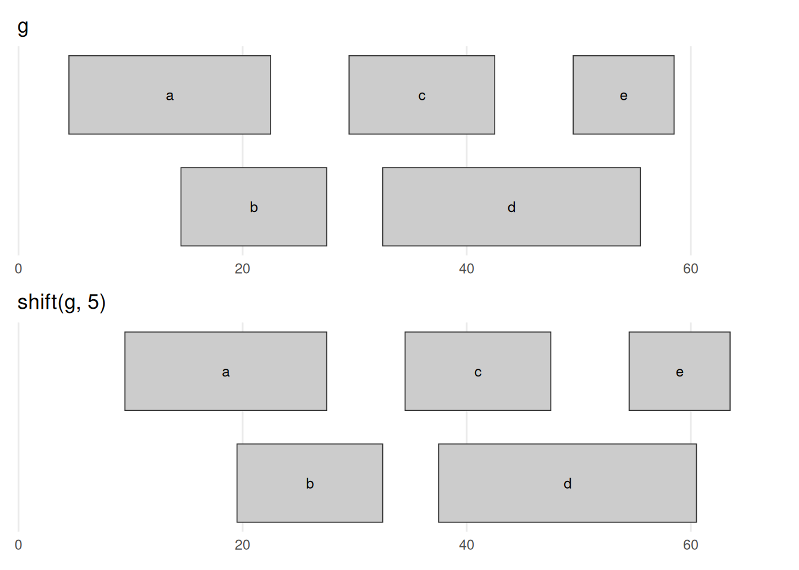](genomic_ranges_files/figure-html/fig-shift-1.png "Figure 34.4: shift(g, 5) slides every range 5 bases toward higher coordinates — the entire picture moves right by 5, and nothing else changes. Every width is preserved and the overlaps are carried along unchanged; only position moves. A negative number shifts left.")

Figure 34.4: `shift(g, 5)` slides every range 5 bases toward higher coordinates — the entire picture moves right by 5, and nothing else changes. Every width is preserved and the overlaps are carried along unchanged; only position moves. A negative number shifts left.

``` downlit
before_after(g, resize(g, width = 12, fix = "center"),
             'resize(g, width = 12, fix = "center")')
```

[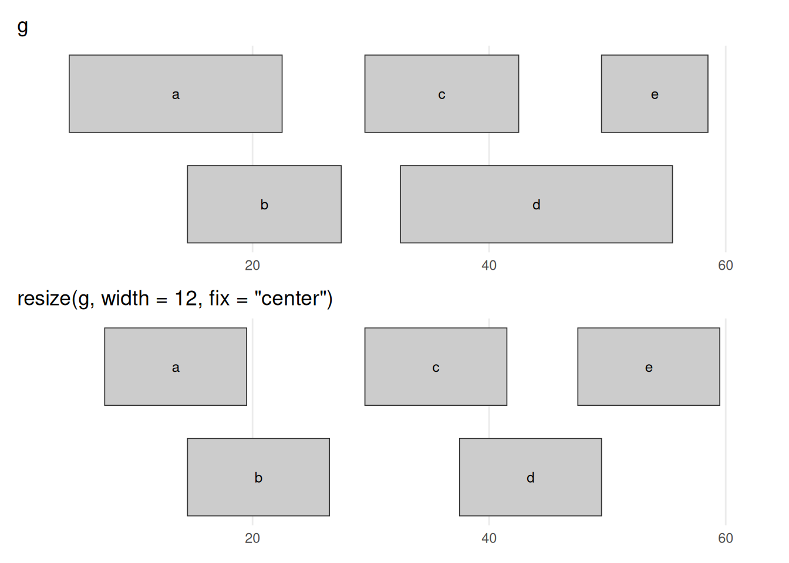](genomic_ranges_files/figure-html/fig-resize-1.png "Figure 34.5: resize(g, width = 12, fix = "center") forces every range to width 12, holding each range’s centre fixed so it grows or shrinks symmetrically: the wide ranges (a, d) contract and the narrow one (e) expands, until all are equal width. The fix argument chooses the anchor — fix = "start" or "end" instead pin one end in place, and, exactly as with flank(), which physical end that is depends on strand (these ranges are unstranded, so "start" means the lower coordinate).")

Figure 34.5: `resize(g, width = 12, fix = "center")` forces every range to width 12, holding each range’s *centre* fixed so it grows or shrinks symmetrically: the wide ranges (`a`, `d`) contract and the narrow one (`e`) expands, until all are equal width. The `fix` argument chooses the anchor — `fix = "start"` or `"end"` instead pin one end in place, and, exactly as with [`flank()`](https://rdrr.io/pkg/IRanges/man/intra-range-methods.html), *which* physical end that is depends on strand (these ranges are unstranded, so `"start"` means the lower coordinate).

The [`GenomicRanges`](http://bioconductor.org/packages/GenomicRanges.html) help page [`?"intra-range-methods"`](https://rdrr.io/pkg/GenomicRanges/man/intra-range-methods.html) summarizes these methods.

#### 34.2.2.2 Inter-range methods

Inter-range methods, by contrast, look at the ranges in a single `GRanges` *together*. The first one to meet is [`reduce()`](https://rdrr.io/pkg/IRanges/man/inter-range-methods.html), which scans the set and merges any ranges that overlap or touch into a single range, leaving you with a tidied-up, non-redundant set.

``` downlit
reduce(g)
```

    GRanges object with 2 ranges and 0 metadata columns:
          seqnames    ranges strand
             <Rle> <IRanges>  <Rle>
      [1]     chr1      5-27      *
      [2]     chr1     30-58      *
      -------
      seqinfo: 1 sequence from an unspecified genome; no seqlengths

``` downlit
before_after(g, reduce(g), "reduce(g)")
```

[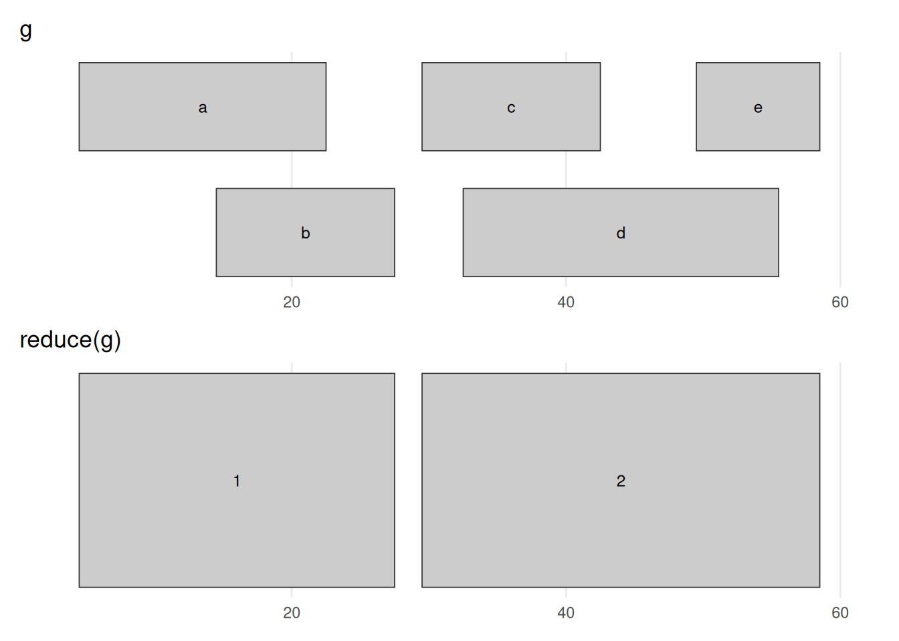](genomic_ranges_files/figure-html/fig-reduce-1.png "Figure 34.6: reduce(g) merges every group of overlapping or touching ranges into the smallest set that covers exactly the same bases. The five input ranges collapse to two: the a/b overlap becomes 5–27 and the c/d/e overlap becomes 30–58. The 28–29 gap survives, because no input range covered those bases. This is the standard way to turn a pile of overlapping annotations (say, exons from many transcripts) into one non-redundant set of covered regions.")

Figure 34.6: `reduce(g)` merges every group of overlapping or touching ranges into the smallest set that covers exactly the same bases. The five input ranges collapse to two: the `a`/`b` overlap becomes 5–27 and the `c`/`d`/`e` overlap becomes 30–58. The 28–29 gap survives, because no input range covered those bases. This is the standard way to turn a pile of overlapping annotations (say, exons from many transcripts) into one non-redundant set of covered regions.

For example, a gene’s exons — pooled across all of its transcripts — overlap heavily; [`reduce()`](https://rdrr.io/pkg/IRanges/man/inter-range-methods.html) collapses them into the gene’s non-redundant exonic footprint, the set you would sum to answer “how many bases of this gene are exonic?”. The same move merges peak calls from several replicates into one consensus set.

Sometimes you care about what lies *between* the ranges. If the ranges are a gene’s exons, the gaps between them are its **introns**; if they are all the genes on a chromosome, the gaps are the **intergenic** regions. The gaps method provides them:

``` downlit
gaps(g)
```

    GRanges object with 2 ranges and 0 metadata columns:
          seqnames    ranges strand
             <Rle> <IRanges>  <Rle>
      [1]     chr1       1-4      *
      [2]     chr1     28-29      *
      -------
      seqinfo: 1 sequence from an unspecified genome; no seqlengths

``` downlit
before_after(g, gaps(g), "gaps(g)")
```

[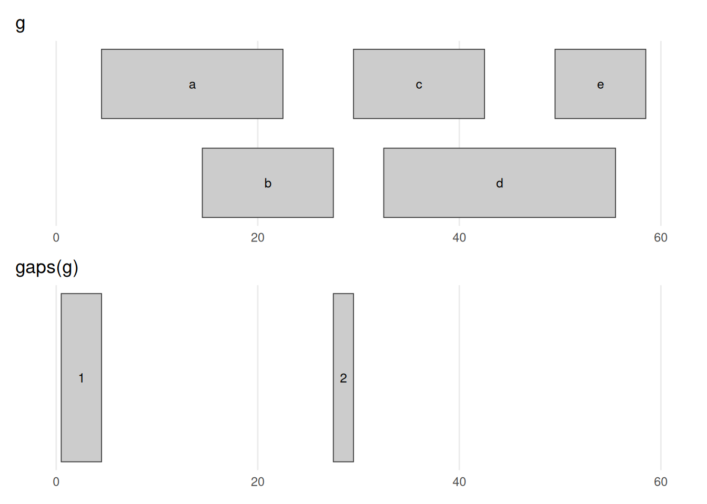](genomic_ranges_files/figure-html/fig-gaps-1.png "Figure 34.7: gaps(g) returns the complement of g — the stretches not covered by any range. The informative one is 28–29, the gap between the two clusters; the 1–4 stretch before the first range also appears. (The gap after the last range is missing because the object has no chromosome length to mark where chr1 ends — see the warning below.) gaps() and reduce() are mirror images: one returns what is covered, the other what is not.")

Figure 34.7: `gaps(g)` returns the complement of `g` — the stretches *not* covered by any range. The informative one is 28–29, the gap between the two clusters; the 1–4 stretch before the first range also appears. (The gap *after* the last range is missing because the object has no chromosome length to mark where `chr1` ends — see the warning below.) [`gaps()`](https://rdrr.io/pkg/IRanges/man/inter-range-methods.html) and [`reduce()`](https://rdrr.io/pkg/IRanges/man/inter-range-methods.html) are mirror images: one returns what is covered, the other what is not.

> **WARNING:**
>
> We never told this object how long the chromosomes are, so Bioconductor assumes each chromosome ends at the largest coordinate it has seen. That means the final gap (from the last range to the true end of the chromosome) is missing. In real work you set the chromosome lengths with [`seqlengths()`](https://rdrr.io/pkg/Seqinfo/man/seqinfo.html) so that [`gaps()`](https://rdrr.io/pkg/IRanges/man/inter-range-methods.html), [`coverage()`](https://rdrr.io/pkg/IRanges/man/coverage-methods.html), and friends know the full extent of each sequence. We can ignore that detail for these toy examples.

The [`disjoin()`](https://rdrr.io/pkg/IRanges/man/inter-range-methods.html) method rewrites a `GRanges` as a set of pieces that no longer overlap one another. This is the step before *counting*: once a region is split into pieces that each belong to a fixed set of features, a read landing in a piece can be attributed to those features unambiguously.

``` downlit
disjoin(g)
```

    GRanges object with 8 ranges and 0 metadata columns:
          seqnames    ranges strand
             <Rle> <IRanges>  <Rle>
      [1]     chr1      5-14      *
      [2]     chr1     15-22      *
      [3]     chr1     23-27      *
      [4]     chr1     30-32      *
      [5]     chr1     33-42      *
      [6]     chr1     43-49      *
      [7]     chr1     50-55      *
      [8]     chr1     56-58      *
      -------
      seqinfo: 1 sequence from an unspecified genome; no seqlengths

``` downlit
before_after(g, disjoin(g), "disjoin(g)")
```

[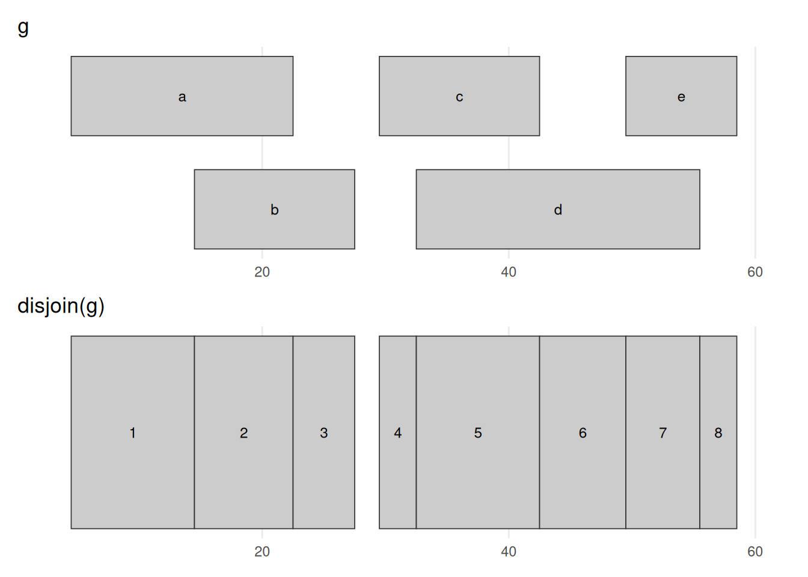](genomic_ranges_files/figure-html/fig-disjoin-1.png "Figure 34.8: disjoin(g) cuts the ranges at every start and end into non-overlapping pieces, so that within each output piece the same set of input ranges is present throughout. Where ranges overlapped — b over a, or d over c and e — the region is carved into separate before / overlap / after segments, giving eight pieces here. Unlike reduce(), which merges, disjoin() subdivides; it is the machinery behind per-base summaries such as coverage, computed next.")

Figure 34.8: `disjoin(g)` cuts the ranges at every start and end into non-overlapping pieces, so that within each output piece the *same* set of input ranges is present throughout. Where ranges overlapped — `b` over `a`, or `d` over `c` and `e` — the region is carved into separate before / overlap / after segments, giving eight pieces here. Unlike [`reduce()`](https://rdrr.io/pkg/IRanges/man/inter-range-methods.html), which merges, [`disjoin()`](https://rdrr.io/pkg/IRanges/man/inter-range-methods.html) subdivides; it is the machinery behind per-base summaries such as coverage, computed next.

The `coverage` method counts, base by base, how many ranges overlap each position — and it is the workhorse of sequencing analysis. Pile up aligned reads and the tall stacks are where signal concentrates: the **peaks** of a ChIP-seq or ATAC-seq experiment, or the per-exon read depth behind an RNA-seq count.

``` downlit
coverage(g)
```

    RleList of length 1
    $chr1
    integer-Rle of length 58 with 10 runs
      Lengths:  4 10  8  5  2  3 10  7  6  3
      Values :  0  1  2  1  0  1  2  1  2  1

The coverage is summarized as a `list` of coverages, one for each chromosome. The `Rle` class is used to store the values. Sometimes, one must convert these values to `numeric` using `as.numeric`. In many cases, this will happen automatically, though.

``` downlit
xl <- c(0, 62)
(plot_ranges(g, "g", xl) / plot_coverage(g, xl)) + plot_layout(heights = c(2, 1))
```

[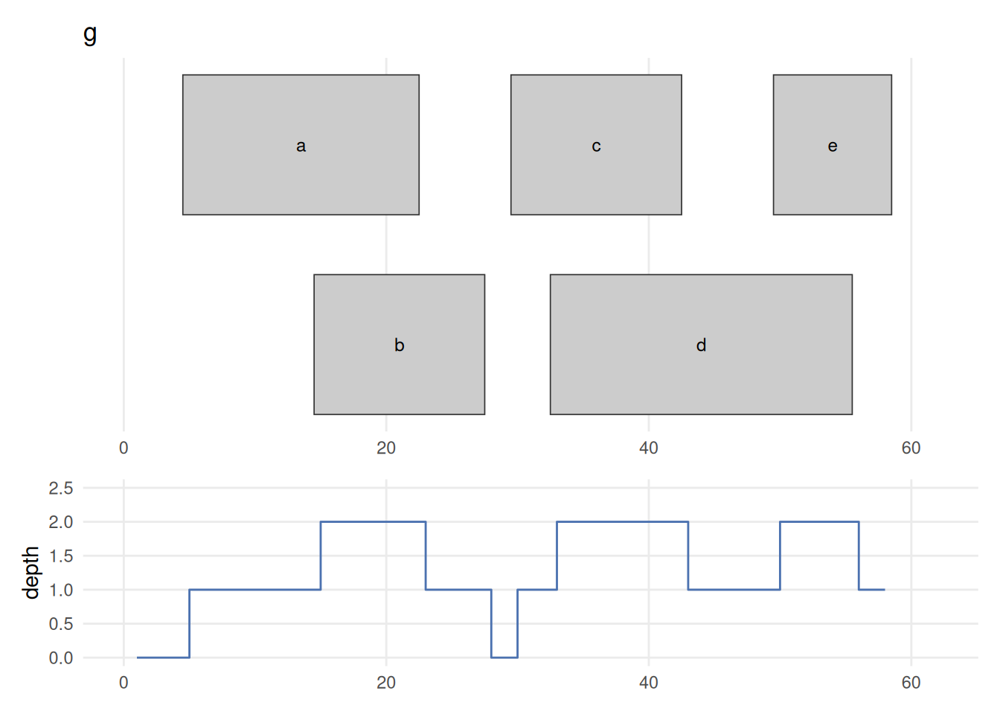](genomic_ranges_files/figure-html/fig-coverage-1.png "Figure 34.9: coverage(g) counts, at every base, how many ranges overlap that position. Drawing the ranges (top) directly above their coverage (bottom) makes the link plain: depth is 1 under a lone range, steps up to 2 wherever two ranges overlap (the a/b overlap, and the c/d and d/e overlaps), and drops to 0 across the 28–29 gap. This is the per-base signal you compute from piled-up sequencing reads — the tall stacks are the peaks a ChIP-seq or ATAC-seq experiment hunts for.")

Figure 34.9: `coverage(g)` counts, at every base, how many ranges overlap that position. Drawing the ranges (top) directly above their coverage (bottom) makes the link plain: depth is 1 under a lone range, steps up to 2 wherever two ranges overlap (the `a`/`b` overlap, and the `c`/`d` and `d`/`e` overlaps), and drops to 0 across the 28–29 gap. This is the per-base signal you compute from piled-up sequencing reads — the tall stacks are the peaks a ChIP-seq or ATAC-seq experiment hunts for.

See the [`GenomicRanges`](http://bioconductor.org/packages/GenomicRanges.html) help page [`?"intra-range-methods"`](https://rdrr.io/pkg/GenomicRanges/man/intra-range-methods.html) for more details.

### 34.2.3 Set operations for GRanges objects

Between-range methods calculate relationships between different GRanges objects. Of central importance are findOverlaps and related operations; these are discussed below. Additional operations treat GRanges as mathematical sets of coordinates; union(g, g2) is the union of the coordinates in g and g2. Here we compare `g` with a second set `g2` (also on `chr1`, overlapping `g` in places), calculating the union, the intersection, and the asymmetric difference (`setdiff`). These are everyday tools for comparing experiments: [`intersect()`](https://generics.r-lib.org/reference/setops.html) two replicate peak sets to keep the peaks they agree on, [`setdiff()`](https://generics.r-lib.org/reference/setops.html) to find condition-specific peaks, or intersect peaks with promoters to count how many binding sites fall in a promoter.

``` downlit
g2 <- GRanges("chr1", IRanges(c(24, 62), c(36, 70)))
names(g2) <- c("x", "y")
GenomicRanges::union(g, g2)
```

    GRanges object with 2 ranges and 0 metadata columns:
          seqnames    ranges strand
             <Rle> <IRanges>  <Rle>
      [1]     chr1      5-58      *
      [2]     chr1     62-70      *
      -------
      seqinfo: 1 sequence from an unspecified genome; no seqlengths

``` downlit
GenomicRanges::intersect(g, g2)
```

    GRanges object with 2 ranges and 0 metadata columns:
          seqnames    ranges strand
             <Rle> <IRanges>  <Rle>
      [1]     chr1     24-27      *
      [2]     chr1     30-36      *
      -------
      seqinfo: 1 sequence from an unspecified genome; no seqlengths

``` downlit
GenomicRanges::setdiff(g, g2)
```

    GRanges object with 2 ranges and 0 metadata columns:
          seqnames    ranges strand
             <Rle> <IRanges>  <Rle>
      [1]     chr1      5-23      *
      [2]     chr1     37-58      *
      -------
      seqinfo: 1 sequence from an unspecified genome; no seqlengths

[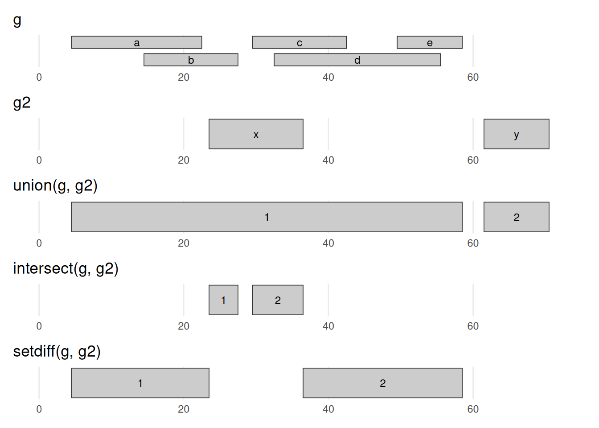](genomic_ranges_files/figure-html/fig-setops-1.png "Figure 34.10: The three set operations on g and g2, drawn on a shared axis. union keeps every base in either set — here g2’s range x bridges g’s two clusters into one 5–58 range, while y stays separate. intersect keeps only bases in both sets (the slivers where x overlaps b/c/d). setdiff(g, g2) keeps the bases of g that are not in g2 (it carves x’s footprint out of g). Read against the g/g2 rows at the top, this is the coordinate bookkeeping behind comparing two experiments — shared peaks, or peaks unique to one condition.")

Figure 34.10: The three set operations on `g` and `g2`, drawn on a shared axis. **union** keeps every base in *either* set — here `g2`’s range `x` bridges `g`’s two clusters into one 5–58 range, while `y` stays separate. **intersect** keeps only bases in *both* sets (the slivers where `x` overlaps `b`/`c`/`d`). **setdiff(g, g2)** keeps the bases of `g` that are *not* in `g2` (it carves `x`’s footprint out of `g`). Read against the `g`/`g2` rows at the top, this is the coordinate bookkeeping behind comparing two experiments — shared peaks, or peaks unique to one condition.

There is extensive additional help in the vignettes at the [`GenomicRanges`](http://bioconductor.org/packages/GenomicRanges.html) pages.

``` downlit
?GRanges
```

There are also many possible `methods` that work with `GRanges` objects. To see a complete list (long), try:

``` downlit
methods(class="GRanges")
```

## 34.3 GRangesList

Not every feature is a single interval. A spliced transcript, for example, is made of several exons, so it is naturally a *group* of ranges rather than one range. The right container for that is a `GRangesList` — simply a list whose elements are themselves `GRanges` objects. Picture one transcript as a `GRanges` holding its exons; a `GRangesList` then holds many such transcripts at once, each kept separate as its own element, so the grouping (which exons belong to which transcript) is never lost.

[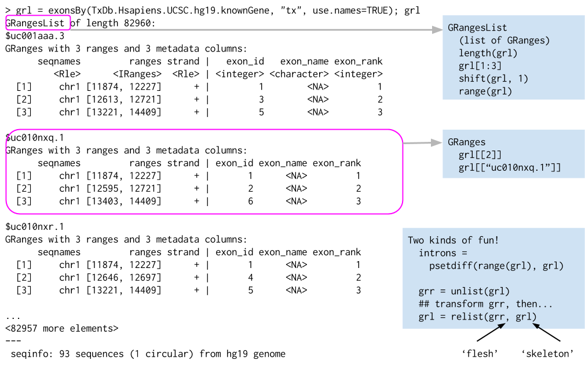](images/granges_list_structure.png "Figure 34.11: The structure of a GRangesList, which is a list of GRanges objects. While the analogy is not perfect, a GRangesList behaves a bit like a list. Each element in the GRangesList is a GRanges object. A common use case for a GRangesList is to store a list of transcripts, each of which have exons as the regions in the GRanges.")

Figure 34.11: The structure of a GRangesList, which is a `list` of GRanges objects. While the analogy is not perfect, a `GRangesList` behaves a bit like a list. Each element in the `GRangesList` *is* a `GRanges` object. A common use case for a `GRangesList` is to store a list of transcripts, each of which have exons as the regions in the `GRanges`.

Whenever genomic features consist of multiple ranges that are grouped by a parent feature, they can be represented as a GRangesList object. Consider the simple example of the two transcript GRangesList below created using the GRangesList constructor.

``` downlit
gr1 <- GRanges(
    seqnames = "chr1", 
    ranges = IRanges(103, 106),
    strand = "+", 
    score = 5L, GC = 0.45)
gr2 <- GRanges(
    seqnames = c("chr1", "chr1"),
    ranges = IRanges(c(107, 113), width = 3),
    strand = c("+", "-"), 
    score = 3:4, GC = c(0.3, 0.5))
```

The `gr1` and `gr2` are each `GRanges` objects. We can combine them into a “named” `GRangesList` like so:

``` downlit
grl <- GRangesList("txA" = gr1, "txB" = gr2)
grl
```

    GRangesList object of length 2:
    $txA
    GRanges object with 1 range and 2 metadata columns:
          seqnames    ranges strand |     score        GC
             <Rle> <IRanges>  <Rle> | <integer> <numeric>
      [1]     chr1   103-106      + |         5      0.45
      -------
      seqinfo: 1 sequence from an unspecified genome; no seqlengths

    $txB
    GRanges object with 2 ranges and 2 metadata columns:
          seqnames    ranges strand |     score        GC
             <Rle> <IRanges>  <Rle> | <integer> <numeric>
      [1]     chr1   107-109      + |         3       0.3
      [2]     chr1   113-115      - |         4       0.5
      -------
      seqinfo: 1 sequence from an unspecified genome; no seqlengths

The `show` method for a `GRangesList` object displays it as a named list of `GRanges` objects, where the names of this list are considered to be the names of the grouping feature. In the example above, the groups of individual exon ranges are represented as separate `GRanges` objects which are further organized into a list structure where each element name is a transcript name. Many other combinations of grouped and labeled `GRanges` objects are possible of course, but this example is a common arrangement.

In some cases, `GRangesList`s behave quite similarly to `GRanges` objects.

### 34.3.1 Basic *GRangesList* accessors

Just as with GRanges object, the components of the genomic coordinates within a GRangesList object can be extracted using simple accessor methods. Not surprisingly, the GRangesList objects have many of the same accessors as GRanges objects. The difference is that many of these methods return a list since the input is now essentially a list of GRanges objects. Here are a few examples:

``` downlit
seqnames(grl)
```

    RleList of length 2
    $txA
    factor-Rle of length 1 with 1 run
      Lengths:    1
      Values : chr1
    Levels(1): chr1

    $txB
    factor-Rle of length 2 with 1 run
      Lengths:    2
      Values : chr1
    Levels(1): chr1

``` downlit
ranges(grl)
```

    IRangesList object of length 2:
    $txA
    IRanges object with 1 range and 0 metadata columns:
              start       end     width
          <integer> <integer> <integer>
      [1]       103       106         4

    $txB
    IRanges object with 2 ranges and 0 metadata columns:
              start       end     width
          <integer> <integer> <integer>
      [1]       107       109         3
      [2]       113       115         3

``` downlit
strand(grl)
```

    RleList of length 2
    $txA
    factor-Rle of length 1 with 1 run
      Lengths: 1
      Values : +
    Levels(3): + - *

    $txB
    factor-Rle of length 2 with 2 runs
      Lengths: 1 1
      Values : + -
    Levels(3): + - *

The length and names methods will return the length or names of the list and the seqlengths method will return the set of sequence lengths.

``` downlit
length(grl)
```

    [1] 2

``` downlit
names(grl)
```

    [1] "txA" "txB"

``` downlit
seqlengths(grl)
```

    chr1 
      NA 

## 34.4 Relationships between region sets

One of the more powerful approaches to genomic data integration is to ask about the relationship between sets of genomic ranges. The key features of this process are to look at overlaps and distances to the nearest feature. These functionalities, combined with the operations like `flank` and `resize`, for instance, allow pretty useful analyses with relatively little code. In general, these operations are *very* fast, even on thousands to millions of regions.

### 34.4.1 Overlaps

The findOverlaps method in the GenomicRanges package is a very useful function that allows users to identify overlaps between two sets of genomic ranges.

Here’s how it works:

- Inputs  
  The function requires two GRanges objects, referred to as query and subject.

- Processing  
  The function then compares every range in the query object with every range in the subject object, looking for overlaps. An overlap is defined as any instance where the range in the query object intersects with a range in the subject object.

- Output  
  The function returns a Hits (see [`?Hits`](https://rdrr.io/pkg/S4Vectors/man/Hits-class.html)) object, which is a compact representation of the matrix of overlaps. Each entry in the Hits object corresponds to a pair of overlapping ranges, with the query index and the subject index.

Here is an example, reusing `g` as the query and `g2` as the subject:

``` downlit
overlaps <- findOverlaps(query = g, subject = g2)
overlaps
```

    Hits object with 3 hits and 0 metadata columns:
          queryHits subjectHits
          <integer>   <integer>
      [1]         2           1
      [2]         3           1
      [3]         4           1
      -------
      queryLength: 5 / subjectLength: 2

Each row of the `Hits` object is an overlapping pair: the first column is the index of the range in `g`, the second the index of the overlapping range in `g2`. Ranges `b`, `c`, and `d` of `g` all overlap `g2`’s first range (`x`), while `g2`’s second range (`y`) is hit by nothing — [Figure fig-overlaps](#fig-overlaps) shows exactly this.

[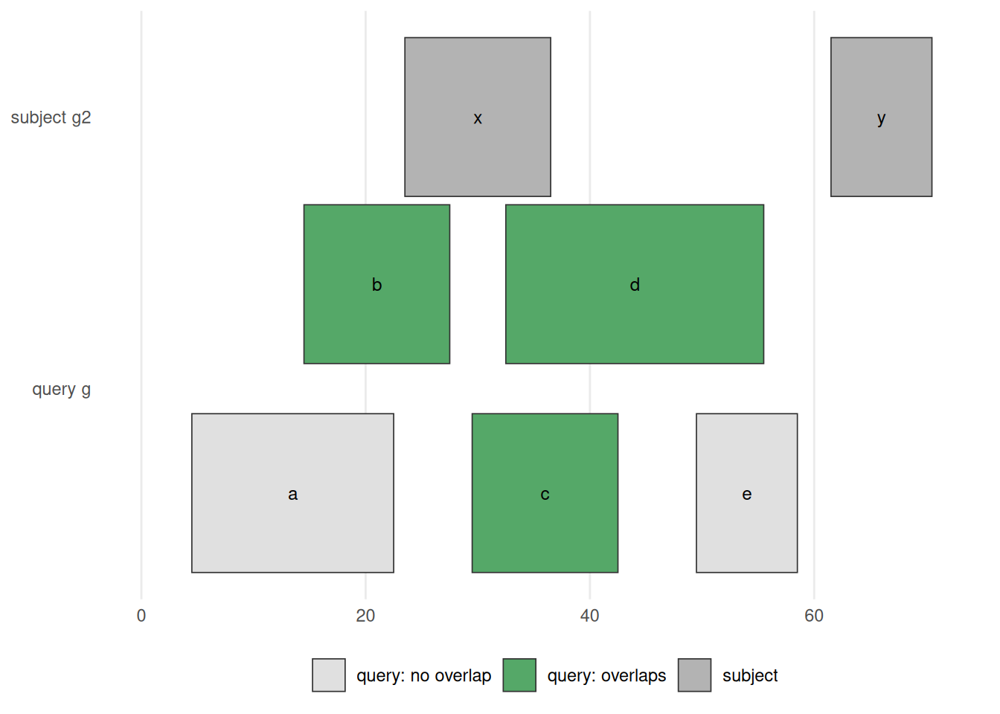](genomic_ranges_files/figure-html/fig-overlaps-1.png "Figure 34.12: findOverlaps(g, g2) / g %over% g2. The subject g2 is drawn on top; the query g below, with each range coloured green if it overlaps the subject and grey if not. Ranges b, c, d overlap g2‘s range x and so are green; a and e touch nothing and stay grey; g2’s range y has no query over it. This is the picture behind every overlap question — ’which peaks fall in a promoter?’, ‘which variants land in an exon?’")

Figure 34.12: `findOverlaps(g, g2)` / `g %over% g2`. The subject `g2` is drawn on top; the query `g` below, with each range coloured green if it overlaps the subject and grey if not. Ranges `b`, `c`, `d` overlap `g2`‘s range `x` and so are green; `a` and `e` touch nothing and stay grey; `g2`’s range `y` has no query over it. This is the picture behind every overlap question — ’which peaks fall in a promoter?’, ‘which variants land in an exon?’

If you want only the `queryHits` or the `subjectHits`, there are accessors for those (e.g. `queryHits(overlaps)`). Used as an index into the original objects, they pull out the ranges that overlap:

``` downlit
g[queryHits(overlaps)]
```

    GRanges object with 3 ranges and 1 metadata column:
        seqnames    ranges strand |     score
           <Rle> <IRanges>  <Rle> | <numeric>
      b     chr1     15-27      * |         8
      c     chr1     30-42      * |         3
      d     chr1     33-55      * |         9
      -------
      seqinfo: 1 sequence from an unspecified genome; no seqlengths

``` downlit
g2[subjectHits(overlaps)]
```

    GRanges object with 3 ranges and 0 metadata columns:
        seqnames    ranges strand
           <Rle> <IRanges>  <Rle>
      x     chr1     24-36      *
      x     chr1     24-36      *
      x     chr1     24-36      *
      -------
      seqinfo: 1 sequence from an unspecified genome; no seqlengths

As you might expect, the `countOverlaps` method counts, for each range in the first `GRanges`, how many ranges in the second it overlaps.

``` downlit
countOverlaps(g, g2)
```

    a b c d e 
    0 1 1 1 0 

The `subsetByOverlaps` method simply subsets the query `GRanges` object to include *only* those that overlap the subject — the green ranges in [Figure fig-overlaps](#fig-overlaps).

``` downlit
subsetByOverlaps(g, g2)
```

    GRanges object with 3 ranges and 1 metadata column:
        seqnames    ranges strand |     score
           <Rle> <IRanges>  <Rle> | <numeric>
      b     chr1     15-27      * |         8
      c     chr1     30-42      * |         3
      d     chr1     33-55      * |         9
      -------
      seqinfo: 1 sequence from an unspecified genome; no seqlengths

In some cases, you may want only one hit per query range. The `select` parameter handles this: with `select="first"`, [`findOverlaps()`](https://rdrr.io/pkg/IRanges/man/findOverlaps-methods.html) returns a plain integer vector with one entry per query range (the index of its first overlapping subject, or `NA` if there is none) instead of a full `Hits` object.

``` downlit
findOverlaps(g, g2, select="first")
```

    [1] NA  1  1  1 NA

The `%over%` logical operator is the quick version: it returns `TRUE`/`FALSE` for each query range, which is handy for subsetting.

``` downlit
g %over% g2
```

    [1] FALSE  TRUE  TRUE  TRUE FALSE

``` downlit
g[g %over% g2]
```

    GRanges object with 3 ranges and 1 metadata column:
        seqnames    ranges strand |     score
           <Rle> <IRanges>  <Rle> | <numeric>
      b     chr1     15-27      * |         8
      c     chr1     30-42      * |         3
      d     chr1     33-55      * |         9
      -------
      seqinfo: 1 sequence from an unspecified genome; no seqlengths

### 34.4.2 Nearest feature

There are a number of useful methods that find the nearest feature in a second set for each element in the first — answering a question you meet constantly: *which gene is this peak closest to?* Annotating each ChIP-seq peak with its nearest transcription start site, or reporting how far a variant sits from the nearest gene, is a single [`nearest()`](https://rdrr.io/pkg/IRanges/man/nearest-methods.html) or [`distanceToNearest()`](https://rdrr.io/pkg/IRanges/man/nearest-methods.html) call.

We can review the two `GRanges` toy objects we’ll compare — `g` and the second set `g2` from the set-operations section:

``` downlit
g
```

    GRanges object with 5 ranges and 1 metadata column:
        seqnames    ranges strand |     score
           <Rle> <IRanges>  <Rle> | <numeric>
      a     chr1      5-22      * |         5
      b     chr1     15-27      * |         8
      c     chr1     30-42      * |         3
      d     chr1     33-55      * |         9
      e     chr1     50-58      * |         6
      -------
      seqinfo: 1 sequence from an unspecified genome; no seqlengths

``` downlit
g2
```

    GRanges object with 2 ranges and 0 metadata columns:
        seqnames    ranges strand
           <Rle> <IRanges>  <Rle>
      x     chr1     24-36      *
      y     chr1     62-70      *
      -------
      seqinfo: 1 sequence from an unspecified genome; no seqlengths

There are three closely related functions here, each taking a query `x` and a `subject` and returning, for every range in `x`, an integer index into `subject` (or `NA` when nothing qualifies):

- [`nearest()`](https://rdrr.io/pkg/IRanges/man/nearest-methods.html) finds the closest range in `subject`, whether it lies before, after, or overlapping. It is the everyday tool; for the exact tie-breaking rules see [`?nearest`](https://rdrr.io/pkg/IRanges/man/nearest-methods.html) in the IRanges package.

- [`precede()`](https://rdrr.io/pkg/IRanges/man/nearest-methods.html) looks only *ahead*: for each range in `x` it returns the first `subject` range that `x` comes before. Anything overlapping is skipped.

- [`follow()`](https://rdrr.io/pkg/IRanges/man/nearest-methods.html) is the mirror image, looking only *behind*: it returns the `subject` range that `x` comes after, again ignoring overlaps.

The catch with [`precede()`](https://rdrr.io/pkg/IRanges/man/nearest-methods.html) and [`follow()`](https://rdrr.io/pkg/IRanges/man/nearest-methods.html) is that “ahead” and “behind” are read in the biological 5’-to-3’ direction, the direction transcription runs — not simply left-to-right along the chromosome. On the `+` strand those two directions agree, but on the `-` strand they are reversed, so the same pair of positions can flip its answer. Take positions 5 and 6: on the `+` strand, 5 *precedes* 6, but on the `-` strand 5 *follows* 6, because 5’-to-3’ now runs the other way.

The table below spells out the resulting orientation for every combination of query and subject strand. A `*` (unstranded) range is treated as belonging to both strands; the one special case is when *both* `x` and `subject` are `*`, where they are both taken to be `+`.

           x  |  subject  |  orientation 
         -----+-----------+----------------
    a)     +  |  +        |  ---> 
    b)     +  |  -        |  NA
    c)     +  |  *        |  --->
    d)     -  |  +        |  NA
    e)     -  |  -        |  <---
    f)     -  |  *        |  <---
    g)     *  |  +        |  --->
    h)     *  |  -        |  <---
    i)     *  |  *        |  --->  (the only situation where * arbitrarily means +)

``` downlit
res <- nearest(g, g2)
res
```

    [1] 1 1 1 1 2

Each element of `res` is the index *into* `g2` of the nearest range to the corresponding range in `g`. So `g2[res]` would give you the actual nearest ranges.

While `nearest` and friends give the index of the nearest feature, the distance to the nearest is sometimes also useful to have. The `distanceToNearest` method calculates the nearest feature as well as reporting the distance.

``` downlit
res <- distanceToNearest(g, g2)
res
```

    Hits object with 5 hits and 1 metadata column:
          queryHits subjectHits |  distance
          <integer>   <integer> | <integer>
      [1]         1           1 |         1
      [2]         2           1 |         0
      [3]         3           1 |         0
      [4]         4           1 |         0
      [5]         5           2 |         3
      -------
      queryLength: 5 / subjectLength: 2

This returns a `Hits` object with an extra `distance` column. Several of `g`’s ranges overlap `g2` and so report distance 0; the rest report the gap in base pairs to their nearest neighbour (range `a` is 1 bp from `g2`’s first range, and `e` is 3 bp from its second).

[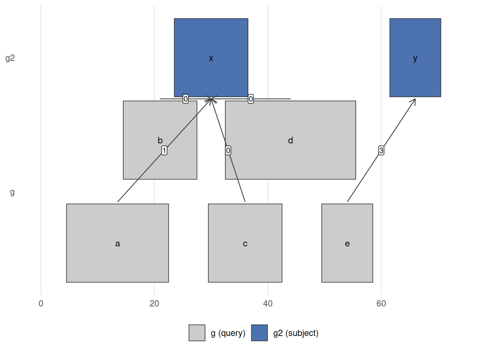](genomic_ranges_files/figure-html/fig-nearest-1.png "Figure 34.13: nearest(g, g2) links each query range in g (bottom) to its closest range in g2 (top); the label on each arrow is the distanceToNearest() distance. Ranges b, c, d sit on top of g2‘s range x, so their distance is 0; a is 1 bp away and e is 3 bp from g2’s range y. This is the operation behind ’assign each ChIP-seq peak to its nearest gene’ or ‘how far is this variant from the closest transcription start site?’")

Figure 34.13: `nearest(g, g2)` links each query range in `g` (bottom) to its closest range in `g2` (top); the label on each arrow is the [`distanceToNearest()`](https://rdrr.io/pkg/IRanges/man/nearest-methods.html) distance. Ranges `b`, `c`, `d` sit on top of `g2`‘s range `x`, so their distance is 0; `a` is 1 bp away and `e` is 3 bp from `g2`’s range `y`. This is the operation behind ’assign each ChIP-seq peak to its nearest gene’ or ‘how far is this variant from the closest transcription start site?’

## 34.5 Gene models

So far every range has been one we typed by hand. In practice you usually pull ranges from an annotation. A `TxDb` (“transcript database”) package provides a convenient interface to gene models from a variety of sources. The [`TxDb.Hsapiens.UCSC.hg38.knownGene`](http://bioconductor.org/packages/TxDb.Hsapiens.UCSC.hg38.knownGene.html) package provides access to the UCSC knownGene gene model for the **hg38** build of the human genome. Everything it returns is a `GRanges` (or `GRangesList`), so all the operations from this chapter apply directly.

[](images/range_operations_diagram.png "Figure 34.14: A graphical representation of range operations demonstrated on a gene model.")

Figure 34.14: A graphical representation of range operations demonstrated on a gene model.

``` downlit
# install once: BiocManager::install("TxDb.Hsapiens.UCSC.hg38.knownGene")
library(TxDb.Hsapiens.UCSC.hg38.knownGene)
txdb <- TxDb.Hsapiens.UCSC.hg38.knownGene
```

The `transcripts` function returns a `GRanges` object with the transcripts for all genes in the database.

``` downlit
tx <- transcripts(txdb)
tx
```

    GRanges object with 412044 ranges and 2 metadata columns:
                          seqnames        ranges strand |     tx_id
                             <Rle>     <IRanges>  <Rle> | <integer>
           [1]                chr1   11121-14413      + |         1
           [2]                chr1   11125-14405      + |         2
           [3]                chr1   11410-14413      + |         3
           [4]                chr1   11411-14413      + |         4
           [5]                chr1   11426-14409      + |         5
           ...                 ...           ...    ... .       ...
      [412040] chrX_MU273397v1_alt 239036-260095      - |    412040
      [412041] chrX_MU273397v1_alt 272358-282686      - |    412041
      [412042] chrX_MU273397v1_alt 314193-316302      - |    412042
      [412043] chrX_MU273397v1_alt 314813-315236      - |    412043
      [412044] chrX_MU273397v1_alt 324527-324923      - |    412044
                         tx_name
                     <character>
           [1] ENST00000832824.1
           [2] ENST00000832825.1
           [3] ENST00000832826.1
           [4] ENST00000832827.1
           [5] ENST00000832828.1
           ...               ...
      [412040] ENST00000710260.1
      [412041] ENST00000710028.1
      [412042] ENST00000710030.1
      [412043] ENST00000710216.1
      [412044] ENST00000710031.1
      -------
      seqinfo: 711 sequences (1 circular) from hg38 genome

The `exons` function returns a `GRanges` object with the exons.

``` downlit
ex <- exons(txdb)
ex
```

    GRanges object with 966596 ranges and 1 metadata column:
                          seqnames        ranges strand |   exon_id
                             <Rle>     <IRanges>  <Rle> | <integer>
           [1]                chr1   11121-11211      + |         1
           [2]                chr1   11125-11211      + |         2
           [3]                chr1   11410-11671      + |         3
           [4]                chr1   11411-11671      + |         4
           [5]                chr1   11426-11671      + |         5
           ...                 ...           ...    ... .       ...
      [966592] chrX_MU273397v1_alt 314193-314248      - |    966592
      [966593] chrX_MU273397v1_alt 314813-315236      - |    966593
      [966594] chrX_MU273397v1_alt 315258-315407      - |    966594
      [966595] chrX_MU273397v1_alt 316254-316302      - |    966595
      [966596] chrX_MU273397v1_alt 324527-324923      - |    966596
      -------
      seqinfo: 711 sequences (1 circular) from hg38 genome

The `genes` function returns a `GRanges` object with one range per gene.

``` downlit
gn <- genes(txdb)
gn
```

    GRanges object with 35356 ranges and 1 metadata column:
                seqnames              ranges strand |     gene_id
                   <Rle>           <IRanges>  <Rle> | <character>
              1    chr19   58345178-58362751      - |           1
             10     chr8   18386273-18401218      + |          10
            100    chr20   44584896-44652252      - |         100
           1000    chr18   27932879-28177946      - |        1000
      100008586     chrX   49551278-49568218      + |   100008586
            ...      ...                 ...    ... .         ...
           9990    chr15   34229784-34338060      - |        9990
           9991     chr9 112215071-112333653      - |        9991
           9992    chr21   34180729-34371381      + |        9992
           9993    chr22   19036282-19122454      - |        9993
           9997    chr22   50523568-50526461      - |        9997
      -------
      seqinfo: 711 sequences (1 circular) from hg38 genome

Notice the scale: these are real `GRanges` objects with tens of thousands of ranges, yet they print and subset instantly. That is the payoff of the compact representation — the same [`findOverlaps()`](https://rdrr.io/pkg/IRanges/man/findOverlaps-methods.html), [`nearest()`](https://rdrr.io/pkg/IRanges/man/nearest-methods.html), and [`subsetByOverlaps()`](https://rdrr.io/pkg/IRanges/man/findOverlaps-methods.html) calls you practiced on the toy `gr` work unchanged here. For example, `subsetByOverlaps(gn, peaks)` would give you the genes hit by a set of ChIP-seq `peaks`, and `nearest(peaks, tx)` would assign each peak to its closest transcript.

> **TIP:**
>
> `exons(txdb)` gives you a flat `GRanges` of every exon. When you instead want the exons *grouped by the transcript they belong to* — a `GRangesList`, one element per transcript — use `exonsBy(txdb, by = "tx")`. That is the natural object for counting reads per transcript and is exactly the `GRangesList` structure we built by hand earlier.

## 34.6 Quick reference: GRanges methods

Every method below was introduced by example earlier in the chapter; this is a compact place to look them back up. [Figure fig-ops-overview](#fig-ops-overview) shows the single-set reshaping operations side by side.

[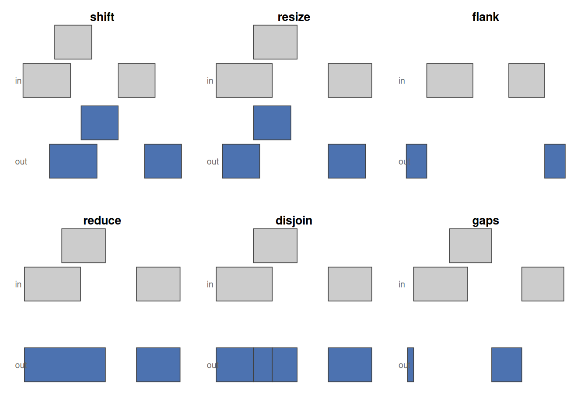](genomic_ranges_files/figure-html/fig-ops-overview-1.png "Figure 34.15: The single-set range operations at a glance: in each panel the grey ranges are the input and the blue ranges are the result. shift slides, resize standardises width, flank takes the region beside each range (strand-aware, so the two strands flank opposite ends), reduce merges overlaps, disjoin cuts into non-overlapping pieces, and gaps returns what is left uncovered.")

Figure 34.15: The single-set range operations at a glance: in each panel the grey ranges are the input and the blue ranges are the result. `shift` slides, `resize` standardises width, `flank` takes the region beside each range (strand-aware, so the two strands flank opposite ends), `reduce` merges overlaps, `disjoin` cuts into non-overlapping pieces, and `gaps` returns what is left uncovered.

**Accessors** pull pieces out of a `GRanges`:

| Accessor | Returns |
|----|----|
| `length` | Number of ranges in the object |
| `seqnames` | Chromosome of each range |
| `ranges`, `start`, `end`, `width` | The coordinates, and the widths |
| `strand` | Strand (`+`, `-`, or `*`) of each range |
| `mcols` (a.k.a. `elementMetadata`) | The metadata columns (right of the `|`) |
| `seqlevels`, `seqinfo` | Sequence names, and names + lengths |
| `[`, `subset`, `sort` | Subset, filter, or sort the ranges |

Table 34.2: Accessors for a `GRanges`.

**Operations** transform or relate ranges. They fall into three families: those that reshape each range on its own (*intra-range*), those that summarize a set together (*inter-range*), and those that relate *two* sets (*between-set*).

| Operation | Family | What it does | Biological example |
|----|----|----|----|
| `shift` | intra-range | Slide each range by a fixed offset | Apply the Tn5 +4/-5 shift to ATAC-seq reads |
| `resize` | intra-range | Set each range to a fixed width (anchor with `fix`) | Fixed-width windows on peak summits for motif scanning |
| `flank` | intra-range | Region beside each range (strand-aware) | Take the promoter just upstream of a gene |
| `reduce` | inter-range | Merge overlapping or adjacent ranges | Collapse a gene’s exons into its exonic footprint; merge replicate peaks |
| `disjoin` | inter-range | Cut into non-overlapping pieces | Partition a locus so each read counts once |
| `gaps` | inter-range | The bases *not* covered | Introns from exons; intergenic regions from genes |
| `coverage` | inter-range | Per-base count of overlapping ranges | Pile reads into ChIP-seq/ATAC peaks; per-exon RNA-seq depth |
| `findOverlaps`, `%over%` | between-set | Which query ranges hit which subject ranges | Which peaks fall in a promoter? |
| `countOverlaps` | between-set | How many subject ranges each query hits | Count reads per gene |
| `subsetByOverlaps` | between-set | Keep query ranges overlapping the subject | Keep variants inside exons |
| `nearest`, `distanceToNearest` | between-set | Closest subject range to each query (+ distance) | Annotate each peak with its nearest gene/TSS |
| `union`, `intersect`, `setdiff` | between-set | Set arithmetic on two range sets | Reproducible peaks (`intersect`); condition-specific peaks (`setdiff`) |

Table 34.3: Range operations, by family, with a biological use for each.

## 34.7 Summary

You now have a working vocabulary for genomic locations.

- A **`GRanges`** object holds a set of ranges. Coordinates (`seqnames`, `ranges`, `strand`) sit to the left of the `|`; optional metadata reached with [`mcols()`](https://rdrr.io/pkg/S4Vectors/man/Vector-class.html) sits to the right. You can build one from scratch or coerce a `data.frame` with `as(df, "GRanges")`.
- **Intra-range** operations ([`flank()`](https://rdrr.io/pkg/IRanges/man/intra-range-methods.html), [`shift()`](https://rdrr.io/pkg/IRanges/man/intra-range-methods.html), [`resize()`](https://rdrr.io/pkg/IRanges/man/intra-range-methods.html)) reshape each range on its own and respect strand. **Inter-range** operations ([`reduce()`](https://rdrr.io/pkg/IRanges/man/inter-range-methods.html), [`disjoin()`](https://rdrr.io/pkg/IRanges/man/inter-range-methods.html), [`gaps()`](https://rdrr.io/pkg/IRanges/man/inter-range-methods.html), [`coverage()`](https://rdrr.io/pkg/IRanges/man/coverage-methods.html)) summarize a set of ranges together.
- **Between-set** operations answer the integration questions: [`findOverlaps()`](https://rdrr.io/pkg/IRanges/man/findOverlaps-methods.html) and [`subsetByOverlaps()`](https://rdrr.io/pkg/IRanges/man/findOverlaps-methods.html) for overlap, [`nearest()`](https://rdrr.io/pkg/IRanges/man/nearest-methods.html) and [`distanceToNearest()`](https://rdrr.io/pkg/IRanges/man/nearest-methods.html) for proximity, plus [`union()`](https://generics.r-lib.org/reference/setops.html)/[`intersect()`](https://generics.r-lib.org/reference/setops.html)/[`setdiff()`](https://generics.r-lib.org/reference/setops.html) for set arithmetic.
- A **`GRangesList`** groups ranges by a parent feature, such as exons within a transcript.
- A **`TxDb`** package (here [`TxDb.Hsapiens.UCSC.hg38.knownGene`](http://bioconductor.org/packages/TxDb.Hsapiens.UCSC.hg38.knownGene.html)) hands you real gene, transcript, and exon models as `GRanges`, so every operation above applies to genome-scale annotation with no new syntax.

Next, the [Genomic ranges with real ChIP-seq peaks](genomic_ranges_chipseq.llms.md) chapter puts these tools to work on a real peak set imported from file, and the *Ranges Exercises* then turn you loose on published ENCODE data.

## 34.8 Exercises

These reuse the objects built earlier in the chapter: the 10-range `gr`, the small single-chromosome toy `g` and its companion `g2`, and the `grl` `GRangesList`. Run the chapter’s chunks first so those objects exist.

**1. Read the structure.** Without running any code, which of these belong to the *left* of the `|` in a `GRanges` (the coordinates) and which to the *right* (the metadata): `strand`, `score`, `seqnames`, `GC`, `width`?

> **NOTE:**
>
> Left of the `|` (coordinates): `seqnames`, `strand`, and `width` (part of `ranges`). Right of the `|` (metadata): `score` and `GC`. The coordinate columns have dedicated accessors; the metadata columns are reached together with [`mcols()`](https://rdrr.io/pkg/S4Vectors/man/Vector-class.html).

**2. Promoters by hand.** A common task is to grab the region just upstream of a feature’s start — a rough promoter. Use [`flank()`](https://rdrr.io/pkg/IRanges/man/intra-range-methods.html) to get the 50 bases upstream of each range in `g`, then confirm with [`width()`](https://rdrr.io/pkg/BiocGenerics/man/start.html) that each result is 50 bases wide.

> **NOTE:**
>
> ``` downlit
> prom <- flank(g, 50)
> prom
> ```
>
>     GRanges object with 5 ranges and 1 metadata column:
>         seqnames    ranges strand |     score
>            <Rle> <IRanges>  <Rle> | <numeric>
>       a     chr1     -45-4      * |         5
>       b     chr1    -35-14      * |         8
>       c     chr1    -20-29      * |         3
>       d     chr1    -17-32      * |         9
>       e     chr1      0-49      * |         6
>       -------
>       seqinfo: 1 sequence from an unspecified genome; no seqlengths
>
> ``` downlit
> width(prom)
> ```
>
>     [1] 50 50 50 50 50
>
> [`flank()`](https://rdrr.io/pkg/IRanges/man/intra-range-methods.html) defaults to the upstream side (`start = TRUE`), measured relative to strand. Every flank is exactly 50 bases wide.

**3. Collapse overlaps.** Use [`reduce()`](https://rdrr.io/pkg/IRanges/man/inter-range-methods.html) on `gr` to merge overlapping or adjacent ranges into a minimal set, then report how many ranges remain with [`length()`](https://rdrr.io/r/base/length.html).

> **NOTE:**
>
> ``` downlit
> reduced <- reduce(gr)
> reduced
> ```
>
>     GRanges object with 7 ranges and 0 metadata columns:
>           seqnames    ranges strand
>              <Rle> <IRanges>  <Rle>
>       [1]     chr1   106-116      +
>       [2]     chr1   101-111      -
>       [3]     chr1   105-115      *
>       [4]     chr2   102-113      +
>       [5]     chr2   104-114      *
>       [6]     chr3   107-118      +
>       [7]     chr3   109-120      -
>       -------
>       seqinfo: 3 sequences from an unspecified genome; no seqlengths
>
> ``` downlit
> length(reduced)
> ```
>
>     [1] 7
>
> [`reduce()`](https://rdrr.io/pkg/IRanges/man/inter-range-methods.html) works per chromosome and per strand, merging ranges that overlap or abut into single ranges — the standard way to collapse overlapping exons into non-redundant regions.

**4. Overlap counting.** Build `q <- gr[1:4]` and `s <- gr[3:8]`, then use `countOverlaps(q, s)` to find how many ranges in `s` each range in `q` overlaps. Which range in `q` has the most overlaps?

> **NOTE:**
>
> ``` downlit
> q <- gr[1:4]
> s <- gr[3:8]
> counts <- countOverlaps(q, s)
> counts
> ```
>
>     a b c d 
>     1 2 2 2 
>
> ``` downlit
> which.max(counts)
> ```
>
>     b 
>     2 
>
> [`countOverlaps()`](https://rdrr.io/pkg/IRanges/man/findOverlaps-methods.html) returns one integer per range in the query. Remember that strand participates in the overlap test, so a `+` query range will not overlap a `-` subject range unless you set `ignore.strand = TRUE`.

**5. Nearest with distance.** Use `distanceToNearest(g, g2)` and pull out the `distance` metadata column with `mcols(...)$distance`. What does a distance of 0 tell you?

> **NOTE:**
>
> ``` downlit
> hits <- distanceToNearest(g, g2)
> mcols(hits)$distance
> ```
>
>     [1] 1 0 0 0 3
>
> A distance of 0 means the query range overlaps or directly touches its nearest neighbour — the ranges of `g` that sit on top of `g2` report 0, while the rest report the base-pair gap to the closest range in `g2`.

Lawrence, Michael, Wolfgang Huber, Hervé Pagès, et al. 2013. “Software for Computing and Annotating Genomic Ranges.” *PLoS Computational Biology* 9 (8): e1003118. <https://doi.org/10.1371/journal.pcbi.1003118>.
