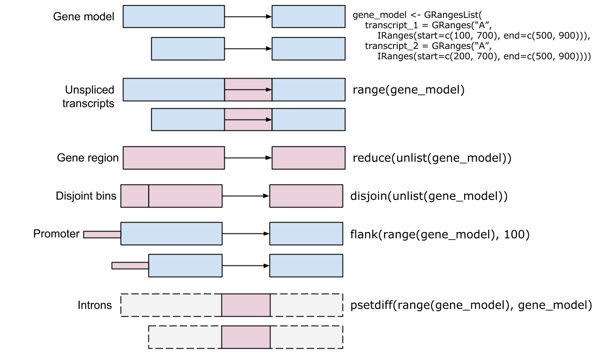

```{r init, include=FALSE}
library(knitr)
opts_chunk$set(message=FALSE)
Biocpkg <- function(pkg) paste0("[`", pkg, "`](http://bioconductor.org/packages/", pkg, ".html)")
```

Almost everything you study in genomics lives at a *place* on the genome. A gene
sits between two coordinates on a chromosome. An exon is a stretch within that
gene. A ChIP-seq peak marks where a protein bound. A SNP is a single position. As
soon as you have two such sets of places, the most interesting biological
questions become questions about *location*: Which peaks fall inside a promoter?
What is the nearest gene to this variant? Where do these two experiments agree?

In this chapter you'll learn to represent those places as **genomic ranges** and
to ask how they relate to one another. The workhorse is Bioconductor's
`r Biocpkg("GenomicRanges")` package [@lawrence_software_2013], which gives you a
compact object to hold ranges plus any data attached to them, and a vocabulary of
fast operations — overlap, nearest-neighbor, flank, reduce — that scale to
millions of regions. We'll build small example objects by hand so you can see
exactly what each operation does, then finish with real gene models pulled from a
genome annotation.

::: {.callout-note}
## A note on coordinate systems

Different tools count positions differently. The UCSC Genome Browser uses
0-based, half-open coordinates internally, while Ensembl and Bioconductor use
1-based, inclusive coordinates (position 1 is the first base, and both endpoints
are included). `GRanges` objects are always 1-based and inclusive, which is one
fewer thing to track once you stay inside Bioconductor.
:::

## What you'll learn

- Build a `GRanges` object and read its two-part display (coordinates on the
  left, metadata on the right).
- Subset and extract parts of a `GRanges` object with accessors like
  `seqnames()`, `ranges()`, `strand()`, and `mcols()`.
- Apply intra-range operations (`flank()`, `shift()`, `resize()`) and inter-range
  operations (`reduce()`, `disjoin()`, `gaps()`, `coverage()`).
- Find relationships between two sets of ranges with `findOverlaps()`,
  `subsetByOverlaps()`, `nearest()`, and `distanceToNearest()`.
- Group ranges into a `GRangesList` (for example, the exons of a transcript).
- Pull gene, transcript, and exon models out of a `TxDb` annotation package.

## Bioconductor and GenomicRanges

```{r loadlib}
library(GenomicRanges)
```
The Bioconductor `r Biocpkg("GenomicRanges")` package [@lawrence_software_2013]
gives you the `GRanges` container for genomic intervals together with a vocabulary
of fast operations on them — subsetting, resizing, overlap, nearest-neighbor, and
genome arithmetic. The rest of this chapter introduces both by example, building
small objects by hand so you can see exactly what each operation does.

`GRanges` is built on R's **S4** class system, so each object carries dedicated
slots — `seqnames`, `ranges`, `strand`, and metadata — with methods that operate
on them. Three related containers show up throughout the chapter:

| Class | What it holds | Typical use |
|-------|---------------|-------------|
| `GRanges` | a set of genomic ranges plus metadata | ChIP-seq peaks, CpG islands, genes |
| `GRangesList` | a list of `GRanges` objects | exons grouped by transcript |
| `IRanges` | plain integer ranges | the building block inside a `GRanges` |

: The containers used in this chapter. {#tbl-genomic-ranges-classes}

A compact cheat-sheet of the accessor and operation methods is collected under
[Quick reference](#sec-granges-methods) at the end of the chapter; we meet each one
in context first.

To get going, we can construct a `GRanges` object by hand as an example.

The `GRanges` class represents a collection of genomic ranges that each have a single start
and end location on the genome. It can be used to store the location of genomic features
such as contiguous binding sites, transcripts, and exons. These objects can be created by
using the GRanges constructor function. The following code creates one from scratch. (The `Rle()` calls in it simply
repeat each value a given number of times — a compact "run-length" shorthand we
return to under *coverage* later.)

```{r mkexample}
gr <- GRanges(
    seqnames = Rle(c("chr1", "chr2", "chr1", "chr3"), c(1, 3, 2, 4)),
    ranges = IRanges(101:110, end = 111:120, names = head(letters, 10)),
    strand = Rle(strand(c("-", "+", "*", "+", "-")), c(1, 2, 2, 3, 2)),
    score = 1:10,
    GC = seq(1, 0, length=10))
gr
```

This creates a `GRanges` object with 10 genomic ranges. The output of the `GRanges` `show()` method
separates the information into a left and right hand region that are separated by `|` symbols (see @fig-granges-structure).
The genomic coordinates (seqnames, ranges, and strand) are located on the left-hand side
and the metadata columns are located on the right. For this example, the
metadata is comprised of score and GC information, but almost anything can be stored in
the metadata portion of a GRanges object.

::: {.callout-note}
## Reading a `GRanges`: the `|` is the dividing line

Think of a `GRanges` as a spreadsheet with a heavy vertical rule drawn down the
middle. **Everything to the left of the `|` answers "where?"** — the chromosome
(`seqnames`), the start and end (`ranges`), and the `strand`. These columns are
mandatory and have their own special accessors. **Everything to the right of the
`|` answers "what do we know about it?"** — the metadata: scores, GC content,
gene names, p-values, whatever you attach. These are optional and you reach them
all at once with `mcols()`. Keeping that line in mind makes every later operation
easier: range operations rearrange the *left* side; your annotations ride along
on the *right*.
:::

{#fig-granges-structure}


The components of the genomic coordinates within a GRanges object can be extracted using
the seqnames, ranges, and strand accessor functions.

```{r GRanges-location-accessors}
seqnames(gr)
ranges(gr)
strand(gr)
```

Note that the `GRanges` object has information to the "left" side of the `|` that has special 
accessors. The information to the right side of the `|`, when it is present, is the metadata
and is accessed using `mcols()`, for "metadata columns".

```{r mcols-example}
class(mcols(gr))
mcols(gr)
```

Since the `class` of `mcols(gr)` is `r class(mcols(gr))`, we can use the `DataFrame` (Bioconductor's data-frame-like table) approaches to
work with the data.

```{r mcols-df-methods}
mcols(gr)$score
```

We can even assign a new column. Here we add an `AT` column derived from `GC`
(since the fractions sum to 1). Notice that the new column appears on the right
of the `|`, alongside `score` and `GC`.

```{r new-mcols-column}
mcols(gr)$AT <- 1 - mcols(gr)$GC
gr
```


Another common way to create a `GRanges` object is to start with a `data.frame`, perhaps created
by hand like below or read in using `read.csv` or `read.table`. We can convert from a
`data.frame`, when columns are named appropriately, to a `GRanges` object.

```{r granges-from-data.frame}
df_regions <- data.frame(chromosome = rep("chr1", 10),
                         start = seq(1000, 10000, 1000),
                         end = seq(1100, 10100, 1000))
as(df_regions, 'GRanges') # note that names have to match with GRanges slots
## fix column name
colnames(df_regions)[1] <- 'seqnames'
gr2 <- as(df_regions, 'GRanges')
gr2
```

The first `as()` call worked even though the chromosome column was named
`chromosome` — `as()` recognized `start` and `end` and treated the rest as
metadata. After we rename that column to `seqnames`, the conversion places it
correctly on the *left* of the `|` as the sequence name.

`GRanges` have one-dimensional-like behavior. For instance, we can check the `length` and 
even give `GRanges` names.

```{r names-and-length}
names(gr)
length(gr)
```

### Subsetting GRanges objects

While `GRanges` objects look a bit like a `data.frame`, they can be thought of
as vectors with associated ranges. Subsetting, then, works very similarly to
vectors. To subset a `GRanges` object to include only second and third regions:

```{r subsetgr1}
gr[2:3]
```

That said, if the `GRanges` object has metadata columns, we can also treat
it like a two-dimensional object kind of like a data.frame. Note that
the information to the left of the `|` is not like a `data.frame`, so
we *cannot* do something like `gr$seqnames`. Here is an example of subsetting
with the subset of one metadata column.

```{r subsetgr2}
gr[2:3, "GC"]
```

The usual `head()` and `tail()` also work just fine.

```{r othergrstuff}
head(gr,n=2)
tail(gr,n=2)
```

### Interval operations on one GRanges object

#### Intra-range methods

The methods described in this section work *one-region-at-a-time* and are, therefore, called
"intra-range" methods. Methods that work across all regions are described below 
in the [Inter-range methods] section.

The `GRanges` class has accessors for the "ranges" part of the data. For example:

```{r basicgrfuncs}
## Make a smaller GRanges subset
g <- gr[1:3]
start(g) # to get start locations
end(g)   # to get end locations
width(g) # to get the "widths" of each range
range(g) # to get the "range" for each sequence (min(start) through max(end))
```

The GRanges class also has many methods for manipulating the ranges. The methods can
be classified as intra-range methods, inter-range methods, and between-range methods.
Intra-range methods operate on each element of a GRanges object independent of the other
ranges in the object. For example, the flank method can be used to recover regions flanking
the set of ranges represented by the GRanges object. So to get a GRanges object containing
the ranges that include the 10 bases *upstream* of the ranges:

```{r grflank}
flank(g, 10)
```

Note how `flank` pays attention to "strand".
To get the flanking regions *downstream* of the ranges, we can do:

```{r grflank2}
flank(g, 10, start=FALSE)
```

::: {.callout-warning}
## Strand changes what "upstream" means

For `flank()`, `resize()`, `precede()`, and `follow()`, "upstream" and
"downstream" are interpreted *relative to the strand*. On the `+` strand,
upstream is toward lower coordinates; on the `-` strand it is toward higher
coordinates. A `*` (unstranded) range is treated as `+`. If your ranges have the
wrong strand — or you forgot to set it — these operations will silently flank the
wrong side. When a result looks backwards, check `strand()` first.
:::

Other examples of intra-range methods include `resize` and `shift`. The shift method will
move the ranges by a specific number of base pairs, and the resize method will extend the
ranges by a specified width.

```{r shiftandresize}
shift(g, 5)
resize(g, 30)
```

The `r Biocpkg("GenomicRanges")` help page `?"intra-range-methods"` summarizes these methods.

#### Inter-range methods

Inter-range methods involve comparisons between ranges in a single GRanges object. For
instance, the reduce method will align the ranges and merge overlapping ranges to produce
a simplified set.

```{r grreduce}
reduce(g)
```

The reduce method could, for example, be used to collapse individual overlapping coding
exons into a single set of coding regions.

Sometimes one is interested in the gaps or the qualities of the gaps between the ranges
represented by your GRanges object. The gaps method provides this information:

```{r}
gaps(g)
```

::: {.callout-warning}
## `gaps()` needs to know how long each chromosome is

We never told this object how long the chromosomes are, so Bioconductor assumes
each chromosome ends at the largest coordinate it has seen. That means the final
gap (from the last range to the true end of the chromosome) is missing. In real
work you set the chromosome lengths with `seqlengths()` so that `gaps()`,
`coverage()`, and friends know the full extent of each sequence. We can ignore
that detail for these toy examples.
:::

The disjoin method represents a GRanges object as a collection of non-overlapping ranges:

```{r disjoin}
disjoin(g)
```


The `coverage` method quantifies the degree of overlap for all the ranges in a GRanges object.

```{r coveragegr1}
coverage(g)
```

The coverage is summarized as a `list` of coverages, one for each chromosome. 
The `Rle` class is used to store the values. Sometimes, one must convert these 
values to `numeric` using `as.numeric`. In many cases, this will happen automatically,
though. 

```{r coveragegr2}
covg <- coverage(g)
covg_chr2 <- covg[['chr2']]
plot(covg_chr2, type='l')
```

The plot shows how many ranges cover each base along `chr2`: the line steps up to
2 where two ranges overlap and drops back to 0 in the gaps. This is exactly the
kind of per-base signal you compute from aligned sequencing reads in RNA-seq or
ChIP-seq.

See the `r Biocpkg("GenomicRanges")` help page `?"intra-range-methods"` for more details.

### Set operations for GRanges objects

Between-range methods calculate relationships between different GRanges objects. Of central
importance are findOverlaps and related operations; these are discussed below. Additional
operations treat GRanges as mathematical sets of coordinates; union(g, g2) is the union of
the coordinates in g and g2. Here are examples for calculating the union, the intersect and
the asymmetric difference (using setdiff).


```{r intervalsgr1}
g2 <- head(gr, n=2)
GenomicRanges::union(g, g2)
GenomicRanges::intersect(g, g2)
GenomicRanges::setdiff(g, g2)
```

There is extensive additional help in the vignettes at the
`r Biocpkg("GenomicRanges")` pages.

```{r helppagesgr,eval=FALSE}
?GRanges
```

There are also many possible `methods` that work with `GRanges` objects. To
see a complete list (long), try:

```{r granges-methods-help, eval=FALSE}
methods(class="GRanges")
```


## GRangesList

Some important genomic features, such as spliced transcripts that are comprised of exons,
are inherently compound structures. Such a feature makes much more sense when expressed
as a compound object such as a GRangesList. If we think of each transcript as a set of exons,
each transcript would be summarized as a `GRanges` object. However, if we have multiple transcripts,
we want to keep them separate, with each transcript holding its own exons. A `GRangesList`
is a list of `GRanges` objects. Continuing with the transcripts idea, a `GRangesList`
can contain all the transcripts and their exons; each transcript is one element in the list.

{#fig-granges-list-structure}


Whenever genomic features consist of multiple
ranges that are grouped by a parent feature, they can be represented as a GRangesList
object. Consider the simple example of the two transcript GRangesList below created using
the GRangesList constructor.


```{r example-granges-list-1}
gr1 <- GRanges(
    seqnames = "chr1", 
    ranges = IRanges(103, 106),
    strand = "+", 
    score = 5L, GC = 0.45)
gr2 <- GRanges(
    seqnames = c("chr1", "chr1"),
    ranges = IRanges(c(107, 113), width = 3),
    strand = c("+", "-"), 
    score = 3:4, GC = c(0.3, 0.5))
```

The `gr1` and `gr2` are each `GRanges` objects. We can combine them into a "named"
`GRangesList` like so:

```{r example-granges-list-2}
grl <- GRangesList("txA" = gr1, "txB" = gr2)
grl
```

The `show` method for a `GRangesList` object displays it as a named list of `GRanges` objects,
where the names of this list are considered to be the names of the grouping feature. In the
example above, the groups of individual exon ranges are represented as separate `GRanges`
objects which are further organized into a list structure where each element name is a transcript
name. Many other combinations of grouped and labeled `GRanges` objects are possible
of course, but this example is a common arrangement.

In some cases, `GRangesList`s behave quite similarly to `GRanges` objects.

### Basic _GRangesList_ accessors

Just as with GRanges object, the components of the genomic coordinates within a GRangesList
object can be extracted using simple accessor methods. Not surprisingly, the GRangesList
objects have many of the same accessors as GRanges objects. The difference is that many
of these methods return a list since the input is now essentially a list of GRanges objects.
Here are a few examples:

```{r basicGRLaccessors}
seqnames(grl)
ranges(grl)
strand(grl)
```

The length and names methods will return the length or names of the list and the seqlengths
method will return the set of sequence lengths.

```{r notthesameasgranges}
length(grl)
names(grl)
seqlengths(grl)
```


## Relationships between region sets

One of the more powerful approaches to genomic data integration is to ask
about the relationship between sets of genomic ranges. The key features of 
this process are to look at overlaps and distances to the nearest feature.
These functionalities, combined with the operations like `flank` and `resize`, 
for instance, allow pretty useful analyses with relatively little code.
In general, these operations are *very* fast, even on thousands to millions
of regions. 

### Overlaps

The findOverlaps method in the GenomicRanges package is a very useful function that allows users to identify overlaps between two sets of genomic ranges.

Here's how it works:

* Inputs
  : The function requires two GRanges objects, referred to as query and subject.
* Processing
  : The function then compares every range in the query object with every range in the subject object, looking for overlaps. An overlap is defined as any instance where the range in the query object intersects with a range in the subject object.
* Output
  : The function returns a Hits (see `?Hits`) object, which is a compact representation of the matrix of overlaps. Each entry in the Hits object corresponds to a pair of overlapping ranges, with the query index and the subject index.

Here is an example of how you might use the findOverlaps function:

```{r}
# Create two GRanges objects
gr1 <- gr[1:4]
gr2 <- gr[3:8]
gr1
gr2
``` 

```{r}
# Find overlaps  
overlaps <- findOverlaps(query = gr1, subject = gr2)  
overlaps
```

In the resulting overlaps object, each row corresponds to an overlapping pair of ranges, with the first column giving the index of the range in gr1 and the second column giving the index of the overlapping range in gr2.

If you are interested in only the `queryHits` or the `subjectHits`, there are 
accessors for those (ie., `queryHits(overlaps)`). To get the actual ranges
that overlap, you can use the `subjectHits` or `queryHits` as an index into
the original `GRanges` object. 

Spend some time looking at these results. Note how the strand comes into play
when determining overlaps.

```{r}
gr1[queryHits(overlaps)]
gr2[subjectHits(overlaps)]
```

As you might expect, the `countOverlaps` method counts, for each range in the
first `GRanges`, how many ranges in the second it overlaps.

```{r countoverlaps}
countOverlaps(gr1, gr2)
```

The `subsetByOverlaps` method simply subsets the query `GRanges` object to include
*only* those that overlap the subject. 

```{r subsetByOverlaps}
subsetByOverlaps(gr1, gr2)
```

In some cases, you may be interested in only one hit per query range. The
`select` parameter handles this: with `select="first"`, `findOverlaps()` returns
a plain integer vector with one entry per query range (the index of its first
overlapping subject, or `NA` if there is none) instead of a full `Hits` object.

```{r select-first}
findOverlaps(gr1, gr2, select="first")
```

The `%over%` logical operator allows us to do similar things to
`findOverlaps` and `subsetByOverlaps`. It returns a `TRUE`/`FALSE` for each range,
which is handy for subsetting.

```{r}
gr2 %over% gr1
gr1[gr1 %over% gr2]
```


### Nearest feature

There are a number of useful methods that find the nearest feature (region) in a second set
for each element in the first set. 

We can review our two `GRanges` toy objects:

```{r gr-review}
g
gr
```

- nearest: Performs conventional nearest neighbor finding. Returns an integer vector containing the index of the nearest neighbor range in subject for each range in x. If there is no nearest neighbor NA is returned. For details of the algorithm see the man page in the IRanges package (?nearest).

- precede: For each range in x, precede returns the index of the range in subject that is directly preceded by the range in x. Overlapping ranges are excluded. NA is returned when there are no qualifying ranges in subject.

- follow: The opposite of precede, follow returns the index of the range in subject that is directly followed by the range in x. Overlapping ranges are excluded. NA is returned when there are no qualifying ranges in subject.

Orientation and strand for precede and follow: Orientation is 5' to 3', consistent with the direction of translation. Because positional numbering along a chromosome is from left to right and transcription takes place from 5' to 3', precede and follow can appear to have ‘opposite’ behavior on the + and - strand. Using positions 5 and 6 as an example, 5 precedes 6 on the + strand but follows 6 on the - strand.

The table below outlines the orientation when ranges on different strands are compared. In general, a feature on * is considered to belong to both strands. The single exception is when both x and subject are * in which case both are treated as +.


```
       x  |  subject  |  orientation 
     -----+-----------+----------------
a)     +  |  +        |  ---> 
b)     +  |  -        |  NA
c)     +  |  *        |  --->
d)     -  |  +        |  NA
e)     -  |  -        |  <---
f)     -  |  *        |  <---
g)     *  |  +        |  --->
h)     *  |  -        |  <---
i)     *  |  *        |  --->  (the only situation where * arbitrarily means +)
```


```{r nearest}
res <- nearest(g, gr)
res
```

Each element of `res` is the index *into* `gr` of the nearest range to the
corresponding range in `g`. So `gr[res]` would give you the actual nearest
ranges.

While `nearest` and friends give the index of the nearest feature, the distance
to the nearest is sometimes also useful to have. The `distanceToNearest`
method calculates the nearest feature as well as reporting the distance.

```{r distanceToNearest}
res <- distanceToNearest(g, gr)
res
```

This returns a `Hits` object with an extra `distance` column. A distance of 0
means the two ranges overlap or touch; larger values are the gap in base pairs
between them.


## Gene models

So far every range has been one we typed by hand. In practice you usually pull
ranges from an annotation. A `TxDb` ("transcript database") package provides a
convenient interface to gene models from a variety of sources. The
`r Biocpkg("TxDb.Hsapiens.UCSC.hg38.knownGene")` package provides access to the
UCSC knownGene gene model for the **hg38** build of the human genome. Everything
it returns is a `GRanges` (or `GRangesList`), so all the operations from this
chapter apply directly.

{#fig-range-operations}

```{r}
# install once: BiocManager::install("TxDb.Hsapiens.UCSC.hg38.knownGene")
library(TxDb.Hsapiens.UCSC.hg38.knownGene)
txdb <- TxDb.Hsapiens.UCSC.hg38.knownGene
```

The `transcripts` function returns a `GRanges` object with the
transcripts for all genes in the database.

```{r txdb-transcripts}
tx <- transcripts(txdb)
tx
```

The `exons` function returns a `GRanges` object with the exons.

```{r txdb-exons}
ex <- exons(txdb)
ex
```

The `genes` function returns a `GRanges` object with one range per gene.

```{r txdb-genes}
gn <- genes(txdb)
gn
```

Notice the scale: these are real `GRanges` objects with tens of thousands of
ranges, yet they print and subset instantly. That is the payoff of the compact
representation — the same `findOverlaps()`, `nearest()`, and `subsetByOverlaps()`
calls you practiced on the toy `gr` work unchanged here. For example,
`subsetByOverlaps(gn, peaks)` would give you the genes hit by a set of ChIP-seq
`peaks`, and `nearest(peaks, tx)` would assign each peak to its closest
transcript.

::: {.callout-tip}
## Grouping exons by transcript

`exons(txdb)` gives you a flat `GRanges` of every exon. When you instead want the
exons *grouped by the transcript they belong to* — a `GRangesList`, one element
per transcript — use `exonsBy(txdb, by = "tx")`. That is the natural object for
counting reads per transcript and is exactly the `GRangesList` structure we built
by hand earlier.
:::

## Quick reference: GRanges methods {#sec-granges-methods}

Every method below was introduced by example earlier in the chapter; this is a
compact place to look them back up.

| Method | Description |
|--------|-------------|
| `length` | Number of ranges in the object. |
| `seqnames` | Sequence (chromosome) names of the ranges. |
| `ranges` | The start and end positions. |
| `strand` | Strand of each range. |
| `mcols` (a.k.a. `elementMetadata`) | The metadata columns. |
| `seqlevels` | The set of possible sequence names. |
| `seqinfo` | The `Seqinfo` (sequence names and lengths). |
| `start`, `end`, `width` | Get or set the range bounds or width. |
| `shift`, `resize`, `flank` | Reshape each range on its own (intra-range). |
| `reduce`, `disjoin`, `gaps`, `coverage` | Summarize a set of ranges together (inter-range). |
| `subset`, `[`, `[[`, `$` | Subset or extract elements. |
| `sort` | Sort the ranges. |

: Accessing and manipulating a single `GRanges`. {#tbl-single-granges-methods}

| Method | Description |
|--------|-------------|
| `findOverlaps` | Find overlaps between two sets of ranges. |
| `countOverlaps` | Count, per query range, how many subject ranges it overlaps. |
| `subsetByOverlaps` | Keep only the query ranges that overlap the subject. |
| `nearest`, `distanceToNearest` | Nearest subject range to each query (with distance). |

: Comparing and combining two `GRanges` objects. {#tbl-multiple-granges-methods}


## Summary

You now have a working vocabulary for genomic locations.

- A **`GRanges`** object holds a set of ranges. Coordinates (`seqnames`,
  `ranges`, `strand`) sit to the left of the `|`; optional metadata reached with
  `mcols()` sits to the right. You can build one from scratch or coerce a
  `data.frame` with `as(df, "GRanges")`.
- **Intra-range** operations (`flank()`, `shift()`, `resize()`) reshape each range
  on its own and respect strand. **Inter-range** operations (`reduce()`,
  `disjoin()`, `gaps()`, `coverage()`) summarize a set of ranges together.
- **Between-set** operations answer the integration questions: `findOverlaps()`
  and `subsetByOverlaps()` for overlap, `nearest()` and `distanceToNearest()` for
  proximity, plus `union()`/`intersect()`/`setdiff()` for set arithmetic.
- A **`GRangesList`** groups ranges by a parent feature, such as exons within a
  transcript.
- A **`TxDb`** package (here `r Biocpkg("TxDb.Hsapiens.UCSC.hg38.knownGene")`)
  hands you real gene, transcript, and exon models as `GRanges`, so every
  operation above applies to genome-scale annotation with no new syntax.

Next, the [Genomic ranges with real ChIP-seq peaks](genomic_ranges_chipseq.qmd)
chapter puts these tools to work on a real peak set imported from file, and the
*Ranges Exercises* then turn you loose on published ENCODE data.

## Exercises

These reuse the objects built earlier in the chapter: the 10-range `gr`, its
3-range subset `g`, and the `grl` `GRangesList`. Run the chapter's chunks first
so those objects exist.

**1. Read the structure.** Without running any code, which of these belong to the
*left* of the `|` in a `GRanges` (the coordinates) and which to the *right* (the
metadata): `strand`, `score`, `seqnames`, `GC`, `width`?

::: {.callout-note collapse="true"}
## Solution

Left of the `|` (coordinates): `seqnames`, `strand`, and `width` (part of
`ranges`). Right of the `|` (metadata): `score` and `GC`. The coordinate columns
have dedicated accessors; the metadata columns are reached together with
`mcols()`.
:::

**2. Promoters by hand.** A common task is to grab the region just upstream of a
feature's start — a rough promoter. Use `flank()` to get the 50 bases upstream of
each range in `g`, then confirm with `width()` that each result is 50 bases wide.

::: {.callout-note collapse="true"}
## Solution

```{r ex-flank}
prom <- flank(g, 50)
prom
width(prom)
```

`flank()` defaults to the upstream side (`start = TRUE`), measured relative to
strand. Every flank is exactly 50 bases wide.
:::

**3. Collapse overlaps.** Use `reduce()` on `gr` to merge overlapping or adjacent
ranges into a minimal set, then report how many ranges remain with `length()`.

::: {.callout-note collapse="true"}
## Solution

```{r ex-reduce}
reduced <- reduce(gr)
reduced
length(reduced)
```

`reduce()` works per chromosome and per strand, merging ranges that overlap or
abut into single ranges — the standard way to collapse overlapping exons into
non-redundant regions.
:::

**4. Overlap counting.** Build `q <- gr[1:4]` and `s <- gr[3:8]`, then use
`countOverlaps(q, s)` to find how many ranges in `s` each range in `q` overlaps.
Which range in `q` has the most overlaps?

::: {.callout-note collapse="true"}
## Solution

```{r ex-overlap}
q <- gr[1:4]
s <- gr[3:8]
counts <- countOverlaps(q, s)
counts
which.max(counts)
```

`countOverlaps()` returns one integer per range in the query. Remember that
strand participates in the overlap test, so a `+` query range will not overlap a
`-` subject range unless you set `ignore.strand = TRUE`.
:::

**5. Nearest with distance.** Use `distanceToNearest(g, gr)` and pull out the
`distance` metadata column with `mcols(...)$distance`. What does a distance of 0
tell you?

::: {.callout-note collapse="true"}
## Solution

```{r ex-distance}
hits <- distanceToNearest(g, gr)
mcols(hits)$distance
```

A distance of 0 means the nearest range overlaps or directly touches the query
range — here every range in `g` is also present in `gr`, so each finds itself at
distance 0.
:::

