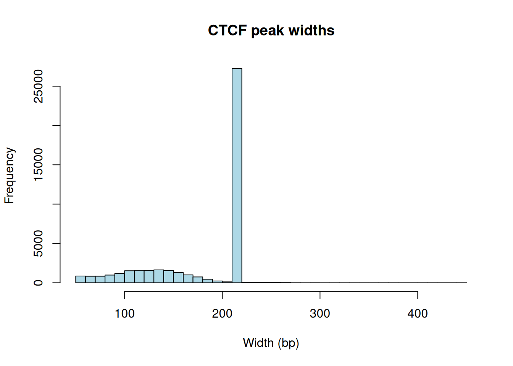
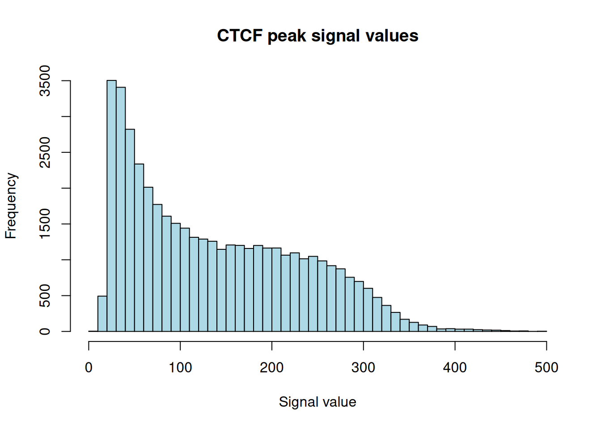
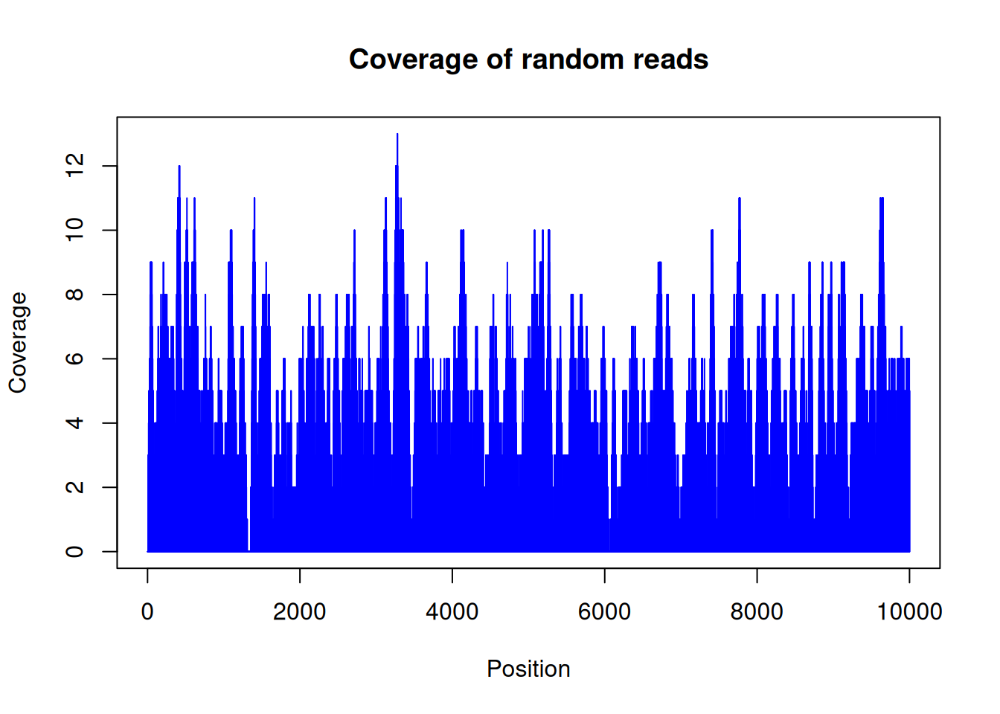
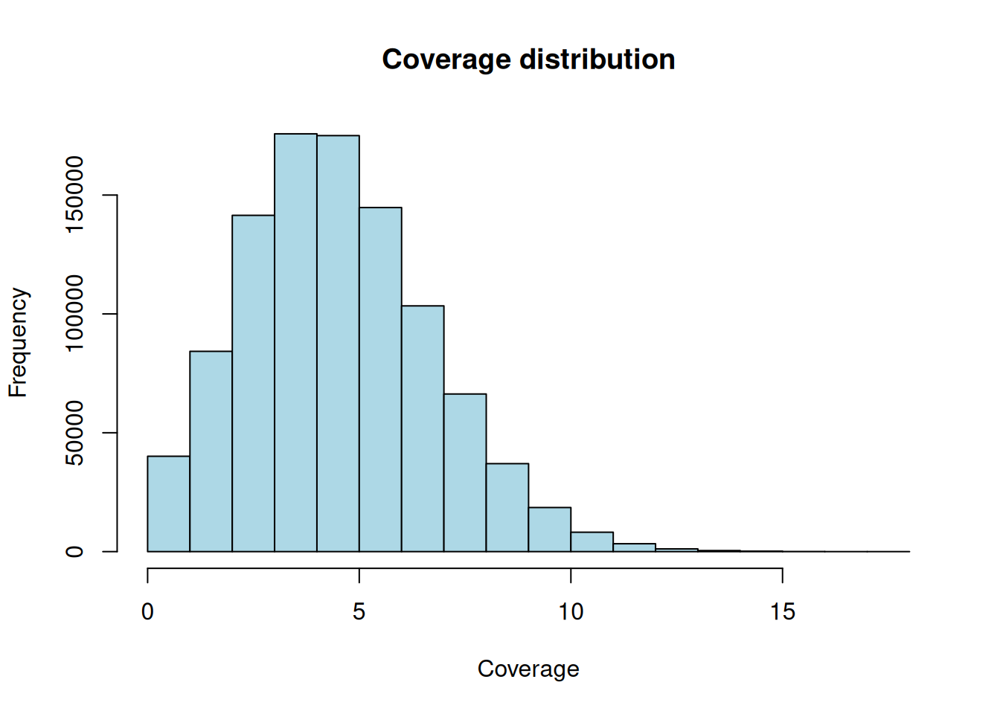

# 35  Genomic ranges with real ChIP-seq peaks

Code

Author

Affiliation

[Sean Davis](https://seandavi.github.io/) [](mailto:seandavi@gmail.com)

[University of Colorado  
Anschutz School of Medicine](https://medschool.cuanschutz.edu/)

Published

June 1, 2024

Modified

September 19, 2026

CTCF is one of the most important architectural proteins in the human genome. It binds thousands of sites across the chromosomes, where it helps fold DNA into loops and marks the boundaries between active and silent regions. So a natural question for a biologist is: **where does CTCF actually bind?**

A ChIP-seq experiment answers that question by handing you a list of genomic intervals — the *peaks* where the protein was detected. In this chapter you’ll take a real CTCF peak set from the ENCODE project, load it into R, and learn the tools you need to explore it: how genomic coordinates are stored on disk, how to import them, and how to ask questions like “how wide are these peaks?” and “where exactly is the center of each one?”

The previous chapter, *Genomic ranges and features*, built `GRanges` objects by hand and worked through the full catalog of range operations (set operations, overlaps, nearest-feature searches, gene models) systematically. This chapter puts those tools to work on a **real dataset**, focusing on what a hand-built example can’t show you: file formats, importing, and exploring an actual peak set.

## 35.1 What you’ll learn

- Read the BED / narrowPeak file format and explain its coordinate system.
- Import a peak file from a URL into a `GRanges` object with `rtracklayer`.
- Use the accessor functions ([`seqnames()`](https://rdrr.io/pkg/Seqinfo/man/seqinfo.html), [`start()`](https://rdrr.io/r/stats/start.html), [`width()`](https://rdrr.io/pkg/BiocGenerics/man/start.html), [`mcols()`](https://rdrr.io/pkg/S4Vectors/man/Vector-class.html)) to pull information out of a `GRanges`.
- Interpret the distribution of peak widths and what it tells you about the peak caller.
- Manipulate ranges with [`shift()`](https://rdrr.io/pkg/IRanges/man/intra-range-methods.html), [`resize()`](https://rdrr.io/pkg/IRanges/man/intra-range-methods.html), and [`flank()`](https://rdrr.io/pkg/IRanges/man/intra-range-methods.html) to build the windows downstream analyses need.
- Compute and visualize read coverage along a chromosome.

## 35.2 The BED file format

Genomic intervals are most often stored in **BED** (Browser Extensible Data) format: a tab-delimited text file where each line is one feature. The first three columns are required and define the interval itself:

- **chrom** — chromosome name (e.g. `chr1`, `chrX`).
- **chromStart** — start position.
- **chromEnd** — end position.

Optional columns can follow: a feature `name`, a `score`, the `strand`, and several more. Peak callers extend BED with extra columns (signal values, p-values); that flavor is called **narrowPeak**, and it’s what our ENCODE file uses.

> **WARNING:**
>
> This is the single most common source of off-by-one bugs in genomics, so it is worth burning into memory. BED files use a **0-based, half-open** coordinate system: counting starts at 0, the start is *included*, and the end is *excluded*. R — and the `GRanges` objects you’ll build from these files — use a **1-based, fully-closed** system: counting starts at 1 and both ends are included.
>
> Take the BED line `chr1 1000 2000`. In BED that means the 1000 bases spanning the interval `[1000, 2000)`. When `rtracklayer` imports it, the start becomes **1001** (shifted up by one) and the end stays **2000**, giving the same 1000 bases but now written as `1001-2000` in 1-based coordinates. The width is identical (`2000 - 1000 = 1000`); only the *numbering* differs. The good news: `rtracklayer` does this conversion for you. The trap is doing the arithmetic yourself on the raw file and being off by one.

## 35.3 Loading the libraries

``` downlit
library(rtracklayer)
library(GenomicRanges)
```

## 35.4 Importing the CTCF peaks

We’ll use a CTCF ChIP-seq peak file from ENCODE.[^1] It lives at a URL, and `rtracklayer::import()` can read straight from that URL — no need to download it by hand first.

Before we use the convenient importer, let’s peek at the raw file so you can see that it really is just a table of numbers and text:

``` downlit
# The peak file lives in this book's GitHub repository; we read it straight from
# its URL so this code runs unchanged anywhere (no local checkout needed).
bed_url <- "https://raw.githubusercontent.com/seandavi/RBiocBook/main/data/ctcf_peaks_ENCFF960ZGP.bed.gz"

# Read the raw file as a plain table just to see its shape
ctcf_peaks_raw <- readr::read_table(bed_url, col_names = FALSE)
```


    ── Column specification ────────────────────────────────────────────────────────
    cols(
      X1 = col_character(),
      X2 = col_double(),
      X3 = col_double(),
      X4 = col_character(),
      X5 = col_double(),
      X6 = col_character(),
      X7 = col_double(),
      X8 = col_double(),
      X9 = col_double(),
      X10 = col_double()
    )

``` downlit
head(ctcf_peaks_raw)
```

    # A tibble: 6 × 10
      X1           X2        X3 X4       X5 X6       X7    X8    X9   X10
      <chr>     <dbl>     <dbl> <chr> <dbl> <chr> <dbl> <dbl> <dbl> <dbl>
    1 chr2  238305323 238305539 .      1000 .      7.70    -1 0.274   108
    2 chr20  49982706  49982922 .       541 .      8.72    -1 0.466   108
    3 chr15  39921015  39921231 .       672 .      9.08    -1 0.547   108
    4 chr8    6708273   6708489 .       560 .      9.86    -1 0.662   108
    5 chr9  136645956 136646172 .       584 .     10.2     -1 0.751   108
    6 chr7   47669294  47669510 .       614 .     10.5     -1 0.807   108

Each row is one peak, and you can see the chromosome, start, and end in the first three columns followed by the narrowPeak extras. Now let’s import it properly into a `GRanges` object, which is the data structure built for genomic intervals:

``` downlit
ctcf_peaks <- rtracklayer::import(bed_url, format = "narrowPeak")
ctcf_peaks
```

    GRanges object with 43865 ranges and 6 metadata columns:
              seqnames              ranges strand |        name     score
                 <Rle>           <IRanges>  <Rle> | <character> <numeric>
          [1]     chr2 238305324-238305539      * |        <NA>      1000
          [2]    chr20   49982707-49982922      * |        <NA>       541
          [3]    chr15   39921016-39921231      * |        <NA>       672
          [4]     chr8     6708274-6708489      * |        <NA>       560
          [5]     chr9 136645957-136646172      * |        <NA>       584
          ...      ...                 ...    ... .         ...       ...
      [43861]    chr11   66222736-66222972      * |        <NA>      1000
      [43862]    chr10   75235956-75236225      * |        <NA>      1000
      [43863]    chr16   57649100-57649347      * |        <NA>      1000
      [43864]    chr17   37373596-37373838      * |        <NA>      1000
      [43865]    chr12   53676108-53676355      * |        <NA>      1000
              signalValue    pValue    qValue      peak
                <numeric> <numeric> <numeric> <integer>
          [1]     7.70385        -1   0.27378       108
          [2]     8.71626        -1   0.46571       108
          [3]     9.07638        -1   0.54697       108
          [4]     9.86234        -1   0.66189       108
          [5]    10.15488        -1   0.75082       108
          ...         ...       ...       ...       ...
      [43861]     478.640        -1   4.87574       124
      [43862]     480.183        -1   4.87574       141
      [43863]     491.081        -1   4.87574       116
      [43864]     491.991        -1   4.87574       127
      [43865]     494.303        -1   4.87574       126
      -------
      seqinfo: 26 sequences from an unspecified genome; no seqlengths

> **NOTE:**
>
> Telling `import()` that the file is `narrowPeak` does two helpful things. First, it applies the 0-based-to-1-based conversion described above, so the `start`, `end`, and `width` you see are already in R’s coordinate system. Second, it parses the peak-caller columns into named metadata: `signalValue`, `pValue`, `qValue`, and `peak` (the offset of the summit within the peak). Those land in the metadata columns of the `GRanges`, where you can reach them with `$`.

## 35.5 Looking inside a GRanges

You met these accessors in the previous chapter; here they are again, this time pulling information out of the peaks you just imported. The *ranges* (chromosome, start, end, strand) come out with their own accessors, and everything else (the *metadata*) comes out with [`mcols()`](https://rdrr.io/pkg/S4Vectors/man/Vector-class.html).

``` downlit
length(ctcf_peaks)         # how many peaks?
```

    [1] 43865

``` downlit
head(seqnames(ctcf_peaks)) # which chromosomes
```

    factor-Rle of length 6 with 6 runs
      Lengths:     1     1     1     1     1     1
      Values : chr2  chr20 chr15 chr8  chr9  chr7 
    Levels(26): chr2 chr20 chr15 ... chr1_KI270714v1_random chrUn_GL000219v1

``` downlit
head(start(ctcf_peaks))    # start positions (1-based, after import)
```

    [1] 238305324  49982707  39921016   6708274 136645957  47669295

``` downlit
head(end(ctcf_peaks))      # end positions
```

    [1] 238305539  49982922  39921231   6708489 136646172  47669510

``` downlit
head(width(ctcf_peaks))    # width = end - start + 1
```

    [1] 216 216 216 216 216 216

So this file contains 43865 CTCF peaks. Notice the comment on `width`: it is `end - start + 1`, not `end - start`. Because `GRanges` coordinates are 1-based and *inclusive*, both endpoints count — the very same span the 0-based BED file wrote as `end - start`. The widths vary, but let’s look at the whole distribution rather than the first six values:

``` downlit
hist(width(ctcf_peaks), breaks = 50,
     main = "CTCF peak widths", xlab = "Width (bp)", col = "lightblue")
```

[](genomic_ranges_chipseq_files/figure-html/fig-peak-widths-1.png "Figure 35.1: Distribution of CTCF peak widths. The sharp spike reflects the peak caller’s fixed-width output.")

Figure 35.1: Distribution of CTCF peak widths. The sharp spike reflects the peak caller’s fixed-width output.

[Figure fig-peak-widths](#fig-peak-widths) has a striking feature: a tall spike at one particular width rather than a smooth spread. That’s not biology — it’s the peak caller. Many ChIP-seq pipelines report peaks at a **fixed width** (here around 200 bp) centered on the detected summit, so the same number shows up over and over. When you see a histogram like this, read it as a signature of how the data were processed, not as a property of CTCF itself.

The metadata sits in a separate table you reach with [`mcols()`](https://rdrr.io/pkg/S4Vectors/man/Vector-class.html):

``` downlit
head(mcols(ctcf_peaks))
```

    DataFrame with 6 rows and 6 columns
             name     score signalValue    pValue    qValue      peak
      <character> <numeric>   <numeric> <numeric> <numeric> <integer>
    1          NA      1000     7.70385        -1   0.27378       108
    2          NA       541     8.71626        -1   0.46571       108
    3          NA       672     9.07638        -1   0.54697       108
    4          NA       560     9.86234        -1   0.66189       108
    5          NA       584    10.15488        -1   0.75082       108
    6          NA       614    10.46015        -1   0.80676       108

These are the narrowPeak columns. You can pull one out directly with `$` — for example the `signalValue`, which measures how strong the binding signal was at each peak:

``` downlit
hist(mcols(ctcf_peaks)$signalValue, breaks = 50,
     main = "CTCF peak signal values", xlab = "Signal value", col = "lightblue")
```

[](genomic_ranges_chipseq_files/figure-html/fig-signal-1.png "Figure 35.2: Distribution of CTCF peak signal values. Most peaks are weak; a long tail of strong sites stretches to the right.")

Figure 35.2: Distribution of CTCF peak signal values. Most peaks are weak; a long tail of strong sites stretches to the right.

[Figure fig-signal](#fig-signal) is **right-skewed**: most peaks carry a modest signal, with a long tail of much stronger binding sites. That shape is typical of ChIP-seq — a handful of high-confidence sites and many weaker ones — and it’s why people often filter on `signalValue` before downstream work.

## 35.6 Some quick summaries

How many peaks, on how many chromosomes, and how wide? A few small expressions answer this more clearly than a wall of printed text:

``` downlit
length(ctcf_peaks)                      # total peaks
```

    [1] 43865

``` downlit
length(unique(seqnames(ctcf_peaks)))    # chromosomes represented
```

    [1] 26

``` downlit
range(width(ctcf_peaks))                # narrowest and widest peak
```

    [1]  54 442

``` downlit
median(width(ctcf_peaks))               # typical peak width
```

    [1] 216

The median width sits right at the spike we saw in [Figure fig-peak-widths](#fig-peak-widths), confirming that most peaks share the caller’s fixed width. We can also count peaks per chromosome:

``` downlit
peaks_per_chr <- table(seqnames(ctcf_peaks))
head(as.data.frame(peaks_per_chr), 10)
```

        Var1 Freq
    1   chr2 3332
    2  chr20 1236
    3  chr15 1431
    4   chr8 1935
    5   chr9 1820
    6   chr7 2140
    7   chr4 2030
    8  chr12 2274
    9   chr5 2355
    10 chr22  873

Larger chromosomes generally carry more peaks, which makes sense: more DNA means more potential binding sites.

## 35.7 Where is each peak?

Three quantities you’ll reach for constantly are the start, the end, and the **center** of each peak. The center is especially useful — motif analyses and fixed-width windows are usually built around it.

``` downlit
peak_starts  <- start(ctcf_peaks)
peak_ends    <- end(ctcf_peaks)
peak_centers <- (start(ctcf_peaks) + end(ctcf_peaks)) / 2

head(peak_centers, 5)
```

    [1] 238305432  49982814  39921124   6708382 136646064

`peak_centers` now holds the midpoint of every peak, ready to anchor a window.

## 35.8 Reshaping ranges

You met [`shift()`](https://rdrr.io/pkg/IRanges/man/intra-range-methods.html), [`resize()`](https://rdrr.io/pkg/IRanges/man/intra-range-methods.html), and [`flank()`](https://rdrr.io/pkg/IRanges/man/intra-range-methods.html) in the previous chapter. Here is what they do to a *real* peak set — the operations behind sliding a window, building fixed-width windows for motif analysis, and grabbing the DNA beside a peak. As before, each returns a new `GRanges` and leaves the original untouched.

### 35.8.1 Shifting

[`shift()`](https://rdrr.io/pkg/IRanges/man/intra-range-methods.html) moves every range by a fixed number of bases without changing its width:

``` downlit
peaks_shifted <- shift(ctcf_peaks, 100)   # slide right by 100 bp

ctcf_peaks[1]
```

    GRanges object with 1 range and 6 metadata columns:
          seqnames              ranges strand |        name     score signalValue
             <Rle>           <IRanges>  <Rle> | <character> <numeric>   <numeric>
      [1]     chr2 238305324-238305539      * |        <NA>      1000     7.70385
             pValue    qValue      peak
          <numeric> <numeric> <integer>
      [1]        -1   0.27378       108
      -------
      seqinfo: 26 sequences from an unspecified genome; no seqlengths

``` downlit
peaks_shifted[1]
```

    GRanges object with 1 range and 6 metadata columns:
          seqnames              ranges strand |        name     score signalValue
             <Rle>           <IRanges>  <Rle> | <character> <numeric>   <numeric>
      [1]     chr2 238305424-238305639      * |        <NA>      1000     7.70385
             pValue    qValue      peak
          <numeric> <numeric> <integer>
      [1]        -1   0.27378       108
      -------
      seqinfo: 26 sequences from an unspecified genome; no seqlengths

The start and end of the first peak both moved up by 100, and the width is unchanged — exactly what “shift” should do.

### 35.8.2 Resizing

[`resize()`](https://rdrr.io/pkg/IRanges/man/intra-range-methods.html) sets every range to a chosen width. The `fix` argument says which point to hold still while the width changes. Resizing all peaks to a common width is the standard way to build comparable windows:

``` downlit
peaks_200bp <- resize(ctcf_peaks, width = 200, fix = "center")

peaks_200bp[1]
```

    GRanges object with 1 range and 6 metadata columns:
          seqnames              ranges strand |        name     score signalValue
             <Rle>           <IRanges>  <Rle> | <character> <numeric>   <numeric>
      [1]     chr2 238305332-238305531      * |        <NA>      1000     7.70385
             pValue    qValue      peak
          <numeric> <numeric> <integer>
      [1]        -1   0.27378       108
      -------
      seqinfo: 26 sequences from an unspecified genome; no seqlengths

``` downlit
all(width(peaks_200bp) == 200)   # every peak is now exactly 200 bp
```

    [1] TRUE

Fixing on `"center"` keeps each peak’s midpoint in place and grows or shrinks it symmetrically — so a downstream tool sees uniform 200 bp windows centered on the binding sites.

### 35.8.3 Flanking

[`flank()`](https://rdrr.io/pkg/IRanges/man/intra-range-methods.html) returns the region *beside* a range — useful for grabbing the DNA just upstream or downstream of a peak:

``` downlit
upstream_1kb <- flank(ctcf_peaks, width = 1000, start = TRUE)

ctcf_peaks[1]
```

    GRanges object with 1 range and 6 metadata columns:
          seqnames              ranges strand |        name     score signalValue
             <Rle>           <IRanges>  <Rle> | <character> <numeric>   <numeric>
      [1]     chr2 238305324-238305539      * |        <NA>      1000     7.70385
             pValue    qValue      peak
          <numeric> <numeric> <integer>
      [1]        -1   0.27378       108
      -------
      seqinfo: 26 sequences from an unspecified genome; no seqlengths

``` downlit
upstream_1kb[1]
```

    GRanges object with 1 range and 6 metadata columns:
          seqnames              ranges strand |        name     score signalValue
             <Rle>           <IRanges>  <Rle> | <character> <numeric>   <numeric>
      [1]     chr2 238304324-238305323      * |        <NA>      1000     7.70385
             pValue    qValue      peak
          <numeric> <numeric> <integer>
      [1]        -1   0.27378       108
      -------
      seqinfo: 26 sequences from an unspecified genome; no seqlengths

The flanking range is the 1000 bp sitting immediately before the start of the first peak — the kind of window you might scan for a neighboring promoter.

> **NOTE:**
>
> Once you have peaks and other features (genes, promoters, other peak sets), the next question is usually *which ones overlap?* The [`findOverlaps()`](https://rdrr.io/pkg/IRanges/man/findOverlaps-methods.html) and [`nearest()`](https://rdrr.io/pkg/IRanges/man/nearest-methods.html) functions, set operations like [`intersect()`](https://generics.r-lib.org/reference/setops.html), and grouped operations over a `GRangesList` were covered in depth in the previous chapter, *Genomic ranges and features*. We don’t repeat them here so we can stay focused on the real-data import workflow.

## 35.9 Coverage

**Coverage** counts how many ranges overlap each position along a chromosome. It’s the foundation of peak calling: pile up sequencing reads, and the tall stacks are where the protein bound. Let’s build a toy example by scattering random reads across a one-megabase stretch and counting the pile-up.

``` downlit
set.seed(42)   # reproducible random reads
chrom_length <- 1000000
num_reads    <- 100000
read_length  <- 50

random_starts <- sample(seq_len(chrom_length - read_length + 1),
                         num_reads, replace = TRUE)
random_reads  <- GRanges(seqnames = "chr1",
                         ranges = IRanges(start = random_starts,
                                          end = random_starts + read_length - 1))
random_reads
```

    GRanges object with 100000 ranges and 0 metadata columns:
               seqnames        ranges strand
                  <Rle>     <IRanges>  <Rle>
           [1]     chr1   61413-61462      *
           [2]     chr1   54425-54474      *
           [3]     chr1 623844-623893      *
           [4]     chr1   74362-74411      *
           [5]     chr1   46208-46257      *
           ...      ...           ...    ...
       [99996]     chr1 663489-663538      *
       [99997]     chr1 886082-886131      *
       [99998]     chr1 933222-933271      *
       [99999]     chr1 486340-486389      *
      [100000]     chr1 177556-177605      *
      -------
      seqinfo: 1 sequence from an unspecified genome; no seqlengths

The [`coverage()`](https://rdrr.io/pkg/IRanges/man/coverage-methods.html) function turns those reads into a per-base count. It returns an `Rle` (run-length encoded) object — a compact way to store long stretches of repeated values:

``` downlit
random_coverage <- coverage(random_reads, width = chrom_length)
head(random_coverage)
```

    RleList of length 1
    $chr1
    integer-Rle of length 1000000 with 173047 runs
      Lengths:  7  1  6  3  8  8  1  1 22  1  4 ...  3  1  2  8 12 23  5  2  8  6
      Values :  0  1  3  4  5  6  7  8  9  8  6 ...  3  2  3  4  5  4  3  2  1  0

Let’s look at the coverage across the first 10,000 bases:

``` downlit
plot(random_coverage[[1]][1:10000], type = "h", col = "blue",
     main = "Coverage of random reads", xlab = "Position", ylab = "Coverage")
```

[](genomic_ranges_chipseq_files/figure-html/fig-coverage-1.png "Figure 35.3: Per-base coverage from randomly placed reads across the first 10,000 bases of a simulated chromosome.")

Figure 35.3: Per-base coverage from randomly placed reads across the first 10,000 bases of a simulated chromosome.

[Figure fig-coverage](#fig-coverage) looks like noise, and that’s the point: because we placed the reads *at random*, the coverage hovers around a constant average with no real peaks. Real ChIP-seq data would show tall, localized spikes where the protein bound — those spikes are what a peak caller hunts for, and their absence here is exactly what “no signal” should look like.

We can also ask how the coverage is distributed across all positions:

``` downlit
hist(as.numeric(random_coverage[[1]]),
     main = "Coverage distribution", xlab = "Coverage", ylab = "Frequency",
     col = "lightblue")
```

[](genomic_ranges_chipseq_files/figure-html/fig-coverage-density-1.png "Figure 35.4: How often each coverage depth occurs across the simulated chromosome.")

Figure 35.4: How often each coverage depth occurs across the simulated chromosome.

[Figure fig-coverage-density](#fig-coverage-density) is a tidy bell-ish hump centered on the average depth. With 1e+05 reads of length 50 spread over 1e+06 bases, the expected coverage is about 5x — right where the hump sits. Random reads give random, evenly-spread coverage; biological signal is what makes that distribution lumpy.

## 35.10 Exercises

Use the `ctcf_peaks` object you imported above. Each solution names the accessor or function that does the job.

1.  **Wide peaks.** How many CTCF peaks are wider than 250 bp?

    > **NOTE:**
    > ``` downlit
    > sum(width(ctcf_peaks) > 250)
    > ```
    >
    > [`width()`](https://rdrr.io/pkg/BiocGenerics/man/start.html) returns a numeric vector, `> 250` turns it into TRUE/FALSE, and [`sum()`](https://rdrr.io/r/base/sum.html) counts the TRUEs. Most peaks sit at the caller’s fixed width, so only a minority exceed 250 bp.

2.  **Fixed-width windows.** Build a new `GRanges` of 500 bp windows centered on each peak, and confirm every window is exactly 500 bp wide.

    > **NOTE:**
    > ``` downlit
    > windows_500 <- resize(ctcf_peaks, width = 500, fix = "center")
    > all(width(windows_500) == 500)
    > ```
    >
    > `fix = "center"` keeps each peak’s midpoint fixed while the width grows to 500, giving uniform windows for a downstream analysis.

3.  **Peak centers.** Compute the center position of every peak and report the median center.

    > **NOTE:**
    > ``` downlit
    > centers <- (start(ctcf_peaks) + end(ctcf_peaks)) / 2
    > median(centers)
    > ```
    >
    > The center is the midpoint of the start and end. (You could also use `start(resize(ctcf_peaks, width = 1, fix = "center"))` to let `GRanges` do the arithmetic.)

4.  **Fraction on chr1.** What fraction of all CTCF peaks fall on `chr1`?

    > **NOTE:**
    > ``` downlit
    > mean(seqnames(ctcf_peaks) == "chr1")
    > ```
    >
    > Comparing [`seqnames()`](https://rdrr.io/pkg/Seqinfo/man/seqinfo.html) to `"chr1"` gives a TRUE/FALSE vector; [`mean()`](https://rdrr.io/pkg/BiocGenerics/man/mean.html) of a logical vector is the *proportion* that are TRUE — a handy idiom for “what fraction satisfy this condition?”

## 35.11 Summary

You can now take a real peak set from file to insight:

- **Read a BED/narrowPeak file** and explain its 0-based, half-open coordinate system — and why R’s 1-based coordinates differ.
- **Import peaks into a `GRanges`** straight from a URL with `rtracklayer::import(..., format = "narrowPeak")`, which handles the coordinate conversion and parses the metadata columns.
- **Explore the object** with [`seqnames()`](https://rdrr.io/pkg/Seqinfo/man/seqinfo.html), [`start()`](https://rdrr.io/r/stats/start.html), [`end()`](https://rdrr.io/r/stats/start.html), [`width()`](https://rdrr.io/pkg/BiocGenerics/man/start.html), and [`mcols()`](https://rdrr.io/pkg/S4Vectors/man/Vector-class.html), and read its width and signal distributions as fingerprints of the peak caller and the biology.
- **Reshape ranges** with [`shift()`](https://rdrr.io/pkg/IRanges/man/intra-range-methods.html), [`resize()`](https://rdrr.io/pkg/IRanges/man/intra-range-methods.html), and [`flank()`](https://rdrr.io/pkg/IRanges/man/intra-range-methods.html) to build the windows downstream tools expect.
- **Compute coverage** and recognize that random reads give flat coverage, while biological signal makes it lumpy.

For overlaps, nearest-feature searches, set operations, and gene models, see the [Genomic ranges and features](genomic_ranges.llms.md) chapter, which treats those operations in full. To put the whole toolkit to work on real ENCODE data, continue to the *Ranges Exercises*.

[^1]: ENCODE accession [ENCFF960ZGP](https://www.encodeproject.org/files/ENCFF960ZGP/), originally at <https://www.encodeproject.org/files/ENCFF960ZGP/@@download/ENCFF960ZGP.bed.gz>. We keep a copy in this book’s repository and read it from the GitHub URL below, so the code runs unchanged on any machine.
