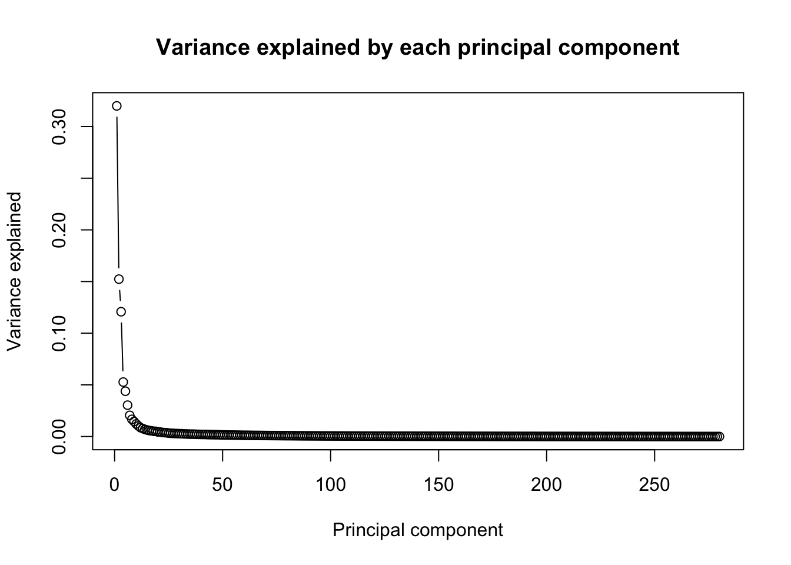
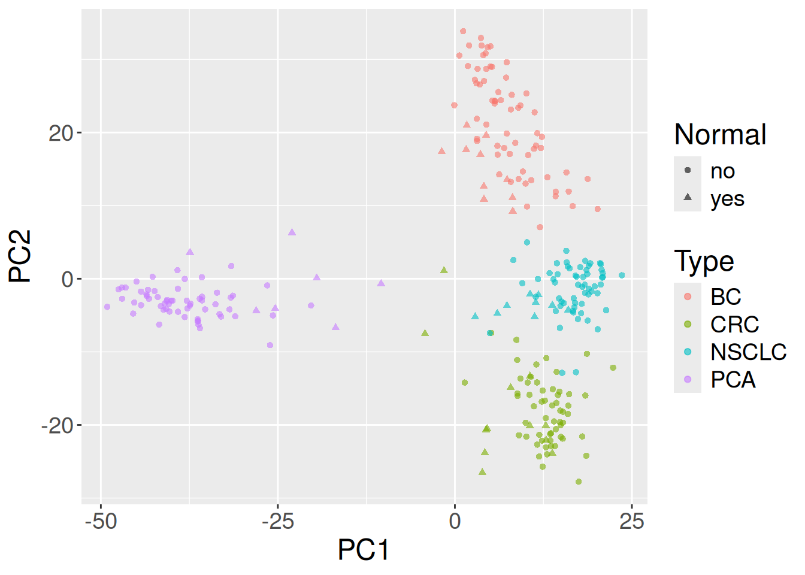

# 31  Accessing public omics data with GEOquery

Code

Author

Affiliation

[Sean Davis](https://seandavi.github.io/) [](mailto:seandavi@gmail.com)

[University of Colorado  
Anschutz School of Medicine](https://medschool.cuanschutz.edu/)

Published

June 1, 2024

Modified

September 19, 2026

Someone has already run the experiment you need. Thousands of expression studies — microarray and RNA-seq, across nearly every tissue and disease — sit in a public archive called the **Gene Expression Omnibus (GEO)**, free to download and reanalyze. Suppose you read a paper comparing tumor and normal tissue across several cancers and you want to *see the data for yourself*: pull it down, check how the samples group, and ask whether tumor and normal really separate. That is exactly the kind of reuse GEO exists for.

In this chapter you’ll do that end to end. You’ll fetch a real published dataset with the `GEOquery` package, load it into a `SummarizedExperiment` (the container from the previous chapter), keep the most variable genes, and run a **principal component analysis (PCA)** to visualize how the samples relate. The data come from a study of immune gene expression in matched normal and tumor tissue ([Brouwer-Visser et al. 2018](#ref-brouwer-visser_regulatory_2018)), deposited as accession [GSE103512](https://www.ncbi.nlm.nih.gov/geo/query/acc.cgi?acc=GSE103512).

## 31.1 What you’ll learn

By the end of this chapter you will be able to:

- Download a published dataset from GEO with [`getGEO()`](http://seandavi.github.io/GEOquery/reference/getGEO.html).
- Convert the result into a `SummarizedExperiment` and inspect its parts.
- Summarize sample annotations with [`table()`](https://rdrr.io/r/base/table.html).
- Filter an expression matrix down to its most variable genes.
- Run PCA with [`prcomp()`](https://rdrr.io/r/stats/prcomp.html) and plot the samples to see how they group.
- Explain what PCA does, and how it differs from nonlinear methods such as t-SNE and UMAP.

This chapter builds directly on the `SummarizedExperiment` chapter. If the words [`assay()`](https://rdrr.io/pkg/SummarizedExperiment/man/SummarizedExperiment-class.html), [`colData()`](https://rdrr.io/pkg/SummarizedExperiment/man/SummarizedExperiment-class.html), or “rows are genes, columns are samples” don’t feel familiar yet, read that chapter first — here we’ll lean on it rather than re-explain the object’s anatomy.

> **TIP:**
>
> `GEOquery` is a Bioconductor package. Install it once with `BiocManager`; you won’t need to run this again:
>
> ``` downlit
> BiocManager::install("GEOquery")
> ```

## 31.2 Fetching a dataset from GEO

`GEOquery` has essentially one function you’ll reach for: [`getGEO()`](http://seandavi.github.io/GEOquery/reference/getGEO.html). You hand it a GEO **accession number** — the unique ID for a dataset, here `"GSE103512"` — and it downloads the data over the network.

``` downlit
library(GEOquery)
gse <- getGEO("GSE103512")[[1]]
```

> **NOTE:**
>
> Two small historical quirks are worth a moment, because they trip up everyone the first time.
>
> First, [`getGEO()`](http://seandavi.github.io/GEOquery/reference/getGEO.html) returns a **list** of datasets, not a single one. In the early days a single accession could bundle several datasets, so the function always returns a list. That’s uncommon now, but the convention stayed because so much older data is still useful — hence the `[[1]]` to grab the first (and here, only) element.
>
> Second, `GEOquery` was written in 2007 and hands you data in the older Bioconductor container, the `ExpressionSet`. We’ll convert it to the modern `SummarizedExperiment` in the next step so we can use the accessors you already know.

Now convert the `ExpressionSet` into a `SummarizedExperiment` with [`as()`](https://rdrr.io/r/methods/as.html):

``` downlit
library(SummarizedExperiment)
se <- as(gse, "SummarizedExperiment")
se
```

    class: SummarizedExperiment 
    dim: 54715 280 
    metadata(3): experimentData annotation protocolData
    assays(1): exprs
    rownames(54715): 1007_PM_s_at 1053_PM_at ... AFFX-TrpnX-5_at
      AFFX-TrpnX-M_at
    rowData names(16): ID GB_ACC ... Gene.Ontology.Cellular.Component
      Gene.Ontology.Molecular.Function
    colnames(280): GSM2772660 GSM2772661 ... GSM2772938 GSM2772939
    colData names(72): title geo_accession ... tumorsize.ch1 weight.ch1

Printing `se` confirms what you have: a `SummarizedExperiment` whose rows are genes (features) and whose columns are samples. The [`assay()`](https://rdrr.io/pkg/SummarizedExperiment/man/SummarizedExperiment-class.html) holds the expression matrix, and [`colData()`](https://rdrr.io/pkg/SummarizedExperiment/man/SummarizedExperiment-class.html) holds the per-sample annotations — the same three-part structure from the previous chapter.

``` downlit
dim(se)
```

    [1] 54715   280

So this experiment has 54715 genes measured across 280 samples. The expression values live in the assay named `"exprs"` (a leftover name from the `ExpressionSet` days), and you reach them with `assay(se, "exprs")`.

## 31.3 Summarizing the sample annotations

Before any analysis, look at what the samples *are*. The interesting variables here are the cancer type and whether each sample is tumor or normal tissue. They live in `colData(se)` under the names `cancer.type.ch1` and `normal.ch1`.

The [`table()`](https://rdrr.io/r/base/table.html) function counts unique values, and [`with()`](https://rdrr.io/r/base/with.html) lets you refer to those column names directly instead of typing `colData(se)$...` for each one:

``` downlit
with(colData(se), table(`cancer.type.ch1`, `normal.ch1`))
```

                   normal.ch1
    cancer.type.ch1 no yes
              BC    65  10
              CRC   57  12
              NSCLC 60   9
              PCA   60   7

Read this as a grid: each row is a cancer type, and the two columns split it into tumor (`no`, i.e. *not* normal) and normal samples. Most cancer types here have both tumor and matched normal tissue, with tumor samples outnumbering normals — exactly the design you’d want for a tumor-vs-normal comparison. A quick table like this is the cheapest possible sanity check that the dataset contains what the paper claimed.

## 31.4 Keeping the most variable genes

We want to see how the samples group. Most of the genes barely change from sample to sample, and those flat genes only add noise. A standard move before dimensionality reduction is to keep just the **most variable** genes — the ones actually carrying the signal that distinguishes samples.

> **NOTE:**
>
> PCA looks for the directions in which your samples differ most. A gene whose expression is nearly constant everywhere contributes almost nothing to those differences — it’s dead weight that dilutes the signal and slows the computation. Ranking genes by their **standard deviation** and keeping the top slice focuses PCA on the genes that vary, which usually makes the biological structure (tumor vs. normal, one cancer type vs. another) far easier to see. There’s no single correct cutoff; 500 genes is a reasonable starting point, and you’re encouraged to try others.

Compute each gene’s standard deviation with [`apply()`](https://rdrr.io/r/base/apply.html) (which applies a function across the rows or columns of a matrix — here, `sd` to each row, `1` meaning “by row”), then use [`order()`](https://rdrr.io/r/base/order.html) to rank genes from most to least variable and keep the top 500:

``` downlit
sds <- apply(assay(se, "exprs"), 1, sd)
dat <- assay(se, "exprs")[order(sds, decreasing = TRUE)[1:500], ]
```

`order(sds, decreasing = TRUE)` returns the row positions sorted by standard deviation, largest first; `[1:500]` takes the top 500; and we use those to subset the expression matrix. `dat` is now a 500-gene by 280-sample matrix.

## 31.5 Running and interpreting the PCA

> **NOTE:**
>
> Each sample is now described by 500 numbers (one per gene) — 500 dimensions, far too many to look at directly. PCA re-describes the same samples using a new set of axes, the **principal components**, chosen to have three useful properties:
>
> - each component is a **weighted blend of the original genes** (a *linear combination*), so a single axis summarizes many genes at once;
> - the components are **ordered by how much of the variation they capture** — PC1 captures the most, PC2 the next most, and so on;
> - the components are **uncorrelated** — geometrically, at right angles — so each carries information the others don’t.
>
> The payoff is **dimensionality reduction**: when the first two or three components capture most of the variation (they often do), you can plot just those and *see* the structure of a 500-dimensional dataset on a flat page. PCA is **linear** (components are straight-line blends of genes), **deterministic** (same data, same answer), and its axes are **interpretable** — you can ask which genes weigh most heavily on PC1.

With that picture in mind: [`prcomp()`](https://rdrr.io/r/stats/prcomp.html) runs the analysis, and it expects **samples as rows**, so we transpose the matrix with [`t()`](https://rdrr.io/r/base/t.html) before handing it over:

``` downlit
pca_results <- prcomp(t(dat))
pca_df <- as.data.frame(pca_results$x)
pca_df$Type <- factor(colData(se)[, "cancer.type.ch1"])
pca_df$Normal <- factor(colData(se)[, "normal.ch1"])
```

[`prcomp()`](https://rdrr.io/r/stats/prcomp.html) returns a list with a few pieces worth knowing. `$x` holds each sample’s coordinates along every principal component — the new positions we’ll plot. `$sdev` is each component’s standard deviation, which we’ll turn into “variance explained” in a moment. And `$rotation` (which we won’t use here) holds the **loadings** — how strongly each gene contributes to each component — which is where you’d look to ask *which genes* drive PC1. For now we pull `$x` into a data frame and attach the cancer type and tumor/normal label so we can color and shape the plot.

How much of the variation does each component capture? Each component’s variance is its squared standard deviation; divide by the total to get a fraction:

``` downlit
pca_var <- pca_results$sdev^2 / sum(pca_results$sdev^2)
plot(pca_var, xlab = "Principal component", ylab = "Variance explained",
     main = "Variance explained by each principal component", type = "b")
```

[](geoquery_files/figure-html/pca-variance-1.png)

The curve drops off steeply: the first principal component (PC1) explains far more of the variation than any other, and after the first few components each one adds little. That steep drop is good news — it means a two-dimensional plot of PC1 and PC2 captures most of what’s going on, so it’s worth plotting.

``` downlit
library(ggplot2)
ggplot(pca_df, aes(x = PC1, y = PC2, shape = Normal, color = Type)) +
    geom_point(alpha = 0.6) +
    theme(text = element_text(size = 18))
```

[](geoquery_files/figure-html/fig-pca-1.png "Figure 31.1: Samples projected onto the first two principal components, colored by cancer type and shaped by tumor/normal status.")

Figure 31.1: Samples projected onto the first two principal components, colored by cancer type and shaped by tumor/normal status.

In [Figure fig-pca](#fig-pca) the x-axis is PC1 and the y-axis is PC2, each point is one sample, color marks the cancer type, and the shape marks tumor versus normal. The dominant pattern is **cancer type**: samples of the same color cluster together, so PC1 and PC2 are mostly separating tissues of origin from one another. Within each cancer type, the tumor and normal shapes tend to occupy slightly different regions, reflecting the tumor-vs-normal expression differences the original study set out to characterize. In other words, a handful of unsupervised components, computed from just 500 genes, already recover biology you’d expect: different cancers look different, and within a cancer, tumor looks different from normal.

> **TIP:**
>
> PCA is the workhorse, but it isn’t the only way to squeeze many dimensions onto a plot, and the alternatives make different trade-offs:
>
> - **PCA** — *linear*, fast, deterministic, with interpretable axes. It preserves the **global** structure (the biggest sources of variation) but can blur groups that differ only in subtle, nonlinear ways.
> - **t-SNE** and **UMAP** — *nonlinear* methods that preserve **local neighborhoods**: similar samples are placed close together, so clusters pop out vividly. The trade-offs: the axes have no inherent meaning, distances *between* well-separated clusters are not meaningful, and the result is **stochastic** (different runs or settings give different-looking pictures). They are visualization tools, not a basis for measurement. You’ll use t-SNE in the [single-cell chapter](single_cell/setup.llms.md), where many thousands of cells form many subtle clusters.
> - **MDS** (multidimensional scaling) — arranges points to preserve their **pairwise distances** as faithfully as possible; classical MDS on Euclidean distances is essentially PCA in disguise.
>
> A common, sensible workflow is **PCA first** — it’s quick and tells you how many dimensions actually carry signal — followed by a nonlinear method like UMAP on the top components when you need to resolve fine cluster structure.

## 31.6 Summary

You just reused a published dataset from start to finish. You:

- Downloaded GSE103512 from GEO with [`getGEO()`](http://seandavi.github.io/GEOquery/reference/getGEO.html) and grabbed the dataset with `[[1]]`.
- Converted the legacy `ExpressionSet` into a `SummarizedExperiment` and inspected its dimensions and sample annotations.
- Summarized the cancer-type-by-tumor/normal design with [`table()`](https://rdrr.io/r/base/table.html).
- Filtered to the 500 most variable genes, ran PCA with [`prcomp()`](https://rdrr.io/r/stats/prcomp.html), and read the variance-explained plot.
- Plotted PC1 vs. PC2 and saw the samples separate by cancer type, with tumor and normal differing within each type.

The same recipe — fetch, load into a `SummarizedExperiment`, filter, reduce, plot — works for thousands of other GEO datasets.

## 31.7 Exercises

> **NOTE:**
>
> What is the class of `se`, and what are the dimensions of its `assay` and `colData`? Which variables are stored in `colData`?
>
> ``` downlit
> class(se)
> dim(assay(se, "exprs"))   # genes x samples
> dim(colData(se))          # samples x annotation variables
> colnames(colData(se))     # the available sample variables
> ```
>
> `se` is a `SummarizedExperiment`. The assay has one row per gene and one column per sample; `colData` has one row per sample and one column per annotation variable, including `cancer.type.ch1` and `normal.ch1`.

> **NOTE:**
>
> Re-run the analysis keeping the top 100 genes, and again with the top 2000. Does the PC1-vs-PC2 plot change much?
>
> ``` downlit
> dat100 <- assay(se, "exprs")[order(sds, decreasing = TRUE)[1:100], ]
> pca100 <- prcomp(t(dat100))
> plot(pca100$x[, 1], pca100$x[, 2], xlab = "PC1", ylab = "PC2")
> ```
>
> The broad structure — samples separating by cancer type — is usually robust to the exact cutoff. Too few genes can lose finer distinctions; too many let low-variance noise creep back in. The stability of the big picture across cutoffs is itself reassuring.

> **NOTE:**
>
> Use the `GGally` package’s [`ggpairs()`](https://ggobi.github.io/ggally/reference/ggpairs.html) to view the first few principal components together, colored by cancer type.
>
> ``` downlit
> library(GGally)
> ggpairs(pca_df, columns = 1:4, mapping = aes(color = Type))
> ```
>
> [`ggpairs()`](https://ggobi.github.io/ggally/reference/ggpairs.html) draws every pairwise combination of the chosen columns (here PC1–PC4) in a grid, so you can spot structure that PC1-vs-PC2 alone might hide — for example, a cancer type that only separates along PC3 or PC4.

Brouwer-Visser, Jurriaan, Wei-Yi Cheng, Anna Bauer-Mehren, et al. 2018. “Regulatory T-Cell Genes Drive Altered Immune Microenvironment in Adult Solid Cancers and Allow for Immune Contextual Patient Subtyping.” *Cancer Epidemiology, Biomarkers & Prevention* 27 (1): 103–12. <https://doi.org/10.1158/1055-9965.EPI-17-0461>.
