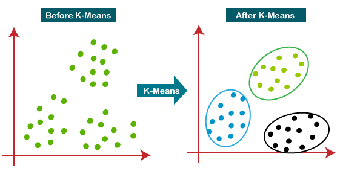
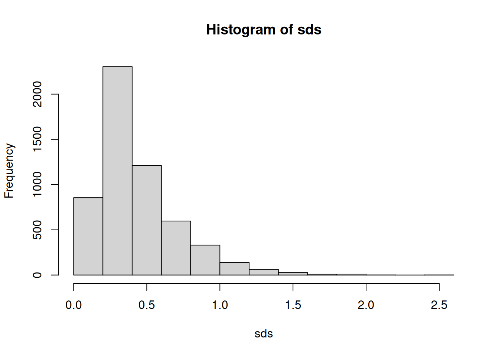
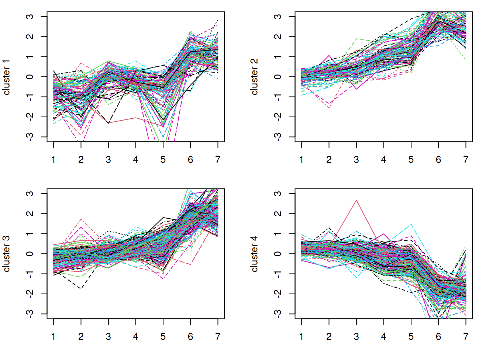
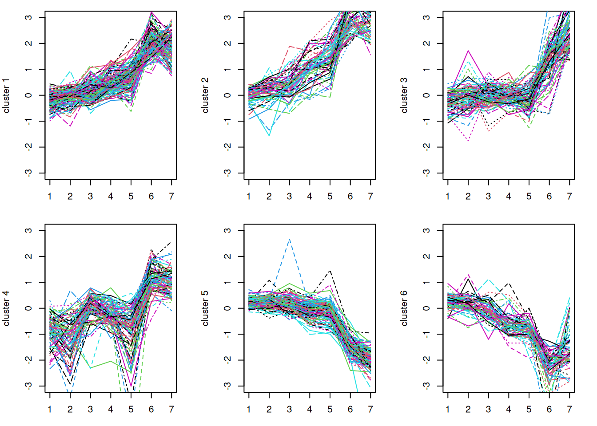

# 23  K-means clustering

Code

Author

Affiliation

[Sean Davis](https://seandavi.github.io/) [](mailto:seandavi@gmail.com)

[University of Colorado  
Anschutz School of Medicine](https://medschool.cuanschutz.edu/)

Published

June 1, 2024

Modified

September 19, 2026

When yeast cells run low on glucose, they flip their entire metabolic program — switching from fermentation to respiration in an event called the **diauxic shift**. DeRisi et al. ([1997](#ref-derisi_exploring_1997)) watched this happen by measuring the expression of roughly 6,400 genes at seven time points across the shift. That leaves you with a wall of numbers: 6,400 genes, each with its own little trajectory over time. Some genes ramp up as the cells switch fuels, some shut down, and most barely move at all. How do you find the *groups* of genes that rise and fall together — the ones that might be co-regulated, taking part in the same biological response?

That is exactly the kind of question **k-means clustering** answers. It is an unsupervised method: you don’t tell it which genes belong together, you just ask it to sort the genes into a handful of groups so that genes with similar behavior land in the same group. In this chapter you’ll use k-means on the DeRisi yeast data — the same dataset you met in the SummarizedExperiment chapter — to pull out clusters of co-regulated genes and then read their temporal profiles back as biology.

## 23.1 What you’ll learn

- Explain in plain language what k-means clustering does and when it’s useful.
- Pull a public dataset from NCBI GEO with [`getGEO()`](http://seandavi.github.io/GEOquery/reference/getGEO.html) and convert it to a `SummarizedExperiment`.
- Filter a gene-expression matrix down to its most variable (most informative) genes using the standard deviation.
- Run [`kmeans()`](https://rdrr.io/r/stats/kmeans.html) on real data and make the result **reproducible** with [`set.seed()`](https://rdrr.io/r/base/Random.html).
- Plot each cluster’s expression profile and interpret what the clusters say about the diauxic shift.

## 23.2 What k-means does

K-means clustering is a method for finding groups in a dataset. It is an *unsupervised* learning technique: it doesn’t rely on previously labeled data. Instead, it finds structure directly from the data, based on how similar the data points are to one another ([Figure fig-kmeans-algorithm](#fig-kmeans-algorithm)).

[](images/kmeans.png "Figure 23.1: K-means clustering takes a dataset and divides it into k clusters.")

Figure 23.1: K-means clustering takes a dataset and divides it into k clusters.

The idea is to split the data into `k` groups, called **clusters**, so that each point belongs to the cluster whose average it is closest to. The algorithm tries to make points within a cluster as similar as possible while keeping different clusters as distinct as possible. For our yeast data, a “point” is a single gene, and “similar” means *follows a similar expression pattern over the time course*.

> **TIP:**
>
> Imagine `k` party hosts scattered around a room full of guests. Each guest walks to the nearest host (**assignment**). Each host then moves to the middle of their own group (**update**). Guests re-check who is now closest and move again, and the hosts re-center. Repeat until nobody needs to move. The final huddles are your clusters, and each host’s position is a **centroid** — the average of its group.

## 23.3 The k-means algorithm

Spelled out, k-means follows these steps:

1.  Choose the number of clusters, `k`.
2.  Place `k` centroids at random (often by picking `k` of the data points).
3.  **Assign** each data point to its nearest centroid.
4.  **Update** each centroid to the mean of the points assigned to it.
5.  Repeat steps 3 and 4 until the centroids stop moving (or a maximum number of iterations is reached).

When the centroids stabilize, the algorithm has *converged*, and the final clusters represent the patterns in the data.

> **WARNING:**
>
> Step 2 starts from a **random** placement of centroids, so two runs can give slightly different clusters (and the cluster *numbers* can be shuffled). Whenever you want a result you can reproduce — and a frozen figure that doesn’t change on every render — call [`set.seed()`](https://rdrr.io/r/base/Random.html) before [`kmeans()`](https://rdrr.io/r/stats/kmeans.html).

## 23.4 Pros and cons of k-means clustering

Compared to other clustering algorithms, k-means has several advantages:

- **Simplicity** — the algorithm is straightforward and easy to implement, even on large datasets.
- **Scalability** — it adapts well to large datasets with optimization or parallel processing.
- **Speed** — it is generally fast, especially when `k` is small.
- **Interpretability** — the results are easy to read: every point gets a single cluster label.

It also has real limitations:

- **Choice of `k`** — you have to pick the number of clusters yourself, and a poor choice gives poor results. Domain knowledge and experimentation help.
- **Sensitivity to initial conditions** — different random starts can give different answers, which is why you seed and sometimes re-run.
- **Assumes round, even clusters** — k-means expects roughly spherical, similarly sized clusters, and struggles when the real groups have other shapes.
- **Sensitivity to outliers** — a few extreme points can drag a centroid around, so cleaning or filtering the data first helps.

Despite these limits, k-means remains a popular, widely used tool for exploring data — and it is especially handy in biology, where spotting groups of co-behaving genes can hint at shared function or regulation.

## 23.5 A worked example: the diauxic shift

### 23.5.1 The data and experimental background

The data come from DeRisi et al. ([1997](#ref-derisi_exploring_1997)). From their abstract:

> DNA microarrays containing virtually every gene of *Saccharomyces cerevisiae* were used to carry out a comprehensive investigation of the temporal program of gene expression accompanying the metabolic shift from fermentation to respiration. The expression profiles observed for genes with known metabolic functions pointed to features of the metabolic reprogramming that occur during the diauxic shift, and the expression patterns of many previously uncharacterized genes provided clues to their possible functions.

These data are available from NCBI GEO as [GSE28](https://www.ncbi.nlm.nih.gov/geo/query/acc.cgi?acc=GSE28).

Here is the biology in brief. When baker’s yeast grows on glucose with plenty of oxygen, it still *prefers* to ferment the glucose rather than respire it — even though respiration is more efficient. Once the glucose runs low, the cells switch metabolic gears to respiration. That switch is the [diauxic shift](https://en.wikipedia.org/wiki/Diauxie). This experiment profiles about 6,400 genes across a time course spanning the shift.

These data have no replicates; they are a single time course. Watching how *groups* of genes behave across that course can reveal biology — both about the system and about individual genes. So we’ll use clustering to group genes with similar expression patterns over time, then look at those groups.

Your goal: use [`kmeans()`](https://rdrr.io/r/stats/kmeans.html) to divide the most variable (most informative) genes into a few groups, then visualize each group’s temporal profile.

### 23.5.2 Getting the data

These data were deposited at NCBI GEO back in 2002. `GEOquery` can pull them out in one call.

``` downlit
library(GEOquery)
gse <- getGEO("GSE28")[[1]]
class(gse)
```

    [1] "ExpressionSet"
    attr(,"package")
    [1] "Biobase"

`GEOquery` predates the `SummarizedExperiment` class, so it hands you an older `ExpressionSet`. Bioconductor can convert that into the `SummarizedExperiment` you already know how to work with.

``` downlit
library(SummarizedExperiment)
gse <- as(gse, "SummarizedExperiment")
gse
```

    class: SummarizedExperiment 
    dim: 6400 7 
    metadata(3): experimentData annotation protocolData
    assays(1): exprs
    rownames(6400): 1 2 ... 6399 6400
    rowData names(20): ID ORF ... FAILED IS_CONTAMINATED
    colnames(7): GSM887 GSM888 ... GSM892 GSM893
    colData names(33): title geo_accession ... supplementary_file
      data_row_count

A quick look at the sample descriptions in [`colData()`](https://rdrr.io/pkg/SummarizedExperiment/man/SummarizedExperiment-class.html) suggests the columns aren’t in time order:

``` downlit
colData(gse)$title
```

    [1] "diauxic shift timecourse: 15.5 hr" "diauxic shift timecourse: 0 hr"   
    [3] "diauxic shift timecourse: 18.5 hr" "diauxic shift timecourse: 9.5 hr" 
    [5] "diauxic shift timecourse: 11.5 hr" "diauxic shift timecourse: 13.5 hr"
    [7] "diauxic shift timecourse: 20.5 hr"

So reorder them by hand so the columns run in time-course order:

``` downlit
gse <- gse[, c(2, 4, 5, 6, 1, 3, 7)]
```

### 23.5.3 Preprocessing: keep only the informative genes

Most of those 6,400 genes barely change across the time course. Feeding all of them to the clustering algorithm is slow and, worse, lets thousands of flat, noisy genes drown out the few hundred that actually respond to the diauxic shift.

So before clustering, you **filter** down to the genes that carry signal. A simple, effective filter is the **standard deviation** of each gene across the samples: a gene whose expression swings widely over the time course has a high standard deviation, while a gene that stays flat has a low one.

> **IMPORTANT:**
>
> Genes that change a lot across conditions are the ones most likely to be doing something biologically interesting. Dropping the flat, low-variance genes does two good things at once: it shrinks the dataset so clustering is faster, and it removes noise so real patterns stand out. Filtering on a gene-level statistic like the standard deviation — one that ignores the grouping you’ll later test — can also genuinely *increase statistical power* and reduce false positives ([Bourgon et al. 2010](#ref-bourgon_independent_2010)).

The recipe has three steps:

1.  Compute each gene’s standard deviation across the samples.
2.  Pick a cutoff (this is somewhat arbitrary — try a few and see how sensitive your results are).
3.  Keep only the genes above the cutoff.

Start with step 1 and look at the distribution of standard deviations:

``` downlit
sds <- apply(assays(gse)[[1]], 1, sd)
hist(sds)
```

[](kmeans_files/figure-html/fig-sds-derisi-1.png "Figure 23.2: Histogram of per-gene standard deviations across the time course. Most genes barely vary (the tall bars on the left); a long right tail marks the genes that change the most.")

Figure 23.2: Histogram of per-gene standard deviations across the time course. Most genes barely vary (the tall bars on the left); a long right tail marks the genes that change the most.

[Figure fig-sds-derisi](#fig-sds-derisi) tells the story directly. The bulk of the genes pile up near zero — they hardly change across the time course and carry little information. A long tail stretches off to the right: these are the genes whose expression swings the most. A cutoff of about `sd > 0.8` sits past the main pile and keeps that informative right tail. The exact value is a judgment call, which is why it’s worth re-running with a different cutoff later (one of the exercises does just that).

Now apply the cutoff (step 3) and build a smaller `SummarizedExperiment` holding just the highly variable genes:

``` downlit
idx <- sds > 0.8 & !is.na(sds)
gse_sub <- gse[idx, ]
nrow(gse_sub)
```

    [1] 582

That trims thousands of genes down to a few hundred — a far more workable set.

### 23.5.4 Clustering

`gse_sub` now holds just the informative genes. The [`kmeans()`](https://rdrr.io/r/stats/kmeans.html) function takes a matrix (rows = genes, columns = samples) and the number of clusters. Remember to seed first so the result is reproducible.

``` downlit
k <- 4
set.seed(42)
km <- kmeans(assays(gse_sub)[[1]], centers = k)
```

The result, `km`, carries a vector `km$cluster` that gives the cluster label (1 through `k`) for each gene. With four clusters, you can plot every cluster’s genes side by side and see how each group moves over time.

``` downlit
expression_values <- assays(gse_sub)[[1]]
par(mfrow = c(2, 2), mar = c(3, 4, 1, 2))   # 2x2 grid of plots
for (i in 1:k) {
    matplot(t(expression_values[km$cluster == i, ]), type = "l",
            ylim = c(-3, 3), ylab = paste("cluster", i))
}
```

[](kmeans_files/figure-html/fig-kmeans-derisi-1.png "Figure 23.3: Expression profiles for the four clusters found by k-means. Each line is one gene; the x-axis runs left to right across the time course, and the y-axis is the (standardized) expression level. Genes within a cluster share a trend, which suggests they may be co-regulated.")

Figure 23.3: Expression profiles for the four clusters found by k-means. Each line is one gene; the x-axis runs left to right across the time course, and the y-axis is the (standardized) expression level. Genes within a cluster share a trend, which suggests they may be co-regulated.

### 23.5.5 Reading the clusters as biology

This is the step that the numbers were building toward. Each panel in [Figure fig-kmeans-derisi](#fig-kmeans-derisi) is a group of genes that move *together* across the time course — and “together” is the whole point, because co-regulated genes are often part of the same pathway or controlled by the same switch.

Look at the *shapes* rather than the exact lines:

- Some clusters **rise** toward the late time points. Those are genes that get switched **on** as the glucose runs out and the cells shift to respiration — candidate members of the respiratory and stress-response programs.
- Other clusters **fall** across the course. Those genes are being switched **off** during the shift — for example, the fermentation and growth machinery the cell no longer needs once glucose is scarce.
- The lines within each panel hug one another tightly, which is the visual signature of co-regulation: many genes responding in step to the same metabolic cue.

That is the payoff of clustering. You started with 6,400 noisy trajectories and ended with a handful of clean, interpretable patterns — rising groups, falling groups — that map directly onto the biology of the diauxic shift. If you wanted to go further, you could pull the gene names out of each cluster (`rownames(gse_sub)[km$cluster == i]`) and ask whether the “rising” cluster is enriched for respiration genes.

> **NOTE:**
>
> The y-axis runs from about −3 to 3 because these microarray values are log-ratios centered near zero: positive means “higher than the reference,” negative means “lower.” Clustering on values like these groups genes by the *shape* of their response over time rather than by their absolute brightness, which is usually what you want.

## 23.6 Exercises

For each exercise, reuse the `gse` and `gse_sub` objects you built above.

1.  **Try a different `k`.** Re-run the clustering with `k <- 6` instead of 4 and re-make the cluster plots. Do the extra clusters reveal new patterns, or do they mostly split the existing ones?

    > **NOTE:**
    > ``` downlit
    > k6 <- 6
    > set.seed(42)
    > km6 <- kmeans(assays(gse_sub)[[1]], centers = k6)
    > par(mfrow = c(2, 3), mar = c(3, 4, 1, 2))
    > for (i in 1:k6) {
    >     matplot(t(expression_values[km6$cluster == i, ]), type = "l",
    >             ylim = c(-3, 3), ylab = paste("cluster", i))
    > }
    > ```
    >
    > [](kmeans_files/figure-html/unnamed-chunk-7-1.png)
    >
    > With more clusters, the broad “rising” and “falling” groups tend to break into finer sub-patterns (e.g. early vs. late risers). There is no single correct `k`; the right number depends on how fine a distinction is biologically useful.

2.  **Try a different cutoff.** Lower the standard-deviation cutoff to `0.5` so you keep *more* genes, rebuild the subset, and cluster again with `k = 4`. How many genes do you keep now, and do the cluster shapes get cleaner or noisier?

    > **NOTE:**
    > ``` downlit
    > idx2 <- sds > 0.5 & !is.na(sds)
    > gse_sub2 <- gse[idx2, ]
    > nrow(gse_sub2)
    > ```
    >
    >     [1] 1657
    >
    > ``` downlit
    > set.seed(42)
    > km2 <- kmeans(assays(gse_sub2)[[1]], centers = 4)
    > ```
    >
    > A lower cutoff keeps many more genes, including less-variable ones. The extra genes are noisier, so the cluster profiles usually look a little messier. This is the sensitivity check the chapter warned about: the cutoff is a knob, and it’s worth turning it to see whether your conclusions hold.

3.  **How big is each cluster?** Using your original `km` result, count how many genes fall in each of the four clusters.

    > **NOTE:**
    > ``` downlit
    > table(km$cluster)
    > ```
    >
    >
    >       1   2   3   4 
    >      98 102 203 179 
    >
    > [`table()`](https://rdrr.io/r/base/table.html) tallies the cluster labels. Uneven cluster sizes are normal and fine — a cluster of co-regulated genes is just as real whether it has 30 members or
    > 300. 

4.  **Reproducibility.** Run [`kmeans()`](https://rdrr.io/r/stats/kmeans.html) on `gse_sub` twice *without* calling [`set.seed()`](https://rdrr.io/r/base/Random.html) first, and compare [`table()`](https://rdrr.io/r/base/table.html) of the cluster labels between the two runs. What changes, and why does that matter for a printed result?

    > **NOTE:**
    > ``` downlit
    > km_a <- kmeans(assays(gse_sub)[[1]], centers = 4)
    > km_b <- kmeans(assays(gse_sub)[[1]], centers = 4)
    > table(km_a$cluster)
    > ```
    >
    >
    >       1   2   3   4 
    >      91  88 165 238 
    >
    > ``` downlit
    > table(km_b$cluster)
    > ```
    >
    >
    >       1   2   3   4 
    >     165  91  88 238 
    >
    > The two runs start from different random centroids, so the cluster *labels* (and sometimes the exact membership) differ. Seeding with [`set.seed()`](https://rdrr.io/r/base/Random.html) pins the random start so anyone re-running your code sees the same clusters — which is exactly why we seeded the worked example.

## 23.7 Summary

You set out to find groups of genes that behave alike across the yeast diauxic shift, and you did it with k-means. Looking back at the objectives:

- You can describe k-means as an **unsupervised** method that sorts points into `k` groups around moving **centroids**, and you know its main trade-offs (you pick `k`; it likes round, even clusters; it’s sensitive to outliers and to the random start).
- You pulled a real dataset from GEO with [`getGEO()`](http://seandavi.github.io/GEOquery/reference/getGEO.html) and converted it to a `SummarizedExperiment`.
- You **filtered** the genes down to the high-variance, informative ones using their standard deviation, and you saw on [Figure fig-sds-derisi](#fig-sds-derisi) why a cutoff past the main pile makes sense.
- You ran [`kmeans()`](https://rdrr.io/r/stats/kmeans.html) reproducibly with [`set.seed()`](https://rdrr.io/r/base/Random.html) and plotted each cluster.
- You read [Figure fig-kmeans-derisi](#fig-kmeans-derisi) as biology: clusters that **rise** are genes switched on for respiration as glucose runs out, and clusters that **fall** are the fermentation/growth machinery being switched off — co-regulated genes moving in step through the diauxic shift.

That wraps up the statistics part of the book. Clustering is your first taste of unsupervised learning; the [machine-learning chapters](machine_learning/intro.llms.md) pick up that thread and build on it.

Bourgon, Richard, Robert Gentleman, and Wolfgang Huber. 2010. “Independent Filtering Increases Detection Power for High-Throughput Experiments.” *Proceedings of the National Academy of Sciences* 107 (21): 9546–51. <https://doi.org/10.1073/pnas.0914005107>.

DeRisi, J. L., V. R. Iyer, and P. O. Brown. 1997. “Exploring the Metabolic and Genetic Control of Gene Expression on a Genomic Scale.” *Science (New York, N.Y.)* 278 (5338): 680–86. <https://doi.org/10.1126/science.278.5338.680>.
