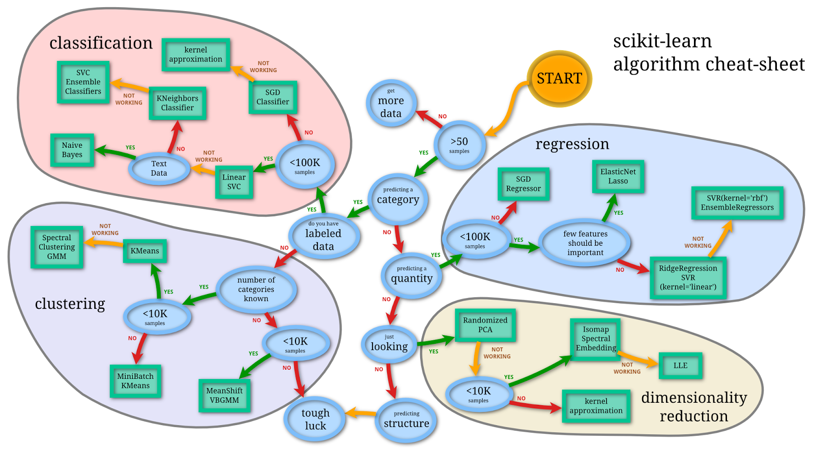

Suppose you have gene-expression profiles from a hundred tumour biopsies and a
hundred matched normal tissues, and a new, unlabelled sample arrives. Can you tell
whether it is tumour or normal from its expression pattern alone? Or imagine you
have DNA-methylation measurements from thousands of people of known age, and you
want to estimate the biological age of someone new. These are not problems you can
solve by sitting down and writing an explicit rule — there is no single gene, no
simple `if` statement, that separates tumour from normal across every patient. The
signal is spread across thousands of features in ways that are too subtle to
codify by hand.

**Machine learning** is the set of tools for exactly this situation: instead of
programming the rule yourself, you let an algorithm *learn* the rule from labelled
examples, then apply it to new cases it has never seen. That last part —
performing well on *new* data, not just the data you trained on — is the whole
point. It is called **generalization**, and most of this chapter is really about
how to get it and how to avoid fooling yourself into thinking you have it.

Machine learning in biology is a broad and fast-moving field. @greener_guide_2022
give an approachable overview of the methods used in biology, and
@libbrecht_machine_2015 review their early use in genetics and genomics. This
chapter is the conceptual on-ramp: what machine learning is, the three families of
problems it solves, the workflow you follow, and the single most important pitfall
(overfitting) to watch for. The chapters that follow put these ideas to work — a
[tour of supervised algorithms](models.qmd) on a shared dataset, the
[mlr3verse framework](mlr3verse_intro.qmd) for running them cleanly, and
worked biological examples — including the
[tumour-classification](ml_cancer.qmd) and
[age-from-methylation](ml_methylation_age.qmd) problems we just sketched.

## What you'll learn

- Recognize the three paradigms of machine learning — **supervised**,
  **unsupervised**, and **reinforcement** learning — and match a biological
  question to the right one.
- Distinguish **classification** (predicting a category) from **regression**
  (predicting a number) within supervised learning.
- Walk through the stages of a machine learning **workflow**, from problem
  definition to evaluation.
- Explain why you must **split your data** into training, validation, and test
  sets, and what each set is for.
- Recognize **overfitting** and **underfitting**, and describe how
  **cross-validation** and the **bias–variance tradeoff** help you steer between
  them.

## The three kinds of machine learning

Machine learning problems come in a few distinct flavours, and the first skill to
develop is recognizing which flavour you are facing. The flavour determines what
data you need and what kind of answer you can expect.

**Supervised learning** is the most common in practice, and it covers most of the
biological examples above. Here you have both the inputs (the **features** — gene
expression values, methylation levels, clinical measurements) *and* the correct
answers (the **labels** or **targets** — tumour vs normal, the patient's age) for
a set of training examples. The algorithm learns to map inputs to outputs by
studying these example pairs. Supervised problems split further into two types:

- **Classification** predicts a category. *Is this sample tumour or normal? Which
  of five cancer subtypes is this?* The answer is one of a fixed set of labels.
- **Regression** predicts a number. *What is this patient's age? What is the
  expression level of this gene?* The answer is a continuous value.

**Unsupervised learning** applies when you have the features but *no* labels — you
do not have a known answer to predict. Instead, the algorithm looks for structure
hidden in the data itself. **Clustering** groups similar samples together; you
might cluster single cells by their expression profiles to discover cell types
nobody labelled in advance. The [k-means clustering chapter](../kmeans.qmd) works
through a complete clustering example on real yeast gene-expression data.
**Dimensionality reduction** (like PCA) finds the few
underlying factors that explain most of the variation across thousands of genes.
These methods are often the first thing you reach for when you want to *explore* a
new dataset before you commit to a specific prediction.

**Reinforcement learning** is a different shape of problem altogether. Rather than
learning from a fixed pile of examples, an agent takes actions in an environment
and receives rewards or penalties, improving its decisions through trial and
error. It powers game-playing systems and robotics, and is appearing in areas like
experimental design and molecule generation, but it needs specialized techniques
and a lot of compute. We mention it for completeness; the rest of this part of the
book focuses on supervised and unsupervised learning, which cover the great
majority of everyday biological data analysis.

| Learning type | What you give it | What it gives back | Biological example |
|---------------|------------------|--------------------|--------------------|
| Supervised | Features **and** labels | Predicted labels/values | Tumour vs normal from expression; age from methylation |
| Unsupervised | Features only | Discovered structure | Clustering cells into types; PCA of samples |
| Reinforcement | An environment to act in | A decision policy | Sequential experiment design |

When thinking about machine learning, it can help to have a simple framework in
mind. @fig-sklearn shows a tidy view of the field from the
[scikit-learn](https://scikit-learn.org/stable/) project, organized around the
same questions: are you predicting a category, predicting a quantity, or looking
for structure?

{#fig-sklearn}

::: {.callout-note}
## Terminology and concepts

- Data
  : The foundation of machine learning. It can be structured (tabular) or
  unstructured (text, images, audio), and is usually divided into training,
  validation, and testing sets for model development and evaluation.

- Features
  : The variables or attributes used to describe each data point (for example,
  the expression level of each gene). Feature engineering and selection are
  crucial steps for improving model performance and interpretability.

- Models and algorithms
  : A model is a mathematical representation of the relationship between features
  and the target. An algorithm is the method used to fit a model to data, such as
  linear regression, decision trees, and neural networks.

- Hyperparameters and tuning
  : Hyperparameters are adjustable settings that control the learning process (for
  example, how deep a decision tree may grow). Tuning is the search for the values
  that give the best performance.

- Evaluation metrics
  : Numbers that quantify how well a model does — accuracy, precision, recall, and
  F1-score for classification; mean squared error and R-squared for regression.
:::

## The machine learning workflow

Successful machine learning projects follow a structured workflow. The process
begins long before any algorithm is trained and extends well beyond the first
model you fit.

::: {.callout-note}
## The workflow at a glance

1. **Problem definition** — state clearly what you want to predict and decide
   whether machine learning is even the right tool.
2. **Data collection and preparation** — gather relevant data and clean it into a
   form a model can use.
3. **Data splitting** — divide the data into training, validation, and test sets
   so you can evaluate honestly.
4. **Model selection** — choose an algorithm and configure its hyperparameters.
5. **Training** — fit the model to the training data so it can learn the patterns.
6. **Evaluation** — measure performance on held-out data using appropriate metrics.
7. **Deployment** — put the model to work on new, real data.
:::

The journey starts with **problem definition**. You need to articulate what you
are trying to achieve and whether machine learning is the appropriate solution.
Not every problem needs it; sometimes a simple statistical test or a known
biological rule gives a better answer with far less complexity.

**Data collection and preparation** usually consume most of the time in a real
project. Raw data rarely arrives ready to model. You will spend effort handling
missing values, encoding categorical variables, scaling numerical features, and
dealing with outliers and batch effects. The quality of this preparation often
decides whether the whole project succeeds.

**Data splitting** deserves special attention because it directly controls how
trustworthy your results are. The training set teaches the algorithm, but if you
then judge performance on that same data, you get a flattering picture that will
not hold up on new samples. It is like letting students see the exam questions
while they study, then grading them on those exact questions.

::: {.callout-important}
## Why splitting your data is non-negotiable

Splitting your data into separate sets is the foundation of honest evaluation, and
it is the single best defence against fooling yourself.

- **Training data** is used to fit the model's parameters.
- **Validation data** helps you choose between models and tune hyperparameters.
- **Test data** gives a final, unbiased estimate of performance on new data.

**The golden rule: never use the test data for any decision during model
development.** Reserve it for the final evaluation only.
:::

A common starting point is an 80% training / 20% testing split. For more involved
projects, a three-way split might use 60% for training, 20% for validation (model
selection), and 20% for final testing. Cross-validation, which we return to below,
offers a more data-efficient alternative while still keeping a test set untouched.

{#fig-train-validate-test fig-align="center"}

**Model selection** means choosing both the type of algorithm and its specific
settings. Different algorithms make different assumptions and shine in different
situations. Linear models work well when relationships are roughly linear and you
value interpretability. Tree-based methods handle nonlinear relationships and
interactions naturally but can overfit with limited data. Neural networks can
capture very complex patterns but need large datasets and careful tuning.
Hyperparameters describe the shape of the model — the depth of a decision tree,
the `k` in k-nearest neighbours, the learning rate in gradient descent — and
hyperparameter tuning is the search for good values, often using grid or random
search together with cross-validation.

**Training** is where the algorithm actually learns. The model adjusts its
internal parameters to reduce its errors on the training set. But the goal is not
a perfect score on the training data; a model that fits the training data too
closely often fails on new examples, a problem called **overfitting**.

**Evaluation** tells you whether the model is ready. This means looking past a
single accuracy number — precision, recall, and F1-score for classification, or
mean squared error and R-squared for regression — and checking that performance
holds up across the different subgroups in your data.

## Overfitting and underfitting

Recall that the goal is a model that generalizes well to new, unseen data. Given
enough flexibility, almost any model can fit the data it was trained on perfectly.
The real challenge is balancing a good fit on the training data against good
performance on *new examples* — and it is that second part, generalization, that
we actually care about.

When a model **overfits**, it learns the training data too well, memorizing the
specific examples instead of the general pattern. The result is excellent
performance on training data and poor performance on anything new.

A familiar analogy: imagine teaching someone to recognize cats by showing them 100
photos. An overfitted learner memorizes every pixel of those particular photos
rather than learning the general features — whiskers, pointed ears, fur. Shown a
new cat, they are lost, because they fixated on details unique to the training
images. The genomics version is the same story: a model that learns to separate
your 200 tumour and normal samples by latching onto a few quirks of *those* 200
patients (or a batch effect in *that* sequencing run) will collapse the moment you
hand it samples from a new hospital.

**Underfitting** is the opposite failure. An underfitted model is too simple to
capture the real pattern, so it does poorly on both training and new data. In the
cat analogy, an underfitted model might only look at overall image brightness and
miss every feature that actually distinguishes a cat.

```{r fig-fitting, fig.cap="Data simulated according to the function $f(x) = sin(2 \\pi x) + N(0,0.25)$ fitted with four different models. A) A simple linear model demonstrates _underfitting_. B) A linear model with a sin term ($y = sin(2 \\pi x)$) and C) a loess model with a wide span (0.5) demonstrate _good fits_. D) A loess model with a narrow span (0.05) is a good example of _overfitting_."}
#| code-fold: true
set.seed(123)
sinsim <- function(n, sd = 0.1) {
  x <- seq(0, 1, length.out = n)
  y <- sin(2 * pi * x) + rnorm(n, 0, sd)
  return(data.frame(x = x, y = y))
}
dat <- sinsim(100, 0.25)
library(ggplot2)
library(patchwork)
p_base <- ggplot(dat, aes(x = x, y = y)) +
  geom_point(alpha = 0.7) +
  theme_bw()
p_lm <- p_base +
  geom_smooth(method = "lm", se = FALSE, alpha = 0.6, formula = y ~ x)
p_lmsin <- p_base +
  geom_smooth(method = "lm", formula = y ~ sin(2 * pi * x), se = FALSE, alpha = 0.6)
p_loess_wide <- p_base +
  geom_smooth(method = "loess", span = 0.5, se = FALSE, alpha = 0.6, formula = y ~ x)
p_loess_narrow <- p_base +
  geom_smooth(method = "loess", span = 0.05, se = FALSE, alpha = 0.6, formula = y ~ x)
p_lm + p_lmsin + p_loess_wide + p_loess_narrow + plot_layout(ncol = 2) +
  plot_annotation(tag_levels = "A") &
  theme(plot.tag = element_text(size = 8))
```

In @fig-fitting we simulate data from the function $f(x) = sin(2 \pi x) + N(0,0.25)$
and fit four models of increasing flexibility. A model that is too simple (A)
**underfits**: the straight line cannot follow the wave at all. A model that is too
flexible (D) **overfits**: the narrow-span loess curve chases every wiggle of the
random noise instead of the smooth trend beneath it. Models (B) and (C) sit in the
sweet spot — flexible enough to capture the real pattern, restrained enough to
ignore the noise.

The relationship between model complexity and performance tends to follow a U
shape. Very simple models do badly because they underfit. As you add complexity,
performance improves as the model captures more of the real signal. But past an
optimal point, extra complexity starts fitting noise, and performance on new data
gets worse again.

::: {.callout-tip}
## Detecting overfitting

Overfitting shows up as a widening gap between training and validation
performance. If your model scores 95% accuracy on training data but only 70% on
validation data, it is almost certainly overfitting.

Watch both numbers throughout development. The best models perform *similarly* on
training and validation data — a sign they have learned the pattern, not the
particular examples.
:::

Several strategies push back against overfitting. **Regularization** adds a penalty
for complexity, nudging the model toward simpler solutions. **Cross-validation**
(next section) gives more reliable performance estimates by validating on several
data splits. **Early stopping** halts training once validation performance starts
to slip. **Feature selection** trims the input down to the variables that actually
matter — often crucial in genomics, where you may start with tens of thousands of
genes.

The **bias–variance tradeoff** is the theory behind all of this. *Bias* is
systematic error from a model that is too simple to capture the truth. *Variance*
is sensitivity to the particular training sample you happened to draw. High-bias
models underfit; high-variance models overfit. The model that generalizes best is
the one that balances these two competing sources of error.

## Cross-validation and model selection

Cross-validation answers a practical question: how do you reliably estimate a
model's performance when you only have so much data? A single train–test split can
mislead you, especially with small datasets, because the estimate depends heavily
on which samples happen to land in which set.

**K-fold cross-validation** is the standard fix. You split the training data into
*k* equal parts (folds). You then train the model *k* times; each time, one fold
is held out for validation and the other *k* − 1 are used for training. Averaging
the *k* resulting scores gives a much steadier estimate of model quality than any
single split.

Five-fold and ten-fold cross-validation are the usual choices, trading off
computation against reliability. *Leave-one-out* cross-validation is the extreme
case where *k* equals the number of training examples — it uses the data maximally
but can be slow and, for some models, overly optimistic.

A couple of biological wrinkles are worth flagging. **Stratified** cross-validation
keeps the same proportion of each class in every fold, which matters whenever your
classes are imbalanced — say, many more normal samples than tumours. And when
samples are *not* independent — repeated measures from the same patient, or cells
from the same donor — you must keep related samples together in the same fold, or
the model can "peek" and your estimate becomes too rosy.

Cross-validation does triple duty: it helps you pick the best algorithm from a set
of candidates, tune hyperparameters within an algorithm, and estimate realistic
performance on new data. But remember the golden rule from earlier — every one of
those cross-validation results still comes from the *training* data. The final
verdict always comes from a completely separate test set.

## Exercises

These are concept-checking exercises; no coding required. Try each one before
opening the solution.

1. **Name the paradigm and the task.** For each scenario, say whether it is
   supervised, unsupervised, or reinforcement learning. If it is supervised, say
   whether it is classification or regression.

   a. You have RNA-seq profiles from 300 breast-tumour samples, each labelled with
      one of four molecular subtypes, and you want to assign subtypes to new tumours.
   b. You have DNA-methylation profiles from 1,000 people of known chronological
      age, and you want to predict the age of a new person.
   c. You have single-cell expression profiles from a tissue with no prior labels,
      and you want to discover how many distinct cell populations are present.

   ::: {.callout-note collapse="true"}
   ## Solution

   a. **Supervised, classification** — the answer is one of a fixed set of
      categories (the four subtypes).
   b. **Supervised, regression** — age is a continuous number.
   c. **Unsupervised** (clustering) — there are no labels to predict; you are
      discovering structure in the data.
   :::

2. **Spot the leakage.** A colleague reports 99% accuracy classifying tumour vs
   normal. You discover they tuned the model and reported accuracy on the *same*
   set of samples. What is wrong, and what should they have done instead?

   ::: {.callout-note collapse="true"}
   ## Solution

   They evaluated on data the model had already seen during development, so the 99%
   is optimistic and will not hold on new samples — exactly the "exam questions seen
   while studying" trap. They should have held out a **test set** that played no
   role in training or tuning, and reported accuracy on that. Cross-validation on
   the training portion could guide the tuning, but the final number must come from
   the untouched test set.
   :::

3. **Underfit or overfit?** During development you see 98% accuracy on the training
   data but only 62% on the validation data. Is this underfitting or overfitting?
   Name one thing you could try.

   ::: {.callout-note collapse="true"}
   ## Solution

   This large train-versus-validation gap is the signature of **overfitting**: the
   model has learned the training examples rather than the general pattern. You
   could add **regularization**, **select fewer features**, choose a simpler model,
   or gather more training data. (Underfitting would instead show *poor* scores on
   *both* sets.)
   :::

4. **Why fold at all?** You have only 80 labelled samples. Why might five-fold
   cross-validation give you a more trustworthy performance estimate than a single
   80/20 train–test split?

   ::: {.callout-note collapse="true"}
   ## Solution

   With only 80 samples, a single test set of 16 is small, and its score depends
   heavily on which samples happen to land in it. Five-fold cross-validation lets
   *every* sample serve as validation data exactly once and averages five
   estimates, giving a steadier, less luck-dependent picture of how the model
   performs.
   :::

## Summary

You can now place a biological question into the right machine-learning family —
**supervised** when you have labelled examples to predict from (and within that,
**classification** for categories, **regression** for numbers), **unsupervised**
when you are exploring unlabelled data for structure, and **reinforcement** for
learning by interaction. You have walked the **workflow** from problem definition
through data preparation, splitting, model selection, training, and evaluation,
and you understand why the **test set** must stay untouched until the very end. You
can recognize **overfitting** and **underfitting**, read them off the gap between
training and validation scores, and explain how **cross-validation** and the
**bias–variance tradeoff** help you find the model that generalizes.

With these concepts in hand, you are ready for the [tour of supervised
algorithms](models.qmd), where each of these ideas becomes runnable R code on real
biological data.
