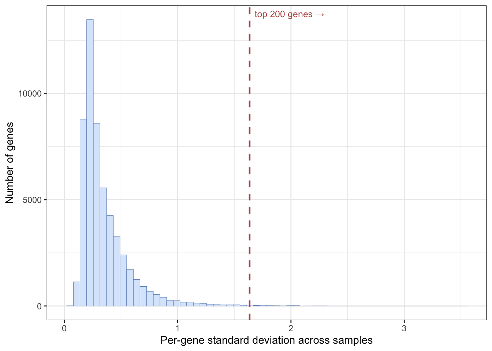
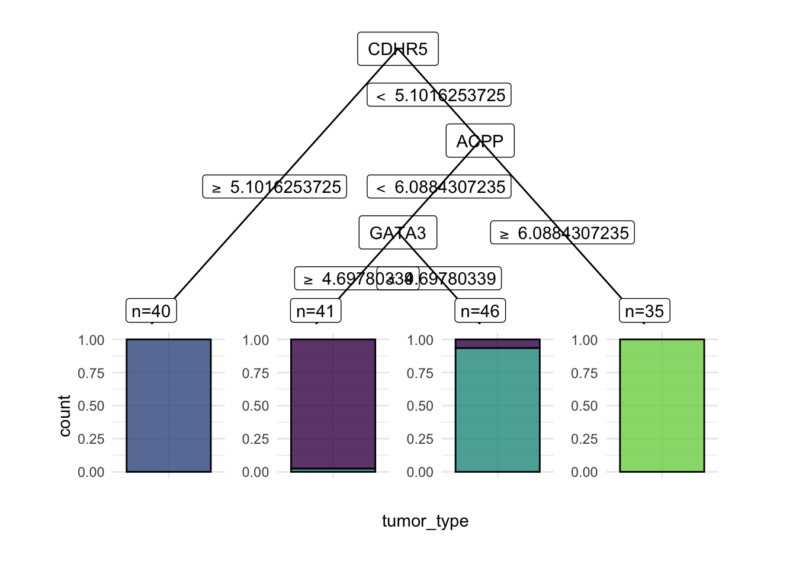

# 27  Worked example: classifying cancer types from gene expression

Code

Author

Affiliation

[Sean Davis](https://seandavi.github.io/) [](mailto:seandavi@gmail.com)

[University of Colorado  
Anschutz School of Medicine](https://medschool.cuanschutz.edu/)

Published

June 1, 2024

Modified

September 19, 2026

The earlier machine learning chapters introduced the *ideas*: the difference between supervised and unsupervised learning ([Introduction](../machine_learning/intro.llms.md)), the workhorse algorithms ([Supervised Learning](../machine_learning/models.llms.md)), and the `mlr3` framework that wraps all of them in one tidy interface ([The mlr3verse](../machine_learning/mlr3verse_intro.llms.md)). This is the first of three chapters where those ideas meet real data.

Here we tackle a **classification** problem: given a tumour’s gene-expression profile, can we predict which **cancer type** it is? This is the first of three worked examples — the next two predict age from DNA methylation and gene expression from histone marks — and because it comes first, it also lays down the habits the others reuse: how to set up an `mlr3` analysis, how to split the data, how to select features, and how to read the results without fooling yourself.

Three ideas from the [introduction](../machine_learning/intro.llms.md) do the heavy lifting in every one of these examples, so it is worth stating them plainly here, in the concrete terms of gene-expression classification:

- **Feature selection.** A tumour profile measures tens of thousands of genes, but most of them barely change from one sample to the next. A gene that stays flat across every tumour cannot help tell cancer types apart — it is noise. So we *select* the genes that vary the most and discard the rest, shrinking the problem to the handful of features that actually carry signal.
- **The train/test split.** We hold back a slice of tumours that the model never sees while it learns. Scoring it on those unseen tumours is the only honest estimate of how it will classify a *new* patient’s biopsy — the thing we actually care about.
- **Overfitting.** A model given too much freedom — a decision tree grown too deep, say — can memorize the exact training tumours instead of learning a rule that generalizes. We catch this by watching the gap between the training score and the test score.

The next two chapters revisit all three from different biological angles; this is where we meet them as first principles.

> **NOTE:**
>
> Feature selection, an honest train/test split, and vigilance against overfitting are the spine of every worked example. Here they take their plainest form: keep the most variable genes, hold out some tumours, and distrust a model that aces the training set but stumbles on the test set. Hold on to this picture — the methylation and histone-mark chapters return to each idea and add a new twist.

## 27.1 What you’ll learn

- Turn a real genomics dataset into an `mlr3` **task** with [`as_task_classif()`](https://mlr3.mlr-org.com/reference/as_task_classif.html).
- **Split** data into training and test sets, and explain why that split protects you from fooling yourself.
- **Select features** by variance, and say why selection must happen on the training data only.
- **Train and predict** with several learners — kNN, a classification tree, and a random forest — using the same handful of `mlr3` calls.
- **Interpret** a confusion matrix and an accuracy, and recognize overfitting when the test score falls below the training score.

## 27.2 A quick recap of the mlr3 workflow

You met the `mlr3` building blocks in [The mlr3verse](../machine_learning/mlr3verse_intro.llms.md); here is the one-paragraph reminder so you can keep your eyes on the biology. Every analysis in these worked-example chapters follows the same four-step rhythm ([Figure fig-mlr3-objects](#fig-mlr3-objects)):

1.  **Task** — bundle your data with the name of the column you want to predict (the *target*). Classification tasks predict a category; regression tasks predict a number.
2.  **Learner** — pick an algorithm by name with [`lrn()`](https://mlr3.mlr-org.com/reference/mlr_sugar.html), e.g. `lrn("classif.kknn")`.
3.  **Train and predict** — call `learner$train(task, ...)` then `learner$predict(task, ...)`.
4.  **Measure** — score the predictions with [`msrs()`](https://mlr3.mlr-org.com/reference/mlr_sugar.html), e.g. accuracy for classification or R² for regression.

[](../images/mlr3_objects.png "Figure 27.1: The four mlr3 building blocks and how they fit together. A Learner (the algorithm) trains on a Task (the data plus the target column), the fitted model makes predictions on held-out samples, and a Measure scores them. A Resampling strategy wraps the whole flow, repeating it over different train/validation splits so the score reflects performance on data the model never saw. Swapping one algorithm for another changes only the Learner — every other block stays the same.")

Figure 27.1: The four mlr3 building blocks and how they fit together. A **Learner** (the algorithm) trains on a **Task** (the data plus the target column), the fitted model makes **predictions** on held-out samples, and a **Measure** scores them. A **Resampling** strategy wraps the whole flow, repeating it over different train/validation splits so the score reflects performance on data the model never saw. Swapping one algorithm for another changes only the Learner — every other block stays the same.

The power of `mlr3` is that this rhythm is *identical* no matter which algorithm you use. Swapping a k-nearest-neighbours model for a random forest is a one-line change to the [`lrn()`](https://mlr3.mlr-org.com/reference/mlr_sugar.html) call; everything else stays the same. For the full tour of tasks, learners, measures, and resamplings, see [The mlr3verse](../machine_learning/mlr3verse_intro.llms.md); the official [mlr3 book](https://mlr3book.mlr-org.com/) is the deep reference.

> **IMPORTANT:**
>
> A model that is *tested* on the same data it was *trained* on will look far better than it really is — it can simply memorize the answers. We always hold out a **test set** that the model never sees during training, and we report performance from that held-out set. This is the only honest estimate of how the model will behave on new patients or new genes.

## 27.3 Setup

``` downlit
library(mlr3verse)
library(GEOquery)
library(mlr3learners) # for knn
library(ranger)       # for random forests
set.seed(789)
```

## 27.4 Understanding the problem

In this example we classify **cancer types** from gene-expression data. The data come from Brouwer-Visser et al. ([2018](#ref-brouwer-visser_regulatory_2018)), available through the Gene Expression Omnibus (GEO), a public repository of functional-genomics data. The study profiled gene expression in tumours of several types, and our question is: **given a tumour’s expression profile, can we predict which cancer type it is?**

Before building anything, it pays to answer four questions about the task:

- **What are the features?** The expression level of each gene.
- **What is the target?** The cancer type (a category).
- **What kind of task is this?** Classification — we are predicting a label, not a number.
- **What is the goal?** A model that assigns the correct cancer type to a tumour it has never seen.

## 27.5 Data preparation

We use the `GEOquery` package to fetch dataset [GSE103512](https://www.ncbi.nlm.nih.gov/geo/query/acc.cgi?acc=GSE103512). This downloads over the network, so give it a moment.

``` downlit
gse <- getGEO("GSE103512")[[1]]
```

`GEOquery` was written in 2007 and returns an older Bioconductor structure, the `ExpressionSet`. As a first housekeeping step we convert it to the modern `SummarizedExperiment` (covered in the [SummarizedExperiment chapter](../bioc-summarizedexperiment.llms.md)).

``` downlit
library(SummarizedExperiment)
se <- as(gse, "SummarizedExperiment")
```

Let’s look at two variables of interest: the cancer type and whether each sample is tumour or normal tissue.

``` downlit
with(colData(se), table(`cancer.type.ch1`, `normal.ch1`))
```

                   normal.ch1
    cancer.type.ch1 no yes
              BC    65  10
              CRC   57  12
              NSCLC 60   9
              PCA   60   7

This table tells us how many samples we have of each cancer type, split by tumour versus normal status. Most samples are tumours (`normal: no`), with a smaller set of matched normal tissues. We’ll keep only the tumour samples for classification.

> **TIP:**
>
> Missing values, outliers, and unexpected categories can quietly break a machine learning model. Plots, summaries, PCA, and clustering all help you understand the data first. Time spent here saves time later — and saves you from confidently reporting a result that was an artifact all along.

## 27.6 Feature selection and data cleaning

This dataset measures *thousands* of genes, but most of them barely change between samples and carry little signal. We will keep the 200 genes with the **highest variance** across samples, on the reasoning that a gene that never changes can’t help us tell cancer types apart. (Other selection strategies exist, such as ranking genes by their correlation with the outcome.)

> **IMPORTANT:**
>
> In a fully rigorous workflow, feature selection must use the **training data only** — never the test data. If you peek at the test data while choosing features, information leaks across the split and your test score is no longer honest. (For simplicity this example selects on the full matrix; in a real analysis, fold the selection step inside the training split.)

The [`apply()`](https://rdrr.io/r/base/apply.html) function applies a function to each row or column of a matrix. Here we apply [`sd()`](https://rdrr.io/r/stats/sd.html) (standard deviation) to each row of the expression matrix to get a vector of per-gene variability, then keep the 200 most variable genes among the tumour samples.

``` downlit
sds <- apply(assay(se, 'exprs'), 1, sd)
## keep the 200 most-variable genes, tumour samples only
se_small <- se[order(sds, decreasing = TRUE)[1:200],
               colData(se)$characteristics_ch1.1 == 'normal: no']
# remove genes with no gene symbol
se_small <- se_small[rowData(se_small)$Gene.Symbol != '', ]
```

Plotting that vector of per-gene variability shows why such an aggressive cut is reasonable ([Figure fig-gene-variance](#fig-gene-variance)): the great majority of genes barely vary from sample to sample (the tall spike on the left), and only a thin tail of genes carry real variation. Keeping the 200 most variable genes means keeping just the right edge of that tail.

``` downlit
library(ggplot2)
cutoff <- sort(sds, decreasing = TRUE)[200]
ggplot(data.frame(sd = sds), aes(sd)) +
  geom_histogram(bins = 60, fill = "#dae8fc", colour = "#6c8ebf", linewidth = 0.2) +
  geom_vline(xintercept = cutoff, linetype = "dashed", colour = "#b85450", linewidth = 0.8) +
  annotate("text", x = cutoff, y = Inf, label = "  top 200 genes →", hjust = 0, vjust = 1.8,
           colour = "#b85450", size = 3.3) +
  labs(x = "Per-gene standard deviation across samples", y = "Number of genes") +
  theme_bw()
```

[](ml_cancer_files/figure-html/fig-gene-variance-1.png "Figure 27.2: How variable is each gene across the samples? The histogram shows the standard deviation of every gene’s expression. Most genes pile up at low variability (left) — they hardly change between tumours, so they cannot help tell cancer types apart. A small minority, in the long right tail, vary a lot. The dashed line is the cutoff for the 200 most-variable genes; we keep only the genes to its right and discard the rest as uninformative.")

Figure 27.2: How variable is each gene across the samples? The histogram shows the standard deviation of every gene’s expression. Most genes pile up at low variability (left) — they hardly change between tumours, so they cannot help tell cancer types apart. A small minority, in the long right tail, vary a lot. The dashed line is the cutoff for the 200 most-variable genes; we keep only the genes to its right and discard the rest as uninformative.

To make the data easier to work with, we use one of the `rowData` columns (the gene symbol) as the row names. [`make.names()`](https://rdrr.io/r/base/make.names.html) ensures those names are valid, unique R variable names.

``` downlit
## convert to a matrix for later use
expr_mat <- assay(se_small, 'exprs')
rownames(expr_mat) <- make.names(rowData(se_small)$Gene.Symbol)
```

`mlr3` expects samples in rows and features in columns, so we **transpose** the matrix and attach the cancer type as a column.

``` downlit
feat_dat <- t(expr_mat)
tumor <- data.frame(tumor_type = colData(se_small)$cancer.type.ch1, feat_dat)
```

This is another good moment to check the data: confirm the dimensions, the column names, and the data types are what you expect before moving on.

## 27.7 Creating the task

The first `mlr3` step is to create a **task** — a dataset paired with the name of the target column. Because the target (cancer type) is a category, this is a *classification* task, so we use [`as_task_classif()`](https://mlr3.mlr-org.com/reference/as_task_classif.html). The target must be a factor.

``` downlit
tumor$tumor_type <- as.factor(tumor$tumor_type)
task <- as_task_classif(tumor, target = 'tumor_type')
```

## 27.8 Splitting the data

We randomly assign two-thirds of the samples to a **training set** and one-third to a **test set**. The model learns from the training set; we judge it on the test set it never saw. We seed the split so the result is reproducible.

``` downlit
set.seed(7)
train_set <- sample(task$row_ids, 0.67 * task$nrow)
test_set <- setdiff(task$row_ids, train_set)
```

In the next sections we train three different learners on this task — k-nearest-neighbours, a classification tree, and a random forest — and compare how each one does at predicting cancer type.

## 27.9 k-nearest-neighbours

The first learner is **k-nearest-neighbours** (kNN). Its idea is simple: a new sample is classified by looking at the *k* most similar samples and taking a vote. The number of neighbours, *k*, is a tunable setting; we’ll use the default of 7. (`mlr3` can tune such settings automatically, but that’s beyond this chapter.)

### 27.9.1 Create the learner

In `mlr3` an algorithm is a **learner**, created with [`lrn()`](https://mlr3.mlr-org.com/reference/mlr_sugar.html) by name.

``` downlit
learner <- lrn("classif.kknn")
```

Calling [`lrn()`](https://mlr3.mlr-org.com/reference/mlr_sugar.html) with no arguments lists every available learner.

``` downlit
lrn()
```

    <DictionaryLearner> with 55 stored values
    Keys: classif.cv_glmnet, classif.debug, classif.featureless,
      classif.glmnet, classif.kknn, classif.lda, classif.log_reg,
      classif.multinom, classif.naive_bayes, classif.nnet, classif.qda,
      classif.ranger, classif.rpart, classif.svm, classif.xgboost,
      clust.agnes, clust.ap, clust.bico, clust.birch, clust.clara,
      clust.cmeans, clust.cobweb, clust.dbscan, clust.dbscan_fpc,
      clust.diana, clust.em, clust.fanny, clust.featureless, clust.ff,
      clust.hclust, clust.hdbscan, clust.kkmeans, clust.kmeans,
      clust.kproto, clust.MBatchKMeans, clust.mclust, clust.meanshift,
      clust.optics, clust.pam, clust.protoclust, clust.SimpleKMeans,
      clust.specc, clust.xmeans, regr.cv_glmnet, regr.debug,
      regr.featureless, regr.glmnet, regr.kknn, regr.km, regr.lm,
      regr.nnet, regr.ranger, regr.rpart, regr.svm, regr.xgboost

### 27.9.2 Train

`learner$train()` takes the task and the row IDs of the training data.

``` downlit
learner$train(task, row_ids = train_set)
```

We *could* inspect the trained model, but for kNN the printout is large, so this chunk is left for you to run on your own.

``` downlit
# output is large, so do this on your own
learner$model
```

### 27.9.3 Predict

Let’s first predict the classes of the **training** data. We already know those answers, but predicting on the training set gives us a baseline we can compare against the test set to detect overfitting.

``` downlit
pred_train <- learner$predict(task, row_ids = train_set)
```

And now the **test** data — the honest evaluation:

``` downlit
pred_test <- learner$predict(task, row_ids = test_set)
```

### 27.9.4 Assess

A **confusion matrix** cross-tabulates the true class (rows) against the predicted class (columns). Correct predictions land on the diagonal; off-diagonal entries are mistakes.

``` downlit
pred_train$confusion
```

            truth
    response BC CRC NSCLC PCA
       BC    42   0     0   0
       CRC    0  40     0   0
       NSCLC  1   0    44   0
       PCA    0   0     0  35

On the training data, almost every sample falls on the diagonal — the model classifies the data it learned from very well, as expected.

Accuracy summarizes this in one number: the fraction of samples classified correctly.

``` downlit
measures <- msrs(c('classif.acc'))
pred_train$score(measures)
```

    classif.acc 
      0.9938272 

Now the test set, which the model never saw during training:

``` downlit
pred_test$confusion
```

            truth
    response BC CRC NSCLC PCA
       BC    22   0     0   0
       CRC    0  17     1   0
       NSCLC  0   0    15   0
       PCA    0   0     0  25

``` downlit
pred_test$score(measures)
```

    classif.acc 
         0.9875 

The test accuracy is the number to trust. If it is noticeably lower than the training accuracy, the model has *overfit* — it memorized the training samples rather than learning a rule that generalizes. Compare the two numbers above: how big is the gap?

## 27.10 Classification tree

A **classification tree** asks a series of yes/no questions about the features — for example, “is gene *X* expressed above some threshold?” — and follows the answers down branches to a predicted class. At each split it picks the feature that best separates the classes, and it keeps splitting until the groups are reasonably pure. Trees are appealing because you can *read* them.

### 27.10.1 Train

We set `keep_model = TRUE` so we can inspect the fitted tree afterwards.

``` downlit
learner <- lrn("classif.rpart", keep_model = TRUE)
learner$train(task, row_ids = train_set)
```

Here is the trained model:

``` downlit
learner$model
```

    n= 162 

    node), split, n, loss, yval, (yprob)
          * denotes terminal node

     1) root 162 118 NSCLC (0.26543210 0.24691358 0.27160494 0.21604938)  
       2) CDHR5>=5.101625 40   0 CRC (0.00000000 1.00000000 0.00000000 0.00000000) *
       3) CDHR5< 5.101625 122  78 NSCLC (0.35245902 0.00000000 0.36065574 0.28688525)  
         6) ACPP< 6.088431 87  43 NSCLC (0.49425287 0.00000000 0.50574713 0.00000000)  
          12) GATA3>=4.697803 41   1 BC (0.97560976 0.00000000 0.02439024 0.00000000) *
          13) GATA3< 4.697803 46   3 NSCLC (0.06521739 0.00000000 0.93478261 0.00000000) *
         7) ACPP>=6.088431 35   0 PCA (0.00000000 0.00000000 0.00000000 1.00000000) *

Trees are easy to visualize when they are small. This one has only a couple of splits, which makes the decision logic easy to follow.

``` downlit
library(mlr3viz)
library(ggparty)
```

    Loading required package: partykit

    Loading required package: grid

    Loading required package: libcoin

    Loading required package: mvtnorm


    Attaching package: 'partykit'

    The following object is masked from 'package:SummarizedExperiment':

        width

    The following object is masked from 'package:GenomicRanges':

        width

    The following object is masked from 'package:IRanges':

        width

    The following object is masked from 'package:S4Vectors':

        width

    The following object is masked from 'package:BiocGenerics':

        width

``` downlit
autoplot(learner, type = 'ggparty')
```

    Warning in ggparty::geom_edge_label(): Ignoring unknown parameters:
    `label.size`

[](ml_cancer_files/figure-html/fig-tree-cancer-1.png "Figure 27.3: The fitted classification tree. Each internal node tests whether one gene’s expression lies above or below a learned threshold; following the branches that match a tumour leads to a leaf that predicts its cancer type, with the bar showing the class mix of training samples that reached that leaf. Because this tree has only a couple of splits, the rule it learned is easy to read — a handful of marker genes separate most of the cancer types.")

Figure 27.3: The fitted classification tree. Each internal node tests whether one gene’s expression lies above or below a learned threshold; following the branches that match a tumour leads to a leaf that predicts its cancer type, with the bar showing the class mix of training samples that reached that leaf. Because this tree has only a couple of splits, the rule it learned is easy to read — a handful of marker genes separate most of the cancer types.

### 27.10.2 Predict

As before, we predict on both the training and test sets.

``` downlit
pred_train <- learner$predict(task, row_ids = train_set)
pred_test <- learner$predict(task, row_ids = test_set)
```

### 27.10.3 Assess

> **IMPORTANT:**
>
> Performance should **always** be reported from an independent test set, never from the training set.

``` downlit
pred_train$confusion
```

            truth
    response BC CRC NSCLC PCA
       BC    40   0     1   0
       CRC    0  40     0   0
       NSCLC  3   0    43   0
       PCA    0   0     0  35

``` downlit
measures <- msrs(c('classif.acc'))
pred_train$score(measures)
```

    classif.acc 
      0.9753086 

``` downlit
pred_test$confusion
```

            truth
    response BC CRC NSCLC PCA
       BC    20   0     1   0
       CRC    0  17     3   0
       NSCLC  2   0    12   0
       PCA    0   0     0  25

``` downlit
pred_test$score(measures)
```

    classif.acc 
          0.925 

A single tree is a simple model, so it often classifies the training data less perfectly than kNN did, but it may *generalize* about as well to the test set. Look at the test accuracy and the test confusion matrix: which cancer types does the tree confuse with each other?

> **TIP:**
>
> When the test score is much worse than the training score, the model is likely **overfit** — it has learned the training data’s quirks rather than a general rule. How you fix overfitting depends on the model (simpler trees, more regularization, more data), but a large train/test gap is always a signal to look more carefully at model choice and settings.

## 27.11 Random forest

A **random forest** grows many decision trees, each on a random subset of the data and features, and averages their votes. Because the trees disagree in different ways, their combined prediction is usually more accurate and more stable than any single tree. We set `importance = "impurity"` so the model also reports how useful each gene was.

### 27.11.1 Train

``` downlit
set.seed(789)
learner <- lrn("classif.ranger", importance = "impurity")
learner$train(task, row_ids = train_set)
```

We can look at the fitted forest:

``` downlit
learner$model
```

    Ranger result

    Call:
     ranger::ranger(dependent.variable.name = task$target_names, data = task$data(),      probability = self$predict_type == "prob", importance = "impurity",      num.threads = 1L) 

    Type:                             Classification 
    Number of trees:                  500 
    Sample size:                      162 
    Number of independent variables:  192 
    Mtry:                             13 
    Target node size:                 1 
    Variable importance mode:         impurity 
    Splitrule:                        gini 
    OOB prediction error:             0.00 % 

The printout reports an **OOB (out-of-bag) error**. Because each tree is trained on a bootstrap sample, the samples it *didn’t* see act as a free held-out set; the OOB error estimates test performance without needing a separate split. A low OOB error is a good sign.

Random forests also give us a **variable importance** score — roughly, how often and how usefully each gene was used across the trees.

``` downlit
head(learner$importance(), 15)
```

     TRPS1.1    CDHR5    FABP1    SFTPB    EFHD1   EPS8L3    KRT20    TRPS1 
    4.475378 3.813032 3.397017 3.279971 3.266162 3.195407 2.926891 2.909217 
      LGALS4    MUC12    GATA3   TSPAN8    AZGP1  SFTPB.1     MUC2 
    2.902600 2.701676 2.583133 2.506220 2.492607 2.283966 2.222415 

The most important genes here are the ones the forest leaned on most heavily to separate the cancer types. It’s worth looking a few of them up to see whether they make biological sense — and comparing them to the gene the single tree split on.

### 27.11.2 Predict and assess

``` downlit
pred_train <- learner$predict(task, row_ids = train_set)
pred_test <- learner$predict(task, row_ids = test_set)
```

``` downlit
pred_train$confusion
```

            truth
    response BC CRC NSCLC PCA
       BC    43   0     0   0
       CRC    0  40     0   0
       NSCLC  0   0    44   0
       PCA    0   0     0  35

``` downlit
measures <- msrs(c('classif.acc'))
pred_train$score(measures)
```

    classif.acc 
              1 

``` downlit
pred_test$confusion
```

            truth
    response BC CRC NSCLC PCA
       BC    22   0     0   0
       CRC    0  17     1   0
       NSCLC  0   0    15   0
       PCA    0   0     0  25

``` downlit
pred_test$score(measures)
```

    classif.acc 
         0.9875 

Compare all three test accuracies — kNN, the single tree, and the random forest. On most genomics classification problems the random forest is the strongest of the three, and it gives you the importance ranking as a bonus.

## 27.12 Summary

You have now run a complete classification analysis on real gene-expression data, all through the `mlr3` workflow:

- You turned a GEO dataset into an `mlr3` classification **task**, **split** it into training and test sets, and **selected** the 200 most-variable genes as features.
- You trained three learners — kNN, a single classification tree, and a random forest — and read each one’s **confusion matrix** and **accuracy**.
- On most genomics classification problems the random forest is the strongest of the three, and it hands you a gene-importance ranking for free.

The disciplines you practised here recur in every analysis: **split** the data, **select features** thoughtfully, **train then predict**, and judge every model by its **test-set** score. That last habit — never trusting the training score — is the single most important thing to carry forward to the next two chapters.

## 27.13 Exercises

Each exercise reuses objects you already built, so the solutions are quick to run.

1.  **Swap a learner.** The random forest above used impurity-based importance. Train a **support vector machine** instead and compare its test accuracy to the random forest. (You may need [`library(e1071)`](https://rdrr.io/r/base/library.html); if it isn’t installed, fall back to comparing kNN with a different `k`.)

    > **NOTE:**
    > ``` downlit
    > svm_learner <- lrn("classif.svm")
    > svm_learner$train(task, row_ids = train_set)
    > svm_pred <- svm_learner$predict(task, row_ids = test_set)
    > svm_pred$score(msrs(c('classif.acc')))
    > ```
    >
    > The point is that swapping algorithms is a one-line change to [`lrn()`](https://mlr3.mlr-org.com/reference/mlr_sugar.html) — everything else in the workflow is identical. Compare the test accuracy to the forest’s; on this small, high-variance dataset the ranking can shift, which is why you always judge on the held-out test set.

2.  **Change the feature-selection cutoff.** We kept the 200 most-variable genes. Conceptually, what would you expect to happen to the random forest’s test accuracy if you kept only the top 50, or the top 1000?

    > **NOTE:**
    > Too few features (top 50) may discard genes that help separate the rarer cancer types, lowering accuracy. Too many (top 1000) reintroduces low-variance, low-signal genes that add noise and computation without much benefit — and they raise the risk of overfitting. The “right” cutoff is a balance, best chosen by comparing test-set performance across a few values rather than guessing.

Brouwer-Visser, Jurriaan, Wei-Yi Cheng, Anna Bauer-Mehren, et al. 2018. “Regulatory T-Cell Genes Drive Altered Immune Microenvironment in Adult Solid Cancers and Allow for Immune Contextual Patient Subtyping.” *Cancer Epidemiology, Biomarkers & Prevention* 27 (1): 103–12. <https://doi.org/10.1158/1055-9965.EPI-17-0461>.
