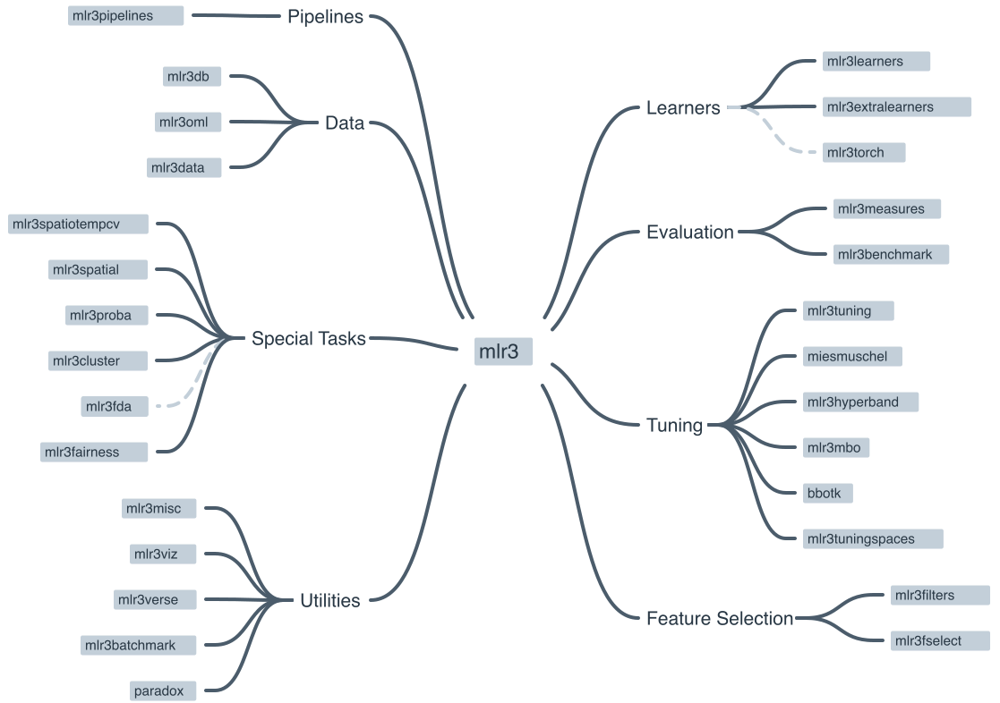

The earlier machine learning chapters introduced the *ideas*: the difference
between supervised and unsupervised learning ([Introduction](intro.qmd)), the
workhorse algorithms ([Supervised Learning](models.qmd)), and the `mlr3`
framework that wraps all of them in one tidy interface
([The mlr3verse](mlr3verse_intro.qmd)). This is the first of three chapters where
those ideas meet real data.

Here we tackle a **classification** problem: given a tumour's gene-expression
profile, can we predict which **cancer type** it is? This is the first of three
worked examples — the next two predict age from DNA methylation and gene
expression from histone marks — and because it comes first, it also lays down the
habits the others reuse: how to set up an `mlr3` analysis, how to split the data,
how to select features, and how to read the results without fooling yourself.

Three ideas from the [introduction](intro.qmd) do the heavy lifting in every one
of these examples, so it is worth stating them plainly here, in the concrete terms
of gene-expression classification:

- **Feature selection.** A tumour profile measures tens of thousands of genes, but
  most of them barely change from one sample to the next. A gene that stays flat
  across every tumour cannot help tell cancer types apart — it is noise. So we
  *select* the genes that vary the most and discard the rest, shrinking the problem
  to the handful of features that actually carry signal.
- **The train/test split.** We hold back a slice of tumours that the model never
  sees while it learns. Scoring it on those unseen tumours is the only honest
  estimate of how it will classify a *new* patient's biopsy — the thing we actually
  care about.
- **Overfitting.** A model given too much freedom — a decision tree grown too deep,
  say — can memorize the exact training tumours instead of learning a rule that
  generalizes. We catch this by watching the gap between the training score and the
  test score.

The next two chapters revisit all three from different biological angles; this is
where we meet them as first principles.

::: {.callout-note}
## The through-line for all three worked examples

Feature selection, an honest train/test split, and vigilance against overfitting
are the spine of every worked example. Here they take their plainest form: keep the
most variable genes, hold out some tumours, and distrust a model that aces the
training set but stumbles on the test set. Hold on to this picture — the
methylation and histone-mark chapters return to each idea and add a new twist.
:::

## What you'll learn

- Turn a real genomics dataset into an `mlr3` **task** with `as_task_classif()`.
- **Split** data into training and test sets, and explain why that split protects
  you from fooling yourself.
- **Select features** by variance, and say why selection must happen on the
  training data only.
- **Train and predict** with several learners — kNN, a classification tree, and a
  random forest — using the same handful of `mlr3` calls.
- **Interpret** a confusion matrix and an accuracy, and recognize overfitting when
  the test score falls below the training score.

## A quick recap of the mlr3 workflow

You met the `mlr3` building blocks in [The mlr3verse](mlr3verse_intro.qmd); here
is the one-paragraph reminder so you can keep your eyes on the biology. Every
analysis in these worked-example chapters follows the same four-step rhythm
(@fig-mlr3-ecosystem):

1. **Task** — bundle your data with the name of the column you want to predict
   (the *target*). Classification tasks predict a category; regression tasks
   predict a number.
2. **Learner** — pick an algorithm by name with `lrn()`, e.g. `lrn("classif.kknn")`.
3. **Train and predict** — call `learner$train(task, ...)` then
   `learner$predict(task, ...)`.
4. **Measure** — score the predictions with `msrs()`, e.g. accuracy for
   classification or R² for regression.

```{r fig-mlr3-ecosystem, echo=FALSE, fig.cap='The mlr3 ecosystem. A consistent set of objects — tasks, learners, measures, and resampling strategies — that snap together the same way for every algorithm.', dpi=100}

```

The power of `mlr3` is that this rhythm is *identical* no matter which algorithm
you use. Swapping a k-nearest-neighbours model for a random forest is a one-line
change to the `lrn()` call; everything else stays the same. For the full tour of
tasks, learners, measures, and resamplings, see
[The mlr3verse](mlr3verse_intro.qmd); the official
[mlr3 book](https://mlr3book.mlr-org.com/) is the deep reference.

::: {.callout-important}
## The single most important habit: split your data

A model that is *tested* on the same data it was *trained* on will look far
better than it really is — it can simply memorize the answers. We always hold
out a **test set** that the model never sees during training, and we report
performance from that held-out set. This is the only honest estimate of how the
model will behave on new patients or new genes.
:::

## Setup

```{r message=FALSE}
library(mlr3verse)
library(GEOquery)
library(mlr3learners) # for knn
library(ranger)       # for random forests
set.seed(789)
```

## Understanding the problem

In this example we classify **cancer types** from gene-expression data. The data
come from @brouwer-visser_regulatory_2018, available through the Gene Expression
Omnibus (GEO), a public repository of functional-genomics data. The study
profiled gene expression in tumours of several types, and our question is:
**given a tumour's expression profile, can we predict which cancer type it is?**

Before building anything, it pays to answer four questions about the task:

- **What are the features?** The expression level of each gene.
- **What is the target?** The cancer type (a category).
- **What kind of task is this?** Classification — we are predicting a label, not
  a number.
- **What is the goal?** A model that assigns the correct cancer type to a tumour
  it has never seen.

## Data preparation

We use the `GEOquery` package to fetch dataset
[GSE103512](https://www.ncbi.nlm.nih.gov/geo/query/acc.cgi?acc=GSE103512). This
downloads over the network, so give it a moment.

```{r geoquery10, echo=TRUE, cache=TRUE, message=FALSE}
gse <- getGEO("GSE103512")[[1]]
```

`GEOquery` was written in 2007 and returns an older Bioconductor structure, the
`ExpressionSet`. As a first housekeeping step we convert it to the modern
`SummarizedExperiment` (covered in the [SummarizedExperiment
chapter](../bioc-summarizedexperiment.qmd)).

```{r message=FALSE}
library(SummarizedExperiment)
se <- as(gse, "SummarizedExperiment")
```

Let's look at two variables of interest: the cancer type and whether each sample
is tumour or normal tissue.

```{r geoquery20, echo=TRUE, cache=TRUE}
with(colData(se), table(`cancer.type.ch1`, `normal.ch1`))
```

This table tells us how many samples we have of each cancer type, split by
tumour versus normal status. Most samples are tumours (`normal: no`), with a
smaller set of matched normal tissues. We'll keep only the tumour samples for
classification.

::: {.callout-tip}
## Always explore before you model

Missing values, outliers, and unexpected categories can quietly break a machine
learning model. Plots, summaries, PCA, and clustering all help you understand the
data first. Time spent here saves time later — and saves you from confidently
reporting a result that was an artifact all along.
:::

## Feature selection and data cleaning

This dataset measures *thousands* of genes, but most of them barely change
between samples and carry little signal. We will keep the 200 genes with the
**highest variance** across samples, on the reasoning that a gene that never
changes can't help us tell cancer types apart. (Other selection strategies
exist, such as ranking genes by their correlation with the outcome.)

::: {.callout-important}
## Select features on the training data only

In a fully rigorous workflow, feature selection must use the **training data
only** — never the test data. If you peek at the test data while choosing
features, information leaks across the split and your test score is no longer
honest. (For simplicity this example selects on the full matrix; in a real
analysis, fold the selection step inside the training split.)
:::

The `apply()` function applies a function to each row or column of a matrix.
Here we apply `sd()` (standard deviation) to each row of the expression matrix to
get a vector of per-gene variability, then keep the 200 most variable genes among
the tumour samples.

```{r sds, cache=TRUE, echo=TRUE}
sds <- apply(assay(se, 'exprs'), 1, sd)
## keep the 200 most-variable genes, tumour samples only
se_small <- se[order(sds, decreasing = TRUE)[1:200],
               colData(se)$characteristics_ch1.1 == 'normal: no']
# remove genes with no gene symbol
se_small <- se_small[rowData(se_small)$Gene.Symbol != '', ]
```

To make the data easier to work with, we use one of the `rowData` columns (the
gene symbol) as the row names. `make.names()` ensures those names are valid,
unique R variable names.

```{r}
## convert to a matrix for later use
expr_mat <- assay(se_small, 'exprs')
rownames(expr_mat) <- make.names(rowData(se_small)$Gene.Symbol)
```

`mlr3` expects samples in rows and features in columns, so we **transpose** the
matrix and attach the cancer type as a column.

```{r}
feat_dat <- t(expr_mat)
tumor <- data.frame(tumor_type = colData(se_small)$cancer.type.ch1, feat_dat)
```

This is another good moment to check the data: confirm the dimensions, the column
names, and the data types are what you expect before moving on.

## Creating the task

The first `mlr3` step is to create a **task** — a dataset paired with the name of
the target column. Because the target (cancer type) is a category, this is a
*classification* task, so we use `as_task_classif()`. The target must be a
factor.

```{r}
tumor$tumor_type <- as.factor(tumor$tumor_type)
task <- as_task_classif(tumor, target = 'tumor_type')
```

## Splitting the data

We randomly assign two-thirds of the samples to a **training set** and one-third
to a **test set**. The model learns from the training set; we judge it on the
test set it never saw. We seed the split so the result is reproducible.

```{r}
set.seed(7)
train_set <- sample(task$row_ids, 0.67 * task$nrow)
test_set <- setdiff(task$row_ids, train_set)
```

In the next sections we train three different learners on this task —
k-nearest-neighbours, a classification tree, and a random forest — and compare
how each one does at predicting cancer type.

## k-nearest-neighbours

The first learner is **k-nearest-neighbours** (kNN). Its idea is simple: a new
sample is classified by looking at the *k* most similar samples and taking a
vote. The number of neighbours, *k*, is a tunable setting; we'll use the default
of 7. (`mlr3` can tune such settings automatically, but that's beyond this
chapter.)

### Create the learner

In `mlr3` an algorithm is a **learner**, created with `lrn()` by name.

```{r}
learner <- lrn("classif.kknn")
```

Calling `lrn()` with no arguments lists every available learner.

```{r}
lrn()
```

### Train

`learner$train()` takes the task and the row IDs of the training data.

```{r}
learner$train(task, row_ids = train_set)
```

We *could* inspect the trained model, but for kNN the printout is large, so this
chunk is left for you to run on your own.

```{r eval=FALSE}
# output is large, so do this on your own
learner$model
```

### Predict

Let's first predict the classes of the **training** data. We already know those
answers, but predicting on the training set gives us a baseline we can compare
against the test set to detect overfitting.

```{r}
pred_train <- learner$predict(task, row_ids = train_set)
```

And now the **test** data — the honest evaluation:

```{r}
pred_test <- learner$predict(task, row_ids = test_set)
```

### Assess

A **confusion matrix** cross-tabulates the true class (rows) against the
predicted class (columns). Correct predictions land on the diagonal;
off-diagonal entries are mistakes.

```{r}
pred_train$confusion
```

On the training data, almost every sample falls on the diagonal — the model
classifies the data it learned from very well, as expected.

Accuracy summarizes this in one number: the fraction of samples classified
correctly.

```{r}
measures <- msrs(c('classif.acc'))
pred_train$score(measures)
```

Now the test set, which the model never saw during training:

```{r}
pred_test$confusion
pred_test$score(measures)
```

The test accuracy is the number to trust. If it is noticeably lower than the
training accuracy, the model has *overfit* — it memorized the training samples
rather than learning a rule that generalizes. Compare the two numbers above: how
big is the gap?

## Classification tree

A **classification tree** asks a series of yes/no questions about the features —
for example, "is gene *X* expressed above some threshold?" — and follows the
answers down branches to a predicted class. At each split it picks the feature
that best separates the classes, and it keeps splitting until the groups are
reasonably pure. Trees are appealing because you can *read* them.

### Train

We set `keep_model = TRUE` so we can inspect the fitted tree afterwards.

```{r}
learner <- lrn("classif.rpart", keep_model = TRUE)
learner$train(task, row_ids = train_set)
```

Here is the trained model:

```{r}
learner$model
```

Trees are easy to visualize when they are small. This one has only a couple of
splits, which makes the decision logic easy to follow.

```{r}
library(mlr3viz)
library(ggparty)
autoplot(learner, type = 'ggparty')
```

### Predict

As before, we predict on both the training and test sets.

```{r}
pred_train <- learner$predict(task, row_ids = train_set)
pred_test <- learner$predict(task, row_ids = test_set)
```

### Assess

::: {.callout-important}
Performance should **always** be reported from an independent test set, never
from the training set.
:::

```{r}
pred_train$confusion
```

```{r}
measures <- msrs(c('classif.acc'))
pred_train$score(measures)
```

```{r}
pred_test$confusion
pred_test$score(measures)
```

A single tree is a simple model, so it often classifies the training data less
perfectly than kNN did, but it may *generalize* about as well to the test set.
Look at the test accuracy and the test confusion matrix: which cancer types does
the tree confuse with each other?

::: {.callout-tip}
## Overfitting

When the test score is much worse than the training score, the model is likely
**overfit** — it has learned the training data's quirks rather than a general
rule. How you fix overfitting depends on the model (simpler trees, more
regularization, more data), but a large train/test gap is always a signal to
look more carefully at model choice and settings.
:::

## Random forest

A **random forest** grows many decision trees, each on a random subset of the
data and features, and averages their votes. Because the trees disagree in
different ways, their combined prediction is usually more accurate and more
stable than any single tree. We set `importance = "impurity"` so the model also
reports how useful each gene was.

### Train

```{r}
set.seed(789)
learner <- lrn("classif.ranger", importance = "impurity")
learner$train(task, row_ids = train_set)
```

We can look at the fitted forest:

```{r}
learner$model
```

The printout reports an **OOB (out-of-bag) error**. Because each tree is trained
on a bootstrap sample, the samples it *didn't* see act as a free held-out set;
the OOB error estimates test performance without needing a separate split. A low
OOB error is a good sign.

Random forests also give us a **variable importance** score — roughly, how often
and how usefully each gene was used across the trees.

```{r}
head(learner$importance(), 15)
```

The most important genes here are the ones the forest leaned on most heavily to
separate the cancer types. It's worth looking a few of them up to see whether
they make biological sense — and comparing them to the gene the single tree split
on.

### Predict and assess

```{r}
pred_train <- learner$predict(task, row_ids = train_set)
pred_test <- learner$predict(task, row_ids = test_set)
```

```{r}
pred_train$confusion
```

```{r}
measures <- msrs(c('classif.acc'))
pred_train$score(measures)
```

```{r}
pred_test$confusion
pred_test$score(measures)
```

Compare all three test accuracies — kNN, the single tree, and the random forest.
On most genomics classification problems the random forest is the strongest of
the three, and it gives you the importance ranking as a bonus.

## Summary

You have now run a complete classification analysis on real gene-expression data,
all through the `mlr3` workflow:

- You turned a GEO dataset into an `mlr3` classification **task**, **split** it
  into training and test sets, and **selected** the 200 most-variable genes as
  features.
- You trained three learners — kNN, a single classification tree, and a random
  forest — and read each one's **confusion matrix** and **accuracy**.
- On most genomics classification problems the random forest is the strongest of
  the three, and it hands you a gene-importance ranking for free.

The disciplines you practised here recur in every analysis: **split** the data,
**select features** thoughtfully, **train then predict**, and judge every model
by its **test-set** score. That last habit — never trusting the training score —
is the single most important thing to carry forward to the next two chapters.

## Exercises

Each exercise reuses objects you already built, so the solutions are quick to run.

1. **Swap a learner.** The random forest above used impurity-based importance.
   Train a **support vector machine** instead and compare its test accuracy to the
   random forest. (You may need `library(e1071)`; if it isn't installed, fall back
   to comparing kNN with a different `k`.)

   ::: {.callout-note collapse="true"}
   ## Solution

   ```{r eval=FALSE}
   svm_learner <- lrn("classif.svm")
   svm_learner$train(task, row_ids = train_set)
   svm_pred <- svm_learner$predict(task, row_ids = test_set)
   svm_pred$score(msrs(c('classif.acc')))
   ```

   The point is that swapping algorithms is a one-line change to `lrn()` —
   everything else in the workflow is identical. Compare the test accuracy to the
   forest's; on this small, high-variance dataset the ranking can shift, which is
   why you always judge on the held-out test set.
   :::

2. **Change the feature-selection cutoff.** We kept the 200 most-variable genes.
   Conceptually, what would you expect to happen to the random forest's test
   accuracy if you kept only the top 50, or the top 1000?

   ::: {.callout-note collapse="true"}
   ## Solution

   Too few features (top 50) may discard genes that help separate the rarer cancer
   types, lowering accuracy. Too many (top 1000) reintroduces low-variance,
   low-signal genes that add noise and computation without much benefit — and they
   raise the risk of overfitting. The "right" cutoff is a balance, best chosen by
   comparing test-set performance across a few values rather than guessing.
   :::
