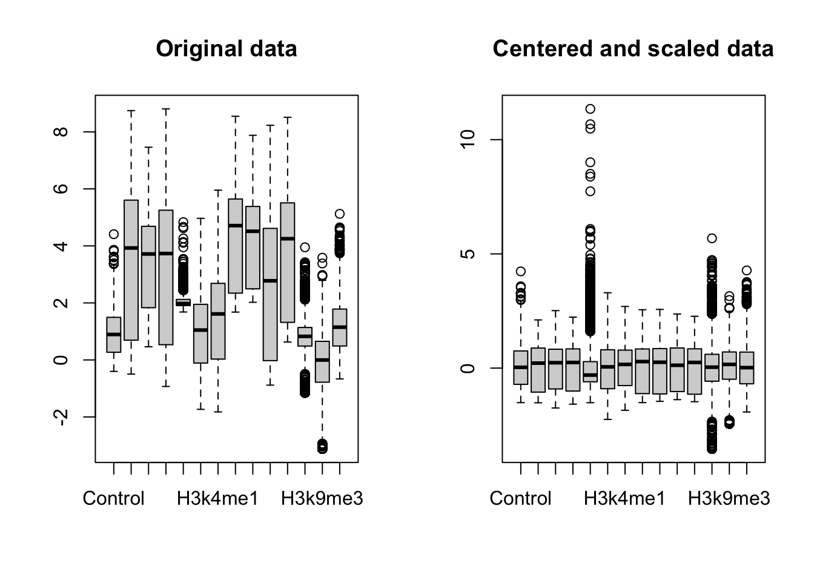
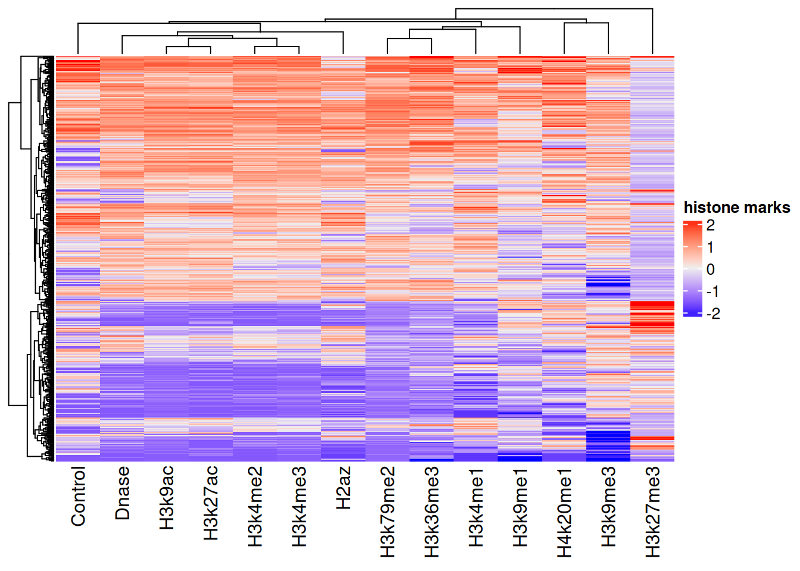
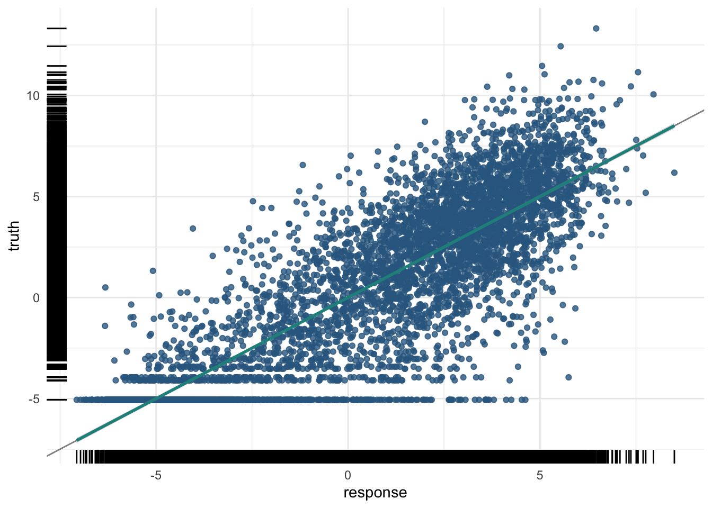
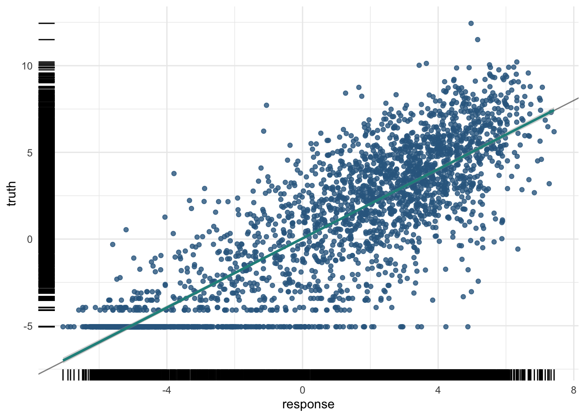
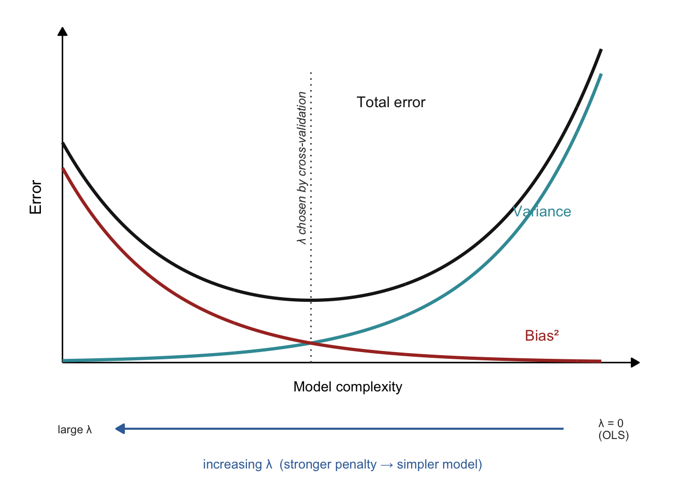
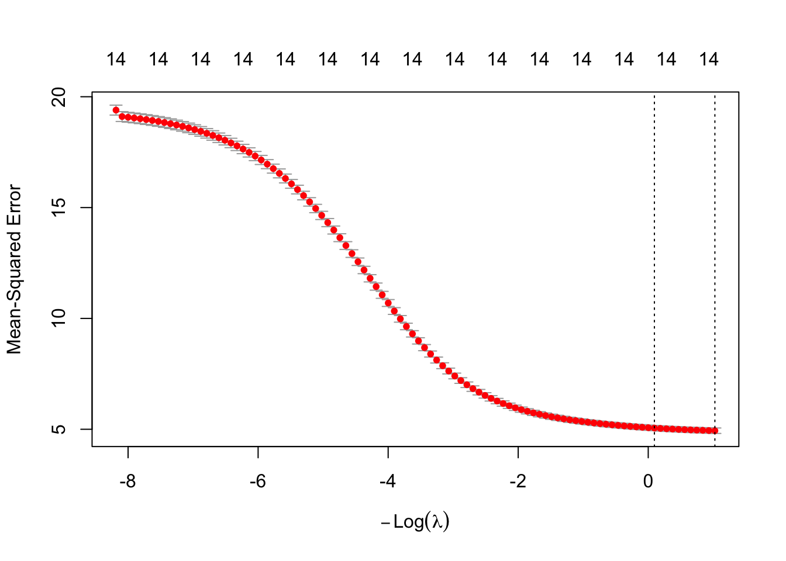
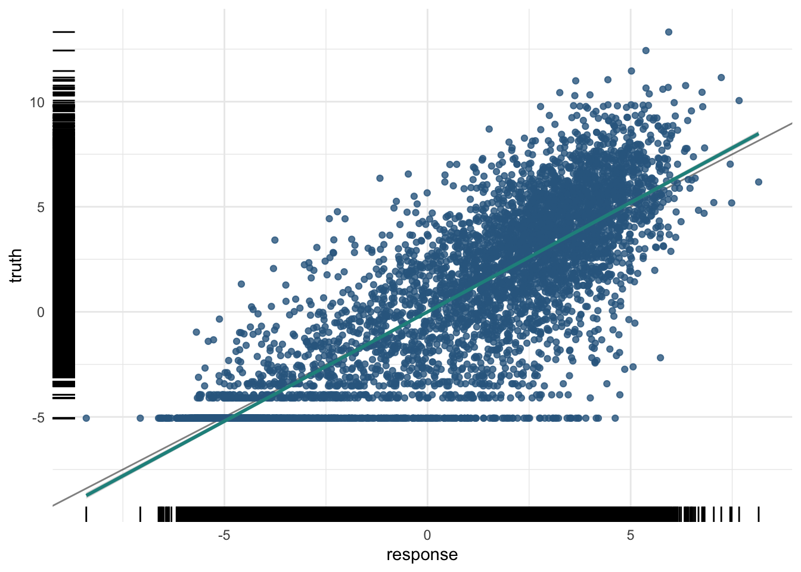
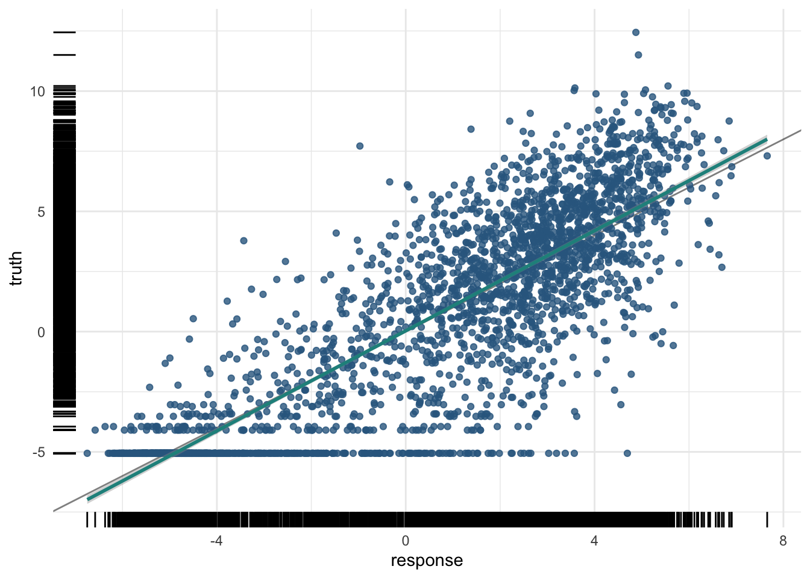

# 29  Worked example: predicting gene expression from histone marks

Code

- [Show All Code](javascript:void(0))

- [Hide All Code](javascript:void(0))

- 

  ------------------------------------------------------------------------

- [View Source](javascript:void(0))

Author

Affiliation

[Sean Davis](https://seandavi.github.io/) [](mailto:seandavi@gmail.com)

[University of Colorado  
Anschutz School of Medicine](https://medschool.cuanschutz.edu/)

Published

June 1, 2024

Modified

September 19, 2026

A gene’s DNA sequence doesn’t change from one cell type to the next, yet the same gene can be switched loudly on in one tissue and silent in another. Much of that control is written in **histone modifications** — chemical marks on the proteins that DNA wraps around, concentrated near each gene’s promoter. This example asks a question at the heart of gene regulation: **can the pattern of histone modifications near a gene predict that gene’s expression level?** ([Figure fig-gene-expression](#fig-gene-expression))

This is the third of three worked examples, and like the [methylation age example](../machine_learning/ml_methylation_age.llms.md) it is a **regression** problem — the target is a continuous expression level. We use the same `mlr3` framework throughout; for the four building blocks see [The mlr3verse](../machine_learning/mlr3verse_intro.llms.md), and for the general train/predict/assess workflow see the [cancer example](../machine_learning/ml_cancer.llms.md). Here the new idea is **penalized regression** with cross-validation, and a peek under the hood at how R² is actually computed.

This chapter views the same three ideas through the lens of **regularization**:

- **Feature selection, done automatically.** In the cancer chapter you hand-picked features — you ranked genes by variance and kept the top 200. Penalized regression flips that around: instead of you choosing which features to drop, the model’s **L1 (lasso) penalty** shrinks the coefficients of useless features all the way to zero, selecting features *for* you as a side effect of fitting. Same goal — fewer, more useful features — but the work moves from your hands into the algorithm.
- **Cross-validation, inside the training set.** A penalty has a strength, λ, and we have to choose it. The trick is to choose it by **cross-validation** *within the training data* — carving the training set into folds, never touching the test set. This is a fresh facet of the same golden rule from the cancer and methylation chapters: the test set stays sealed until the very end.
- **Overfitting, as a tunable knob.** Regularization reframes overfitting as something you can dial. The penalty λ is a knob that trades a tighter fit on the training data for better generalization to new genes: turn it up and the model gets simpler and steadier; turn it down and it bends closer to the training points, at the risk of memorizing noise.

> **NOTE:**
>
> The cancer chapter selected features by hand (keep the most variable genes); this chapter lets the model do it. A lasso penalty is, in effect, automatic feature selection baked into the fit — and cross-validation, run *only* on the training data, is how we pick how aggressive that penalty should be. The held-out test set is never consulted while we tune; it is saved for the single honest score at the end.

## 29.1 What you’ll learn

- Center and scale features, and visualize them with boxplots and a heatmap.
- Build a regression task and split it with `mlr3`’s [`partition()`](https://mlr3.mlr-org.com/reference/partition.html) helper.
- Fit **penalized regression** (ridge) with `regr.cv_glmnet`, and explain how **cross-validation** *within the training set* chooses the penalty strength λ.
- Read a penalized model’s **coefficients**, contrast ridge with lasso, and see how the lasso penalty performs **automatic feature selection** — the job you did by hand in the cancer chapter.
- Compute **R² by hand** and confirm it matches the `regr.rsq` measure.

## 29.2 Setup

``` downlit
library(mlr3verse)
library(mlr3learners) # for cv_glmnet
library(mlr3viz)      # for plotting predictions
library(ComplexHeatmap)
set.seed(789)
```

\\ y \sim h_1 + h_2 + h_3 + \ldots \tag{29.1}\\

[](../images/gene_expression_prediction_question.png "Figure 29.1: What is the combined effect of histone marks on gene expression?")

Figure 29.1: What is the combined effect of histone marks on gene expression?

The data summarize the histone marks within each gene’s **promoter** (here, the region 2 kb upstream of the transcription start site), paired with that gene’s measured expression. The target is the expression level; the features are the histone-mark summaries. As [Equation eq-1](#eq-1) sketches, we are modelling expression \\y\\ as a combination of histone marks \\h_1, h_2, \ldots\\. We’ll try two approaches: **penalized regression** and a **random forest**.

## 29.3 The data

The data were developed by Anshul Kundaje. We won’t dwell on the collection details; we’ll focus on the modelling.

``` downlit
feature_set <- read.table("http://seandavi.github.io/ITR/expression-prediction/features.txt")
```

What are the predictor columns?

``` downlit
colnames(feature_set)
```

     [1] "Control"  "Dnase"    "H2az"     "H3k27ac"  "H3k27me3" "H3k36me3"
     [7] "H3k4me1"  "H3k4me2"  "H3k4me3"  "H3k79me2" "H3k9ac"   "H3k9me1" 
    [13] "H3k9me3"  "H4k20me1"

These histone-mark summaries are our predictors. Some learners assume the predictors are on a similar scale, so we **center and scale** each column (subtract its mean, divide by its standard deviation) by converting to a matrix and using [`scale()`](https://rdrr.io/r/base/scale.html).

``` downlit
par(mfrow = c(1, 2))
scaled_features <- scale(as.matrix(feature_set))
boxplot(feature_set, main = 'Original data')
boxplot(scaled_features, main = 'Centered and scaled data')
```

[](ml_expression_files/figure-html/fig-scaled-data-1.png "Figure 29.2: Boxplots of the original and the centered-and-scaled features. After scaling, every feature sits on a comparable scale.")

Figure 29.2: Boxplots of the original and the centered-and-scaled features. After scaling, every feature sits on a comparable scale.

After scaling, every feature is centered near zero with comparable spread, as the right-hand boxplot shows. We can also spot structure across genes with a heatmap ([Figure fig-heatmap](#fig-heatmap)).

``` downlit
set.seed(789)
sampled_features <- scaled_features[sample(nrow(scaled_features), 500), ]
Heatmap(sampled_features, name = 'histone marks', show_row_names = FALSE)
```

[](ml_expression_files/figure-html/fig-heatmap-1.png "Figure 29.3: Heatmap of 500 randomly sampled genes (rows) across the histone marks (columns). Blocks of similar color reveal groups of genes with similar mark patterns.")

Figure 29.3: Heatmap of 500 randomly sampled genes (rows) across the histone marks (columns). Blocks of similar color reveal groups of genes with similar mark patterns.

Now we read in the matching gene-expression values — our prediction **target** — and combine them with the scaled features into one data frame.

``` downlit
target <- scan(url("http://seandavi.github.io/ITR/expression-prediction/target.txt"), skip = 1)
# combine target and features into one data frame
exp_pred_data <- data.frame(gene_expression = target, scaled_features)
```

The first few rows:

``` downlit
head(exp_pred_data, 3)
```

                                gene_expression    Control      Dnase       H2az
    ENSG00000000419.7.49575069         6.082343  0.7452926  0.7575546  1.0728432
    ENSG00000000457.8.169863093        2.989145  1.9509786  1.0216546  0.3702787
    ENSG00000000938.7.27961645        -5.058894 -0.3505542 -1.4482958 -1.0390775
                                   H3k27ac   H3k27me3   H3k36me3    H3k4me1
    ENSG00000000419.7.49575069   1.0950440 -0.5125312  1.1334793  0.4127984
    ENSG00000000457.8.169863093  0.7142157 -0.4079244  0.8739005  1.1649282
    ENSG00000000938.7.27961645  -1.0173283  1.4117293 -0.5157582 -0.5017450
                                   H3k4me2    H3k4me3   H3k79me2     H3k9ac
    ENSG00000000419.7.49575069   1.2136176  1.1202901  1.5155803  1.2468256
    ENSG00000000457.8.169863093  0.6456572  0.6508561  0.7976487  0.5792891
    ENSG00000000938.7.27961645  -0.1878255 -0.6560973 -1.3803974 -1.0067972
                                  H3k9me1   H3k9me3   H4k20me1
    ENSG00000000419.7.49575069  0.1426980  1.185622  1.9599992
    ENSG00000000457.8.169863093 0.3630902  1.014923 -0.2695111
    ENSG00000000938.7.27961645  0.6564520 -1.370871 -1.8773178

## 29.4 Create the task and split

The target is a number, so this is a regression task. This time we use `mlr3`’s own [`partition()`](https://mlr3.mlr-org.com/reference/partition.html) helper to make the train/test split, which by default holds out one-third for testing.

``` downlit
set.seed(7)
exp_pred_task <- as_task_regr(exp_pred_data, target = 'gene_expression')
split <- partition(exp_pred_task)
```

## 29.5 Linear regression

As a baseline, fit an ordinary linear regression.

``` downlit
learner <- lrn("regr.lm")
```

### 29.5.1 Train and predict

``` downlit
learner$train(exp_pred_task, split$train)
pred_train <- learner$predict(exp_pred_task, split$train)
pred_test <- learner$predict(exp_pred_task, split$test)
```

### 29.5.2 Assess

``` downlit
pred_train
```


    ── <PredictionRegr> for 5789 observations: ─────────────────────────────────────
     row_ids     truth  response
           2  2.989145  2.996674
           3 -5.058894 -5.364407
           5  5.558023  4.105793
         ---       ---       ---
        8639 -5.058894 -5.238131
        8640 -3.114148 -4.756313
        8641  5.731075  4.198905

``` downlit
plot(pred_train)
```

[](ml_expression_files/figure-html/fig-expr-lm-train-1.png "Figure 29.4: Linear-regression predictions on the training genes: predicted expression (vertical) against measured expression (horizontal), one point per gene. The closer the points cluster along the diagonal, the more of the expression signal the histone marks are capturing.")

Figure 29.4: Linear-regression predictions on the **training** genes: predicted expression (vertical) against measured expression (horizontal), one point per gene. The closer the points cluster along the diagonal, the more of the expression signal the histone marks are capturing.

The training R²:

``` downlit
measures <- msrs(c('regr.rsq'))
pred_train$score(measures)
```

     regr.rsq 
    0.7507266 

And the test R² — the number that matters:

``` downlit
pred_test$score(measures)
```

     regr.rsq 
    0.7505519 

``` downlit
plot(pred_test)
```

[](ml_expression_files/figure-html/fig-expr-lm-test-1.png "Figure 29.5: Linear-regression predictions on the held-out test genes. Because the model never saw these genes during training, this scatter is the honest picture of how well promoter histone marks predict a gene’s expression.")

Figure 29.5: Linear-regression predictions on the held-out **test** genes. Because the model never saw these genes during training, this scatter is the honest picture of how well promoter histone marks predict a gene’s expression.

A moderate R² here is a real biological result: histone marks in the promoter carry genuine, but partial, information about how strongly a gene is expressed.

## 29.6 Penalized regression

When a model has many predictors, it can become *too* flexible and start fitting noise — the problem of **overfitting**. **Penalized regression** combats this by adding a penalty for complexity, nudging the model toward simpler, more general solutions.

> **NOTE:**
>
> - **Ridge (L2):** shrinks all coefficients toward zero, like a rubber band pulling them in. It keeps every feature but tames large coefficients.
> - **Lasso (L1):** can shrink some coefficients *all the way* to zero, like scissors that cut the least useful features out of the model entirely. This doubles as automatic **feature selection**.
> - **Elastic net:** a blend of the two — rubber band *and* scissors — combining shrinkage with feature elimination.
>
> In `mlr3`, the `alpha` setting picks the flavour: `alpha = 0` is ridge, `alpha = 1` is lasso, and values in between are elastic net.

Whichever flavour you pick, a single dial controls *how hard* the penalty pushes: the regularization strength **λ** (lambda). At `λ = 0` there is no penalty at all and you are back to ordinary least squares — the most flexible, highest-variance fit. Turn λ up and the coefficients are squeezed toward zero, giving a simpler, higher-bias model. In other words, **λ is a knob that slides the model back and forth along the model-complexity axis** from the [introduction](../machine_learning/intro.llms.md) ([Figure fig-lambda-slider](#fig-lambda-slider)). The whole game is to stop at the bottom of the U — and that is exactly the job we hand to cross-validation.

Code

``` downlit
library(ggplot2)
x        <- seq(0, 10, length.out = 400)
bias2    <- exp(-0.5 * x)
variance <- 0.01 * exp(0.5 * x)
total    <- bias2 + variance + 0.12
opt      <- x[which.min(total)]
df <- data.frame(
  x     = rep(x, 3),
  error = c(total, variance, bias2),
  curve = factor(rep(c("Total error", "Variance", "Bias²"), each = length(x)),
                 levels = c("Total error", "Variance", "Bias²")))
cols <- c("Total error" = "#1a1a1a", "Variance" = "#3a9aa5", "Bias²" = "#a8322a")
ggplot(df, aes(x, error, colour = curve)) +
  annotate("segment", x = 0, xend = 0, y = 0, yend = 1.72,
           arrow = arrow(length = unit(0.22, "cm"), type = "closed"), linewidth = 0.5) +
  annotate("segment", x = 0, xend = 10.7, y = 0, yend = 0,
           arrow = arrow(length = unit(0.22, "cm"), type = "closed"), linewidth = 0.5) +
  annotate("segment", x = opt, xend = opt, y = 0, yend = 1.5,
           linetype = "dotted", colour = "grey25", linewidth = 0.5) +
  annotate("text", x = opt - 0.18, y = 1.0, label = "λ chosen by cross-validation",
           angle = 90, fontface = "italic", size = 3.1, colour = "grey20") +
  geom_line(linewidth = 1.1) +
  annotate("text", x = 6.1, y = 1.34, label = "Total error", colour = cols[["Total error"]], size = 3.8) +
  annotate("text", x = 8.9, y = 0.78, label = "Variance",    colour = cols[["Variance"]],    size = 3.8) +
  annotate("text", x = 8.9, y = 0.14, label = "Bias²",  colour = cols[["Bias²"]],  size = 3.8) +
  annotate("text", x = 5.3, y = -0.12, label = "Model complexity", size = 3.6) +
  # the lambda dial beneath the axis
  annotate("segment", x = 9.3, xend = 1.0, y = -0.34, yend = -0.34,
           arrow = arrow(length = unit(0.22, "cm"), type = "closed"),
           colour = "#3b6ea5", linewidth = 0.7) +
  annotate("text", x = 9.95, y = -0.34, label = "λ = 0\n(OLS)", hjust = 0,
           size = 2.9, colour = "grey20", lineheight = 0.85) +
  annotate("text", x = 0.55, y = -0.34, label = "large λ", hjust = 1,
           size = 2.9, colour = "grey20") +
  annotate("text", x = 5.2, y = -0.52,
           label = "increasing λ  (stronger penalty → simpler model)",
           colour = "#3b6ea5", size = 3.3) +
  scale_colour_manual(values = cols) +
  scale_x_continuous(expand = c(0, 0)) +
  scale_y_continuous(expand = c(0, 0)) +
  coord_cartesian(xlim = c(-0.7, 11.4), ylim = c(-0.62, 1.82), clip = "off") +
  annotate("text", x = -0.5, y = 0.85, label = "Error", angle = 90, size = 4) +
  theme_void() +
  theme(legend.position = "none", plot.margin = margin(6, 14, 10, 18))
```

[](ml_expression_files/figure-html/fig-lambda-slider-1.png "Figure 29.6: Penalized regression turns model complexity into a single continuous dial. The curves are the same bias–variance picture from the introduction: as the model grows more complex, bias² falls while variance rises, and their sum — the total error on new data — traces a U. What penalized regression adds is the λ knob along the bottom. At λ = 0 there is no penalty and you fit ordinary least squares: the most complex, highest-variance model (far right). Increasing λ shrinks the coefficients, sliding the model leftward toward simpler, higher-bias fits. Cross-validation’s one job is to find the λ that lands at the bottom of the U.")

Figure 29.6: Penalized regression turns model complexity into a single continuous dial. The curves are the same bias–variance picture from the [introduction](../machine_learning/intro.llms.md): as the model grows more complex, **bias²** falls while **variance** rises, and their sum — the **total error** on new data — traces a U. What penalized regression adds is the **λ** knob along the bottom. At **λ = 0** there is no penalty and you fit ordinary least squares: the most complex, highest-variance model (far right). Increasing λ shrinks the coefficients, sliding the model leftward toward simpler, higher-bias fits. Cross-validation’s one job is to find the λ that lands at the bottom of the U.

We’ll use the `regr.cv_glmnet` learner, which automatically uses **cross-validation** to choose the penalty strength.

> **NOTE:**
>
> Cross-validation estimates how a model will perform on unseen data by splitting the training data into *k* equal **folds**. The model trains on *k − 1* folds and is validated on the held-out fold, repeating until each fold has served as the validation set once. Averaging the *k* scores gives a stable performance estimate, and `cv_glmnet` uses it to pick the best penalty (`lambda`). The `nfolds` setting controls *k*; 5 or 10 are common choices.

Here is how that actually pins down the penalty. `cv_glmnet` lays out a grid of candidate λ values, from strong to weak. For *each* candidate it runs the full *k*-fold routine just described — fit on *k − 1* folds, measure the error on the held-out fold, rotate until every fold has taken a turn as validation set — and averages those *k* errors into a *single* score for that λ. Sweeping across the whole grid therefore yields one cross-validated error per candidate penalty (the curve we plot in a moment). The **best λ** is then simply the one with the lowest cross-validated error — glmnet calls it `lambda.min`. Because that minimum can be a little noisy, glmnet also offers `lambda.1se`: the strongest penalty (the simplest model) whose error is still within one standard error of the best, a slightly more conservative default. The essential point is that this entire search happens *inside the training data* — the test set is never consulted while we choose λ, so it remains a fair, untouched judge at the end.

With `alpha = 0` we fit a **ridge** model with 10-fold cross-validation:

``` downlit
set.seed(789)
learner <- lrn("regr.cv_glmnet", nfolds = 10, alpha = 0)
```

### 29.6.1 Train

``` downlit
learner$train(exp_pred_task, split$train)
```

Because `cv_glmnet` quietly tried a whole range of λ values and scored each one by cross-validation, we can look at that search directly ([Figure fig-cv-lambda](#fig-cv-lambda)) — the real-data version of the λ dial from the schematic above.

``` downlit
plot(learner$model)
```

[](ml_expression_files/figure-html/fig-cv-lambda-1.png "Figure 29.7: The cross-validation search that cv_glmnet ran. Each red dot is the mean cross-validated error (mean squared error) for one value of the penalty, with vertical bars showing ±1 standard error; the numbers across the top count how many features survive at each λ — all 14 here, because ridge shrinks coefficients but never zeros them (only lasso would prune that count). The x-axis is −log(λ), so the penalty grows toward the left, the same orientation as the schematic above. The two dotted lines mark lambda.min (lowest CV error) and lambda.1se (the strongest penalty within one standard error of it). Notice the error keeps falling as the penalty weakens, with no interior bottom: on this small, low-dimensional dataset ridge’s shrinkage buys little, and cross-validation settles near the lightly-penalized, OLS-like end. Penalties earn their keep when features are many and correlated — not so much here.")

Figure 29.7: The cross-validation search that `cv_glmnet` ran. Each red dot is the mean cross-validated error (mean squared error) for one value of the penalty, with vertical bars showing ±1 standard error; the numbers across the top count how many features survive at each λ — all **14** here, because *ridge* shrinks coefficients but never zeros them (only lasso would prune that count). The x-axis is **−log(λ)**, so the penalty grows toward the *left*, the same orientation as the schematic above. The two dotted lines mark **lambda.min** (lowest CV error) and **lambda.1se** (the strongest penalty within one standard error of it). Notice the error keeps falling as the penalty weakens, with no interior bottom: on this small, low-dimensional dataset ridge’s shrinkage buys little, and cross-validation settles near the lightly-penalized, OLS-like end. Penalties earn their keep when features are many and correlated — not so much here.

For a penalized model we can inspect the **coefficients** directly:

``` downlit
coef(learner$model)
```

    15 x 1 sparse Matrix of class "dgCMatrix"
                 lambda.1se
    (Intercept)  0.08832251
    Control     -0.05020310
    Dnase        0.85954551
    H2az         0.31828260
    H3k27ac      0.26566165
    H3k27me3    -0.27170626
    H3k36me3     0.65845540
    H3k4me1     -0.02832563
    H3k4me2      0.17902035
    H3k4me3      0.37064260
    H3k79me2     0.86371398
    H3k9ac       0.48125738
    H3k9me1     -0.05440077
    H3k9me3     -0.16204169
    H4k20me1     0.13611422

Each coefficient tells us how strongly its histone mark pushes predicted expression up or down. With lasso (`alpha = 1`) many of these would be exactly zero — the model would have *selected* a subset of marks for us, which is useful not just for prediction but for understanding which marks matter.

> **IMPORTANT:**
>
> It is tempting to think that once you have cross-validated, you are done — but the two jobs are different, and they deliberately use different data. The cross-validation inside `cv_glmnet` ran *entirely on the training split* (`split$train`): it carved those training genes into 10 folds to choose λ, and never touched `split$test`. That makes it a **tuning** tool, not an honest performance estimate — the chosen λ has, in effect, been fitted to the training data, so scoring the model on that same data would flatter it.
>
> This is exactly why we set aside a test set with [`partition()`](https://mlr3.mlr-org.com/reference/partition.html) at the very start. We still report the model’s quality on the held-out **test** genes below (`split$test`), which played no part in fitting the coefficients *or* in selecting λ. Cross-validation picks the dial; the untouched test set delivers the verdict.

### 29.6.2 Predict and assess

``` downlit
pred_train <- learner$predict(exp_pred_task, split$train)
pred_test <- learner$predict(exp_pred_task, split$test)
```

``` downlit
pred_train
```


    ── <PredictionRegr> for 5789 observations: ─────────────────────────────────────
     row_ids     truth  response
           2  2.989145  2.933043
           3 -5.058894 -4.471610
           5  5.558023  4.221675
         ---       ---       ---
        8639 -5.058894 -5.581904
        8640 -3.114148 -4.105914
        8641  5.731075  4.427548

``` downlit
plot(pred_train)
```

[](ml_expression_files/figure-html/fig-expr-ridge-train-1.png "Figure 29.8: Ridge-regression predictions on the training genes. The L2 penalty shrinks the coefficients to curb overfitting, so the training fit may look slightly looser than plain linear regression — the payoff is steadier predictions on new genes.")

Figure 29.8: Ridge-regression predictions on the **training** genes. The L2 penalty shrinks the coefficients to curb overfitting, so the training fit may look slightly looser than plain linear regression — the payoff is steadier predictions on new genes.

The training R²:

``` downlit
measures <- msrs(c('regr.rsq'))
pred_train$score(measures)
```

    regr.rsq 
    0.740439 

And the test R²:

``` downlit
pred_test$score(measures)
```

     regr.rsq 
    0.7405317 

``` downlit
plot(pred_test)
```

[](ml_expression_files/figure-html/fig-expr-ridge-test-1.png "Figure 29.9: Ridge-regression predictions on the held-out test genes — the honest comparison against the linear model above. With only a handful of histone-mark features here, ridge and plain linear regression land in a similar place; the penalty earns its keep when features are many and correlated.")

Figure 29.9: Ridge-regression predictions on the held-out **test** genes — the honest comparison against the linear model above. With only a handful of histone-mark features here, ridge and plain linear regression land in a similar place; the penalty earns its keep when features are many and correlated.

We can also compute the test R² by hand, to demystify the measure: it is one minus the ratio of the residual sum of squares to the total sum of squares.

``` downlit
# calculate the R-squared value by hand
truth <- pred_test$truth
predicted <- pred_test$response
rss <- sum((truth - predicted)^2)          # residual sum of squares
tss <- sum((truth - mean(truth))^2)        # total sum of squares
r_squared <- 1 - (rss / tss)
r_squared
```

    [1] 0.7405317

This matches the `regr.rsq` measure above — reassuring confirmation that you understand exactly what R² is counting.

## 29.7 Summary

You have now used machine learning to probe a question in gene regulation — whether promoter histone marks predict expression — through the same `mlr3` workflow as the previous two chapters:

- You **scaled** the histone-mark features, visualized them with boxplots and a **heatmap**, and built a regression task split with [`partition()`](https://mlr3.mlr-org.com/reference/partition.html).
- A baseline **linear regression** gave a moderate R² — a real, if partial, biological signal that marks carry information about expression.
- **Penalized regression** (ridge via `regr.cv_glmnet`) used **cross-validation** to choose its penalty and fight overfitting; with lasso it would also perform feature selection, turning the model into a tool for understanding which marks matter.
- Computing **R² by hand** confirmed exactly what the `regr.rsq` measure counts.

Across all three worked examples the same disciplines recurred: **split** the data, **select features** thoughtfully, **train then predict**, and judge every model by its **test-set** score. That last habit — never trusting the training score — is the single most important thing to carry forward.

## 29.8 Exercises

Each exercise reuses objects you already built, so the solutions are quick to run.

1.  **Change the number of CV folds.** The ridge model used `nfolds = 10`. Refit it with `nfolds = 5` and see whether the test R² changes much.

    > **NOTE:**
    > ``` downlit
    > ridge5 <- lrn("regr.cv_glmnet", nfolds = 5, alpha = 0)
    > ridge5$train(exp_pred_task, split$train)
    > ridge5$predict(exp_pred_task, split$test)$score(msrs(c('regr.rsq')))
    > ```
    >
    > Fewer folds means each training fold is a little smaller and the chosen penalty is a little noisier, but the test R² usually shifts only slightly. The penalty selection is fairly robust to the exact number of folds.

2.  **Try lasso instead of ridge.** We used `alpha = 0` (ridge). Refit with `alpha = 1` (lasso) and inspect the coefficients. How many histone marks does lasso drop to exactly zero?

    > **NOTE:**
    > ``` downlit
    > lasso <- lrn("regr.cv_glmnet", nfolds = 10, alpha = 1)
    > lasso$train(exp_pred_task, split$train)
    > coef(lasso$model)               # zeros are the dropped marks
    > lasso$predict(exp_pred_task, split$test)$score(msrs(c('regr.rsq')))
    > ```
    >
    > Lasso sets the coefficients of the least useful marks to exactly zero, so the non-zero entries are the marks it “selected.” This is feature selection built into the model, and it makes the result easier to interpret biologically.

3.  **Add a random forest.** The chapter opening promised a random forest too. Fit `regr.ranger` on the same task and split, and compare its test R² to ridge.

    > **NOTE:**
    > ``` downlit
    > rf <- lrn("regr.ranger")
    > rf$train(exp_pred_task, split$train)
    > rf$predict(exp_pred_task, split$test)$score(msrs(c('regr.rsq')))
    > ```
    >
    > Swapping the learner is a one-line change to [`lrn()`](https://mlr3.mlr-org.com/reference/mlr_sugar.html). The forest can capture non-linear interactions between marks that a linear model cannot, so it sometimes edges out ridge — but, as always, the honest comparison is the held-out test R².
