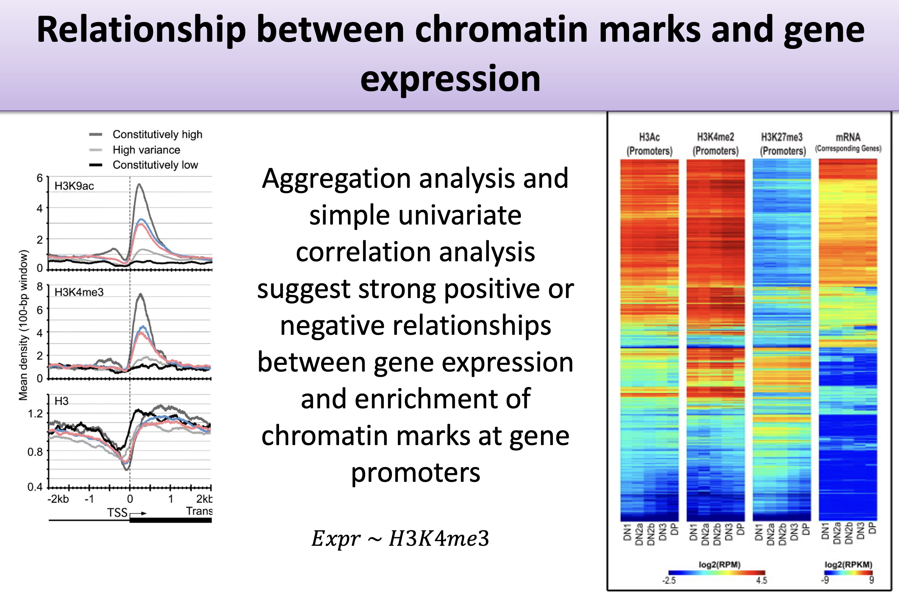

A gene's DNA sequence doesn't change from one cell type to the next, yet the same
gene can be switched loudly on in one tissue and silent in another. Much of that
control is written in **histone modifications** — chemical marks on the proteins
that DNA wraps around, concentrated near each gene's promoter. This example asks a
question at the heart of gene regulation: **can the pattern of histone
modifications near a gene predict that gene's expression level?**
(@fig-gene-expression)

This is the third of three worked examples, and like the
[methylation age example](ml_methylation_age.qmd) it is a **regression** problem —
the target is a continuous expression level. We use the same `mlr3` framework
throughout; for the four building blocks see
[The mlr3verse](mlr3verse_intro.qmd), and for the general train/predict/assess
workflow see the [cancer example](ml_cancer.qmd). Here the new idea is
**penalized regression** with cross-validation, and a peek under the hood at how R²
is actually computed.

## What you'll learn

- Center and scale features, and visualize them with boxplots and a heatmap.
- Build a regression task and split it with `mlr3`'s `partition()` helper.
- Fit **penalized regression** (ridge) with `regr.cv_glmnet`, and explain how
  **cross-validation** chooses the penalty.
- Read a penalized model's **coefficients**, and contrast ridge with lasso.
- Compute **R² by hand** and confirm it matches the `regr.rsq` measure.

## Setup

```{r message=FALSE}
library(mlr3verse)
library(mlr3learners) # for cv_glmnet
library(mlr3viz)      # for plotting predictions
library(ComplexHeatmap)
set.seed(789)
```

$$
y \sim h_1 + h_2 + h_3 + \ldots
$$ {#eq-1}

{#fig-gene-expression}

The data summarize the histone marks within each gene's **promoter** (here, the
region 2 kb upstream of the transcription start site), paired with that gene's
measured expression. The target is the expression level; the features are the
histone-mark summaries. As @eq-1 sketches, we are modelling expression $y$ as a
combination of histone marks $h_1, h_2, \ldots$. We'll try two approaches:
**penalized regression** and a **random forest**.

## The data

The data were developed by Anshul Kundaje. We won't dwell on the collection
details; we'll focus on the modelling.

```{r}
feature_set <- read.table("http://seandavi.github.io/ITR/expression-prediction/features.txt")
```

What are the predictor columns?

```{r}
colnames(feature_set)
```

These histone-mark summaries are our predictors. Some learners assume the
predictors are on a similar scale, so we **center and scale** each column
(subtract its mean, divide by its standard deviation) by converting to a matrix
and using `scale()`.

```{r fig-scaled-data, fig.cap="Boxplots of the original and the centered-and-scaled features. After scaling, every feature sits on a comparable scale."}
par(mfrow = c(1, 2))
scaled_features <- scale(as.matrix(feature_set))
boxplot(feature_set, main = 'Original data')
boxplot(scaled_features, main = 'Centered and scaled data')
```

After scaling, every feature is centered near zero with comparable spread, as the
right-hand boxplot shows. We can also spot structure across genes with a heatmap
(@fig-heatmap).

```{r fig-heatmap, fig.cap="Heatmap of 500 randomly sampled genes (rows) across the histone marks (columns). Blocks of similar color reveal groups of genes with similar mark patterns."}
set.seed(789)
sampled_features <- scaled_features[sample(nrow(scaled_features), 500), ]
Heatmap(sampled_features, name = 'histone marks', show_row_names = FALSE)
```

Now we read in the matching gene-expression values — our prediction **target** —
and combine them with the scaled features into one data frame.

```{r}
target <- scan(url("http://seandavi.github.io/ITR/expression-prediction/target.txt"), skip = 1)
# combine target and features into one data frame
exp_pred_data <- data.frame(gene_expression = target, scaled_features)
```

The first few rows:

```{r}
head(exp_pred_data, 3)
```

## Create the task and split

The target is a number, so this is a regression task. This time we use `mlr3`'s
own `partition()` helper to make the train/test split, which by default holds out
one-third for testing.

```{r}
set.seed(7)
exp_pred_task <- as_task_regr(exp_pred_data, target = 'gene_expression')
split <- partition(exp_pred_task)
```

## Linear regression

As a baseline, fit an ordinary linear regression.

```{r}
learner <- lrn("regr.lm")
```

### Train and predict

```{r}
learner$train(exp_pred_task, split$train)
pred_train <- learner$predict(exp_pred_task, split$train)
pred_test <- learner$predict(exp_pred_task, split$test)
```

### Assess

```{r}
pred_train
plot(pred_train)
```

The training R²:

```{r}
measures <- msrs(c('regr.rsq'))
pred_train$score(measures)
```

And the test R² — the number that matters:

```{r}
pred_test$score(measures)
```

```{r}
plot(pred_test)
```

A moderate R² here is a real biological result: histone marks in the promoter
carry genuine, but partial, information about how strongly a gene is expressed.

## Penalized regression

When a model has many predictors, it can become *too* flexible and start fitting
noise — the problem of **overfitting**. **Penalized regression** combats this by
adding a penalty for complexity, nudging the model toward simpler, more general
solutions.

::: {.callout-note}
## Three flavours of penalty

- **Ridge (L2):** shrinks all coefficients toward zero, like a rubber band pulling
  them in. It keeps every feature but tames large coefficients.
- **Lasso (L1):** can shrink some coefficients *all the way* to zero, like
  scissors that cut the least useful features out of the model entirely. This
  doubles as automatic **feature selection**.
- **Elastic net:** a blend of the two — rubber band *and* scissors — combining
  shrinkage with feature elimination.

In `mlr3`, the `alpha` setting picks the flavour: `alpha = 0` is ridge,
`alpha = 1` is lasso, and values in between are elastic net.
:::

We'll use the `regr.cv_glmnet` learner, which automatically uses
**cross-validation** to choose the penalty strength.

::: {.callout-note}
## What is cross-validation?

Cross-validation estimates how a model will perform on unseen data by splitting
the training data into *k* equal **folds**. The model trains on *k − 1* folds and
is validated on the held-out fold, repeating until each fold has served as the
validation set once. Averaging the *k* scores gives a stable performance estimate,
and `cv_glmnet` uses it to pick the best penalty (`lambda`). The `nfolds` setting
controls *k*; 5 or 10 are common choices.
:::

With `alpha = 0` we fit a **ridge** model with 10-fold cross-validation:

```{r}
set.seed(789)
learner <- lrn("regr.cv_glmnet", nfolds = 10, alpha = 0)
```

### Train

```{r}
learner$train(exp_pred_task, split$train)
```

For a penalized model we can inspect the **coefficients** directly:

```{r}
coef(learner$model)
```

Each coefficient tells us how strongly its histone mark pushes predicted
expression up or down. With lasso (`alpha = 1`) many of these would be exactly
zero — the model would have *selected* a subset of marks for us, which is useful
not just for prediction but for understanding which marks matter.

### Predict and assess

```{r}
pred_train <- learner$predict(exp_pred_task, split$train)
pred_test <- learner$predict(exp_pred_task, split$test)
```

```{r}
pred_train
plot(pred_train)
```

The training R²:

```{r}
measures <- msrs(c('regr.rsq'))
pred_train$score(measures)
```

And the test R²:

```{r}
pred_test$score(measures)
```

```{r}
plot(pred_test)
```

We can also compute the test R² by hand, to demystify the measure: it is one minus
the ratio of the residual sum of squares to the total sum of squares.

```{r}
# calculate the R-squared value by hand
truth <- pred_test$truth
predicted <- pred_test$response
rss <- sum((truth - predicted)^2)          # residual sum of squares
tss <- sum((truth - mean(truth))^2)        # total sum of squares
r_squared <- 1 - (rss / tss)
r_squared
```

This matches the `regr.rsq` measure above — reassuring confirmation that you
understand exactly what R² is counting.

## Summary

You have now used machine learning to probe a question in gene regulation —
whether promoter histone marks predict expression — through the same `mlr3`
workflow as the previous two chapters:

- You **scaled** the histone-mark features, visualized them with boxplots and a
  **heatmap**, and built a regression task split with `partition()`.
- A baseline **linear regression** gave a moderate R² — a real, if partial,
  biological signal that marks carry information about expression.
- **Penalized regression** (ridge via `regr.cv_glmnet`) used **cross-validation**
  to choose its penalty and fight overfitting; with lasso it would also perform
  feature selection, turning the model into a tool for understanding which marks
  matter.
- Computing **R² by hand** confirmed exactly what the `regr.rsq` measure counts.

Across all three worked examples the same disciplines recurred: **split** the
data, **select features** thoughtfully, **train then predict**, and judge every
model by its **test-set** score. That last habit — never trusting the training
score — is the single most important thing to carry forward.

## Exercises

Each exercise reuses objects you already built, so the solutions are quick to run.

1. **Change the number of CV folds.** The ridge model used `nfolds = 10`. Refit it
   with `nfolds = 5` and see whether the test R² changes much.

   ::: {.callout-note collapse="true"}
   ## Solution

   ```{r eval=FALSE}
   ridge5 <- lrn("regr.cv_glmnet", nfolds = 5, alpha = 0)
   ridge5$train(exp_pred_task, split$train)
   ridge5$predict(exp_pred_task, split$test)$score(msrs(c('regr.rsq')))
   ```

   Fewer folds means each training fold is a little smaller and the chosen penalty
   is a little noisier, but the test R² usually shifts only slightly. The penalty
   selection is fairly robust to the exact number of folds.
   :::

2. **Try lasso instead of ridge.** We used `alpha = 0` (ridge). Refit with
   `alpha = 1` (lasso) and inspect the coefficients. How many histone marks does
   lasso drop to exactly zero?

   ::: {.callout-note collapse="true"}
   ## Solution

   ```{r eval=FALSE}
   lasso <- lrn("regr.cv_glmnet", nfolds = 10, alpha = 1)
   lasso$train(exp_pred_task, split$train)
   coef(lasso$model)               # zeros are the dropped marks
   lasso$predict(exp_pred_task, split$test)$score(msrs(c('regr.rsq')))
   ```

   Lasso sets the coefficients of the least useful marks to exactly zero, so the
   non-zero entries are the marks it "selected." This is feature selection built
   into the model, and it makes the result easier to interpret biologically.
   :::

3. **Add a random forest.** The chapter opening promised a random forest too. Fit
   `regr.ranger` on the same task and split, and compare its test R² to ridge.

   ::: {.callout-note collapse="true"}
   ## Solution

   ```{r eval=FALSE}
   rf <- lrn("regr.ranger")
   rf$train(exp_pred_task, split$train)
   rf$predict(exp_pred_task, split$test)$score(msrs(c('regr.rsq')))
   ```

   Swapping the learner is a one-line change to `lrn()`. The forest can capture
   non-linear interactions between marks that a linear model cannot, so it
   sometimes edges out ridge — but, as always, the honest comparison is the
   held-out test R².
   :::
