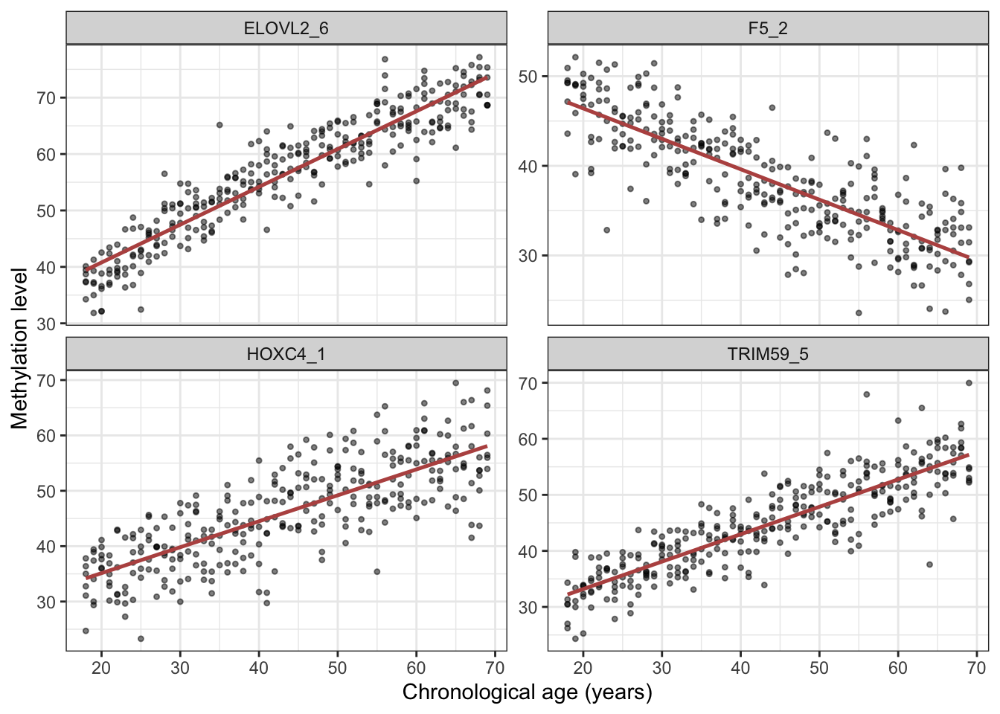
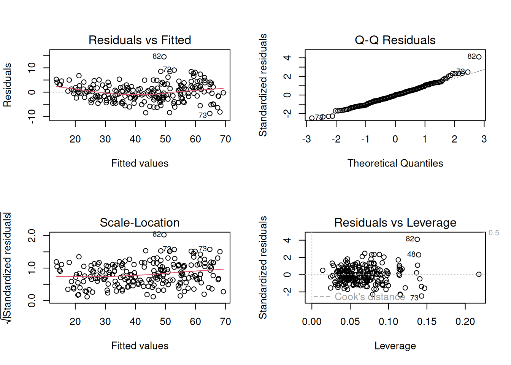
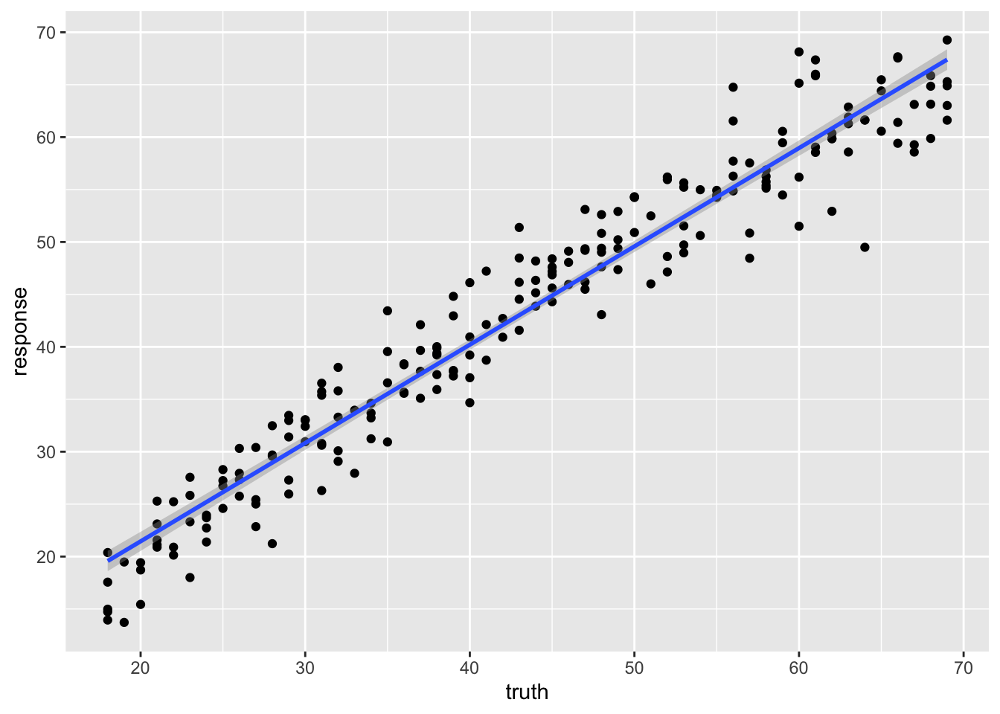
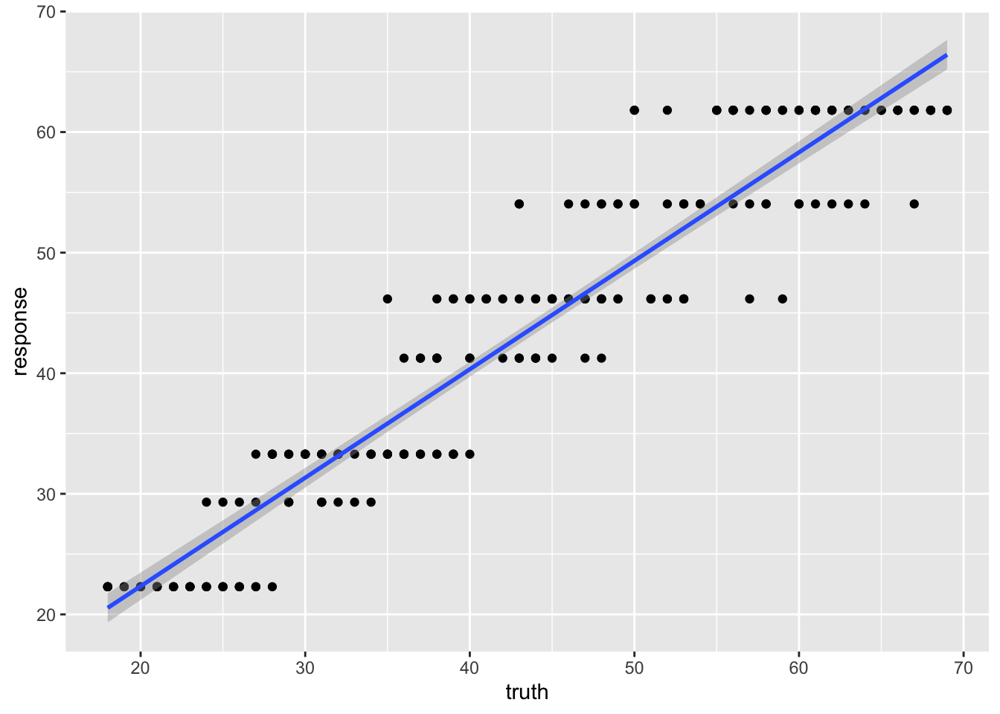
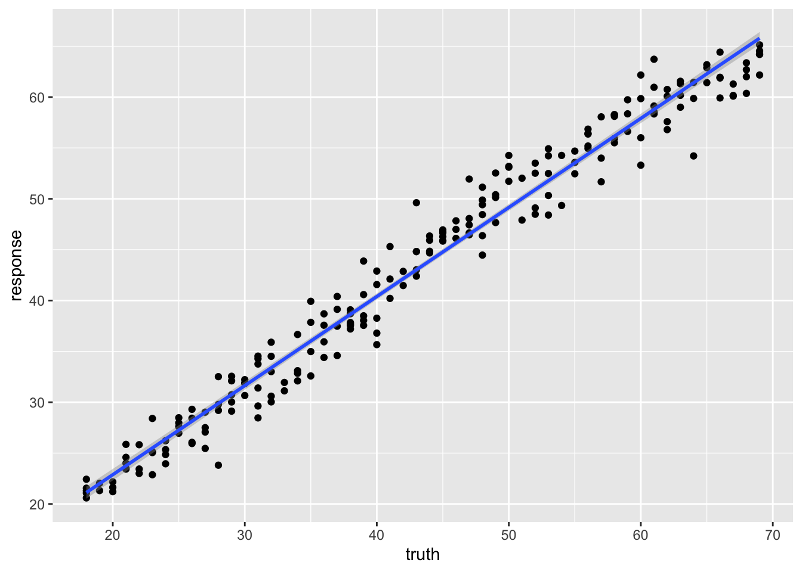

# 28  Worked example: predicting age from DNA methylation

Code

Author

Affiliation

[Sean Davis](https://seandavi.github.io/) [](mailto:seandavi@gmail.com)

[University of Colorado  
Anschutz School of Medicine](https://medschool.cuanschutz.edu/)

Published

June 1, 2024

Modified

September 19, 2026

How old is a tissue sample? Not the donor’s age on a birthday cake, but the biological age written into the DNA itself. It turns out you can read it off the **DNA-methylation** pattern: at certain sites the methylation level drifts steadily with age, and a model trained on those sites becomes an **epigenetic clock**. This example builds one, following the work of [Naue et al. (2017)](https://www.sciencedirect.com/science/article/pii/S1872497317301643).

This is the second of three worked examples. Unlike the [cancer-classification example](../machine_learning/ml_cancer.llms.md), where the target was a category, here the target — a person’s age — is a *number*, so this is a **regression** problem. We use the same `mlr3` framework throughout; if you need the refresher on tasks, learners, measures, and the train/test split, see [The mlr3verse](../machine_learning/mlr3verse_intro.llms.md) and the [cancer example](../machine_learning/ml_cancer.llms.md) for the general workflow. Here we keep our eyes on the biology and on how regression differs from classification.

The three core ideas from the cancer chapter all return, but each takes on a new shade once the goal is an epigenetic clock rather than a cancer label:

- **The split is about *validity*, not just accuracy.** A clock that predicts age beautifully on the very people it was trained on is worthless as a biomarker — of course it fits them, it learned them. The whole point of an epigenetic clock is to estimate the age of *someone new*, so the held-out test set is not a nicety here; it is the only thing that tells you whether you have built a real biomarker or an elaborate lookup table.
- **Feature selection is forced on you.** A methylation array measures hundreds of thousands of CpG sites, but a study has only dozens or hundreds of people. Far more features than samples — the *p* ≫ *n* regime — is the normal state of affairs in genomics, and it means selecting or limiting features is not an optional tidy-up but a requirement (see the warning below).
- **The yardstick changes.** Classification used accuracy and a confusion matrix. Regression has no “correct/incorrect” — instead we measure how far off the predictions are, with **RMSE** (typical error, in years) and **R²** (the fraction of the variation in age the model explains).

> **WARNING:**
>
> When the number of features *p* dwarfs the number of samples *n*, a flexible model can find some combination of CpG sites that fits the training ages *perfectly* by chance alone — pure memorization dressed up as signal. This is overfitting in its most dangerous form, because the training score looks fantastic. The defences are the same ones you already know: limit the features (keep only the CpG sites most associated with age), prefer simpler models, and *always* judge on the held-out test set. The next chapter shows a second defence — letting the model shrink its own coefficients.

## 28.1 What you’ll learn

- Build a **regression** task from a real methylation dataset with [`as_task_regr()`](https://mlr3.mlr-org.com/reference/as_task_regr.html).
- Fit and compare three regression learners — **linear regression**, a **regression tree**, and a **random forest** — through the same `mlr3` calls.
- Read **regression diagnostic plots** and a **truth-versus-prediction** scatter.
- Interpret **R²** as the fraction of variation explained (and **RMSE** as the typical error in years), and spot overfitting when the test R² falls below the training R².
- Explain why having far more CpG features than people (the *p* ≫ *n* problem) makes feature selection and an honest test set non-negotiable for a biomarker.

## 28.2 Setup

``` downlit
library(mlr3verse)
library(ranger)       # for random forests
library(data.table)
library(ggplot2)
set.seed(789)
```

## 28.3 The data

The biology behind it: within each individual, the level of [DNA methylation](https://www.ncbi.nlm.nih.gov/pmc/articles/PMC3174260/) at certain sites changes steadily with age. The [CpG sites](https://en.wikipedia.org/wiki/CpG_site) whose methylation correlates most strongly with age make excellent **biomarkers** — and excellent features for a regression model. The data come from [this Galaxy tutorial](https://training.galaxyproject.org/training-material/topics/statistics/tutorials/regression_machinelearning/tutorial.html).[^1]

``` downlit
# The data live in this book's GitHub repository; we read them straight from
# their URL so this code runs unchanged anywhere (no local checkout needed).
# fread() auto-detects the tab separator.
gh <- "https://raw.githubusercontent.com/seandavi/RBiocBook/main/data"
meth_age <- rbind(
    fread(file.path(gh, "methylation_age_test.csv")),
    fread(file.path(gh, "methylation_age_train.csv"))
)
```

A quick look at the data:

``` downlit
head(meth_age)
```

       RPA2_3 ZYG11A_4  F5_2 HOXC4_1 NKIRAS2_2 MEIS1_1 SAMD10_2 GRM2_9 TRIM59_5
        <num>    <num> <num>   <num>     <num>   <num>    <num>  <num>    <num>
    1:  65.96    18.08 41.57   55.46     30.69   63.42    40.86  68.88    44.32
    2:  66.83    20.27 40.55   49.67     29.53   30.47    37.73  53.30    50.09
    3:  50.30    11.74 40.17   33.85     23.39   58.83    38.84  35.08    35.90
    4:  65.54    15.56 33.56   36.79     20.23   56.39    41.75  50.37    41.46
    5:  59.01    14.38 41.95   30.30     24.99   54.40    37.38  30.35    31.28
    6:  81.30    14.68 35.91   50.20     26.57   32.37    32.30  55.19    42.21
       LDB2_3 ELOVL2_6 DDO_1 KLF14_2   Age
        <num>    <num> <num>   <num> <int>
    1:  56.17    62.29 40.99    2.30    40
    2:  58.40    61.10 49.73    1.07    44
    3:  58.81    50.38 63.03    0.95    28
    4:  58.05    50.58 62.13    1.99    37
    5:  65.80    48.74 41.88    0.90    24
    6:  70.15    61.36 33.62    1.87    43

Each row is a person, each `cg…` column is the methylation level at one CpG site, and `Age` is what we want to predict. Because the target is a *number*, this is a **regression** task — so we use [`as_task_regr()`](https://mlr3.mlr-org.com/reference/as_task_regr.html).

Before modelling, it is worth *seeing* the signal we are banking on. [Figure fig-meth-signal](#fig-meth-signal) plots the four CpG sites whose methylation tracks age most closely. Each point is a person; the red line is a straight-line trend.

``` downlit
cpg_cols <- setdiff(names(meth_age), "Age")
cors <- sapply(cpg_cols, function(cg) cor(meth_age[[cg]], meth_age$Age))
top  <- names(sort(abs(cors), decreasing = TRUE))[1:4]
long <- do.call(rbind, lapply(top, function(cg)
  data.frame(cpg = cg, methylation = meth_age[[cg]], age = meth_age$Age)))
ggplot(long, aes(age, methylation)) +
  geom_point(alpha = 0.5, size = 0.9) +
  geom_smooth(method = "lm", se = FALSE, colour = "#b85450", linewidth = 0.9) +
  facet_wrap(~ cpg, scales = "free_y") +
  labs(x = "Chronological age (years)", y = "Methylation level") +
  theme_bw()
```

    `geom_smooth()` using formula = 'y ~ x'

[](ml_methylation_age_files/figure-html/fig-meth-signal-1.png "Figure 28.1: The biological signal behind an epigenetic clock. Each panel is one CpG site: a person’s methylation level at that site (vertical) against their chronological age (horizontal), with a linear trend in red. At some sites methylation creeps up with age and at others it drifts down, but in every case the relationship is steady and roughly linear. That steady, age-linked drift is exactly the signal a regression model exploits — and the sites with the tightest trend make the most useful features.")

Figure 28.1: The biological signal behind an epigenetic clock. Each panel is one CpG site: a person’s methylation level at that site (vertical) against their chronological age (horizontal), with a linear trend in red. At some sites methylation creeps *up* with age and at others it drifts *down*, but in every case the relationship is steady and roughly linear. That steady, age-linked drift is exactly the signal a regression model exploits — and the sites with the tightest trend make the most useful features.

``` downlit
task <- as_task_regr(meth_age, target = 'Age')
```

We split into training and test sets exactly as in the [cancer example](../machine_learning/ml_cancer.llms.md), seeding for reproducibility.

``` downlit
set.seed(7)
train_set <- sample(task$row_ids, 0.67 * task$nrow)
test_set <- setdiff(task$row_ids, train_set)
```

## 28.4 Linear regression

We start with the simplest regression model: a straight-line fit relating methylation to age.

``` downlit
learner <- lrn("regr.lm")
```

### 28.4.1 Train

``` downlit
learner$train(task, row_ids = train_set)
```

After fitting a linear model it pays to *check* it, not just trust it. Calling [`plot()`](https://rdrr.io/r/graphics/plot.default.html) on the fitted model draws four standard **diagnostic plots** ([Figure fig-regression-diagnostic](#fig-regression-diagnostic)), each a different test of an assumption that linear regression quietly makes. They all revolve around the **residuals** — the leftover errors, the gap between a person’s true age and the age the model predicted for them. If the model has captured the real pattern, those residuals should look like featureless random scatter; any *structure* left in them is a clue that something the model isn’t capturing.

``` downlit
par(mfrow = c(2, 2))
plot(learner$model)
```

[](ml_methylation_age_files/figure-html/fig-regression-diagnostic-1.png "Figure 28.2: Regression diagnostic plots, produced by calling plot() on the fitted lm model. Top-left — Residuals vs Fitted: the residuals plotted against the model’s predictions. You want a shapeless horizontal band centred on zero with the red trend line roughly flat; a curve or a funnel shape signals a missed nonlinear relationship or a spread that changes across the range. Top-right — Normal Q-Q: checks whether the residuals are normally distributed. The points should hug the diagonal; systematic departures, especially at the two ends, mean heavy tails or outliers. Bottom-left — Scale-Location: the same residuals as the first panel but showing their size. A flat red line means the errors have roughly constant spread (homoscedasticity); an upward slope means the model is more precise at some ages than others. Bottom-right — Residuals vs Leverage: flags individual people with outsized influence on the fit. Points pushed toward the right (high leverage) and beyond the dashed Cook’s-distance contours deserve a look, because a single such point can tilt the entire line.")

Figure 28.2: Regression diagnostic plots, produced by calling [`plot()`](https://rdrr.io/r/graphics/plot.default.html) on the fitted `lm` model. **Top-left — Residuals vs Fitted:** the residuals plotted against the model’s predictions. You want a shapeless horizontal band centred on zero with the red trend line roughly flat; a curve or a funnel shape signals a missed nonlinear relationship or a spread that changes across the range. **Top-right — Normal Q-Q:** checks whether the residuals are normally distributed. The points should hug the diagonal; systematic departures, especially at the two ends, mean heavy tails or outliers. **Bottom-left — Scale-Location:** the same residuals as the first panel but showing their *size*. A flat red line means the errors have roughly constant spread (homoscedasticity); an upward slope means the model is more precise at some ages than others. **Bottom-right — Residuals vs Leverage:** flags individual people with outsized influence on the fit. Points pushed toward the right (high leverage) and beyond the dashed Cook’s-distance contours deserve a look, because a single such point can tilt the entire line.

For our methylation clock, read the four panels together: are the residuals **patternless** (top-left), roughly **normal** (top-right), of **even spread** across the age range (bottom-left), and free of any **single dominating sample** (bottom-right)? Mild wobbles in any of these are normal and rarely cause for alarm. Strong structure, on the other hand — a clear curve, a fanning-out, a lone point far from the pack — would be the data telling you that a straight line is the wrong shape, and that a transformation or a more flexible model (like the tree and forest we try next) might serve better.

### 28.4.2 Predict

``` downlit
pred_train <- learner$predict(task, row_ids = train_set)
pred_test <- learner$predict(task, row_ids = test_set)
```

### 28.4.3 Assess

Printing a regression prediction shows the predicted (`response`) and true (`truth`) values side by side.

``` downlit
pred_train
```


    ── <PredictionRegr> for 209 observations: ──────────────────────────────────────
     row_ids truth response
         298    29 31.40565
         103    58 56.26019
         194    53 48.96480
         ---   ---      ---
         312    48 52.61195
         246    66 67.66312
         238    38 39.38414

A scatter plot of truth versus prediction makes the fit visible: a perfect model would put every point on the diagonal.

``` downlit
ggplot(pred_train, aes(x = truth, y = response)) +
    geom_point() +
    geom_smooth(method = 'lm')
```

    `geom_smooth()` using formula = 'y ~ x'

[](ml_methylation_age_files/figure-html/fig-meth-lm-1.png "Figure 28.3: Linear-regression predictions on the training set: predicted age (vertical) against true age (horizontal), one point per person, with the blue least-squares line. A perfect model would place every point on the 45° diagonal; the tighter the cloud hugs that line, the better the fit. A straight-line model spreads its predictions continuously across the age range.")

Figure 28.3: Linear-regression predictions on the **training** set: predicted age (vertical) against true age (horizontal), one point per person, with the blue least-squares line. A perfect model would place every point on the 45° diagonal; the tighter the cloud hugs that line, the better the fit. A straight-line model spreads its predictions continuously across the age range.

We summarize the fit with **R²** (the fraction of variation in age the model explains; 1.0 is perfect, 0 is no better than guessing the mean).

``` downlit
measures <- msrs(c('regr.rsq'))
pred_train$score(measures)
```

     regr.rsq 
    0.9376672 

``` downlit
pred_test
```


    ── <PredictionRegr> for 103 observations: ──────────────────────────────────────
     row_ids truth response
           4    37 37.64301
           5    24 28.34777
           7    34 33.22419
         ---   ---      ---
         306    42 41.65864
         307    63 58.68486
         309    68 70.41987

``` downlit
pred_test$score(measures)
```

     regr.rsq 
    0.9363526 

The training R² is high, but the **test R²** is the honest measure of how well the clock would predict the age of a new person. A drop from training to test is, again, the signature of overfitting.

## 28.5 Regression tree

We can use a tree for regression too. Instead of voting on a class, each leaf of the tree reports a predicted *number*.

``` downlit
learner <- lrn("regr.rpart", keep_model = TRUE)
learner$train(task, row_ids = train_set)
learner$model
```

    n= 209 

    node), split, n, deviance, yval
          * denotes terminal node

     1) root 209 45441.4500 43.27273  
       2) ELOVL2_6< 56.675 98  5512.1220 30.24490  
         4) ELOVL2_6< 47.24 47   866.4255 24.23404  
           8) GRM2_9< 31.3 34   289.0588 22.29412 *
           9) GRM2_9>=31.3 13   114.7692 29.30769 *
         5) ELOVL2_6>=47.24 51  1382.6270 35.78431  
          10) F5_2>=39.295 35   473.1429 33.28571 *
          11) F5_2< 39.295 16   213.0000 41.25000 *
       3) ELOVL2_6>=56.675 111  8611.3690 54.77477  
         6) ELOVL2_6< 65.365 63  3101.2700 49.41270  
          12) KLF14_2< 3.415 37  1059.0270 46.16216 *
          13) KLF14_2>=3.415 26  1094.9620 54.03846 *
         7) ELOVL2_6>=65.365 48  1321.3120 61.81250 *

Notice something odd: a single regression tree can only output a handful of **discrete** age values — one per leaf. It cannot predict, say, 43.7 if no leaf sits there.

### 28.5.1 Predict

``` downlit
pred_train <- learner$predict(task, row_ids = train_set)
pred_test <- learner$predict(task, row_ids = test_set)
```

### 28.5.2 Assess

``` downlit
pred_train
```


    ── <PredictionRegr> for 209 observations: ──────────────────────────────────────
     row_ids truth response
         298    29 33.28571
         103    58 61.81250
         194    53 46.16216
         ---   ---      ---
         312    48 54.03846
         246    66 61.81250
         238    38 41.25000

The discreteness is obvious in the scatter plot: predictions stack up into horizontal bands, one per leaf.

``` downlit
ggplot(pred_train, aes(x = truth, y = response)) +
    geom_point() +
    geom_smooth(method = 'lm')
```

    `geom_smooth()` using formula = 'y ~ x'

[](ml_methylation_age_files/figure-html/fig-meth-tree-1.png "Figure 28.4: Regression-tree predictions on the training set. Because a single tree gives every person who lands in a given leaf the same predicted age, the points stack into horizontal bands — one band per leaf. That blocky, discrete behaviour is a poor match for a smoothly varying quantity like age.")

Figure 28.4: Regression-tree predictions on the training set. Because a single tree gives every person who lands in a given leaf the *same* predicted age, the points stack into horizontal bands — one band per leaf. That blocky, discrete behaviour is a poor match for a smoothly varying quantity like age.

``` downlit
measures <- msrs(c('regr.rsq'))
pred_train$score(measures)
```

     regr.rsq 
    0.8995351 

``` downlit
pred_test
```


    ── <PredictionRegr> for 103 observations: ──────────────────────────────────────
     row_ids truth response
           4    37 41.25000
           5    24 33.28571
           7    34 33.28571
         ---   ---      ---
         306    42 46.16216
         307    63 61.81250
         309    68 61.81250

``` downlit
pred_test$score(measures)
```

     regr.rsq 
    0.8545402 

The R² differs noticeably from the linear model — the single tree’s blocky predictions are a poor fit for a continuous quantity like age.

## 28.6 Random forest

A random forest is also tree-based, but averaging over many trees smooths away the blocky, discrete behaviour of a single tree, giving genuinely continuous predictions.

``` downlit
set.seed(789)
learner <- lrn("regr.ranger", mtry = 2, min.node.size = 20)
learner$train(task, row_ids = train_set)
learner$model
```

    $model
    Ranger result

    Call:
     ranger::ranger(dependent.variable.name = task$target_names, data = data,      min.node.size = 20L, mtry = 2L, num.threads = 1L) 

    Type:                             Regression 
    Number of trees:                  500 
    Sample size:                      209 
    Number of independent variables:  13 
    Mtry:                             2 
    Target node size:                 20 
    Variable importance mode:         none 
    Splitrule:                        variance 
    OOB prediction error (MSE):       18.46479 
    R squared (OOB):                  0.9154808 

### 28.6.1 Predict

``` downlit
pred_train <- learner$predict(task, row_ids = train_set)
pred_test <- learner$predict(task, row_ids = test_set)
```

### 28.6.2 Assess

``` downlit
pred_train
```


    ── <PredictionRegr> for 209 observations: ──────────────────────────────────────
     row_ids truth response
         298    29 30.73644
         103    58 58.11206
         194    53 48.40537
         ---   ---      ---
         312    48 51.14171
         246    66 64.41901
         238    38 37.83379

``` downlit
ggplot(pred_train, aes(x = truth, y = response)) +
    geom_point() +
    geom_smooth(method = 'lm')
```

    `geom_smooth()` using formula = 'y ~ x'

[](ml_methylation_age_files/figure-html/fig-meth-rf-1.png "Figure 28.5: Random-forest predictions on the training set. Averaging over many trees fills in the gaps between a single tree’s discrete leaves, so the predicted ages now vary smoothly and scatter around the diagonal instead of collapsing into horizontal bands.")

Figure 28.5: Random-forest predictions on the training set. Averaging over many trees fills in the gaps between a single tree’s discrete leaves, so the predicted ages now vary smoothly and scatter around the diagonal instead of collapsing into horizontal bands.

The points now scatter smoothly around the diagonal — no more horizontal bands.

``` downlit
measures <- msrs(c('regr.rsq'))
pred_train$score(measures)
```

     regr.rsq 
    0.9620203 

``` downlit
pred_test
```


    ── <PredictionRegr> for 103 observations: ──────────────────────────────────────
     row_ids truth response
           4    37 37.65201
           5    24 29.29569
           7    34 32.89875
         ---   ---      ---
         306    42 40.57969
         307    63 58.52445
         309    68 63.00209

``` downlit
pred_test$score(measures)
```

     regr.rsq 
    0.9206675 

Compare the test R² across the three regression models. The forest typically predicts age more accurately than either the linear model or the single tree, and without the single tree’s discrete artifacts.

## 28.7 Summary

You have now built an epigenetic clock — a complete **regression** analysis on real methylation data, through the same `mlr3` workflow you used for cancer classification:

- You turned the methylation table into an `mlr3` regression **task** with [`as_task_regr()`](https://mlr3.mlr-org.com/reference/as_task_regr.html) and split it into training and test sets.
- You fit a **linear regression**, a **regression tree**, and a **random forest**, and judged each with **R²** and a truth-versus-prediction scatter.
- The single tree’s predictions came in discrete bands — a poor fit for a continuous target — while the random forest’s smooth predictions typically beat both the straight line and the single tree.

The change from the cancer example was only the *kind* of target: a number instead of a category, so [`as_task_regr()`](https://mlr3.mlr-org.com/reference/as_task_regr.html) instead of [`as_task_classif()`](https://mlr3.mlr-org.com/reference/as_task_classif.html) and R² instead of accuracy. The discipline of trusting only the test-set score carries over unchanged.

## 28.8 Exercises

Each exercise reuses objects you already built, so the solutions are quick to run.

1.  **Tune the forest.** The random forest used `mtry = 2` and `min.node.size = 20`. Refit it with the defaults (drop both arguments) and compare the test R². Did the hand-chosen settings help?

    > **NOTE:**
    > ``` downlit
    > rf_default <- lrn("regr.ranger")
    > rf_default$train(task, row_ids = train_set)
    > rf_default$predict(task, row_ids = test_set)$score(msrs(c('regr.rsq')))
    > ```
    >
    > Changing `mtry` and `min.node.size` is a one-line edit to the [`lrn()`](https://mlr3.mlr-org.com/reference/mlr_sugar.html) call; everything else is identical. On this dataset the defaults are usually close, which is part of why random forests are a low-fuss default — but the honest comparison is always the held-out test R².

2.  **Add a second measure.** Alongside R², score the test predictions with root-mean-squared error, `msr("regr.rmse")`, which reports the typical prediction error in *years*. Which number is easier to explain to a biologist?

    > **NOTE:**
    > ``` downlit
    > pred_test$score(msrs(c('regr.rsq', 'regr.rmse')))
    > ```
    >
    > R² is unitless and says what *fraction* of the variation in age the model explains; RMSE is in the target’s own units (years) and says how far off a typical prediction is. For an audience that thinks in years, RMSE is often the more intuitive headline number.

[^1]: The two files were originally published on Zenodo at <https://zenodo.org/records/2545213> (`test_rows_labels.csv` and `train_rows.csv`). We keep a copy in this book’s repository and read it from the GitHub URL below, so the code runs unchanged on any machine.
