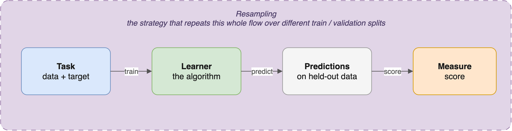

# 26  The mlr3verse framework

Code

Author

Affiliation

[Sean Davis](https://seandavi.github.io/) [](mailto:seandavi@gmail.com)

[University of Colorado  
Anschutz School of Medicine](https://medschool.cuanschutz.edu/)

Published

June 1, 2024

Modified

September 19, 2026

In the [previous chapter](../machine_learning/models.llms.md) you ran a whole tour of supervised algorithms — linear regression, k-nearest neighbours, penalized regression, decision trees, random forests — on the Palmer penguins. Each one came from a different R package with its own habits: [`lm()`](https://rdrr.io/r/stats/lm.html) wants a formula, `glmnet()` wants a matrix, `knn()` wants the training and test sets handed in separately. Swapping one algorithm for another meant rewriting the surrounding plumbing every time.

That friction is exactly what the **mlr3verse** removes. It wraps every algorithm in one consistent interface, so the question “what happens if I try a random forest instead of a tree?” becomes a one-line change instead of a rewrite. This chapter is a guided tour of the four object types that interface is built from. We’ll meet them on the same penguins you already know — predicting a bird’s **species** from its morphological measurements — so you can focus on the framework rather than on a new dataset.

## 26.1 What you’ll learn

- Explain the four core mlr3 object types — **Task**, **Learner**, **Measure**, **Resampling** — and what each one is responsible for.
- Build a classification **Task** from a data frame and read off its target and features with `task$target_names` and `task$feature_names`.
- Discover available algorithms in the **learner registry** with `mlr_learners$keys()` and create one with [`lrn()`](https://mlr3.mlr-org.com/reference/mlr_sugar.html).
- Inspect a learner’s tunable **hyperparameters** with `learner$param_set`.
- Choose a **Measure** with [`msr()`](https://mlr3.mlr-org.com/reference/mlr_sugar.html) and a **Resampling** strategy with [`rsmp()`](https://mlr3.mlr-org.com/reference/mlr_sugar.html).

## 26.2 Why a framework at all?

The R ecosystem offers dozens of machine-learning packages, each with its own interface and conventions. That diversity is powerful, but it also means you spend time relearning a new API for every algorithm and rewriting the same data-preparation code over and over. The mlr3verse fixes this by giving you one consistent, object-oriented framework that all the algorithms plug into.

The design follows a simple idea: **separate the moving parts**. Instead of one giant function that does everything from preprocessing to evaluation, mlr3 splits the workflow into four kinds of object, each with one job.

- **Tasks** hold the data and define the problem (what are we predicting?).
- **Learners** are the algorithms (how do we learn the rule?).
- **Measures** score performance (how good is the result?).
- **Resamplings** control how data is split for honest validation (did it generalize?).

> **IMPORTANT:**
>
> Think of mlr3’s four object types as the standardized, swappable components of a machine. A Task is the workpiece, a Learner is a tool head, a Measure is the gauge you check the result with, and a Resampling is the jig that holds everything for a fair test. Because every component shares the same fittings, you can pop out the decision-tree tool head and drop in a random forest without rebuilding the machine. That single design choice — common fittings everywhere — is what makes “try another algorithm” a one-line edit instead of a rewrite. Learn the four sockets once and every algorithm in the ecosystem clicks into them the same way.

The framework is built on R6 classes, which is why you’ll see the `object$method()` syntax (a dollar sign and parentheses) throughout, rather than the `function(object)` style you may be used to. It also takes reproducibility seriously: every random step can be pinned down with [`set.seed()`](https://rdrr.io/r/base/Random.html), which we’ll do whenever a step involves chance.

## 26.3 The mlr3verse ecosystem

`mlr3verse` is a meta-package: loading it pulls in a family of focused packages that build on the core. You rarely need to load them individually.

| Package | Purpose |
|----|----|
| `mlr3` | Core framework: tasks, learners, measures, resampling |
| `mlr3learners` | Interfaces to popular algorithms (random forest, glmnet, xgboost, …) |
| `mlr3pipelines` | Preprocessing and model-composition pipelines |
| `mlr3tuning` | Hyperparameter optimization |
| `mlr3measures` | Additional evaluation metrics |
| `mlr3viz` | Plotting utilities for models and results |

For this tour we only need the core ideas, all reachable through `mlr3verse`. Let’s load it along with the penguins.

``` downlit
library(mlr3verse)
library(palmerpenguins)
library(data.table)

data(penguins)
penguins <- na.omit(penguins)   # drop the few rows with missing measurements
```

We dropped the rows with missing values up front so the examples stay simple; in a real analysis you might instead impute them.

## 26.4 Tasks: the problem and the data

A **Task** bundles your data together with metadata about the problem: which column is the **target** (the answer you want to predict) and which columns are the **features** (the inputs you predict from). A *classification* task has a categorical target; a *regression* task has a continuous one. The Task also figures out feature types for you and offers helpers for filtering rows and selecting columns.

Our biological question is the same one from the previous chapter: can we predict a penguin’s **species** from its body measurements? That makes `species` the target.

``` downlit
task <- as_task_classif(penguins, target = "species")

task$nrow            # number of penguins (rows)
```

    [1] 333

``` downlit
task$ncol            # number of columns, including the target
```

    [1] 8

``` downlit
task$feature_names   # the predictor columns
```

    [1] "bill_depth_mm"     "bill_length_mm"    "body_mass_g"      
    [4] "flipper_length_mm" "island"            "sex"              
    [7] "year"             

``` downlit
task$target_names    # the column we're predicting
```

    [1] "species"

Reading that output top to bottom: the task holds 333 penguins, the `feature_names` are the morphological and contextual measurements we predict *from* (bill length and depth, flipper length, body mass, island, sex, year), and `target_names` confirms that `species` is what we’re predicting. Notice we never told mlr3 which columns were features — it took every column except the target automatically. That bookkeeping is the Task’s job, so you don’t have to track it yourself.

## 26.5 Learners: the algorithms

A **Learner** is an algorithm wrapped in the standard mlr3 interface. Every learner declares what it can do — which task types it supports, whether it tolerates missing values, and which hyperparameters it exposes — and provides the same `train()` and [`predict()`](https://rdrr.io/r/stats/predict.html) methods regardless of the maths underneath.

You discover learners through the **registry**, `mlr_learners`. Querying it for classification learners answers the practical question “what algorithms can I even try on this task?”

``` downlit
classif_learners <- mlr_learners$keys("classif")
head(classif_learners, 10)
```

     [1] "classif.cv_glmnet"   "classif.debug"       "classif.featureless"
     [4] "classif.glmnet"      "classif.kknn"        "classif.lda"        
     [7] "classif.log_reg"     "classif.multinom"    "classif.naive_bayes"
    [10] "classif.nnet"       

Each entry is the id of an algorithm you can use on a classification task — for example `classif.rpart` (a decision tree) or `classif.ranger` (a random forest). This is the menu the framework offers for our species-prediction problem.

> **NOTE:**
>
> mlr3 names learners as `[task_type].[algorithm]`. So `classif.rpart` is a decision tree for classification, while `regr.lm` is linear regression for a regression task. Once you know this scheme you can guess a learner’s name before you look it up.

Let’s create the decision-tree learner and inspect its hyperparameters — the dials you can turn to change how it learns.

``` downlit
rpart_learner <- lrn("classif.rpart")
rpart_learner$param_set$ids()   # the hyperparameters you can tune
```

     [1] "cp"             "keep_model"     "maxcompete"     "maxdepth"      
     [5] "maxsurrogate"   "minbucket"      "minsplit"       "surrogatestyle"
     [9] "usesurrogate"   "xval"          

These are `rpart`’s tuning dials. A few you’ll meet again: `cp` is the complexity penalty that controls how aggressively the tree is pruned (larger means a simpler tree), `maxdepth` caps how deep the tree may grow, and `minsplit` sets the smallest node the algorithm is willing to split. You don’t have to set any of them — the learner ships with sensible defaults — but this is where you’d reach to fight overfitting.

## 26.6 Measures: scoring the result

A **Measure** is the yardstick you use to judge predictions. The choice matters, because different measures reward different things, and the measure you optimize is the behaviour you’ll get. For classification you’ll commonly reach for accuracy or its mirror image, classification error.

``` downlit
acc_measure <- msr("classif.acc")   # accuracy: fraction predicted correctly
ce_measure  <- msr("classif.ce")    # classification error: fraction wrong (1 - accuracy)

acc_measure
```


    ── <MeasureClassifSimple> (classif.acc): Classification Accuracy ───────────────
    • Packages: mlr3 and mlr3measures
    • Range: [0, 1]
    • Minimize: FALSE
    • Average: macro
    • Parameters: list()
    • Properties: weights and obs_loss
    • Predict type: response
    • Predict sets: test
    • Aggregator: mean()

Printing a measure tells you its key facts at a glance: its id (`classif.acc`), the range of values it can take (`[0, 1]` for accuracy), and `Minimize: FALSE` — meaning for *this* measure bigger is better, so the framework knows to maximize it when tuning. Classification error would show `Minimize: TRUE`, because there you want the number as small as possible.

## 26.7 Resamplings: honest validation

The cardinal rule from the previous chapters: never judge a model on the same data it trained on. A **Resampling** object encodes *how* you split the data to keep yourself honest. The common strategies are a single **holdout** split, **k-fold cross-validation** (split into k parts, train on k−1 and test on the held-out part, rotate), and the **bootstrap** (resample with replacement many times).

``` downlit
set.seed(42)
holdout   <- rsmp("holdout", ratio = 0.8)      # 80% train, 20% test
cv5       <- rsmp("cv", folds = 5)             # 5-fold cross-validation
bootstrap <- rsmp("bootstrap", repeats = 30)   # 30 bootstrap resamples

cv5$param_set
```

    <ParamSet(1)>
           id    class lower upper nlevels        default  value
       <char>   <char> <int> <num>   <num>         <list> <list>
    1:  folds ParamInt     2   Inf     Inf <NoDefault[0]>      5

We seeded the chunk because holdout and bootstrap make random splits, and we want the same split every time the book is rebuilt. The printed `param_set` for `cv5` lists the strategy’s own settings: `folds` is the number of cross-validation folds (we set it to 5), and `repeats` is how many times the whole k-fold procedure is repeated (1 by default). Together these control the trade-off between a reliable performance estimate and how much computation it costs.

## 26.8 How the four fit together

Each object owns one part of the workflow, and they snap together in a predictable way ([Figure fig-mlr3-blocks](#fig-mlr3-blocks)): a **Learner** trains on a **Task** to produce a fitted model, that model makes predictions, a **Measure** scores those predictions, and a **Resampling** strategy wraps the whole thing so the score reflects performance on data the model has never seen. Because all learners share the same interface, swapping `classif.rpart` for `classif.ranger` changes one string and nothing else.

[](../images/mlr3_objects.png "Figure 26.1: How the four mlr3 objects fit together. The Task (data + target) feeds the Learner (the algorithm), which trains and then makes predictions on held-out samples; a Measure turns those predictions into a score. The Resampling strategy is the outer frame: it repeats the whole train→predict→score flow over different train/validation splits, so the reported score reflects performance on data the model never trained on. Because every Learner shares the same fittings, swapping one algorithm for another changes only the green block.")

Figure 26.1: How the four mlr3 objects fit together. The **Task** (data + target) feeds the **Learner** (the algorithm), which trains and then makes **predictions** on held-out samples; a **Measure** turns those predictions into a score. The **Resampling** strategy is the outer frame: it repeats the whole train→predict→score flow over different train/validation splits, so the reported score reflects performance on data the model never trained on. Because every Learner shares the same fittings, swapping one algorithm for another changes only the green block.

> **IMPORTANT:**
>
> - **Consistency** — every algorithm uses the same `train()`/[`predict()`](https://rdrr.io/r/stats/predict.html) interface, so there’s one set of habits to learn, not one per package.
> - **Flexibility** — mix and match tasks, learners, measures, and resamplings to run experiments by editing a single component.
> - **Reproducibility** — randomness is controllable, so results are repeatable.
> - **Best practices baked in** — the design nudges you toward train/test splitting and cross-validation rather than leaving them as an afterthought.

You’ve now met all four mlr3 building blocks on a problem you already understand. In the [next chapter](../machine_learning/ml_cancer.llms.md) these pieces come together on real biological data — classifying cancer types from gene expression, predicting age from DNA methylation — where you’ll see a Learner actually train on a Task and have its predictions scored by a Measure under a Resampling. The concepts are the same; only the data gets bigger and more interesting.

## 26.9 Summary

You can now:

- Name the four core mlr3 objects and the single job each one does — **Task** (data + problem), **Learner** (algorithm), **Measure** (score), **Resampling** (validation strategy).
- Build a classification Task with [`as_task_classif()`](https://mlr3.mlr-org.com/reference/as_task_classif.html) and inspect it with `task$feature_names` and `task$target_names`.
- List available algorithms with `mlr_learners$keys()`, create one with [`lrn()`](https://mlr3.mlr-org.com/reference/mlr_sugar.html), and see its tunable dials with `learner$param_set$ids()`.
- Pick a Measure with [`msr()`](https://mlr3.mlr-org.com/reference/mlr_sugar.html) and a Resampling strategy with [`rsmp()`](https://mlr3.mlr-org.com/reference/mlr_sugar.html), and read what their printouts are telling you.

The payoff is the interchangeable-parts design: learn the four sockets once, and every algorithm in the mlr3 ecosystem plugs into them the same way.

## 26.10 Exercises

These exercises reuse the penguins. Recall that in the previous chapter we also framed a **regression** problem — predicting a penguin’s `body_mass_g` from its other measurements. Let’s set that up in mlr3.

1.  **Build a regression task.** Create a regression task that predicts `body_mass_g`, using [`as_task_regr()`](https://mlr3.mlr-org.com/reference/as_task_regr.html). Confirm the target and list the features.

    > **NOTE:**
    > ``` downlit
    > task_mass <- as_task_regr(penguins, target = "body_mass_g")
    > task_mass$target_names
    > ```
    >
    >     [1] "body_mass_g"
    >
    > ``` downlit
    > task_mass$feature_names
    > ```
    >
    >     [1] "bill_depth_mm"     "bill_length_mm"    "flipper_length_mm"
    >     [4] "island"            "sex"               "species"          
    >     [7] "year"             
    >
    > [`as_task_regr()`](https://mlr3.mlr-org.com/reference/as_task_regr.html) is the regression counterpart of [`as_task_classif()`](https://mlr3.mlr-org.com/reference/as_task_classif.html). The target is now the continuous `body_mass_g`, and `species` has joined the feature list — any column that isn’t the target becomes a feature.

2.  **Find regression learners.** Query the registry for learners that work on a regression task, and show the first ten.

    > **NOTE:**
    > ``` downlit
    > regr_learners <- mlr_learners$keys("regr")
    > head(regr_learners, 10)
    > ```
    >
    >      [1] "regr.cv_glmnet"   "regr.debug"       "regr.featureless" "regr.glmnet"     
    >      [5] "regr.kknn"        "regr.km"          "regr.lm"          "regr.nnet"       
    >      [9] "regr.ranger"      "regr.rpart"      
    >
    > These are the `regr.*` algorithms — for example `regr.lm` (linear regression) and `regr.rpart` (a regression tree). The naming convention tells you each one’s task type at a glance.

3.  **Set up 10-fold cross-validation.** Create a resampling object for 10-fold cross-validation and confirm the fold count from its parameter set.

    > **NOTE:**
    > ``` downlit
    > cv10 <- rsmp("cv", folds = 10)
    > cv10$param_set$values
    > ```
    >
    >     $folds
    >     [1] 10
    >
    > `rsmp("cv", folds = 10)` builds the strategy; `param_set$values` reports the settings you actually chose, confirming `folds` is 10. More folds give a more stable estimate of performance at the cost of more computation.

4.  **Pick a regression measure.** Create the root-mean-squared-error measure with `msr("regr.rmse")` and print it. Does the framework want it minimized or maximized?

    > **NOTE:**
    > ``` downlit
    > rmse_measure <- msr("regr.rmse")
    > rmse_measure
    > ```
    >
    >
    >     ── <MeasureRegrSimple> (regr.rmse): Root Mean Squared Error ────────────────────
    >     • Packages: mlr3 and mlr3measures
    >     • Range: [0, Inf]
    >     • Minimize: TRUE
    >     • Average: macro
    >     • Parameters: list()
    >     • Properties: weights and obs_loss
    >     • Predict type: response
    >     • Predict sets: test
    >     • Aggregator: mean()
    >
    > The printout shows `Minimize: TRUE` — RMSE is an error, so smaller is better, and the framework will minimize it when comparing models. Contrast this with accuracy, which it maximizes.
