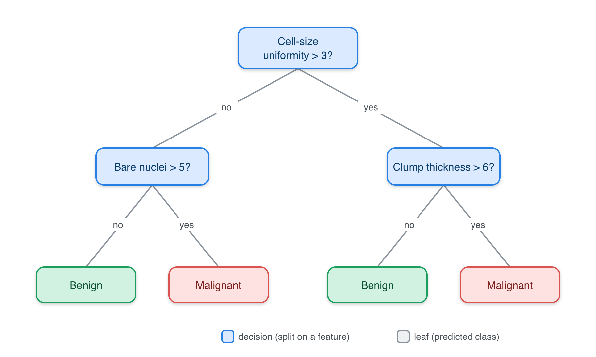
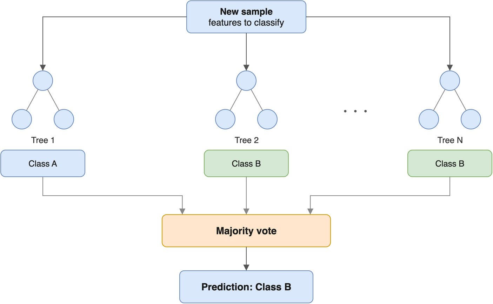

# 25  Supervised Learning

Code

Author

Affiliation

[Sean Davis](https://seandavi.github.io/) [](mailto:seandavi@gmail.com)

[University of Colorado  
Anschutz School of Medicine](https://medschool.cuanschutz.edu/)

Published

June 1, 2024

Modified

September 19, 2026

Imagine you have measured a few hundred penguins on a remote island — the length and depth of each bird’s bill, the length of its flipper. Now a new bird shows up. Can you predict its **body mass** from those measurements alone? Or guess which **species** it belongs to? That is exactly the kind of question supervised learning answers: you have examples where you know the answer, and you want a rule that predicts the answer for a new case you haven’t seen.

The same shape of problem shows up everywhere in biology. Predict a tumour’s response to a drug from its gene-expression profile. Predict a patient’s blood pressure from a panel of clinical measurements. Classify a cell as healthy or diseased from its morphology. In every case you have **features** (the inputs you measure) and a **target** (the answer you want to predict), and a pile of past examples to learn from.

In the [previous chapter](../machine_learning/intro.llms.md) we met the three paradigms of machine learning and the all-important habit of splitting data to avoid fooling ourselves. This chapter is a guided tour of the workhorse **supervised** algorithms — linear regression, k-nearest neighbours, ridge/LASSO/elastic-net, decision trees, and random forests. For each one you’ll get a plain-language intuition and a small, runnable example on a single shared dataset, so you can see the algorithms as variations on one theme rather than a zoo of unrelated tricks. (The later [mlr3verse chapter](../machine_learning/mlr3verse_intro.llms.md) shows how to run all of these through one tidy interface; here we stay close to base R so the moving parts stay visible.)

## 25.1 What you’ll learn

- Describe any supervised algorithm in terms of its **hypothesis space**, **objective function**, and **learning algorithm**.
- Fit and interpret a **linear regression** with [`lm()`](https://rdrr.io/r/stats/lm.html).
- Make predictions with **k-nearest neighbours** using [`class::knn()`](https://rdrr.io/pkg/class/man/knn.html), and explain why feature scaling matters.
- Fit **ridge**, **LASSO**, and **elastic-net** models with [`glmnet()`](https://glmnet.stanford.edu/reference/glmnet.html), and read off which features each one keeps.
- Grow and read a **decision tree** with `rpart`, and a **random forest** with `ranger`.

## 25.2 A framework for understanding supervised algorithms

Every supervised algorithm in this chapter — and almost every one you’ll meet elsewhere — can be taken apart into the same three pieces. Once you can name those three pieces for an algorithm, you understand most of what makes it tick, and you can compare any two algorithms cleanly.

> **IMPORTANT:**
>
> 1.  **Hypothesis space (the model family).** The set of all candidate models the algorithm is allowed to consider. For linear regression it’s “all straight lines”; for a decision tree it’s “all branching yes/no rule sets.” This choice bakes in an assumption — a *bias* — about what the answer can look like.
>
> 2.  **Objective function (the goal).** A number that says how *good* a candidate model is on the training data — usually how badly it errs, so smaller is better. For regression that’s often the *mean squared error*. Learning means finding the model that makes this number as small as possible.
>
> 3.  **Learning algorithm (the optimiser).** The actual procedure that searches the hypothesis space for the model with the best objective value. Sometimes it’s a one-shot formula (ordinary linear regression); sometimes it’s a long iterative grind (neural networks).

Here’s the payoff of this framing. Ridge and LASSO regression, which we’ll meet shortly, use the *same* hypothesis space and *same* style of optimiser as plain linear regression. The *only* thing they change is the objective function — they add a penalty for being too complicated. That one small change is what lets them avoid overfitting. Keep the three pillars in mind and each new algorithm becomes a small variation, not a whole new world.

## 25.3 Our shared dataset: Palmer penguins

To keep the tour concrete, we’ll use one small, friendly biological dataset throughout: measurements of penguins from three species on islands in the Palmer Archipelago, Antarctica. It lives in the `palmerpenguins` package.

``` downlit
library(palmerpenguins)
library(dplyr)

penguins_clean <- penguins |>
  na.omit()            # drop the handful of rows with missing measurements

glimpse(penguins_clean)
```

    Rows: 333
    Columns: 8
    $ species           <fct> Adelie, Adelie, Adelie, Adelie, Adelie, Adelie, Adel…
    $ island            <fct> Torgersen, Torgersen, Torgersen, Torgersen, Torgerse…
    $ bill_length_mm    <dbl> 39.1, 39.5, 40.3, 36.7, 39.3, 38.9, 39.2, 41.1, 38.6…
    $ bill_depth_mm     <dbl> 18.7, 17.4, 18.0, 19.3, 20.6, 17.8, 19.6, 17.6, 21.2…
    $ flipper_length_mm <int> 181, 186, 195, 193, 190, 181, 195, 182, 191, 198, 18…
    $ body_mass_g       <int> 3750, 3800, 3250, 3450, 3650, 3625, 4675, 3200, 3800…
    $ sex               <fct> male, female, female, female, male, female, male, fe…
    $ year              <int> 2007, 2007, 2007, 2007, 2007, 2007, 2007, 2007, 2007…

Each row is one bird. We’ll use two prediction problems throughout:

- **Regression:** predict `body_mass_g` (a continuous number) from the body measurements.
- **Classification:** predict `species` (one of three categories) from the same measurements.

As we insisted in the previous chapter, we never judge a model on the same data we trained it on. So let’s split once, here, into a **training** set and a **test** set, and reuse that split for every algorithm.

``` downlit
set.seed(42)
n <- nrow(penguins_clean)
train_idx <- sample(seq_len(n), size = 0.7 * n)   # 70% for training
train <- penguins_clean[train_idx, ]
test  <- penguins_clean[-train_idx, ]
c(train = nrow(train), test = nrow(test))
```

    train  test 
      233   100 

We now have 233 birds to learn from and 100 held back to test on honestly.

## 25.4 Linear regression

**Plain-language intuition.** Linear regression draws the best straight-line relationship between your features and a continuous target. “Best” means the line that makes the total squared prediction error as small as possible. Each feature gets a *coefficient* — a slope — telling you how much the target changes when that feature goes up by one unit. It is the simplest, most interpretable model in the toolbox, and a sensible first thing to try.

In the language of the three pillars: the hypothesis space is “all straight-line combinations of the features,” the objective function is the sum of squared errors ([Equation eq-sum-of-squares](#eq-sum-of-squares)), and the learning algorithm is a tidy formula that R solves instantly.

\\L = \sum\_{i=1}^{n}{(\hat{y}\_i - y_i)}^2 \tag{25.1}\\

Here \\\hat{y}\_i\\ is the predicted value, \\y_i\\ is the true value, and \\n\\ is the number of observations. Let’s predict penguin body mass from flipper length and bill dimensions:

``` downlit
fit_lm <- lm(body_mass_g ~ flipper_length_mm + bill_length_mm + bill_depth_mm,
             data = train)
coef(fit_lm)
```

          (Intercept) flipper_length_mm    bill_length_mm     bill_depth_mm 
          -6359.49030          50.52663           1.88153          18.08102 

Read the coefficients as “holding the others fixed, one extra millimetre of flipper length is associated with about 51 grams more body mass.” That is the chief virtue of linear regression: the model *is* its explanation.

Now the honest test — how far off are the predictions on the held-out birds? We summarise that with the **root mean squared error** (RMSE), roughly the typical prediction error in grams:

``` downlit
pred_lm <- predict(fit_lm, newdata = test)
rmse <- function(actual, predicted) sqrt(mean((actual - predicted)^2))
rmse(test$body_mass_g, pred_lm)
```

    [1] 387.8589

So the model’s predictions are typically off by around that many grams — for birds weighing 3,000–6,000 g, not bad for three measurements and a straight line.

## 25.5 K-nearest neighbours

**Plain-language intuition.** k-nearest neighbours (k-NN) is the “you are who your neighbours are” algorithm. To predict the answer for a new penguin, it finds the *k* most similar penguins in the training data — the ones closest to it in measurement space — and lets them vote. For classification, the new bird is assigned the most common species among its *k* neighbours. For regression, it gets the average of their values.

k-NN is unusual: it has no real “training” step and no equation to fit. It just stores the data and measures distances at prediction time. Its one knob is *k*: a small *k* (say 1) follows every wiggle in the data and can overfit; a large *k* smooths things out and can underfit. *k* is a **hyperparameter** you tune, exactly like we discussed in the previous chapter.

> **WARNING:**
>
> k-NN decides “closeness” using distance, so a feature measured in large numbers will dominate one measured in small numbers — purely because of its units, not its importance. Flipper length (≈ 200 mm) would swamp bill depth (≈ 17 mm) if we left them as-is. The fix is to **standardise** every feature to a common scale before computing distances. Forgetting this is the single most common k-NN mistake.

Let’s classify penguin **species** from the three measurements. We standardise using the training set’s mean and standard deviation, then apply the *same* shift and scale to the test set:

``` downlit
library(class)

features <- c("flipper_length_mm", "bill_length_mm", "bill_depth_mm")

train_means <- colMeans(train[features])
train_sds   <- apply(train[features], 2, sd)

scale_with <- function(df) scale(df[features], center = train_means, scale = train_sds)
train_x <- scale_with(train)
test_x  <- scale_with(test)

set.seed(42)
knn_pred <- knn(train = train_x, test = test_x, cl = train$species, k = 5)

mean(knn_pred == test$species)   # accuracy: fraction classified correctly
```

    [1] 0.98

With `k = 5` neighbours, k-NN gets the species right for the large majority of held-out birds. The three penguin species really do cluster into distinct regions of measurement space, which is exactly the situation where “ask your neighbours” works beautifully.

## 25.6 Penalized regression

Plain linear regression has a weakness: when you have many features — especially more features than observations, the common situation in genomics — it can chase noise and overfit. **Penalized regression** fixes this by tweaking the *objective function* (pillar two). It keeps the usual squared-error term but bolts on a **penalty** that grows as the coefficients get large, so the fitting procedure now has to balance two goals at once: fit the data well *and* keep the coefficients small. The net effect is a model that is pressured to stay simple.

A single dial, **lambda** (\\\lambda\\), sets how hard that pressure pushes. When \\\lambda = 0\\ the penalty vanishes and you are back to ordinary linear regression; as \\\lambda\\ grows, the coefficients are squeezed ever harder toward zero. The three methods below — ridge, LASSO, and elastic net — share this idea and differ only in the *shape* of the penalty they add.

We’ll fit all three with the `glmnet` package. `glmnet` does not take a formula; it wants a numeric **matrix** of features `x` and a response vector `y`. The [`model.matrix()`](https://rdrr.io/r/stats/model.matrix.html) step below builds that matrix (and drops the intercept column with `[, -1]`):

``` downlit
library(glmnet)

x_train <- model.matrix(body_mass_g ~ flipper_length_mm + bill_length_mm +
                           bill_depth_mm, data = train)[, -1]
y_train <- train$body_mass_g

x_test <- model.matrix(body_mass_g ~ flipper_length_mm + bill_length_mm +
                          bill_depth_mm, data = test)[, -1]
y_test <- test$body_mass_g
```

### 25.6.1 Ridge regression

**Plain-language intuition.** Ridge uses an **L2 penalty**: the sum of the *squared* coefficients ([Equation eq-ridge](#eq-ridge)). Because squaring punishes large coefficients much more than small ones, ridge pulls every coefficient toward zero but never lets any of them land exactly *on* zero. Every feature therefore survives — ridge simply turns down their volume rather than dropping any. That makes it a good fit when you suspect many features each carry a little of the signal.

\\L = \sum\_{i=1}^{n}{(\hat{y}\_i - y_i)}^2 + \lambda\sum\_{j=1}^{k} \beta_j^2 \tag{25.2}\\

In `glmnet`, ridge is `alpha = 0`. We use [`cv.glmnet()`](https://glmnet.stanford.edu/reference/cv.glmnet.html) to let cross-validation pick a good \\\lambda\\ automatically:

``` downlit
set.seed(42)
fit_ridge <- cv.glmnet(x_train, y_train, alpha = 0)

coef(fit_ridge, s = "lambda.min")
```

    4 x 1 sparse Matrix of class "dgCMatrix"
                       lambda.min
    (Intercept)       -4592.10682
    flipper_length_mm    41.68954
    bill_length_mm       13.28295
    bill_depth_mm       -10.47499

Notice that all three coefficients are present and non-zero — ridge shrank them but kept them. Its test error:

``` downlit
pred_ridge <- predict(fit_ridge, newx = x_test, s = "lambda.min")
rmse(y_test, pred_ridge)
```

    [1] 396.0116

### 25.6.2 LASSO regression

**Plain-language intuition.** LASSO (Least Absolute Shrinkage and Selection Operator) swaps in an **L1 penalty**: the sum of the *absolute* coefficients ([Equation eq-lasso](#eq-lasso)). Switching from squares to absolute values sounds like a minor change, but it has a dramatic consequence — the L1 penalty can drive a coefficient *all the way* to zero, which is the same as striking that feature out of the model entirely. LASSO therefore performs **automatic feature selection**, leaving you with a leaner model built only from the features that pull their weight.

\\L = \sum\_{i=1}^{n}{(\hat{y}\_i - y_i)}^2 + \lambda\sum\_{j=1}^{k} \|\beta_j\| \tag{25.3}\\

LASSO is `alpha = 1` in `glmnet`:

``` downlit
set.seed(42)
fit_lasso <- cv.glmnet(x_train, y_train, alpha = 1)

coef(fit_lasso, s = "lambda.min")
```

    4 x 1 sparse Matrix of class "dgCMatrix"
                        lambda.min
    (Intercept)       -5499.365152
    flipper_length_mm    47.897811
    bill_length_mm        1.414023
    bill_depth_mm         .       

Any coefficient shown as `.` has been zeroed out and dropped. With only three strong features here, LASSO may keep all of them — but on a genomics dataset with thousands of features, this is how you go from “20,000 genes” to “the handful that actually predict the outcome.”

> **TIP:**
>
> Neither always wins. LASSO shines when a few features carry the signal and the rest are noise (so zeroing them helps). Ridge shines when *many* features each contribute a bit. When you’re unsure — which is most of the time — fit both with cross-validation and compare their test error, exactly as we’re doing here.

### 25.6.3 Elastic net

**Plain-language intuition.** Why choose? Elastic net **blends** the L1 and L2 penalties, so it can zero out useless features (the LASSO trick) *while* gracefully handling groups of correlated features (the ridge strength). When two features are highly correlated, pure LASSO tends to arbitrarily keep one and drop the other; elastic net is happier keeping both, which is common and useful in biology where genes in the same pathway move together.

The mixing dial is `alpha`, between 0 and 1: `alpha = 0` is pure ridge, `alpha = 1` is pure LASSO, and anything in between is elastic net. Let’s use a 50/50 blend, `alpha = 0.5`:

``` downlit
set.seed(42)
fit_enet <- cv.glmnet(x_train, y_train, alpha = 0.5)

coef(fit_enet, s = "lambda.min")
```

    4 x 1 sparse Matrix of class "dgCMatrix"
                        lambda.min
    (Intercept)       -6166.200623
    flipper_length_mm    49.790369
    bill_length_mm        2.389242
    bill_depth_mm        14.153060

``` downlit
pred_enet <- predict(fit_enet, newx = x_test, s = "lambda.min")
rmse(y_test, pred_enet)
```

    [1] 388.1342

Elastic net gives you a coefficient profile somewhere between ridge’s “keep everything, shrunk” and LASSO’s “keep a few.” On this small three-feature problem all four regression models land in roughly the same place; the penalized methods earn their keep when features are many and correlated.

## 25.7 Classification and regression trees (CART)

**Plain-language intuition.** A decision tree predicts by asking a series of simple yes/no questions about the features, like a flow chart or the game of Twenty Questions. “Is the flipper longer than 206 mm? If yes, is the bill deeper than 17 mm?” Each question splits the data into purer and purer groups, until a final **leaf** gives the prediction — the majority species (for classification) or the average value (for regression).

In three-pillar terms: the hypothesis space is “all such question trees,” the objective at each split is to make the resulting groups as *pure* as possible (measured by the Gini index or entropy), and the learning algorithm greedily picks the best split at each step. Trees are prized because you can *read* them — they match how people naturally reason.

We’ll grow a classification tree for species with `rpart` (which ships with R):

``` downlit
library(rpart)

set.seed(42)
fit_tree <- rpart(species ~ flipper_length_mm + bill_length_mm + bill_depth_mm,
                  data = train, method = "class")

tree_pred <- predict(fit_tree, newdata = test, type = "class")
mean(tree_pred == test$species)   # test accuracy
```

    [1] 0.94

The tree learned a short list of measurement thresholds that separate the species, and it classifies the held-out birds with high accuracy. We can even print the learned rules:

``` downlit
fit_tree
```

    n= 233 

    node), split, n, loss, yval, (yprob)
          * denotes terminal node

    1) root 233 131 Adelie (0.43776824 0.19742489 0.36480687)  
      2) flipper_length_mm< 206.5 142  42 Adelie (0.70422535 0.29577465 0.00000000)  
        4) bill_length_mm< 44.2 101   3 Adelie (0.97029703 0.02970297 0.00000000) *
        5) bill_length_mm>=44.2 41   2 Chinstrap (0.04878049 0.95121951 0.00000000) *
      3) flipper_length_mm>=206.5 91   6 Gentoo (0.02197802 0.04395604 0.93406593)  
        6) bill_depth_mm>=17.2 7   3 Chinstrap (0.28571429 0.57142857 0.14285714) *
        7) bill_depth_mm< 17.2 84   0 Gentoo (0.00000000 0.00000000 1.00000000) *

[Figure fig-decision-tree](#fig-decision-tree) shows the same idea drawn out for a clinical example: each internal node tests one feature, and following the branches leads to a leaf with a predicted class.

[](../images/decision_tree.png "Figure 25.1: A classification tree for a breast-cancer screening example. Each internal (blue) node tests one feature; following the branch that matches a sample leads, eventually, to a leaf (green/red) that gives the predicted class.")

Figure 25.1: A classification tree for a breast-cancer screening example. Each internal (blue) node tests one feature; following the branch that matches a sample leads, eventually, to a leaf (green/red) that gives the predicted class.

> **WARNING:**
>
> Decision trees have a real flaw: they’re **unstable**. Change a few training rows and you can get a noticeably different tree. A single deep tree also overfits easily. The fix — averaging many trees together — is exactly the idea behind random forests, next.

## 25.8 Random forests

**Plain-language intuition.** If one decision tree is twitchy, build *hundreds* of them and let them vote. A **random forest** grows many trees, each on a random bootstrap sample of the data and each allowed to consider only a random subset of features at every split. That deliberate randomness makes the individual trees disagree in their mistakes — and when you average many imperfect-but-different predictions, the errors cancel out. The result is far more stable and accurate than any single tree, while needing very little tuning. [Figure fig-random-forest](#fig-random-forest) sketches the idea: many trees, one combined vote.

[](../images/random_forest.png "Figure 25.2: Graphical representation of a random forest. The same new sample is dropped through many decision trees, each grown on a slightly different random view of the training data, so the trees disagree in their mistakes. Each tree casts a class vote, and a majority vote across all the trees becomes the forest’s final prediction — here two of the three shown trees vote “Class B,” so that wins. Averaging many imperfect-but-different trees this way is far more stable than trusting any single tree.")

Figure 25.2: Graphical representation of a random forest. The same new sample is dropped through many decision trees, each grown on a slightly different random view of the training data, so the trees disagree in their mistakes. Each tree casts a class vote, and a **majority vote** across all the trees becomes the forest’s final prediction — here two of the three shown trees vote “Class B,” so that wins. Averaging many imperfect-but-different trees this way is far more stable than trusting any single tree.

We’ll use the fast `ranger` package. Random forests are randomised, so we set a seed for a reproducible result:

``` downlit
library(ranger)

set.seed(42)
fit_rf <- ranger(species ~ flipper_length_mm + bill_length_mm + bill_depth_mm,
                 data = train)

rf_pred <- predict(fit_rf, data = test)$predictions
mean(rf_pred == test$species)   # test accuracy
```

    [1] 0.97

The forest typically matches or beats the single tree on the held-out birds, with no manual tuning — which is exactly why random forests are such a popular, reliable default for tabular biological data.

## 25.9 Summary

You now have a working map of the supervised-learning landscape, and you’ve run every algorithm on it with your own hands:

- Every algorithm is a **hypothesis space** + an **objective function** + a **learning algorithm**. Name those three and you understand it.
- **Linear regression** ([`lm()`](https://rdrr.io/r/stats/lm.html)) fits an interpretable straight-line model; coefficients tell you how each feature moves the target.
- **k-nearest neighbours** ([`class::knn()`](https://rdrr.io/pkg/class/man/knn.html)) predicts from the most similar training examples — remember to **scale** your features first.
- **Penalized regression** ([`glmnet()`](https://glmnet.stanford.edu/reference/glmnet.html)) adds a complexity penalty to fight overfitting: **ridge** (`alpha = 0`) shrinks all coefficients, **LASSO** (`alpha = 1`) zeroes some out for feature selection, and **elastic net** (`0 < alpha < 1`) blends the two.
- **Decision trees** (`rpart`) are readable flow charts but unstable on their own; **random forests** (`ranger`) average many trees into a stable, accurate, low-fuss predictor.

In every case we trained on one split and judged on a held-out split — the habit that keeps you honest. The next chapters show how to run all of these through the unified `mlr3verse` interface, so swapping one algorithm for another becomes a one-line change.

## 25.10 Exercises

1.  **A simpler linear model.** Refit the linear regression for `body_mass_g` using *only* `flipper_length_mm`. Compute its test RMSE and compare it to the three-feature model. Did dropping two features hurt much?

    > **NOTE:**
    > ``` downlit
    > fit_simple <- lm(body_mass_g ~ flipper_length_mm, data = train)
    > pred_simple <- predict(fit_simple, newdata = test)
    > rmse(test$body_mass_g, pred_simple)
    > ```
    >
    >     [1] 389.7472
    >
    > Flipper length alone is a strong predictor of body mass, so the simpler model is usually only a little worse. That’s a useful reminder: more features are not automatically better.

2.  **Tuning k in k-NN.** Try `k = 1`, `k = 5`, and `k = 25` for the species classifier. Which gives the best test accuracy? What goes wrong at the extremes?

    > **NOTE:**
    > ``` downlit
    > set.seed(42)
    > for (k in c(1, 5, 25)) {
    >   pred_k <- knn(train = train_x, test = test_x, cl = train$species, k = k)
    >   cat("k =", k, " accuracy =", round(mean(pred_k == test$species), 3), "\n")
    > }
    > ```
    >
    >     k = 1  accuracy = 0.98 
    >     k = 5  accuracy = 0.98 
    >     k = 25  accuracy = 0.96 
    >
    > Very small `k` (like 1) follows noise and can overfit; very large `k` blurs the class boundaries and underfits. A middle value usually wins — which is why `k` is a hyperparameter worth tuning.

3.  **Watch LASSO select.** Push the LASSO penalty up by using `lambda.1se` (a more aggressive, simpler model) instead of `lambda.min`, and look at the coefficients. Are any features dropped?

    > **NOTE:**
    > ``` downlit
    > coef(fit_lasso, s = "lambda.1se")
    > ```
    >
    >     4 x 1 sparse Matrix of class "dgCMatrix"
    >                       lambda.1se
    >     (Intercept)       -4070.4745
    >     flipper_length_mm    41.1108
    >     bill_length_mm        .     
    >     bill_depth_mm         .     
    >
    > `lambda.1se` is the largest penalty whose error is still within one standard error of the best — a deliberately simpler model. Any coefficient printed as `.` has been set to exactly zero and removed. With strong features here it may keep them all, but the mechanism is the same one that prunes thousands of genes down to a few.

4.  **Feature importance from the forest.** Refit the random forest with `importance = "impurity"` and print `fit_rf$variable.importance`. Which measurement matters most for telling the species apart?

    > **NOTE:**
    > ``` downlit
    > set.seed(42)
    > fit_rf_imp <- ranger(species ~ flipper_length_mm + bill_length_mm + bill_depth_mm,
    >                      data = train, importance = "impurity")
    > sort(fit_rf_imp$variable.importance, decreasing = TRUE)
    > ```
    >
    >        bill_length_mm flipper_length_mm     bill_depth_mm 
    >              58.71576          47.88220          40.17413 
    >
    > The feature with the largest importance score contributed most to splitting the species apart across the forest’s trees. Importance scores are one of the friendliest things random forests give you — a ranked list of which measurements carry the signal.

5.  **Regression, three ways.** You have test RMSE for linear regression, ridge, and elastic net. Compute it for LASSO too, then state which model you’d ship and why.

    > **NOTE:**
    > ``` downlit
    > pred_lasso <- predict(fit_lasso, newx = x_test, s = "lambda.min")
    > c(linear = rmse(y_test, pred_lm),
    >   ridge  = rmse(y_test, pred_ridge),
    >   lasso  = rmse(y_test, pred_lasso),
    >   enet   = rmse(y_test, pred_enet))
    > ```
    >
    >       linear    ridge    lasso     enet 
    >     387.8589 396.0116 390.8471 388.1342 
    >
    > On this small, low-dimensional problem the four are nearly tied, so you’d pick the simplest and most interpretable — plain linear regression. The penalized methods pull ahead only when features are numerous and correlated, as in real genomic data.
