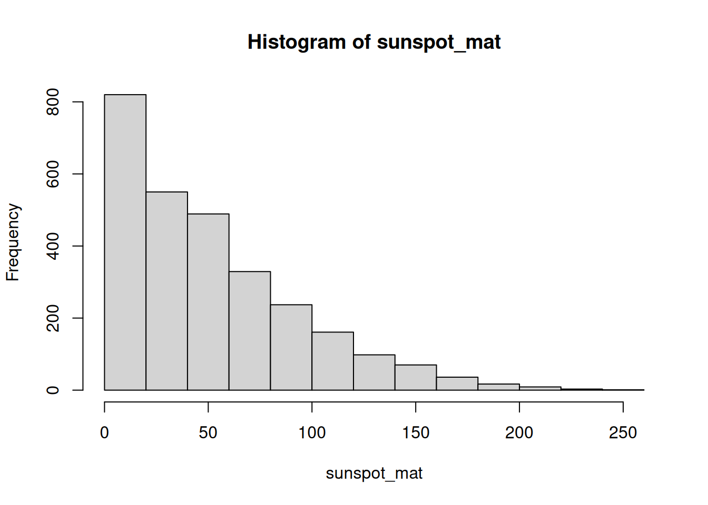
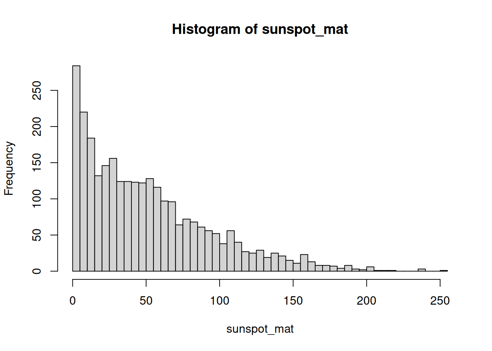
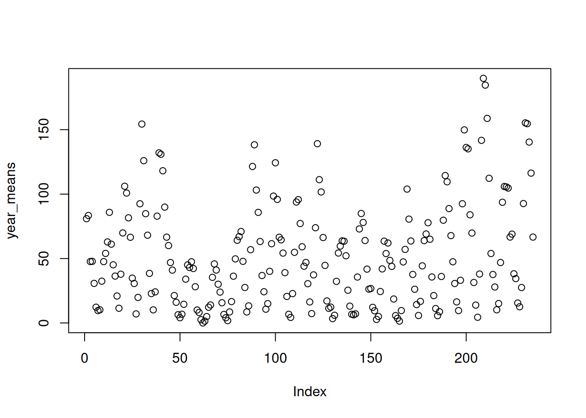
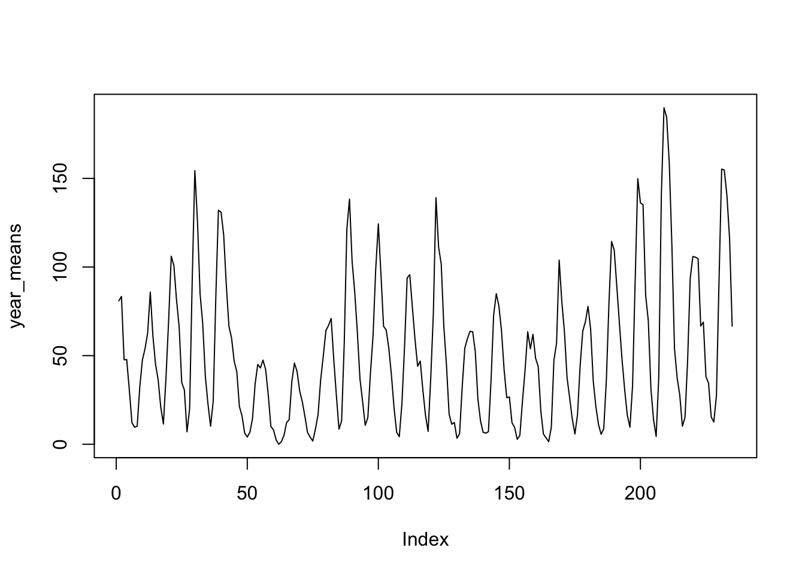

# 11  Matrices

Code

Author

Affiliation

[Sean Davis](https://seandavi.github.io/) [](mailto:seandavi@gmail.com)

[University of Colorado  
Anschutz School of Medicine](https://medschool.cuanschutz.edu/)

Published

June 1, 2024

Modified

September 19, 2026

Picture the result of a genomics experiment: you measured the activity of twenty thousand genes across a dozen samples. The natural way to hold that is a grid — one row per gene, one column per sample, a number in every cell. That grid is a **matrix**, and it is the central object you’ll meet again and again in genomics. The gene-expression matrix you build here is the same shape that later powers a `SummarizedExperiment`, so the moves you learn now pay off for the rest of the book.

A matrix is just a rectangle of values that are **all the same type** — all numbers, all characters, or all logicals (see [Figure fig-datastructures_schematic](#fig-datastructures_schematic)). You can read it as a stack of columns (each column a vector of the same length and type) or as a stack of rows. If you’ve already met vectors, a matrix is the natural next step: take several vectors of equal length and the same type, and line them up side by side.

[](images/datastructures_schematic.png "Figure 11.1: A matrix is a collection of column vectors, all the same length and the same type.")

Figure 11.1: A matrix is a collection of column vectors, all the same length and the same type.

> **NOTE:**
>
> A *data frame* is also a rectangle, and it’s easy to confuse the two. The difference is one rule: a matrix needs every value to be the **same type**, while a data frame lets each **column** have its own type — numbers in one, text in another. Use a matrix when your whole grid is numeric (like expression values); reach for a data frame when columns mix types (a sample table with names, ages, and treatment labels). The two even name their rows and columns differently under the hood, which is a classic source of confusion — but that’s a problem for the data-frame chapter, not this one.

## 11.1 What you’ll learn

- Build a matrix with [`matrix()`](https://rdrr.io/r/base/matrix.html), [`rbind()`](https://rdrr.io/r/base/cbind.html), and [`cbind()`](https://rdrr.io/r/base/cbind.html).
- Inspect a matrix’s shape and labels with [`dim()`](https://rdrr.io/r/base/dim.html), [`nrow()`](https://rdrr.io/r/base/nrow.html), [`ncol()`](https://rdrr.io/r/base/nrow.html), [`rownames()`](https://rdrr.io/r/base/colnames.html), and [`colnames()`](https://rdrr.io/r/base/colnames.html).
- Pull out elements, rows, and columns with `[row, col]` indexing.
- Change values in part of a matrix by combining subsetting with assignment.
- Summarize across rows and columns with [`rowMeans()`](https://rdrr.io/r/base/colSums.html), [`colMeans()`](https://rdrr.io/r/base/colSums.html), and [`apply()`](https://rdrr.io/r/base/apply.html) — the per-gene and per-sample summaries you’ll use constantly in genomics.

## 11.2 Creating a matrix

There are many ways to build a matrix in R. The most direct is the [`matrix()`](https://rdrr.io/r/base/matrix.html) function. Below we pour the numbers `1:16` into a four-row grid.

``` downlit
mat1 <- matrix(1:16, nrow = 4)
mat1
```

         [,1] [,2] [,3] [,4]
    [1,]    1    5    9   13
    [2,]    2    6   10   14
    [3,]    3    7   11   15
    [4,]    4    8   12   16

By default R fills the matrix **column by column** — walk down the first column, then the second, and so on. If you’d rather fill it row by row, set `byrow = TRUE`.

``` downlit
mat1 <- matrix(1:16, nrow = 4, byrow = TRUE)
mat1
```

         [,1] [,2] [,3] [,4]
    [1,]    1    2    3    4
    [2,]    5    6    7    8
    [3,]    9   10   11   12
    [4,]   13   14   15   16

Look closely at where the numbers land. Same sixteen values, same shape, but a completely different arrangement. Whenever you create a matrix from a flat vector, ask yourself which direction it filled.

We can also assemble a matrix from parts by *binding* vectors together. Let’s make two numeric vectors of length 10.

``` downlit
gene_a <- 1:10
gene_b <- rnorm(10)
```

Both are numeric and both have length 10, so they can sit together in a matrix. [`rbind()`](https://rdrr.io/r/base/cbind.html) stacks them as **r**ows (think “r for row”):

``` downlit
mat <- rbind(gene_a, gene_b)
mat
```

                 [,1]      [,2]       [,3]     [,4]      [,5]       [,6]      [,7]
    gene_a  1.0000000 2.0000000  3.0000000 4.000000 5.0000000  6.0000000 7.0000000
    gene_b -0.6264538 0.1836433 -0.8356286 1.595281 0.3295078 -0.8204684 0.4874291
                [,8]      [,9]      [,10]
    gene_a 8.0000000 9.0000000 10.0000000
    gene_b 0.7383247 0.5757814 -0.3053884

The companion function [`cbind()`](https://rdrr.io/r/base/cbind.html) glues vectors together as **c**olumns:

``` downlit
mat <- cbind(gene_a, gene_b)
mat
```

          gene_a     gene_b
     [1,]      1 -0.6264538
     [2,]      2  0.1836433
     [3,]      3 -0.8356286
     [4,]      4  1.5952808
     [5,]      5  0.3295078
     [6,]      6 -0.8204684
     [7,]      7  0.4874291
     [8,]      8  0.7383247
     [9,]      9  0.5757814
    [10,]     10 -0.3053884

Notice that R kept the vector names — `gene_a` and `gene_b` — as labels. Row and column names are worth their weight in gold once they carry real meaning, like gene identifiers or sample names. You can read them back at any time:

``` downlit
rownames(mat)
```

    NULL

``` downlit
colnames(mat)
```

    [1] "gene_a" "gene_b"

And you can set them by assigning a vector of valid names:

``` downlit
colnames(mat) <- c("control", "treated")
colnames(mat)
```

    [1] "control" "treated"

``` downlit
mat
```

          control    treated
     [1,]       1 -0.6264538
     [2,]       2  0.1836433
     [3,]       3 -0.8356286
     [4,]       4  1.5952808
     [5,]       5  0.3295078
     [6,]       6 -0.8204684
     [7,]       7  0.4874291
     [8,]       8  0.7383247
     [9,]       9  0.5757814
    [10,]      10 -0.3053884

Every matrix also knows its own shape. [`dim()`](https://rdrr.io/r/base/dim.html) reports rows then columns; [`nrow()`](https://rdrr.io/r/base/nrow.html) and [`ncol()`](https://rdrr.io/r/base/nrow.html) pull out one each.

``` downlit
dim(mat)
```

    [1] 10  2

``` downlit
nrow(mat)
```

    [1] 10

``` downlit
ncol(mat)
```

    [1] 2

## 11.3 Accessing elements of a matrix

Indexing a matrix works like indexing a vector, except now you give **two** coordinates: the row first, then the column. The pattern is `mat[r, c]`, where `r` and `c` say which rows and columns you want.

> **IMPORTANT:**
>
> In R, the first element, row, or column is number **1** — not 0. If you’ve written Python, C, or Java, this will trip you up, because those languages count from 0. Reaching for the wrong starting index is one of the most common beginner mistakes, and the worst kind: it often doesn’t error, it just quietly hands you the wrong value.

Let’s pull various pieces out of `mat`:

``` downlit
# the value in row 1, column 2
mat[1, 2]
```

       treated 
    -0.6264538 

``` downlit
# the entire first ROW (leave the column slot empty)
mat[1, ]
```

       control    treated 
     1.0000000 -0.6264538 

``` downlit
# the entire first COLUMN (leave the row slot empty)
mat[, 1]
```

     [1]  1  2  3  4  5  6  7  8  9 10

Leaving a slot blank means “give me all of them.” So `mat[1, ]` is the whole first row and `mat[, 1]` is the whole first column. There’s one more form worth knowing — a single index with **no comma**:

``` downlit
# every value greater than 4; note: no comma
mat[mat > 4]
```

    [1]  5  6  7  8  9 10

> **WARNING:**
>
> When you index with a single subscript and no comma, R forgets the rectangle and treats the matrix as one long vector, returning a flat result. That’s handy for “give me all the big values,” but it’s also a trap: code that *looks* like it should respect rows and columns may silently flatten your matrix instead. Whenever you mean a row or a column, include the comma.

You can also *exclude* rows or columns by prefixing the index with a minus sign:

``` downlit
mat[, -1]        # drop the first column
```

     [1] -0.6264538  0.1836433 -0.8356286  1.5952808  0.3295078 -0.8204684
     [7]  0.4874291  0.7383247  0.5757814 -0.3053884

``` downlit
mat[-c(1:5), ]   # drop the first five rows
```

         control    treated
    [1,]       6 -0.8204684
    [2,]       7  0.4874291
    [3,]       8  0.7383247
    [4,]       9  0.5757814
    [5,]      10 -0.3053884

## 11.4 Changing values in a matrix

Let’s make a fresh matrix of random values to experiment on — pretend it’s a small expression matrix with measurements drawn from a normal distribution.

``` downlit
expr <- matrix(rnorm(20), nrow = 10)
summary(expr)
```

           V1                 V2           
     Min.   :-2.21470   Min.   :-1.989352  
     1st Qu.:-0.03775   1st Qu.:-0.397561  
     Median : 0.49187   Median : 0.009218  
     Mean   : 0.24884   Mean   :-0.133673  
     3rd Qu.: 0.91318   3rd Qu.: 0.569355  
     Max.   : 1.51178   Max.   : 0.918977  

Arithmetic on a matrix behaves much like arithmetic on a vector. Multiplying by a single number scales every cell at once:

``` downlit
# multiply every value by 20
expr2 <- expr * 20
summary(expr2)
```

           V1                V2          
     Min.   :-44.294   Min.   :-39.7870  
     1st Qu.: -0.755   1st Qu.: -7.9512  
     Median :  9.837   Median :  0.1844  
     Mean   :  4.977   Mean   : -2.6735  
     3rd Qu.: 18.264   3rd Qu.: 11.3871  
     Max.   : 30.236   Max.   : 18.3795  

By combining subsetting with assignment, you can rewrite just *part* of a matrix. Here we bump up only the first column:

``` downlit
# add 100 to the first column of expr2
expr2[, 1] <- expr2[, 1] + 100
summary(expr2)
```

           V1               V2          
     Min.   : 55.71   Min.   :-39.7870  
     1st Qu.: 99.25   1st Qu.: -7.9512  
     Median :109.84   Median :  0.1844  
     Mean   :104.98   Mean   : -2.6735  
     3rd Qu.:118.26   3rd Qu.: 11.3871  
     Max.   :130.24   Max.   : 18.3795  

A common reshaping move is to **transpose** — flip rows into columns and vice versa with [`t()`](https://rdrr.io/r/base/t.html). You’ll need this surprisingly often: a lab instrument might write samples in rows and genes in columns, while Bioconductor expects genes in rows and samples in columns. One call sets it right.

``` downlit
t(expr2)
```

              [,1]      [,2]     [,3]      [,4]      [,5]      [,6]     [,7]
    [1,] 130.23562 107.79686 87.57519  55.70600 122.49862 99.101328 99.67619
    [2,]  18.37955  15.64273  1.49130 -39.78703  12.39651 -1.122575 -3.11591
              [,8]       [,9]      [,10]
    [1,] 118.87672 116.424424 111.878026
    [2,] -29.41505  -9.563001   8.358831

## 11.5 Calculations on matrix rows and columns

For this section we need a matrix to play with. We’ll use [`rnorm()`](https://rdrr.io/r/stats/Normal.html) again, but ask for values centered at 5 with a standard deviation of 2 — the two extra arguments are the mean and the spread.

``` downlit
expr3 <- matrix(rnorm(100, 5, 2), ncol = 10)
```

Because these values come from a normal distribution centered at 5, any single column (or row) should have a mean near 5 and a standard deviation near 2. Let’s check the first column, then the first row:

``` downlit
mean(expr3[, 1])
```

    [1] 5.24146

``` downlit
sd(expr3[, 1])
```

    [1] 1.617129

``` downlit
# now a row
mean(expr3[1, ])
```

    [1] 5.319228

``` downlit
sd(expr3[1, ])
```

    [1] 2.047589

Computing one summary at a time gets tedious fast. R gives you convenience functions that sweep across **all** the rows or **all** the columns at once. In a gene-expression matrix, [`rowMeans()`](https://rdrr.io/r/base/colSums.html) is the average expression *per gene* and [`colMeans()`](https://rdrr.io/r/base/colSums.html) is the average *per sample* — two of the most common summaries in genomics.

``` downlit
colMeans(expr3)
```

     [1] 5.241460 5.268273 5.286914 5.902420 4.504528 5.254721 5.224683 5.694960
     [9] 4.760354 4.987658

``` downlit
rowMeans(expr3)
```

     [1] 5.319228 5.055767 6.074298 4.394364 4.717785 5.863346 4.492896 5.169545
     [9] 5.225423 5.813319

``` downlit
rowSums(expr3)
```

     [1] 53.19228 50.55767 60.74298 43.94364 47.17785 58.63346 44.92896 51.69545
     [9] 52.25423 58.13319

``` downlit
colSums(expr3)
```

     [1] 52.41460 52.68273 52.86914 59.02420 45.04528 52.54721 52.24683 56.94960
     [9] 47.60354 49.87658

We can save the column means and look at how they’re spread:

``` downlit
cmeans <- colMeans(expr3)
summary(cmeans)
```

       Min. 1st Qu.  Median    Mean 3rd Qu.    Max. 
      4.505   5.047   5.248   5.213   5.282   5.902 

Notice the column means cluster tightly around 5 — exactly the center we asked for when we built the matrix. The averaging smooths out the noise in the individual values.

What about the standard deviation of each column? There’s no built-in `colSd()`, but you don’t need one. The [`apply()`](https://rdrr.io/r/base/apply.html) function takes any function that works on a vector — like [`sd()`](https://rdrr.io/r/stats/sd.html) — and *applies* it across either dimension: `1` means rows, `2` means columns.

``` downlit
csds <- apply(expr3, 2, sd)
summary(csds)
```

       Min. 1st Qu.  Median    Mean 3rd Qu.    Max. 
      1.192   1.261   1.610   1.672   1.990   2.577 

These per-column standard deviations sit close to 2, the spread we built in. Keep [`apply()`](https://rdrr.io/r/base/apply.html) in your back pocket: any time R lacks a ready-made `rowX()` or `colX()`, [`apply()`](https://rdrr.io/r/base/apply.html) lets you roll your own.

> **TIP:**
>
> The number in `apply(x, MARGIN, FUN)` is the dimension you keep: `1` for rows (one result per row), `2` for columns (one result per column). A quick way to remember: it matches the order in `[row, column]` — `1` is rows, `2` is columns.

## 11.6 Exercises

For these exercises we’ll use a dataset that ships with R: monthly sunspot counts from 1749 to 1983. It arrives as a `ts` (time series) object, so the code below reshapes it into a matrix with one **row per year** and one **column per month**. Just run it as written and move on to the questions.

``` downlit
data(sunspots)
sunspot_mat <- matrix(as.vector(sunspots), ncol = 12, byrow = TRUE)
colnames(sunspot_mat) <- as.character(1:12)
rownames(sunspot_mat) <- as.character(1749:1983)
```

1.  **Get to know the matrix.** What does `sunspot_mat` look like? Find its number of rows, its number of columns, and some basic summary statistics.

    > **NOTE:**
    > ``` downlit
    > nrow(sunspot_mat)
    > ```
    >
    >     [1] 235
    >
    > ``` downlit
    > ncol(sunspot_mat)
    > ```
    >
    >     [1] 12
    >
    > ``` downlit
    > dim(sunspot_mat)
    > ```
    >
    >     [1] 235  12
    >
    > ``` downlit
    > summary(sunspot_mat)
    > ```
    >
    >            1                2                3                4         
    >      Min.   :  0.00   Min.   :  0.00   Min.   :  0.00   Min.   :  0.00  
    >      1st Qu.: 14.60   1st Qu.: 15.65   1st Qu.: 14.80   1st Qu.: 16.55  
    >      Median : 40.60   Median : 44.00   Median : 45.60   Median : 41.00  
    >      Mean   : 49.11   Mean   : 51.17   Mean   : 50.04   Mean   : 51.00  
    >      3rd Qu.: 70.00   3rd Qu.: 74.50   3rd Qu.: 72.25   3rd Qu.: 75.30  
    >      Max.   :217.40   Max.   :182.30   Max.   :190.70   Max.   :196.00  
    >            5                6                7                8         
    >      Min.   :  0.00   Min.   :  0.00   Min.   :  0.00   Min.   :  0.00  
    >      1st Qu.: 19.65   1st Qu.: 15.55   1st Qu.: 16.30   1st Qu.: 16.55  
    >      Median : 41.30   Median : 40.50   Median : 41.90   Median : 40.70  
    >      Mean   : 52.48   Mean   : 51.55   Mean   : 51.47   Mean   : 52.07  
    >      3rd Qu.: 76.80   3rd Qu.: 80.95   3rd Qu.: 76.85   3rd Qu.: 73.70  
    >      Max.   :238.90   Max.   :200.70   Max.   :191.40   Max.   :200.20  
    >            9                10               11               12        
    >      Min.   :  0.00   Min.   :  0.00   Min.   :  0.00   Min.   :  0.00  
    >      1st Qu.: 14.60   1st Qu.: 16.60   1st Qu.: 14.75   1st Qu.: 17.25  
    >      Median : 42.70   Median : 43.80   Median : 40.50   Median : 41.20  
    >      Mean   : 52.28   Mean   : 51.86   Mean   : 50.64   Mean   : 51.51  
    >      3rd Qu.: 77.00   3rd Qu.: 71.50   3rd Qu.: 68.45   3rd Qu.: 74.70  
    >      Max.   :235.80   Max.   :253.80   Max.   :210.90   Max.   :239.40  
    >
    > ``` downlit
    > head(sunspot_mat)
    > ```
    >
    >             1    2    3    4    5     6    7     8    9   10    11   12
    >     1749 58.0 62.6 70.0 55.7 85.0  83.5 94.8  66.3 75.9 75.5 158.6 85.2
    >     1750 73.3 75.9 89.2 88.3 90.0 100.0 85.4 103.0 91.2 65.7  63.3 75.4
    >     1751 70.0 43.5 45.3 56.4 60.7  50.7 66.3  59.8 23.5 23.2  28.5 44.0
    >     1752 35.0 50.0 71.0 59.3 59.7  39.6 78.4  29.3 27.1 46.6  37.6 40.0
    >     1753 44.0 32.0 45.7 38.0 36.0  31.7 22.2  39.0 28.0 25.0  20.0  6.7
    >     1754  0.0  3.0  1.7 13.7 20.7  26.7 18.8  12.3  8.2 24.1  13.2  4.2
    >
    > [`dim()`](https://rdrr.io/r/base/dim.html) confirms 235 years by 12 months, and [`head()`](https://rdrr.io/r/utils/head.html) shows the first few years — always eyeball the shape before you start computing.

2.  **Practice subsetting** by pulling out: the first 10 years (rows), the month of July (the 7th column), and the single value for July 1979 using the row name to select it.

    > **NOTE:**
    > ``` downlit
    > sunspot_mat[1:10, ]
    > ```
    >
    >             1    2    3    4    5     6    7     8    9   10    11   12
    >     1749 58.0 62.6 70.0 55.7 85.0  83.5 94.8  66.3 75.9 75.5 158.6 85.2
    >     1750 73.3 75.9 89.2 88.3 90.0 100.0 85.4 103.0 91.2 65.7  63.3 75.4
    >     1751 70.0 43.5 45.3 56.4 60.7  50.7 66.3  59.8 23.5 23.2  28.5 44.0
    >     1752 35.0 50.0 71.0 59.3 59.7  39.6 78.4  29.3 27.1 46.6  37.6 40.0
    >     1753 44.0 32.0 45.7 38.0 36.0  31.7 22.2  39.0 28.0 25.0  20.0  6.7
    >     1754  0.0  3.0  1.7 13.7 20.7  26.7 18.8  12.3  8.2 24.1  13.2  4.2
    >     1755 10.2 11.2  6.8  6.5  0.0   0.0  8.6   3.2 17.8 23.7   6.8 20.0
    >     1756 12.5  7.1  5.4  9.4 12.5  12.9  3.6   6.4 11.8 14.3  17.0  9.4
    >     1757 14.1 21.2 26.2 30.0 38.1  12.8 25.0  51.3 39.7 32.5  64.7 33.5
    >     1758 37.6 52.0 49.0 72.3 46.4  45.0 44.0  38.7 62.5 37.7  43.0 43.0
    >
    > ``` downlit
    > sunspot_mat[, 7]
    > ```
    >
    >      1749  1750  1751  1752  1753  1754  1755  1756  1757  1758  1759  1760  1761 
    >      94.8  85.4  66.3  78.4  22.2  18.8   8.6   3.6  25.0  44.0  51.0  66.0  94.1 
    >      1762  1763  1764  1765  1766  1767  1768  1769  1770  1771  1772  1773  1774 
    >      33.8  54.2  30.0  27.0   3.3  21.9  52.6 118.6 109.8  67.7  77.3  27.7  17.5 
    >      1775  1776  1777  1778  1779  1780  1781  1782  1783  1784  1785  1786  1787 
    >       1.0   1.0  95.0 153.0 143.0  86.0  73.5  37.0  32.2   6.0  36.3  83.0 128.0 
    >      1788  1789  1790  1791  1792  1793  1794  1795  1796  1797  1798  1799  1800 
    >     141.5 117.0  69.3  71.0  45.8  50.0  41.0  12.9  26.9   4.3   0.0   2.1  21.0 
    >      1801  1802  1803  1804  1805  1806  1807  1808  1809  1810  1811  1812  1813 
    >      35.0  48.0  48.3  29.8  37.6  30.0  12.7   6.7   0.3   0.0   6.6   0.5  18.3 
    >      1814  1815  1816  1817  1818  1819  1820  1821  1822  1823  1824  1825  1826 
    >      18.5  35.5  38.8  50.0  28.0  31.4  20.6   2.5   7.9   0.5   0.0  30.9  52.5 
    >      1827  1828  1829  1830  1831  1832  1833  1834  1835  1836  1837  1838  1839 
    >      42.9  54.3  90.8  43.9  45.2  13.9   7.0   8.7  59.8 116.7 162.8 108.2  84.7 
    >      1840  1841  1842  1843  1844  1845  1846  1847  1848  1849  1850  1851  1852 
    >      60.7  30.8  12.6   9.5  21.2  30.6  46.5  52.2 139.2  78.0  39.1  36.1  42.0 
    >      1853  1854  1855  1856  1857  1858  1859  1860  1861  1862  1863  1864  1865 
    >      45.9  18.7   0.4   4.6  22.2  56.7  95.2 116.7  78.0  73.4  32.7  54.7  26.8 
    >      1866  1867  1868  1869  1870  1871  1872  1873  1874  1875  1876  1877  1878 
    >       9.3   5.0  28.6  59.2 132.4 103.0 105.5  66.9  67.8  12.5  15.2   5.9   0.1 
    >      1879  1880  1881  1882  1883  1884  1885  1886  1887  1888  1889  1890  1891 
    >       7.5  21.9  76.9  45.4  80.6  53.1  66.5  30.3  23.3   3.1   9.7  11.6  58.8 
    >      1892  1893  1894  1895  1896  1897  1898  1899  1900  1901  1902  1903  1904 
    >      76.8  88.8 106.0  47.8  45.0  27.6   9.0  13.5   8.3   0.7   0.9  27.9  50.6 
    >      1905  1906  1907  1908  1909  1910  1911  1912  1913  1914  1915  1916  1917 
    >      73.0 103.6  49.7  39.5  35.8  14.1   3.5   3.0   1.7   5.4  71.6  53.5 119.8 
    >      1918  1919  1920  1921  1922  1923  1924  1925  1926  1927  1928  1929  1930 
    >     107.6  64.7  27.5  41.9  10.9   3.5  28.1  38.5  52.3  54.9  98.0  70.2  21.9 
    >      1931  1932  1933  1934  1935  1936  1937  1938  1939  1940  1941  1942  1943 
    >      17.4   9.6   2.8   9.3  33.9  52.3 145.1 165.3  97.6  67.5  66.9  17.7  13.2 
    >      1944  1945  1946  1947  1948  1949  1950  1951  1952  1953  1954  1955  1956 
    >       5.0  42.6 116.2 157.9 142.2 125.8  91.0  61.5  39.3   8.6   4.8  26.7 129.1 
    >      1957  1958  1959  1960  1961  1962  1963  1964  1965  1966  1967  1968  1969 
    >     187.2 191.4 149.6 121.7  70.2  21.8  19.6   3.1  11.9  56.7  91.5  96.1  96.8 
    >      1970  1971  1972  1973  1974  1975  1976  1977  1978  1979  1980  1981  1982 
    >     112.5  81.0  76.5  23.1  55.8  28.2   1.9  21.4  70.4 159.4 136.3 143.8 106.1 
    >      1983 
    >      82.2 
    >
    > ``` downlit
    > sunspot_mat["1979", 7]
    > ```
    >
    >     [1] 159.4
    >
    > Because we set row names, you can index by the label `"1979"` instead of counting rows — far less error-prone than figuring out which row number that is.

3.  **Whole-matrix summaries.** A function that expects a vector — like [`max()`](https://rdrr.io/r/base/Extremes.html) — will happily treat the whole matrix as one long vector. What is the highest monthly sunspot count in the data?

    > **NOTE:**
    > ``` downlit
    > max(sunspot_mat)
    > ```
    >
    >     [1] 253.8
    >
    > No comma, no row or column — [`max()`](https://rdrr.io/r/base/Extremes.html) flattens the matrix and scans every value at once.

4.  **And the minimum?**

    > **NOTE:**
    > ``` downlit
    > min(sunspot_mat)
    > ```
    >
    >     [1] 0
    >
    > Same idea as [`max()`](https://rdrr.io/r/base/Extremes.html), in the other direction.

5.  **Center of the data.** What are the overall mean and median?

    > **NOTE:**
    > ``` downlit
    > mean(sunspot_mat)
    > ```
    >
    >     [1] 51.26596
    >
    > ``` downlit
    > median(sunspot_mat)
    > ```
    >
    >     [1] 42
    >
    > The mean sits well above the median, a hint that the distribution is skewed — a few very active months pull the average up.

6.  **See the shape of the data.** Use [`hist()`](https://rdrr.io/r/graphics/hist.html) to look at the distribution of all the monthly counts.

    > **NOTE:**
    > ``` downlit
    > hist(sunspot_mat)
    > ```
    >
    > [](matrices_files/figure-html/unnamed-chunk-27-1.png)
    >
    > The long right tail confirms the skew we suspected from the mean and median: most months are quiet, a handful are very busy.

7.  **Sharpen the histogram.** Read about the `breaks` argument to [`hist()`](https://rdrr.io/r/graphics/hist.html) and use it to increase the number of bars for more resolution.

    > **NOTE:**
    > ``` downlit
    > hist(sunspot_mat, breaks = 40)
    > ```
    >
    > [](matrices_files/figure-html/unnamed-chunk-28-1.png)
    >
    > More breaks means narrower bars, which reveals finer structure in the distribution.

8.  **Average by month.** We’d like the mean number of sunspots for each month of the year. Which summary function gives a result *per column*?

    > **NOTE:**
    > ``` downlit
    > colMeans(sunspot_mat)
    > ```
    >
    >            1        2        3        4        5        6        7        8 
    >     49.11191 51.17489 50.04085 51.00298 52.47830 51.54936 51.46553 52.06511 
    >            9       10       11       12 
    >     52.28170 51.86468 50.64170 51.51447 
    >
    > ``` downlit
    > # apply() does the same thing:
    > apply(sunspot_mat, 2, mean)
    > ```
    >
    >            1        2        3        4        5        6        7        8 
    >     49.11191 51.17489 50.04085 51.00298 52.47830 51.54936 51.46553 52.06511 
    >            9       10       11       12 
    >     52.28170 51.86468 50.64170 51.51447 
    >
    > Months are the columns, so [`colMeans()`](https://rdrr.io/r/base/colSums.html) (or `apply(..., 2, mean)`) gives one average per month.

9.  **Summarize the monthly means.** Save the per-month averages to a variable and summarize it to see the spread across months.

    > **NOTE:**
    > ``` downlit
    > month_means <- colMeans(sunspot_mat)
    > summary(month_means)
    > ```
    >
    >        Min. 1st Qu.  Median    Mean 3rd Qu.    Max. 
    >       49.11   50.91   51.49   51.27   51.91   52.48 
    >
    > The monthly averages are quite close to each other — sunspot activity doesn’t depend much on the time of year.

10. **Average by year.** Now play the same game across rows to get one mean per year.

    > **NOTE:**
    > ``` downlit
    > year_means <- rowMeans(sunspot_mat)
    > summary(year_means)
    > ```
    >
    >        Min. 1st Qu.  Median    Mean 3rd Qu.    Max. 
    >        0.00   16.15   43.05   51.27   70.41  189.85 
    >
    > Years are the rows, so [`rowMeans()`](https://rdrr.io/r/base/colSums.html) collapses each year to a single average.

11. **Look for a pattern.** Plot the yearly means. Do you see anything?

    > **NOTE:**
    > ``` downlit
    > plot(year_means)
    > ```
    >
    > [](matrices_files/figure-html/unnamed-chunk-32-1.png)
    >
    > ``` downlit
    > # a line makes the cycle clearer
    > plot(year_means, type = "l")
    > ```
    >
    > [](matrices_files/figure-html/unnamed-chunk-32-2.png)
    >
    > The famous ~11-year sunspot cycle jumps out as a regular series of peaks and troughs — a pattern that’s far easier to see across years (rows) than across months (columns).

## 11.7 Summary

You can now treat a matrix as the workhorse rectangle it is:

- **Build** one with [`matrix()`](https://rdrr.io/r/base/matrix.html), or assemble it from vectors with [`rbind()`](https://rdrr.io/r/base/cbind.html) and [`cbind()`](https://rdrr.io/r/base/cbind.html).
- **Inspect** its shape and labels with [`dim()`](https://rdrr.io/r/base/dim.html), [`nrow()`](https://rdrr.io/r/base/nrow.html), [`ncol()`](https://rdrr.io/r/base/nrow.html), [`rownames()`](https://rdrr.io/r/base/colnames.html), and [`colnames()`](https://rdrr.io/r/base/colnames.html).
- **Index** with `mat[row, col]` — remembering R counts from 1, that a blank slot means “all,” and that a single index with no comma flattens the matrix to a vector ([sec-matrix-indexing](#sec-matrix-indexing)).
- **Edit** part of a matrix by combining subsetting with assignment, and flip its orientation with [`t()`](https://rdrr.io/r/base/t.html).
- **Summarize** across rows and columns with [`rowMeans()`](https://rdrr.io/r/base/colSums.html), [`colMeans()`](https://rdrr.io/r/base/colSums.html), and the more general [`apply()`](https://rdrr.io/r/base/apply.html) — the per-gene and per-sample summaries at the heart of genomics.

That last idea — genes in rows, samples in columns, summaries running in either direction — is exactly the mental model you’ll carry into the `SummarizedExperiment` chapter, where a matrix like this becomes the beating heart of a real genomics container.
