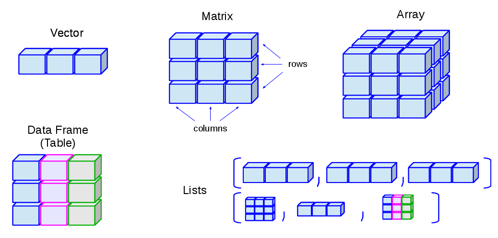

```{r setup, include=FALSE}
# Seed the RNG so the random matrices below render identically every time.
set.seed(1)
```

Picture the result of a genomics experiment: you measured the activity of
twenty thousand genes across a dozen samples. The natural way to hold that
is a grid — one row per gene, one column per sample, a number in every cell.
That grid is a **matrix**, and it is the central object you'll meet again
and again in genomics. The gene-expression matrix you build here is the same
shape that later powers a `SummarizedExperiment`, so the moves you learn now
pay off for the rest of the book.

A matrix is just a rectangle of values that are **all the same type** — all
numbers, all characters, or all logicals (see @fig-datastructures_schematic).
You can read it as a stack of columns (each column a vector of the same
length and type) or as a stack of rows. If you've already met vectors, a
matrix is the natural next step: take several vectors of equal length and
the same type, and line them up side by side.

{#fig-datastructures_schematic}

::: {.callout-note}
## Matrix versus data frame

A *data frame* is also a rectangle, and it's easy to confuse the two. The
difference is one rule: a matrix needs every value to be the **same type**,
while a data frame lets each **column** have its own type — numbers in one,
text in another. Use a matrix when your whole grid is numeric (like
expression values); reach for a data frame when columns mix types (a sample
table with names, ages, and treatment labels). The two even name their rows
and columns differently under the hood, which is a classic source of
confusion — but that's a problem for the data-frame chapter, not this one.
:::

## What you'll learn

- Build a matrix with `matrix()`, `rbind()`, and `cbind()`.
- Inspect a matrix's shape and labels with `dim()`, `nrow()`, `ncol()`, `rownames()`, and `colnames()`.
- Pull out elements, rows, and columns with `[row, col]` indexing.
- Change values in part of a matrix by combining subsetting with assignment.
- Summarize across rows and columns with `rowMeans()`, `colMeans()`, and `apply()` — the per-gene and per-sample summaries you'll use constantly in genomics.

## Creating a matrix

There are many ways to build a matrix in R. The most direct is the
`matrix()` function. Below we pour the numbers `1:16` into a four-row grid.

```{r}
mat1 <- matrix(1:16, nrow = 4)
mat1
```

By default R fills the matrix **column by column** — walk down the first
column, then the second, and so on. If you'd rather fill it row by row, set
`byrow = TRUE`.

```{r}
mat1 <- matrix(1:16, nrow = 4, byrow = TRUE)
mat1
```

Look closely at where the numbers land. Same sixteen values, same shape, but
a completely different arrangement. Whenever you create a matrix from a flat
vector, ask yourself which direction it filled.

We can also assemble a matrix from parts by *binding* vectors together. Let's
make two numeric vectors of length 10.

```{r}
gene_a <- 1:10
gene_b <- rnorm(10)
```

Both are numeric and both have length 10, so they can sit together in a
matrix. `rbind()` stacks them as **r**ows (think "r for row"):

```{r}
mat <- rbind(gene_a, gene_b)
mat
```

The companion function `cbind()` glues vectors together as **c**olumns:

```{r}
mat <- cbind(gene_a, gene_b)
mat
```

Notice that R kept the vector names — `gene_a` and `gene_b` — as labels. Row
and column names are worth their weight in gold once they carry real meaning,
like gene identifiers or sample names. You can read them back at any time:

```{r}
rownames(mat)
colnames(mat)
```

And you can set them by assigning a vector of valid names:

```{r}
colnames(mat) <- c("control", "treated")
colnames(mat)
mat
```

Every matrix also knows its own shape. `dim()` reports rows then columns;
`nrow()` and `ncol()` pull out one each.

```{r}
dim(mat)
nrow(mat)
ncol(mat)
```

## Accessing elements of a matrix {#sec-matrix-indexing}

Indexing a matrix works like indexing a vector, except now you give **two**
coordinates: the row first, then the column. The pattern is `mat[r, c]`,
where `r` and `c` say which rows and columns you want.

::: {.callout-important}
## R counts from one

In R, the first element, row, or column is number **1** — not 0. If you've
written Python, C, or Java, this will trip you up, because those languages
count from 0. Reaching for the wrong starting index is one of the most common
beginner mistakes, and the worst kind: it often doesn't error, it just
quietly hands you the wrong value.
:::

Let's pull various pieces out of `mat`:

```{r}
# the value in row 1, column 2
mat[1, 2]
# the entire first ROW (leave the column slot empty)
mat[1, ]
# the entire first COLUMN (leave the row slot empty)
mat[, 1]
```

Leaving a slot blank means "give me all of them." So `mat[1, ]` is the whole
first row and `mat[, 1]` is the whole first column. There's one more form
worth knowing — a single index with **no comma**:

```{r}
# every value greater than 4; note: no comma
mat[mat > 4]
```

::: {.callout-warning}
## A matrix is a vector wearing a costume

When you index with a single subscript and no comma, R forgets the rectangle
and treats the matrix as one long vector, returning a flat result. That's
handy for "give me all the big values," but it's also a trap: code that
*looks* like it should respect rows and columns may silently flatten your
matrix instead. Whenever you mean a row or a column, include the comma.
:::

You can also *exclude* rows or columns by prefixing the index with a minus
sign:

```{r}
mat[, -1]        # drop the first column
mat[-c(1:5), ]   # drop the first five rows
```

## Changing values in a matrix

Let's make a fresh matrix of random values to experiment on — pretend it's a
small expression matrix with measurements drawn from a normal distribution.

```{r}
expr <- matrix(rnorm(20), nrow = 10)
summary(expr)
```

Arithmetic on a matrix behaves much like arithmetic on a vector. Multiplying
by a single number scales every cell at once:

```{r}
# multiply every value by 20
expr2 <- expr * 20
summary(expr2)
```

By combining subsetting with assignment, you can rewrite just *part* of a
matrix. Here we bump up only the first column:

```{r}
# add 100 to the first column of expr2
expr2[, 1] <- expr2[, 1] + 100
summary(expr2)
```

A common reshaping move is to **transpose** — flip rows into columns and vice
versa with `t()`. You'll need this surprisingly often: a lab instrument might
write samples in rows and genes in columns, while Bioconductor expects genes
in rows and samples in columns. One call sets it right.

```{r}
t(expr2)
```

## Calculations on matrix rows and columns

For this section we need a matrix to play with. We'll use `rnorm()` again,
but ask for values centered at 5 with a standard deviation of 2 — the two
extra arguments are the mean and the spread.

```{r}
expr3 <- matrix(rnorm(100, 5, 2), ncol = 10)
```

Because these values come from a normal distribution centered at 5, any
single column (or row) should have a mean near 5 and a standard deviation
near 2. Let's check the first column, then the first row:

```{r}
mean(expr3[, 1])
sd(expr3[, 1])
# now a row
mean(expr3[1, ])
sd(expr3[1, ])
```

Computing one summary at a time gets tedious fast. R gives you convenience
functions that sweep across **all** the rows or **all** the columns at once.
In a gene-expression matrix, `rowMeans()` is the average expression *per
gene* and `colMeans()` is the average *per sample* — two of the most common
summaries in genomics.

```{r}
colMeans(expr3)
rowMeans(expr3)
rowSums(expr3)
colSums(expr3)
```

We can save the column means and look at how they're spread:

```{r}
cmeans <- colMeans(expr3)
summary(cmeans)
```

Notice the column means cluster tightly around 5 — exactly the center we
asked for when we built the matrix. The averaging smooths out the noise in
the individual values.

What about the standard deviation of each column? There's no built-in
`colSd()`, but you don't need one. The `apply()` function takes any function
that works on a vector — like `sd()` — and *applies* it across either
dimension: `1` means rows, `2` means columns.

```{r}
csds <- apply(expr3, 2, sd)
summary(csds)
```

These per-column standard deviations sit close to 2, the spread we built in.
Keep `apply()` in your back pocket: any time R lacks a ready-made `rowX()` or
`colX()`, `apply()` lets you roll your own.

::: {.callout-tip}
## Remember the second argument

The number in `apply(x, MARGIN, FUN)` is the dimension you keep: `1` for rows
(one result per row), `2` for columns (one result per column). A quick way to
remember: it matches the order in `[row, column]` — `1` is rows, `2` is
columns.
:::

## Exercises

For these exercises we'll use a dataset that ships with R: monthly sunspot
counts from 1749 to 1983. It arrives as a `ts` (time series) object, so the
code below reshapes it into a matrix with one **row per year** and one
**column per month**. Just run it as written and move on to the questions.

```{r}
data(sunspots)
sunspot_mat <- matrix(as.vector(sunspots), ncol = 12, byrow = TRUE)
colnames(sunspot_mat) <- as.character(1:12)
rownames(sunspot_mat) <- as.character(1749:1983)
```

1.  **Get to know the matrix.** What does `sunspot_mat` look like? Find its
    number of rows, its number of columns, and some basic summary statistics.

    ::: {.callout-note collapse="true"}
    ## Solution
    ```{r}
    nrow(sunspot_mat)
    ncol(sunspot_mat)
    dim(sunspot_mat)
    summary(sunspot_mat)
    head(sunspot_mat)
    ```
    `dim()` confirms 235 years by 12 months, and `head()` shows the first few
    years — always eyeball the shape before you start computing.
    :::

2.  **Practice subsetting** by pulling out: the first 10 years (rows), the
    month of July (the 7th column), and the single value for July 1979 using
    the row name to select it.

    ::: {.callout-note collapse="true"}
    ## Solution
    ```{r}
    sunspot_mat[1:10, ]
    sunspot_mat[, 7]
    sunspot_mat["1979", 7]
    ```
    Because we set row names, you can index by the label `"1979"` instead of
    counting rows — far less error-prone than figuring out which row number
    that is.
    :::

3.  **Whole-matrix summaries.** A function that expects a vector — like
    `max()` — will happily treat the whole matrix as one long vector. What is
    the highest monthly sunspot count in the data?

    ::: {.callout-note collapse="true"}
    ## Solution
    ```{r}
    max(sunspot_mat)
    ```
    No comma, no row or column — `max()` flattens the matrix and scans every
    value at once.
    :::

4.  **And the minimum?**

    ::: {.callout-note collapse="true"}
    ## Solution
    ```{r}
    min(sunspot_mat)
    ```
    Same idea as `max()`, in the other direction.
    :::

5.  **Center of the data.** What are the overall mean and median?

    ::: {.callout-note collapse="true"}
    ## Solution
    ```{r}
    mean(sunspot_mat)
    median(sunspot_mat)
    ```
    The mean sits well above the median, a hint that the distribution is
    skewed — a few very active months pull the average up.
    :::

6.  **See the shape of the data.** Use `hist()` to look at the distribution
    of all the monthly counts.

    ::: {.callout-note collapse="true"}
    ## Solution
    ```{r}
    hist(sunspot_mat)
    ```
    The long right tail confirms the skew we suspected from the mean and
    median: most months are quiet, a handful are very busy.
    :::

7.  **Sharpen the histogram.** Read about the `breaks` argument to `hist()`
    and use it to increase the number of bars for more resolution.

    ::: {.callout-note collapse="true"}
    ## Solution
    ```{r}
    hist(sunspot_mat, breaks = 40)
    ```
    More breaks means narrower bars, which reveals finer structure in the
    distribution.
    :::

8.  **Average by month.** We'd like the mean number of sunspots for each
    month of the year. Which summary function gives a result *per column*?

    ::: {.callout-note collapse="true"}
    ## Solution
    ```{r}
    colMeans(sunspot_mat)

    # apply() does the same thing:
    apply(sunspot_mat, 2, mean)
    ```
    Months are the columns, so `colMeans()` (or `apply(..., 2, mean)`) gives
    one average per month.
    :::

9.  **Summarize the monthly means.** Save the per-month averages to a
    variable and summarize it to see the spread across months.

    ::: {.callout-note collapse="true"}
    ## Solution
    ```{r}
    month_means <- colMeans(sunspot_mat)
    summary(month_means)
    ```
    The monthly averages are quite close to each other — sunspot activity
    doesn't depend much on the time of year.
    :::

10. **Average by year.** Now play the same game across rows to get one mean
    per year.

    ::: {.callout-note collapse="true"}
    ## Solution
    ```{r}
    year_means <- rowMeans(sunspot_mat)
    summary(year_means)
    ```
    Years are the rows, so `rowMeans()` collapses each year to a single
    average.
    :::

11. **Look for a pattern.** Plot the yearly means. Do you see anything?

    ::: {.callout-note collapse="true"}
    ## Solution
    ```{r}
    plot(year_means)
    # a line makes the cycle clearer
    plot(year_means, type = "l")
    ```
    The famous ~11-year sunspot cycle jumps out as a regular series of peaks
    and troughs — a pattern that's far easier to see across years (rows) than
    across months (columns).
    :::

## Summary

You can now treat a matrix as the workhorse rectangle it is:

- **Build** one with `matrix()`, or assemble it from vectors with `rbind()` and `cbind()`.
- **Inspect** its shape and labels with `dim()`, `nrow()`, `ncol()`, `rownames()`, and `colnames()`.
- **Index** with `mat[row, col]` — remembering R counts from 1, that a blank slot means "all," and that a single index with no comma flattens the matrix to a vector (@sec-matrix-indexing).
- **Edit** part of a matrix by combining subsetting with assignment, and flip its orientation with `t()`.
- **Summarize** across rows and columns with `rowMeans()`, `colMeans()`, and the more general `apply()` — the per-gene and per-sample summaries at the heart of genomics.

That last idea — genes in rows, samples in columns, summaries running in
either direction — is exactly the mental model you'll carry into the
`SummarizedExperiment` chapter, where a matrix like this becomes the beating
heart of a real genomics container.
