# 21  Working with distribution functions

Code

Author

Affiliation

[Sean Davis](https://seandavi.github.io/) [](mailto:seandavi@gmail.com)

[University of Colorado  
Anschutz School of Medicine](https://medschool.cuanschutz.edu/)

Published

June 1, 2024

Modified

September 19, 2026

Heights, blood pressures, measurement errors, log-transformed gene-expression values — measure enough of almost anything in biology and the values tend to pile up into the same bell-shaped curve: the **normal distribution**. Once your data follow that curve, you’ll want to ask questions of it. *What fraction of samples fall below some cutoff? Which value marks the top 5%? Give me twenty random draws to simulate an experiment.* R answers each of those with a different function.

The catch is remembering which function does which job. This chapter is a **visual guide**: for every function we pair the R call with a picture of exactly what it measures on the bell curve, because the difference between a *probability*, a *density*, and a *quantile* is far easier to see than to memorize. It’s genuinely hard to reason about these functions without a shape to point at — so a shape is what we’ll build for each one.

## 21.1 What you’ll learn

- Use [`pnorm()`](https://rdrr.io/r/stats/Normal.html) to turn a value into a probability (the area under the curve to its left).
- Use [`dnorm()`](https://rdrr.io/r/stats/Normal.html) to get the height (density) of the curve at a value.
- Use [`qnorm()`](https://rdrr.io/r/stats/Normal.html) to go the other direction — from a probability back to a value.
- Use [`rnorm()`](https://rdrr.io/r/stats/Normal.html) to draw random samples from a normal distribution.
- Combine these functions to answer real questions about normally distributed data, such as IQ scores.

> **TIP:**
>
> R builds these names from a one-letter prefix plus the distribution: **d** for density, **p** for probability, **q** for quantile, **r** for random. Learn it once and it transfers everywhere — `dbinom`/`pbinom`/`qbinom`/`rbinom` for the binomial, `dt`/`pt`/`qt`/`rt` for the t-distribution we meet in the next chapter, `dpois`/`ppois`/… for the Poisson. Here we use the `…norm` family for the normal.

The four functions, at a glance:

| Function | Input | Output |
|----|----|----|
| `pnorm` | a value `q` | P(X \< q): area under the curve to the **left** of `q` |
| `dnorm` | a value `x` | the **height** of the density curve at `x` |
| `qnorm` | a probability from 0 to 1 | the value `x` where P(X \< x) equals that probability |
| `rnorm` | a count `n` | `n` random samples from the distribution |

Table 21.1: Functions for the normal distribution

In one sentence each: `pnorm` gives the area to the left of a point, `dnorm` gives the height of the curve at a point, `qnorm` is the inverse of `pnorm` (probability back to value), and `rnorm` generates random samples. The rest of the chapter unpacks them one at a time.

## 21.2 pnorm

`pnorm` answers the question “what fraction of the distribution lies to the **left** of this value?” If you don’t supply a mean and standard deviation, R assumes the *standard normal* (mean 0, standard deviation 1). The help page gives this template:

``` downlit
pnorm(q, mean = 0, sd = 1, lower.tail = TRUE, log.p = FALSE)
```

You hand it `q`, a value on the x-axis, and it returns the area under the curve to the left of that point. The mean sits dead centre and splits the curve in half, so:

``` downlit
pnorm(0)    # half the distribution is below the mean
```

    [1] 0.5

``` downlit
pnorm(1)    # ~84% is below one standard deviation above the mean
```

    [1] 0.8413447

``` downlit
pnorm(-1)   # ~16% is below one standard deviation below it
```

    [1] 0.1586553

The figures below show each of those as a shaded area.

[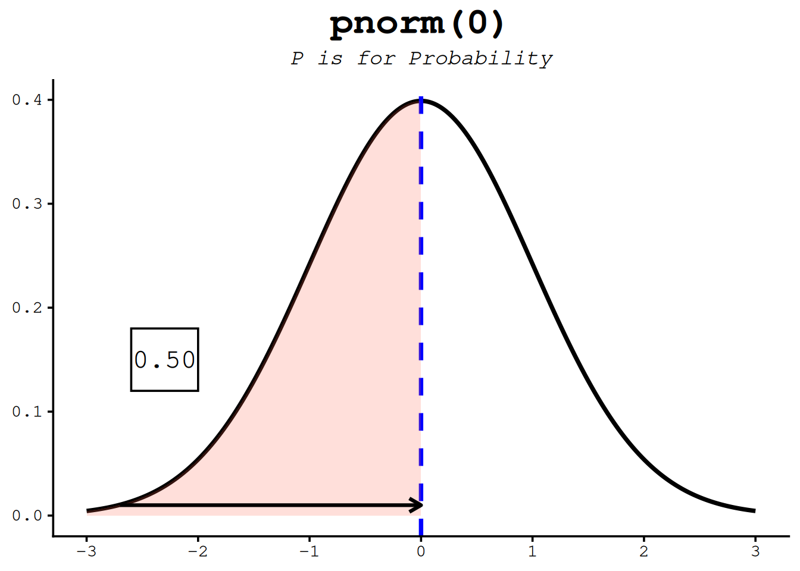](norm_files/figure-html/fig-pnorm-1.png "Figure 21.1: The pnorm function takes a quantile (value on the x-axis) and returns the area under the curve to the left of that value.")

Figure 21.1: The pnorm function takes a quantile (value on the x-axis) and returns the area under the curve to the left of that value.

[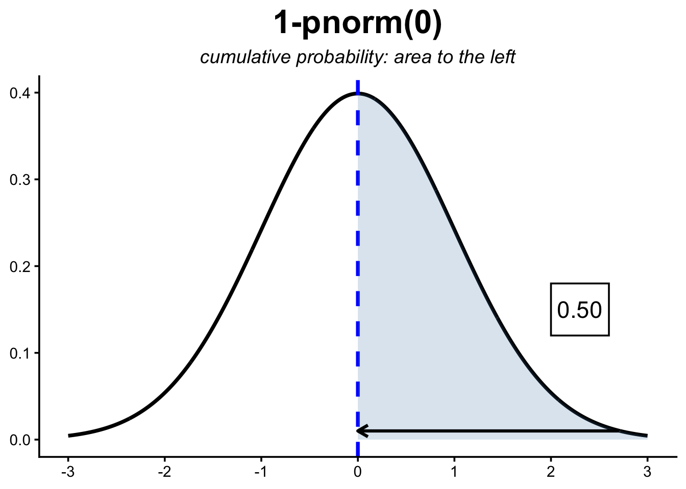](norm_files/figure-html/fig-pnorm-2.png "Figure 21.2: The pnorm function takes a quantile (value on the x-axis) and returns the area under the curve to the left of that value.")

Figure 21.2: The pnorm function takes a quantile (value on the x-axis) and returns the area under the curve to the left of that value.

[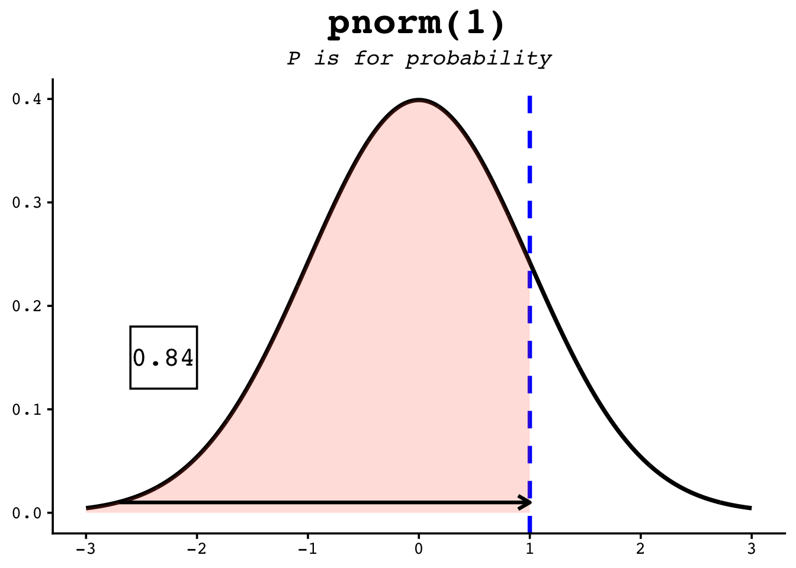](norm_files/figure-html/fig-pnorm-3.png "Figure 21.3: The pnorm function takes a quantile (value on the x-axis) and returns the area under the curve to the left of that value.")

Figure 21.3: The pnorm function takes a quantile (value on the x-axis) and returns the area under the curve to the left of that value.

[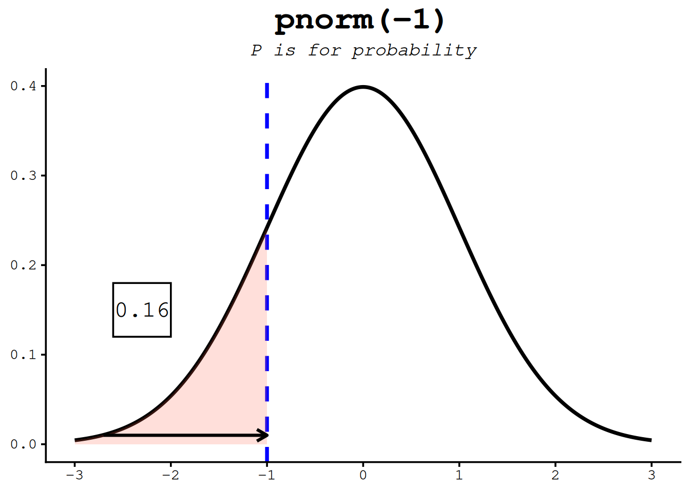](norm_files/figure-html/fig-pnorm-4.png "Figure 21.4: The pnorm function takes a quantile (value on the x-axis) and returns the area under the curve to the left of that value.")

Figure 21.4: The pnorm function takes a quantile (value on the x-axis) and returns the area under the curve to the left of that value.

The option `lower.tail = TRUE` tells R to use the area to the *left* of the given point — the default. To get the area to the **right** instead, either switch to `lower.tail = FALSE` or subtract from 1:

``` downlit
pnorm(1, lower.tail = FALSE)   # area to the RIGHT of 1
```

    [1] 0.1586553

``` downlit
1 - pnorm(1)                   # exactly the same thing
```

    [1] 0.1586553

## 21.3 The cumulative distribution function

Step back and look at what `pnorm` really *is*. Each call answers one question — “how much probability lies to the left of this value?” If you ask that question at *every* point along the x-axis and plot the answers, you trace out a single curve: the **cumulative distribution function**, or **CDF**. Where the density (`dnorm`) tells you how *concentrated* probability is at each point, the CDF tells you how much has *accumulated* by that point. They are two views of the same distribution, and learning to move between them is most of what “distribution intuition” really means.

Here is the CDF of the standard normal — `pnorm(x)` evaluated at every `x`:

[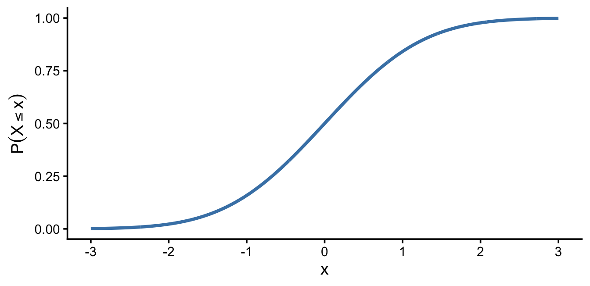](norm_files/figure-html/fig-cdf-curve-1.png "Figure 21.5: The cumulative distribution function of the standard normal: pnorm(x) plotted at every x. It is the running total of the area under the density curve, climbing from 0 (no probability accumulated yet) to 1 (all of it).")

Figure 21.5: The cumulative distribution function of the standard normal: pnorm(x) plotted at every x. It is the running total of the area under the density curve, climbing from 0 (no probability accumulated yet) to 1 (all of it).

A few features are worth naming, because they hold for *every* CDF, not just the normal:

- It **starts near 0 and ends near 1.** A CDF is accumulated probability, and all the probability sums to 1, so the curve can only climb from 0 up to 1.
- It **never goes down.** Moving to the right can only *add* area, never remove it, so a CDF is always non-decreasing.
- It is **S-shaped (for the normal) because of where the density lives.** Out in the left tail almost no probability is accumulating, so the curve is nearly flat; through the middle — where the bell is tallest — probability piles up quickly and the curve climbs steeply; in the right tail there is little left to add, so it levels off toward 1.

That last point is the key link between the two views: **the density is the *slope* of the CDF.** The curve rises fastest exactly where the density is tallest (the mean), and flattens wherever the density is near zero (the tails). Read the other direction, the **CDF is the running total — the accumulated area — of the density.**

### 21.3.1 The area is the height

The cleanest way to *feel* the connection is to put the two pictures side by side. In [Figure fig-cdf-link](#fig-cdf-link) the same value `q` appears in both rows: the **shaded area** under the density (top) is exactly the **height** of the CDF (bottom). As `q` slides to the right, the shading fills in and the point climbs the S-curve. That shaded area-equals-curve-height is precisely the number `pnorm(q)` returns.

[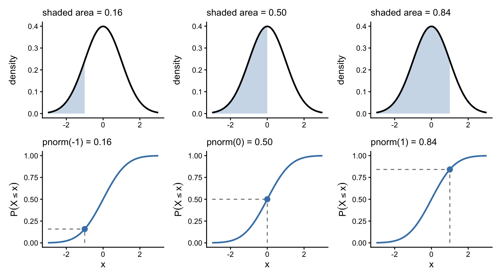](norm_files/figure-html/fig-cdf-link-1.png "Figure 21.6: Two views of the same probability at q = -1, 0, and 1. Top row: the density with the area to the left of q shaded. Bottom row: the CDF, with a point at (q, pnorm(q)) and dashed guides. In every column the shaded area above equals the height below.")

Figure 21.6: Two views of the same probability at q = -1, 0, and 1. Top row: the density with the area to the left of q shaded. Bottom row: the CDF, with a point at (q, pnorm(q)) and dashed guides. In every column the shaded area above equals the height below.

### 21.3.2 Everything you already know, on one curve

Once you can see the CDF as a curve, the whole `d`/`p`/`q`/`r` family lines up on it:

- **`pnorm`** reads the curve **upward**: hand it a value `q` on the x-axis and it returns the *height* of the curve there — the probability to the left.
- **`qnorm`** reads the same curve **across**: hand it a probability on the y-axis and it returns the *x* where the curve reaches that height. That is why `qnorm` is the exact inverse of `pnorm` — it’s the same S-curve, read sideways.
- **`dnorm`** is the curve’s **steepness** — how fast probability is piling up at that point.

So `pnorm` and `qnorm` are not two separate things to memorize; they are the same curve approached from two directions, and `dnorm` is its slope.

> **NOTE:**
>
> Everything in this section is general. *Every* distribution — binomial, Poisson, t, exponential, and the rest — has a density (or, for counts, a probability mass) and a matching CDF, related in exactly the same way: the CDF is the accumulated area under the density, and the density is the slope of the CDF. That shared structure is *why* R gives every distribution the same `d`/`p`/`q`/`r` quartet. Swap `norm` for `pois` or `binom` and the picture you just built still holds.

## 21.4 dnorm

`dnorm` gives the **height** of the bell curve at a value — the probability *density*. The curve is tallest at the mean and falls off symmetrically on either side. Unlike `pnorm`, the result is not a probability you can read as a percentage; it’s the height of the curve, used mainly for *drawing* the distribution or in likelihood calculations.

``` downlit
dnorm(0)    # the peak of the standard normal
```

    [1] 0.3989423

``` downlit
dnorm(1)    # lower, one SD out...
```

    [1] 0.2419707

``` downlit
dnorm(-1)   # ...and the same height on the other side, by symmetry
```

    [1] 0.2419707

The figures below mark each of these heights on the curve.

[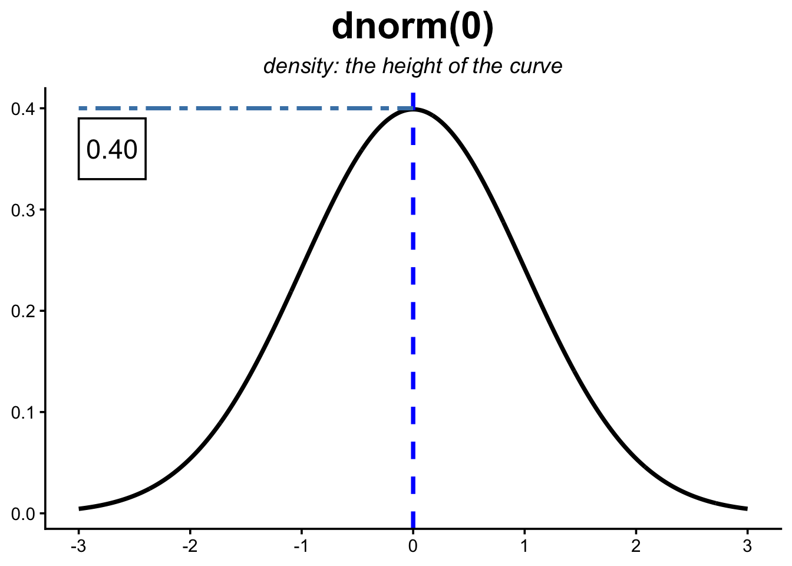](norm_files/figure-html/fig-dnorm-1.png "Figure 21.7: The dnorm function returns the height of the normal distribution at a given point.")

Figure 21.7: The `dnorm` function returns the height of the normal distribution at a given point.

[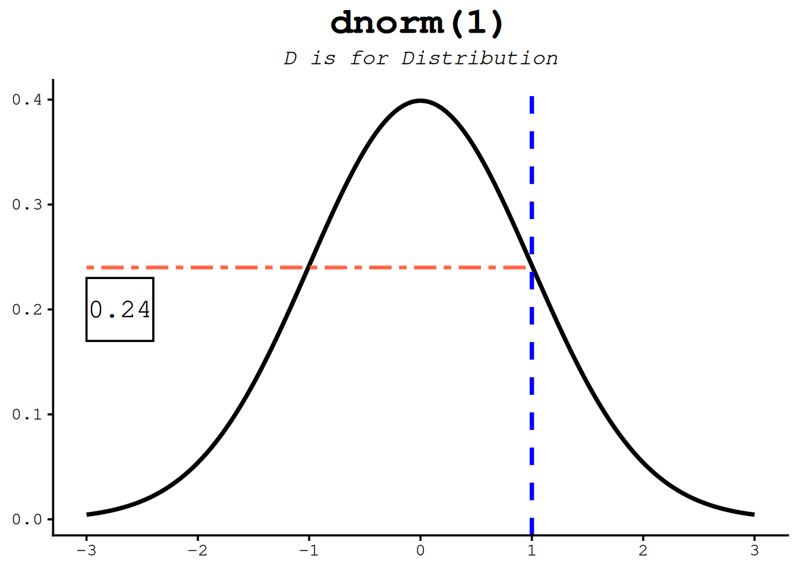](norm_files/figure-html/fig-dnorm-2.png "Figure 21.8: The dnorm function returns the height of the normal distribution at a given point.")

Figure 21.8: The `dnorm` function returns the height of the normal distribution at a given point.

[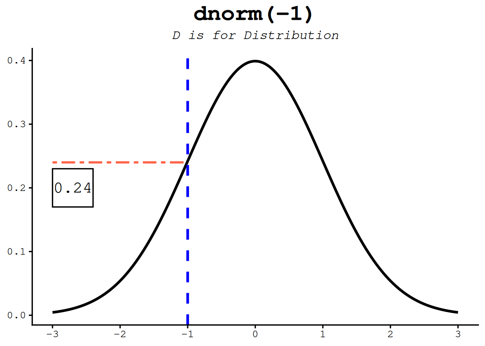](norm_files/figure-html/fig-dnorm-3.png "Figure 21.9: The dnorm function returns the height of the normal distribution at a given point.")

Figure 21.9: The `dnorm` function returns the height of the normal distribution at a given point.

## 21.5 qnorm

`qnorm` runs `pnorm` in reverse: hand it a probability and it returns the value with that much area to its left. Since `pnorm(1)` is about 0.84, `qnorm(0.84)` is about 1 — the two functions undo each other. This is how you find **percentiles**.

``` downlit
qnorm(0.5)     # the median: half the area lies to its left
```

    [1] 0

``` downlit
qnorm(0.25)    # the first quartile
```

    [1] -0.6744898

``` downlit
qnorm(0.975)   # the value cutting off the top 2.5% — the famous 1.96
```

    [1] 1.959964

The figures below show several quantiles as shaded areas.

[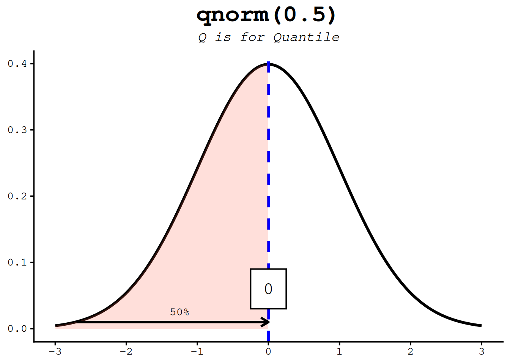](norm_files/figure-html/fig-qnorm-1.png "Figure 21.10: The qnorm function is the inverse of the pnorm function in that it takes a probability and gives the quantile.")

Figure 21.10: The qnorm function is the inverse of the pnorm function in that it takes a probability and gives the quantile.

[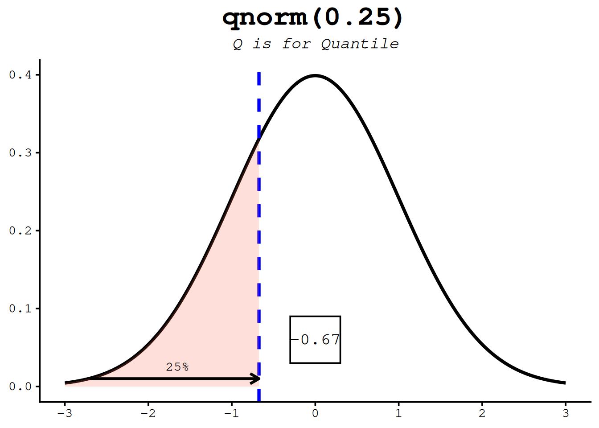](norm_files/figure-html/fig-qnorm-2.png "Figure 21.11: The qnorm function is the inverse of the pnorm function in that it takes a probability and gives the quantile.")

Figure 21.11: The qnorm function is the inverse of the pnorm function in that it takes a probability and gives the quantile.

[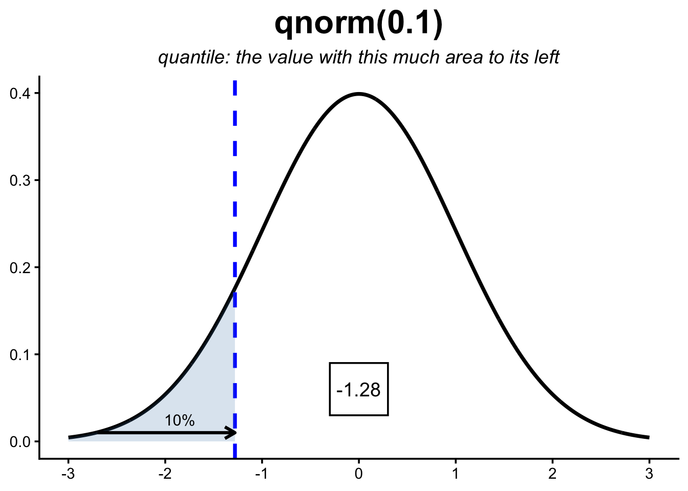](norm_files/figure-html/fig-qnorm-3.png "Figure 21.12: The qnorm function is the inverse of the pnorm function in that it takes a probability and gives the quantile.")

Figure 21.12: The qnorm function is the inverse of the pnorm function in that it takes a probability and gives the quantile.

[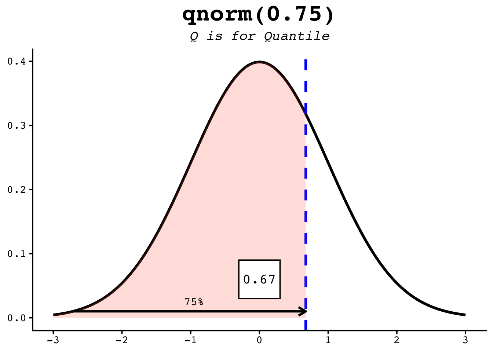](norm_files/figure-html/fig-qnorm-4.png "Figure 21.13: The qnorm function is the inverse of the pnorm function in that it takes a probability and gives the quantile.")

Figure 21.13: The qnorm function is the inverse of the pnorm function in that it takes a probability and gives the quantile.

[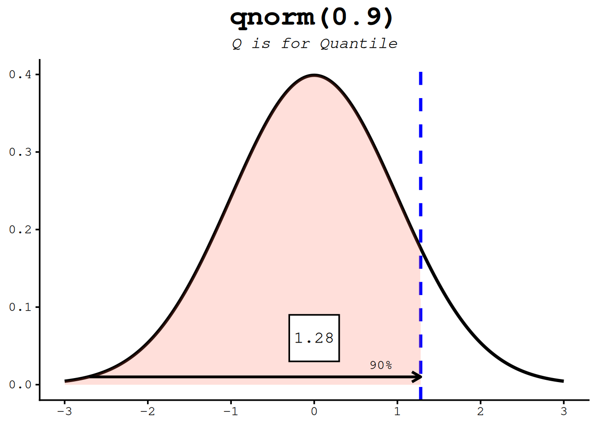](norm_files/figure-html/fig-qnorm-5.png "Figure 21.14: The qnorm function is the inverse of the pnorm function in that it takes a probability and gives the quantile.")

Figure 21.14: The qnorm function is the inverse of the pnorm function in that it takes a probability and gives the quantile.

## 21.6 rnorm

`rnorm` draws random samples from the distribution — the workhorse for *simulating* data (we leaned on it heavily in the t-distribution chapter). Give it a count `n` and it hands back that many random values:

``` downlit
rnorm(5)
```

    [1]  0.6424982  2.0361562  0.8611283  0.7079944 -1.3072369

Run that again and you’ll get five *different* numbers. To make a simulation reproducible — so you and a reader see the same “random” draws — set a seed first:

``` downlit
set.seed(42)
rnorm(5)
```

    [1]  1.3709584 -0.5646982  0.3631284  0.6328626  0.4042683

And just like the other functions, `mean` and `sd` shift and scale the draws:

``` downlit
rnorm(5, mean = 100, sd = 15)   # e.g. five simulated IQ scores
```

    [1]  98.40813 122.67283  98.58011 130.27636  99.05929

``` downlit
print(r1)
```

[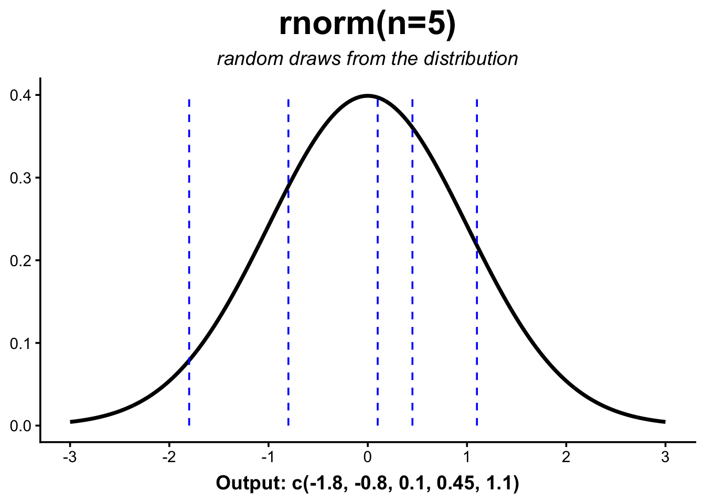](norm_files/figure-html/fig-rnorm-1.png "Figure 21.15: The rnorm function takes a number of samples and returns a vector of random numbers from the normal distribution (with mean=0, sd=1 as defaults)")

Figure 21.15: The rnorm function takes a number of samples and returns a vector of random numbers from the normal distribution (with mean=0, sd=1 as defaults)

## 21.7 Worked example: IQ scores

The normal distribution (also called the Gaussian distribution) is defined by two numbers: the **mean** (µ), which sets the centre, and the **standard deviation** (σ), which sets the spread. IQ scores are deliberately built to be normal with a **mean of 100** and a **standard deviation of 15**, which makes them a perfect playground for the four functions.

A handy rule of thumb — the “68–95–99.7 rule” — says about 68% of values fall within one standard deviation of the mean (here, 85 to 115) and about 95% within two (70 to 130). Let’s check the 68% with `pnorm`. The area *between* 85 and 115 is the area below 115 minus the area below 85:

``` downlit
pnorm(115, mean = 100, sd = 15) - pnorm(85, mean = 100, sd = 15)
```

    [1] 0.6826895

About 0.68 — exactly what the rule promises. Notice the pattern: a “between” question becomes one `pnorm` minus another.

## 21.8 Exercises

Use the IQ distribution (mean 100, sd 15) for each. Each solution names *which* of the four functions fits the question — that choice is the real skill.

1.  **Top 10%.** Which IQ score marks the 90th percentile — the cutoff above which only the top 10% fall?

    > **NOTE:**
    > ``` downlit
    > qnorm(0.9, mean = 100, sd = 15)
    > ```
    >
    >     [1] 119.2233
    >
    > We want a *value* from a *probability*, so this is a `qnorm` job. About 119.

2.  **Above 130.** What fraction of people have an IQ above 130 (two standard deviations up)?

    > **NOTE:**
    > ``` downlit
    > 1 - pnorm(130, mean = 100, sd = 15)
    > ```
    >
    >     [1] 0.02275013
    >
    > ``` downlit
    > # or, equivalently:
    > pnorm(130, mean = 100, sd = 15, lower.tail = FALSE)
    > ```
    >
    >     [1] 0.02275013
    >
    > About 2.3% — consistent with the 95% rule leaving roughly 2.5% in each tail.

3.  **Below 70.** What fraction have an IQ below 70?

    > **NOTE:**
    > ``` downlit
    > pnorm(70, mean = 100, sd = 15)
    > ```
    >
    >     [1] 0.02275013
    >
    > Also about 2.3%. The curve is symmetric, so the lower tail past 70 mirrors the upper tail past 130.

4.  **Simulate a classroom.** Draw 30 random IQ scores and count how many land above

    115. (Set a seed so your answer is reproducible.)

    > **NOTE:**
    > ``` downlit
    > set.seed(1)
    > scores <- rnorm(30, mean = 100, sd = 15)
    > sum(scores > 115)
    > ```
    >
    >     [1] 3
    >
    > Theory predicts about 16% above 115 — roughly 5 of 30 — but any single small sample wobbles around that. Re-run with a different seed to feel the sampling variability for yourself.

## 21.9 Summary

You now have the four-function toolkit for the normal distribution — and, thanks to R’s naming rule, the blueprint for every other distribution too:

- `pnorm(x)` — area to the **left** of `x` (a probability). Use `lower.tail = FALSE` or `1 - pnorm(x)` for the right tail, and one `pnorm` minus another for a range.
- `dnorm(x)` — the **height** of the curve at `x` (a density).
- `qnorm(p)` — the **value** at probability `p` (the inverse of `pnorm`); your tool for percentiles.
- `rnorm(n)` — `n` random **draws**; pair it with [`set.seed()`](https://rdrr.io/r/base/Random.html) for reproducible simulations.

Keep the pictures in mind: `pnorm` is an area, `dnorm` is a height, `qnorm` reads the area axis backwards to a value, and `rnorm` scatters points along the curve.
