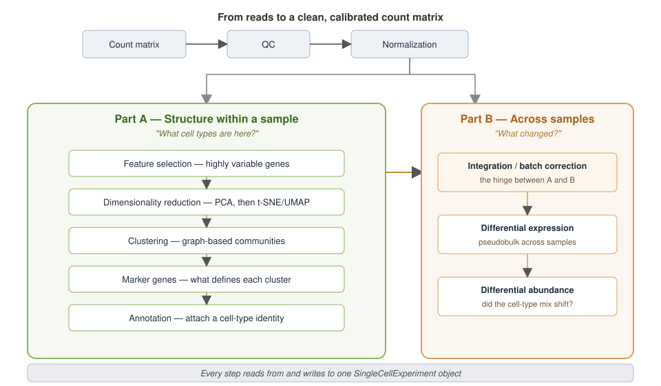
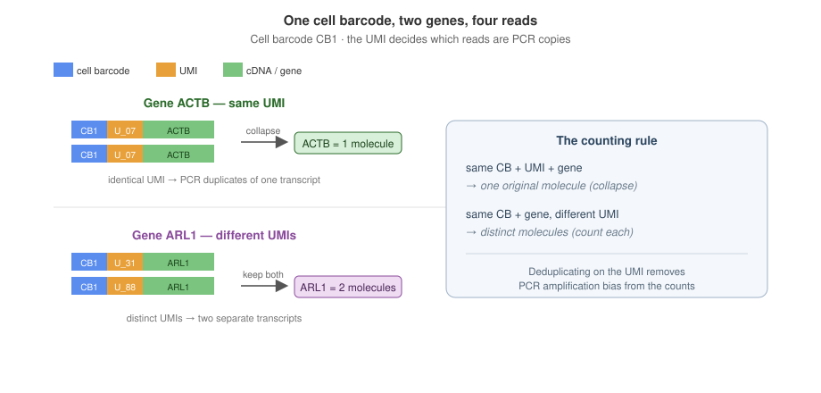
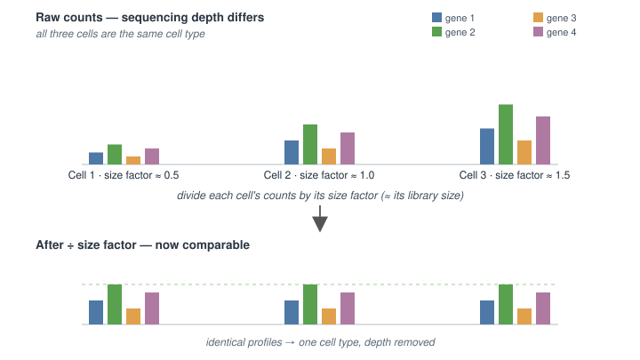
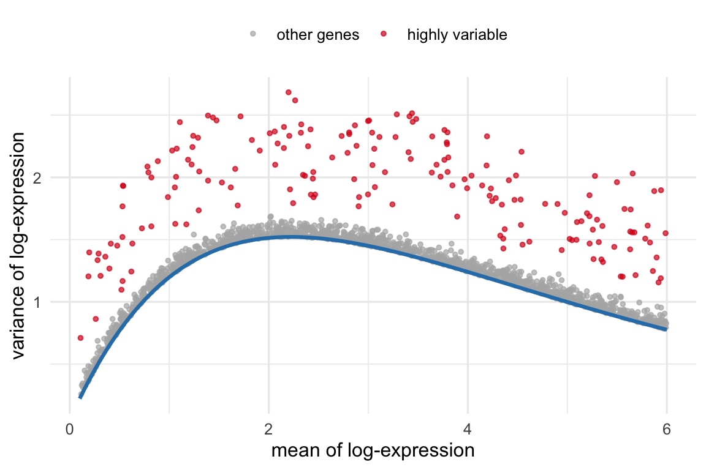
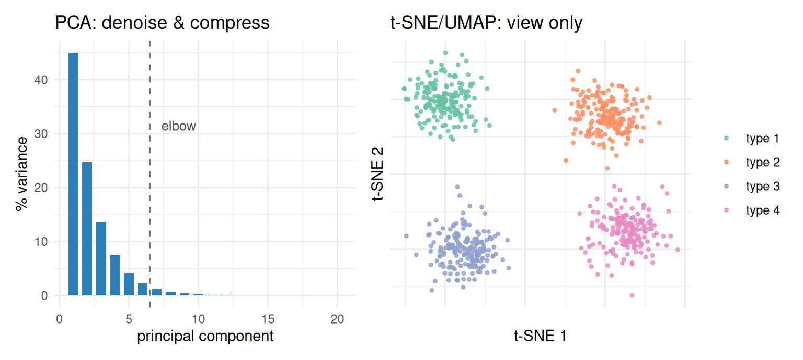
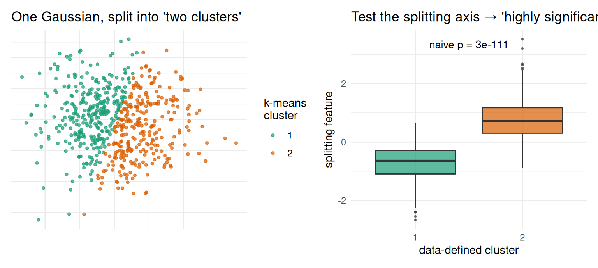
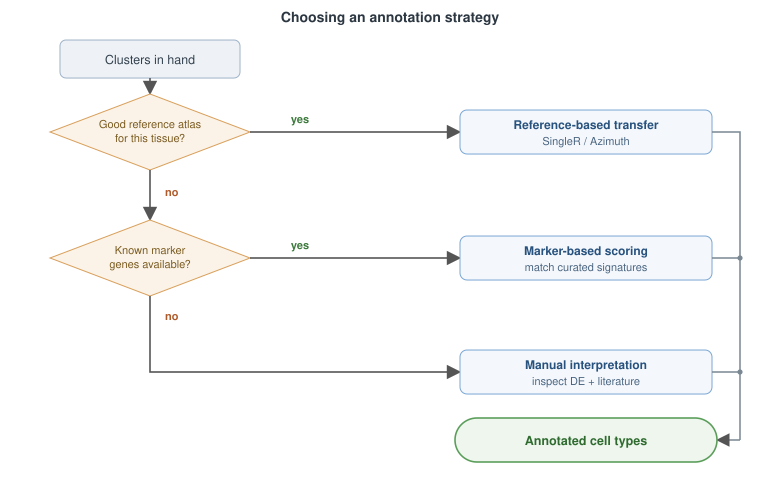
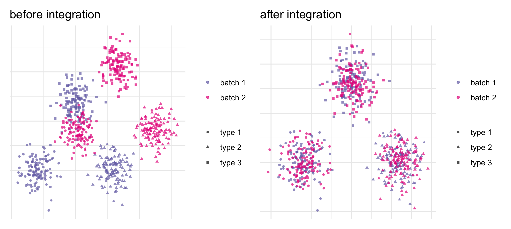
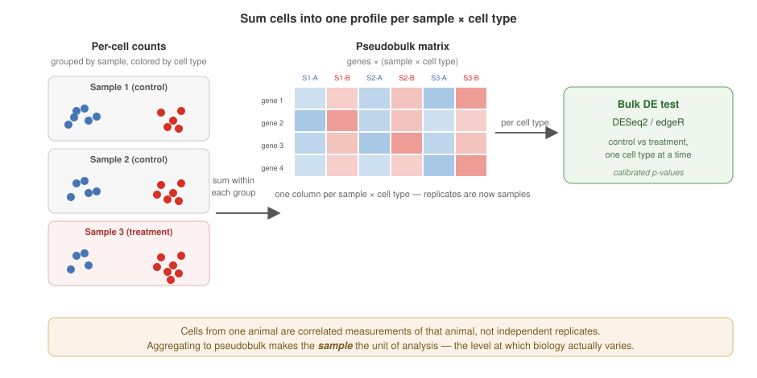
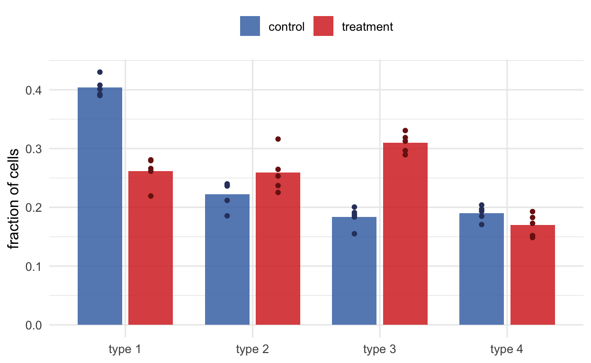

# 38  How single-cell analysis works

Code

Author

Affiliation

[Sean Davis](https://seandavi.github.io/) [](mailto:seandavi@gmail.com)

[University of Colorado  
Anschutz School of Medicine](https://medschool.cuanschutz.edu/)

Published

June 1, 2024

Modified

September 19, 2026

This chapter is the conceptual map for everything else in the single-cell section. It began life as the lecture notes for a talk, and it keeps that spirit: no code to run, just the ideas — what each step of a single-cell analysis is *for*, what decision it makes on your behalf, and how the steps fit together. When you want to see the ideas executed on real data, the [companion workflow chapter](../single_cell/setup.llms.md) runs the whole Part A pipeline on a mouse-brain dataset, and the [multiome](../single_cell/multiome.llms.md) and [label-transfer](../single_cell/atac_rna_label_transfer.llms.md) chapters pick up the multimodal thread.

Keep one picture in mind throughout. Every step below either operates on, or adds something to, a single accumulating object — the `SingleCellExperiment` ([Figure fig-roadmap](#fig-roadmap)). Counts go in; QC metrics, normalized values, reduced dimensions, and cluster labels all get folded back into the same container. That is what lets a modular ecosystem of dozens of small packages hand the data back and forth without ever losing track of which metadata belongs to which cell.

[](imgs/sc-roadmap.svg "Figure 38.1: The two questions of single-cell analysis. Primary analysis funnels raw reads down into a sparse gene-by-cell count matrix; QC and normalization clean and calibrate it. From there the work splits in two. Part A asks what cell types are here? — a single-sample question answered by finding structure: select informative genes, reduce dimensions, cluster, find markers, annotate. Part B asks what changed? — a multi-sample question answered by comparison: integrate batches, then test for shifts in expression (pseudobulk) and in composition (differential abundance). Batch correction is the hinge between them. Every box reads from and writes to one SingleCellExperiment.")

Figure 38.1: **The two questions of single-cell analysis.** Primary analysis funnels raw reads down into a sparse gene-by-cell count matrix; QC and normalization clean and calibrate it. From there the work splits in two. **Part A** asks *what cell types are here?* — a single-sample question answered by finding structure: select informative genes, reduce dimensions, cluster, find markers, annotate. **Part B** asks *what changed?* — a multi-sample question answered by comparison: integrate batches, then test for shifts in expression (pseudobulk) and in composition (differential abundance). Batch correction is the hinge between them. Every box reads from and writes to one `SingleCellExperiment`.

## 38.1 From reads to a count matrix

Before any biology, the sequencer’s output has to become a table of numbers. The defining trick of single-cell chemistry is that every captured molecule carries two short barcodes that survive sequencing: a **cell barcode** that records *which cell* the molecule came from, and a **unique molecular identifier** (UMI) that records *which original molecule* it was ([Figure fig-umi](#fig-umi)). Everything downstream rests on those two labels.

The cell barcode lets you demultiplex one giant pooled library back into tens of thousands of per-cell profiles. The UMI solves a subtler problem. PCR amplification is wildly uneven — some molecules get copied far more than others — so if you simply counted reads, abundance would reflect amplification luck rather than biology. Because the UMI is attached *before* amplification, reads that share a cell barcode, a UMI, and a gene are copies of one original molecule and collapse to a count of one; reads with different UMIs are genuinely distinct molecules and are each counted. That collapse, called **deduplication**, is what lets us count molecules instead of artifacts.

[](imgs/sc-umi.svg "Figure 38.2: Two barcodes turn pooled reads into counts. Every read carries a cell barcode (which cell) and a UMI (which molecule), both attached before amplification. Step 1 — group reads by cell barcode to demultiplex the pooled library back into individual cells. Step 2 — within a cell, reads that share a UMI (same swatch color) and gene are PCR copies of one original molecule and collapse to a single count, while distinct UMIs are counted separately. Each cell becomes one column of the count matrix: here cell C1’s two orange ACTB reads collapse to one molecule and its green and purple ARL1 reads count as two, while cell C2’s duplicate GAPDH reads collapse to one. Deduplicating on the UMI is what removes PCR amplification bias. Schematic.")

Figure 38.2: **Two barcodes turn pooled reads into counts.** Every read carries a cell barcode (*which cell*) and a UMI (*which molecule*), both attached before amplification. **Step 1** — group reads by cell barcode to demultiplex the pooled library back into individual cells. **Step 2** — within a cell, reads that share a UMI (same swatch color) and gene are PCR copies of one original molecule and collapse to a single count, while distinct UMIs are counted separately. Each cell becomes one column of the count matrix: here cell C1’s two orange *ACTB* reads collapse to one molecule and its green and purple *ARL1* reads count as two, while cell C2’s duplicate *GAPDH* reads collapse to one. Deduplicating on the UMI is what removes PCR amplification bias. Schematic.

Getting reads to the point where they *can* be counted means mapping them to genes. Two families of method dominate. **Alignment** (e.g. STAR) places each read on the genome base by base; the wrinkle in RNA is splicing, so aligners must be splice-aware, stitching a read across an exon–exon junction. **Alignment-free** methods (kallisto, Bray et al. ([2016](#ref-doi:10.1038/nbt.3519)); salmon, Patro et al. ([2017](#ref-doi:10.1038/nmeth.4197))) skip exact placement and instead ask only which transcripts a read is *compatible* with, which is an order of magnitude faster and handles multi-mapping reads gracefully. For single-cell data the barcode- and UMI-aware versions of these tools (alevin, kallisto\|bustools) produce the same end product either way: a count matrix.

That matrix — genes down the rows, cells across the columns, UMI counts in the cells — is the substrate for everything that follows. Two features of it shape every method in this chapter. It is **large** (tens of thousands of genes by hundreds of thousands of cells) and it is **sparse**: the overwhelming majority of entries are zero, partly because not every gene is expressed in every cell and partly because of *dropout*, where a real transcript simply isn’t captured. Sparsity is why single-cell data lives in specialized sparse formats and why the statistics downstream are purpose-built rather than borrowed wholesale from bulk RNA-seq.

## 38.2 Quality control: not every column is a cell

A column of the matrix is a *barcode*, and a barcode is not the same as a healthy cell. Some columns are empty droplets that caught only ambient RNA, some are doublets where two cells shared a barcode, and some are dying cells leaking their contents. Quality control identifies and removes these before they masquerade as biology.

Three metrics do most of the work, and the important discipline is to read them *together*:

- **Genes detected per cell** — too few suggests an empty droplet or a dead cell; an unusually high count suggests a doublet.
- **Total UMI count** (library size) — the same logic, on total molecules.
- **Percent mitochondrial reads** — the most diagnostic. When a membrane ruptures, cytoplasmic mRNA leaks out but the mitochondria stay trapped, so a dying cell’s surviving signal is enriched for mitochondrial transcripts.

> **WARNING:**
>
> There is no magic threshold — “20% mito” or “500 genes” are starting points, not laws. What counts as low depends on the tissue, the chemistry, and the cell type (neurons and cardiomyocytes are legitimately mitochondria-rich). Set thresholds from the distribution of *your* data, ideally adaptively (e.g. a few median absolute deviations from the median), and always plot the metrics against each other before you cut.

## 38.3 Normalization: making cells comparable

Even among good cells, raw counts aren’t comparable. One cell may show twice the counts of another for purely technical reasons — capture efficiency, amplification, sequencing depth. Normalization removes that nuisance so that what is left reflects biology (cell type, state, cycle) rather than how deeply a cell happened to be sequenced ([Figure fig-sizefactor](#fig-sizefactor)).

The instrument for the job is a per-cell **size factor**: one number per cell, roughly proportional to how much that cell was sequenced, that you divide its counts by. The simplest estimate is just the cell’s total UMI count — its *library size* — relative to the average: a cell sequenced twice as deeply gets a size factor near two, and dividing brings it back into line. In single-cell data that crude estimate is often not enough. Counts are dominated by zeros, and the library size suffers from *composition bias*: if a handful of genes are strongly expressed in one population, they soak up a disproportionate share of that cell’s reads, inflating its total even though the cell was not actually sequenced more deeply. Dividing by such a total under-corrects some cells and over-corrects others.

A number of more sophisticated normalization methods exist to deal with this, trading simplicity for robustness — pooling-based deconvolution, model-based approaches that fit a count model per gene and work from its residuals (for example `sctransform`’s Pearson residuals), and spike-in–based scaling when control RNA was added. The most widely used in the Bioconductor workflow is **deconvolution** (`scran`/`scrapper`). Its trick is to sidestep the sparsity that makes any single cell’s total unreliable: it pools many similar cells so their *summed* expression profiles are large and nearly zero-free, computes a stable size factor for each pool, and then — using many overlapping pools — sets up and solves a system of linear equations to recover (“deconvolve”) a per-cell factor from the pool-level ones. The result is a library-size–like number that has been corrected for composition bias.

Once each cell has its size factor *s*, log-normalization computes `log(count / s + 1)`: dividing by *s* puts every cell on a common depth, the `+ 1` keeps zeros finite, and the log stabilizes variance and reins in the long right tail — exactly what the distance-based methods downstream assume. Get this right and your clusters reflect cell types; get it wrong and they reflect sequencing depth. The [workflow chapter](../single_cell/setup.llms.md) shows the one-line `normalizeRnaCounts()` that does all of this in practice.

[](imgs/sc-sizefactor.svg "Figure 38.3: A size factor makes cells comparable. Three cells of the same type sequenced at different depths have raw count profiles of different heights (top) — a purely technical artifact. Each cell gets a size factor roughly proportional to its sequencing depth (≈ its library size); dividing every gene’s count by it puts the cells on a common scale, so the shared profile lines up (bottom). The naive size factor is just the cell’s total count, but because single-cell counts are mostly zeros, more robust estimators — such as the deconvolution method of scran/scrapper — pool similar cells and deconvolve a per-cell factor. Schematic.")

Figure 38.3: **A size factor makes cells comparable.** Three cells of the *same* type sequenced at different depths have raw count profiles of different heights (top) — a purely technical artifact. Each cell gets a **size factor** roughly proportional to its sequencing depth (≈ its library size); dividing every gene’s count by it puts the cells on a common scale, so the shared profile lines up (bottom). The naive size factor is just the cell’s total count, but because single-cell counts are mostly zeros, more robust estimators — such as the deconvolution method of `scran`/`scrapper` — pool similar cells and deconvolve a per-cell factor. Schematic.

To see the arithmetic concretely, take four genes measured in three cells of the *same* type, sequenced at increasing depth. Cell 3 was sequenced three times as deeply as cell 1, so its raw counts are uniformly larger — but the *profile* (the ratios between genes) is identical:

``` downlit
counts <- matrix(c( 3,  6,  9,    # gene 1
                    5, 10, 15,    # gene 2
                    2,  4,  6,    # gene 3
                    4,  8, 12),   # gene 4
                 nrow = 4, byrow = TRUE,
                 dimnames = list(paste0("gene", 1:4), paste0("cell", 1:3)))
counts
```

          cell1 cell2 cell3
    gene1     3     6     9
    gene2     5    10    15
    gene3     2     4     6
    gene4     4     8    12

``` downlit
# Library-size factor: each cell's total count, rescaled to average 1.
totals <- colSums(counts)
size_factors <- totals / mean(totals)
size_factors
```

    cell1 cell2 cell3 
      0.5   1.0   1.5 

``` downlit
# Divide each cell's column by its own size factor.
round(sweep(counts, 2, size_factors, "/"), 1)
```

          cell1 cell2 cell3
    gene1     6     6     6
    gene2    10    10    10
    gene3     4     4     4
    gene4     8     8     8

The three columns collapse onto an identical profile: the depth differences vanish and only the shared cell-type signal remains — exactly what [Figure fig-sizefactor](#fig-sizefactor) shows. This library-size factor is what `normalizeRnaCounts()` uses by default; the deconvolution refinement above changes *how* the size factor is estimated, not this final division.

## 38.4 Part A — Finding structure within a sample

The first question is descriptive: *what cell types and states are present?* You answer it with unsupervised structure-finding, and the steps form a pipeline where each feeds the next.

### 38.4.1 Feature selection: keep the genes that vary

Most genes are uninformative for telling cell types apart — housekeeping genes are expressed everywhere at similar levels, and the rest are mostly noise at this depth. **Highly variable genes** (HVGs) are the ones whose variation across cells exceeds what you’d expect from technical noise alone. The catch is that in count data, variance rises with mean expression purely as an artifact, so you can’t just rank by raw variance. The fix is to model the mean–variance *trend* and pick the genes that sit furthest *above* it ([Figure fig-hvg](#fig-hvg)). Carrying ~1,000–3,000 such genes into the next step sharpens the biological signal and slashes the computation.

[](concepts_files/figure-html/fig-hvg-1.png "Figure 38.4: Feature selection by the mean–variance trend (schematic, simulated). Each point is a gene. Variance rises with mean expression as a technical artifact (blue trend). Highly variable genes (red) are those whose variance exceeds the trend — they carry biological signal and are the ones carried forward into dimensionality reduction. Ranking genes by raw variance instead would just re-discover the trend.")

Figure 38.4: Feature selection by the mean–variance trend (schematic, simulated). Each point is a gene. Variance rises with mean expression as a technical artifact (blue trend). Highly variable genes (red) are those whose variance exceeds the trend — they carry biological signal and are the ones carried forward into dimensionality reduction. Ranking genes by raw variance instead would just re-discover the trend.

### 38.4.2 Dimensionality reduction: two jobs, don’t confuse them

This is where the most common conceptual error lives, so it’s worth being explicit. There are *two* dimensionality reductions in a typical workflow and they do different jobs.

**PCA** comes first. It is a linear projection that compresses the HVG-by-cell matrix down to a few dozen principal components, concentrating the coordinated biological variation into the top components and leaving most of the per-gene noise behind. PCA is a *denoising and compression* step, and its output is what the later steps — clustering, neighbor graphs, even t-SNE — actually consume.

**t-SNE and UMAP** come second, and they exist for one purpose: to squeeze those dozens of PCs into two dimensions you can *look at* ([Figure fig-embedding](#fig-embedding)). They are visualization tools. They deliberately distort global distances to make local neighborhoods legible, which is exactly why you should not read the gaps between far-apart islands, or the absolute sizes of clusters, as quantitative. For the same reason, standard practice clusters on the PCA-reduced space rather than the 2-D embedding: crushing dozens of PCs into two inevitably distorts distances and densities ([Chari and Pachter 2023](#ref-doi:10.1371/journal.pcbi.1011288)), so the neighbor graph and clustering run on the PCs while the embedding is kept purely as a picture — the convention OSCA follows ([Amezquita et al. 2019](#ref-doi:10.1038/s41592-019-0654-x)), shared by tools like Seurat and scanpy.

[](concepts_files/figure-html/fig-embedding-1.png "Figure 38.5: The two dimensionality reductions do different jobs (schematic, simulated). Left: PCA concentrates coordinated biological variation into the first few components — the scree plot shows variance dropping off, and you keep the components before the elbow. PCA output is what downstream steps consume. Right: t-SNE/UMAP then compress those components into two dimensions purely for viewing; cells of one type land on one island. Treat the embedding as a picture, not a measurement — distances between islands and island sizes are not quantitative.")

Figure 38.5: The two dimensionality reductions do different jobs (schematic, simulated). **Left:** PCA concentrates coordinated biological variation into the first few components — the scree plot shows variance dropping off, and you keep the components before the elbow. PCA output is what downstream steps consume. **Right:** t-SNE/UMAP then compress those components into two dimensions purely for viewing; cells of one type land on one island. Treat the embedding as a picture, not a measurement — distances between islands and island sizes are not quantitative.

### 38.4.3 Clustering: drawing the boundaries

Clustering turns the continuous cloud of cells into discrete groups. The dominant approach is **graph-based**: build a nearest-neighbor graph in PC space, then let a community-detection algorithm (Louvain, or Leiden, Traag et al. ([2019](#ref-doi:10.1038/s41598-019-41695-z))) carve it into densely connected communities. It scales to millions of cells and copes with the non-spherical, nested structure that single-cell data loves to produce.

The essential thing to internalize is that **a cluster is a hypothesis, not a fact**. Every clustering method has a resolution knob, and turning it up splits groups while turning it down merges them — both produce valid-looking output. There is no true number of clusters handed down by nature; the right granularity depends on the question. A cluster earns the name “cell type” only once you can attach a marker-gene signature and a biological identity to it, which is the next two steps.

### 38.4.4 Marker genes: what defines each cluster

To interpret a cluster, you ask which genes are expressed more highly in it than elsewhere — its **marker genes**. Mechanically this is a differential expression test between one cluster and the others, ranked to surface the genes that best distinguish the group. Markers are the bridge from anonymous cluster numbers to biology: a cluster lit up by *Cd3d* and *Cd3e* is a T cell; one marked by *Gfap* and *Aqp4* is an astrocyte. The [workflow chapter](../single_cell/setup.llms.md) finds these with `findMarkers()` and draws the block-structured heatmap that makes good markers visually obvious.

> **IMPORTANT:**
>
> There is a statistical sin lurking here, and almost every standard pipeline commits it. You use the data to *define* clusters, then use the **same data** to test which genes differ between those clusters — and report tiny p-values. But the clusters were drawn precisely to maximize those differences, so the test is circular: it is guaranteed to find “significant” genes even in data with no real groups at all ([Figure fig-doubledip](#fig-doubledip)). The p-values are not valid in the usual sense.
>
> In practice the field largely tolerates this for *marker discovery* — markers are a descriptive, hypothesis-generating device, and you confirm them against known biology, not against a p-value. But treat those p-values as *scores for ranking*, never as evidence that the clusters are real. When you genuinely need valid inference after clustering, use methods built for it (sample splitting / count splitting, or selective-inference tests for post-clustering differences, Gao et al. ([2022](#ref-doi:10.1080/01621459.2022.2116331))). The honest way to ask “are these really two cell types?” is a comparison across *biological replicates*, which is Part B.

[](concepts_files/figure-html/fig-doubledip-1.png "Figure 38.6: Why post-clustering p-values are circular (simulated). The data are a single homogeneous Gaussian blob — there are no real groups. Left: k-means is asked for two clusters and dutifully splits the blob down the middle. Right: testing the splitting axis between the two ‘clusters’ returns an astronomically small p-value, because the split was chosen to maximize that very difference. The significance is manufactured by the procedure, not discovered in the data.")

Figure 38.6: Why post-clustering p-values are circular (simulated). The data are a **single** homogeneous Gaussian blob — there are no real groups. **Left:** k-means is asked for two clusters and dutifully splits the blob down the middle. **Right:** testing the splitting axis between the two ‘clusters’ returns an astronomically small p-value, because the split was *chosen* to maximize that very difference. The significance is manufactured by the procedure, not discovered in the data.

### 38.4.5 Annotation: attaching biological identity

The final Part A step gives clusters names. Two strategies, often combined ([Figure fig-annotation](#fig-annotation)):

- **Reference-based** — score each cell or cluster against an annotated reference atlas and transfer the best-matching label (e.g. SingleR, Aran et al. ([2019](#ref-doi:10.1038/s41590-018-0276-y)); Azimuth). Fast and reproducible when a good reference exists for your tissue.
- **Marker-based** — match each cluster’s marker genes against curated signatures of known cell types. More manual, but it works when no reference fits and it keeps a human in the loop.

When neither suffices — a novel state, an unusual tissue — annotation becomes genuine expert work: inspect the markers, consult the literature, and accept that some clusters resist a clean label. Annotation is the step where the analysis stops being mechanical and starts being biology.

[](imgs/sc-annotation.svg "Figure 38.7: Choosing an annotation strategy. A good reference atlas for the tissue makes label transfer the fast, reproducible default; absent one, fall back to matching each cluster’s markers against curated signatures, and absent those, to manual expert interpretation. All three routes converge on the same goal — clusters with biological identities. Schematic.")

Figure 38.7: **Choosing an annotation strategy.** A good reference atlas for the tissue makes label transfer the fast, reproducible default; absent one, fall back to matching each cluster’s markers against curated signatures, and absent those, to manual expert interpretation. All three routes converge on the same goal — clusters with biological identities. Schematic.

## 38.5 Part B — Comparing across samples

Part A describes one sample. The questions that usually motivate an experiment are comparative: *does this cell type expand in disease? which genes change with treatment?* Answering them needs multiple samples, and a different set of tools — because now the dominant nuisance is not sequencing depth but the **batch**.

### 38.5.1 Integration: removing the batch, keeping the biology

Run the same tissue on two days, two chemistries, or two donors and the batch effect can dwarf the biology: cluster naively and you get one cluster per batch instead of one per cell type. **Integration** (batch correction) aligns shared cell populations across batches so the same cell type from different samples lands in the same place ([Figure fig-batch](#fig-batch)). Mutual-nearest- neighbor methods (fastMNN, Haghverdi et al. ([2018](#ref-doi:10.1038/nbt.4091))) and Harmony (Korsunsky et al. ([2019](#ref-doi:10.1038/s41592-019-0619-0))) are the common choices.

The danger is over-correction: push too hard and you erase the very biological differences you came to study, including a genuinely batch-specific cell type. Integration is therefore a balancing act, and a sharp distinction matters — you correct batches to put cells in a **shared coordinate space for clustering and visualization**, but you do *not* run your differential-expression statistics on the batch-corrected values. For that, you go back to the raw counts.

[](concepts_files/figure-html/fig-batch-1.png "Figure 38.8: Integration aligns shared populations across batches (schematic, simulated). Three cell types are measured in two batches. Before: an additive batch shift separates the same cell type into batch-specific blobs — cluster now and you’d recover batches, not biology. After: correcting the shift superimposes matching cell types, so clustering recovers the three types with both batches mixed inside each. Use corrected coordinates for clustering and visualization, but return to raw counts for differential expression.")

Figure 38.8: Integration aligns shared populations across batches (schematic, simulated). Three cell types are measured in two batches. **Before:** an additive batch shift separates the same cell type into batch-specific blobs — cluster now and you’d recover batches, not biology. **After:** correcting the shift superimposes matching cell types, so clustering recovers the three types with both batches mixed inside each. Use corrected coordinates for clustering and visualization, but return to raw counts for differential expression.

With batches aligned, you can ask what actually changed — and a condition can change a cell population in **two distinct ways**, so a complete comparison checks both:

1.  **Differential expression** — *within* a cell type, which genes change between conditions?
2.  **Differential abundance** — does the *proportion* of a cell type shift between conditions, even if its expression is unchanged?

They answer different biological questions and need different machinery. Reporting one without the other tells half the story.

### 38.5.2 Differential expression: aggregate to pseudobulk

The intuitive move — test every cell of a type against every cell in the other condition — is wrong, and the reason is fundamental. Cells from one animal are not independent biological replicates; they are repeated, correlated measurements of *that animal*. Treating thousands of cells as thousands of replicates produces wildly anti-conservative p-values: with enough cells, everything is “significant” (Squair et al. ([2021](#ref-doi:10.1038/s41467-021-25960-2))).

The fix is **pseudobulk**: for each combination of sample and cell type, sum the counts across that sample’s cells into a single profile, then run a mature bulk-RNA-seq test (DESeq2, edgeR) across samples ([Figure fig-pseudobulk](#fig-pseudobulk)). Now your replicates are *animals*, which is the level at which the biology actually varies, and decades of well-calibrated bulk methodology applies. The counter-intuitive lesson of single-cell DE across conditions is that the right unit of analysis is the sample, not the cell.

[](imgs/sc-pseudobulk.svg "Figure 38.9: Pseudobulk differential expression. Per-cell counts (top, colored by cell type, grouped by biological sample) are summed within each sample × cell-type combination into one pseudobulk profile per group. The result is a genes-by-(sample × cell-type) matrix on which a standard bulk-RNA-seq test (DESeq2 / edgeR) compares conditions one cell type at a time. Replicates are now samples, not cells — the level at which biological variation actually lives — so the p-values are calibrated. Schematic; approach after @doi:10.1038/s41467-020-19894-4.")

Figure 38.9: **Pseudobulk differential expression.** Per-cell counts (top, colored by cell type, grouped by biological sample) are **summed within each sample × cell-type combination** into one pseudobulk profile per group. The result is a genes-by-(sample × cell-type) matrix on which a standard bulk-RNA-seq test (DESeq2 / edgeR) compares conditions *one cell type at a time*. Replicates are now samples, not cells — the level at which biological variation actually lives — so the p-values are calibrated. Schematic; approach after Crowell et al. ([2020](#ref-doi:10.1038/s41467-020-19894-4)).

### 38.5.3 Differential abundance: did the mix change?

The complementary question is compositional: holding expression aside, did the *fraction* of cells belonging to a type change with condition ([Figure fig-da](#fig-da))? The naive approach — a proportion per cluster, then a test — works but is coarse and inherits all the arbitrariness of the cluster boundaries. Neighborhood-based methods (Milo, Dann et al. ([2021](#ref-doi:10.1038/s41587-021-01033-z))) instead test abundance in many small, overlapping neighborhoods of the graph, catching shifts that fall *between* named clusters; `propeller` (Phipson et al. ([2022](#ref-doi:10.1093/bioinformatics/btac582))) offers a robust cluster-level test. Either way, the same warning as in Part B’s opening applies: test across biological replicates, never across individual cells.

[](concepts_files/figure-html/fig-da-1.png "Figure 38.10: Differential abundance asks whether the cellular composition shifts between conditions (schematic, simulated). Each point is a biological replicate; bars show the mean fraction of each cell type. Here cell type 3 expands and type 1 contracts under treatment, while types 2 and 4 hold steady — a change you would miss by looking at expression alone. The replicate-level spread is what a valid test uses; comparing individual cells would manufacture false confidence.")

Figure 38.10: Differential abundance asks whether the cellular composition shifts between conditions (schematic, simulated). Each point is a biological replicate; bars show the mean fraction of each cell type. Here cell type 3 expands and type 1 contracts under treatment, while types 2 and 4 hold steady — a change you would miss by looking at expression alone. The replicate-level spread is what a valid test uses; comparing individual cells would manufacture false confidence.

## 38.6 Beyond the core pipeline

The Part A/Part B arc covers the backbone, but a few further methods come up often enough to recognize by name:

- **Trajectory inference / pseudotime** — when cells form a continuum rather than discrete types (differentiation, activation), order them along a learned path instead of binning them into clusters (slingshot, TSCAN).
- **RNA velocity** — use the ratio of unspliced to spliced reads to infer the *direction* a cell is heading in transcriptional space, adding an arrow of time to a static snapshot.
- **Gene-set / pathway enrichment** — once you have marker or DE gene lists, summarize them into pathways to interpret what a cell type or a change is *doing*.
- **Multimodal integration** — pair RNA with chromatin accessibility or surface protein from the same cells; the [multiome](../single_cell/multiome.llms.md) and [label-transfer](../single_cell/atac_rna_label_transfer.llms.md) chapters develop this thread.

## 38.7 Two ecosystems, one data structure

You will do all of this in one of two ecosystems. **Seurat** is a single integrated R package (CRAN) with opinionated defaults and a large community. **Bioconductor** is a modular collection of small, interoperable packages organized around the OSCA framework — *Orchestrating Single-Cell Analysis* (Amezquita et al. ([2019](#ref-doi:10.1038/s41592-019-0654-x))) — that share the `SingleCellExperiment` data structure (Hao et al. ([2021](#ref-hao2021integrated)) covers the Seurat side). This book takes the Bioconductor route, but the *concepts* in this chapter are ecosystem-agnostic: the steps and their pitfalls are the same whichever toolkit you choose.

The payoff of the shared structure is concrete. Because QC metrics, reduced dimensions, and cluster labels all live in one synchronized object, you can hand it straight to an interactive explorer like iSEE and brush a cluster in a t-SNE to watch it light up across linked expression and heatmap panels — no plotting code required. A standard container is what turns a pile of methods into a workflow.

## 38.8 Where to go next

- The [single-cell workflow chapter](../single_cell/setup.llms.md) runs the Part A pipeline end-to-end on a mouse-brain dataset.
- **OSCA** — [*Orchestrating Single-Cell Analysis with Bioconductor*](https://bioconductor.org/books/release/OSCA) — is the definitive free, runnable reference for the Bioconductor route.
- For an honest tour of the open problems, see the “eleven grand challenges” review (Lähnemann et al. ([2020](#ref-doi:10.1186/s13059-020-1926-6))).

> **TIP:**
>
> Two barcodes (cell + UMI) turn sequencing into a sparse gene-by-cell count matrix; QC removes non-cells and normalization removes depth. Then the work splits: **Part A** finds structure in one sample (select variable genes → PCA to denoise → embed only to look → cluster → markers → annotate), and **Part B** compares across samples (integrate batches, then test expression by *pseudobulk* and composition by *differential abundance*). The recurring discipline is knowing your unit of analysis — the cell for describing structure, the **sample** for testing differences — and remembering that clusters are hypotheses, not facts.

Amezquita, Robert A., Aaron T. L. Lun, Etienne Becht, et al. 2019. “Orchestrating Single-Cell Analysis with Bioconductor.” *Nature Methods* 17 (2): 137–45. <https://doi.org/10.1038/s41592-019-0654-x>.

Aran, Dvir, Agnieszka P. Looney, Leqian Liu, et al. 2019. “Reference-Based Analysis of Lung Single-Cell Sequencing Reveals a Transitional Profibrotic Macrophage.” *Nature Immunology* 20 (2): 163–72. <https://doi.org/10.1038/s41590-018-0276-y>.

Bray, Nicolas L, Harold Pimentel, Páll Melsted, and Lior Pachter. 2016. “Near-Optimal Probabilistic RNA-seq Quantification.” *Nature Biotechnology* 34 (5): 525–27. <https://doi.org/10.1038/nbt.3519>.

Chari, Tara, and Lior Pachter. 2023. “The Specious Art of Single-Cell Genomics.” *PLOS Computational Biology* 19 (8): e1011288. <https://doi.org/10.1371/journal.pcbi.1011288>.

Crowell, Helena L., Charlotte Soneson, Pierre-Luc Germain, et al. 2020. “Muscat Detects Subpopulation-Specific State Transitions from Multi-Sample Multi-Condition Single-Cell Transcriptomics Data.” *Nature Communications* 11 (1). <https://doi.org/10.1038/s41467-020-19894-4>.

Dann, Emma, Neil C. Henderson, Sarah A. Teichmann, Michael D. Morgan, and John C. Marioni. 2021. “Differential Abundance Testing on Single-Cell Data Using k-Nearest Neighbor Graphs.” *Nature Biotechnology* 40 (2): 245–53. <https://doi.org/10.1038/s41587-021-01033-z>.

Gao, Lucy L., Jacob Bien, and Daniela Witten. 2022. “Selective Inference for Hierarchical Clustering.” *Journal of the American Statistical Association* 119 (545): 332–42. <https://doi.org/10.1080/01621459.2022.2116331>.

Haghverdi, Laleh, Aaron T L Lun, Michael D Morgan, and John C Marioni. 2018. “Batch Effects in Single-Cell RNA-sequencing Data Are Corrected by Matching Mutual Nearest Neighbors.” *Nature Biotechnology* 36 (5): 421–27. <https://doi.org/10.1038/nbt.4091>.

Hao, Yuhan, Stephanie Hao, Erica Andersen-Nissen, et al. 2021. “Integrated Analysis of Multimodal Single-Cell Data.” *Cell* 184 (13): 3573–3587.e29. <https://doi.org/10.1016/j.cell.2021.04.048>.

Korsunsky, Ilya, Nghia Millard, Jean Fan, et al. 2019. “Fast, Sensitive and Accurate Integration of Single-Cell Data with Harmony.” *Nature Methods* 16 (12): 1289–96. <https://doi.org/10.1038/s41592-019-0619-0>.

Lähnemann, David, Johannes Köster, Ewa Szczurek, et al. 2020. “Eleven Grand Challenges in Single-Cell Data Science.” *Genome Biology* 21 (1). <https://doi.org/10.1186/s13059-020-1926-6>.

Patro, Rob, Geet Duggal, Michael I Love, Rafael A Irizarry, and Carl Kingsford. 2017. “Salmon Provides Fast and Bias-Aware Quantification of Transcript Expression.” *Nature Methods* 14 (4): 417–19. <https://doi.org/10.1038/nmeth.4197>.

Phipson, Belinda, Choon Boon Sim, Enzo R Porrello, Alex W Hewitt, Joseph Powell, and Alicia Oshlack. 2022. “*Propeller:* Testing for Differences in Cell Type Proportions in Single Cell Data.” *Bioinformatics* 38 (20): 4720–26. <https://doi.org/10.1093/bioinformatics/btac582>.

Squair, Jordan W., Matthieu Gautier, Claudia Kathe, et al. 2021. “Confronting False Discoveries in Single-Cell Differential Expression.” *Nature Communications* 12 (1). <https://doi.org/10.1038/s41467-021-25960-2>.

Traag, V. A., L. Waltman, and N. J. van Eck. 2019. “From Louvain to Leiden: Guaranteeing Well-Connected Communities.” *Scientific Reports* 9 (1). <https://doi.org/10.1038/s41598-019-41695-z>.
