# 39  Single-cell RNA-seq analysis

Code

Author

Affiliation

[Sean Davis](https://seandavi.github.io/) [](mailto:seandavi@gmail.com)

[University of Colorado  
Anschutz School of Medicine](https://medschool.cuanschutz.edu/)

Published

June 1, 2024

Modified

September 19, 2026

Bulk RNA-seq hands you one expression profile per sample — the average over every cell in the tube. But a tissue is not one cell type. Mash a piece of brain into a single average and you blur neurons, glia, and blood vessels into one indistinct smear. Single-cell RNA sequencing (scRNA-seq) measures gene expression one cell at a time, so instead of an average you get a catalog: which cell types are present, how many of each, and what makes each one distinct. That shift is what lets you discover a rare cell population, trace a developmental trajectory, or spot the cells that change in disease.

In this chapter you’ll take a published mouse-brain dataset from raw counts to a labeled map of cell types, using the Bioconductor single-cell toolkit. Along the way you’ll meet the standard workflow — load, normalize, pick informative genes, reduce dimensions, cluster, and find marker genes — that underlies essentially every scRNA-seq analysis.

The data container we’ll use, the `SingleCellExperiment`, is built directly on the `SummarizedExperiment` class from the [SummarizedExperiment chapter](../bioc-summarizedexperiment.llms.md). If that chapter’s three-linked-sheets picture (an assay matrix flanked by aligned row and column metadata) isn’t fresh, skim it first — everything here assumes it.

## 39.1 What you’ll learn

By the end of this chapter you will be able to:

- Load a curated scRNA-seq dataset as a `SingleCellExperiment` object.
- Log-normalize raw counts to correct for differences in sequencing depth.
- Select the highly variable genes that carry the biological signal.
- Run PCA and then UMAP to reduce the data to a 2D map, and see how UMAP compares to t-SNE.
- Cluster cells into groups and inspect how those groups line up with known cell types.
- Find and visualize the marker genes that define each cluster.
- Paint marker genes onto a UMAP to see *where* each cell type lives.
- Recognize cell-type annotation as a form of gene-set scoring.

## 39.2 Setup and data loading

### 39.2.1 Loading the libraries

``` downlit
# Load essential libraries for single-cell RNA-seq analysis
library(scRNAseq)
library(scrapper)
library(scater)
```

We start by loading three essential R packages for single-cell analysis:

- **scRNAseq**: Provides access to curated single-cell RNA-seq datasets, making it easy to practice analysis techniques on real data. At the time of writing, it includes more than 50 datasets covering various tissues, organisms, and experimental conditions. See Risso and Cole ([2024](#ref-risso2024scRNAseq))
- **scrapper**: Provides fast, modern implementations of the core single-cell numerics — normalization, feature selection, PCA, clustering, and marker detection. It is the successor to the older `scran`/`scuttle` stack: the same algorithms, re-implemented in C++ for speed, with a consistent functional interface. For most steps we use its `.se` helpers, which read from and write to a `SingleCellExperiment` so the familiar object stays at the centre of the workflow; for marker detection we call the matrix-level [`scoreMarkers()`](https://rdrr.io/pkg/scrapper/man/scoreMarkers.html) directly. See Lun et al. ([2016](#ref-lun2016)).
- **scater**: Offers tools for visualization and exploratory data analysis. We use it here purely for plotting (`plotReducedDim`, `plotHeatmap`); scrapper does the numerical heavy lifting. See McCarthy et al. ([2017](#ref-McCarthy2017scater)).

Single-cell data has unique characteristics (sparsity, high dimensionality, technical noise) that require specialized tools. These packages form the backbone of the Bioconductor single-cell analysis ecosystem and provide methods that account for the specific challenges of single-cell data.

### 39.2.2 Exploring available datasets

We are going to use the `scRNAseq` package to access a curated collection of single-cell datasets. This package provides a convenient way to load and explore publicly available datasets that have been processed and annotated.

``` downlit
datasets <- scRNAseq::surveyDatasets()
```

The [`surveyDatasets()`](https://rdrr.io/pkg/scRNAseq/man/surveyDatasets.html) function queries the scRNAseq package database to show all available datasets. This creates a simple table of publicly available single-cell datasets that have been processed and made easily accessible.

Having access to well-curated datasets is useful for learning and benchmarking. These datasets come from published studies and represent different tissues, conditions, and experimental designs, allowing us to practice on real biological data without having to process raw sequencing files.

    DataFrame with 10 rows and 15 columns
                         name     version        path                 object
                  <character> <character> <character>            <character>
    1       aztekin-tail-2019  2023-12-14          NA single_cell_experiment
    2  splicing-demonstrati..  2023-12-20          NA single_cell_experiment
    3      marques-brain-2016  2023-12-19          NA single_cell_experiment
    4   grun-bone_marrow-2016  2023-12-14          NA single_cell_experiment
    5         giladi-hsc-2018  2023-12-21      crispr single_cell_experiment
    6         giladi-hsc-2018  2023-12-21         rna single_cell_experiment
    7     macosko-retina-2015  2023-12-19          NA single_cell_experiment
    8        messmer-esc-2019  2023-12-19          NA single_cell_experiment
    9  ernst-spermatogenesi..  2023-12-21  cellranger single_cell_experiment
    10 ernst-spermatogenesi..  2023-12-21  emptydrops single_cell_experiment
                        title            description taxonomy_id   genome      rows
                  <character>            <character>      <List>   <List> <integer>
    1  Identification of a .. Identification of a ..        8355 Xenla9.1     31535
    2  [reprocessed, subset.. [reprocessed, subset..       10090   GRCm38     54448
    3  Oligodendrocyte hete.. Oligodendrocyte hete..       10090   GRCm38     23556
    4  De Novo Prediction o.. De Novo Prediction o..       10090   GRCm38     23536
    5  Single-cell characte.. Single-cell characte..       10090  MGSCv37        30
    6  Single-cell characte.. Single-cell characte..       10090  MGSCv37     27389
    7  Highly Parallel Geno.. Highly Parallel Geno..       10090   GRCm38     24658
    8  Transcriptional Hete.. Transcriptional Hete..        9606   GRCh38     58302
    9  Staged developmental.. Staged developmental..       10090   GRCm38     33226
    10 Staged developmental.. Staged developmental..       10090   GRCm38     32105
         columns            assays                               column_annotations
       <integer>            <List>                                           <List>
    1      13199            counts sample,DevelopmentalStage,DaysPostAmputation,...
    2       2325 spliced,unspliced                                         celltype
    3       5069            counts           source_name,age,inferred cell type,...
    4       1915            counts                                  sample,protocol
    5      24070            counts                              amplification.batch
    6      81408            counts               Amp_batch_ID,Seq_batch_ID,tier,...
    7      49300            counts                                          cluster
    8       1344            counts    Source Name,phenotype,single cell quality,...
    9      53510            counts                       Sample,Barcode,Library,...
    10     68937            counts                       Sample,Barcode,Library,...
       reduced_dimensions alternative_experiments
                   <List>                  <List>
    1                UMAP                        
    2                                            
    3                                            
    4                                            
    5                                            
    6                                            
    7                                            
    8                                        ERCC
    9                                            
    10                                           
                                                                        sources
                                                           <SplitDataFrameList>
    1                            ArrayExpress:E-MTAB-7716:NA,PubMed:31097661:NA
    2                      GEO:GSE109033:NA,GEO:GSM2928341:NA,SRA:SRR6459157:NA
    3                                        GEO:GSE75330:NA,PubMed:27284195:NA
    4                                        GEO:GSE76983:NA,PubMed:27345837:NA
    5                                        PubMed:29915358:NA,GEO:GSE11349:NA
    6                                        PubMed:29915358:NA,GEO:GSE92575:NA
    7  GEO:GSE63472:NA,PubMed:26000488:NA,URL:http://mccarrolllab...:2024-02-23
    8                            PubMed:30673604:NA,ArrayExpress:E-MTAB-6819:NA
    9                            ArrayExpress:E-MTAB-6946:NA,PubMed:30890697:NA
    10                           ArrayExpress:E-MTAB-6946:NA,PubMed:30890697:NA

Each row represents a different study. The ‘columns’ field shows the number of cells, while ‘rows’ shows the number of genes. This helps you choose datasets appropriate for your computational resources and analysis goals. This little lightweight database is not the richest way to explore datasets, but it is a good starting point. In this tutorial, we will use the `ZeiselBrainData` dataset, which contains single-cell RNA-seq data from mouse brain tissue (Zeisel et al. ([2015](#ref-zeiselCellTypesMouse2015))).

> **NOTE:**
>
> The mammalian cerebral cortex supports cognitive functions such as sensorimotor integration, memory, and social behaviors. Normal brain function relies on a diverse set of differentiated cell types, including neurons, glia, and vasculature. Here, we have used large-scale single-cell RNA sequencing (RNA-seq) to classify cells in the mouse somatosensory cortex and hippocampal CA1 region. We found 47 molecularly distinct subclasses, comprising all known major cell types in the cortex. We identified numerous marker genes, which allowed alignment with known cell types, morphology, and location. We found a layer I interneuron expressing Pax6 and a distinct postmitotic oligodendrocyte subclass marked by Itpr2. Across the diversity of cortical cell types, transcription factors formed a complex, layered regulatory code, suggesting a mechanism for the maintenance of adult cell type identity.

``` downlit
sce <- scRNAseq::ZeiselBrainData()
```

What is the `sce` object? It is a `SingleCellExperiment` object, a data structure designed specifically for single-cell RNA-seq data. It is built directly on top of the `SummarizedExperiment` class you met in the [SummarizedExperiment chapter](../bioc-summarizedexperiment.llms.md) (see [Figure fig-scRNAseq-sce](#fig-scRNAseq-sce)), so the same mental model applies: an assay matrix of counts, with aligned metadata about the features (genes) down the rows and the cells across the columns. A `SingleCellExperiment` simply adds a few single-cell-specific extras on top, most importantly a slot for dimensionality reductions like PCA and UMAP.

[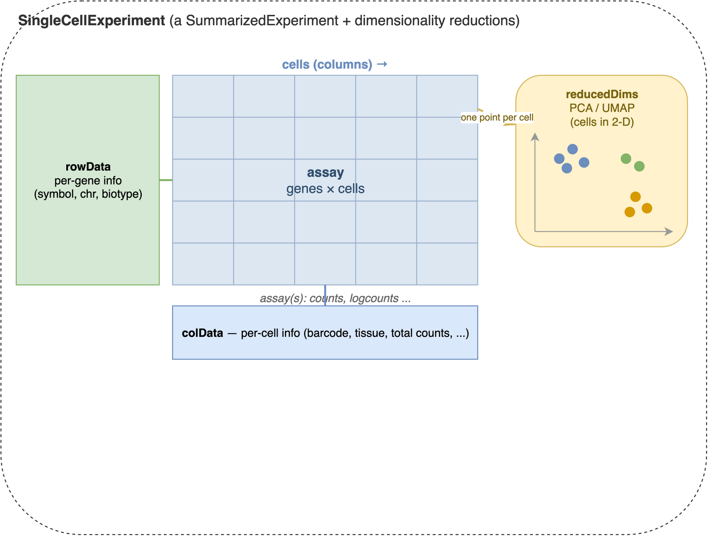](imgs/singlecellexperiment.png "Figure 39.1: The SingleCellExperiment container. At its centre is an assay matrix of measurements with genes down the rows and cells across the columns (counts, log-normalized counts, and so on). Aligned to that matrix are two metadata tables: rowData, one row per gene (gene symbols, chromosome, biotype), and colData, one row per cell (barcodes, tissue, quality metrics). A SingleCellExperiment adds reducedDims on top of the SummarizedExperiment it inherits from — a per-cell low-dimensional representation such as PCA or UMAP, with one point per cell (column).")

Figure 39.1: The `SingleCellExperiment` container. At its centre is an **assay** matrix of measurements with genes down the rows and cells across the columns (counts, log-normalized counts, and so on). Aligned to that matrix are two metadata tables: **rowData**, one row per gene (gene symbols, chromosome, biotype), and **colData**, one row per cell (barcodes, tissue, quality metrics). A `SingleCellExperiment` adds **reducedDims** on top of the `SummarizedExperiment` it inherits from — a per-cell low-dimensional representation such as PCA or UMAP, with one point per cell (column).

Printing the `sce` object gives us a summary of the dataset:

``` downlit
sce
```

    class: SingleCellExperiment 
    dim: 20006 3005 
    metadata(0):
    assays(1): counts
    rownames(20006): Tspan12 Tshz1 ... mt-Rnr1 mt-Nd4l
    rowData names(1): featureType
    colnames(3005): 1772071015_C02 1772071017_G12 ... 1772066098_A12
      1772058148_F03
    colData names(9): tissue group # ... level1class level2class
    reducedDimNames(0):
    mainExpName: gene
    altExpNames(2): repeat ERCC

The `SingleCellExperiment` object contains:

- **Assays**: The main data matrix (counts) and any additional matrices (e.g., normalized counts).
- **Row metadata**: Information about genes (e.g., gene names, IDs).
- **Column metadata**: Information about cells (e.g., cell barcodes, tissue type, experimental conditions).

It **can** also contain additional information such as dimensionality reductions (e.g., PCA, UMAP), clustering results, and quality control metrics.

In fact, we are going to add some of this additional information in the next steps. First, we add a new assay with the log-normalized counts, which is a common preprocessing step in single-cell RNA-seq analysis.

``` downlit
sce <- normalizeRnaCounts.se(sce)
```

The [`normalizeRnaCounts.se()`](https://rdrr.io/pkg/scrapper/man/normalizeRnaCounts.se.html) function performs log-normalization of the count data. It reads the `counts` assay, computes a size factor for each cell, and writes a new `logcounts` assay (and a `sizeFactor` column) back into the `sce` object — so afterwards `logcounts(sce)` holds the normalized values. Raw count data from scRNA-seq experiments contains technical variation due to differences in sequencing depth between cells. Some cells might have been sequenced more deeply than others, leading to higher total counts that don’t reflect true biological differences. Log-normalization addresses this by:

1.  **Size factor normalization**: Scaling each cell’s counts by a per-cell *size factor* that captures how deeply it was sequenced. [`normalizeRnaCounts.se()`](https://rdrr.io/pkg/scrapper/man/normalizeRnaCounts.se.html) uses the simplest such factor — the cell’s total count (its *library size*), centered so the average factor across cells is 1 — and divides every gene’s count by it. More robust estimators exist; the [concepts chapter](../single_cell/concepts.llms.md#sec-normalization) explains the deconvolution refinement used when cells differ in composition.
2.  **Log transformation**: Taking log(count + 1) to stabilize variance and make the data more normally distributed

For each gene g in cell i, the log-normalized expression becomes:

\\log_2\left(\frac{count\_{g_i}}{{size factor}\_{i}} + 1\right)\\

This log transformation is useful because the next steps in the downstream analyses (like clustering and dimensionality reduction) assume that the data is approximately normally distributed (or at least bell-shaped). Log-normalization helps achieve this by reducing the impact of outliers and making the data more suitable for PCA and visualization.

## 39.3 Dimensionality reduction

Single-cell datasets are extremely high-dimensional - typically containing 15,000-30,000 genes per cell. This creates several challenges: computational complexity, noise dominance, and visualization difficulties. Dimensionality reduction techniques help us identify the most informative patterns in the data while reducing noise and computational burden.

### 39.3.1 Feature selection: identifying highly variable genes

Before applying dimensionality reduction, we need to identify the most informative genes. Highly variable genes (HVGs) are those that show significant variation across cells, indicating they may be biologically relevant. These genes are often more informative for downstream analyses like clustering and visualization.

Not all genes are equally informative for distinguishing cell types. Genes that show little variation across cells (like housekeeping genes) don’t help us identify distinct cell populations. Highly variable genes are more likely to:

- Reflect biological differences between cell types
- Capture developmental or activation states
- Represent responses to environmental conditions

``` downlit
sce <- chooseRnaHvgs.se(sce, top=2000)
top_var_genes <- rownames(sce)[rowData(sce)$hvg]
```

The [`chooseRnaHvgs.se()`](https://rdrr.io/pkg/scrapper/man/chooseRnaHvgs.se.html) function identifies the top 2000 highly variable genes based on their variance across cells. It models the mean–variance relationship internally, marks the chosen genes with a logical `hvg` column in `rowData(sce)`, and also stores the per-gene `means`, `variances`, and `fitted` trend values there. We pull the names of the selected genes into `top_var_genes` for the steps that need an explicit gene list. Choosing a subset of highly variable genes reduces the dimensionality of the dataset while retaining the most informative features for downstream analyses.

The algorithm models the relationship between gene expression mean and variance, then identifies genes that show more variation than expected based on their expression level. This accounts for the fact that highly expressed genes naturally show more variance.

``` downlit
# Visualizing the highly variable genes. chooseRnaHvgs.se() already stored the
# per-gene mean, variance, fitted trend, and hvg flag in rowData(sce).
rd <- rowData(sce)
plot(rd$means, rd$variances, xlab="Mean of log-expression",
    ylab="Variance of log-expression", ylim=c(0, 4))
# The fitted trend, drawn as a curve by ordering genes along the mean axis:
o <- order(rd$means)
lines(rd$means[o], rd$fitted[o], col="dodgerblue", lwd=2)
# Highlight the genes flagged as highly variable:
points(
    rd$means[rd$hvg], rd$variances[rd$hvg],
    col="red", pch=16, cex=0.5
)
```

[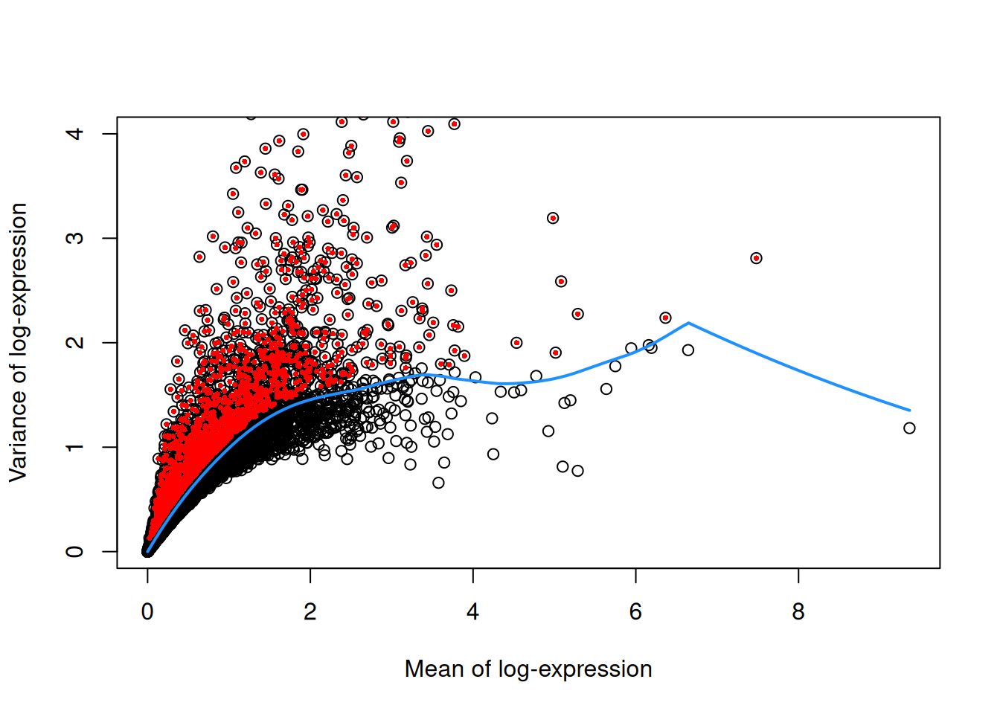](setup_files/figure-html/fig-scRNAseq-hvg-1.png "Figure 39.2: A plot of the mean vs variance of log-expression for all the genes in the dataset, with the highly variable genes highlighted in red. Here, the x-axis represents the mean log-expression of each gene, and the y-axis represents the variance of log-expression. The blue curve represents the trend of variance as a function of mean expression, while the red points represent the highly variable genes.")

Figure 39.2: A plot of the mean vs variance of log-expression for all the genes in the dataset, with the highly variable genes highlighted in red. Here, the x-axis represents the mean log-expression of each gene, and the y-axis represents the variance of log-expression. The blue curve represents the trend of variance as a function of mean expression, while the red points represent the highly variable genes.

[Figure fig-scRNAseq-hvg](#fig-scRNAseq-hvg) shows the mean vs. variance of log-expression for all genes in the dataset, with highly variable genes highlighted in red. The blue curve represents the trend of variance as a function of mean expression, while the red points represent the highly variable genes.

We next proceed to calculating PCA using the subset of highly variable genes. PCA is a linear dimensionality reduction technique that finds the directions of maximum variance in the data. It’s computationally efficient and provides a good foundation for further analysis. The first few principal components capture the most important patterns of variation in the dataset.

> **TIP:**
>
> PCA is a widely *linear* dimensionality reduction technique that:
>
> - Reduces dimensionality while preserving variance
> - Helps visualize high-dimensional data in 2D or 3D
> - Serves as a preprocessing step for other methods like t-SNE or UMAP
> - Is computationally efficient and easy to interpret

``` downlit
# Perform PCA on the highly variable genes
set.seed(100) # See below.
sce <- runPca.se(sce, features=rowData(sce)$hvg)

reducedDimNames(sce)
```

    [1] "PCA"

Note that we assign the output of [`runPca.se()`](https://rdrr.io/pkg/scrapper/man/runPca.se.html) back to the `sce` object. The `features=rowData(sce)$hvg` argument restricts the PCA to the highly variable genes we flagged earlier, reducing the dimensionality of the dataset while retaining the most informative features. Because dimensionality reduction is a common step in single-cell RNA-seq analysis, the function stores the PCA results in the `reducedDims` slot of the `SingleCellExperiment` object (under the name `"PCA"`). This allows us to easily access and visualize the PCA coordinates later.

### 39.3.2 Non-linear dimensionality reduction with UMAP

After PCA, we apply a non-linear method to squeeze the data down to two dimensions we can actually look at. **UMAP** (Uniform Manifold Approximation and Projection) has become the field’s default for this step: it is fast, scales to very large datasets, and tends to preserve more of the *global* structure — the relative arrangement of clusters — than its predecessor, t-SNE. We’ll use it as our map for the rest of the chapter, and compare the two head-to-head in a moment.

> **TIP:**
>
> This is a two-step approach:
>
> 1.  **PCA first** compresses thousands of genes into a few dozen components, stripping noise while keeping the main axes of variation.
> 2.  **UMAP second** takes those components and lays them out in 2D so neighbouring cells sit together.
>
> One rule worth burning in: UMAP (like t-SNE) is a **visualization** of the data, not the data itself. It deliberately distorts distances to make a readable picture — so you *look* at it, but you do not *compute* on it. In particular, cluster on the PCA coordinates — the richer, denoised space — not on the 2-D embedding. Squeezing dozens of principal components down to two inevitably distorts distances and densities ([Chari and Pachter 2023](#ref-doi:10.1371/journal.pcbi.1011288)), so clustering runs on the PCs while the embedding stays a picture — the convention OSCA, Seurat, and scanpy all follow ([Amezquita et al. 2019](#ref-doi:10.1038/s41592-019-0654-x)). The [concepts chapter](../single_cell/concepts.llms.md) unpacks the reasoning.

UMAP uses a random initialization, so its output changes from run to run. We call [`set.seed()`](https://rdrr.io/r/base/Random.html) first so the figure is reproducible — you’ll see exactly the same map we do.

``` downlit
set.seed(1234)
sce <- runUmap.se(sce, reddim.type="PCA")
```

The [`runUmap.se()`](https://rdrr.io/pkg/scrapper/man/runUmap.se.html) function builds the embedding from the PCA results and stores it in the `reducedDims` slot (under `"UMAP"`). The `reddim.type="PCA"` argument tells it to start from the PCA coordinates rather than the raw genes.

Now we cluster. Graph-based clustering is stochastic, so we set a seed first — and, following the rule above, we cluster on the **PCA** coordinates, not on the UMAP.

``` downlit
set.seed(1234)
sce <- clusterGraph.se(sce, reddim.type="PCA")
nn.clusters <- factor(sce$clusters)
table(nn.clusters)
```

    nn.clusters
      1   2   3   4   5   6   7   8   9  10  11  12  13  14 
    288 218 208 213 486 185 190  65  98 432 106 263  87 166 

The [`clusterGraph.se()`](https://rdrr.io/pkg/scrapper/man/clusterGraph.se.html) function uses graph-based clustering to identify groups of similar cells. Graph-based clustering was [popularized by the Seurat package](https://satijalab.org/seurat/articles/pbmc3k_tutorial.html#cluster-the-cells): it builds a nearest-neighbor graph and then finds communities within it, and the resulting clusters often correspond to distinct cell types or states. It writes the assignments to a `clusters` column in `colData(sce)`; we wrap them in a factor and keep a copy in `nn.clusters`. The `reddim.type="PCA"` argument points it at the denoised PCA space — the full set of principal components carries far more signal than the two UMAP axes, which exist only for viewing. Other methods exist (k-means, hierarchical clustering), but graph-based clustering suits single-cell data because it handles complex, non-linear structure and scales well.

The table above is your first concrete result: each entry is the number of cells assigned to a cluster, so you can read off how many groups the algorithm found and roughly how balanced they are. A handful of large clusters plus several small ones is typical — the large ones are usually abundant cell types, the small ones rare populations.

### 39.3.3 Visualizing cell types and clusters

This dataset ships with pre-defined cell type annotations in the `level1class` and `level2class` columns, which we can use to color the UMAP and see how well the structure lines up with known biology. The [`plotReducedDim()`](https://rdrr.io/pkg/scater/man/plotReducedDim.html) function from the `scater` package draws a scatter plot of any stored embedding, coloring the points by cluster assignment or any cell metadata.

``` downlit
library(scater)
colLabels(sce) <- nn.clusters
plotReducedDim(sce, "UMAP", colour_by="level1class")
```

[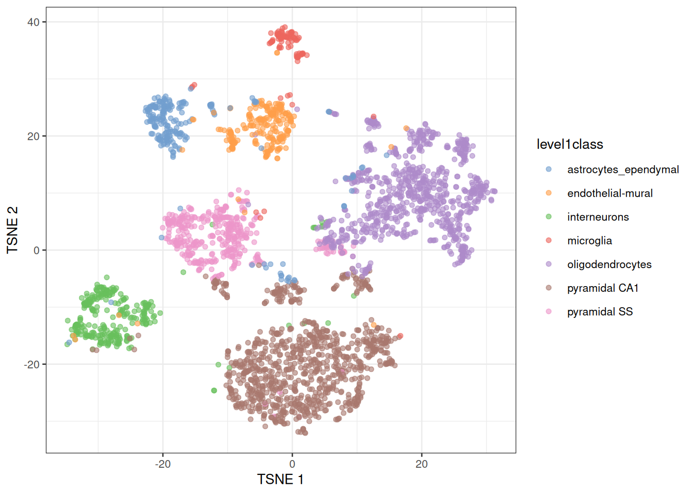](setup_files/figure-html/fig-level1-class-1.png "Figure 39.3: ")

Figure 39.3

[Figure fig-level1-class](#fig-level1-class) is the payoff of the whole workflow so far. Each point is a cell, placed by UMAP so that similar cells sit close together, and colored by its known `level1class` cell type. Because cells of the same type fall into the same visual island, you can see at a glance that the unsupervised steps — normalization, HVG selection, PCA, UMAP — recovered real biology: the broad cell types separate cleanly without ever being told what they were.

We can also visualize the second, finer level of cell type annotations.

``` downlit
plotReducedDim(sce, "UMAP", colour_by="level2class")
```

[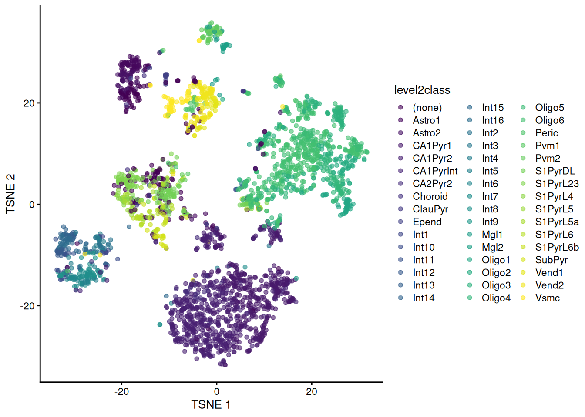](setup_files/figure-html/fig-level2-class-1.png "Figure 39.4: ")

Figure 39.4

And overlay additional metadata such as tissue type. The `shape_by` argument differentiates points by another categorical variable.

``` downlit
plotReducedDim(sce, "UMAP", colour_by="level1class", shape_by="tissue")
```

[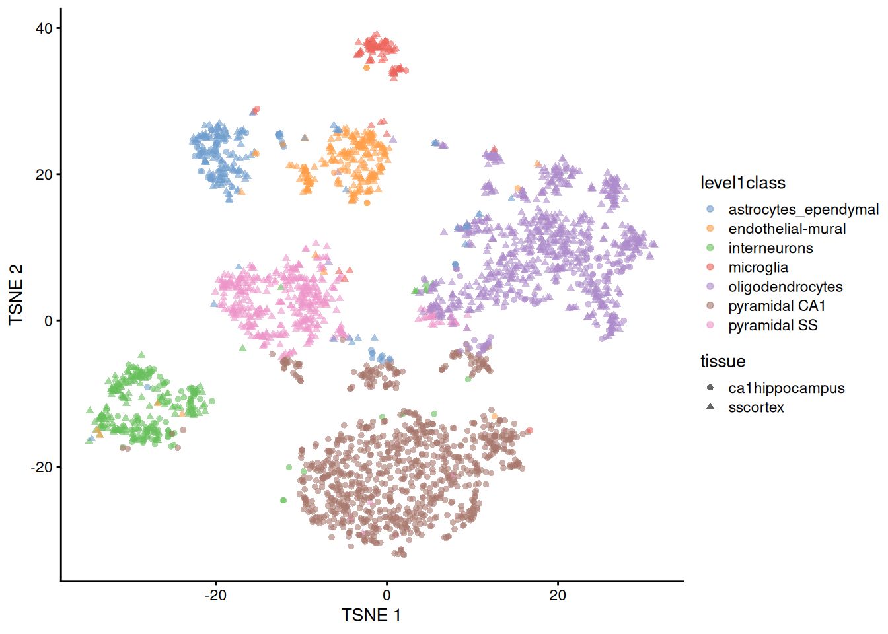](setup_files/figure-html/fig-level1-tissue-1.png "Figure 39.5: ")

Figure 39.5

### 39.3.4 t-SNE vs UMAP

UMAP didn’t appear from nowhere — for years **t-SNE** (t-distributed Stochastic Neighbor Embedding) was the default single-cell map, and you’ll still meet it everywhere. It’s worth running both once to see how they differ. Both start from the same PCA input; t-SNE optimizes for *local* neighbourhoods, which tends to spread clusters into well-separated blobs, while UMAP keeps more of the global layout and runs faster on large data.

``` downlit
library(ggplot2)
library(patchwork)
set.seed(1234)
sce <- runTsne.se(sce, reddim.type="PCA")
p_umap <- plotReducedDim(sce, "UMAP", colour_by="level1class") + ggtitle("UMAP")
p_tsne <- plotReducedDim(sce, "TSNE", colour_by="level1class") + ggtitle("t-SNE")
(p_umap | p_tsne) + plot_layout(guides = "collect")
```

[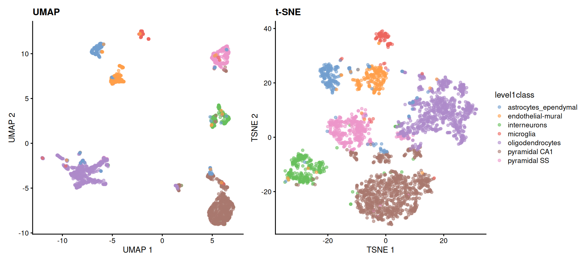](setup_files/figure-html/fig-tsne-umap-1.png "Figure 39.6: The same cells, the same PCA input, two embeddings — colored by level1class. Both recover the same cell-type islands; the choice between them is about readability and speed, not correctness. In neither plot should the distances between islands be read quantitatively.")

Figure 39.6: The same cells, the same PCA input, two embeddings — colored by `level1class`. Both recover the same cell-type islands; the choice between them is about readability and speed, not correctness. In neither plot should the distances *between* islands be read quantitatively.

The reassuring result is that both embeddings tell the same story — the same cell types form the same islands. They are two readable pictures of one underlying structure, and modern workflows reach for UMAP first. From here on we’ll stick with the UMAP.

## 39.4 Finding marker genes

Marker genes are genes that are differentially expressed in a specific cell type or cluster compared to others. Identifying marker genes helps us understand the molecular characteristics of each cell type and can provide insights into their functions.

To find marker genes, we use the [`scoreMarkers()`](https://rdrr.io/pkg/scrapper/man/scoreMarkers.html) function from the `scrapper` package. For every group, it compares each gene’s expression against every *other* group and summarizes the result as an **effect size** — here we use Cohen’s *d*, a standardized difference in mean expression. A gene that is strongly and consistently higher in one group than in all the others gets a large effect size for that group, marking it as a good marker.

``` downlit
markers <- scoreMarkers(logcounts(sce)[top_var_genes, ],
                        groups=colData(sce)$level1class)
```

We pass `logcounts(sce)[top_var_genes, ]` — the log-normalized matrix restricted to the highly variable genes we identified earlier, which are more likely to be informative for distinguishing cell types — and `groups=...` tells the function which cell type each cell belongs to.

The resulting `markers` object is a list. The piece we want is `markers$cohens.d`: a per-group list of tables, one row per gene, whose `mean` column is that gene’s average Cohen’s *d* across all pairwise comparisons. Ranking a group’s genes by that column, from largest to smallest, puts its best markers on top. The small helper below does exactly that, and we reuse it whenever we need ranked markers.

``` downlit
# Rank a group's genes by mean Cohen's d (largest effect size first).
rank_markers <- function(effects) rownames(effects)[order(effects$mean, decreasing=TRUE)]
```

A compact way to see all the groups at once is a heatmap: take the top genes from every group, then plot their expression across all the cells. The code below pulls the top 10 marker genes for each cell type, collapses them into one unique set, and draws a single heatmap. This lets us see which genes are most strongly associated with each cell type and how they differ from one another.

``` downlit
# Heatmap of the top marker genes across all cell types
top_marker_genes_for_all_clusters <- lapply(markers$cohens.d, function(eff) {
    return(head(rank_markers(eff), 10))
})
plotHeatmap(sce, features=unique(unlist(top_marker_genes_for_all_clusters)),
    cluster_rows=TRUE, cluster_cols=TRUE, show_colnames=FALSE,
    main="Top marker genes for all clusters",
    color_columns_by="level1class")
```

[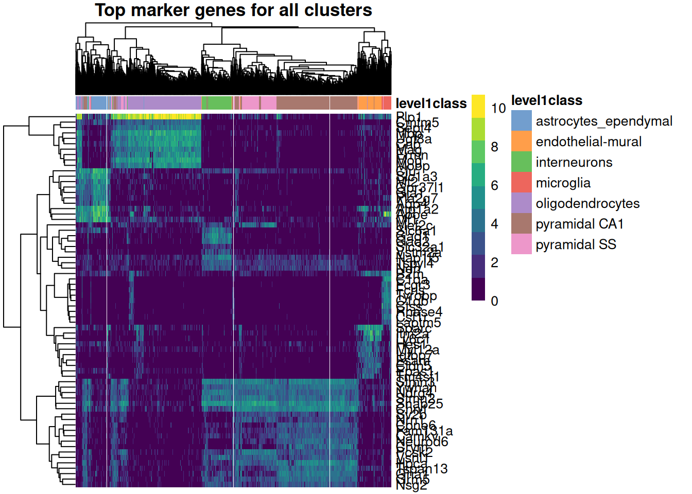](setup_files/figure-html/fig-marker-heatmap-1.png "Figure 39.7: ")

Figure 39.7

In [Figure fig-marker-heatmap](#fig-marker-heatmap) the columns are cells (grouped and colored by cell type) and the rows are marker genes. The blocky structure is what you’re after: each set of marker genes lights up in one band of cells and stays dim elsewhere, which is exactly what makes them useful as markers — they cleanly distinguish one population from the rest.

### 39.4.1 Markers for the clusters you discovered

The markers above were found per *curated cell type* — a shortcut this teaching dataset allows because it ships with `level1class` labels. A real analysis has no such labels: you find markers for the **clusters you actually discovered**, then use those markers to give each cluster an identity. Let’s do it that way. We ask [`scoreMarkers()`](https://rdrr.io/pkg/scrapper/man/scoreMarkers.html) to compare the graph-based clusters stored in `colLabels(sce)` (the [`clusterGraph.se()`](https://rdrr.io/pkg/scrapper/man/clusterGraph.se.html) output from earlier), take each cluster’s single top gene, and paint that gene’s expression onto the UMAP.

``` downlit
# Find markers for the data-driven clusters (colLabels holds the clusterGraph.se
# assignments), not the curated cell-type labels.
cluster_markers <- scoreMarkers(logcounts(sce)[top_var_genes, ],
                                groups = colLabels(sce))

# The single top marker gene for each cluster (highest mean Cohen's d).
top_per_cluster <- vapply(cluster_markers$cohens.d,
                          function(eff) rank_markers(eff)[1], character(1))

# Paint the four largest clusters, each colored by its top marker's expression.
biggest <- names(sort(table(colLabels(sce)), decreasing = TRUE))[1:4]

library(ggplot2)
library(patchwork)
panels <- lapply(biggest, function(cl) {
  gene <- top_per_cluster[[cl]]
  plotReducedDim(sce, "UMAP", colour_by = gene) +
    ggtitle(sprintf("cluster %s — %s", cl, gene))
})
wrap_plots(panels, ncol = 2)
```

[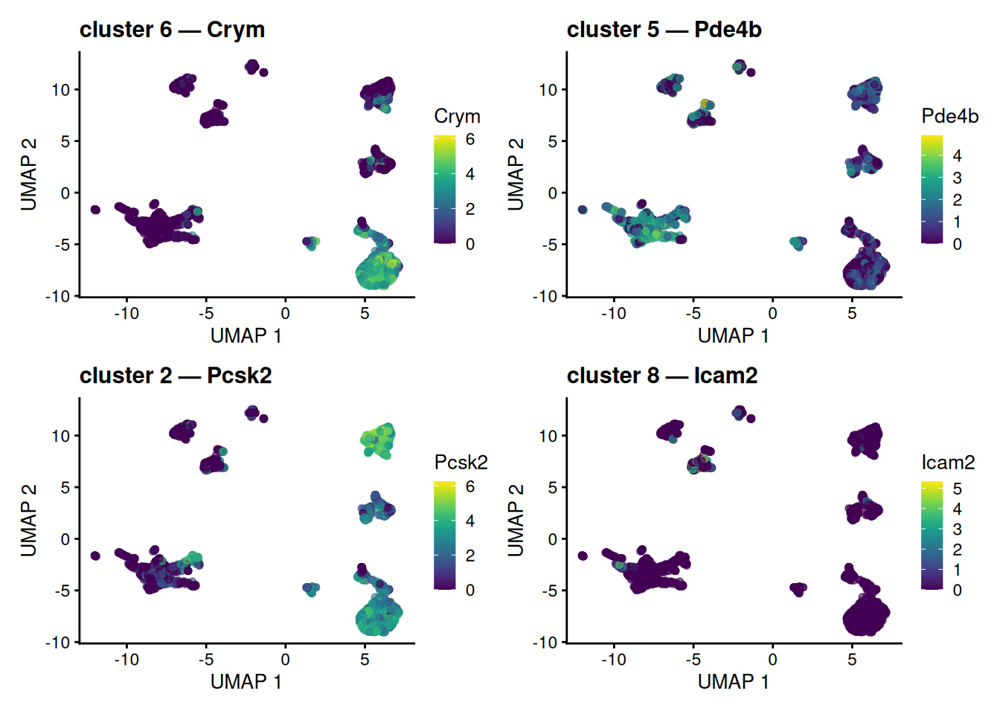](setup_files/figure-html/fig-umap-cluster-markers-1.png "Figure 39.8: The four largest graph-based clusters, each UMAP colored by that cluster’s own top marker gene — found by scoreMarkers() on colLabels(sce), the data-driven clusters, not the curated labels. Each marker is most strongly expressed in and around its own cluster; some tag a whole island, while others pick out a sub-population within one. Painting a cluster’s marker onto the map this way is the visual basis for turning an anonymous cluster number into a named cell type.")

Figure 39.8: The four largest graph-based clusters, each UMAP colored by that cluster’s own top marker gene — found by [`scoreMarkers()`](https://rdrr.io/pkg/scrapper/man/scoreMarkers.html) on `colLabels(sce)`, the data-driven clusters, *not* the curated labels. Each marker is most strongly expressed in and around its own cluster; some tag a whole island, while others pick out a sub-population within one. Painting a cluster’s marker onto the map this way is the visual basis for turning an anonymous cluster number into a named cell type.

Each panel lifts out one cluster’s top gene and shows where it is expressed. Some markers tag a whole island cleanly; others light up only part of the large neuronal island, where several graph-based clusters coexist — a reminder that clustering on the PCs resolves finer structure than the 2-D map alone reveals. Either way, the logic is the engine of annotation: an anonymous cluster number plus its localized marker equals a callable cell identity, and we reached it without ever touching the curated labels. (The next section revisits the idea with those labels as an answer key.)

## 39.5 From clusters to cell types: annotation

Clustering handed us groups, but a group labeled “cluster 3” tells a biologist nothing. **Annotation** is the step that attaches a *biological identity* to each cluster, and it comes in two broad flavors — the same two the [concepts chapter](../single_cell/concepts.llms.md) lays out:

- **Reference-based** — score each cell against an annotated reference atlas and transfer the closest label (e.g. `SingleR`, Azimuth). Fast and reproducible when a good reference exists for your tissue; it’s the first thing to reach for in a real project, though we won’t run it here.
- **Marker-based** — match each cluster’s marker genes against known cell-type signatures. This is the route we can take *right now*, because we already have marker genes in hand from the previous section.

This dataset is unusual in shipping curated `level1class` labels, so we can *check* our marker-based reasoning against a trusted answer. Treat that as training wheels — in your own data those labels are exactly what you are trying to produce.

### 39.5.1 Painting marker genes onto the map

The heatmap showed marker genes as a block matrix. A complementary view is to paint a single marker gene’s expression straight onto the UMAP we built earlier, so you can see *where* it is expressed. Color the map by individual marker genes — the single top-ranked marker for each of several cell types — and watch each gene light up its own territory.

``` downlit
# The per-cell-type marker lists we built earlier are already named by cell type,
# because scoreMarkers() was grouped by level1class.
celltype_names <- names(top_marker_genes_for_all_clusters)

# The single top marker gene for four representative cell types.
show_types <- head(celltype_names, 4)
top_one <- vapply(top_marker_genes_for_all_clusters[show_types],
                  function(g) g[1], character(1))

library(patchwork)
panels <- lapply(seq_along(top_one), function(i) {
  plotReducedDim(sce, "UMAP", colour_by = top_one[i]) +
    ggtitle(sprintf("%s\n(%s)", names(top_one)[i], top_one[i]))
})
wrap_plots(panels, ncol = 2)
```

[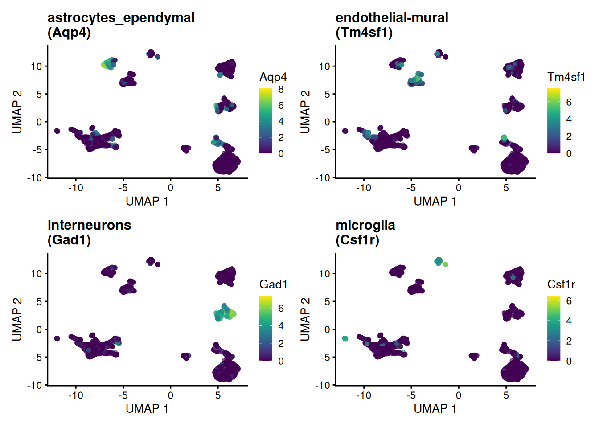](setup_files/figure-html/fig-umap-markers-1.png "Figure 39.9: The UMAP colored by the top marker gene of four representative cell types. Each marker concentrates in the island its cell type occupies — the spatial counterpart of the block structure in the marker heatmap.")

Figure 39.9: The UMAP colored by the top marker gene of four representative cell types. Each marker concentrates in the island its cell type occupies — the spatial counterpart of the block structure in the marker heatmap.

Each marker concentrates in exactly the island its cell type occupies — visual confirmation that these genes earn the name “marker.”

### 39.5.2 Marker lists are gene sets

Here is the idea worth carrying away. A cell type’s marker genes are nothing more — and nothing less — than a **gene set**: a named list of genes that, together, characterize a biological state. Deciding whether a cluster *is* a given cell type then becomes “is this gene set collectively high in these cells?” — which is exactly the question gene-set and pathway-enrichment analysis asks, only pointed at cell-type signatures instead of GO terms or KEGG pathways.

We can make that concrete with the simplest possible score — the mean log-expression of a marker set in each cell — and paint it onto the map:

``` downlit
# A cell type's marker genes ARE a gene set; score each cell by the set's mean.
score_gene_set <- function(sce, genes) {
  genes <- intersect(genes, rownames(sce))
  colMeans(logcounts(sce)[genes, , drop = FALSE])
}

target <- grep("interneuron", celltype_names, value = TRUE)[1]
if (is.na(target)) target <- celltype_names[1]   # fall back if naming differs
sce$marker_score <- score_gene_set(sce, top_marker_genes_for_all_clusters[[target]])

plotReducedDim(sce, "UMAP", colour_by = "marker_score") +
  ggtitle(sprintf("Module score for the %s marker set", target))
```

[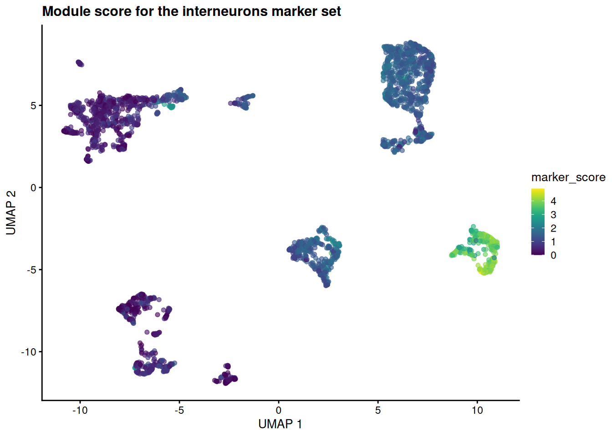](setup_files/figure-html/fig-umap-score-1.png "Figure 39.10: A ‘module score’ — the mean log-expression of a cell type’s marker set — painted onto the UMAP. Scoring cells against a set of genes (here the interneuron markers) is the same operation as gene-set / pathway scoring; the high-scoring cells localize to the interneuron island.")

Figure 39.10: A ‘module score’ — the mean log-expression of a cell type’s marker set — painted onto the UMAP. Scoring cells against a *set* of genes (here the interneuron markers) is the same operation as gene-set / pathway scoring; the high-scoring cells localize to the interneuron island.

The high-scoring cells pile onto a single island — the same one the curated labels call interneurons. A whole *set* of genes, scored together and pointed at a cell type, exactly as a pathway score points at a pathway.

Real annotation tools formalize this same move. Marker-set scorers like `AUCell` and `UCell` swap our crude mean for a rank-based enrichment statistic; reference-based methods like `SingleR` score each cell against *many* signatures at once and assign the best fit. The mental model is identical to gene-set analysis — only the gene sets have changed.

> **WARNING:**
>
> We derived these marker sets *from these very clusters*, so scoring the same cells with them is somewhat circular — it confirms internal consistency, not external truth (the [concepts chapter](../single_cell/concepts.llms.md) unpacks this “double-dipping” trap). Honest annotation scores cells against marker sets defined *independently* — from a reference atlas or the literature — which is why reference-based methods are the gold standard when a reference exists.

> **TIP:**
>
> If you remember one thing from this section: **annotating cells by marker lists and testing gene sets for enrichment are the same operation.** A cell-type signature is a gene set; a module score is an enrichment score; choosing the best-scoring label is choosing the most enriched set. Learn one and you have largely learned the other.

## 39.6 Interactive visualization with iSEE

The [Interactive SummarizedExperiment Explorer (iSEE)](https://www.bioconductor.org/packages/release/bioc/html/iSEE.html) is a powerful tool for exploring single-cell data interactively. It allows us to visualize and interact with the data in real-time, making it easier to explore complex datasets and identify patterns.

A key component of iSEE is the `SingleCellExperiment` object, which serves as the data container for single-cell RNA-seq data. iSEE provides a user-friendly interface for exploring the data.

To use iSEE, we first need to install the `iSEE` package and then launch the iSEE app.

``` downlit
# Install iSEE package if not already installed
iSEE::iSEE(sce)
```

The `iSEE()` function launches the iSEE app, which provides an interactive interface for exploring the `SingleCellExperiment` object.

You may want to play with a few genes to see how they are expressed across the different clusters. You can also explore the metadata associated with the cells, such as tissue type, cell type annotations, and quality control metrics. The set of “marker genes” we identified earlier can also be visualized in iSEE, allowing us to see how these genes are expressed across different clusters and cell types.

For the first cell type (astrocytes_ependymal), the marker genes are:

``` downlit
cat(paste(top_marker_genes_for_all_clusters[[1]],'\n'))
```

    Slc1a3 
     Clu 
     Gpr37l1 
     Apoe 
     Gja1 
     Mt2 
     Pla2g7 
     Aqp4 
     Mt1 
     Atp1a2 

Try entering a couple of those gene names into the iSEE feature-expression panels to see how they vary across the clusters.

## 39.7 Exercises

These build directly on the `sce` object you created above. If you’ve closed your session, re-run the chapter up to the marker-gene step first.

1.  **Read the cluster table.** How many clusters did [`clusterGraph.se()`](https://rdrr.io/pkg/scrapper/man/clusterGraph.se.html) find, and which is the largest? Which function’s output answers this?

    > **NOTE:**
    > ``` downlit
    > table(nn.clusters)
    > ```
    >
    >     nn.clusters
    >       1   2   3   4   5   6   7   8   9  10  11  12  13  14 
    >     288 218 208 213 486 185 190  65  98 432 106 263  87 166 
    >
    > ``` downlit
    > length(unique(nn.clusters))   # number of clusters
    > ```
    >
    >     [1] 14
    >
    > ``` downlit
    > which.max(table(nn.clusters)) # the most populous cluster
    > ```
    >
    >     5 
    >     5 
    >
    > [`table()`](https://rdrr.io/r/base/table.html) counts cells per cluster; `length(unique(...))` turns that into the number of groups. The largest cluster is usually an abundant cell type rather than a rare one.

2.  **Tune the number of variable genes.** Re-select the top variable genes asking for only 500 instead of 2000. ([`chooseRnaHvgs.se()`](https://rdrr.io/pkg/scrapper/man/chooseRnaHvgs.se.html) already stored each gene’s variability as the `residuals` column of `rowData(sce)`, so you can re-rank without re-modelling.) Does the size of the gene set change which features you’d carry into PCA?

    > **NOTE:**
    > ``` downlit
    > top_500_idx <- chooseHighlyVariableGenes(rowData(sce)$residuals, top=500)
    > top_500 <- rownames(sce)[top_500_idx]
    > length(top_500)
    > ```
    >
    >     [1] 500
    >
    > ``` downlit
    > length(intersect(top_500, top_var_genes))  # overlap with the 2000-gene set
    > ```
    >
    >     [1] 500
    >
    > The 500 genes are (almost entirely) a subset of the 2000 — they are simply the *most* variable ones. Picking fewer genes is faster and noisier; picking more keeps weaker signal at the cost of more noise. There is no single right answer, which is why it’s a choice you make deliberately.

3.  **Switch the coloring.** Redraw the UMAP, but color the cells by their cluster label (`colour_by="label"`) instead of by the known cell type. How well do the data-driven clusters line up with the annotated cell types in [Figure fig-level1-class](#fig-level1-class)?

    > **NOTE:**
    > ``` downlit
    > plotReducedDim(sce, "UMAP", colour_by="label")
    > ```
    >
    > [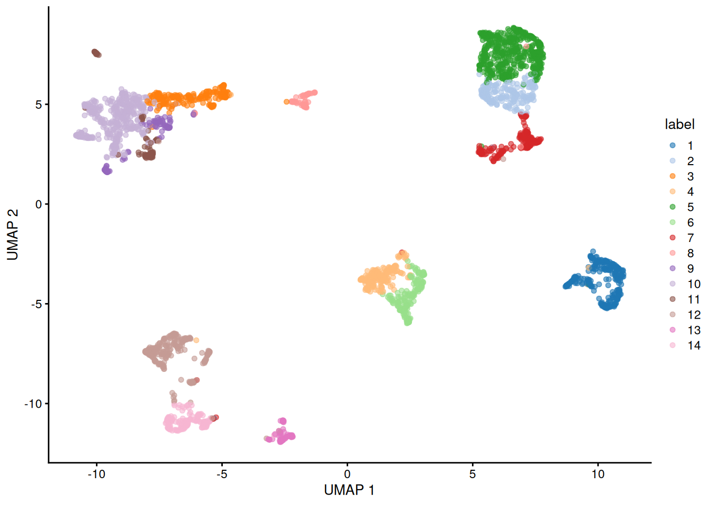](setup_files/figure-html/fig-umap-by-cluster-1.png "Figure 39.11: ")
    >
    > Figure 39.11
    >
    > Each cluster occupies its own island, and those islands correspond closely to the cell-type islands you saw earlier — evidence that the unsupervised clustering recovered the same structure as the curated annotations.

4.  **Score a different cell type.** Pick another entry of `celltype_names` — say an oligodendrocyte or astrocyte type — recompute the module score for *its* marker set, and redraw the UMAP. Does the high-scoring region land on that cell type’s island in [Figure fig-level1-class](#fig-level1-class)?

    > **NOTE:**
    > ``` downlit
    > target2 <- grep("oligodendrocyte", celltype_names, value = TRUE)[1]
    > if (is.na(target2)) target2 <- celltype_names[2]   # fall back if naming differs
    > sce$marker_score2 <- score_gene_set(sce, top_marker_genes_for_all_clusters[[target2]])
    > plotReducedDim(sce, "UMAP", colour_by = "marker_score2") +
    >     ggtitle(sprintf("Module score for the %s marker set", target2))
    > ```
    >
    > [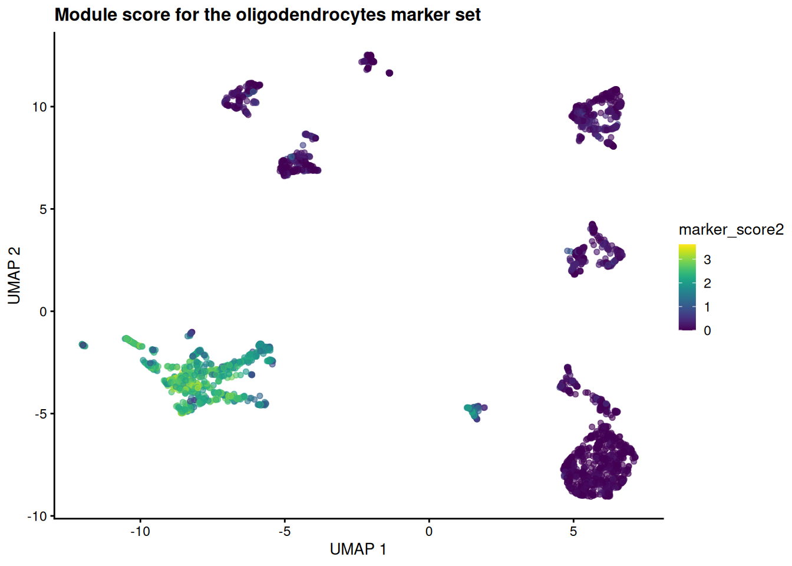](setup_files/figure-html/fig-umap-score-oligo-1.png "Figure 39.12: ")
    >
    > Figure 39.12
    >
    > The hot spot moves to a different island — the one the curated labels call oligodendrocytes. Same machinery, different gene set: that is the whole point of treating annotation as gene-set scoring.

## 39.8 Summary

You took a published mouse-brain dataset all the way from raw counts to a labeled map of cell types, and in doing so walked the standard scRNA-seq workflow:

- **Loaded** the data as a `SingleCellExperiment` — a `SummarizedExperiment` (the [SummarizedExperiment chapter](../bioc-summarizedexperiment.llms.md)) with single-cell extras like a reduced-dimensions slot.
- **Log-normalized** the counts with [`normalizeRnaCounts.se()`](https://rdrr.io/pkg/scrapper/man/normalizeRnaCounts.se.html) to correct for differences in sequencing depth between cells.
- **Selected highly variable genes** with [`chooseRnaHvgs.se()`](https://rdrr.io/pkg/scrapper/man/chooseRnaHvgs.se.html), focusing the analysis on the genes that carry biological signal.
- **Reduced dimensions** with [`runPca.se()`](https://rdrr.io/pkg/scrapper/man/runPca.se.html) and then [`runUmap.se()`](https://rdrr.io/pkg/scrapper/man/runUmap.se.html) (with a t-SNE comparison), collapsing thousands of genes into a 2D map.
- **Clustered** the cells with [`clusterGraph.se()`](https://rdrr.io/pkg/scrapper/man/clusterGraph.se.html) on the PCA coordinates — not the 2-D embedding — and read the cluster table to see how many groups emerged.
- **Found and visualized marker genes** with [`scoreMarkers()`](https://rdrr.io/pkg/scrapper/man/scoreMarkers.html) and [`plotHeatmap()`](https://rdrr.io/pkg/scater/man/plotHeatmap.html), confirming that each cluster has its own molecular fingerprint.
- **Connected markers to identity** by painting them onto a UMAP and scoring marker *sets* as a module score — framing cell-type annotation as the same operation as gene-set enrichment.

The reassuring result was that the unsupervised steps recovered the known cell types: clusters and curated labels landed on the same islands of the t-SNE and UMAP. From here you could reach for a reference-based annotator like `SingleR`, compare conditions across samples (the [concepts chapter](../single_cell/concepts.llms.md)’s Part B), or hand the object to an interactive explorer like iSEE.

## 39.9 Bonus: working with 10x Genomics data

The rest of the chapter is an optional appendix. Everything above used a curated dataset that arrives already cleaned and annotated. Real projects rarely start there: most droplet-based experiments come off a 10x Genomics platform as raw output that you must load and quality-control yourself. The code in this section is not executed (the files don’t exist in this book), but it shows the shape of that early workflow so you’ll recognize it when you meet it.

### 39.9.1 Understanding 10x Genomics output formats

10x Genomics Cell Ranger produces several output formats:

1.  **Matrix Market format** (`.mtx` files): Sparse matrix format with separate files for the matrix, gene names, and cell barcodes
2.  **HDF5 format** (`.h5` files): A single compressed file containing all the data
3.  **Filtered vs. unfiltered**: Cell Ranger provides both versions - filtered contains only cells that pass basic quality filters

### 39.9.2 Loading 10x data from Matrix Market files

``` downlit
# Loading from standard 10x output directory
# This assumes you have a directory with:
# - matrix.mtx.gz (or matrix.mtx)
# - features.tsv.gz (or genes.tsv.gz for older versions)
# - barcodes.tsv.gz

library(DropletUtils)
library(SingleCellExperiment)

# Method 1: Using DropletUtils (recommended)
sce_10x <- read10xCounts("path/to/10x/output/", col.names = TRUE)

# Method 2: Using Seurat (if you prefer the Seurat ecosystem)
# library(Seurat)
# seurat_obj <- Read10X("path/to/10x/output/")
# sce_10x <- as.SingleCellExperiment(CreateSeuratObject(seurat_obj))
```

**What we’re doing:** The `read10xCounts()` function from DropletUtils reads the three files that comprise 10x output and creates a SingleCellExperiment object. The `col.names = TRUE` parameter ensures that cell barcodes are used as column names.

**Why DropletUtils:** This package is specifically designed for handling droplet-based single-cell data (like 10x Genomics). It includes specialized functions for:

- Reading 10x formats efficiently
- Distinguishing empty droplets from cells
- Handling ambient RNA contamination
- Quality control specific to droplet-based methods

### 39.9.3 Loading from HDF5 files

``` downlit
# For HDF5 format files
library(rhdf5)

# Method 1: Using DropletUtils
sce_h5 <- read10xCounts("path/to/sample.h5", type = "HDF5")

# Method 2: Direct HDF5 reading (more control)
h5_file <- "path/to/sample.h5"
gene_info <- h5read(h5_file, "matrix/features")
barcodes <- h5read(h5_file, "matrix/barcodes")
matrix_data <- h5read(h5_file, "matrix/data")
# Additional processing needed to reconstruct sparse matrix
```

**What we’re doing:** HDF5 files are more convenient as they contain all information in a single file. The `type = "HDF5"` parameter tells the function to expect this format instead of separate matrix files.

**When to use H5 files:**

- **Convenience**: Single file is easier to manage and transfer
- **Speed**: Often faster to read than multiple compressed files
- **Storage**: More efficient storage, especially for large datasets

### 39.9.4 Essential quality control after loading raw data

``` downlit
# Add mitochondrial gene information
library(scuttle)
is.mito <- grepl("^MT-", rownames(sce_10x)) # Human mitochondrial genes
# For mouse data, use: is.mito <- grepl("^mt-", rownames(sce_10x))

# Calculate per-cell QC metrics
sce_10x <- addPerCellQC(sce_10x, subsets = list(Mito = is.mito))

# Calculate per-gene QC metrics
sce_10x <- addPerFeatureQC(sce_10x)

# View the QC metrics
colnames(colData(sce_10x))
```

**What we’re doing:** We’re calculating quality control metrics that are essential for raw 10x data:

- **Mitochondrial genes**: High mitochondrial gene expression often indicates dying cells
- **Per-cell metrics**: Total counts, number of detected genes, mitochondrial percentage
- **Per-gene metrics**: How many cells express each gene

**Why QC is crucial for raw data:** Unlike curated datasets, raw 10x data contains:

- **Empty droplets**: Droplets that captured ambient RNA but no cells
- **Dying cells**: Cells with compromised membranes
- **Doublets**: Droplets containing multiple cells
- **Low-quality cells**: Cells with very few detected genes

### 39.9.5 Filtering low-quality cells and genes

``` downlit
# Visualize QC metrics
library(scater)
plotColData(sce_10x, x = "sum", y = "detected", colour_by = "subsets_Mito_percent")

# Set filtering thresholds (these are examples - adjust based on your data)
# Filter cells
high_mito <- sce_10x$subsets_Mito_percent > 20  # Remove cells with >20% mitochondrial reads
low_lib_size <- sce_10x$sum < 1000              # Remove cells with <1000 total counts
low_n_features <- sce_10x$detected < 500        # Remove cells with <500 detected genes

# Filter genes (remove genes expressed in very few cells)
low_expression <- rowSums(counts(sce_10x) > 0) < 10  # Expressed in <10 cells

# Apply filters
sce_filtered <- sce_10x[!low_expression, !(high_mito | low_lib_size | low_n_features)]

# Check how many cells and genes remain
dim(sce_10x)      # Before filtering
dim(sce_filtered) # After filtering
```

**What we’re doing:** We’re applying filters to remove low-quality cells and rarely expressed genes. The specific thresholds should be adjusted based on your dataset characteristics.

**Understanding the filters:**

- **Mitochondrial percentage**: Cells with high mitochondrial gene expression are likely dying
- **Library size**: Total number of UMIs per cell - very low values suggest poor capture
- **Number of features**: How many different genes are detected - very low values suggest poor quality
- **Gene expression frequency**: Genes expressed in very few cells are often noise

**Critical considerations:**

- **Thresholds are dataset-dependent**: What works for one experiment may not work for another
- **Biological vs. technical variation**: Some cell types naturally have different RNA content
- **Visualization first**: Always plot your QC metrics before setting thresholds

## 39.10 Further reading and resources

For more in-depth information on single-cell RNA-seq analysis, consider the following resources:

- The [Orchestrating Single-Cell RNA-seq Analysis](https://osca.bioconductor.org/) book provides a comprehensive guide to single-cell RNA-seq analysis using Bioconductor.
- The [Seurat](https://satijalab.org/seurat/) package documentation offers extensive tutorials and vignettes for single-cell analysis in the Seurat ecosystem.

Amezquita, Robert A., Aaron T. L. Lun, Etienne Becht, et al. 2019. “Orchestrating Single-Cell Analysis with Bioconductor.” *Nature Methods* 17 (2): 137–45. <https://doi.org/10.1038/s41592-019-0654-x>.

Chari, Tara, and Lior Pachter. 2023. “The Specious Art of Single-Cell Genomics.” *PLOS Computational Biology* 19 (8): e1011288. <https://doi.org/10.1371/journal.pcbi.1011288>.

Lun, Aaron T. L., Davis J. McCarthy, and John C. Marioni. 2016. “A Step-by-Step Workflow for Low-Level Analysis of Single-Cell RNA-Seq Data with Bioconductor.” *F1000Res.* 5: 2122. <https://doi.org/10.12688/f1000research.9501.2>.

McCarthy, Davis J., Kieran R. Campbell, Aaron T. L. Lun, and Quin F. Willis. 2017. “Scater: Pre-Processing, Quality Control, Normalisation and Visualisation of Single-Cell RNA-Seq Data in R.” *Bioinformatics* 33: 1179–86. <https://doi.org/10.1093/bioinformatics/btw777>.

Risso, Davide, and Michael Cole. 2024. *scRNAseq: Collection of Public Single-Cell RNA-Seq Datasets*. <https://doi.org/10.18129/B9.bioc.scRNAseq>.

Zeisel, Amit, Ana B. Muñoz-Manchado, Simone Codeluppi, et al. 2015. “Cell Types in the Mouse Cortex and Hippocampus Revealed by Single-Cell RNA-seq.” *Science* 347 (6226): 1138–42. <https://doi.org/10.1126/science.aaa1934>.
