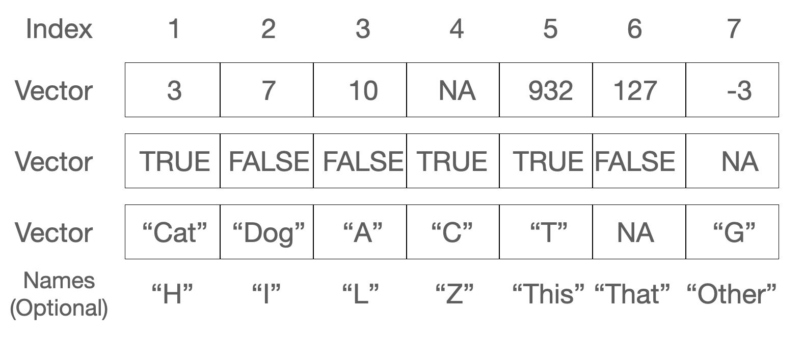

# 10  Vectors

Code

Author

Affiliation

[Sean Davis](https://seandavi.github.io/) [](mailto:seandavi@gmail.com)

[University of Colorado  
Anschutz School of Medicine](https://medschool.cuanschutz.edu/)

Published

June 1, 2024

Modified

September 19, 2026

Suppose you’ve just measured the expression of one gene across a dozen samples, or jotted down the ages of every patient in a study, or listed the gene names you want to pull out of a results table. Each of those is the same shape: a single, ordered run of values of one kind. R has a container built exactly for that shape, and it is the workhorse you’ll reach for more than any other. It’s called a **vector**.

Almost everything in R is built on vectors. A column of a data frame is a vector. The output of most calculations is a vector. Even a single number, as you’ll see in a moment, is just a vector of length one. So getting comfortable here pays off everywhere downstream. Let’s build that comfort.

## 10.1 What you’ll learn

- Create vectors with [`c()`](https://rdrr.io/r/base/c.html), the colon operator `:`, and [`seq()`](https://rdrr.io/r/base/seq.html).
- Do arithmetic on whole vectors at once, and recognize the **recycling** rule.
- Build logical vectors with comparisons like `>` and `==`.
- Pull elements out of a vector by position, by name, and by a logical test.
- Work with character vectors using [`paste()`](https://rdrr.io/r/base/paste.html), [`nchar()`](https://rdrr.io/r/base/nchar.html), [`substr()`](https://rdrr.io/r/base/substr.html), and [`grep()`](https://rdrr.io/r/base/grep.html).
- Spot and handle missing values (`NA`).

## 10.2 A vector is a column of measurements

A vector is a one-dimensional, ordered collection of elements that are all the same type. That last part matters: every value in a vector is numeric, *or* every value is text, *or* every value is logical — never a mix. [Figure fig-vector](#fig-vector) shows three vectors side by side: a numeric one, a logical one, and a character one. Notice that each element has a position (an *index*) and can optionally carry a *name*.

[](images/vector.png "Figure 10.1: “Pictorial representation of three vector examples. The first vector is a numeric vector. The second is a ‘logical’ vector. The third is a character vector. Vectors also have indices and, optionally, names.”")

Figure 10.1: “Pictorial representation of three vector examples. The first vector is a numeric vector. The second is a ‘logical’ vector. The third is a character vector. Vectors also have indices and, optionally, names.”

Here’s the first surprise. In R, even a lone value is a vector — one of length 1:

``` downlit
gene_count <- 1
gene_count
```

    [1] 1

``` downlit
length(gene_count)
```

    [1] 1

We *assigned* the value `1` to a variable named `gene_count`. Typing `gene_count` by itself is an *expression*: it returns whatever is stored there. The [`length()`](https://rdrr.io/r/base/length.html) function reports how many elements an object holds — here, just one. R gives you many ways to interrogate an object, and [`length()`](https://rdrr.io/r/base/length.html) is one of the friendliest.

A vector can hold numbers, text (character data), or logical values (`TRUE` and `FALSE`), or other “atomic” types from [Table tbl-simpletypes](#tbl-simpletypes). What it *cannot* do is hold a mix of types. When you need a grab-bag of different types in one container, R offers a different structure, the `list`, which you’ll meet in a later chapter.

| Data type | Stores                 |
|-----------|------------------------|
| numeric   | floating point numbers |
| integer   | integers               |
| complex   | complex numbers        |
| factor    | categorical data       |
| character | strings                |
| logical   | TRUE or FALSE          |
| NA        | missing                |
| NULL      | empty                  |
| function  | function type          |

Table 10.1: Atomic (simplest) data types in R.

> **IMPORTANT:**
>
> If you try to mix types, R doesn’t error — it quietly *coerces* everything to a single type that can hold all the values. Watch what happens when a logical meets a string: the `TRUE` becomes the text `"TRUE"`, quotes and all. Keep this in the back of your mind; a column that “looks numeric” but secretly contains one stray word will arrive as character, and your math will fail in confusing ways.

## 10.3 Creating vectors

The most direct way to build a vector is [`c()`](https://rdrr.io/r/base/c.html), short for *combine*. Character values go in matching quotes — single or double, your choice — and R always displays them back with double quotes.

``` downlit
# a few vectors of different types
c("BRCA1", "TP53")
```

    [1] "BRCA1" "TP53" 

``` downlit
c(1, 3, 4, 5, 1, 2)
```

    [1] 1 3 4 5 1 2

``` downlit
c(1.12341e7, 78234.126)
```

    [1] 11234100.00    78234.13

``` downlit
c(TRUE, FALSE, TRUE, TRUE)
```

    [1]  TRUE FALSE  TRUE  TRUE

``` downlit
# mixing a logical and a string forces BOTH to character:
c(TRUE, "hello")
```

    [1] "TRUE"  "hello"

That last line is the coercion we just warned about: `TRUE` came back as `"TRUE"`.

When you want a regular run of integers, the colon operator `:` is the quickest tool. It counts from the first number to the second, in either direction.

``` downlit
# the integers 1 through 10
sample_ids <- 1:10
sample_ids
```

     [1]  1  2  3  4  5  6  7  8  9 10

``` downlit
# ...and counting back down
countdown <- 10:1
countdown
```

     [1] 10  9  8  7  6  5  4  3  2  1

For sequences with a custom step size, [`seq()`](https://rdrr.io/r/base/seq.html) is more flexible. Here we step by 0.3 instead of 1:

``` downlit
# from 1 to 4 in steps of 0.3
grid <- seq(1, 4, by = 0.3)
grid
```

     [1] 1.0 1.3 1.6 1.9 2.2 2.5 2.8 3.1 3.4 3.7 4.0

And you can build a new vector by gluing existing ones together with [`c()`](https://rdrr.io/r/base/c.html):

``` downlit
# concatenate two vectors into one
combined <- c(grid, sample_ids)
combined
```

     [1]  1.0  1.3  1.6  1.9  2.2  2.5  2.8  3.1  3.4  3.7  4.0  1.0  2.0  3.0  4.0
    [16]  5.0  6.0  7.0  8.0  9.0 10.0

## 10.4 Vector operations

Here is where vectors earn their keep. Arithmetic on a vector happens **element-by-element**. Add `2` to a vector and R adds `2` to every element, handing back a new vector of the same length. You never have to write a loop.

``` downlit
expression <- 1:10
expression + 2
```

     [1]  3  4  5  6  7  8  9 10 11 12

Think of how often that’s what you want: shift every measurement, scale every value, take the log of a whole column. One short line does it.

When two vectors are involved, the rules depend on their lengths. If they’re the **same length**, R simply pairs up matching elements and operates on each pair:

``` downlit
expression + expression
```

     [1]  2  4  6  8 10 12 14 16 18 20

If the lengths differ but the longer is a **multiple** of the shorter, R reuses the shorter vector from the start as many times as needed. Here the two-element vector `c(1, 2)` is repeated five times to line up with the ten-element vector:

``` downlit
expression <- 1:10
pair <- c(1, 2)
expression * pair
```

     [1]  1  4  3  8  5 12  7 16  9 20

If the longer length is **not** a clean multiple of the shorter, R still recycles the short vector — but warns you, because this is usually a sign of a mistake:

``` downlit
expression <- 1:10
triple <- c(2, 3, 4)
expression * triple
```

    Warning in expression * triple: longer object length is not a multiple of
    shorter object length

     [1]  2  6 12  8 15 24 14 24 36 20

The usual arithmetic is all here — multiplication (`*`), addition (`+`), subtraction (`-`), division (`/`), exponentiation (`^`) — and because each acts on whole vectors, we call these operations *vectorized*.

> **WARNING:**
>
> When you combine vectors of different lengths, R silently stretches the shorter one to match. If that wasn’t your intent, you’ll get plausible-looking but wrong numbers and no error. The “not a multiple” case at least prints a warning; the “clean multiple” case prints nothing at all. When two vectors should be the same length, check that they are — `length(x)` is your friend.

## 10.5 Logical vectors

A logical vector holds only `TRUE` and `FALSE` (all uppercase, no quotes). These turn up constantly, because asking a yes/no question of a whole vector returns one.

``` downlit
keep <- c(TRUE, FALSE, TRUE)

# a logical vector can also be built from numbers:
# 0 becomes FALSE, anything else becomes TRUE
counts <- c(1, 0, 217)
as_flags <- as.logical(counts)
as_flags
```

    [1]  TRUE FALSE  TRUE

``` downlit
# do keep and as_flags match element-by-element?
all.equal(keep, as_flags)
```

    [1] TRUE

``` downlit
# and logical converts back to numeric: TRUE -> 1, FALSE -> 0
as.numeric(keep)
```

    [1] 1 0 1

### 10.5.1 Logical operators

The comparison operators `<`, `>`, `==`, `>=`, `<=`, and `!=` each take a vector and return a logical vector — one `TRUE`/`FALSE` per element. This is the engine behind filtering data.

``` downlit
expression <- 1:10
# which elements are greater than 5?
expression > 5
```

     [1] FALSE FALSE FALSE FALSE FALSE  TRUE  TRUE  TRUE  TRUE  TRUE

``` downlit
expression <= 5
```

     [1]  TRUE  TRUE  TRUE  TRUE  TRUE FALSE FALSE FALSE FALSE FALSE

``` downlit
expression != 5
```

     [1]  TRUE  TRUE  TRUE  TRUE FALSE  TRUE  TRUE  TRUE  TRUE  TRUE

``` downlit
expression == 5
```

     [1] FALSE FALSE FALSE FALSE  TRUE FALSE FALSE FALSE FALSE FALSE

You can save that logical result in a variable to reuse later:

``` downlit
is_five <- (expression == 5)
is_five
```

     [1] FALSE FALSE FALSE FALSE  TRUE FALSE FALSE FALSE FALSE FALSE

> **WARNING:**
>
> A single `=` is assignment; a double `==` is a test for equality. Writing `x = 5` *changes* `x`, while `x == 5` *asks whether* `x` equals 5. Mixing them up is one of the most common beginner errors. In this book we always assign with `<-`, which keeps the two jobs visually distinct.

## 10.6 Indexing vectors

An *index* lets you reach into a vector and pull out one element or a handful. R uses square brackets, `[` and `]`, for this.

> **IMPORTANT:**
>
> Unlike many programming languages that start counting at 0, R starts at **1**. The first element of `x` is `x[1]`, the second is `x[2]`, and so on. If you’ve programmed before, this is a frequent source of off-by-one surprises.

``` downlit
x <- seq(0, 1, by = 0.1)
# the 4th element
x[4]
```

    [1] 0.3

You can index with a *vector* of positions to grab several elements at once:

``` downlit
x[c(3, 5, 6)]
```

    [1] 0.2 0.4 0.5

``` downlit
positions <- 3:6
x[positions]
```

    [1] 0.2 0.3 0.4 0.5

Now combine indexing with logical vectors, and you have one of the most powerful patterns in all of R. Here we generate ten random values, flag the ones above 0.25, and keep only those:

``` downlit
# rnorm() draws random numbers; see help('rnorm')
measurements <- rnorm(10)

# a logical vector: TRUE where measurements exceed 0.25
above <- (measurements > 0.25)
# sum() of a logical vector counts the TRUEs
sum(above)
```

    [1] 5

``` downlit
# keep only the values where 'above' is TRUE
measurements[above]
```

    [1] 1.5952808 0.3295078 0.4874291 0.7383247 0.5757814

``` downlit
# or the complement, using the logical NOT operator "!"
measurements[!above]
```

    [1] -0.6264538  0.1836433 -0.8356286 -0.8204684 -0.3053884

``` downlit
# the same idea in one compact line
measurements[measurements > 0.25]
```

    [1] 1.5952808 0.3295078 0.4874291 0.7383247 0.5757814

That last line — *subset a vector by a condition on itself* — is something you’ll write hundreds of times. Read it as “the measurements where measurements exceed 0.25.”

## 10.7 Named vectors

Elements can carry names as well as positions, which often makes code far more readable. Imagine a small set of patient ages keyed by patient ID. You attach names with [`names()`](https://rdrr.io/r/base/names.html):

``` downlit
patient_ages <- c(54, 39, 71)
names(patient_ages) <- c("p01", "p02", "p03")
patient_ages
```

    p01 p02 p03 
     54  39  71 

Once a vector is named, you can access elements by name instead of remembering their position:

``` downlit
patient_ages["p02"]
```

    p02 
     39 

``` downlit
# and update by name, too
patient_ages["p01"] <- 55
patient_ages
```

    p01 p02 p03 
     55  39  71 

Names are just labels riding alongside the values; the vector is still a plain numeric vector underneath.

## 10.8 Character vectors, a.k.a. strings

Text data — gene names, sample labels, file paths — lives in character vectors, and R has a toolkit for manipulating them. To glue strings together, use [`paste()`](https://rdrr.io/r/base/paste.html):

``` downlit
paste("BRCA", "1")
```

    [1] "BRCA 1"

``` downlit
paste("BRCA", "1", sep = "_")
```

    [1] "BRCA_1"

``` downlit
paste0("BRCA", "1")           # paste0 uses no separator
```

    [1] "BRCA1"

``` downlit
paste(c("sample", "control"), 1:10)
```

     [1] "sample 1"   "control 2"  "sample 3"   "control 4"  "sample 5"  
     [6] "control 6"  "sample 7"   "control 8"  "sample 9"   "control 10"

``` downlit
paste(c("sample", "control"), 1:10, sep = "_")
```

     [1] "sample_1"   "control_2"  "sample_3"   "control_4"  "sample_5"  
     [6] "control_6"  "sample_7"   "control_8"  "sample_9"   "control_10"

Notice [`paste()`](https://rdrr.io/r/base/paste.html) is vectorized too: in the last two lines it recycles the two-element vector across the ten numbers.

To count characters in each string, use [`nchar()`](https://rdrr.io/r/base/nchar.html):

``` downlit
nchar("BRCA1")
```

    [1] 5

``` downlit
nchar(c("BRCA1", "TP53", "EGFR"))
```

    [1] 5 4 4

To pull a piece out of a string by position, use [`substr()`](https://rdrr.io/r/base/substr.html):

``` downlit
substr("chr7:55019021", start = 1, stop = 4)
```

    [1] "chr7"

To find-and-replace within a string, use [`sub()`](https://rdrr.io/r/base/grep.html):

``` downlit
sub("chr", "Chromosome ", "chr7:55019021")
```

    [1] "Chromosome 7:55019021"

And to find *which* strings in a vector contain a pattern, use [`grep()`](https://rdrr.io/r/base/grep.html) — the name comes from “**g**lobally search a **r**egular **e**xpression and **p**rint.” By default it returns the matching *positions*; add `value = TRUE` to get the matching strings themselves:

``` downlit
genes <- c("BRCA1", "BRCA2", "TP53", "EGFR", "BARD1")
# positions of genes containing "BR"
grep("BR", genes)
```

    [1] 1 2

``` downlit
# the matching gene names themselves
grep("BR", genes, value = TRUE)
```

    [1] "BRCA1" "BRCA2"

A close relative, [`grepl()`](https://rdrr.io/r/base/grep.html), answers the yes/no version of that question — you’ll meet it in the exercises.

## 10.9 Missing values, a.k.a. `NA`

Real data has holes: an assay that failed, a measurement never taken. R marks such gaps with the special value `NA` (*Not Available*). Crucially, `NA` is still an element — it occupies a position and counts toward [`length()`](https://rdrr.io/r/base/length.html).

``` downlit
x <- 1:5
x
```

    [1] 1 2 3 4 5

``` downlit
length(x)
```

    [1] 5

The function [`is.na()`](https://rdrr.io/r/base/NA.html) tests each element and returns a logical vector. Let’s poke a hole in `x` by setting its second element to `NA`:

``` downlit
is.na(x)
```

    [1] FALSE FALSE FALSE FALSE FALSE

``` downlit
x[2] <- NA
x
```

    [1]  1 NA  3  4  5

The length hasn’t changed — `x` still has five slots — but one of them is now flagged as missing:

``` downlit
length(x)
```

    [1] 5

``` downlit
is.na(x)
```

    [1] FALSE  TRUE FALSE FALSE FALSE

To drop the missing values, lean on the indexing pattern from earlier. `is.na(x)` gives a logical vector that is `TRUE` at the gaps; the `!` operator flips it to `TRUE` everywhere there’s a real value; indexing with that keeps only the real values:

``` downlit
x[!is.na(x)]
```

    [1] 1 3 4 5

## 10.10 Exercises

Each solution names the key idea and a one-line *why*, because the reasoning transfers further than the answer.

1.  Create a numeric vector called `temperatures` containing the values 72, 75, 78, 81, 76, 73, and 79 — one reading for each day of the week.

    > **NOTE:**
    > ``` downlit
    > temperatures <- c(72, 75, 78, 81, 76, 73, 79)
    > temperatures
    > ```
    >
    >     [1] 72 75 78 81 76 73 79
    >
    > [`c()`](https://rdrr.io/r/base/c.html) combines individual values into one numeric vector — the most basic way to build a vector by hand.

2.  Create a character vector called `days` containing “Monday”, “Tuesday”, “Wednesday”, “Thursday”, “Friday”, “Saturday”, and “Sunday”.

    > **NOTE:**
    > ``` downlit
    > days <- c("Monday", "Tuesday", "Wednesday", "Thursday",
    >           "Friday", "Saturday", "Sunday")
    > days
    > ```
    >
    >     [1] "Monday"    "Tuesday"   "Wednesday" "Thursday"  "Friday"    "Saturday" 
    >     [7] "Sunday"   
    >
    > The same [`c()`](https://rdrr.io/r/base/c.html), now with quoted strings, so R makes a character vector instead of a numeric one.

3.  Calculate the average of `temperatures` and store it in `average_temperature`.

    > **NOTE:**
    > ``` downlit
    > average_temperature <- mean(temperatures)
    > average_temperature
    > ```
    >
    >     [1] 76.28571
    >
    > [`mean()`](https://rdrr.io/r/base/mean.html) reduces a whole numeric vector to a single summary value.

4.  Build a named vector `weekly_temperatures` whose names are the days and whose values are the temperatures.

    > **NOTE:**
    > ``` downlit
    > weekly_temperatures <- temperatures
    > names(weekly_temperatures) <- days
    > weekly_temperatures
    > ```
    >
    >        Monday   Tuesday Wednesday  Thursday    Friday  Saturday    Sunday 
    >            72        75        78        81        76        73        79 
    >
    > [`names()`](https://rdrr.io/r/base/names.html) attaches labels to existing elements; because `temperatures` and `days` are both length 7, the names line up one-to-one with the values.

5.  Create a numeric vector `ages` with the values 25, 30, 35, 40, 45, 50, 55, and 60.

    > **NOTE:**
    > ``` downlit
    > ages <- c(25, 30, 35, 40, 45, 50, 55, 60)
    > ages
    > ```
    >
    >     [1] 25 30 35 40 45 50 55 60
    >
    > Again [`c()`](https://rdrr.io/r/base/c.html) — the same tool builds every vector regardless of the numbers inside.

6.  Create a logical vector `is_adult` that is `TRUE` where `ages` is at least 18.

    > **NOTE:**
    > ``` downlit
    > is_adult <- ages >= 18
    > is_adult
    > ```
    >
    >     [1] TRUE TRUE TRUE TRUE TRUE TRUE TRUE TRUE
    >
    > A comparison applied to a vector returns a logical vector, one `TRUE`/`FALSE` per element.

7.  Calculate both the sum and the product of `ages`.

    > **NOTE:**
    > ``` downlit
    > sum_ages <- sum(ages)
    > product_ages <- prod(ages)
    > sum_ages
    > ```
    >
    >     [1] 340
    >
    > ``` downlit
    > product_ages
    > ```
    >
    >     [1] 7.79625e+12
    >
    > [`sum()`](https://rdrr.io/r/base/sum.html) and [`prod()`](https://rdrr.io/r/base/prod.html) are reductions: each collapses the whole vector to one number.

8.  Extract the ages greater than or equal to 40 into a vector called `older_ages`.

    > **NOTE:**
    > ``` downlit
    > older_ages <- ages[ages >= 40]
    > older_ages
    > ```
    >
    >     [1] 40 45 50 55 60
    >
    > This is logical indexing: `ages >= 40` builds a `TRUE`/`FALSE` mask, and `ages[...]` keeps only the elements where it is `TRUE`.

9.  The [`grepl()`](https://rdrr.io/r/base/grep.html) function (read [`?grepl`](https://rdrr.io/r/base/grep.html)) returns a logical vector — `TRUE` where a pattern is found, `FALSE` where it isn’t. Using the vector below, return a logical vector that is `TRUE` for each entry containing the letter `"a"`.

    ``` downlit
    words <- c("abcdef", "abcd", "bcde", "cdef", "defg")
    ```

    > **NOTE:**
    > ``` downlit
    > grepl("a", words)
    > ```
    >
    >     [1]  TRUE  TRUE FALSE FALSE FALSE
    >
    > Where [`grep()`](https://rdrr.io/r/base/grep.html) returns *positions*, [`grepl()`](https://rdrr.io/r/base/grep.html) returns a logical vector you can feed straight into indexing — for example, `words[grepl("a", words)]` keeps only the matching entries.

10. From `measurements <- rnorm(20)`, count how many values are negative without writing a loop.

    > **NOTE:**
    > ``` downlit
    > set.seed(1)
    > measurements <- rnorm(20)
    > sum(measurements < 0)
    > ```
    >
    >     [1] 8
    >
    > `measurements < 0` is a logical vector, and [`sum()`](https://rdrr.io/r/base/sum.html) counts its `TRUE`s because `TRUE` equals 1 — the same count-by-summing trick from the indexing section.

## 10.11 Summary

You can now create and wield the container R uses for almost everything:

- **Create** vectors with [`c()`](https://rdrr.io/r/base/c.html), the colon operator `:`, and [`seq()`](https://rdrr.io/r/base/seq.html) — and recall that even a single value is a length-1 vector, all of one type.
- **Operate** on whole vectors at once; arithmetic is element-by-element, and the **recycling rule** stretches a shorter vector to match a longer one (with a warning when the lengths don’t divide evenly).
- **Compare** with `>`, `==`, `!=`, and friends to produce logical vectors.
- **Index** with positions, with names, or with a logical test — and remember R counts from 1.
- **Manipulate strings** with [`paste()`](https://rdrr.io/r/base/paste.html), [`nchar()`](https://rdrr.io/r/base/nchar.html), [`substr()`](https://rdrr.io/r/base/substr.html), [`sub()`](https://rdrr.io/r/base/grep.html), and [`grep()`](https://rdrr.io/r/base/grep.html)/[`grepl()`](https://rdrr.io/r/base/grep.html).
- **Handle gaps** with `NA` and [`is.na()`](https://rdrr.io/r/base/NA.html), dropping them via `x[!is.na(x)]`.

The logical-indexing pattern — ask a yes/no question of a vector, then use the answer to subset it — is the single most useful idea here. It reappears every time you filter data, so the practice you put in now pays off in every chapter to come.
